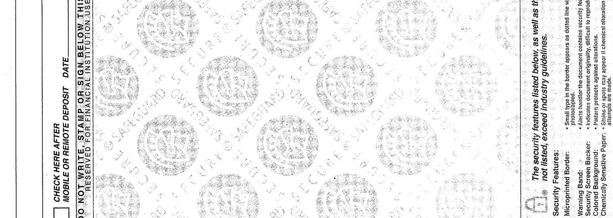
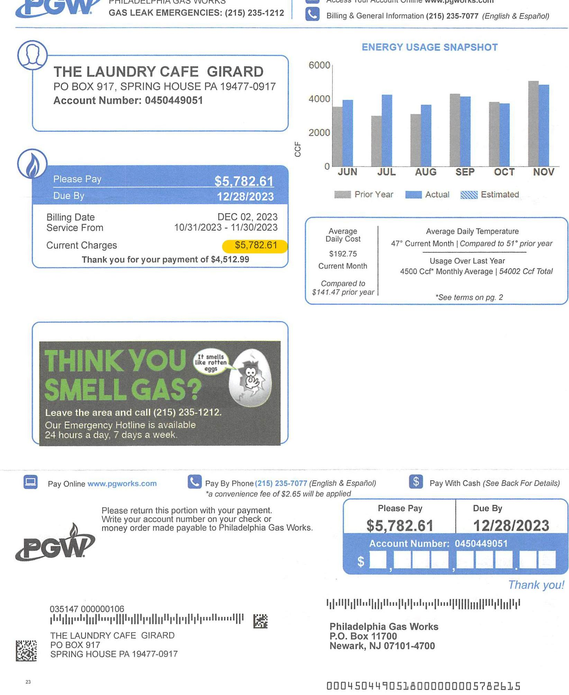
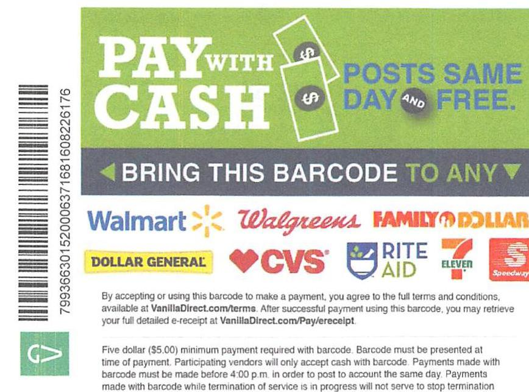
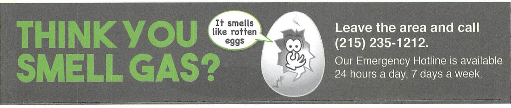

Please return this portion with your payment. Write your account number on your check or money order made payable to Philadelphia Gas Works.

035147 000000106
$11111111111111111111111111111111111111111111111111111111111111111111111111111111111111111111111111111111111111111111111111111111111111111111111111111111111111111111111111111111111111111111111111111111

THE LAUNDRY CAFE GIRARD LLC
901 WEST GIRARD AVENUE, SUITE 107
PHILADELPHIA, PA 19123

PAYISTHE Philadelphia Gas Works
Five thousand seven hundred eighty-two

MEMO AECT \# 0950499051

10 Bank
3-180/360

43329440994\%
$13-21-3033$
$5782.61$
$4 / 10$ dollars
$140087541^{\circ} 120350048081^{\circ} 43329440991^{\circ}$

# CHECK HERE AFTER MOBILE OR REMOTE DEPOSIT DATE 

DO NOT WRITE, STAMP OR SIGN, BELOW THIS LINE RESERVED FOR FINANCIAL INSTITUTION, USE

The image is a photo of a check or financial document. It includes the following text:

- "CHECK HERE AFTER MOBILE OR REMOTE DEPOSIT DATE"
- "DO NOT WRITE, STAMP OR SIGN, BELOW THIS LINE RESERVED FOR FINANCIAL INSTITUTION, USE"

The background features a repeating pattern of circular logos with the text "SECURE" and "GUARD" surrounding a central design. On the right side, there is a list of security features:

- "The security features listed below, as well as those not listed, exceed industry guidelines."
- "Security Features:"
- "Microprinted Border:"
- "Warning Band:"
- "Colored Background:"
- "Chemically Sensitive Paper:"

Additional text describes the purpose of these features, such as making the document difficult to reproduce and protecting against alterations.

The image is a photo of a billing statement from Philadelphia Gas Works for "THE LAUNDRY CAFE GIRARD." 

- **Embedded Text:**
  - "PHILADELPHIA GAS WORKS"
  - "GAS LEAK EMERGENCIES: (215) 235-1212"
  - "Access Your Account Online www.pgworks.com"
  - "Billing & General Information (215) 235-7077 (English & Español)"
  - "THE LAUNDRY CAFE GIRARD"
  - "PO BOX 917, SPRING HOUSE PA 19477-0917"
  - "Account Number: 0450449051"
  - "Please Pay $5,782.61"
  - "Due By 12/28/2023"
  - "Billing Date DEC 02, 2023"
  - "Service From 10/31/2023 - 11/30/2023"
  - "Current Charges $5,782.61"
  - "Thank you for your payment of $4,512.99"
  - "ENERGY USAGE SNAPSHOT"
  - "CCF"
  - "JUN JUL AUG SEP OCT NOV"
  - "Prior Year Actual Estimated"
  - "Average Daily Cost $192.75"
  - "Current Month Usage Over Last Year 4500 Ccf Monthly Average | 54002 Ccf Total"
  - "Compared to $141.47 prior year"
  - "Average Daily Temperature 47° Current Month | Compared to 51° prior year"
  - "*See terms on pg. 2"
  - "THINK YOU SMELL GAS?"
  - "Leave the area and call (215) 235-1212."
  - "Our Emergency Hotline is available 24 hours a day, 7 days a week."
  - "Pay Online www.pgworks.com"
  - "Pay By Phone (215) 235-7077 (English & Español)"
  - "*a convenience fee of $2.65 will be applied"
  - "Pay With Cash (See Back For Details)"
  - "Please return this portion with your payment. Write your account number on your check or money order made payable to Philadelphia Gas Works."
  - "Philadelphia Gas Works P.O. Box 11700 Newark, NJ 07101-4700"
  - "035147 0000000106"
  - "THE LAUNDRY CAFE GIRARD PO BOX 917 SPRING HOUSE PA 19477-0917"
  - "0004504490518000000005782615"

- **Graph/Chart:**
  - Type: Bar chart
  - Title: "ENERGY USAGE SNAPSHOT"
  - Y-axis: "CCF" ranging from 0 to 6000
  - X-axis: "JUN JUL AUG SEP OCT NOV"
  - Legend: "Prior Year" (gray), "Actual" (blue), "Estimated" (light blue)
  - Notable styling: Blue bars represent actual usage, gray bars represent prior year usage, and light blue bars represent estimated usage.
  - **Yearly usage breakdown (monthly-based)** is depicted with bars for each month from June to November.

# (1) PHONE 

Gas Leaks \& Emergencies (24/7)
(215) 235-1212

Residential Customer Service (8am to 6pm, M-F)
(215) 235-1000

Commercial Customer Service (8am to 4:30pm, M-F)
(215) 235-7077

Credit \& Collections (8am to 4:30pm, M-F)
(215) 235-1777

Report Theft of Gas (24/7)
(215) 684-6383

## TERMS

## How's my gas measured?

CCF - 100 cubic feet of gas. This is a measure of gas usage. One CCF is about the amount of gas used to run an average-sized house heater nonstop for one hour.
Dekatherms (DTH) - A measure of the heat content value of gas. Gas usage is determined by multiplying the MCF used by the heat content value of the gas.
MCF - 1,000 cubic feet of gas. This is a measure of gas usage.

## Other Helpful Terms

Budget Bill - An optional billing method which averages estimated service costs over a 12-month period.
Customer Responsibility Program (CRP) - PGW's low income customer assistance program which provides a lower monthly bill and forgiveness of pre-program debt.

Meter Reading Information - PGW uses its best effort to obtain an actual meter reading regularly, and at least every six months for customers without automatic meter reading devices. When the meter is not read, PGW estimates your gas use. To avoid estimates, you may read your own meter and call us with the reading. We also offer stamped, preaddressed postcards, which you can use to send us your meter reading by the specified date. To request a supply of these cards, call (215) 235-1000, or write us at P.O. Box 3500, Philadelphia, PA 19122.

Natural Gas Distribution Company (NGDC) - A state regulated natural gas utility which owns the gas lines and equipment necessary to deliver natural gas to the consumer. PGW is an NGDC.

## What are my charges?

*See the PGW Gas Service tariff on pgworks.com for full details.
Commodity Charges - The charge for basic gas supply service which is sold either by volume (CCF or MCF) or heating value (DTH). These charges are passed along to customers at the price PGW pays, with no markup.
Customer Charges - A monthly charge to cover NGDC costs such as maintaining the lines, meter reading and billing.

Distribution Charges - The charge for delivery of natural gas from the point of receipt by the NGDC to the customer.

Distribution System Improvement Charge (DSIC) - A charge approved by the Pennsylvania Public Utility Commission (PUC) for recovery of the reasonable and prudent costs incurred to repair, improve, or replace eligible distribution property. A DSIC provides PGW with the resources to accelerate the replacement of aging infrastructure.

Gas Cost Adjustments - Amount billed or credited each month to account for differences between projected and actual gas supply costs of the NGDC.

Weather Normalization Adjustment - An adjustment approved by the PUC as a way to help PGW stabilize its income and operate more efficiently within its budget during the heating season.

The image is a promotional illustration featuring payment instructions and a barcode for cash payments. 

Embedded text includes:

- "PAY WITH CASH"
- "POSTS SAME DAY AND FREE."
- "BRING THIS BARCODE TO ANY"
- Logos of participating stores: Walmart, Walgreens, Family Dollar, Dollar General, CVS, Rite Aid, 7-Eleven, Speedway.
- Barcode number: "7993663015200006371681608226176"
- "By accepting or using this barcode to make a payment, you agree to the full terms and conditions, available at VanillaDirect.com/terms. After successful payment using this barcode, you may retrieve your full detailed e-receipt at VanillaDirect.com/Pay/ereceipt."
- "Five dollar ($5.00) minimum payment required with barcode. Barcode must be presented at time of payment. Participating vendors will only accept cash with barcode. Payments made with barcode must be made before 4:00 p.m. in order to post to account the same day. Payments made with barcode while termination of service is in progress will not serve to stop termination of service. For eligible accounts only."

The barcode is positioned vertically on the left side of the image. The text and logos are centered and arranged in a visually organized manner.

Five dollar ( $\$ 5.00$ ) minimum payment required with barcode. Barcode must be presented at time of payment. Participating vendors will only accept cash with barcode. Payments made with barcode must be made before 4:00 p.m. In order to post to account the same day. Payments made with barcode while termination of service is in progress will not serve to stop termination of service. For eligible accounts only.

## RIGHTS \& OBLIGATIONS

A summary of your rights and obligations as a PGW customer will be made available upon request. A rate schedule and an explanation of how to verify the accuracy of a bill and an explanation of the various charges will be made available upon request.

## SUPPLIER INFORMATION

If you have selected a Natural Gas Supplier other than PGW, the natural gas supplier is responsible for determining the rates billed for supplier charges. PGW will bill for gas delivery according to the tariff for your rate class. Commodity prices and charges are set by the Natural Gas Supplier you have chosen. The Public Utility Commission regulates the distribution prices and services.

901 W GIRARD AVE, Unit 107 | SA ID: 1356819369 Commercial Heat \& Domestic

## BREAK DOWN OF CHARGES

Supply Charges
Commodity Charge 4,844 Ccf @ \$0.49387
Total Supply Charges
Delivery Charges
Customer Charge @ \$25.35
Distribution Charge 4,844 Ccf @ \$0.69781
Distribution System Improvement Charge 7.5\%
Gas Cost Adjustment @ -\$0.13612
Weather Normalization Adjustment
Total Delivery Charges
CITY SALES TAX 1\% OF \$5,354.27
STATE/CITY SALES TAX 7\% OF \$5,354.27
Total Billing Charges

## METER DETAILS

| Meter Number: | 02123498 |
| :-- | :-- |
| Read Cycle: | 01 |
| Read Dates: | $10 / 31 / 2023-11 / 30 / 2023$ |
| Multiplier: | 1.0000 |
| Gas Pressure Factor: | 1.000 |
| Starting Read: | 483955 Actual |
| Ending Read: | 488799 Actual |
| Usage in CCF: | 4,844.00 |
| Conversion Factor: | 1.0358 Therm $=1 \mathrm{CCF}$ |
| Usage in Therms: | $5,017.41$ |
| Next Meter Read: | $01 / 02 / 2024$ |

## SHOPPING INFORMATION BOX

When shopping for Natural Gas with a Natural Gas Supplier, please provide the following:
PGW Account: 0450449051
Service Point ID: 4534316158
Rate Class: General Service Commercial
Rate Schedule: GSC
If you are already shopping know your contract expiration date

# PAYMENTS RECEIVED 

11/27/2023 Check \$4,512.99
Total Payments \$4,512.99

The image is a graphic illustration with the following text:

"THINK YOU SMELL GAS? It smells like rotten eggs. Leave the area and call (215) 235-1212. Our Emergency Hotline is available 24 hours a day, 7 days a week."

The illustration features a cartoon egg with a face, appearing to speak the phrase "It smells like rotten eggs." The text is arranged with "THINK YOU SMELL GAS?" on the left, the cartoon egg in the center, and the emergency contact information on the right. The background is dark, and the text is in contrasting colors for emphasis.

## PGW Messages

Dec. 1, 2023, Commodity Charge increased to $\$ 0.52559$ per CCF. Gas Cost Adjustment increased to - $\$ 0.11765$. Distribution Charge increased to $\$ 0.70661$. The changes will increase the typical commercial heating bill by about $\$ 190.88$ a year.

Your estimated gas price to Compare (PTC) is $\$ 0.40872$ per CCF. This estimated PTC was calculated by averaging PGW's quarterly PTC over 12 months and is subject to change every quarter. For a more accurate PTC please visit pagasswitch.com.

Questions or complaints about your bill?
Please call us before the due date at (215) 235-7077, or write to: PGW P.O. Box 3500, Phila., PA 19122-0050

