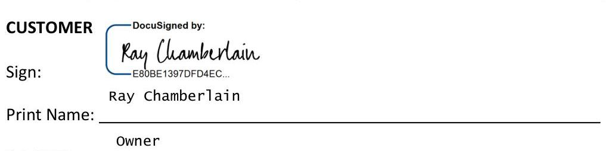

The Laundry Cafe LLC ("Customer") and Constellation NewEnergy - Gas Division, LLC ("CNEG") enter into this Natural Gas Supply Agreement, including the attached General Terms and Conditions (the "Natural Gas Agreement") effective January 16, 2024 (the "Effective Date"). Generally, the words "you" and "your" refer to the Customer listed above and the words "we" and "us" refer to CNEG, unless the context clearly requires otherwise. This Natural Gas Agreement is intended to govern the purchase and sale of natural gas and related services ("Gas") between us, each a "Transaction," which may be memorialized in a transaction confirmation ("TC") that is subject to this Natural Gas Agreement. Both of us may further agree to implement certain strategies or services which will be set forth in a Rider signed by both of us (each a "Rider"). If a conflict arises between (i) a TC, (ii) a Rider, or (iii) the Natural Gas Agreement, the terms shall govern in the priority listed in this sentence. All TCs and Riders together with this Natural Gas Agreement form a single integrated agreement and are sometimes herein collectively referred to as the "Agreement".

Purchase and Sale of Natural Gas. You will purchase from us and we will supply, or cause to be supplied, the Contract Quantity for your Facilities as specified in a TC or Rider, subject to the terms and conditions of the Agreement. You authorize us to enroll the Facilities with the Utility so that we can supply those Facilities. You will take such actions as we request to allow us to enroll the Facilities in a timely manner. You authorize us to take such actions we deem necessary to enroll the Facilities with the Utility as Facilities to be served by us and otherwise meet our obligations under this Agreement, including executing on your behalf any documents necessary to effectuate any Facility enrollment or election, undertaking the management of any storage or transportation capacity allocated to you by the Utility or other transporter(s), disposing of storage balances, adding or deleting Facilities as necessary, and receiving Usage Nominations from the Utility relating to your Gas requirements. We shall deliver the Contract Quantity to the Delivery Point(s) where risk of loss and title shall transfer to you. You agree that we may select such sources and service levels of Gas as we deem appropriate to meet our obligations under the Agreement. Our delivery obligation and your receipt obligation under this Agreement shall be set forth on a TC or Rider as Firm, Secondary Firm, Interruptible, or otherwise as agreed in the Transaction.

Term. This Natural Gas Agreement will commence on the Effective Date and will continue until terminated by either of us upon thirty (30) days written notice; provided any TC or Rider will continue to be governed by this Natural Gas Agreement until the TC or Rider has been separately terminated or expired. CNEG shall not be liable for any failure to enroll or drop a Facility by any applicable start and end date(s) set forth in the TC or Rider due to circumstances beyond its control.

Transaction Confirmation Procedure. You may enter into Transactions with us at any time by written transmission, electronic transmission, facsimile or other written record, or verbally, in person or by telephone (which we both acknowledge may be on a recorded telephone line) with the offer by one party and acceptance by the other party constituting our legally binding agreement. Nothing in this Agreement shall obligate either of us to enter into a Transaction at any time and your mere request to purchase Gas from us hereunder shall not constitute acceptance until we have clearly accepted such offer. Any applicable requirement that a Transaction be "in writing" and "signed" shall be deemed to have been satisfied by this Natural Gas Agreement, by our signatures below and our express agreement to these procedures. You agree that CNEG shall have the exclusive right to confirm any Transaction by sending you a written TC, in the form attached hereto as Exhibit A or otherwise, by facsimile, electronic transmission or other means. Notwithstanding any provision to the contrary in this Agreement, failure to send a TC shall not invalidate a Transaction agreed to by both of us. All agreed upon Transactions shall be subject to the terms and conditions of this Natural Gas Agreement, and each TC is incorporated herein. If we send a TC and you fail to object in writing to any term in the TC within two (2) business days, the TC shall constitute the definitive written expression of the Transaction.

Price. You will pay the price for Gas (the "Contract Price") as set forth in the applicable TC or Rider. To the extent (a) there are beginning of the month nominated volumes where the price is not fixed, (b) a Facility requires additional gas in excess of the nominated or fixed quantities set forth in a TC or Rider, or (c) a Facility continues to receive Gas from us beyond the term of the TC or Rider (where such Gas will be considered month to month), all such Gas will be priced at the Market Price. In addition to the Contract Price or Market Price, as applicable, you will be responsible to pay all such other amounts related to effectuating Transactions and the purchase and delivery of Gas, which will include, but not be limited to, amounts for (i) Taxes related in any way to the Contract Price, any services provided or the Gas at and after the Delivery Point, and (ii) transportation charges at and after the Delivery Point and related Taxes, which may be billed separately by the Utility.

Your Invoice. Your invoices will contain all CNEG charges applicable to Gas usage, including Taxes (which are passed through to you). If you are exempt from any Taxes, you shall provide CNEG with any state and/or local exemption certificate prior to the issue date of your first invoice. If you are eligible for and have elected to receive a single bill from us ("CNEG Consolidated Billing"), we will invoice you for all Utility charges and related Taxes. Otherwise, the Utility will invoice you for all Utility Charges and related Taxes. All amounts charged are due in full 15 days from receipt of invoice or such other date set forth in a Rider. Invoices will be based on actual data provided by the Utility, provided that if we do not receive actual data in a timely manner, we shall have the right to invoice you based on estimated information. Once actual data is received, we will reconcile the estimated charges and adjust them as needed in subsequent invoices. If you fail to make payment by the due date, interest will accrue daily on outstanding amounts from the due date until the bill is paid in full at a rate of $1.5 \%$ per month, or the highest rate permitted by law, whichever is less; and we may withhold any payments due to the Utility until we receive such payments.

CNKG Notice Information:
9400 Bunsen Parkway, Suite 100, Louisville, KY 40220
Attention: Contracts Administration
Telephone: (502) 426-4500 Facsimile: (502) 214-6381
Email: \#CNEGasContracts@constellation.com

Customer Notice Information
Attention: Ray Chamberlain
Title: Owner
Address: 4424 North Broad Street, Philadelphia, PA 19140
Phone:
Facsimile:
Email: ray@thelaundrycafe.com
For Invoices (if different from Notice Information)
Attention: Ray Chamberlain
Title: Owner
Address: 4424 North Broad Street, Philadelphia, PA 19140
Phone:
Facsimile:
Email: ray@thelaundrycafe.com
For Transaction Confirmations (if different from Notice Information)
Attention: Ray Chamberlain
Title: Owner
Address: 4424 North Broad Street, Philadelphia, PA 19140
Phone:
Facsimile:
Email: ray@thelaundrycafe.com

# IN WITNESS WHEREOF, THE PARTIES HAVE EXECUTED THIS DOCUMENT THROUGH THEIR DULY AUTHORIZED REPRESENTATIVES. 

## CNEG

Sign:
Print Name: $\qquad$ Amanda Stewart
Print Title: $\qquad$ Vice President - Retail Ops

The image is a section of a document with a signature block for a customer. 

- The text "CUSTOMER" is at the top left.
- Below, there is a digital signature area labeled "DocuSigned by:" with a signature.
- Underneath the signature, there is a code: "E80BE1397DFD4EC..."
- The label "Sign:" is followed by the name "Ray Chamberlain."
- "Print Name:" is followed by a blank line.
- Below the line, the title "Owner" is written.

## GENERAL TERMS AND CONDITIONS

## 1. Definitions.

"Contract Quantity" means the quantity of Gas to be delivered and received as agreed in the applicable TC or Rider.
"Delivery Point(s)" means the city gate interconnection between the Utility and the upstream transporter or such other delivery point(s) as are agreed in a TC or Rider. However, to the extent that you own transportation capacity, which is used to deliver Gas to you, the Delivery Point shall be the receipt point of such capacity.
"Facility" means your facility or Utility account to which CNEG is providing Gas under this Agreement (collectively, the "Facilities").
"Firm" means deliveries and receipts may not be interrupted without liability except for reasons of Force Majeure.
"Interruptible" means deliveries and receipts may be interrupted at any time for any reason except for Customer's obligation to take and pay for gas it nominates and CNEG's obligation to honor the price set forth in the TC.
"Market Price" means a price comprised of (i) the spot commodity cost of Gas as determined by us in our reasonable discretion, (ii) all related interstate and intrastate pipeline charges required to deliver Gas to the Delivery Point, and (iii) a reasonable market based margin.
"Secondary Firm" means deliveries and receipts will be on a commercially reasonable efforts basis. We may interrupt its performance without liability to the extent that one or more of the following conditions are present: i) Force Majeure; ii) curtailment by your Utility; iii) curtailment of supply by a Gas supplier; iv) curtailment of storage by a storage provider; v) curtailment of transportation by a transporter, including, but not limited to, transportation between secondary firm points; vi) recall of transportation capacity release by its releasor; or vii) curtailment of Gas production behind a specific meter. If we interrupt for any other reason, your exclusive remedy shall be that you may recover damages as provided in Section 2.
"Taxes" means all taxes, duties, fees, levies, premiums or any other charges of any kind, whether direct or indirect, relating to the sale, purchase or delivery of Gas, together with all interest, penalties or other additional amounts imposed, including but not limited to gross receipts, sales, consumption, use, value added, commercial activity or other privilege tax, and any other tax (whether in effect as of the Effective Date of this Agreement or thereafter) imposed by any governmental entity.
"Usage Nomination" is your nomination of your expected Gas requirements, including without limitation (i) any such nomination by the Utility with respect to your Facilities, (ii) any such nomination made by us as provided in this Agreement or any TC or Rider.
"Utility" means the local Gas distribution utility owning and/or controlling the distribution system required for delivery of Gas to the Facilities.
2. Failure to deliver or receive Gas. The sole and exclusive remedy of the parties in the event of a breach of an obligation to deliver or receive Gas (other than Interruptible) shall be the following: If we fail to deliver Gas for a reason other than your breach, we shall pay you the "Replacement Cost," which is the amount you actually pay to replace the undelivered Contract Quantity less the amount you would have paid under this Agreement for such Contract Quantity. (b) If you fail to receive Gas for a reason other than our breach, you shall pay us the "Revenue Loss," which is the amount that we would have received for the sale of the unreceived Contract Quantity pursuant to this Agreement less (i) the amount we actually receive in an alternate sale, plus any incremental costs, or (ii) if no alternate sale takes place, the amount we would have received by reselling such Contract Quantity at spot market prices at or near the Delivery Point(s), as we determine in a commercially reasonable manner. Both of us shall exercise commercially reasonable efforts to mitigate any Revenue Loss or Replacement Cost, respectively. If the calculation of the Replacement Cost or Revenue Loss results in a negative number, then the amount shall be deemed to equal zero.
3. Cash deposit and other security. At any time, we may require that you provide information to us so that we may evaluate your creditworthiness. We reserve the right to require that you make a cash deposit or provide other security acceptable to us in an amount acceptable to us immediately following our demand if your financial obligations to us increase under this Agreement, or if, in our opinion, your credit, payment history, or ability to pay your bills as they come due becomes a concern. You will deliver any required cash deposit or other
required security (or any increase therein) within three (3) business days of our request.
4. Nomination and Imbalances. (a) If you or the Utility fail to provide us with a Usage Nomination for any month in a timely manner, we may establish a nomination for such month in a commercially reasonable manner based upon your historical usage data available to us. We shall be entitled to rely on any Usage Nominations received from the Utility or that we establish in accordance with this paragraph. Usage Nominations may be made verbally, in writing, by facsimile, or by other electronic transmission. (b) We shall both use commercially reasonable efforts to avoid imposition of any fees, penalties, cash-outs, costs or charges assessed by a transporter for failure to satisfy the transporter's balancing and/or nomination requirements ("Imbalance Charges"). If Imbalance Charges are incurred as a result of your receipt of quantities of Gas greater than or less than the quantity of Gas confirmed by transporter(s), then you shall be responsible for such Imbalance Charges. If Imbalance Charges are incurred as a result of our delivery of quantities of Gas greater than or less than the quantity of Gas confirmed by transporter(s), then we shall be responsible for such Imbalance Charges.
5. Default under this Agreement. You will be in default under this Agreement if you fail to: pay your bills on time and in full; provide cash deposits or other security as required by Section 3 above; or perform all material obligations under this Agreement (other than a failure to receive gas) and you do not cure such default within five (5) days of written notice from us; or if you declare or file for bankruptcy or otherwise become insolvent or unable to pay your debts as they come due. We will be in default under this Agreement if we fail to perform all material obligations under this Agreement (other than a failure to deliver gas) and do not cure such default within five (5) days written notice from you, or if we declare or file for bankruptcy or otherwise become insolvent or unable to pay our debts as they come due.
6. Remedies upon default. If you are in default under this Agreement, in addition to any other remedies available to us, we may terminate this Agreement entirely, or solely with respect to those Facilities affected by such default, and switch your Facilities back to Utility service (consistent with applicable regulations and Utility practices); and/or require that you compensate us for all losses we sustain due to your default, including: - payment of all amounts you owe us for natural gas provided to you; - when the Agreement is terminated early (entirely or as to certain Facilities), payment of an amount (that we will calculate using our reasonable judgment) equal to the positive difference between (A) the dollar amount you would have paid to us under this Agreement had it not been terminated early and (B) the dollar amount we could resell such natural gas for to a third party under then-current market conditions; and all costs (including attorneys' fees, expenses and court costs) we incur in collecting amounts you owe us under this Agreement. The parties agree that any early termination payment determined in accordance with this Section is a reasonable approximation of harm or loss, and is not a penalty or punitive in any respect, and that neither party is required to enter into a replacement transaction to determine or be entitled to a termination payment.
7. Changes in law. We may pass through or allocate, as the case may be, to you any increase or decrease in our costs related to the natural gas and related products and services sold to you that results from the implementation of new, or changes (including changes to formula rate calculations) to existing, Laws, or other requirements or changes in administration or interpretation of Laws or other requirements. "Law" means any law, rule, regulation, ordinance, statute, judicial decision, administrative order, Utility or transporter business practices or protocol, Utility or transporter tariff, rule of any commission or agency with federal jurisdiction or jurisdiction in the state in which the Facilities are located. Such additional amounts will be included in your subsequent invoices. The changes described in this Section may change any or all of the charges described in this Agreement.

## 8. Force Majeure and Transporter Restrictions. "Force Majeure"

means an event that is beyond either of our reasonable control that prevents either of us from performing our obligations under this Agreement. If a Force Majeure event occurs, then the affected party will be relieved from performance until the situation is resolved. Examples of Force Majeure events include: acts of God, fire, war, terrorism, flood,

earthquake; declaration of emergency by a governmental entity or the Utility, curtailment, disruption or interruption of Gas transmission, distribution or supply (including without limitation as the result of an OFO, as defined below); regulatory, administrative, or legislative action, or action or restraint by court order or other governmental entity; actions taken by third parties not under either of our control, such as a Utility. Such events shall not excuse failure to make payments due in a timely manner for Gas we supply. Each of us will use commercially reasonable efforts to give notice (which may be by electronic means) to the other in a timely manner of any operational flow orders or other usage or flow restrictions ("OFO") from the applicable pipelines or utilities and shall take all required steps to comply with such orders. Each of us will take all commercially reasonable actions required by the OFO within the time prescribed. If OFO penalties, charges, fees, costs or expenses result from the actions or inactions of one of us, then such party shall be solely responsible for any such penalties, charges, fees, costs or expenses. We both agree that OFOs may require one or both of us to buy or sell Gas quantities in the then-current market conditions, which may be appreciably higher or lower than the original pricing.
9. Indemnification. BEFORE TITLE PASSES TO YOU AT THE DELIVERY POINT CNEG SHALL, AND AFTER TITLE PASSES AT THE DELIVERY POINT YOU SHALL. DEFEND, INDEMNIFY AND HOLD HARMLESS THE OTHER PARTY AND ITS AFFILIATES, AND ALL OF THER RESPECTIVE OFFICERS, DIRECTORS, SHAREHOLDERS, EMPLOYEES, AGENTS, REPRESENTATIVES, SUCCESSORS AND ASSIGNS, FROM AND AGAINST ALL CLAIMS, LOSSES, EXPENSES (INCLUDING REASONABLE ATTORNEYS' FEES AND COURT COSTS), DAMAGES, DEMANDS, JUDGMENTS, CAUSES OF ACTION OR SUITS OF ANY KIND, INCLUDING BUT NOT LIMITED TO, CLAIMS FOR PERSONAL INJURY, DEATH, OR PROPERTY DAMAGE, TO THE EXTENT ARISING OUT OF OR RELATED TO THIS AGREEMENT.
10. Limitations. IN NO EVENT WILL EITHER PARTY OR ANY OF ITS AFFILIATES BE LIABLE FOR CONSEQUENTIAL, EXEMPLARY, SPECIAL, INCIDENTAL OR PUNITIVE DAMAGES, INCLUDING WITHOUT LIMITATION, LOST OPPORTUNITIES OR LOST PROFITS. Each party's total liability related to the Agreement, whether arising under breach of contract, tort, strict liability or otherwise, is limited to direct, actual damages. Direct actual damages payable to us will reflect the early termination calculation in Section 6. Each party agrees to use commercially reasonable efforts to mitigate damages it may incur. NO WARRANTY, DUTY, OR REMEDY, WHETHER EXPRESSED, IMPLIED OR STATUTORY, ON CNEG'S PART IS GIVEN OR INTENDED TO ARISE OUT OF THIS AGREEMENT, INCLUDING ANY WARRANTY OF MERCHANTABILITY OR FITNESS FOR A PARTICULAR PURPOSE OR USE. We will have no liability or responsibility for matters within the control of the Utility, which include maintenance of natural gas pipelines, service interruptions, loss or termination of service or meter readings.
11. Dispute Resolution. This Agreement will be governed by and interpreted in accordance with the laws of THE STATE OF NEW YORK without regard to any choice of law principles. BOTH PARTIES AGREE IRREVOCABLY AND UNCONDITIONALLY TO WAIVE ANY RIGHT TO A TRIAL BY JURY OR TO NITIATE OR BECOME A PARTY TO ANY CLASS ACTION CLAIMS WITH RESPECT TO ANY ACTION, SUIT OR PROCEEDING DIRECTLY OR INDIRECTLY ARISING OUT OF OR RELATING TO THIS AGREEMENT OR THE TRANSACTIONS CONTEMPLATED BY THIS AGREEMENT.
12. Relationship of Parties. We are an independent contractor and nothing in this Agreement establishes a joint venture, fiduciary relationship, partnership or other joint undertaking. You will not rely on us in evaluating the advantages or disadvantages of any specific product or service, predictions about future energy prices, or any other matter under this Agreement. Your decision to enter into this Agreement and any other decision or action you take is and will be based only upon your own analysis (or that of your advisors) and not on information or statements from us.
13. Confidentiality. Consistent with applicable regulatory requirements, we will keep confidential all information obtained by us from you related to the provision of services under this Agreement and which concern your energy characteristics and use patterns, except that we may disclose such information to our affiliates and such affiliates' employees, agents, advisors, and independent contractors. Except as
otherwise required by law, you will agree to keep confidential the terms of our Agreement, including price.
14. Miscellaneous Provisions. In the case of CNEG Consolidated Billing, you agree that (i) you remain exclusively liable to the Utility for all Utility charges, (ii) we have no obligation to review Utility charges for accuracy, and (iii) should you dispute Utility charges, that is a matter for you and the Utility to resolve without our involvement. If in any circumstance we do not provide notice of, or object to, any default on your part, such situation will not constitute a waiver of any future default of any kind. If any of this Agreement is held legally invalid, the remainder will not be affected and will be valid and enforced to the fullest extent permitted by law and equity, and there will be deemed substituted for the invalid provisions such provisions as will most nearly carry out our mutual intent as expressed in this Agreement. You may not assign or otherwise transfer any of your rights or obligations under this Agreement without our prior written consent. Any such attempted transfer will be void. We may assign our rights and obligations under this Agreement. This Agreement contains the entire agreement between us, supersedes any other agreements, discussions or understandings (whether written or oral) regarding the subject matter of this Agreement, and may not be contradicted by any prior or contemporaneous oral or written agreement. A facsimile or email copy of your signature will be considered an original for all purposes, and you will provide original signed copies upon request. Both of us acknowledge that any document generated with respect to this Agreement, including this Agreement, may be imaged and stored electronically and such imaged documents may be introduced as evidence in any proceeding as if such were original business records and neither of us shall contest their admissibility as evidence in any proceeding. Except as otherwise explicitly provided in this Agreement, no amendment (including in form of a purchase order you send us) to this Agreement will be valid or given any effect unless signed by both of us. Applicable provisions of this Agreement will continue in effect after termination or expiration of this Agreement to the extent necessary, including those for billing adjustments and payments, limitations of liability, indemnification and dispute resolution. We shall have the right to set-off and net any amounts owed to you against any amounts you owe us under this Agreement or any other agreement. This Agreement is a "forward contract" and we are a "forward contract merchant" under the U.S. Bankruptcy Code, as amended. Further, we are not providing advice regarding "commodity interests", including futures contracts and commodity options or any other matter, which would cause us to be a commodity trading advisor under the U.S. Commodity Exchange Act, as amended ("CEA"). You agree that your purpose in entering into this Agreement is not speculation, but rather price volatility control and/or budget management for procurement of Gas for one or more of your Facilities and if any transaction hereunder gives you the right to adjust the Contract Quantity or to require CNEG to provide some other quantity of gas, your election to exercise such right is based on supply and demand factors related to your business. You represent that you qualify as an "eligible contract participant" as the same is defined under the CEA. We will send all notices, invoices and TCs to the address or email provided in this Agreement unless directed otherwise. Your authorization of us to your Utility as a recipient of your gas billing and usage data will remain in effect during the term of this Agreement unless you rescind the authorization upon written notice to us. We reserve the right to cancel this Agreement in the event you rescind this authorization. To the extent you are represented by a broker, agent, association or other third party (collectively, "Broker"), you acknowledges and understand that (i) the broker is your representative and does not represent CNEG, (ii) we may be making a payment to Broker in connection with Broker's facilitation of you and CNEG entering into a Transaction, and (iii) unless otherwise noted, the Contract Price reflects any fee paid to Broker.

# EXHIBIT A - FORM OF TRANSACTION CONFIRMATION* 

*The actual Transaction Confirmation entered into between Customer and CNEG may differ from this form to reflect state regulatory and other local requirements and terms applicable to the Facility. This Form of Transaction Confirmation is for illustrative purposes only and CNEG reserves the right to alter the form of this Transaction Confirmation at any time.

This Transaction Confirmation is delivered pursuant to and in accordance with a Master Retail Natural Gas Supply Agreement effective $\qquad$ . 20 (the "Master Agreement"), by and between Constellation NewEnergy - Gas Division, LLC ("CNEG") and
$\qquad$ ("Customer"), and is subject to and made part of the terms and conditions of such Master Agreement. Capitalized terms used herein but not defined will have the meanings ascribed to them in the Master Agreement.

Trade Date:
Buyer:
Seller:
Facility Name:
Delivery Period:
Nature of Parties' Obligation:
Deal Type:
Contract Quantity/Price:

| Month/Yr | Contract Quantity (in   MMBtu) | Contract Price |
| :-- | :-- | :-- |
|  |  |  |
|  |  |  |

Incremental Pricing:
Delivery Point(s):
Utility:
Default Service: $\quad$ To the extent a Facility continues to receive gas from CNEG beyond the Delivery Period, all such gas will be considered month to month purchases and will be priced at the Market Price.

Special Provisions:

This Transaction Confirmation documents an agreement previously reached by authorized representatives of the Parties. Unless disputed by Customer in writing within two (2) business days of Constellation's execution date, or such time frame as specified in the Master Agreement, it is binding and shall be deemed accepted.

## CONSTELLATION NEWENERGY - GAS DIVISION, LLC

By:
Name:
Title:
Date:

## CUSTOMER

By: SAMPLE
Name: NOT FOR EXECUTION
Title:
Date: $\qquad$

# DocuSign 

## Certificate Of Completion

Envelope Id: FD205313812E4835B16DB23972DF4860
Subject: Constellation Contract for Execution: The Laundry Cafe LLC - RG-31045864
Source Envelope:
Document Pages: 5 Signatures: 0
Certificate Pages: 5
AutoNav: Enabled
Envelopeld Stamping: Enabled
Time Zone: (UTC-05:00) Eastern Time (US \& Canada)

## Record Tracking

| Status: Original | Holder: CNE Gas Contracts | Location: DocuSign |
| :--: | :--: | :--: |
| $1 / 16 / 20241: 46: 49$ PM | \#CNEGasContracts@constellation.com |  |
| Signer Events | Signature | Timestamp |
| anthony.gareri@powerkiosk.com   anthony.gareri@powerkiosk.com   Security Level: Email, Account Authentication (None)   Electronic Record and Signature Disclosure:   Accepted: 4/26/2023 4:16:49 PM   ID: ce8165fa-501e-425f-82ab-993411d340d9 |  |  |
| In Person Signer Events | Signature | Timestamp |
| Editor Delivery Events | Status | Timestamp |
| Agent Delivery Events | Status | Timestamp |
| Intermediary Delivery Events | Status | Timestamp |
| Certified Delivery Events | Status | Timestamp |
| Carbon Copy Events | Status | Timestamp |
| Karin Hammond   karin.hammond@constellation.com   Security Level: Email, Account Authentication (None)   Electronic Record and Signature Disclosure: Not Offered via DocuSign | COPIED | Sent: 1/16/2024 1:46:52 PM   Viewed: 1/16/2024 1:47:21 PM |
| Sean Samsel   sean.samsel@constellation.com   Security Level: Email, Account Authentication (None)   Electronic Record and Signature Disclosure: Not Offered via DocuSign | COPIED |  |
| Witness Events | Signature | Timestamp |
| Notary Events | Signature | Timestamp |
| Envelope Summary Events | Status | Timestamps |
| Envelope Sent | Hashed/Encrypted | $1 / 16 / 20241: 46: 52$ PM |

# Payment Events 

Status
Electronic Record and Signature Disclosure

# ELECTRONIC RECORD AND SIGNATURE DISCLOSURE 

From time to time, Constellation Energy (we, us or Company) may be required by law to provide to you certain written notices or disclosures. Described below are the terms and conditions for providing to you such notices and disclosures electronically through the DocuSign system. Please read the information below carefully and thoroughly, and if you can access this information electronically to your satisfaction and agree to this Electronic Record and Signature Disclosure (ERSD), please confirm your agreement by selecting the check-box next to 'I agree to use electronic records and signatures' before clicking 'CONTINUE' within the DocuSign system.

## Getting paper copies

At any time, you may request from us a paper copy of any record provided or made available electronically to you by us. You will have the ability to download and print documents we send to you through the DocuSign system during and immediately after the signing session and, if you elect to create a DocuSign account, you may access the documents for a limited period of time (usually 30 days) after such documents are first sent to you. After such time, if you wish for us to send you paper copies of any such documents from our office to you, you will be charged a $\$ 0.00$ per-page fee. You may request delivery of such paper copies from us by following the procedure described below.

## Withdrawing your consent

If you decide to receive notices and disclosures from us electronically, you may at any time change your mind and tell us that thereafter you want to receive required notices and disclosures only in paper format. How you must inform us of your decision to receive future notices and disclosure in paper format and withdraw your consent to receive notices and disclosures electronically is described below.

## Consequences of changing your mind

If you elect to receive required notices and disclosures only in paper format, it will slow the speed at which we can complete certain steps in transactions with you and delivering services to you because we will need first to send the required notices or disclosures to you in paper format, and then wait until we receive back from you your acknowledgment of your receipt of such paper notices or disclosures. Further, you will no longer be able to use the DocuSign system to receive required notices and consents electronically from us or to sign electronically documents from us.

All notices and disclosures will be sent to you electronically

Unless you tell us otherwise in accordance with the procedures described herein, we will provide electronically to you through the DocuSign system all required notices, disclosures, authorizations, acknowledgements, and other documents that are required to be provided or made available to you during the course of our relationship with you. To reduce the chance of you inadvertently not receiving any notice or disclosure, we prefer to provide all of the required notices and disclosures to you by the same method and to the same address that you have given us. Thus, you can receive all the disclosures and notices electronically or in paper format through the paper mail delivery system. If you do not agree with this process, please let us know as described below. Please also see the paragraph immediately above that describes the consequences of your electing not to receive delivery of the notices and disclosures electronically from us.

# How to contact Constellation Energy: 

You may contact us to let us know of your changes as to how we may contact you electronically, to request paper copies of certain information from us, and to withdraw your prior consent to receive notices and disclosures electronically as follows:
To contact us by email send messages to: CNEGTransactionConfirmations@constellation.com

## To advise Constellation Energy of your new email address

To let us know of a change in your email address where we should send notices and disclosures electronically to you, you must send an email message to us
at CNEGTransactionConfirmations@constellation.com and in the body of such request you must state: your previous email address, your new email address. We do not require any other information from you to change your email address.

If you created a DocuSign account, you may update it with your new email address through your account preferences.

## To request paper copies from Constellation Energy

To request delivery from us of paper copies of the notices and disclosures previously provided by us to you electronically, you must send us an email
to CNEGTransactionConfirmations@constellation.com and in the body of such request you must state your email address, full name, mailing address, and telephone number. We will bill you for any fees at that time, if any.

## To withdraw your consent with Constellation Energy

To inform us that you no longer wish to receive future notices and disclosures in electronic format you may:

i. decline to sign a document from within your signing session, and on the subsequent page, select the check-box indicating you wish to withdraw your consent, or you may;
ii. send us an email to CNEGTransactionConfirmations@constellation.com and in the body of such request you must state your email, full name, mailing address, and telephone number. We do not need any other information from you to withdraw consent.. The consequences of your withdrawing consent for online documents will be that transactions may take a longer time to process..

# Required hardware and software 

The minimum system requirements for using the DocuSign system may change over time. The current system requirements are found here: https://support.docusign.com/guides/signer-guide-signing-system-requirements.

## Acknowledging your access and consent to receive and sign documents electronically

To confirm to us that you can access this information electronically, which will be similar to other electronic notices and disclosures that we will provide to you, please confirm that you have read this ERSD, and (i) that you are able to print on paper or electronically save this ERSD for your future reference and access; or (ii) that you are able to email this ERSD to an email address where you will be able to print on paper or save it for your future reference and access. Further, if you consent to receiving notices and disclosures exclusively in electronic format as described herein, then select the check-box next to 'I agree to use electronic records and signatures' before clicking 'CONTINUE' within the DocuSign system.

By selecting the check-box next to 'I agree to use electronic records and signatures', you confirm that:

- You can access and read this Electronic Record and Signature Disclosure; and
- You can print on paper this Electronic Record and Signature Disclosure, or save or send this Electronic Record and Disclosure to a location where you can print it, for future reference and access; and
- Until or unless you notify Constellation Energy as described above, you consent to receive exclusively through electronic means all notices, disclosures, authorizations, acknowledgements, and other documents that are required to be provided or made available to you by Constellation Energy during the course of your relationship with Constellation Energy.

