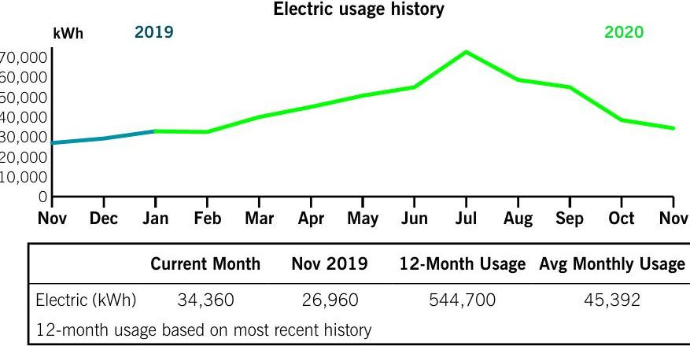

## Billing summary

Previous amount due
$\$ 3,379.74$
Payment received Nov 17
$3,379.74$
Dynegy Energy Services
Electric Generation Supply
1,714.56
Electric Delivery
Total amount due Dec 21
$\$ 3,226.95$

## Your usage snapshot

The image is a line chart titled "Electric usage history."

- **Chart Type**: Line chart
- **Axes**:
  - X-axis: Labeled with months from November to November
  - Y-axis: Labeled "kWh" with values ranging from 0 to 70,000
- **Lines**:
  - Two lines representing different years:
    - 2019: Blue line
    - 2020: Green line
- **Data Points**:
  - Current Month (Electric kWh): 34,360
  - Nov 2019 (Electric kWh): 26,960
  - 12-Month Usage: 544,700
  - Avg Monthly Usage: 45,392
- **Additional Text**:
  - "12-month usage based on most recent history"
- **Yearly Usage Breakdown (Monthly-Based)**: The chart shows monthly electric usage for 2019 and 2020, with a notable increase in usage during the summer months of 2020.

## Your Energy Bill

Service address
STANDARD AERO
11420 MOSTELLER RD
CINCINNATI OH 45241

## 5

Thank you for your payment.
In Case No. 20-344-EL-RDR, the PUCO approved an adjustment to Rider DSR, Distribution Storm Rider (part of the Delivery Riders) effective October 28, 2020. In Case No. 20-960-EL-UEX and 20-959-EL-UEX, the PUCO approved adjustments to Riders UE-ED and UE-GEN (Uncollectible Expense Riders) effective October 28, 2020.

Mail your payment at least 7 days before the due date or pay instantly at duke-energy.com/billing. Late payments are subject to a $1.5 \%$ late charge.

Please return this portion with your payment. Thank you for your business.

DUKE
ENERGY.
Duke Energy Return Mail
PO Box 1090
Charlotte, NC 28201-1090

## STANDARD AERO

11550 MOSTERLLAR RD
SHARONVILLE, OH 45241

## Amount due

$\$ 3,226.95$
by Dec 21

After Dec 21, the amount due will increase to $\$ 3,275.35$.

Add here, to help others with a contribution to HeatShare.

Amount enclosed

Duke Energy Payment Processing
PO Box 1326
Charlotte, NC 28201-1326

# We're here for you 

## Report an emergency

Electric/Gas outage
Electric
Gas
duke-energy.com/outages 800.543.5599
800.634.4300

## Convenient ways to pay your bill

Online
Automatically from your bank account
Speedpay (fee applies)
By mail payable to Duke Energy
In person
duke-energy.com/billing
duke-energy.com/autodraft
duke-energy.com/pay-now
800.544.6900

P.O. Box 1326

Charlotte, NC 28201-1326
duke-energy.com/location

Help managing your account (not applicable for all customers)
Register for free paperless billing
duke-energy.com/paperless
Home
duke-energy.com/manage-home
Business
duke-energy.com/manage-bus

## Correspond with Duke Energy

P.O. Box 1326

Charlotte, NC 28201

## Contact Duke Energy

Online
Call (Monday - Friday, 7 a.m. to 7 p.m.)
For hearing impaired TDD/TTY
duke-energy.com
800.544.6900
800.750 .7500

## General utility information or commission assistance

Public Utilities Commission of Ohio (PUCO)
Call (8 a.m. to 5 p.m.) 800.686.7826
Online
puco.ohio.gov
For hearing impaired TDD/TTY 937.643.4600 or 711
Ohio Consumers' Counsel (OCC)
Call (8 a.m. to 5 p.m.) 877.742.5622
Online
occ.ohio.gov

## Request the condensed or detailed bill format

Call (7a.m. to 7 p.m.)
800.544.6900

## Important to know

## Your next meter reading: Dec 29

Please be sure we can safely access your meter for actual readings. Don't worry if your digital meter flashes eights from time to time. That's a normal part of the energy measuring process.

## Your electric service may be disconnected if your payment is past due

If payment for your electric service is past due, we may begin disconnection procedures. If your service is disconnected because of a missed payment, you must pay the amount specified in the Important Disconnect Information section on your bill, as well as, a reconnection fee, before your service will be reconnected. The reconnection fee is $\$ 10$ for electric service that may be reconnected remotely, $\$ 69$ for electric service that is not eligible to be reconnected remotely, and $\$ 17$ for gas service. In such situations where both electric and gas service are disconnected for non-payment, the reconnection fee will not exceed $\$ 27$ for both.

## Failure to pay may result in a return to our standard offer for generation

Failure to pay charges for a competitive retail service may result in cancellation of your contract with the respective retail electric supplier. You will then be returned to Duke Energy Ohio's standard offer for generation services.

## Questions or complaints

If you have a question or complaint about your bill or service, please contact us via one of the contact options provided.

If your complaint is not resolved after contacting Duke Energy or if you need general utility information, please contact the Public Utilities Commission of Ohio (PUCO) or the Ohio Consumers' Counsel (OCC) via one of the contacts provided.

## When you pay by check

We may process the payment as a regular check or convert it into a one-time electronic check payment.

## Para nuestros clientes que hablan Español

Representantes bilingües están disponibles para asistirle de lunes a viernes de 7 a.m. 7 p.m. Para obtener más información o reportar problemas con su servicio eléctrico, favor de llamar al 800.544.6900.

# Your usage snapshot - continued 

## Current electric usage for meter number 108124188

| Actual reading on Nov 24 |  | 82173 |
| :--: | :--: | :--: |
| Previous reading on Oct 23 |  | - 80455 |
|  |  | 1,718 |
|  | Multiplier | $\times 20$ |
|  | Energy used | 34,360 kWh |
| kWh Usage | 34,360 Demand Read | 5.9 |
| Actual kW | 118 |  |

A kiswatt-hour ( kWh ) is a measure of the energy used by a 1,000 watt appliance in one hour. A 10-watt LED lightbulb would take 100 hours to use 1 kWh .
A multiplier is the factor that the meter reading is multiplied by to determine the correct energy usage.

## Billing details - Electric

| Meter - 108124188 |  |
| :--: | :--: |
| Rate DS01 - Distribution Service |  |
| Distribution-Customer Chg | $\$ 45.95$ |
| Delivery Charges |  |
| Distribution-Demand Chg |  |
| 118.00 KW @ \$5.6718 | 669.27 |
| Delivery Riders | 797.10 |
| Generation Riders | 0.07 |
| Total delivery charges | 1,512.39 |
| DYNEGY |  |
| Dynegy Energy Services |  |
| Supplier Energy Charge |  |
| 34,360 KWH @ \$0.0499 | 1,714.56 |
| Total Charges | \$3,226.95 |

Your current delivery rate with Duke Energy is Distribution Service (DS01)
For a complete listing of all Ohio rates and riders, visit duke-energy.com/rates

Your current generation rate with Dynegy Energy Services is DE44.Your Dynegy Energy Services account number is AOB1C000013EBUSUAO. If you have any questions about electric supplier service received from Dynegy Energy Services, please call them at 877-331-3045 or write to: 6555 Sierra Rd Irving, TX 75039

The charges for the current billing period include the following amounts to meet each of these Ohio requirements: Energy Efficiency $=\$ 146.10$, Peak Demand Reduction $=\$ 36.52$, and Renewable Energy $=\$ 29.69$.

Riders are costs the Public Utilities Commission of Ohio has approved to cover investments in improving the energy infrastructure or other additional expenses.

