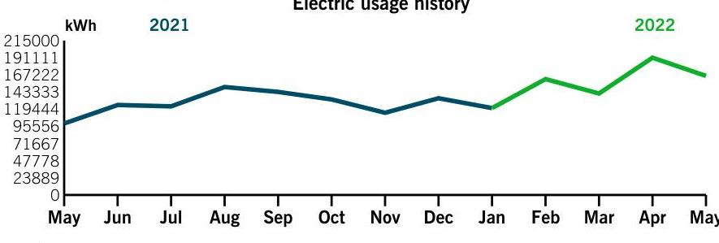
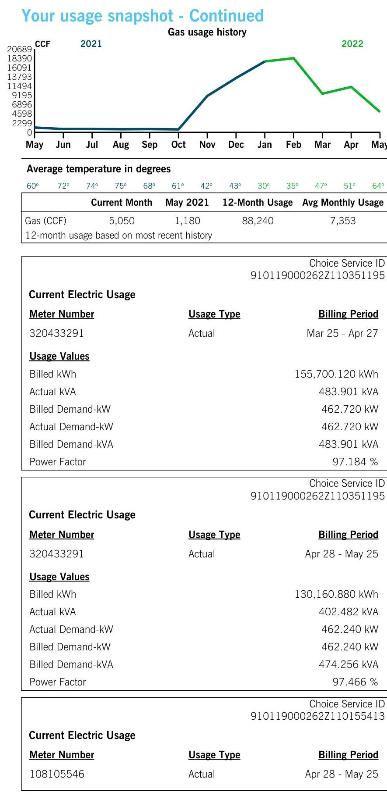

## Billing summary

| Previous Amount Due | \$17,389.89 |
| :--: | :--: |
| Payment Received Apr 19 | $-17,389.89$ |
| Electric Delivery | 13,039.40 |
| Gas Delivery | 2,443.09 |
| ENGIE Power \& Gas |  |
| Gas Generation Supply | $5,627.14$ |
| Dynegy Energy Services |  |
| Electric Generation Supply | 17,806.75 |
| Other Charges and Credits | 4.00 |
| Total Amount Due Jun 24 | \$38,920.38 |

## Your usage snapshot

The image is a line chart titled "Electric usage history." 

- **Chart Type**: Line chart
- **Y-Axis**: kWh, ranging from 0 to 215,000 with intervals at 23,889, 47,778, 71,667, 95,556, 119,444, 143,333, 167,222, 191,111.
- **X-Axis**: Months from May to May.
- **Legend/Colors**: 
  - 2021 data is represented in blue.
  - 2022 data is represented in green.
- **Data Points**: 
  - The chart shows a yearly usage breakdown (monthly-based) with a general increase from May 2021 to May 2022.
  - The line for 2021 starts lower and gradually increases, peaking around September, then declines towards December.
  - The line for 2022 starts higher in January, increases towards April, and slightly decreases in May.

Average temperature in degrees

| $60^{\circ}$ | $72^{\circ}$ | $74^{\circ}$ | $75^{\circ}$ | $68^{\circ}$ | $61^{\circ}$ | $42^{\circ}$ | $43^{\circ}$ | $30^{\circ}$ | $35^{\circ}$ | $47^{\circ}$ | $51^{\circ}$ | $64^{\circ}$ |
| :-- | :-- | :-- | :-- | :-- | :-- | :-- | :-- | :-- | :-- | :-- | :-- | :-- |
|  |  |  |  |  |  |  |  |  |  |  |  |  |
|  | Current Month | May 2021 | 12-Month Usage | Avg Monthly Usage |  |  |  |  |  |  |  |  |
| Electric (kWh) | 165,738 | 99,480 | 1,704,889 | 142,074 |  |  |  |  |  |  |  |  |
| 12-month usage based on most recent history |  |  |  |  |  |  |  |  |  |  |  |  |

## STANDARD AERO

11550 MOSTELLER RD
SHARONVILLE OH 45241-1832

## Your Energy Bill

Service address
STANDARD AERO
11490 MOSTELLER RD
CINCINNATI OH 45241

Bill date Jun 3, 2022
For service Mar 25 - May 25
62 days

Account number 910119000262
Account services contact: Lera Hiler Duke Energy 800.265.6517

## $0^{0}$

Thank you for your payment.
Energy theft affects all of us - driving up energy costs and increasing the risk to public safety. You can help by reporting suspicious activity. Call 1-800-544-6900 or complete an energy theft form at duke-energy.com, under the customer service link.

Mail your payment at least 7 days before the due date or pay instantly at duke-energy.com/billing. Late payments are subject to a $0.0 \%$ late charge.

## Amount due

\$38,920.38
of $7 \quad 19000262$

## $*$   $*$   $*$   $*$   $*$   $*$   $*$   $*$   $*$   $*$   $*$   $*$ Amount enclosed

Duke Energy Payment Processing
PO Box 1094
Charlotte, NC 28201-1094

We're here for you

| Report an emergency |  |
| :-- | :-- |
| Electric/Gas outage | duke-energy.com/outages |
| Electric | 800.543 .5599 |
| Gas | 800.634 .4300 |

## Convenient ways to pay your bill

Online
Automatically from your bank account
Speedpay (fee applies)
By mail payable to Duke Energy
In person
duke-energy.com/billing duke-energy.com/autodraft duke-energy.com/pay-now 800.544.6900
P.O. Box 1094

Charlotte, NC 28201-1094 duke-energy.com/location

Help managing your account (not applicable for all customers)
Register for free paperless billing
duke-energy.com/paperless
Home
duke-energy.com/manage-home
Business
duke-energy.com/manage-bus

## Correspond with Duke Energy (not for payment)

P.O. Box 1326

Charlotte, NC 28201

## General questions or concerns

Online
Home: Mon - Fri (7 a.m. to 7 p.m.)
Business: Mon - Fri (7 a.m. to 6 p.m.)
For hearing impaired TDD/TTY
International
duke-energy.com
800.544 .6900
800.774 .1202
800.222 .3448 or 711
1.407.629.1010

## General utility information or commission assistance

Public Utilities Commission of Ohio (PUCO)
Call (8 a.m. to 5 p.m.) 800.686.7826
Online
937.643.4600 or 711

Ohio Consumers' Counsel (OCC)
Call (8:30 a.m. to 5:30 p.m.) 877.742.5622
Online
occ.ohio.gov

## Request the condensed or detailed bill format

Call (7a.m. to 7 p.m.)
800.544.6900

## Important to know

## Your next meter reading: Jun 27

Please be sure we can safely access your meter for actual readings. Don't worry if your digital meter flashes eights from time to time. That's a normal part of the energy measuring process.

## Your service(s) may be disconnected if your payment is past due

If payment for your service(s) is past due, we may begin disconnection procedures. If your service is disconnected because of a missed payment, you must pay the amount specified in the Important
Disconnect Information section on your bill, as well as, a reconnection fee, before your service will be reconnected. The reconnection fee is $\$ 10$ for electric service that may be reconnected remotely, $\$ 69$ for electric service that is not eligible to be reconnected remotely, and $\$ 17$ for gas service. In such situations where both electric and gas service are disconnected for non-payment, the reconnection fee will not exceed $\$ 27$ for both.

## Failure to pay may result in a return to our standard offer for generation

Failure to pay charges for a competitive retail service may result in cancellation of your contract with the respective retail electric supplier. You will then be returned to Duke Energy Ohio's standard offer for generation services.

## When you pay by check

We may process the payment as a regular check or convert it into a one-time electronic check payment.

Customer Charge - The fixed monthly charge covers the cost of providing service to your location as well as maintaining customer records, billing and transactions affecting your account.

Delivery Charge - Charges for the operating expenses and delivering energy.

Generation Charge - Charges associated with the production of electricity.

## Questions or complaints

If you have a question or complaint about your bill or service, please contact us via one of the contact options provided.

If your complaint is not resolved after contacting Duke Energy or if you need general utility information, please contact the Public Utilities Commission of Ohio (PUCO) or the Ohio Consumers' Counsel (OCC) via one of the contact options provided.

## Choice Service ID

Once you have chosen a Certified Supplier to provide your energy supply, share this information with them so they can sign you up.

## Para nuestros clientes que hablan Español

Representantes bilingües están disponibles para asistirle de lunes a viernes de 7 a.m. - 7 p.m. Para obtener más información o reportar problemas con su servicio eléctrico, favor de llamar al 800.544.6900.

The image is a combination of a graph and tabular data.

The graph is a line chart titled "Gas usage history" with the y-axis labeled "CCF" and values ranging from 0 to 20689. The x-axis shows months from May to May, indicating a yearly usage breakdown (monthly-based). The line represents data for the years 2021 and 2022, with a notable increase in usage starting from October and peaking in January, followed by a decline.

Below the graph, there is a table with the heading "Average temperature in degrees" showing temperatures for each month, ranging from 30° to 75°.

Another table titled "Current Electric Usage" is divided into sections:

1. **First Section:**
   - **Meter Number:** 320433291
   - **Usage Type:** Actual
   - **Billing Period:** Mar 25 - Apr 27
   - **Usage Values:**
     - Billed kWh: 155,700.120 kWh
     - Actual kVA: 483.901 kVA
     - Billed Demand-kW: 462.720 kW
     - Actual Demand-kW: 462.720 kW
     - Billed Demand-kVA: 483.901 kVA
     - Power Factor: 97.184 %

2. **Second Section:**
   - **Meter Number:** 320433291
   - **Usage Type:** Actual
   - **Billing Period:** Apr 28 - May 25
   - **Usage Values:**
     - Billed kWh: 130,160.880 kWh
     - Actual kVA: 402.482 kVA
     - Actual Demand-kW: 462.240 kW
     - Billed Demand-kW: 462.240 kW
     - Billed Demand-kVA: 474.256 kVA
     - Power Factor: 97.466 %

3. **Third Section:**
   - **Meter Number:** 108105546
   - **Usage Type:** Actual
   - **Billing Period:** Apr 28 - May 25

Each section includes a "Choice Service ID" number.

A kilowatt-hour (kWh) is a measure of the energy used by a 1,000watt appliance in one hour. A 10-watt LED lightbulb would take 100 hours to use 1 kWh .

A multiplier is the factor that the meter reading is multiplied by to determine the correct energy usage.

# Your usage snapshot - Continued 

| Usage Values |  |  |
| :--: | :--: | :--: |
| Billed kWh |  | 35,576.640 kWh |
| Actual kVA |  | 124.221 kVA |
| Actual Demand-kW |  | 111.360 kW |
| Billed Demand-kW |  | 111.799 kW |
| Billed Demand-kVA |  | 124.221 kVA |
| Power Factor |  | 89.852 \% |
|  |  | Choice Service ID 910119000262Z110155413 |
| Current Electric Usage |  |  |
| Meter Number | Usage Type | Billing Period |
| 108105546 | Actual | Mar 25 - Apr 27 |
| Usage Values |  |  |
| Billed kWh |  | 35,411.040 kWh |
| Actual kVA |  | 103.974 kVA |
| Actual Demand-kW |  | 95.360 kW |
| Billed Demand-kW |  | 108.800 kW |
| Billed Demand-kVA |  | 105.910 kVA |
| Power Factor |  | 90.039 \% |
|  |  | Choice Service ID 910119000262Z111814769 |
| Current Gas usage for meter number 680376 |  |  |
| Actual reading on May 25 |  | 29490 |
| Previous reading on Apr 28 |  | - 28985 |
| Gas Used |  | 505 CCF |
|  | Multiplier | $\times 10.0000$ |
|  | Gas used | 5,050.00 CCF |
| Billed CCF | 5,050.000 CCF |  |
|  |  | Choice Service ID 910119000262Z111814769 |
| Current Gas usage for meter number 680376 |  |  |
| Actual reading on Apr 27 |  | 28985 |
| Previous reading on Mar 25 |  | - 27858 |
| Gas Used |  | 1,127 CCF |
|  | Multiplier | $\times 10.0000$ |
|  | Gas used | 11,270.00 CCF |
| Billed CCF | 11,270.000 CCF |  |

## Billing details - Electric

## Billing Period - Mar 25 to Apr 27

## Meter - 320433291

Duke Energy Delivery

## 0

One centum cubic foot (CCF) is the amount of gas in a 100-cubicfoot space. If you have a standard oven, it would take about 20 hours to use 1 CCF of gas.

Your current rate is Service at Secondary Distribution Voltage (DS).
For a complete listing of all Ohio rates and riders, visit duke-energy.com/rates

# Billing details - Electric continued 

| Service Delivery |  |
| :--: | :--: |
| Distribution-Customer Charge | $\$ 45.95$ |
| Distribution-Demand Charge |  |
| 462.720 kW @ \$5.67180000 | 2,624.46 |
| Delivery Riders | 2,608.31 |
| Generation Riders | 0.11 |
| Total Delivery Charges | $\$ 5,278.83$ |
| DYNEGY |  |
| Dynegy Energy Services |  |
| Choice Supplier Energy Charge |  |
| 155,700.120 kWh @ \$0.04990000 | 7,769.44 |
| Total Current Charges | $\$ 13,048.27$ |

## Billing details - Electric

| Billing Period - Apr 28 to May 25 |  |
| :-- | :-- |
| Meter - 320433291 |  |
| Duke Energy Delivery |  |
| Service Delivery |  |
| Distribution-Customer Charge | $\$ 45.95$ |
| Distribution-Demand Charge |  |
| 462.240 kW @ \$5.67180000 | 2,621.73 |
| Delivery Riders | 2,488.38 |
| Generation Riders | 0.11 |
| Total Delivery Charges | $\$ 5,156.17$ |
| DYNEGY |  |
| Dynegy Energy Services |  |
| Choice Supplier Energy Charge |  |
| 130,160.880 kWh @ \$0.04990000 | 6,495.03 |
| Total Current Charges | $\mathbf{\$ 1 1 , 6 5 1 . 2 0}$ |

## Billing details - Electric

| Billing Period - Apr 28 to May 25 |  |
| :-- | :-- |
| Meter - 108105546 |  |
| Duke Energy Delivery |  |
| Service Delivery |  |
| Distribution-Customer Charge | $\$ 45.95$ |
| Distribution-Demand Charge |  |
| 111.799 kW @ \$5.67180000 | 634.10 |

Your current generation rate with Dynegy Energy Services is DE44. Your Dynegy Energy Services account number is A0B1C000013EBMIUAO. If you have any questions about your electric supplier's service or charges, contact Dynegy Energy Services at 877.331 .3045 or write to them at 6555 SIERRA RD, IRVING TX 75039.

To obtain a comparison of available competitive electric supplier offers, visit the Ohio Electric Choice website at energychoice.ohio.gov.

Riders are costs the Public Utilities Commission of Ohio has approved to cover investments in improving the energy infrastructure or other additional expenses.

Your current rate is Service at Secondary Distribution Voltage (DS).

## Billing details - Electric

| Your current rate is Service at Secondary Distribution Voltage (DS). |  |
| :-- | :-- |

# Billing details - Electric continued 

| Delivery Riders | $\$ 636.99$ |
| :-- | --: |
| Generation Riders | 0.11 |
| Total Delivery Charges | $\$ 1,317.15$ |
| DYNEGY |  |
| Dynegy Energy Services |  |
| Choice Supplier Energy Charge |  |
| 35,576.640 kWh @ \$0.04990000 | $1,775.27$ |
| Total Current Charges | $\$ 3,092.42$ |

## Billing details - Electric

## Billing Period - Mar 25 to Apr 27

## Meter - 108105546

## Duke Energy Delivery

Service Delivery
Distribution-Customer Charge \$45.95
Distribution-Demand Charge
$108.800 \mathrm{~kW} @ \$ 5.67180000$
Delivery Riders
617.09

Generation Riders
624.10

Total Delivery Charges
$\$ 1,287.25$

## DYNEGY

Dynegy Energy Services
Choice Supplier Energy Charge
35,411.040 kWh @ \$0.04990000
Total Current Charges
$\$ 3,054.26$

## Billing details - Gas

## Billing Period - Apr 28 to May 25

## Meter - 680376

## Duke Energy Delivery

Service Delivery
Fixed Delivery Service Charge
Usage-Based Charge
5,050.000 CCF @ \$0.10483000
Gas Delivery Riders
Applicable Surcharge
5,050.000 CCF @ \$-0.00374851
Total Delivery Charges

Your current rate is Service at Secondary Distribution Voltage (DS).

Your current generation rate with ENGIE Power \& Gas is PYO7. Your ENGIE Power \& Gas account number is 3500212202 . If you have any questions about your gas supplier's service or charges, contact ENGIE Power \& Gas at 855.327.6937 or write to them at 920 RAILROAD AVE, WOODMERE NY 11598.

Price to compare: If you're considering using a different natural gas supplier, their rate would have to be lower than $\$ 1.79400000$ per CCF for you to save money. Visit energychoice.ohio.gov to compare rates of all natural gas suppliers or contact Duke Energy for a written explanation.

In Case No. 20-54-GA-ATA, et.al., Duke Energy Ohio entered into an agreement with numerous parties that resolves cost recovery for

# Billing details - Gas continued 

## ENGIE Power \& Gas

Gas Supplier Energy Charge
5,050.000 CCF @ \$0.34480000
Total Current Charges
\$1,741.24
\$2,675.99
environmental investigation and remediation without increasing any rates. This agreement provides the following benefits: Customers will receive a substantial one-time bill credit, base rates will be reduced by $5.36 \%$, Rider GTCJA (Gas Tax Cut and Jobs Act Rider) will be implemented, and Rider MGP (Manufactured Gas Plant Rider) will be eliminated.

This month's Gas Cost Recovery (GCR) charge for customers purchasing their natural gas from Duke Energy is $\$ 1.1665866$ per CCF, which includes a base GCR of $\$ 1.1122$ and Ohio excise tax of $\$ 0.0543866$.

When shopping for a natural gas supplier, it may be useful to compare supplier offers with the standard service offer (SSO) rate available to eligible customers, which varies monthly based on the market price of natural gas. Price represents one feature of any offer; there may be other features which you consider of value. More information about SSO and other suppliers' offers is available at energychoice.ohio.gov or by contacting the PUCO.

Riders are costs the Public Utilities Commission of Ohio has approved to cover investments in improving the energy infrastructure or other additional expenses.

## Billing details - Gas

| Billing Period - Mar 25 to Apr 27 |  |
| :-- | --: |
| Meter - 680376 |  |
| Duke Energy Delivery |  |
| Service Delivery |  |
| Fixed Delivery Service Charge | $\$ 226.64$ |
| Usage-Based Charge |  |
| 11,270.000 CCF @ \$0.10483000 | $1,181.43$ |
| Gas Delivery Riders | 142.51 |
| Applicable Surcharge |  |
| 11,270.000 CCF @ \$-0.00374800 | -42.24 |
| Total Delivery Charges | $\$ 1,508.34$ |
| ENGIE Power \& Gas |  |
| Gas Supplier Energy Charge |  |
| 11,270.000 CCF @ \$0.34480000 | $3,885.90$ |
| Total Current Charges | $\$ 5,394.24$ |

## Billing details - Other Charges and Credits

| Supplier Switch Fee | $\$ 4.00$ |
| :-- | --: |
| Total Other Charges and Credits | $\$ 4.00$ |

