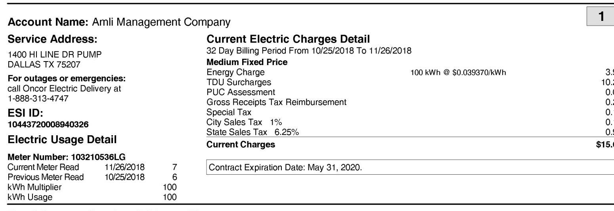

## Questions or Comments?

Green Mountain Energy P.O. Box 328 HOUSTON TX 77001-0328

Contact us at: 1- 866-280-3603 Monday - Friday 8:00 A.M. - 5:00 P.M. gmecbizcare@greenmountain.com
greenmountain.com
PUCT Certificate 10009

Green Mountain Account: 12648974 - 9 Date Due: 01/02/2019 Account Name: AMLI MANAGEMENT COMPANY

| Invoice Number   347000154511 | Amount Due   \$ 10,242.48 | After Due Date   \$ 10,754.60 |
| :--: | :--: | :--: |

Account Summary Previous Amount Due Payment 11/05/2018
Balance Forward
Current Charges
Amount Due
\$12,499.78
$-12,499.78$
$\begin{array}{r}0.00 \\ 10,242.48\end{array}$
Amount Due
$\$ 10,242.48$

| Your Business is Making a Difference! |  |  |
| :--: | :--: | :--: |
| By purchasing Green Mountain Energy ${ }^{\circledR}$ electricity, you have helped avoid the emission of this much carbon dioxide (CO) pollution over the past month. |  |  |
| Electricity Used (kWh) | CO2 Emissions   Avoided (pounds) ${ }^{1}$ | Equivalent Automobile Miles Not Driven ${ }^{2}$ |
| 178,500 | 252,791 | 313,441 |
| ${ }^{1}$ Estimate based on the product's eligible new renewable content and applicable $\mathrm{CO}_{2}$ emission rate from the U.S. Environmental Protection Agency's Emissions and Generation Resource Integrated Database (eDRID).   ${ }^{2}$ Estimate based on U.S. Department of Transportation fuel economy statistics for an average passenger vehicle and U.S. Environmental Protection Agency $\mathrm{CO}_{2}$ content of gasoline. |  |  |

## Save trees and time by going paperless.

Ready to brighten our planet even more? Sign up for e-bill through your online account at greenmountain.com/bizaccount or by calling 866-280-3603.

## 2) Green Mountain Energy

Green Mountain Energy P.O. Box 328 HOUSTON TX 77001-0328

|  |  |
| :-- | :-- |
|  |  |
|  |  |
|  |  |
|  |  |
|  |  |
|  |  |
|  |  |
|  |  |
|  |  |
|  |  |
|  |  |
|  |  |
|  |  |
|  |  |
|  |  |
|  |  |
|  |  |
|  |  |
|  |  |
|  |  |
|  |  |
|  |  |
|  |  |
|  |  |
|  |  |
|  |  |
|  |  |
|  |  |
|  |  |
|  |  |
|  |  |
|  |  |
|  |  |
|  |  |
|  |  |
|  |  |
|  |  |
|  |  |
|  |  |
|  | 

# Service Address: 

1400 HI LINE DR
DALLAS TX 75207
For outages or emergencies:
call Oncor Electric Delivery at
1-888-313-4747
ESI ID:
10443720004000589
Electric Usage Detail
Meter Number: 115183671LG
Current Meter Read
Previous Meter Read
kWh Multiplier
kWh Usage
Demand
Power Factor

Current Electric Charges Detail
32 Day Billing Period From 10/25/2018 To 11/26/2018
Medium Fixed Price
Energy Charge
Renewable Buyback Credit - Sep
TDU Surcharges
PUC Assessment
Gross Receipts Tax Reimbursement
Special Tax
City Sales Tax 1\%
State Sales Tax 6.25\%
Current Charges
Contract Expiration Date: May 31, 2020.

## $3470001545112$

027000001264897495000010242480000107546030

## Questions or Comments?

Green Mountain Energy P.O. Box 328

HOUSTON TX 77001-0328
Contact us at: 1- 866-280-3603
Monday - Friday 8:00 A.M. - 5:00 P.M.
gmecbizcare@greenmountain.com
greenmountain.com
PUCT Certificate 10009

Green Mountain Account: 8000125358 - 4 Date Due: 12/20/2018
Customer Name: AMLI MANAGEMENT COMPANY, A DELAWARE

| Invoice Number   1110227073075 | Amount Due   \$ 15.68 |
| :--: | :--: |

Account Summary
Previous Amount Due
Payment 11/06/2018
\$8.97
Balance Forward
Total Current Charges
Total Due
Your Business is Making a Difference!
By purchasing Green Mountain Energy® electricity, you have helped avoid the emission of this much carbon dioxide $\left(\mathrm{CO}_{2}\right)$ pollution over the past month.

| Electricity Used (kWh) | $\mathrm{CO}_{2}$ Emissions   Avoided (pounds) ${ }^{1}$ | Equivalent Automobile Miles Not Driven ${ }^{2}$ |
| :--: | :--: | :--: |
| 100 | 142 | 176 |

${ }^{1}$ Estimate based on the product's eligible new renewable content and applicable $\mathrm{CO}_{2}$ emission rate from the U.S. Environmental Protection Agency's Emissions and Generation Resource Integrated Database (eGRID).
${ }^{2}$ Estimate based on U.S. Department of Transportation fuel economy statistics for an average passenger vehicle and U.S. Environmental Protection Agency $\mathrm{CO}_{2}$ content of gasoline.

# Summary of Current Service Address Charges 

| ACCOUNT NO. | Account Name: |
| :--: | :--: |
| INVOICENO. | SERVICE ADDRESS |
| 000012648966 | Amli Management Company |
| 111022707149 |  |

Total Current Service Address Charges
\$15.68

## 22222222222222222222222222222222222222222222222222222222222222222222222222222222222222222222222222222222222222222222222222222222222222222222222222222222222222222222222222222222222222222222222222222222

The image is a photo of an electric bill statement. 

- **Account Name:** Amli Management Company
- **Service Address:** 1400 HI LINE DR PUMP, DALLAS TX 75207
- **For outages or emergencies:** call Oncor Electric Delivery at 1-888-313-4747
- **ESI ID:** 10443720008940326

**Electric Usage Detail:**
- **Meter Number:** 103210536LG
- **Current Meter Read:** 11/26/2018, 7
- **Previous Meter Read:** 10/25/2018, 6
- **kWh Multiplier:** 100
- **kWh Usage:** 100

**Current Electric Charges Detail:**
- **32 Day Billing Period From:** 10/25/2018 To 11/26/2018
- **Medium Fixed Price**
  - **Energy Charge:** 100 kWh @ $0.039370/kWh
- **Charges:**
  - Energy Charge: 3.94
  - TDU Surcharges: 10.00
  - PUC Assessment: 0.00
  - Gross Receipts Tax Reimbursement: 0.00
  - Special Tax: 0.00
  - City Sales Tax 1%: 0.00
  - State Sales Tax 6.25%: 0.00
- **Current Charges:** $15.54

- **Contract Expiration Date:** May 31, 2020.

