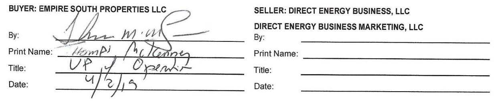
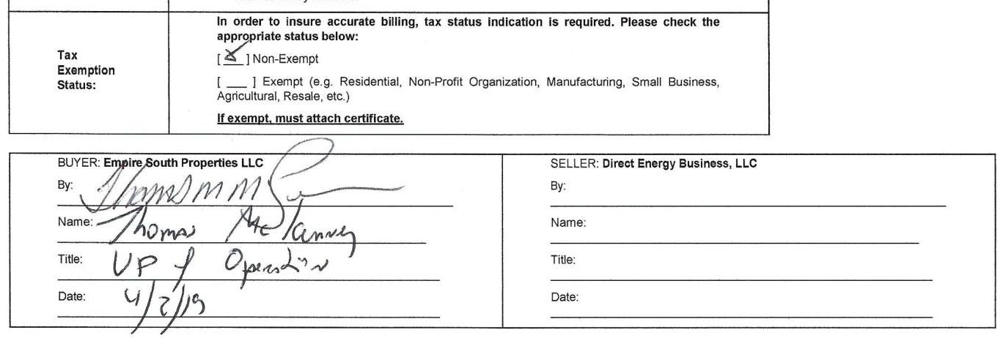
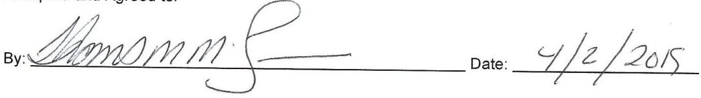

# 111 Direct Energy 

Business

This Commodity Master Agreement ("CMA") among Direct Energy Business, LLC, Direct Energy Business Marketing, LLC d/b/a Direct Energy Business, (collectively "Seller"), each a Delaware limited liability company, and Empire South Properties LLC ("Buyer" or "Customer"), (each a "Party" and collectively, the "Parties") is entered into and effective as of March 27, 2019

1. Transactions: The terms of this CMA apply to all end-use sales of electric power ("Electricity") and/or natural gas ("Gas") as applicable (each a "Commodity" and collectively, the "Commodities"), by the applicable Seller party to Buyer (each sale a "Transaction") which will be memorialized in a writing signed by both Parties (each a "Transaction Confirmation"). Each Transaction Confirmation shall set forth the Seller party providing service to Customer for such Transaction. If a conflict arises between the terms of this CMA and a Transaction Confirmation, the Transaction Confirmation will control with respect to that particular Transaction. This CMA, any amendments to this CMA and related Transaction Confirmation(s) (together, a single integrated, "Agreement") is the entire understanding between Parties with respect to the Commodities and supersedes all other communication and prior writings with respect thereto; no oral statements are effective.
2. Performance: The Parties' obligations under this Agreement are firm. Buyer is obligated to purchase and receive, and Seller is obligated to sell and provide, the Contract Quantity of Commodity specified in a Transaction Confirmation in accordance with the terms of this Agreement. Buyer will only use the Commodity at the listed Service Locations in the applicable Transaction Confirmation and will not resell the Commodity or use it at other locations without Seller's prior written consent.
3. Purchase Price: Buyer will pay the Purchase Price stated in each Transaction Confirmation. If the Purchase Price incorporates an index and the index is not announced or published on any day for any reason or if the Seller reasonably determines that a material change in the formula for or the method of determining the Purchase Price has occurred, then the Parties will use a commercially reasonable replacement price that is calculated by the Seller. If Seller concludes that a change in any Law(s) increases Seller's costs, the Purchase Price may be adjusted by Seller to reflect such costs. "Law(s)" mean all tariffs, laws, orders, rules, decisions, taxes, regulations, transmission rates, and Utility changes to Buyer's monthly capacity and/or transmission obligations.
4. Billing and Payment: Seller will invoice Buyer for the Actual Quantity of Commodity and for any other amounts incurred by Buyer under this Agreement. Payment is due within fifteen (15) days of the date of the invoice. If an invoice is issued and the Actual Quantity cannot be verified by the time, the invoice will be based on Seller's good faith estimate of the Actual Quantity. Seller will adjust Buyer's account following (I) confirmation of the Actual Quantity, (ii) any Utility discrepancy or adjustment or (iii) any other corrections or adjustments, including adjustments to, or re-calculation of, Taxes. Buyer will pay interest on late payments at $1.5 \%$ per month or, if lower, the maximum rate permitted by law ("Interest Rate"). Buyer is also responsible for all costs and fees, including reasonable attorney's fees, incurred in collecting payment. "Actual Quantity" means the actual quantity of Commodity that is either delivered or metered, as applicable, to Buyer's account. "Utility" means a state regulated entity engaged in the distribution of Gas or Electricity.
5. Taxes: Buyer is responsible for paying any Taxes associated with the Actual Quantity of Commodity sold under this Agreement that may become due at and after the Delivery Point. The Purchase Price does not include Taxes that are or may be the responsibility of the Buyer, unless such inclusion is required by Law. Buyer will reimburse Seller for any Taxes that Seller is required to collect and pay on Buyer's behalf and will indemnify, defend and hold Seller harmless from any liability against all Buyer's Taxes. Buyer will furnish Seller with any necessary documentation showing its exemption from Taxes, if applicable, and Buyer will be liable for any Taxes assessed against Seller because of Buyer's failure to timely provide or properly complete any such documentation. "Taxes" means all applicable federal, state and local taxes, including any associated penalties and interest and any new taxes imposed in the future during the term of this Agreement. Liabilities imposed in this Section will survive the termination of this Agreement.
6. Disputes: If either Party in good faith disputes amounts owed under Sections 3, 4, 5 and 8, the disputing Party will contact the non-disputing Party promptly and pay the undisputed amount by the payment due date. The Parties will negotiate in good faith regarding such dispute for a period of not more than fifteen (15) Business Days. In the event the Parties are unable to resolve such dispute, the disputing Party will pay the balance of the original invoice and either Party may exercise any remedy available to it in law or equity pursuant to this Agreement. In the event of a dispute other than for an invoiced amount, the Parties will use their best efforts to resolve the dispute promptly. Actions taken by a Party exercising its contractual rights will not be construed as a dispute for purposes of this Section. "Business Day" means any day on which banks are open for commercial business in New York, New York; any reference to "day(s)" means calendar days.

7. Title and Risk of Loss: Title to, possession of and risk of loss to the Commodity will pass to Buyer at the Delivery Point specified in the applicable Transaction Confirmation.

# 8. Buyer's Usage Obligations: 

A. Material Usage Deviation If there is a Material Usage Deviation, Buyer will be responsible for the losses and costs, including the costs of obtaining and/or liquidating the applicable volume, based upon the difference between the applicable Contract Quantity and Actual Quantity. Buyer will pay the amount of such losses and costs to Seller within fifteen (15) Business Days of Seller's invoice. "Material Usage Deviation" means any deviation in Actual Quantity at the Service Location (s) slated in the related Transaction Confirmation from Contract Quantity (or, as applicable, estimated Contract Quantities) stated in that Transaction Confirmation of +/- $25 \%$ or more, which is not caused by weather.
B. Balancing Charges: For Transactions involving the purchase and sale of Gas only, Buyer will be responsible for Balancing Charges unless Prior Notice of a material variation in usage is provided to Seller and actual usage is consistent with that Prior Notice. "Balancing Charges" means Utility fees, costs or charges and penalties assessed for failure to satisfy the Utility's balancing and/or nomination requirements. "Prior Notice" is defined as forty-eight (48) hours before the start of the Gas Day for which the material variation in usage will apply. "Gas Day" means a period of 24 consecutive hours as defined by the Utility. Buyer will make any payment due pursuant to this Section within five (5) Business Days of the date of Seller's invoice.
C. Curtailments: For Transactions involving the purchase and Sale of Gas only, if Buyer is directed by its Utility to curtail its usage, in whole or in part, Buyer will curtail as directed. If Buyer fails to curtail as directed, Buyer will pay or reimburse Seller for all Balancing Charges assessed by the Utility. Payment by Buyer of any Balancing Charges will be due within five (5) Business Days of the date of Seller's invoice.
8. Force Majeure: A Party claiming Force Majeure will be excused from its obligations under Section 2 as long as it provides prompt notice of the Force Majeure and uses due diligence to remove its cause and resume performance as promptly as reasonably possible. During a Force Majeure, Buyer will not be excused from its responsibility for Balancing Charges nor from its responsibility to pay for Commodity received. "Force Majeure" means a material, unavoidable occurrence beyond a Party's control, and does not include inability to pay, an increase or decrease in Taxes or the cost of Commodity, the economic hardships of a Party, or the full or partial closure of Buyer's facilities, unless such closure itself is due to Force Majeure.
10. Financial Responsibility: Seller's entry into this Agreement and each Transaction is conditioned on Buyer, its parent, any guarantor or any successor maintaining its creditworthiness during the Delivery Period and any Renewal Term. When Seller has reasonable grounds for insecurity regarding Buyer's ability or willingness to perform all of its outstanding obligations under any agreement between the Parties, Seller may require Buyer to provide adequate assurance, which may include, in the Seller's discretion, security in the form of cash deposits, prepayments, letters of credit or other guaranty of payment or performance ("Credit Assurance").
11. Default: "Default" means: (i) failure of either Party to make payment by the applicable due date and the payment is not made within three (3) Business Days of a written demand; (ii) failure of Buyer to provide Credit Assurance within two (2) Business Days of Seller's demand; (iii) either Party, its parent or guarantor, becomes Bankrupt or fails to pay its debts generally as they become due; (iv) failure of a Party to satisfy any of its representations and warranties; or (v) failure of a Party to fulfill its material obligations. The Parties will have 15 Business Days following written demand to cure any failures under (iv) or (v), provided that no cure period or demand for cure applies to a default arising under (iii) or any early termination of this Agreement. "Bankrupt" means an entity (a) files a petition or otherwise commences, authorizes or acquiesces in the commencement of a proceeding or cause of action under any bankruptcy, insolvency, reorganization or similar law, or has any such petition filed or commenced against it, (b) makes an assignment or any general arrangement for the benefit of creditors, (c) otherwise becomes bankrupt or insolvent, however evidenced,(d)has a liquidator, administrator, receiver, trustee, conservator or similar official appointed with respect to it or any substantial portion of its property or assets, (e) has a secured party take possession of all or any substantial portion of its assets or (f) is dissolved or has a resolution passed for its winding-up, official management or liquidation (other than pursuant to a consolidation, amalgamation or merger.
12. Remedies: In the event of a Default, the non-defaulting Party may: (i) withhold any payments or suspend performance; (ii) upon written notice, provided that no notice is required with respect to Section 11(iii) or a breach of Section 13A(c), accelerate any or all amounts owing between the Parties and terminate any or all Transactions and/or this Agreement; (iii) calculate a settlement amount by calculating all amounts due to Seller for Actual Quantity and the Close-out Value for each Transaction being terminated; and/or (iv) net or aggregate, as appropriate, all settlement amounts and all other amounts owing between the Parties and their affiliates under this Agreement and other energy-related agreements between them and their affiliates, whether or not then due and whether or not subject to any contingencies, plus costs incurred, into one single amount ("Net Settlement Amount"). Any Net Settlement Amount due from the defaulting Party to the non-defaulting Party will be paid within three (3) Business Days of written notice from the non-defaulting Party. Interest on any unpaid portion of the Net Settlement Amount will accrue daily at the Interest Rate. "Close-out Value" is the sum of (a) the amount due to the non-defaulting Party regarding the Contract Quantities (or, as applicable, estimated Contract Quantities) remaining to be delivered as stated in the applicable Transaction Confirmation(s) during the Delivery Period or, if applicable, the current Renewal Term, calculated by determining the difference between the Purchase Price and the Market Price for such quantities; and (b) without duplication, any net losses or costs incurred by the non-defaulting Party for terminating the Transaction(s), including costs of obtaining, maintaining and/or liquidating commercially reasonable hedges, Balancing Charges and/or transaction costs. "Market Price" means the price for similar quantities of Commodity at the Delivery Point during the Delivery Period or Renewal Term, as applicable. For purposes of determining Close-out Value, (i) Market Price will be determined by the non-defaulting Party in

good faith as of a date and time as close as reasonably practical to the date and time of termination or liquidation of the applicable Transaction(s), and (ii) Market Price may be ascertained through reference to quotations provided by recognized energy brokers or dealers, market indices, bona-fide offers from third-parties, or by reference to commercially reasonable forward pricing valuations. The Parties agree that the Close-out Value constitutes a reasonable approximation of damages, and is not a penalty or punitive in any respect. Seller may, but need not, physically liquidate a Transaction or enter into a replacement transaction to determine Close-out Value or Net Settlement Amount. The defaulting Party is responsible for all costs and fees incurred for collection of Net Settlement Amount, including, reasonable attorney's fees and expert witness fees.
13. Representations and Warranties: Each of the following are deemed to be repeated each time a Transaction is entered into:
A. Each Party represents that: (a) it is duly organized, validly existing and in good standing under the laws of the jurisdiction of its formation and is qualified to conduct its business in those jurisdictions necessary to perform to this Agreement; (b) the execution of this Agreement is within its powers, has been duly authorized and does not violate any of the terms or conditions in its governing documents or any contract to which it is a party or any law applicable to it; and (c) it is not Bankrupt.
B. Buyer represents and warrants that: (a) it is not a residential customer; (b) it will promptly notify Seller of any merger or acquisition of Buyer where Buyer will not be the surviving legal entity; (c) execution of this Agreement initiates enrollment and service for the Delivery Period and any Renewal Term; (d) no communication, written or oral, received from the Seller will be deemed to be an assurance or guarantee as to any results expected from this Agreement; (e) if it is executing this Agreement in its capacity as an agent, such Party represents and warrants that it has the authority to bind the principal to all the provisions contained herein and agrees to provide documentation of such agency relationship, and (f) (i) it will provide, to Seller, information reasonably required to substantiate its usage requirements, including information regarding its business, locations, meter/account numbers, historical/projected usage, time of use, hours of operation, utility rate classes, agreements, schedules, which in substantial part form the basis for the calculation of charges for the transactions hereunder; (ii) acceptance of this Agreement constitutes an authorization for release of such usage information; (iii) it will assist Seller in taking all actions necessary to effectuate Transactions, including, if requested, executing an authorization form permitting Seller to obtain its usage information from third parties; and (iv) the usage information provided is true and accurate as of the date furnished and as of the effective date of the Agreement.
C. Each Party acknowledges that: (a) this Agreement is a forward contract and a master netting agreement as defined in the United States Bankruptcy Code ("Code"); (b) this Agreement shall not be construed as creating an association, trust, partnership, or joint venture in any way between the Parties, nor as creating any relationship between the Parties other than that of independent contractors for the sale and purchase of Commodity; (c) Seller is not a "utility" as defined in the Code; (d) Commodity supply will be provided by Seller under this Agreement, but delivery will be provided by the Buyer's Utility; and (e) Buyer's Utility, and not Seller, is responsible for responding to leaks or emergencies should they occur.

# 14. Other: 

(a) This Agreement, and any dispute arising hereunder, is governed by the law of the state in which the Service Locations are located, without regard to any conflict of rules doctrine. (b) Each Party waives its right to a jury trial regarding any litigation arising from this Agreement. (c) No delay or failure by a Party to exercise any right or remedy to which it may become entitled under this Agreement will constitute a waiver of that right or remedy. (d) Seller warrants that (i) it has good title to Commodity delivered, (ii) it has the right to sell the Commodity, and (iii) the Commodity will be free from all royalties, liens, encumbrances, and claims. ALL OTHER WARRANTIES, EXPRESS OR IMPLIED, INCLUDING ANY WARRANTY OF MERCHANTABILITY OR FITNESS FOR ANY PARTICULAR PURPOSE, ARE DISCLAIMED. (e) Buyer will be responsible for and indemnify Seller against all losses, costs and expenses, including court costs and reasonable attorney's fees, arising out of claims for personal injury, including death, or property damage from the Commodity or other charges which attach after title passes to Buyer. Seller will be responsible for and indemnify Buyer against any losses, costs and expenses, including court costs and reasonable attorneys' fees, arising out of claims of title, personal injury, including death, or property damage from the Commodity or other charges which attach before title passes to Buyer. (f) NEITHER PARTY WILL BE LIABLE TO THE OTHER UNDER THE AGREEMENT FOR CONSEQUENTIAL, INDIRECT OR PUNITIVE DAMAGES, LOST PROFITS OR SPECIFIC PERFORMANCE, EXCEPT AS EXPRESSLY PROVIDED IN THIS AGREEMENT. (g) All notices and waivers will be made in writing and may be delivered by hand delivery, first class mail (postage prepaid), overnight courier service or by facsimile and will be effective upon receipt; provided, however, that any termination notice may only be sent by hand or by overnight courier service, and, if sent to Seller, a copy delivered to: Direct Energy Business, Attn: Customer Services Manager, 1001 Liberty Avenue, Pittsburgh, PA 15222; Phone: (888) 925-9115; Fax: (866) 421-0257; Email: CustomerRelations@directenergy.com. (h) If Buyer and Direct Energy Business Marketing, LLC entered into Commodity transactions prior to the execution of this Agreement ("Existing Transactions"), the Parties agree that these Existing Transactions shall be Transactions governed under the terms of this Agreement. This Agreement supersedes and replaces any other agreement that may have applied to the Existing Transactions. Note that this subsection (h) shall not apply to any Commodity transactions or agreements entered into between Buyer and Direct Energy Business, LLC (i) No amendment to this Agreement will be enforceable unless reduced to writing and executed by both Parties. (j) Seller may assign this Agreement without Buyer's consent. Buyer may not assign this Agreement without Seller's consent; which consent will not be unreasonably withheld. In addition, Seller may pledge, encumber, or assign this Agreement or the accounts, revenues, or proceeds of this Agreement in connection with any financing or other financial arrangements without Buyer's consent; in which case Seller shall not be discharged from its obligations to Buyer under this Agreement. (k) This Agreement may be executed in separate counterparts by the Parties, including by facsimile, each of which when executed and delivered shall be an original, but all of which shall constitute one and the same instrument. (l) Any capitalized terms not defined in this CMA are

| Date: March 27, 2019 | Product Code: NEP_CI_FPR_POR_MA |
| :--: | :--: |
| Direct Energy   Sanitities | DIRECT ENERGY BUSINESS, LLC   1001 Liberty Avenue   Pittsburgh, PA 15222   Phone: 1-888-925-9115   www.directenergy.com |

# SUBTROME SEQUENCE 

| Customer Name: Empire South Properties LLC | Billing Contact: |
| :-- | :-- |
| Contact Name: Mario Annude | Billing Address: |
| Address: 219 Littleton Rd, Westford, MA 01886 |  |
| Telephone: 9786528200 | Telephone: |
| Fax: 9786504546 | Fax: |
| Email: |  |

## ELECTRONIC THERMANIC HISTORY

This Transaction Confirmation confirms the terms of the Electricity Transaction entered into between Direct Energy Business, LLC ("Seller"), and the customer above ("Buyer" or "Customer"); pursuant to the terms of the Commodity Master Agreement between Customer and Seller and/or Seller's affiliate Direct Energy Business Marketing, LLC, difcis Direct Energy Business dated $\qquad$ as may be amended. If the referenced Commodity Master Agreement is between Customer and Direct Energy Business Marketing, LLC, difcis Direct Energy Business, Customer and Seller agree that this Transaction Confirmation shall be governed by and incorporate the terms of such Commodity Master Agreement. The Exhibit A for the Purchase Price described below is attached to, and is made a part of, this Transaction Confirmation.
The Purchase Price excludes Utility distribution charges and Taxes that are or may be the responsibility of Customer. Customer's execution and submission of this Transaction Confirmation, including Exhibit A hereto, to Seller shall constitute an offer from Customer to Seller to purchase the Commodity on the terms set forth in the Commodity Master Agreement. This Transaction Confirmation shall become effective only upon 1. execution by Customer of this Transaction Confirmation, including Exhibit A, and Commodity Master Agreement, and 2. the earlier of (a) execution of the Commodity Master Agreement and this Transaction Confirmation by Seller or (b) written confirmation by Seller of its acceptance of the Transaction Confirmation to Customer.

| Delivery   Period: | For each Service Location, the first meter read date will be on or after: April 01, 2019and will continue for a term of 7 Months. |
| :--: | :--: |
|  | Seller will request the Utility to enroll Customer on the first meter read date in the first month of the Delivery Period as defined by the Utility. The service start date hereunder will be the date that the Utility enrolls Customer for Seller's services. Seller shall not be liable for any lost savings or lost opportunity as a result of a delay in service commencement due to actions or inactions of the Utility. |
|  | Upon the expiration of the Delivery Period, this Transaction shall continue for successive one month terms (collectively the "Renewal Term") until either Party notifies the other Party in writing of its intention to terminate, at least 15 days prior to the end of the Delivery Period or 15 days prior to the end of each successive month Renewal Term. The termination date shall be the next effective drop date permitted by the Utility. All terms of the Agreement will remain in effect through the termination date as set by the applicable Utility. During the Renewal Term, the Purchase Price for each successive month Renewal Term will be the then market-based price for similar quantities of Commodity at the Delivery Point, including all Taxes, costs, charges or fees which are set forth herein, unless otherwise agreed to in writing by the Parties. |
| Delivery   Point: | The Delivery Point shall be the point(s) where Commodity is delivered to the Utility. The Utility is specified on Exhibit A. |
| Contract   Quantity: | Customer and Seller agree that the Contract Quantity purchased and received means a positive volume up to or greater than the estimated quantities listed on the Exhibit A, provided that for purposes of determining whether a Material Usage Deviation has occurred and for purposes of calculating Contract Quantities remaining to be delivered under Section 12 of the Agreement. Contract Quantity shall be determined by reference to the historical monthly usage for such Service Locations. |
| Purchase   Price: | The Purchase Price per kWh to be paid by Buyer for the services provided hereunder during the Delivery Period of this Transaction Confirmation shall be that set forth on the Exhibit A. The Purchase Price includes applicable costs for Commodity; Ancillary Services; renewable energy costs as applicable, losses; all costs associated with Seller's obligation to provide capacity as required by the ISCI New England; all congestion charges, if applicable; and the Services Fee. |
|  | Seller will perform automatic adjustments to the Purchase Price where Seller determines a change in cost(s) to capacity tag, rate and/or scaler are incurred and where such change in cost(s) is not currently included in the Purchase Price. Any such increase or decrease in costs shall be passed through to Buyer without mark-up and the Purchase Price shall be adjusted to reflect such adjustment. |
|  | Capacity costs included in the Purchase Price are based upon the capacity tag, rate and scaler in effect as of the date of this Transaction Confirmation. |

The Purchase Price does not include fuel security program costs and charges, whether arising under or in connection with FERC Order on Fuel Security RMR Tariff and Cost Allocation, Docket Nos. ER 18-2364-000, EL 18-182-000 (December 3, 2018), FERC Order on Exelon Fuel Security RMR, Docket No. 18-1639-000 (December 20, 2018), or otherwise. Any such costs and charges will be passed through to Buyer to be paid by Buyer in addition to the Purchase Price.

| Bill type: | Utility Consolidated Billing (External Rate Ready) |
| :--: | :--: |
| Definitions: | "Ancillary Services"   means wholesale commodity services and products required to facilitate delivery of Commodity to the Utility.   "Exhibit A"   refers to the list of Service Locations attached to this Transaction Confirmation, which list specifies the Service Locations covered under the scope of this Transaction Confirmation for PowerPortfolio, Day-Ahead and other index products. For fixed price products, it refers to the pricing attachment to this Transaction Confirmation that sets forth (together with this Transaction Confirmation) the Purchase Price applicable to, and the Service Locations covered by, this Transaction Confirmation.   "Renewable Energy Costs"   means certain renewable energy costs and charges arising from state law and/or regulation, including renewable energy portfolio standards (both current and accelerated as applicable), alternative portfolio standards, clean energy standards and clean peak standards.   "Services Fee"   is the fee for the services provided by Seller to meet the Service Locations' load requirements, which is included in the Purchase Price to be paid by Buyer. |
| Special   Provisions: | 1. Change in Utility Account Kumbers: The account number for a Service Location shall be the Utility Account Number set forth in the Service Locations attached in the Exhibit A, or any replacement account number issued by the Utility from time to time.   2. Third Party Charges: Customer acknowledges that any costs assessed by the Utility or any third party as a result of Customer's switch to or from Seller, including but not limited to switching costs, are not included in the Purchase Price and shall be the responsibility of the Customer.   3. Utility Consolidated Bill: Without limiting Section 2 "Performance" of the CMA, as a condition precedent to Seller's acceptance of this Agreement, Buyer must be accepted by Seller and the Utility to receive a consolidated utility bill for both services as described herein. Energy (provided by Seller) and delivery services (provided by the Utility), Billing for Buyer's Service Locations shall be received from the Utility on a monthly invoice, produced using the rate-ready method and incorporating both the services provided under this Agreement and Utility charges, in accordance with the Utility's meter ready and billing cycle schedule. Seller shall have the right to assign to Utility all amounts due from Buyer to Seller under this Agreement and Buyer is to remit payment in that amount in full to the Utility. If Buyer fails to remit full payment in full in any month, a late payment charge will be assessed at the same rate and in the same manner as Utility applies late payment charges to its unpaid charges. The Utility may, at its option, disconnect all services to Buyer for any failure by Buyer to make full payment of all amounts billed when due in accordance with Massachusetts Department of Public Utilities rules for residential and non-residential service. In the case of such disconnection, Buyer shall be responsible for any and all charges required to reconnect service. The Utility also reserves the right to cancel bills previously issued and to rebill or back-bill Buyer based on actual meter readings or estimated usage and demand under the Utility's billing procedures. If Buyer is disconnected, terminated, suspended, or withdraws from the utility consolidated program then it shall be in default and as such, this Agreement shall terminate and Buyer shall be responsible for any applicable Net Settlement Amount and/or Close-out Value. Notwithstanding the above and for termination not caused by disconnection by the Utility, Seller, may at its sole option continue to provide services as described herein and Energy in the case of early termination, suspension or withdrawal from such program. If so, the Agreement will not terminate and billing will proceed on a dual bill basis pursuant to Section 4 of the CMA.   Notwithstanding anything to the contrary of the above, if Buyer is enrolled or becomes enrolled in any net metering program, Buyer understands and agrees that Seller will modify Buyer's billing option to a dual bill option consistent with Section 4 of the CMA.   4. Billing and Payment: The following is hereby added to Section 4 of the CMA:   "In addition to working with Direct Energy to resolve a billing dispute, and pursuant to Massachusetts General Law 164 and a subsequent agreement between the Department of Telecommunications and Energy (DTE) and the Massachusetts Office of Dispute Resolution (MODR), buyer is entitled to file at the DTE a request for mediation. If the amount of the dispute is greater than $\$ 100$, and within the DTE's statutory and regulatory jurisdiction, the DTE can refer the complaint to the MODR for resolution."   5. Right To Rescind: Buyer has until midnight of the third (3rd) calendar day following the date that Buyer executes this Transaction Confirmation to call Direct Energy and cancel (rescind) this Transaction Confirmation.   6. Miscellaneous: Buyer has the right to return to Host Utility basic generation service, subject to early termination obligations as set forth in this Agreement. Furthermore, credit agencies may be provided with Buyer's payment detail(s).   7. As it relates to this Transaction Confirmation, Section 3 of the CMA shall be deleted in its entirety and replaced with the following:   "3. Purchase Price: Buyer will pay the Purchase Price stated in each Transaction Confirmation. If the Purchase Price incorporates an index and the index is not announced or published on any day for any reason or if the Seller reasonably determines that a |

# CHEM SERY OF EQUIPMENT 

## CREDIT APPLICATION

MAILING ADDRESS:
NAME:
$\qquad$
ATTN:
$\qquad$
ADDRESS: $\qquad$
$\qquad$

E-MAIL: $\qquad$
SHIPPING ADDRESS: (LIST MULTIPLE LOCATIONS ON SEPARATE SHEET)
NAME:
$\qquad$
ADDRESS: $\qquad$

SHIP VIA: Our Truck $\qquad$ UPS $\qquad$ Best Way $\qquad$
SPECIAL DELIVERY INSTRUCTIONS: (Time, Entrance, Etc.) $\qquad$

WHAT TYPE OF BUSINESS IS THIS?
PERSON IN CHARGE OF PURCHASING:
$\qquad$
$\qquad$
FAX:
Phone: $\qquad$
E-Mail: $\qquad$

PURCHASE ORDER REQUIRED?
$\qquad$
TAX STATUS $\qquad$
(Include Certificate)
PERSON TO CONTACT FOR OVERDUE BILLS: $\qquad$
(Name and Phone #)
(AP Email Contact)
WHEN ARE BILLS PAID? (How often, what day of the week) $\qquad$
Will you pay via ACH? YES $\qquad$ NO $\qquad$
Do you require a monthly statement? (Faxed or E-Mail Only) YES $\qquad$ NO $\qquad$
Terms Preferred: $\square$ COD $\qquad$ NET 7 $\qquad$ NET 30 $\qquad$
Note: Past due accounts are subject to finance charges of $18 \%$ per annum, $1.5 \%$ per month. Returned check fee is $\$ 30$. No returns on special orders. Restocking charge is $25 \%$.

IF NET 30 TERMS ARE REQUESTED, PLEASE COMPLETE THE SECOND PAGE.

defined in the Transaction Confirmation or shall have the meaning set forth in the applicable Utility rules, tariffs or other governmental regulations, or if such term is not defined therein then it shall have the well-known and generally accepted technical or trade meanings customarily attributed to it in the natural gas or electricity generation industries, as applicable. (m) The headings used in this Agreement are for convenience of reference only and are not to affect the construction of or to be taken into consideration in interpreting this Agreement. (n) Any executed copy of this Agreement and other related documents may be digitally copied, photocopied, or stored on computer tapes and disks ("Imaged Agreement"). The Imaged Agreement will be admissible in any judicial, arbitration, mediation or administrative proceedings between the Parties in accordance with the applicable rules of evidence; provided that neither Party will object to the admissibility of the Imaged Agreement on the basis that such were not originated or maintained in documentary form. (o) Where multiple parties are Party to this Agreement with Seller and are represented by the same agent, it is agreed that this Agreement will constitute a separate agreement with each such Party, as if each such Party had executed a separate Agreement, and that no such Party shall have any liability under this document for the obligations of any other Parties. (p) This CMA may be terminated by either Party upon at least thirty (30) days' prior written notice; provided, however, that this CMA will remain in effect with respect to Transactions entered into prior to the effective date of the termination until both Parties have fulfilled all of their obligations with respect to the outstanding Transactions. (q) Buyer will not disclose the terms of this Agreement, without prior written consent of the Seller, to any third party, other than Buyer's employees, affiliates, agents, auditors and counsel who are bound by substantially similar confidentiality obligations, trading exchanges, governmental authorities, courts, adjudicatory proceedings, pricing indices, and credit ratings agencies; provided that if Buyer receives a demand for disclosure pursuant to court order or other proceeding, it will first notify Seller, to the extent practicable, before making the disclosure.

IN WITNESS WHEREOF, this CMA is entered into and effective as of the date written above.

The image is a photo of a signature section from an agreement document. 

On the left side, it is labeled for the "BUYER: EMPIRE SOUTH PROPERTIES LLC" with the following details:
- By: [Signature]
- Print Name: Thomas McKenney
- Title: VP of Operations
- Date: 4/2/19

On the right side, it is labeled for the "SELLER: DIRECT ENERGY BUSINESS, LLC" and "DIRECT ENERGY BUSINESS MARKETING, LLC" with blank lines for:
- By:
- Print Name:
- Title:
- Date:

The buyer's section is filled out, while the seller's section is left blank.

# Direct Energy 

## PowerSupply Coordination® Service Agreement

## Billing Contact Information and Selection Form

Account / Customer Name: Empire South Properties LLC

| Your Name |  |  |  |  |  |  |  |
| :--: | :--: | :--: | :--: | :--: | :--: | :--: | :--: |
| Your Phone |  |  |  |  |  |  |  |
| Billing Information Address will be applied to all accounts on Agreement |  | (Exceptions: Please complete a separate form per account and list number) |  |  |  |  |  |
| Billing Contact Name |  |  |  |  |  |  |  |
| Billing Contact Phone |  |  |  |  |  |  |  |
| Billing Contact Fax |  |  |  |  |  |  |  |
| Billing Contact Email |  |  |  |  |  |  |  |
| Billing Company Name |  |  |  |  |  |  |  |
| Billing Address 1 |  |  |  |  |  |  |  |
| Billing Address 2 |  |  |  |  |  |  |  |
| Billing City, State |  |  |  |  |  |  |  |
| Zip +4 |  |  |  |  |  |  |  |

Please select, by initialing in the spaces provided below, those options to be applied to your billing accounts.

## My accounts are Tax Exempt

Please provide current copy of a valid Tax Exemption Form when submitting this document to receive applicable tax exemption on your electricity invoices.
(Direct Energy can only apply exemptions if a completed form is provided)
$\qquad$ Please aggregate my accounts onto one invoice (maximum 50 accounts per invoice)
(If more than 50 accounts are to be aggregated, accounts will be separated by meter read date)
$\square \quad$ Please check here if you would like to receive your contract electronically instead of in the mail.

## Internal Use Only

Billing Address update required for ERM Accounts
Yes
No $\square$

LDC Account to be used to identify account for Scanning

material change in the formula for or the method of determining the Purchase Price has occurred, then the Parties will use a commercially reasonable replacement price that is calculated by the Seller. If Seller concludes that a change in any tariff, law, order, rule, tax, regulation, RPE or RWR cost, or if any changes to the utility consolidated bill program occurs and such change increases Seller's costs, the Purchase Price may be adjusted by Seller to reflect such costs."
8. As it relates to this Transaction Confirmation, Section 8(A) of the CMA shall be deleted in its entirety and replaced with the following:
"8. A. Material Deviation: Seller may pass through to Buyer any losses and/or costs incurred by Seller related to a deviation of $+1-25 \%$ from Contract Quantity (or, as applicable, estimated Contract Quantities) stated in the applicable Transaction Confirmation, which is not caused by weather."

The image is a photo of a document section related to tax exemption status and signatures for a transaction between two parties.

- **Tax Exemption Status Section:**
  - Text: "In order to insure accurate billing, tax status indication is required. Please check the appropriate status below:"
  - Options: 
    - "[X] Non-Exempt"
    - "[ ] Exempt (e.g. Residential, Non-Profit Organization, Manufacturing, Small Business, Agricultural, Resale, etc.)"
  - Note: "If exempt, must attach certificate."

- **Buyer Information:**
  - Buyer: Empire South Properties LLC
  - By: [Signature]
  - Name: Thomas McKinney
  - Title: VP of Operations
  - Date: 4/2/19

- **Seller Information:**
  - Seller: Direct Energy Business, LLC
  - By: [Blank]
  - Name: [Blank]
  - Title: [Blank]
  - Date: [Blank]

# EXHIBIT A PRICING ATTACHMENT 

## This Exhibit A is to the Transaction Confirmation dated March 27, 2019 between DIRECT ENERGY BUSINESS LLC and Empire South Properties LLC for a term of $\underline{T}$ Months

NEP_CI_FPR_POR_MA

| Account   Number | Service   Location | Utility | Utility   Rate   Class | Zone | Capacity /   Trans-   mission   Tags | "Estimated   Meter   Read Start   Date   (MM/DD/YYYY) | Purchase   Price   (cents/kWh) | Annual   Historical   Usage   (kWh) |
| :--: | :--: | :--: | :--: | :--: | :--: | :--: | :--: | :--: |
| 6535848023 | 219 LITTLETON RD   (Empire South   Hospitality) | Massachusetts   Electric   Company -   National Grid | G3 | WCMAS5 | $482.3 /$   N/A | $04 / 22 / 2019$ | 9.260 | 2,596,566 |
| 2797685013 | 219 LITTLETON RD   POLE 92   (EMPIRE REGENCY   HOSPITALITY, LLC) | Massachusetts   Electric   Company -   National Grid | G1 | WCMAS5 | $6.2 / \mathrm{N} / \mathrm{A}$ | $04 / 23 / 2019$ | 9.260 | 27,500 |

*The Estimated Meter Read Start Date is merely an approximation based upon Seller's best estimation as to when the service will begin and may not reflect the actual start date. Seller shall not be liable for any lost savings or lost opportunity relating to this estimation.

This Exhibit is based on a Weighted Average Price. Any strikeouts of any of the accounts provided with a Weighted Average Price will render pricing for the accounts assigned with a Weighted Average Price null and void.
Accepted and Agreed to:

The image is a photo of a signature section on a document. It includes a handwritten signature on the left side, labeled "By:", and a handwritten date on the right side, labeled "Date:". The date is written as "4/2/2015".

