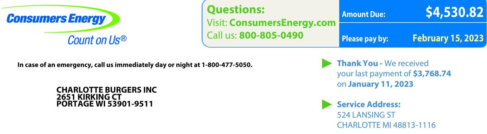
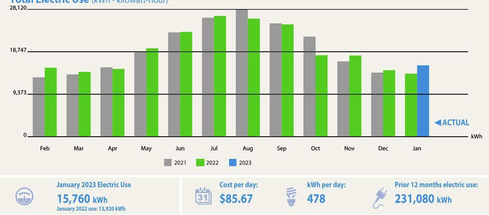
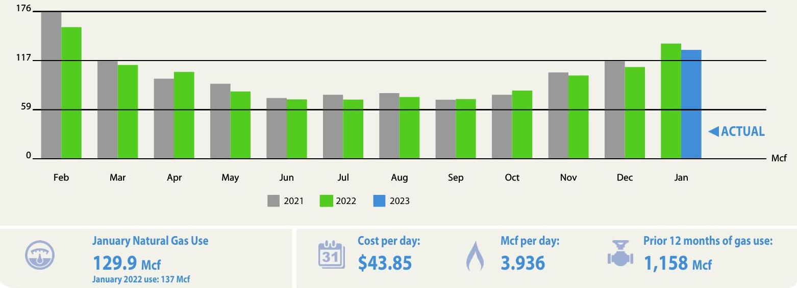
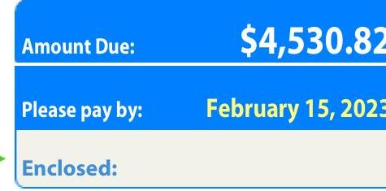
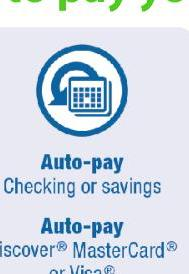
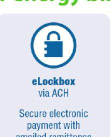
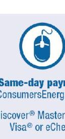

The image is a photo of a utility bill from Consumers Energy. Key elements include:

- **Logo and Slogan**: "Consumers Energy" with the slogan "Count on Us®".
- **Emergency Contact**: "In case of an emergency, call us immediately day or night at 1-800-477-5050."
- **Customer Information**: 
  - Name: "CHARLOTTE BURGERS INC"
  - Address: "2651 KIRKING CT, PORTAGE WI 53901-9511"
- **Questions Section**: 
  - Website: "Visit: ConsumersEnergy.com"
  - Phone: "Call us: 800-805-0490"
- **Billing Information**:
  - "Amount Due: $4,530.82"
  - "Please pay by: February 15, 2023"
- **Payment Acknowledgment**:
  - "Thank You - We received your last payment of $3,768.74 on January 11, 2023"
- **Service Address**:
  - "524 LANSING ST, CHARLOTTE MI 48813-1116"

The layout includes the logo and contact information at the top, customer and billing details in the middle, and service address at the bottom. The amount due and payment date are highlighted in blue.

January Energy Bill
Service dates: December 22, 2022 - January 23, 2023 (33 days)
Total Electric Use (kWh - kilowatt-hour)

The image is a bar chart showing the **yearly usage breakdown (monthly-based)** of total electric use in kilowatt-hours (kWh) for the years 2021, 2022, and 2023. 

- **Chart Type**: Bar chart
- **Y-Axis**: kWh, with markings at 0, 9,373, 18,747, and 28,120.
- **X-Axis**: Months from February to January.
- **Legend**: 
  - Gray bars represent 2021.
  - Green bars represent 2022.
  - Blue bars represent 2023.
- **Data Points**:
  - January 2023 Electric Use: 15,760 kWh
  - January 2022 use: 13,920 kWh
- **Additional Information**:
  - Cost per day: $85.67
  - kWh per day: 478
  - Prior 12 months electric use: 231,080 kWh
- **Styling**: The "ACTUAL" label is in blue next to the January 2023 bar.

Total Natural Gas Use (Mcf - thousand cubic feet)

The image is a bar chart showing the **yearly usage breakdown (monthly-based)** of total natural gas use in thousand cubic feet (Mcf) for the years 2021, 2022, and 2023.

- **Chart Type**: Bar chart
- **Y-Axis**: Mcf, with markings at 0, 59, 117, and 176.
- **X-Axis**: Months from February to January.
- **Legend**: 
  - Gray bars represent 2021.
  - Green bars represent 2022.
  - Blue bars represent 2023.
- **Data Points**:
  - January 2023 Natural Gas Use: 129.9 Mcf
  - January 2022 use: 137 Mcf
- **Additional Information**:
  - Cost per day: $43.85
  - Mcf per day: 3.936
  - Prior 12 months of gas use: 1,158 Mcf
- **Styling**: The "ACTUAL" label is in blue next to the January 2023 bar.

Fold, detach and mail this portion with your check made payable to Consumers Energy. Please write your account number on your check.
Consumers Energy
YOU can pay your bill by mail, by phone or online
See reverse side for more information

Account: 100088141112

The image is a section of a utility bill highlighting payment details. It shows:

- **Amount Due**: $4,530.82
- **Please pay by**: February 15, 2023
- **Enclosed**: (blank space for amount)

The section is styled with a blue background for the amount due and payment date.

## Consumers Energy

Count on Us®
Need to talk to us? Visit ConsumersEnergy.com or call 800-805-0490
Hearing/speech impaired: Call 7-1-1

## Account Information

Bill Month: January
Service dates: 12/22/2022 - 01/23/2023
Days Billed: 33
Portion: 20 01/23

## Rate Information

Elec Gen Sec Rate GS Com
Rate: 1100
Gas Gen Serv Rate GS-1 - Com
Rate: 261

## Meter Information

Your next scheduled meter read date is on or around 02/22/2023

## Electric Service:

Smart Meter
Meter Number: 40062458
POD Number: 0000004748022
Beginning Read Date: 12-22
Ending Read Date: 01-23
Beginning Read: 14783
Ending Read: 15177 (Actual)
Differential: 394
Constant: 40
Usage: 15760 kWh
Total Metered Energy Use: 15760 kWh

## Gas Service:

Smart Meter
Meter Number: 99139066
POD Number: 0000004748023
Beginning Read Date: 12-22
Ending Read Date: 01-23
Beginning Read: 26094
Ending Read: 27254 (Actual)
Differential: 1160
Constant: 0.1
Correction factor: 1.11980
Usage: 129.9 Mcf
Total Metered Energy Use: 129.9 Mcf

## Service Address:

524 LANSING ST; CHARLOTTE MI 48813-1116
Account: 100088141112

| January Energy Bill |  |  |  |
| :--: | :--: | :--: | :--: |
|  |  | Invoice: 205101312047 |  |
| Account Summary |  |  |  |
| Last Month's Account Balance |  |  | \$3,768.74 |
| Payment on January 11, 2023 |  |  | $\$ 3,768.74$ |
| Balance Forward |  |  | $\$ 0.00$ |
| Payments applied after Jan 24, 2023 are not included. |  |  |  |
| Electric Charges |  |  |  |
| Energy | 13840@ | 0.091482 | \$1,266.11 |
| Energy | 1920@ | 0.090108 | \$173.01 |
| PSCR | 15760@ | 0.022090 | \$348.14 |
| System Access |  |  | $\$ 20.00$ |
| Deferral Surcharge | 1920@ | 0.000228 | $\$ 0.44$ |
| Refund | 1920@ | 0.000406 | $\$ 0.78$ |
| Distribution | 13840@ | 0.046251 | $\$ 640.11$ |
| Distribution | 1920@ | 0.044692 | $\$ 85.81$ |
| FCM Incentive | 15760@ | 0.000098 | $\$ 1.54$ |
| Other Surcharges |  |  | $\$ 271.86$ |
| Power Plant Securitization | 15760@ | 0.001277 | $\$ 20.13$ |
| Low-Income Assist Fund |  |  | $\$ 0.90$ |
| Total Electric |  |  | $\$ 2,827.27$ |
| Natural Gas Charges |  |  |  |
| Customer Charge |  |  | $\$ 16.00$ |
| Gas Distribution | 129.9@ | 4.259700 | $\$ 553.34$ |
| Other Surcharges | 129.9@ | 0.493800 | $\$ 64.15$ |
| Gas Cost Recovery | 129.9@ | 6.263700 | $\$ 813.65$ |
| Total Natural Gas |  |  | \$1,447.14 |
| Total Electric and Natural Gas Charges |  |  | $\$ 4,274.41$ |
| State Sales Tax |  |  | $\$ 236.41$ |
| Total Energy Charges |  |  | $\$ 4,530.82$ |
| Amount Due: |  |  | \$4,530.82 |
| by February 15, 2023 |  |  |  |
| If you pay after the due date, a 2\% late payment charge will be added to your next bill. |  |  |  |

Please make any inquiry or complaint about this bill before the due date listed on the front. Visit ConsumersEnergy.com/aboutmybill for details about the above charges.

# NEWS AND INFORMATION 

Compare natural gas prices among Consumers Energy and other gas providers at www.Michigan.gov/CompareMIGas.

Please see the insert for details on the environmental characteristics of electricity delivered to customers.

We have filed a request with the Michigan Public Service Commission in Case No. U-21308 to adjust
natural gas distribution rates. A copy of our filing and explanation of the proposed changes may be viewed at our offices and at http://effie.mpsc.state.mi.us/efile. Learn more at www.ConsumersEnergy.com/retestbiz.

Consumers Energy is regulated by the Michigan Public Service Commission, Lansing, Michigan

## Ways to pay your energy bill:

The image is a photo/illustration showing an icon and text related to payment options. The icon features a calendar with an arrow circling around it, indicating an automatic process. Below the icon, the text reads:

"Auto-pay
Checking or savings"

"Auto-pay
Discover® MasterCard® or Visa®"

## Aale-pay

Discoing or savings
Bale-pay
Discover ${ }^{\circledR}$ MadeCard ${ }^{\circledR}$ or Vina ${ }^{\circledR}$ (Eligibility varies)

The image is a photo/illustration showing an icon and text related to payment options. The icon features a padlock symbol, indicating security. Below the icon, the text reads:

"eLockbox via ACH

Secure electronic payment with emailed remittance"

Same-day payment ConsumersEnergy.com Discover ${ }^{\circledR}$ MadeCard ${ }^{\circledR}$ Vina ${ }^{\circledR}$ or eCheck

The image is a photo/illustration showing an icon and text related to payment options. The icon features a computer mouse, indicating an online process. Below the icon, the text reads:

"Same-day payment
ConsumersEnergy.com
Discover® MasterCard® Visa® or eCheck"

Same-day payment 800-325-9303
Discover ${ }^{\circledR}$ MadeCard ${ }^{\circledR}$ Vina ${ }^{\circledR}$ or eCheck

The image is a photo/illustration showing an icon and text related to payment options. The icon features a telephone symbol, indicating a phone-based process. Below the icon, the text reads:

"Same-day payment
866-329-9593

Discover® MasterCard® Visa® or eCheck"

## By mail

Check, money order
Consumers Energy
Pursuant

