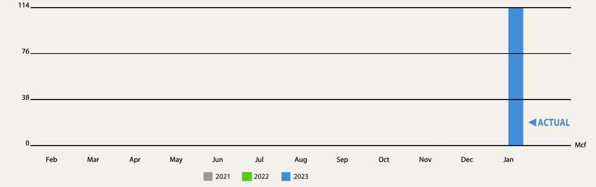
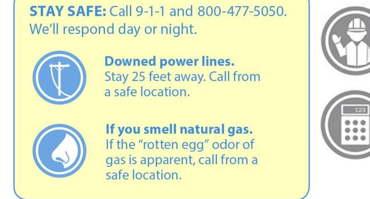
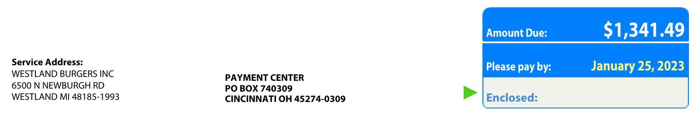
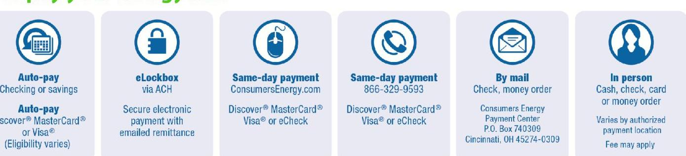

# Consumers Energy 

Count on Us ${ }^{\circledR}$

## Consumers Energy

Count on Us ${ }^{\circledR}$

## WESTLAND BURGERS INC 6500 N NEWBURGH RD WESTLAND MI 48185-1993

## Service Address:

6500 N NEWBURGH RD WESTLAND MI 48185-1993

## January Energy Bill

Total Natural Gas Use (Mcf - thousand cubic feet)

The image is a bar chart showing the yearly usage breakdown (monthly-based) of natural gas in Mcf (thousand cubic feet) for the years 2021, 2022, and 2023. 

- **X-axis:** Months from February to January.
- **Y-axis:** Natural gas usage in Mcf, with labeled increments at 0, 38, 76, and 114.
- **Legend:** 
  - Gray for 2021
  - Green for 2022
  - Blue for 2023
- **Data Point:** A blue bar for January 2023 at 114 Mcf, labeled as "ACTUAL."

| January Natural Gas Use |  |  | Cost per day: |  | Mcf per day: |  | Prior 12 months of gas use: |  |
| :--: | :--: | :--: | :--: | :--: | :--: | :--: | :--: | :--: |
| 114.0 Mcf   January 2022 |  |  | 570.31 |  | 6.333 |  | 114 Mcf |  |

STAY SAFE: Call 9-1-1 and 800-477-5050. We'll respond day or night.

The image is a safety notice with the following elements:

- **Text:**
  - "STAY SAFE: Call 9-1-1 and 800-477-5050. We'll respond day or night."
  - "Downed power lines. Stay 25 feet away. Call from a safe location."
  - "If you smell natural gas. If the “rotten egg” odor of gas is apparent, call from a safe location."

- **Icons:**
  - An icon of a downed power line next to the text about power lines.
  - An icon of a nose next to the text about smelling natural gas.

- **Layout:**
  - The text and icons are arranged vertically, with each icon to the left of its corresponding text.
  - The background is light yellow with blue text.

## Explore Energy Efficiency Solutions for Your Business

Discover the many ways your business can save, or tell us a little about your business to find the solutions best suited to you.

## Get started

www.ConsumersEnergy.com/startsaving

Fold, detach and mail this portion with your check made payable to Consumers Energy. Please write your account number on your check.

The image is a section of a billing statement.

- **Text:**
  - "Service Address: WESTLAND BURGERS INC 6500 N NEWBURGH RD WESTLAND MI 48185-1993"
  - "PAYMENT CENTER PO BOX 740309 CINCINNATI OH 45274-0309"
  - "Amount Due: $1,341.49"
  - "Please pay by: January 25, 2023"
  - "Enclosed:"

- **Layout:**
  - The service address is on the left side.
  - The payment center address is below the service address.
  - The amount due, payment date, and enclosed section are on the right side in a blue box.
  - The amount due is highlighted in white text on a blue background.
  - The payment date is highlighted in yellow text.

The image is a photo of an energy bill from Consumers Energy. 

- **Header Information:**
  - Logo: "Consumers Energy"
  - Contact: "Need to talk to us? Visit ConsumersEnergy.com or call 800-477-5050 Hearing/speech impaired: Call 7-1-1"
  - Service Address: "6500 N NEWBURGH RD; WESTLAND MI 48185-1993"
  - Account: "1030 4614 6314"
  - Invoice: "203410510561"

- **Account Information:**
  - Bill Month: January
  - Service dates: 12/13/2022 - 12/30/2022
  - Days Billed: 18
  - Portion: 05 01/23

- **Rate Information:**
  - Gas Gen Serv Rate GS-1 - Com
  - Rate: 261

- **Meter Information:**
  - Next scheduled meter read date is on or around 01/31/2023

- **Gas Service:**
  - MR Meter
  - Meter Number: 97395035
  - POD Number: 0000003539314
  - Beginning Read Date: 12-13
  - Ending Read Date: 12-30
  - Beginning Read: 93795
  - Ending Read: 94813 (Actual)
  - Differential: 1018
  - Constant: 0.1
  - Correction factor: 1.11980
  - Pressure: 114.0 Mcf

- **January Energy Bill:**
  - **Account Summary:**
    - Last Month's Account Balance: $0.00
    - Balance Forward: $0.00
    - Note: "Payments applied after Jan 03, 2023 are not included."

  - **Natural Gas Charges:**
    - Customer Charge: $9.60
    - Gas Distribution: 114.0 @ 4.259700 = $485.61
    - Other Surcharges: 114.0 @ 0.493800 = $56.29
    - Gas Cost Recovery: 114.0 @ 6.263700 = $714.06
    - Total Natural Gas: $1,265.56

  - **State Sales Tax:** $75.93
  - **Total Energy Charges:** $1,341.49

- **Amount Due:**
  - Due by January 25, 2023
  - Amount: $1,341.49
  - Note: "If you pay after the due date, a 2% late payment charge will be added to your next bill."

- **Footer Note:**
  - "Please make any inquiry or complaint about this bill before the due date listed on the front. Visit ConsumersEnergy.com/aboutmybill for details about the above charges."

Consumers Energy is regulated by the Michigan Public Service Commission, Lansing, Michigan

# Ways to pay your energy bill: 

The image is a photo/illustration showing different ways to pay an energy bill. It includes icons and text for each payment method:

1. **Auto-pay**
   - Icon: Calendar with a dollar sign
   - Text: "Checking or savings"
   - Additional Text: "Auto-pay Discover® MasterCard® or Visa® (Eligibility varies)"

2. **eLockbox**
   - Icon: Padlock
   - Text: "via ACH"
   - Additional Text: "Secure electronic payment with emailed remittance"

3. **Same-day payment (Online)**
   - Icon: Computer mouse
   - Text: "ConsumersEnergy.com"
   - Additional Text: "Discover® MasterCard® Visa® or eCheck"

4. **Same-day payment (Phone)**
   - Icon: Telephone
   - Text: "866-329-9593"
   - Additional Text: "Discover® MasterCard® Visa® or eCheck"

5. **By mail**
   - Icon: Envelope
   - Text: "Check, money order"
   - Additional Text: "Consumers Energy Payment Center P.O. Box 740309 Cincinnati, OH 45274-0309"

6. **In person**
   - Icon: Person silhouette
   - Text: "Cash, check, card or money order"
   - Additional Text: "Varies by authorized payment location Fee may apply"

## Consumers Energy

## Count on Up ${ }^{\circledR}$ NEWS AND INFORMATION

Compare natural gas prices among Consumers Energy and other gas providers at www.Michigan.gov/CompareMIGas.

Our Business Service Guide provides you with important information about your energy service. Learn about options to pay your bill, programs and services and your rights as a customer related to

Newd to talk to us? Visit ConsumersEnergy.com or call 800-477-5050
Hearing/speech impaired: Call 7-1-1

## January Energy Bill

lolling rules and consumer standards with the Michigan Public Service Commission. Visit www.ConsumersEnergy.com/bitguide.

Please see the insert for details on the environmental characteristics of electricity delivered to customers.

Service Address:
6500 N NEWBURGH RD; WESTLAND MI 48185-1993

## Account: 103046146314

Invoice: 203410510561

We have filed a request with the Michigan Public Service Commission in Case No. U-21308 to adjust natural gas distribution rates. A copy of our filing and explanation of the proposed changes may be viewed at our offices and at
http://efile.mpsc.state.mi.us/efile. Learn more at www.ConsumersEnergy.com/ratesbiz.

