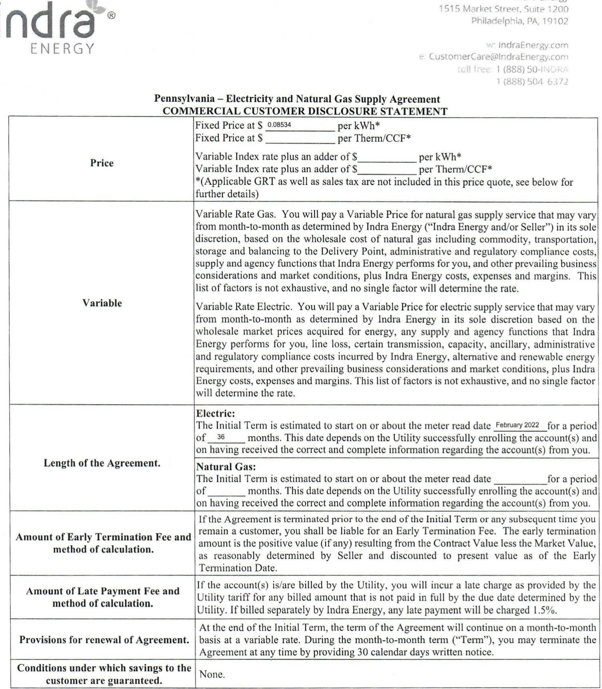

The image is a photo of a document titled "Pennsylvania – Electricity and Natural Gas Supply Agreement" with the subtitle "COMMERCIAL CUSTOMER DISCLOSURE STATEMENT." It contains structured information about pricing, variables, agreement length, and fees related to energy supply. 

Key sections and text include:

- **Price:**
  - Fixed Price at $0.08534 per kWh*
  - Fixed Price at $______ per Therm/CCF*
  - Variable Index rate plus an adder of $______ per kWh*
  - Variable Index rate plus an adder of $______ per Therm/CCF*
  - *(Applicable GRT as well as sales tax are not included in this price quote, see below for further details)*

- **Variable:**
  - Variable Rate Gas: Describes the factors affecting the variable price for natural gas.
  - Variable Rate Electric: Describes the factors affecting the variable price for electric supply.

- **Length of the Agreement:**
  - Electric: Initial Term starts on or about February 2022 for a period of 36 months.
  - Natural Gas: Initial Term starts on or about the meter read date for a period of ______ months.

- **Amount of Early Termination Fee and method of calculation:**
  - Describes the conditions under which an early termination fee is applicable.

- **Amount of Late Payment Fee and method of calculation:**
  - Late payment fee details, including a charge of 1.5% if billed by Indra Energy.

- **Provisions for renewal of Agreement:**
  - Describes the renewal terms at the end of the Initial Term.

- **Conditions under which savings to the customer are guaranteed:**
  - None.

The document includes the company’s contact information at the top, such as the address, website, email, and phone numbers.

This Commercial Customer Disclosure Statement is meant to provide you with a summary of our Agreement and not to be a substitute for reading the Agreement in full. Please refer to the rest of the Agreement for a full disclosure of all the applicable terms and conditions.

# PENNSYLVANIA SUPPLY AGREEMENT COMMERCIAL SALES 

This contract (the "Contract") together with the Commercial Customer Disclosure Statement, the Terms and Conditions and any addenda hereto constitute the Supply Agreement (collectively, the "Agreement") entered into by and between Indra Energy (collectively, the "Seller" or "Indra Energy" or "Indra" or "we") and the customer party identified below ("Customer" or "you"), effective as of the date this Agreement is executed by Seller.

Customer Information:

| Customer Name (legal entity name):   Acadia Healthcare Company, Inc. | DBA (if applicable): | Federal Tax ID: |  |
| :--: | :--: | :--: | :--: |
| Customer Contact: Name:   Christine Coffman | Title: |  |  |
| Phone:   570-649-2200 | Email:   chris.coffman@acadiahealthcare.com | Fax: |  |
| Address for Notices: Street:   3437 Route 715 | City:   Henryville | $\begin{gathered} \text { State: } \\ \text { PA } \end{gathered}$ | $\begin{gathered} \text { Zip: } \\ 18332 \end{gathered}$ |
| Broker:   Power Klosk |  |  |  |
| Utility Name:   Utility Accounts: | $\begin{aligned} & \text { PPL - Electric } \\ & \text { See Addenda A Below } \end{aligned}$ |  |  |
| BILLING TYPE: $\quad$ Utility Consolidated Billing $\quad \square$ Dual Billing |  |  |  |

| Electric Product   Type: | Price: $\$ 0.08534$ |  | Cost Components Included in the Price (check if included):   Energy   Capacity   Transmission   园 Ancillary   Services Standard Renewables (see definition below) |
| :--: | :--: | :--: | :--: |
| $\square$   Variable |  |  |  |
| $\square$ Index |  |  |  |
| $\square$ Block |  |  |  |
| Natural Gas   Product Type: | Price: $\$$ | Cost Components Included in the Price (check if included):   $\square$ NYMEX $\square$ Basis $\square$ Line Loss |  |
| $\square$ Fixed |  |  |  |
| $\square$ Variable |  |  |  |
| $\square$ Index |  |  |  |
|  |  | Voluntary Carbon Offset $\qquad$   see definition below) |  |

The undersigned represents and warrants that each of the following is true and accurate: (i) I am over 18 years of age and an authorized representative of Customer, (ii) I have the authority to make decisions on behalf of Customer regarding its energy supplier, (iii) Customer is not a residential customer; (iv) the energy purchased hereunder is not for residential use; and (v) Customer is in agreement and will comply with all terms and conditions of this Agreement. As used herein, "Commercial Customer" means a non-residential energy customer.

This Agreement shall not become binding and effective until it is fully executed by Seller.
Customer Signature: $\begin{aligned} & \text { Shתction Cen } \\ & \text { Name: Christine Coffman }\end{aligned}$
Title: Regional Controller

## INDRA ENERGY

Signature:
Name:
Title:

# SCHEDULE 

Account Name: Acadia Healthcare Company, Inc.
Service Address: See Addenda A Below
Account Number: See Addenda A Below
Utility: PPL

## Account Name:

Service Address:
Account Number:
Utility:

## Account Name:

Service Address:
Account Number:
Utility:

## Account Name:

Service Address:

Account Number:
Utility:

## Account Name:

Service Address:

Account Number:
Utility:

## Account Name:

Service Address:

Account Number:
Utility:

## Account Name:

Service Address:

Account Number:
Utility:

## Account Name:

Service Address:

Account Number:

Utility:

## Account Name:

Service Address:

Account Number:

Utility:

# PENNSYLVANIA - ELECTRICITY AND NATURAL GAS SUPPLY AGREEMENT Terms and Conditions 

1. Overview. These Terms and Conditions supplement and form a part of the Agreement between Seller and you, the Customer. Seller agrees to sell, and Customer agrees to buy the quantity of electricity and/or natural supply meeting Customer's full requirements for each Account.
2. Term. Customer acknowledges that (i) the Service Start Date is dependent upon the relevant Utility confirming to Seller that it has completed all required enrollment processes and (ii) if the enrollment processes are completed by a Utility after the Estimated Start Date, the Service Start Date will occur as soon as practicable after the enrollment processes are completed by the Utility, without Seller incurring any liability for such delayed start. The initial term of this Agreement will run from the Service Start Date through the Service End Date ("Initial Term"), unless earlier terminated as provided herein. At the end of the Initial Term, this Agreement shall automatically continue on a month-to-month basis at a Variable Rate, unless and until terminated by either Party upon providing the other Party with 30 days' prior Notice.
3. Customer Charges. For each billing cycle during the Initial Term or any subsequent Term, the amount to be charged to Customer by Seller for each Account shall be the sum of the following: (i) the Commodity Charges, (ii) the amount assessed by Seller for any Cost Components for such billing cycle that are not indicated as being included in the applicable Price for such Account, (iii) all applicable Taxes (except for any Taxes that are expressly included in the Price) and (iv) any costs and charges assessed pursuant to this Agreement (collectively, the "Seller Charges"). After the expiration of the Initial Term, the Price will be a variable month to month price as determined by Seller based on various factors, including but not limited to applicable industry charges, wholesale market conditions, supply sources, seller's margin, and may change monthly without prior notice to Customer, unless provided otherwise in writing signed by both Parties. The Price does not include the costs of distribution and other services provided by the relevant Utility (the "Utility Charges"). Unless otherwise stated herein, prices shall include all cost components associated with compliance with renewable energy requirements mandated by Law.
4. Billing and Payment. With respect to each Account, Customer may receive one consolidated bill from the relevant Utility each bill cycle for both the Utility Charges and the Seller Charges (the "Utility Consolidated Billing" or "UCB") and the bill will be sent to the billing address on file with the Utility. In such case, Customer agrees to remit payment for all amounts reflected on such invoice directly to the Utility in accordance with the Utility's payment terms. Seller reserves the right to immediately terminate the Agreement and supply service in the event that Customer fails to make full payment of the Seller charges when due on any consolidated bill prepared by the Utility. Seller also reserves the right to invoice the customer directly for any and all supply charges in the event that Customer's billing status is changed from Utility Consolidated Billing to dual billing for any reason. Seller may also bill the Customer directly for any reason, and in such case, the Customer agrees to remit payment of all amounts reflected on Seller's invoice directly to Seller no later than 20 days from the date of billing ("Dual Billing Option"). If you are switched to Utility Consolidating Billing from the Dual Billing Option at any time during the term of your Agreement, Indra reserves the right to adjust your rate and pass through any costs imposed on Indra by your local utility due to this change (i.e. "POR costs"). The POR costs incurred by Seller are set by your local distribution utility and made publicly available on the applicable utility's supplier tariff. All invoices will include amounts for applicable Taxes. Depending on the bill format, charges assessed pursuant to this Agreement may appear on Customer's bill as a line item or Price adjustment. Regardless of billing method, invoices may cover multiple Accounts where applicable. Unpaid balances on Customer's account(s) not received by the due date specified on the invoice will be subject to a late charge of the lesser of $1.50 \%$ per month or the maximum permitted by Law ("Interest Rate"). Seller will charge a $\$ 35$ return check fee for all returned checks. Seller is not responsible for notifying Customer of any failed or returned payments. Absent a specific designation from Customer, if multiple balances are due, the payments will be applied to the oldest balance first. Seller may apply any credit balance on a particular Account to a balance owed on any other Account supplied by Seller. Seller will include or cause to be included in any subsequent bill from Seller, adjustments related to previous billings, including estimates, billing or meter read errors, or other errors or omissions. If Customer disputes the Seller Charges on any bill, Customer must pay any undisputed portion of the bill by the applicable due date. If the unpaid, disputed portion of the bill is subsequently resolved in favor of Seller, the Interest Rate will be applied to such unpaid amounts. Failure to make full payment of the Seller's Charges when due will be grounds for termination of the Agreement. Customer will be responsible for the costs of all collection activity, including reasonable attorneys' fees and disbursements incurred by Seller in enforcing the terms of this Agreement. Indra reserves the right to apply any collateral posted by customer in connection with this Agreement against any unpaid balances, late fees and penalties incurred on Customer's account in accordance with applicable law.
5. Taxes. Customer shall be responsible for paying all applicable taxes associated with sales under, and/or the performance of, this Agreement. Unless otherwise specified herein, the Price for electricity and/or natural gas herein does not include Taxes; Seller maintains the right to collect any and all applicable Taxes from the Customer, as needed. Where the Customer claims to be tax exempt, Customer shall provide written evidence of any tax exemption to Seller and each relevant Utility before the Service Start Date. Seller may recognize a lawful tax exemption on a prospective basis only after Customer provides proper documentation to Seller. Customer shall be liable for, and shall indemnify Seller against, any Taxes and associated interest or penalties assessed against Seller by any third party due to Customer's failure to timely provide or properly and accurately complete any such evidence.
6. Change in Usage. Customer shall provide Seller with timely Notice of any change in the attributes or use of any Account (including any event) that is likely to result in a load change of $\quad 25 \ldots \ldots \%$ or more (the "Load Change Percentage") as compared to the Forecasted Volume. Examples of such changes may include, but are not limited to equipment outages, shutdowns or replacements, on-site generation, openings or closings, and/or changes in operating hours. Customer shall be responsible for payment of any and all losses, costs and/or charges incurred by Seller resulting from such change and/or exceeding the Load Change Percentage, including, but not limited to, additional ISO or Utility charges (collectively, "Additional Charges").

7. Regulatory Change. If there is a Regulatory Change which causes Seller to incur new or modified fees, costs or charges ("Regulatory Charges"), Seller reserves the right to pass through the Regulatory Charges to Customer without markup. For the avoidance of doubt, the Parties agree that a change in the rate classification of an Account will be deemed a Regulatory Change. The changes described in this Section may impact any or all of the charges described in this Agreement, whether described as "fixed," "variable," "included," "passed through" or otherwise. Regulatory Change means the introduction of any new, or any change in, Law, rules, regulations, orders, rates, charges, Capacity obligations, load profiles, transmission obligations, demand response programs, resource or fuel adequacy programs, renewable portfolio standards or other renewable or clean energy requirements, Utility or ISO operations, market structure, congestion zone design, Utility tariffs Utility policy and/or procedures, and/or ISO rules or protocols.
8. Early Termination. If the Customer fails to timely pay any amount due, Seller shall have the right to immediately terminate the agreement "Event of Default" and (i) designate an early termination date (the "Early Termination Date") to accelerate all amounts owing between the Parties and to liquidate and terminate any or all Transactions (each, a "Terminated Transaction"), (ii) withhold any payments due to Customer and/or (iii) suspend performance of its obligations under this Agreement. Seller may terminate the Agreement even if Customer subsequently cured the Event of Default after such period has expired. In addition to the other remedies specified herein, upon the occurrence of an Event of Default with respect to Customer, Seller shall be permitted to switch Customer to receive Default Service at each Account. Seller's sales of energy supply to Customer at each Account shall be treated as separate transactions (each, a "Transaction") under this Agreement.
9. Termination and/or Load Change Percentage Payment Calculation. On an Early Termination Date, Seller shall close out each Terminated Transaction so that each such Terminated Transaction is canceled and shall calculate and aggregate the Termination Payment for all Terminated Transactions. The Parties agree that a Terminated Transaction will become effective after the Account drop has been processed by the applicable Utility and the Account is no longer supplied under the Agreement and, in case there are multiple Terminated Transactions, the effective termination date will be whichever occurs last (the "Effective Termination Date"). In determining the Termination Payment and/or payment for any costs incurred due to any Load Change Percentage, Seller (i) need not actually enter into replacement transactions, (ii) may utilize the Forecasted Volume or any other Customer-related information it deems relevant to determine the quantity of energy to be purchased by Customer for the remaining term of any Terminated Transactions, and (iii) may consider, among other valuations, any settlement prices of the New York Mercantile Exchange energy futures contracts, internal curves, quotations from leading dealers in energy swap contracts, and other bona fide party bids and offers, which may include, on an arms' length basis, offers from Seller's affiliates, all adjusted for the remainder of the applicable term and basis differentials. Customer shall pay the Termination Payment to Seller within 3 Business Days of Customer's receipt of Notice of the amount thereof from Seller and shall owe any interest accrued at the Interest Rate from the date the Termination Payment is due until paid in full, provided that Seller may set off the amount of any Collateral provided by Customer and held by it under this Agreement against the amount of the Termination Payment. Irrespective of whether a Termination Payment is owed hereunder, Customer shall pay to Seller the Seller's Charges incurred up to the Effective Termination Date. Seller will refund any Collateral surplus after Customer's obligations to Seller have been paid in full. Customer acknowledges and stipulates that the payment obligations set forth herein are difficult to estimate and represent a reasonable approximation of the anticipated harm or loss to Seller as a result of an Event of Default with respect to Customer. Seller reserves all rights, setoffs, counterclaims, combination of accounts, liens and other remedies and defenses which it has or may be entitled to (whether by operation of law or otherwise).
10. Credit. Customer shall provide Seller with financial and other information as Seller may request to complete its credit review, and other contracting processes. Seller reserves the right to not enter into this Agreement in its sole discretion including if: (i) information provided by Customer or its representative (broker/agent) to Seller is incomplete or inaccurate; (ii) the Price listed was not authorized by Seller or rates have changed based on market conditions; (iii) transfer of Customer account(s) is denied or significantly delayed by the Utility; or (iv) Customer does not meet Seller's credit approval criteria. If, at any time during the term of this Agreement, Seller determines that (i) Customer has failed to timely pay any amounts due under this Agreement, or (ii) Seller has reasonable grounds for insecurity with respect to Customer or Customer's creditworthiness, Seller may require that Customer provide (in addition to any Collateral previously provided) Collateral for its obligations under this Agreement. Seller reserves the right to collect Collateral in the form of a deposit equal to the sum of two of the Customer's largest energy usage invoices in the last twelve months at the contracted rate. Customer hereby grants to Seller, as security for the payment and performance of Customer's obligations under this Agreement, a first priority continuing lien and security interest in and to any Collateral (and proceeds and products thereof) that Customer has or may deliver to Seller. When making a request for Collateral, Seller shall comply with its license requirements (if applicable) and any other deposit requirements established by any regulatory body. Any Collateral provided by Customer will be held in accordance with the applicable Law.
11. Renewable Energy. Electricity sold under this Agreement will be supplied from a variety of generating sources, including the electricity provided pursuant to any renewable energy requirements. For electricity plans, your consumption for this product will be offset by RECs from eligible sources including, but not limited to hydro, wind and/or solar generation where applicable. If you choose Voluntary Renewables to be included in your product, Seller will purchase and retire renewable energy certificates ("RECs") to match the applicable percent of your electricity usage, above and beyond any state renewable portfolio standard requirements. If you choose a natural gas plan that includes carbon offsets, a percentage of your natural gas usage (as specified in this Agreement) will be matched with carbon offsets.
12. Information Release Authorization. Customer hereby authorizes Seller to request and obtain account-related data from the Utility, including account name and number, billing and service address, billing and payment history, standard offer service type, rate classification, meter readings, future and historical usage information (including interval meter data), load profile, peak demand and other characteristics of energy service (collectively, "Customer Information"). Customer further agrees that (i) by accepting this Agreement, it is authorizing Utility to release such information to Seller and Seller to disclose the Customer Information as specified in this Agreement; and (ii) the Customer Information exchanged between Seller and the Utility in connection with the energy supply services provided hereunder may be deemed public information for all purposes related to any data security agreement entered into between Seller and the Utility. This

authorization will remain in effect during the term of the Agreement. Seller reserves the right to immediately terminate the Agreement if this authorization changes for any reason.
13. Limitation of Liability: Disclaimer of Warranties: Indemnity. EXCEPT WITH RESPECT TO REMEDIES OTHERWISE EXPRESSLY PROVIDED FOR IN THIS AGREEMENT, LIABILITY HEREUNDER IS LIMITED TO DIRECT DAMAGES AS THE SOLE AND EXCLUSIVE REMEDY AND ALL OTHER REMEDIES OR DAMAGES AT LAW OR IN EQUITY ARE EXPRESSLY WAIVED. IN NO EVENT SHALL EITHER PARTY BE LIABLE TO THE OTHER FOR ANY INCIDENTAL, CONSEQUENTIAL, PUNITIVE OR ANY BUSINESS INTERRUPTION DAMAGES. EACH PARTY AGREES THAT IT HAS A DUTY TO MITIGATE DAMAGES AND COVENANTS THAT IT WILL USE COMMERCIALLY REASONABLE EFFORTS TO MINIMIZE ANY DAMAGES IT MAY INCUR AS A RESULT OF THE OTHER PARTY'S PERFORMANCE OR NON-PERFORMANCE OF THIS AGREEMENT. CUSTOMER HEREBY WAIVES ANY RIGHT IT MAY HAVE TO PARTICIPATE AS A PLAINTIFF IN A CLASS ACTION LAWSUIT AGAINST SELLER IN CONNECTION WITH ANY CLAIM, CAUSE OF ACTION, ACTION OR PROCEEDING RELATING TO THIS AGREEMENT, INCLUDING AN UNAUTHORIZED DISCLOSURE OF ANY CUSTOMER INFORMATION PROVIDED BY THE CUSTOMER OR THE UTILITY IN CONNECTION HEREWITH. SELLER MAKES NO REPRESENTATIONS OR WARRANTIES OTHER THAN THOSE EXPRESSLY SET FORTH IN THIS AGREEMENT, AND EXPRESSLY DISCLAIMS AND NEGATES ALL OTHER REPRESENTATIONS AND WARRANTIES, EXPRESS OR IMPLIED, INCLUDING WARRANTIES OF MECHABRABILITY AND FITNESS FOR A PARTICULAR PURPOSE, OR REPRESENTATIONS AND WARRANTIES RELATED TO THE SUITABILITY OR SECURITY OF ITS DATA PRIVACY POLICIES OR PRACTICES. SELLER DOES NOT GUARANTEE SAVINGS. WITH RESPECT TO ENERGY SOLD BY SELLER. CUSTOMER AGREES TO INDEMNIFY, DEFEND, AND HOLD HARMLESS SELLER FROM ANY CLAIMS ARISING FROM ANY ACT OR INCIDENT OCCURRING AT OR AFTER DELIVERY OF ENERGY TO CUSTOMER. TO THE FULLEST EXTENT ALLOWED BY THE APPLICABLE LAW, BUYER HEREBY WAIVES ITS RIGHTS UNDER ALL LAWS, RULES, REGULATIONS AND ORDERS PERTAINING TO RETAIL ENERGY SUPPLY, INCLUDING RIGHTS RELATED TO CONTRACT RESCISSION, CUSTOMER DISCLOSURES, DELIVERY OF CUSTOMER CONTRACTS TO CUSTOMERS, RECORD KEEPING, INTEREST PAID ON DEPOSITS AND CUSTOMER NOTICES.
14. Governing Law: Venue. To the extent permitted by local law, this Agreement and the rights and duties of the Parties under this Agreement are governed by the internal Law of the state of New York without regard to conflict of law principles. New York County, New York State is the designated venue. To the maximum extent possible under the Law, article 2 of the Uniform Commercial Code will apply to the energy sold under this Agreement. EACH PARTY WAIVES, TO THE FULLEST EXTENT PERMITTED BY APPLICABLE LAW, ANY RIGHT IT MAY HAVE TO A TRIAL BY JURY IN RESPECT OF ANY SUIT, ACTION OR PROCEEDING RELATING TO THIS AGREEMENT. Any controversy or claim arising out of or relating to this Agreement, or the breach thereof, shall be settled by arbitration administered by the American Arbitration Association in accordance with its Commercial Arbitration Rules, and judgment on the award rendered by the arbitrator(s) may be entered in any court having jurisdiction within the venue identified herein.
15. Assignment. Customer may not assign this Agreement or any of its rights or obligations hereunder without Seller's prior written consent which shall not be unreasonably withheld. Seller may assign this Agreement and its rights and obligations hereunder upon Notice to Customer as required under the applicable Law. Any assignee hereof shall be subject to all the provisions and conditions of this Agreement as applicable to its assignor to the same extent as though such assignee were an original Party to this Agreement. This Agreement will inure to the benefit of and be binding upon the Parties and their respective successors and permitted assigns. Any assignment in violation of this section shall be void.
16. Force Majeure. Notwithstanding any other provision of this Agreement, if a Party is unable to carry out any obligation under this Agreement due to Force Majeure (other than a payment obligation relating to performance provided prior to or during the Force Majeure, which shall not be excused by Force Majeure), this Agreement will remain in effect but such obligation will be suspended for the duration of the Force Majeure, provided: (i) the claiming Party notifies the other Party as soon as practicable in writing of the particulars of the Force Majeure; (ii) suspension of performance is of no greater scope and duration than required by the Force Majeure; and (iii) the claiming Party uses commercially reasonable efforts to remedy its inability to perform. If the Force Majeure continues for a period of 30 days or more where Customer is the declaring Party, then Seller may terminate this Agreement with respect to the Accounts adversely affected by the Force Majeure upon. It is expressly agreed by the Parties that the ability of Seller to sell the products and services provided hereunder at a greater price, and the ability of Customer to purchase the products and services provided hereunder for a lower price, than the price specified herein shall not constitute an event of Force Majeure. Seller is not responsible for transmitting or distributing energy. In the event of a power outage, Customer should contact the relevant Utility. "Force Majeure" means an event (a) not within the reasonable control of the Party, (b) not caused by the negligence of the claiming Party, and (c) which, in the claiming Party's exercise of due diligence, the claiming Party is unable to overcome. Notwithstanding the foregoing, Force Majeure includes: (a) an event of Force Majeure affecting any relevant Utility or ISO; (b) a suspension, curtailment, or service interruption by the Utility or ISO or (c) a cyber incident affecting network security or computer systems, applications or data, including hacker and/or denial of service attacks, or propagation of malicious code affecting Seller, the Utility or the ISO.
17. Representations. Each Party represents and warrants to the other Party that (i) it is duly organized, validly existing and in good standing under the laws of the jurisdiction of its formation and is qualified to conduct its business in those jurisdictions necessary to perform this Agreement; (ii) it has the power and authority to sign and perform this Agreement and, with respect to Customer only, to bind each Account to the terms and conditions of this Agreement; (iii) the execution of this Agreement is within its powers, has been duly authorized and does not violate any of the terms or conditions in its governing documents or any contract to which it is a party or any law applicable to it; (iv) it intends to be legally bound by this Agreement and has caused the Agreement to be executed by its duly authorized officer or representative as of the date shown on the Agreement; (v) it is not Bankrupt; (vi) it has knowledge and experience in business matters that enable it to evaluate the merits and risks of entering into this Agreement; and (vii) all information provided by it to the other Party is true, correct and complete in all material respects. In connection with the negotiation and execution of this Agreement, Customer represents

and warrants to Seller that: (a) Seller is not acting as a fiduciary, commodity trading advisor or other advisor for Customer; (b) Customer understands the risks associated with this Agreement, has consulted with its own independent advisors and has made its own decisions with respect hereto based upon its own judgment and not upon any advice of Seller; (c) Seller has not made any representations to it concerning the advisability of entering into this Agreement or any addenda hereto; (d) none of the Accounts for which it is purchasing energy from Seller is a residence; (e) for all purposes that may impact its energy usage, Customer will operate the Accounts in the same or substantially the same manner as it has in the last twelve (12) months preceding the date when the Agreement has become effective; and (f) it is entering this Agreement as principal and not as agent for any other party.
18. Confidentiality. Customer agrees to keep all terms and provisions of this Agreement and all communications in connection herewith, including pricing and other terms offered to Customer, confidential and to not disclose them to any third parties without the prior written consent of Seller, except as otherwise required by Law or judicial process. Customer hereby authorizes Seller to obtain from the Utility its Customer Information and authorizes Seller to disclose such Customer Information to the Utility, third party energy consultants, brokers or third party service providers who has provided or provides services to Seller in connection with this Agreement, Seller's affiliates or prospective purchasers of all or part of its business, who have agreed to keep such information confidential, or as required by Law or judicial process. Customer further agrees that the Customer Information exchanged between Seller and the Utility in connection with the energy supply services provided hereunder may be deemed public information for all purposes related to any data security agreement entered into between Seller and the Utility.
19. Notices. The Parties will send all notices relating to this Agreement in writing by overnight courier, or hand delivery (each, a "Notice"), provided that Seller may communicate or inquire about operational decisions by telephone and/or email. The Notices shall be delivered, with respect to Customer, to the address specified in this Agreement. Customer agrees to inform Seller if any of the contact information provided changes. The Notices shall be delivered, with respect to Seller, as follows:

Indra Energy
1515 Market Place, Suite 1200
Philadelphia, PA 19102
Attention: Legal Department
Notice by overnight courier or hand delivery will be deemed received by close of the Business Day (no later than 5:00 p.m. EST) on the day delivered. A Party may change its address or contact information by providing Notice to the other Party in accordance herewith. Customer shall keep its contact information updated and provide Seller with prior Notice of any changes.
20. Miscellaneous. This Agreement constitutes the entire agreement between the Parties and supersedes any prior or contemporaneous agreements or representations affecting the subject of this Agreement. All provisions in this Agreement regarding payments and indemnification shall survive the termination or expiration hereof until the expiration of the applicable statute of limitations. This Agreement may be executed in several counterparts, each of which will be an original and all of which constitute one and the same Agreement. Each Party may assume that all Notices and emails sent from the other Party have been sent by an authorized representative of such other Party. Subject to the rights that may accrue to any successors or permitted assignees of the Parties, no provision of this Agreement is to be construed as creating any rights enforceable by a third party, and all third-party beneficiary rights are expressly negated. Customer agrees that compensation owed to any third party representing Customer in connection with this Agreement may be included in the Price and Customer will indemnify and defend Seller against, and hold Seller harmless from, any Claims made by any such third party (including for amounts owed to any such third party that are not included in the Price) and any costs incurred by Seller with respect to such Claims (including legal fees and disbursements). Any provision or section hereof declared or rendered unlawful by a court or regulatory agency or deemed unlawful because of a change in Law will not otherwise affect the remaining lawful obligations that arise under this Agreement. Except as otherwise provided in this Agreement, the rights, powers, remedies, and privileges provided in this Agreement are cumulative and not exclusive of any rights, power, remedies, and privileges provided by Law. No waiver by Seller of any breach of this Agreement by Customer is effective unless expressly made in writing, and any such waiver is effective only in that instance and only for the purpose expressly stated in writing and will not be construed as a waiver of any other breach. As used in this Agreement, the term "including" means "including without limitation." Customer acknowledges that Seller and its affiliates are in the business of buying and selling energy and related products within the various markets for their own respective accounts and that (i) such participation in such markets may affect the relevant market prices used to determine charges hereunder and (ii) nothing in this Agreement restricts Seller or any of its affiliates from participating in activities that may affect market prices. Customer will not (a) withhold payment for any reason (subject to Customer's right to dispute invoices), (b) resell any portion of the energy purchased from Seller to any third party or (c) own or use any on-site generation or thermal or battery storage capabilities at any Account during the term hereof. This Agreement and all sales of energy hereunder form a single integrated agreement between the Parties. Seller may use the contact information provided above to contact Customer including by e-mail, automatically dialed calls, text messages or calls that use artificial or prerecorded voice regarding any billing, service or account-related matter.
21. Acknowledgements. Each Party agrees, understands and acknowledges that: (i) this Agreement is a "forward contract" and a "master netting agreement" as defined in the United States Bankruptcy Code (the "Code"); (ii) this Agreement shall not be construed as creating an association, trust, partnership, or joint venture in any way between the Parties, nor as creating any relationship between the Parties other than that of independent contractors for the sale and purchase of a commodity; (iii) Seller is not a "utility" as defined in the Code; (iv) commodity supply will be provided by Seller under this Agreement, but delivery will be provided by the Customer's Utility; and (v) Customer's Utility, and not Seller, is responsible for responding to outages, leaks or emergencies should they occur.
22. Title and Risk.
a. Electricity. Title and risk of loss to electricity shall pass from Seller to Customer at the relevant Delivery Point(s). Seller will arrange for the delivery of electricity by the relevant Utility to each Account. As a condition precedent to Seller entering into this Agreement, Customer shall satisfy Seller's contracting, credit, and applicable know- your-customer/anti-money laundering requirements.
b. Natural Gas. Title to, possession of and risk of loss of the gas will pass from the Seller to the Customer at the applicable Sales

Point(s). As between the Parties, Seller will be in exclusive control of the gas and responsible for any damage, injury or loss until the gas has been delivered for Customer's Account(s) at the Sales Point(s), after which delivery Customer will be deemed to be in exclusive control and possession and responsible for any injury, damage or loss.
23. Emergency Contact. In the event of an energy emergency or power outage, Customer should immediately contact their applicable Utility or dial 911 . Customer may find the Utility emergency number by visiting their website.
24. Definitions. As used in this Agreement, the following terms have the stated meanings, provided that capitalized terms in this Agreement not defined in this Section will have the meaning ascribed thereto elsewhere this Agreement (all definitions apply to singular and plural forms):
a. "Account" means each energy account meter located at each service address specified to receive energy supply pursuant to this Agreement.
b. "Administrative Fee" means a fee charged by Seller for the energy supply provided under this Agreement.
c. "Ancillary Services" means the costs associated with providing ancillary services required to facilitate delivery of Energy as set forth in the applicable ISO Open Access Transmission Tariff, including but not limited to congestion, transmission facility charges, and, where applicable, transmission service charges.
d. "Bankrupt" means with respect to a Party, such Party (i) files a petition or otherwise commences, authorizes or acquiesces in the commencement of a proceeding or cause of action under any bankruptcy, insolvency, reorganization or similar law, or has any such petition filed or proceeding commenced against it, (ii) makes an assignment or any general arrangement for the benefit of creditors, (iii) otherwise becomes bankrupt or insolvent (however evidenced), (iv) has a liquidator, administrator, receiver, trustee, conservator or similar official appointed with respect to it or any substantial portion of its property or assets, or (v) is generally unable to pay its debts as they fall due.
e. "Basis" means the difference in the value of an underlying commodity between different physical locations and/or different points in time.
f. "Business Day" means any day other than a Saturday, a Sunday or a day on which commercial banking institutions in Houston, Texas or New York, New York are authorized or required by Law to be closed.
g. "Capacity" means the costs and charges attributable to the Accounts capacity requirements imposed by the ISO and/or the Utility.
h. "Carbon Offset" means that a percentage of your natural gas usage that will be matched with carbon offsets. Carbon offset is a reduction in emissions of carbon dioxide made in order to offset an emission made elsewhere.
i. "Claim" means all claims, demands, suits or actions of every name and nature, threatened or filed before or after this Agreement is terminated, both at law and in equity, and whether groundless, false, or fraudulent, that directly or indirectly relate to the subject matter of an indemnity contained in this Agreement, and any and all resulting losses, damages, penalties, fines, costs and expenses (including attorneys' fees and expenses and court costs) however incurred.
j. "Collateral" means, with respect to a Party, cash margin, letter of credit or other credit support or collateral provided to secure such Party's obligations under this Agreement, each in a form, from a bank, and in an amount acceptable to the Party requesting the Collateral.
k. "Commercial Customer" means a non-residential energy customer.

1. "Commission" means any applicable Regulatory Authority.
m. "Commodity Charges" means a portion of Customer's energy bill for each Account which shall be equal to Customer's Energy Usage at such Account multiplied by the applicable Price, unless otherwise specified in any addenda hereto.
n. "Contract Value" means with respect to each Terminated Transaction, as of the Early Termination Date, the product of (a) the Price, and (b) the Remaining Usage (as reasonably determined by Seller based on its present value).
o. "Costs" means, and shall include (at the election of Seller but without duplication), any brokerage fees, commissions and other transactional and/or administrative costs, losses and expenses incurred by Seller as a result of Seller's maintaining and/or terminating any hedges or other risk management contracts and/or entering into new arrangements to replace the Terminated Transactions, and any out-of-pocket expenses incurred by it, including attorneys' fees and expenses, by reason of the enforcement and protection of its rights under this Agreement or any Terminated Transaction.
p. "Cost Component" means the relevant energy supply costs or any addenda hereto which may be included in the Price or other fee charged by Seller.
q. "Default Service" means default energy service or standard offer service required by Law to be provided by the relevant Utility for any Account.
r. "Delivery Point" means the load zone associated with each Account and/or the city gate or other demarcation point as determined by the Seller.
s. "Dual Billing" means the Utility and Supplier produce separate Customer bills, each containing the charges of that party for the product/service provided, for which separate payments from the Customer are expected.
t. "Early Termination Amount" means, with respect to a Terminated Transaction, the positive value (if any) resulting from the Contract Value less the Market Value, as reasonably determined by Seller and discounted to present value as of the Early Termination Date.
u. "Energy" means the electrical and or natural gas energy at a specific ISO load zone, calculated based on costs that include the LMP and line losses.
v. "Energy Usage" means Customer's metered energy usage for each Account measured in kWh for electric and therm(s) for gas, as reported by the Utility for the applicable period or as reasonably estimated by Seller, plus the applicable line losses (if not already included in the Price).
w. "Estimated Start Date" means the date specified on the Account Attachment.
x. "Event of Default" means: (a) the failure of a Party to make timely payments of any amounts due under this Agreement or a Party

becomes Bankrupt; (b) any representation or warranty made by a Party in this Agreement proves to be false or misleading when made or repeated; (c) a Party fails to perform its obligations hereunder and is not excused by Force Majeure; or (d) with respect to Customer only, (A) Customer rescinds the information release authorization granted to Seller; (B) the failure by Customer to utilize Seller as its sole supplier of energy for any of the Accounts specified in this Agreement (including having one or more Accounts disconnected from utility service by any Utility); (C) one or more Accounts fail to enroll; (D) Customer fails to provide Collateral in accordance with this Agreement within two (2) Business Days of receiving Seller's written demand therefor; or (E) a Transfer Event occurs with respect to Customer.
y. "Forecasted Volume" means the Customer's expected energy consumption for each month of the Term as set forth on any Account Attachment or addenda hereto or as reasonably determined by Seller based on historical usage information, including but not limited to any information provided by the Utility.
z. "ICAP/UCAP" means a meter/account-specific value assigned by the applicable Utility used to determine the capacity obligation procured on behalf of Customer.
aa. "ISO" means the applicable independent system operator.
bb. "Law" means any constitution, law, statute, regulation, rule, protocol, tariff, procedure, exchange rule, decision, writ, order, decree, or judgment, or any interpretation thereof by any court, government agency, regulatory body, instrumentality or other jurisdictional authority.
cc. "Line Loss" means the difference between the gas injected into a distribution system and the gas measured at customers' meters.
dd. "LMP" means the real time locational marginal price for the Account's applicable load zone, which is published by the ISO for each settlement interval and expressed in $\$ / \mathrm{MWh}$, provided that the LMP may be converted to $\$ / \mathrm{kWh}$ for billing purposes.
ec. "Market Value" means with respect to each Terminated Transaction, as of the Early Termination Date, the product of (i) the Remaining Usage and (ii) the market price(s) at which such Remaining Usage is commercially available to Seller (all, with respect to (i) and (ii), as reasonably determined by Seller based on their present value).
ff. "NYMEX (New York Mercantile Exchange)" means the division where natural gas futures and other energy futures are traded.
gg. "Party" or "Parties" means Seller and/or Customer, individually or together, as the case may be.
hh. "Price" means, during the Initial Term, the unit price specified in this Agreement or any addenda hereto, and, after expiration of the Initial Term, the market based price determined by Seller in accordance with this Agreement which may vary each month.
ii. "Remaining Usage" means the energy supply which would have been provided by Seller under each Terminated Transaction during the remaining term of this Agreement had the Agreement not been terminated, as reasonably determined by Seller.
jj. "Service End Date" means, with respect to each Account, the meter read date occurring during the month specified on the Account Attachment or if a meter read date is not scheduled by the Utility during such month, the meter read date occurring immediately thereafter.
kk. "Service Start Date" means, with respect to each Account, the date when the applicable Utility has completed all required enrollment processes enabling Seller to start the delivery of energy to the Account(s).
ll. "Standard Renewables" means the costs arising from Seller's obligations to meet the renewable energy portfolio standards, the clean energy standards and/or other similar standards or requirements mandated by Law.
mm."Taxes" means all tax, duties, fees, levies, premiums or any other charges of any kind relating to the sale, purchase or delivery of energy, including but not limited to, gross receipts tax (GRT), utility excise taxes, sales, consumption, or commercial activity tax.
nn. "Termination Payment" means, with respect to a Terminated Transaction, (i) the Early Termination Amount (if any) plus (ii) all of Seller's Costs.
oo. "Transfer Event" means, with respect to Customer: (A) Customer merges or otherwise consolidates with another entity and the creditworthiness of the merged or consolidated entity (as reasonably determined by Seller) is either (i) inferior to Customer's or (ii) equal to or greater than Customer's but such entity fails to assume in writing all of Customer's obligations under this Agreement; (B) a majority of the direct or indirect ownership interests in Customer is sold, transferred or assigned and such new owner seeks to terminate or repudiate Agreement other than in accordance with the terms hereof; or (C) Customer sells all, or substantially all, of its assets to another person.
pp. "TPV" means a Seller approved and third party verified recording.
qq. "Transmission" means, where applicable, network connection charges including the NYPA Transmission Adjustment Charge ("NTAC") and the Transco Facilities Charge ("TFC") as defined in the New York Retail Access Tariffs any PJM fees, Delaware State Fees, and any other Transmission Fees that may apply in obtaining power or natural gas in fulfillment of this agreement.
rr. "Utility" means the distribution company which is an energy corporation owning, operating or managing energy facilities for the purpose of distributing energy to end users.
ss. "Utility Consolidated Billing" means a single bill received from the Utility that list both the supplier and distribution charges.
tt. "Voluntary Renewables" means the percentage of renewable energy components above Seller's renewable energy obligations mandated by applicable Law.

ADDENDA "A"

| Address | City | State | Zip Code | Utility | Utility Account \# |
| :--: | :--: | :--: | :--: | :--: | :--: |
| 3437 Route 715 | Henryville | Pennsylvania | $\begin{aligned} & 18332- \\ & 7785 \end{aligned}$ | PPL | 4627131028 |
| 235 Rock Crest Dr | Henryville | Pennsylvania | 18332 | PPL | 5257574043 |
| 234 Rock Crest Dr | Henryville | Pennsylvania | 18332 | PPL | 1807132020 |
| 5974 Susquehanna Tri | Turbotville | Pennsylvania | 17772 | PPL | 6508053036 |
| 314 Cherry Lane Rd Kitchen | East Stroudsburg | Pennsylvania | 18301 | PPL | 2713377034 |
| 53 NW End Ave | Lancaster | Pennsylvania | 17603 | PPL | 9239115004 |
| 314 Cherry Lane Rd Inn | East Stroudsburg | Pennsylvania | 18301 | PPL | 4127131082 |
| 1620 Riverside Dr | Bethlehem | Pennsylvania | $\begin{aligned} & 18015- \\ & 1215 \end{aligned}$ | PPL | 9185988013 |
| RR1 Unit 36A Laundry   Building | Henryville | Pennsylvania | 18332 | PPL | 2167136014 |
| RR1 Box 52-E | Henryville | Pennsylvania | 18332 | PPL | 3187026029 |
| 237 Rock Crest Dr | Henryville | Pennsylvania | 18332 | PPL | 1887132015 |
| 237 Rock Crest Dr | Henryville | Pennsylvania | 18332 | PPL | 4647131024 |
| 836 Marietta Ave Apt 1 | Lancaster | Pennsylvania | 17603 | PPL | 8135097137 |
| RR1 | Allenwood | Pennsylvania | 17810 | PPL | 2358056007 |
| 49 Rock Crest Dr | Henryville | Pennsylvania | 18332 | PPL | 1827132035 |
| 5972 SUSQUEHANNA TRL | Turbotville | Pennsylvania | 17772 | PPL | 6488053038 |
| 3437 Route 715 HWY Fire Pump | Henryville | Pennsylvania | $\begin{aligned} & 18332- \\ & 7785 \end{aligned}$ | PPL | 9337192005 |
| 360 White Deer Run Rd | Allenwood | Pennsylvania | 17810 | PPL | 7638059003 |

