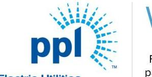
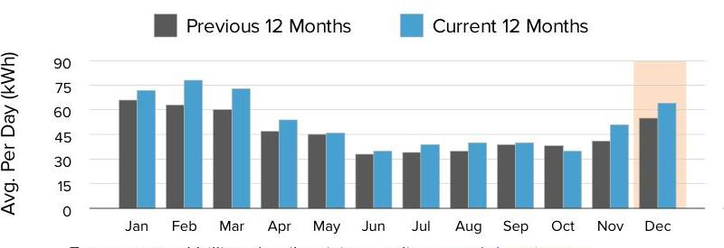
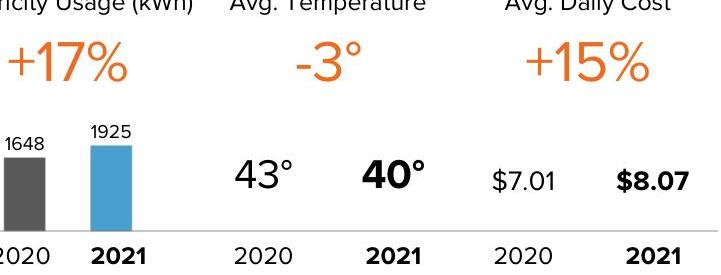
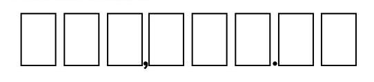
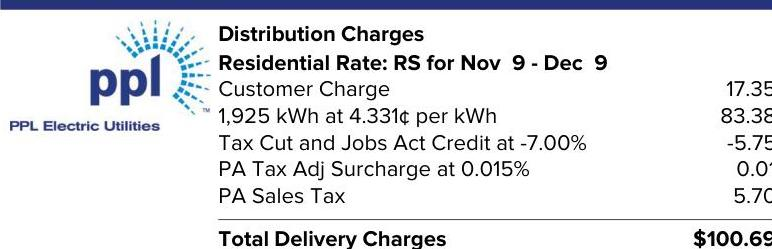

The image is a logo for "ppl" with a stylized design resembling rays or a burst emanating from the letter "p". The text "ppl" is in lowercase blue letters, and there is a trademark symbol (™) next to it.

PPL Electric Utilities

## Service to:

HENRYVILLE INN
HENRYVILLE, PA 18332

## We deliver.

1-800-342-5775
For hours of operation and to pay/manage your account, visit pplelectric.com.

## $100.69 \quad$ Delivery

PPL Electric Utilities
Consider making a monthly pledge to Operation HELP to assist those in need to heat their homes.

WANT TO SAVE?
Look for energy-efficient LED light strings when decorating for the holidays.

# Supply 

## 141.28

## Constellation NewEnergy (7)

1-844-636-3749

## 1925 kWh @ \$.0649299

## PPL Electric Utilities Price to Compare

\$0.09502 Use this price when comparing supplier offers.

## SHOP FOR ELECTRICITY

Visit PAPowerSwitch.com or www.oca.state.pa.us If you're shopping, know your contract expiration date. Account Number: 46471-31024
The price to compare is updated June $1^{\text {st }}$ and December $1^{\text {st }}$. Rate: RS. View schedule at pplelectric.com/rates

## $\$ 100.69$ Delivery

## PPL Electric Utilities

Consider making a monthly pledge to Operation HELP to assist those in need to heat their homes.

WANT TO SAVE?
Look for energy-efficient LED light strings when decorating for the holidays.

## Usage Summary

The image is a bar chart.

- **Chart Type**: Bar chart
- **X-Axis**: Months (Jan, Feb, Mar, Apr, May, Jun, Jul, Aug, Sep, Oct, Nov, Dec)
- **Y-Axis**: Avg. Per Day (kWh)
- **Legend**: 
  - Previous 12 Months (gray)
  - Current 12 Months (blue)
- **Data Points**:
  - January: Previous ~70 kWh, Current ~80 kWh
  - February: Previous ~65 kWh, Current ~85 kWh
  - March: Previous ~70 kWh, Current ~80 kWh
  - April: Previous ~55 kWh, Current ~60 kWh
  - May: Previous ~45 kWh, Current ~50 kWh
  - June: Previous ~40 kWh, Current ~45 kWh
  - July: Previous ~35 kWh, Current ~40 kWh
  - August: Previous ~40 kWh, Current ~45 kWh
  - September: Previous ~45 kWh, Current ~50 kWh
  - October: Previous ~50 kWh, Current ~55 kWh
  - November: Previous ~60 kWh, Current ~65 kWh
  - December: Previous ~75 kWh, Current ~80 kWh
- **Notable Styling**: The December bar for the current year is highlighted with a light orange background.

This represents a **yearly usage breakdown (monthly-based)**.

For usage and billing details, visit us online at pplelectric.com
Questions/concerns? Contact us by 1/3/22
1-800-342-5775
Visit pplelectric.com for hours of operation.
Correspondence to:
PPL Customer Service
827 Hausman Road
Allentown, PA 18104-9392

## December

The image is a graph/chart.

- **Chart Type**: Bar chart with additional data points.
- **Data Points**:
  - **Electricity Usage (kWh)**:
    - 2020: 1648
    - 2021: 1925
    - Percentage change: +17%
  - **Avg. Temperature**:
    - 2020: 43°
    - 2021: 40°
    - Temperature change: -3°
  - **Avg. Daily Cost**:
    - 2020: $7.01
    - 2021: $8.07
    - Percentage change: +15%
- **Notable Styling**: 
  - The percentage changes and 2021 values are highlighted in orange.
  - The 2021 values are bolded.

| 2020 | 2021 | 2020 | 2021 | 2020 | 2021 |
| :--: | :--: | :--: | :--: | :--: | :--: |

Sign back of bill stub to enroll in auto bill pay.

| Account Number | Due Date | Amount Due |
| :--: | :--: | :--: |
| 46471-31024 | $1 / 3 / 22$ | \$241.97 |

Amount Enclosed:

The image is a photo/illustration of a series of nine rectangular boxes arranged in a horizontal line. The boxes are empty except for the fourth box, which contains a comma, and the seventh box, which contains a period.

Please make check payable to: PPL ELECTRIC UTILITIES
2 NORTH 9TH STREET CPC-GENN1
ALLENTOWN, PA 18101-1175

| kWh Delivered (to Customer) |  |  |  |
| :--: | :--: | :--: | :--: |
| Meter   Number | Reading   Dates | Meter   Reading | Kilowatt-   Hours |
| 300983857 | Dec 9 | 62661 | 1925 |
|  | Nov 9 | 60736 |  |
| Days Billed: 30 | Avg. kWh/Day: 64 |  | Total Delivered: 1925 |
| Date Range | Annual Total Usage |  | Avg Monthly |
| Jan 2021 - Dec 2021 | 19101 kWh |  | 1592 kWh |

Next meter reading on or about: Jan 11, 2022.
State taxes this bill: About \$0.92. PA Gross Receipts Tax: About \$5.60.

## Supply Details

|  | Generation \& Transmission Charges for Nov 9-Dec 9 |  |
| :--: | :--: | :--: |
|  | 1925 kWh @ \$.0649299 | 124.99 |
| Constellation | Gross Receipts Tax | 8.34 |
| NewEnergy (?) | Market Charges | 7.95 |
|  | Total Constellation NewEnergy (?) Charges | \$141.28 |

For questions on these charges, please contact this supplier at:
1-844-636-3749
Constellation NewEnergy (?) Customer Services 1310 Point Street Baltimore, MD 21231

General information: Generation prices and charges are set by the electric generation supplier you have chosen. The Public Utility Commission regulates distribution rates and services. The Federal Energy Regulatory Commission regulates transmission prices and services.

## Understanding Your Bill

Act 129 Compliance Rider - Monthly charge to recover costs for energy efficiency and conservation programs approved by the PUC.
Customer Charge - The basic service charge to partially cover costs for billing, meter reading, equipment and service line maintenance. If you select a new supplier, the name, address and telephone number for both your distribution and supplier company will appear on your bill.
Distribution Charge (Delivery) - Part of the basic service charges on every customer's bill for delivering electricity from the electric distribution company to your home or business. The distribution charge is regulated by the Public Utility Commission. This charge will vary according to how much electricity you use.
Kilowatt-hour (kWh) - The basic unit of electric energy for which most customers are charged in cents per kilowatt-hour. A kilowatt-hour is the equivalent of using ten 100-watt light bulbs for one hour.

## Billing Summary

Previous Balance
Payment Received Dec 3, 2021 - Thank You!
Balance as of Dec 13, 2021
Total Supply Charges
Total Delivery Charges
$\$ 141.28$
$\$ 100.69$
Amount Due By 1/3/22
Account Balance
$\$ 241.97$

## Delivery Details

The image is a section of a utility bill detailing distribution charges. 

- **Title**: Distribution Charges
- **Subtitle**: Residential Rate: RS for Nov 9 - Dec 9
- **Items and Charges**:
  - Customer Charge: 17.35
  - 1,925 kWh at 4.331¢ per kWh: 83.38
  - Tax Cut and Jobs Act Credit at -7.00%: -5.75
  - PA Tax Adj Surcharge at 0.015%: 0.00
  - PA Sales Tax: 5.70
- **Total Delivery Charges**: $100.69

The logo of "PPL Electric Utilities" is present on the left side.

## Understanding Your Bill

kWh Delivered - The amount of electricity we delivered to you for your use. Storm Damage Expense Rider - Monthly charge to recover certain costs to make repairs after major storms.
Smart Meter Rider - Monthly charge to recover costs associated with the smart meter programs approved by the PUC.
State Tax Adjustment Surcharge - Monthly charge or credit to reflect changes in various state taxes. The surcharge may vary by bill component.
Tax Cut and Jobs Act Credit - Monthly adjustment for federal tax changes.
Type(s) of Meter Readings:
Actual - Measures your monthly electricity use based on an actual reading.

# Enroll in Automatic Bill Pay 

Enroll in Automatic Bill Pay (ABP) and your monthly electric payment will be automatically deducted from your bank checking account. To enroll, sign and date this form and return your check payment (voided check not required). Money orders, cashier and foreign checks do not qualify for enrollment.

I authorize PPL Electric Utilities to automatically deduct from the checking account as shown on my enclosed check, all future payments for the PPL Electric Utility bill account number listed on this payment stub. I will notify PPL Electric Utilities if I decide to cancel this authorization.

## To enroll in automatic bill payment,

Date $\qquad$
Checking Account holder sign here
Note: To enroll a savings account in automatic bill pay visit pplelectric.com/autopay.

