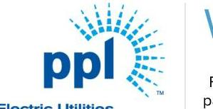
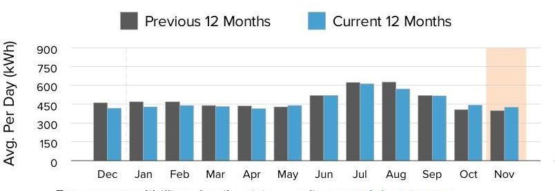
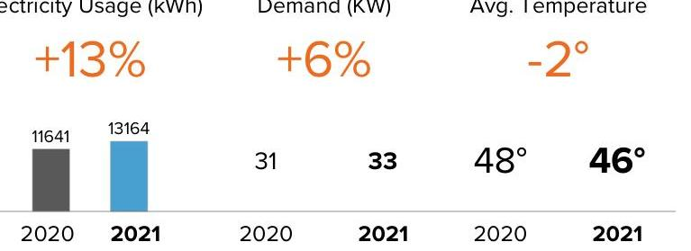
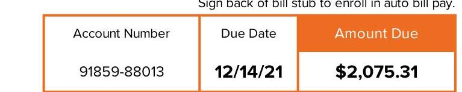
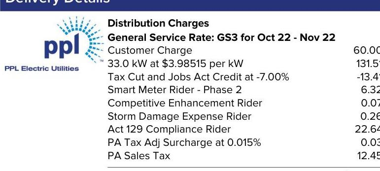

The image is a logo for "ppl Electric Utilities." It features the text "ppl" in lowercase blue letters, with a stylized sunburst design emanating from the letter "p" on the right side. The words "Electric Utilities" are written below the "ppl" text in smaller blue letters.

PPL Electric Utilities

## Service to:

WHITE DEER RUN INC 1620 RVERSIDE DR BETHLEHEM, PA 18015

## We deliver.

1-888-220-9991
For hours of operation and to pay/manage your account, visit pplelectric.com. businessaccounts@pplweb.com

## $1888-220-9991$

For hours of operation and to pay/manage your account, visit pplelectric.com. businessaccounts@pplweb.com

## $2,075.31$

Billing Details on Back

## Supply

## $1,855.44

## Freepoint Energy Solutions LLC

Rate Effective
$1-800-982-1670$
$8 / 21 / 20$

## ENERGY CHARGE: 13164@.0088 PER KWH

## PPL Electric Utilities Price to Compare

$\$ 0.07541$ Use this price when comparing supplier offers.

## SHOP FOR ELECTRICITY

Visit PAPowerSwitch.com or www.oca.state.pa.us If you're shopping, know your contract expiration date. Account Number: 91859-88013
The price to compare is updated June $1^{\text {st }}$ and December $1^{\text {st }}$. Rate: GS3. View schedule at pplelectric.com/rates

## Usage Summary

The image is a bar chart.

- **Chart Type**: Bar chart
- **X-Axis**: Months (Dec, Jan, Feb, Mar, Apr, May, Jun, Jul, Aug, Sep, Oct, Nov)
- **Y-Axis**: Avg. Per Day (kWh), ranging from 0 to 900
- **Legend Entries**: 
  - Previous 12 Months (gray bars)
  - Current 12 Months (blue bars)
- **Data Points**:
  - December: Previous ~450, Current ~450
  - January: Previous ~450, Current ~450
  - February: Previous ~450, Current ~450
  - March: Previous ~450, Current ~450
  - April: Previous ~450, Current ~450
  - May: Previous ~450, Current ~450
  - June: Previous ~600, Current ~600
  - July: Previous ~750, Current ~750
  - August: Previous ~750, Current ~750
  - September: Previous ~600, Current ~600
  - October: Previous ~450, Current ~450
  - November: Previous ~450, Current ~450 (highlighted in orange)
- **Notable Styling**: The November bar for the current year is highlighted in orange.

**Yearly usage breakdown (monthly-based)** is evident from the data representation.

For usage and billing details, visit us online at pplelectric.com
Questions/concerns? Contact us by 12/14/21
1-888-220-9991
Visit pplelectric.com for hours of operation.
Correspondence to:
PPL Customer Service
827 Hausman Road
Allentown, PA 18104-9392

## November

The image is a graph/chart.

- **Chart Type**: Bar chart with additional data points
- **Data Points**:
  - **Electricity Usage (kWh)**:
    - 2020: 11641
    - 2021: 13164
    - Change: +13%
  - **Demand (KW)**:
    - 2020: 31
    - 2021: 33
    - Change: +6%
  - **Avg. Temperature**:
    - 2020: 48°
    - 2021: 46°
    - Change: -2°
- **Notable Styling**: 
  - The percentage changes are highlighted in orange.
  - The 2021 data is bolded.

Sign back of bill stub to enroll in auto bill pay.

| Account Number | Due Date | Amount Due |
| :--: | :--: | :--: |
| 91859-88013 | $12 / 14 / 21$ | $\$ 2,075.31$ |

The image is a section of a billing statement.

- **Embedded Text**:
  - "Account Number"
  - "Due Date"
  - "Amount Due"
  - "91859-88013"
  - "12/14/21"
  - "$2,075.31"
- **Styling**:
  - The "Due Date" and "Amount Due" are bolded and highlighted in orange.
- **Layout**:
  - The account number, due date, and amount due are organized in a table format with three columns.

Amount Enclosed:

The image is a photo/illustration featuring three empty rectangular boxes aligned horizontally.

Please make check payable to: PPL ELECTRIC UTILITIES
2 NORTH 9TH STREET CPC-GENN1
ALLENTOWN, PA 18101-1175

| kWh Delivered (to Customer) |  |  |  |
| :--: | :--: | :--: | :--: |
| Meter   Number | Reading   Dates | Meter   Reading | Kilowatt-   Hours |
| 301318686 | Nov 22 | 29206 | 13164 |
|  | Oct 22 | 16042 |  |
| Days Billed: 31 | Avg. kWh/Day: 425 |  | Total Delivered: 13164 |

Next meter reading on or about: Dec 22, 2021.
State taxes this bill: About \$2.01. PA Gross Receipts Tax: About \$12.23.

## Supply Details

| Generation \& Transmission Charges for Oct 22-Nov 22 |  |
| :--: | :--: |
| State Sales Tax | 105.01 |
| Gross Receipts Tax | 103.26 |
| ENERGY CHARGE: 13164@.0088 PER KWH | 115.97 |
| ENERGY CHARGE: 13164@-.0105 PER KWH | $-138.25$ |
| ENERGY CHARGE: 13164@.0007 PER KWH | 8.84 |
| ENERGY CHARGE: 1422@.0168 PER KWH | 23.83 |
| ENERGY CHARGE: 746@.0608 PER KWH | 45.33 |
| ENERGY CHARGE: 13164@.0703 PER KWH | 925.78 |
| ENERGY CHARGE: 13910@.0001 PER KWH | 1.63 |
| ENERGY CHARGE: 13164@.0031 PER KWH | 41.37 |
| ENERGY CHARGE: 13910@.0006 PER KWH | 8.07 |
| CAPACITY CHARGE | 231.63 |
| TRANSMISSION CHARGE | 382.97 |
| Total Freepoint Energy Solutions LLC Charges | \$1,855.44 |

Continued on next page

## Billing Summary

Previous Balance \$1,852.40
Payment Received Nov 18, 2021 - Thank You! - $\$ 1,852.40$
Balance as of Nov 24, 2021 \$0.00
Total Supply Charges \$1,855.44
Total Delivery Charges \$219.87

| Amount Due By 12/14/21 | \$2,075.31 |
| :-- | --: |

Account Balance $\quad \$ 2,075.31$

## Delivery Details

The image is a photo of a section of a utility bill detailing distribution charges. 

Embedded text includes:

- "Delivery Details"
- "Distribution Charges"
- "General Service Rate: GS3 for Oct 22 - Nov 22"
- "Customer Charge 60.00"
- "33.0 kW at $3.98515 per kW 131.51"
- "Tax Cut and Jobs Act Credit at -7.00% -13.44"
- "Smart Meter Rider - Phase 2 6.32"
- "Competitive Enhancement Rider 0.07"
- "Storm Damage Expense Rider 0.26"
- "Act 129 Compliance Rider 22.64"
- "PA Tax Adj Surcharge at 0.015% 0.03"
- "PA Sales Tax 12.45"

The logo and name "PPL Electric Utilities" are present at the top left. The charges are listed in a column format with descriptions on the left and corresponding amounts on the right.

Act 129 Compliance Rider - Monthly charge to recover costs for energy efficiency and conservation programs approved by the PUC.
Competitive Enhancement Rider - Monthly charge to recover costs to support shopping for retail electricity supply.
Customer Charge - The basic service charge to partially cover costs for billing, meter reading, equipment and service line maintenance. If you select a new supplier, the name, address and telephone number for both your distribution and supplier company will appear on your bill.
Distribution Charge (Delivery) - Part of the basic service charges on every customer's bill for delivering electricity from the electric distribution company to your home or business. The distribution charge is regulated by the Public Utility Commission. This charge will vary according to how much electricity you use.
Kilowatt-hour (kWh) - The basic unit of electric energy for which most customers are charged in cents per kilowatt-hour. A kilowatt-hour is the equivalent of using ten 100-watt light bulbs for one hour.
kWh Delivered - The amount of electricity we delivered to you for your use.
Storm Damage Expense Rider - Monthly charge to recover certain costs to make repairs after major storms.
Smart Meter Rider - Monthly charge to recover costs associated with the smart meter programs approved by the PUC.
State Tax Adjustment Surcharge - Monthly charge or credit to reflect changes in various state taxes. The surcharge may vary by bill component.

# Enroll in Automatic Bill Pay 

Enroll in Automatic Bill Pay (ABP) and your monthly electric payment will be automatically deducted from your bank checking account. To enroll, sign and date this form and return your check payment (voided check not required). Money orders, cashier and foreign checks do not qualify for enrollment.

I authorize PPL Electric Utilities to automatically deduct from the checking account as shown on my enclosed check, all future payments for the PPL Electric Utility bill account number listed on this payment stub. I will notify PPL Electric Utilities if I decide to cancel this authorization.

## To enroll in automatic bill payment,

Date $\qquad$
Checking Account holder sign here
Note: To enroll a savings account in automatic bill pay visit pplelectric.com/autopay.

The image is a logo with the text "ppl" and a design resembling rays or a burst emanating from the letter "p".

PPI

# Supply Details - Continued 

For questions on these charges, please contact this supplier at:
1-800-982-1670

## Freepoint Energy Solutions LLC Customer Services 3050 Post Oak Blvd. Suite 1330 Houston, TX 77056

General information: Generation prices and charges are set by the electric generation supplier you have chosen. The Public Utility Commission regulates distribution rates and services. The Federal Energy Regulatory Commission regulates transmission prices and services.

| Account Number | Due Date | Amount Due |
| :-- | :-- | :-- |
| 91859-88013 | $12 / 14 / 21$ | $\mathbf{\$ 2 , 0 7 5 . 3 1}$ |

## Understanding Your Bill - Continued

Tax Cut and Jobs Act Credit - Monthly adjustment for federal tax changes. Type(s) of Meter Readings:
Actual - Measures your monthly electricity use based on an actual reading. *Federal I.D. 23-0959590

