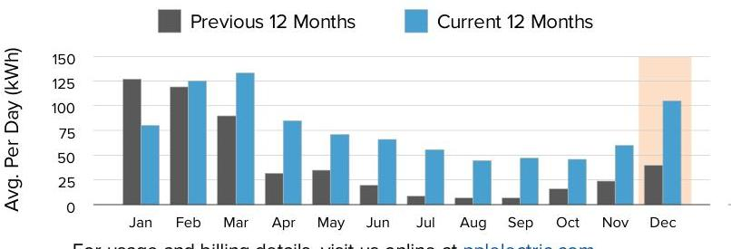
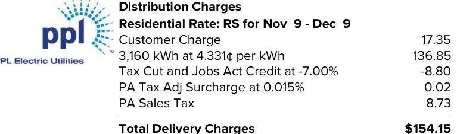

## We deliver.

1-800-342-5775
For hours of operation and to pay/manage your account, visit pplelectric.com.

## Service to:

POCONO MOUNTAIN RECOVERY CTR 234 ROCKCREST DR HENRYVILLE, PA 18332

## $1-800-342-5775$

For hours of operation and to pay/manage your account, visit pplelectric.com.

## $1 / 3 / 22$

## $630.41$

Billing Details on Back
Because of Other Charges, your amount due does not equal your Usage Charges.

## Supply

## $228.15

## Freepoint Energy Solutions LLC

Rate Effective
$1-800-982-1670$
$8 / 10 / 20$

## ENERGY CHARGE: 3160@.0088 PER KWH

## PPL Electric Utilities Price to Compare

$\$ 0.09502$ Use this price when comparing supplier offers.

## SHOP FOR ELECTRICITY

Visit PAPowerSwitch.com or www.oca.state.pa.us If you're shopping, know your contract expiration date. Account Number: 18071-32020
The price to compare is updated June $1^{\text {st }}$ and December $1^{\text {st }}$. Rate: RS. View schedule at pplelectric.com/rates

## $1-800-342-5775$

Visit pplelectric.com for hours of operation.
Correspondence to:
PPL Customer Service
827 Hausman Road
Allentown, PA 18104-9392

## December

The image is a bar chart.

- **Chart Type**: Bar chart
- **X-Axis**: Months (Jan, Feb, Mar, Apr, May, Jun, Jul, Aug, Sep, Oct, Nov, Dec)
- **Y-Axis**: Avg. Per Day (kWh)
- **Legend Entries**: 
  - Previous 12 Months (Gray)
  - Current 12 Months (Blue)
- **Data Points**:
  - January: Previous ~100 kWh, Current ~75 kWh
  - February: Previous ~125 kWh, Current ~125 kWh
  - March: Previous ~100 kWh, Current ~150 kWh
  - April: Previous ~75 kWh, Current ~125 kWh
  - May: Previous ~50 kWh, Current ~75 kWh
  - June: Previous ~25 kWh, Current ~50 kWh
  - July: Previous ~25 kWh, Current ~50 kWh
  - August: Previous ~50 kWh, Current ~75 kWh
  - September: Previous ~50 kWh, Current ~75 kWh
  - October: Previous ~50 kWh, Current ~75 kWh
  - November: Previous ~25 kWh, Current ~75 kWh
  - December: Previous ~75 kWh, Current ~125 kWh
- **Notable Styling**: The December bar for the current 12 months is highlighted with a light orange background.
- **Yearly Usage Breakdown (Monthly-Based)**: The chart provides a comparison of average daily kWh usage for each month between the previous and current 12-month periods.

For usage and billing details, visit us online at pplelectric.com
Questions/concerns? Contact us by 1/3/22
$1-800-342-5775$
Visit pplelectric.com for hours of operation.
Correspondence to:
PPL Customer Service
827 Hausman Road Allentown, PA 18104-9392

## $1-800-342-5775$

Please make check payable to: PPL ELECTRIC UTILITIES
2 NORTH 9TH STREET CPC-GENN1
ALLENTOWN, PA 18101-1175

## $1-800-342-5775$

## $1-800-342-5775$

## $1-800-342-5775$

## $1-800-342-5775$

For hours of operation and to pay/manage your account, visit pplelectric.com.

| kWh Delivered (to Customer) |  |  |  |
| :--: | :--: | :--: | :--: |
| Meter   Number | Reading   Dates | Meter   Reading | Kilowatt-   Hours |
| 300850089 | Dec 9 | 57762 | 3160 |
|  | Nov 9 | 54602 |  |
| Days Billed: 30 | Avg. kWh/Day: 105 |  | Total Delivered: 3160 |
| Date Range | Annual Total Usage |  | Avg Monthly |
| Jan 2021 - Dec 2021 | 27938 kWh |  | 2328 kWh |

Next meter reading on or about: Jan 11, 2022.
State taxes this bill: About \$3.81. PA Gross Receipts Tax: About \$23.21.

## Supply Details

|  | Generation \& Transmission Charges for Nov 9-Dec 9   State Sales Tax   12.91   Gross Receipts Tax   27.84   ENERGY CHARGE: 3160@.0088 PER KWH   ENERGY CHARGE: 3160@.0118 PER KWH   ENERGY CHARGE: 3160@.0004 PER KWH   ENERGY CHARGE: 6@.0168 PER KWH   ENERGY CHARGE: 170@.0482 PER KWH   ENERGY CHARGE: 3160@.0593 PER KWH   ENERGY CHARGE: 3330@.0001 PER KWH   ENERGY CHARGE: 3160@.0031 PER KWH   ENERGY CHARGE: 3330@.0006 PER KWH   CAPACITY CHARGE   1.26   TRANSMISSION CHARGE   Total Freepoint Energy Solutions LLC Charges | 12.91   27.84   37.26   1.13   0.10   8.20   187.52   0.35   9.89   1.93   1.26   1.58   $\$ 228.15$ |
| :--: | :--: | :--: |

Continued on next page

## Billing Summary

Previous Balance
Payment Received Dec 3, 2021 - Thank You!

Balance as of Dec 13, 2021
Total Supply Charges
Total Delivery Charges
Other Charges
Late Payment Charge
Total Other Charges
Amount Due By 1/3/22
Account Balance
$\$ 630.41$

## Delivery Details

The image is a section of a utility bill detailing distribution charges. It includes the following information:

- **Logo**: "ppl" with "PPL Electric Utilities" below it.
- **Title**: "Distribution Charges"
- **Subtitle**: "Residential Rate: RS for Nov 9 - Dec 9"
- **Charges**:
  - "Customer Charge": $17.35
  - "3,160 kWh at 4.331¢ per kWh": $136.85
  - "Tax Cut and Jobs Act Credit at -7.00%": -$8.80
  - "PA Tax Adj Surcharge at 0.015%": $0.02
  - "PA Sales Tax": $8.73
- **Total Delivery Charges**: "$154.15"

## Understanding Your Bill

Act 129 Compliance Rider - Monthly charge to recover costs for energy efficiency and conservation programs approved by the PUC.
Customer Charge - The basic service charge to partially cover costs for billing, meter reading, equipment and service line maintenance. If you select a new supplier, the name, address and telephone number for both your distribution and supplier company will appear on your bill.
Distribution Charge (Delivery) - Part of the basic service charges on every customer's bill for delivering electricity from the electric distribution company to your home or business. The distribution charge is regulated by the Public Utility Commission. This charge will vary according to how much electricity you use.
Kilowatt-hour (kWh) - The basic unit of electric energy for which most customers are charged in cents per kilowatt-hour. A kilowatt-hour is the equivalent of using ten 100-watt light bulbs for one hour.
Late Payment Charge - Charge added if you do not pay your bill by the due date.
kWh Delivered - The amount of electricity we delivered to you for your use.
Storm Damage Expense Rider - Monthly charge to recover certain costs to make repairs after major storms.
Smart Meter Rider - Monthly charge to recover costs associated with the smart meter programs approved by the PUC.

The image is a logo with the text "ppl" accompanied by a stylized design resembling rays or a burst pattern emanating from the letter "p".

PPI

# Supply Details - Continued 

For questions on these charges, please contact this supplier at:
1-800-982-1670

## Freepoint Energy Solutions LLC Customer Services 3050 Post Oak Blvd. Suite 1330 Houston, TX 77056

General information: Generation prices and charges are set by the electric generation supplier you have chosen. The Public Utility Commission regulates distribution rates and services. The Federal Energy Regulatory Commission regulates transmission prices and services.

| Account Number | Due Date | Amount Due |
| :-- | :-- | :-- |
| 18071-32020 | $1 / 3 / 22$ | $\mathbf{\$ 6 3 0 . 4 1}$ |

## Understanding Your Bill - Continued

State Tax Adjustment Surcharge - Monthly charge or credit to reflect changes in various state taxes. The surcharge may vary by bill component.
Tax Cut and Jobs Act Credit - Monthly adjustment for federal tax changes.
Type(s) of Meter Readings:
Actual - Measures your monthly electricity use based on an actual reading.

