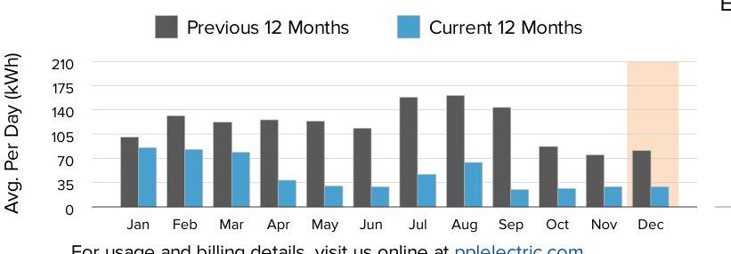
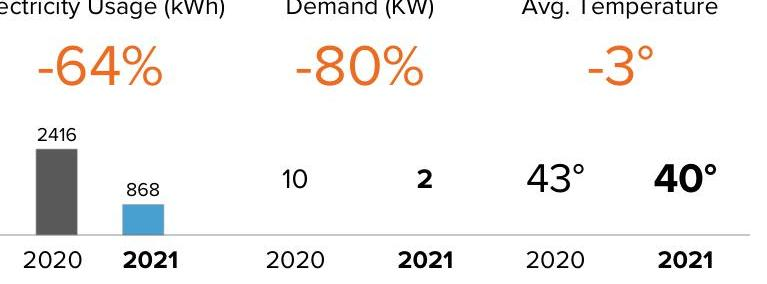
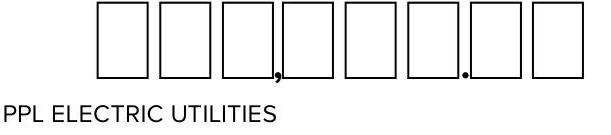
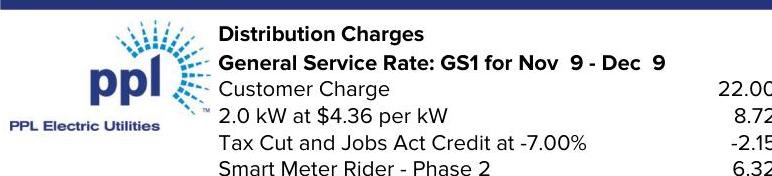

The image is a photo or illustration featuring the logo of PPL Electric Utilities. The logo consists of the letters "ppl" in lowercase blue font, with a stylized design resembling rays or beams emanating from the top right of the letter "l". There is no additional text or elements visible in the image.

PPL Electric Utilities

## Service to:

HENRYVILLE INN
314 CHERRY LANE RD, KITCHEN
EAST STROUDSBURG, PA 18301

## Supply

## Constellation NewEnergy (7)

1-844-636-3749

## 868 kWh @ $.0649309$

## PPL Electric Utilities Price to Compare

\$0.10285 Use this price when comparing supplier offers.

## SHOP FOR ELECTRICITY

Visit PAPowerSwitch.com or www.oca.state.pa.us If you're shopping, know your contract expiration date. Account Number: 27133-77034
The price to compare is updated June $1^{\text {st }}$ and December $1^{\text {st }}$. Rate: GS1. View schedule at pplelectric.com/rates

## Usage Summary

The image is a bar chart.

- **Chart Type**: Bar chart
- **X-Axis**: Months (Jan, Feb, Mar, Apr, May, Jun, Jul, Aug, Sep, Oct, Nov, Dec)
- **Y-Axis**: Avg. Per Day (kWh)
- **Legend Entries**: 
  - Previous 12 Months (gray bars)
  - Current 12 Months (blue bars)
- **Data Points**:
  - January: Previous ~90 kWh, Current ~70 kWh
  - February: Previous ~105 kWh, Current ~70 kWh
  - March: Previous ~140 kWh, Current ~105 kWh
  - April: Previous ~140 kWh, Current ~105 kWh
  - May: Previous ~70 kWh, Current ~35 kWh
  - June: Previous ~175 kWh, Current ~105 kWh
  - July: Previous ~210 kWh, Current ~140 kWh
  - August: Previous ~175 kWh, Current ~140 kWh
  - September: Previous ~105 kWh, Current ~70 kWh
  - October: Previous ~70 kWh, Current ~35 kWh
  - November: Previous ~35 kWh, Current ~35 kWh
  - December: Current data not fully visible
- **Styling**: The bars for December are partially highlighted with a light orange background, indicating incomplete data or projection.

This represents a **yearly usage breakdown (monthly-based)**.

For usage and billing details, visit us online at pplelectric.com
Questions/concerns? Contact us by 12/29/21
1-800-342-5775
Visit pplelectric.com for hours of operation.
Correspondence to:
PPL Customer Service
827 Hausman Road
Allentown, PA 18104-9392

## December

The image is a graph/chart.

- **Chart Type**: Comparison chart
- **Sections**:
  - **Electricity Usage (kWh)**:
    - 2020: 2416
    - 2021: 868
    - Change: -64%
  - **Demand (kW)**:
    - 2020: 10
    - 2021: 2
    - Change: -80%
  - **Avg. Temperature**:
    - 2020: 43°
    - 2021: 40°
    - Change: -3°

The chart uses orange text to highlight percentage changes. The years 2020 and 2021 are labeled below each section.

| 2020 | 2021 | 2020 | 2021 | 2020 | 2021 |
| :--: | :--: | :--: | :--: | :--: | :--: |

Sign back of bill stub to enroll in auto bill pay.

| Account Number | Due Date | Amount Due |
| :--: | :--: | :--: |
| 27133-77034 | 12/29/21 | \$119.01 |

Amount Enclosed:

The image is a photo or illustration featuring a series of empty rectangular boxes arranged in a row, followed by a comma and a period. Below these boxes, the text "PPL ELECTRIC UTILITIES" is written. The boxes likely represent spaces for numerical or textual input, such as an amount or account number.

Please make check payable to: PPL ELECTRIC UTILITIES
2 NORTH 9TH STREET CPC-GENN1
ALLENTOWN, PA 18101-1175

| kWh Delivered (to Customer) |  |  |  |
| :--: | :--: | :--: | :--: |
| Meter   Number | Reading   Dates | Meter   Reading | Kilowatt-   Hours |
| 300957831 | Dec 9 | 37479 | 868 |
|  | Nov 9 | 36611 |  |
| Days Billed: 30 | Avg. kWh/Day: 29 |  | Total Delivered: 868 |
| Date Range | Annual Total Usage |  | Avg Monthly |
| Jan 2021 - Dec 2021 | 17308 kWh |  | 1442 kWh |

Next meter reading on or about: Jan 11, 2022.
State taxes this bill: About \$0.35. PA Gross Receipts Tax: About \$2.15.

## Supply Details

|  | Generation \& Transmission Charges for Nov 9-Dec 9 |  |
| :--: | :--: | :--: |
|  | 868 kWh $\phi \$ .0649309$ | 56.36 |
| Constellation | State Sales Tax | 4.55 |
| NewEnergy (?) | Market Charges | 14.96 |
|  | Gross Receipts Tax | 4.47 |
|  | Total Constellation NewEnergy (?) Charges | \$80.34 |

For questions on these charges, please contact this supplier at:
1-844-636-3749
Constellation NewEnergy (7)
Customer Services
1310 Point Street
Baltimore, MD 21231

General information: Generation prices and charges are set by the electric generation supplier you have chosen. The Public Utility Commission regulates distribution rates and services. The Federal Energy Regulatory Commission regulates transmission prices and services.

## Billing Summary

Previous Balance
Payment Received Dec 3, 2021 - Thank You!
Balance as of Dec 13, 2021
Total Supply Charges
Total Delivery Charges
Amount Due By 12/29/21
Account Balance

## Delivery Details

The image is a section of a utility bill detailing distribution charges. It includes the following text:

- "Distribution Charges"
- "General Service Rate: GS1 for Nov 9 - Dec 9"
- "Customer Charge" with an amount of "22.00"
- "2.0 kW at $4.36 per kW" with an amount of "8.72"
- "Tax Cut and Jobs Act Credit at -7.00%" with an amount of "-2.15"
- "Smart Meter Rider - Phase 2" with an amount of "6.32"

The logo of "PPL Electric Utilities" is present on the left side of the image.

## Understanding Your Bill

Act 129 Compliance Rider - Monthly charge to recover costs for energy efficiency and conservation programs approved by the PUC.
Competitive Enhancement Rider - Monthly charge to recover costs to support shopping for retail electricity supply.
Customer Charge - The basic service charge to partially cover costs for billing, meter reading, equipment and service line maintenance. If you select a new supplier, the name, address and telephone number for both your distribution and supplier company will appear on your bill.
Distribution Charge (Delivery) - Part of the basic service charges on every customer's bill for delivering electricity from the electric distribution company to your home or business. The distribution charge is regulated by the Public Utility Commission. This charge will vary according to how much electricity you use.
Kilowatt-hour (kWh) - The basic unit of electric energy for which most customers are charged in cents per kilowatt-hour. A kilowatt-hour is the equivalent of using ten 100-watt light bulbs for one hour.
kWh Delivered - The amount of electricity we delivered to you for your use.
Storm Damage Expense Rider - Monthly charge to recover certain costs to make repairs after major storms.
Smart Meter Rider - Monthly charge to recover costs associated with the smart meter programs approved by the PUC.
State Tax Adjustment Surcharge - Monthly charge or credit to reflect changes in various state taxes. The surcharge may vary by bill component.

# Enroll in Automatic Bill Pay 

Enroll in Automatic Bill Pay (ABP) and your monthly electric payment will be automatically deducted from your bank checking account. To enroll, sign and date this form and return your check payment (voided check not required). Money orders, cashier and foreign checks do not qualify for enrollment.

I authorize PPL Electric Utilities to automatically deduct from the checking account as shown on my enclosed check, all future payments for the PPL Electric Utility bill account number listed on this payment stub. I will notify PPL Electric Utilities if I decide to cancel this authorization.

## To enroll in automatic bill payment,

Date $\qquad$
Checking Account holder sign here
Note: To enroll a savings account in automatic bill pay visit pplelectric.com/autopay.

| Account Number | Due Date | Amount Due |
| :--: | :--: | :--: |
| 27133-77034 | 12/29/21 | \$119.01 |

# Understanding Your Bill - Continued 

Tax Cut and Jobs Act Credit - Monthly adjustment for federal tax changes. Type(s) of Meter Readings:
Actual - Measures your monthly electricity use based on an actual reading.
*Federal I.D. 23-0959590

