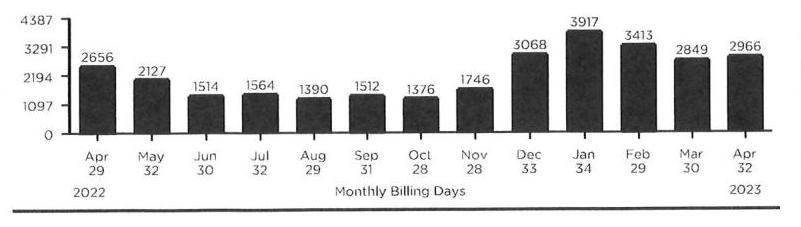

Contact Us
Phone
Customer Service
1-888-689-8665
7 A.M. - 4 P.M. CT Mon. - Fri.
Emergency Service 24/7
1-800-634-3524
For gas leaks or odor of gas
1-888-689-8665
Report electric lines down or power outage

Pay by credit/debit card Call 1-855-763-6277 (Payments convenience fee will apply)

For hearing-impaired TDD
1-800-635-0952

## Web

Make payments and access your account at NIPSCO.com

## Mail Payments

NIPSCO
P.O. BOX 13007

Merrillville, IN 46411-3007

## Authorized Payment Locations

Find locations online at NIPSCO.com

## Your Safety

## Gas Safety

In case of an emergency, such as odor of gas, carbon monoxide or fire:
1. Leave the building or area immediately.
2. Leave windows and doors in their positions and avoid doing anything that could cause a spark.
3. From a safe place, away from the building or area, call 911 and NIPSCO at 1-800-6343524.

Always Call 8-1-1 Before You Dig
If you're planning a home or landscaping project, call Indiana 811 at least two business days before digging. A representative will mark the approximate location of underground utility lines for free.

## MIIPACO

Employee Identification
All our employees and contractors carry photo identification. Ask to see it before allowing anyone who claims to be a utility representative into your home. Call the police if you see suspicious activity.

## Account Profile

Customer Name:
Hmr Acquisition Company Inc
IN: 1501 N Ironwood Dr South Bend IN 46635-1841 hmeton/chaclondafiesta.com

## $X_{2,366.75}$

- If paid after 05/01/2023, a late payment charge of $\$ 63.35$ will be applied and your new current amount due will be $\$ 2,160.96$.
- For more information regarding these charges, see the Detail Charges section. If you are struggling to pay your bill we can help. Flexible payment plans are available to customers experiencing a financial hardship. Any customer who is having trouble paying his/her bill should visit www.NIPSCO.com or call 800-464-7726 to learn about payment arrangements and/or financial assistance programs.

## Monthly Message Board

Detecting a Gas Leak
If you even THINK you smell gas inside your home or business, take action. STOP what you are doing. LEAVE the area immediately. CALL, 911 and NIPSCO at our emergency number 1-800-634-3524, 24 hours a day. NIPSCO will send someone to check the source of the odor FREE OF CHARGE, whether there is a leak or not. To learn more about leak detection and natural gas safety, visit NIPSCO.com/staysafe.

## Delivery \& Supply Summary

## NIPSCO

Beginning Balance
Current Delivery Charges
Payments Received
Ending Balance
Archer Energy
Beginning Balance
Current Supply Charges
Payments Received
Ending Balance

## $X 339.98$

\$607.98
\$1,826.77
+\$1,489.63
$-$ Please fold on the perforation below, detach and return with your payment.

The image is a photo/illustration of a payment stub or mailing label. It contains the following text:

"Make check payable to:
NIPSCO
P.O. BOX 13007
MERRILLVILLE, IN 46411-3007"

There is also a barcode and a QR code present on the right side of the text.

HMR ACQUISITION COMPANY INC
DBA HACIENDA MEXICAN RT INC ISID N IRONWOOD DR SOUTH BEND IN 46635-1841

## Make check payable to:

NIPSCO
P.O. BOX 13007

MORRILLVILLE, IN 46411-3007
$\mu / 111_{1} / 11_{1} / 11_{1} / 1_{1} / 1_{1} / 1_{1} / 1 / 1_{1} / 1_{1} / 1 / 1 / 1 / 1 / 1 / 1 / 1 / 1 / 1 / 1 / 1 / 1 / 1 / 1 / 1 / 1 / 1 / 1 / 1 / 1 / 1 / 1 / 1 / 1 / 1 / 1 / 1 / 1 / 1 / 1 / 1 / 1 / 1 / 1 / 1 / 1 / 1 / 1 / 1 / 1 / 1 / 1 / 1 / 1 / 1 / 1 / 1 / 1 / 1 / 1 / 1 / 1 / 1 / 1 / 1 / 1 / 1 / 1 / 1 / 1 / 1 / 1 / 1 / 1 / 1 / 1 / 1

## Helpful Definitions

## Gas Service Definitions

Gas Delivery Charges are the costs of delivering gas to retail customers. The charges for these services are regulated and these services must be purchased from the local distribution company.
Therm (thm) is equal to 100,000 Btus and is the basic billing unit for gas.

## Legal Notices

Rate Schedule information is available upon request and at NIPSCO.com.

## 13 Month Usage History

The image is a bar chart.

- **Chart Type**: Bar chart
- **X-Axis**: Monthly Billing Days
  - Labels: Apr 29, May 32, Jun 30, Jul 32, Aug 29, Sep 31, Oct 28, Nov 28, Dec 33, Jan 34, Feb 29, Mar 30, Apr 32
  - Yearly range: 2022 to 2023
- **Y-Axis**: No specific title, but numerical values are shown
  - Values: 0, 1097, 2194, 3291, 4387
- **Data Points**:
  - Apr 29, 2022: 2656
  - May 32, 2022: 2127
  - Jun 30, 2022: 1514
  - Jul 32, 2022: 1564
  - Aug 29, 2022: 1390
  - Sep 31, 2022: 1512
  - Oct 28, 2022: 1376
  - Nov 28, 2022: 1746
  - Dec 33, 2022: 3068
  - Jan 34, 2023: 3917
  - Feb 29, 2023: 3413
  - Mar 30, 2023: 2849
  - Apr 32, 2023: 2966
- **Notable Styling**: The bars are uniformly styled with no additional highlights or colors.

This chart provides a **yearly usage breakdown (monthly-based)** of gas consumption in therms over a 13-month period.

| Meter Number: |  | Usage Comparison - Therms |  |
| :--: | :--: | :--: | :--: |
| 7992076 |  | Month | Therms Avg Temp | Therms Per Day |
| Service Address: |  | Apr 22 | 2,656.3 | $41.4^{*}$ |
| 706 W Lincoln Way |  | Mar 23 | 2,849.5 | $37.4^{*}$ |
| Mohawaka IN 46544-1804 |  | Apr 23 | 2,966.6 | $38.5^{*}$ |
| Meter Readings - 32 Billing Days |  |  |  |  |
| Actual Reading on 04/11 |  | 44999 |  |  |
| Actual Reading on 03/10 |  | 42116 |  |  |
| Gas Used (CUT) |  | 2,883 |  |  |
| Conventions to Therms |  | 2,033 |  |  |
| Total Gas Used (Therms) |  | 2,966.6 |  |  |

## Detail Charges

Charges for Gen Serv Gas-Small Htg CHOICE - Rate 221
NIPSCO
Delivery Charges
Total Charges for Gas Service This Period
$+\$ 607.98$
Charges for Fixed Price Per Therm - Rate 34300
Archer Energy
Gas Supply
Interstate Transportation and Storage Charges
Total Charges for Service This Period
$+\$ 1,489.63$

- This meter is Indiana sales tax exempt
- Your gas supplier Archer Energy can be contacted at 1-844-795-7491.

## Change Contact Information

By providing NIPSCO a telephone number, it enables us to call you about your utility service, future service appointments and other important information pertaining to your account and you're agreeing to receive autodialed and prerecorded voice calls. Please notify us if you wish to opt out or if you no longer use this number. Thank you in advance.

## Message Board

- Take the seasonal highs and lows out by dividing your yearly energy use into 13 equal monthly payments - for budgeting that's a whole lot easier. Learn more at NIPSCO.com/BudgetPlan.
- Never worry about missing a payment or writing a check again by enrolling in Automatic Payment today at NIPSCO.com.

