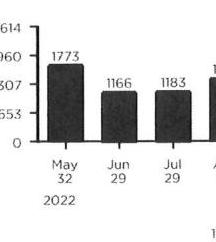
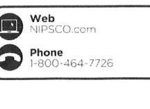

Contact Us
Phone
Customer Service
1-888-689-8665
7 A.M. - 4 P.M. CT Mon. - Fri.
Emergency Service 24/7
1-800-634-3524
For gas leaks or odor of gas
1-888-689-8665
Report electric lines down or power outage

Pay by credit/debit card Call 1-800-763-6277 (Payments
convenience fee will apply)
For hearing-impaired TDD
1-800-635-0952

## Web

Make payments and access your account at NIPSCO.com

## Mail Payments

NIPSCO
P.O. BOX 13007

Merrillville, IN 46411-3007
Authorized Payment Locations
Find locations online at NIPSCO.com

## Your Safety

## Gas Safety

In case of an emergency, such as odor of gas, carbon monoxide or fire:

1. Leave the building or area immediately.
2. Leave windows and doors in their positions and avoid doing anything that could cause a spark.
3. From a safe place, away from the building or area, call $\mathbf{9 1 1}$ and NIPSCO at 1-800-6343524.

Always Call 8-1-1 Before You Dig
If you're planning a home or landscaping project, call Indiana 811 at least two business days before digging. A representative will mark the approximate location of underground utility lines for free.

## HITTING

Employee Identification
All our employees and contractors carry photo identification. Ask to see it before allowing anyone who claims to be a utility representative into your home. Call the police if you see suspicious activity.

HMR ACQUISITION COMPANY INC
DBA HACIENDA MEXICAN RT INC
TED N MONWOOD OR
SOUTH BEND IN 46635-3641

P.O. BOX 13006
MORRICHILL, IN 46411-3006 NIPSCO

HMR ACQUISITION COMPANY INC DBA HACIENDA MEXICAN RT INC 1501 N IRONWOOD OR SOUTH BEND IN 46635-1841

## Account Profile

Customer Name:
Hmr Acquisition Company Inc
Inc
1501 N Ironwood Dr South Bend IN 46635-1841
hmetonshaciendafiseta.com

## $1,143.64$

$-\$ 1,143.64$
\$0.00
\$0.00
\$0.00
\$0.00
+\$399.65
+\$1,314.88

## $1,714.53$

- If paid after 05/19/2023, a late payment charge of $\$ 51.86$ will be applied and your new current amount due will be $\$ 1,766.39$
- For more information regarding these charges, see the Detail Charges section.

If you are struggling to pay your bill we can help. Flexible payment plans are available to customers experiencing a financial hardship. Any customer who is having trouble paying his/her bill should visit www.NIPSCO.com or call 800-464-7726 to learn about payment arrangements and/or financial assistance programs.

## Delivery \& Supply Summary

## NIPSCO

Beginning Balance
Current Delivery Charges
Payments Received
Ending Balance
Archer Energy
Beginning Balance
Current Supply Charges
Payments Received
Ending Balance

## 13 Month Usage History

The image is a bar chart.

- **Chart Type**: Bar chart
- **X-Axis**: Months (May, June, July)
- **Y-Axis**: Numerical values (ranging from 0 to 1614)
- **Data Points**:
  - May 32, 2022: 1773
  - June 29: 1166
  - July 29: 1183
- **Yearly usage breakdown (monthly-based)**: The chart shows monthly data for May, June, and July.
- **Styling**: The bars are solid and dark, with values labeled above each bar.

- Please fold on the perforation below, detach and return with your payment.

The image is a section of a document with contact information.

- **Type**: Photo / illustration
- **Content**:
  - **Web**: NIPSCO.com
  - **Phone**: 1-800-464-7726
- **Icons**: 
  - A computer icon next to the web address.
  - A phone icon next to the phone number.

HMR ACQUISITION COMPANY INC DBA HACIENDA MEXICAN RT INC 1501 N IRONWOOD OR SOUTH BEND IN 46635-1841

## Account Number: 023-130-009-9

Amount Due By 05/19/2023: $\$ 1,714.53$
Amount Enclosed: $\$$.
If paid after 05/19/2023, the amount due will be $\$ 1766.39$

HMR ACQUISITION COMPANY INC DBA HACIENDA MEXICAN RT INC 1501 N IRONWOOD OR SOUTH BEND IN 46635-1841

## $1,714.53$

## Helpful Definitions

## Gas Service Definitions

Gas Delivery Charges are the costs of delivering gas to retail customers. The charges for these services are regulated and these services must be purchased from the local distribution company.
Therm (thm) is equal to 100,000 Btus and is the basic billing unit for gas.

## Legal Notices

Rate Schedule information is available upon request and at NIPSCO.com.

## 13 Month Usage History continued

| Hater Number: 9579998 Service Address: 186 Easy Shopping PI   (Shhart IN 465/8-3535 |  | Usage Comparison - Therms |  |  |
| :--: | :--: | :--: | :--: | :--: |
|  |  | Month | Therms | Avg Temp | Therms Per Day |
|  |  | May 22 | $1,773.5$ | $47.4^{\circ}$ | $55.4$ |
|  |  | Apr 23 | $2,064.1$ | $56.8^{\circ}$ | $71.2$ |
|  |  | May 23 | $1,638.1$ | $51.0^{\circ}$ | $51.2$ |
| Meter Readings - 32 Billing Days |  |  |  |  |  |
| Actual Reading on OS/01 |  | 61684 |  |  |  |
| Actual Reading on OS/30 | - | 60292 |  |  |  |
| Gas Used (Cct) |  | 1,592 |  |  |  |
| Conversion to Therms |  | 1025 |  |  |  |
| Total Gas Used (Therms) |  | $1,638.1$ |  |  |  |

## Detail Charges

## Charges for Gen Serv Gas-Small Htg CHOICE - Rate 221

## NIPSCO

Delivery Charges
Total Charges for Gas Service This Period

## Charges for Fixed Price Per Therm - Rate 34300

## Archer Energy

Gas Supply
Interstate Transportation and Storage Charges
Total Charges for Service This Period

- This meter is Indiana sales tax exempt.
- Your gas supplier Archer Energy can be contacted at 1-844-795-7491.

## Change Contact Information

By providing NIPSCO a telephone number, it enables us to call you about your utility service, future service appointments and other important information pertaining to your account and you're agreeing to receive autodialed and prerecorded voice calls. Please notify us if you wish to opt out or if you no longer use this number. Thank you in advance.

## Message Board

- Take the seasonal highs and lows out by dividing your yearly energy use into 12 equal monthly payments - for budgeting that's a whole lot easier. Learn more at NIPSCO.com/BudgetPlan.
- Never worry about missing a payment or writing a check again by enrolling in Automatic Payment today at NIPSCO.com.

