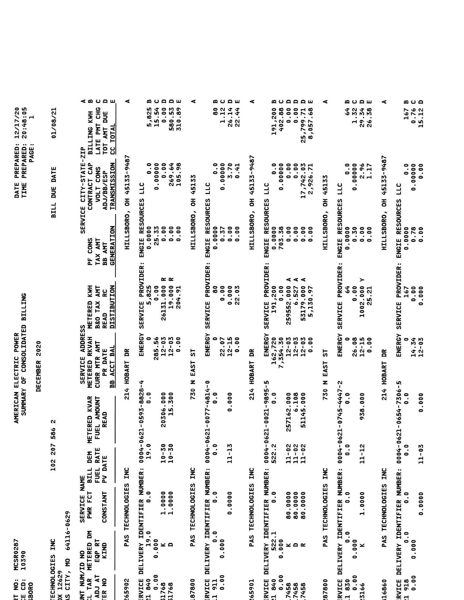
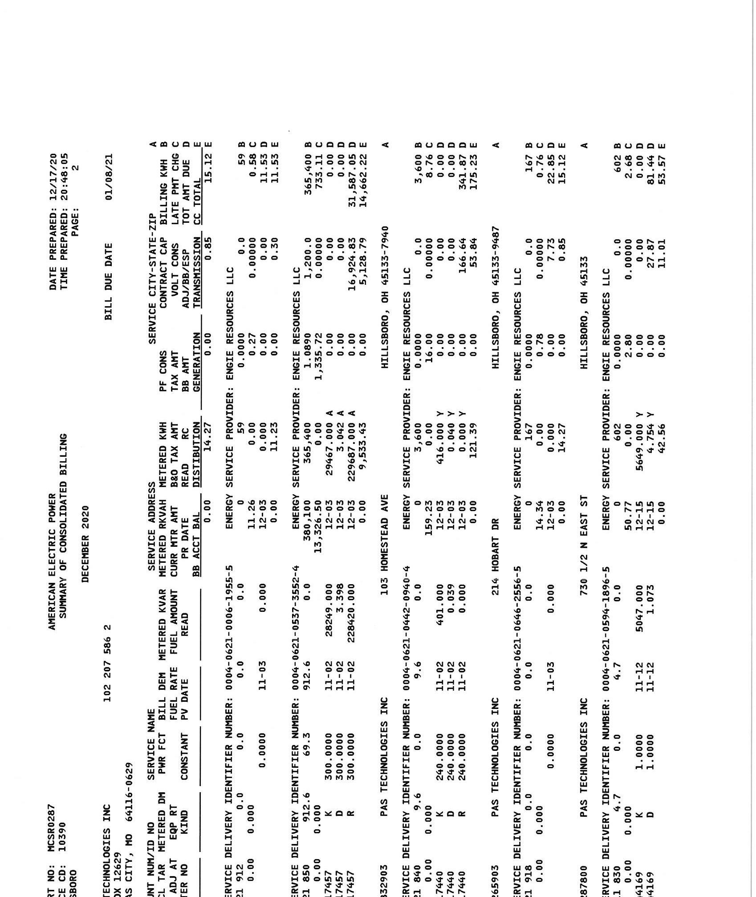

# CONSOLIDATED BILL 

SERVICE ADDRESS:
16769-1 25
$\left.\mathrm{H}\left[\mathrm{H}_{1}\right] \mathrm{H}_{1}\left[\mathrm{H}_{1}\right]\left[\mathrm{H}_{1}\right] \mathrm{H}_{1}\left[\mathrm{H}_{1}\right] \mathrm{H}_{1}\left[\mathrm{H}_{1}\right]\right] \mathrm{H}_{1}\left[\mathrm{H}_{1}\right] \mathrm{H}_{1}\left[\mathrm{H}_{1}\right] \mathrm{H}_{1}\right]$
PAS TECHNOLOGIES INC
PO BOX 12629
KANSAS CITY, MO 64116-0629

## Current Billing Summary:

## Previous charges:

Total Amount Due at Last Billing
Payments
$-$ \$61,984.51
$* 61,984.51$
\$0.00

## Current AEP Ohio Charges

Electric Billing Summary
TOTAL DUE
\$78,037.49

## Notes from AEP Ohio:

This bill is a consolidated bill, meaning several locations are being billed in one bill. Please see the following pages for more details.

Your total account balance is due on or before January 8, 2021

Mailing date is December 17, 2020

## Methods of Payment

aepohio.com
PO Box 371496
Pittsburgh, PA 15250-7496
1-800-611-0964 (fee may apply)

Need to get in touch?
Customer Operations Center: 1-888-237-5566
Outages: AEPOhio.com/outages or 1-800-672-2231

## AEP

## ON

Make check payable and send to: AMERICAN ELECTRIC POWER PO BOX 371496
PITTSBURGH, PA 15250-7496
$11111 m \mathrm{H}_{11} \mathrm{H}_{11} \mathrm{H}_{11} \mathrm{H}_{11} \mathrm{H}_{11} \mathrm{H}_{11} \mathrm{H}_{11} \mathrm{H}_{11} \mathrm{H}_{11} \mathrm{H}_{11} \mathrm{H}_{11} \mathrm{H}_{11} \mathrm{H}_{11} \mathrm{H}_{11} \mathrm{H}_{11} \mathrm{H}_{11} \mathrm{H}_{11} \mathrm{H}_{11} \mathrm{H}_{11}$

Amount $\# 102-207-586-2-6$
Amount due on or before $\$ 78,037.49$

Do Not Pay This Bill
Auto-withdrawal scheduled on 01/08/2021

The Neighbor to Neighbor program helps disdominated customers pay their electric bill. I used to help. My payment reflects my gift of

# PAS TECHNOLOGIES INC 

PO BOX 12629
KANSAS CITY, MO 64116-0629
Account \#102-207-586-2-6

## Line Item Charges:

| Previous Charges |  |
| :--: | :--: |
| Total Amount Due At Last Billing | \$ 61,984.51 |
| Payment 12/08/20 - Thank You | $-61,984.51$ |
| Previous Balance Due | \$ .00 |
| Current AEP Ohio Charges |  |
| Electric Billing Summary | \$ 78,037.49* |
| Total Balance Due   ${ }^{\text {Charges make up the "Total Balance Due" }}$   The Amount Will Be Deducted From Your Bank Account On January 8, 2021. |  |

## Notes from AEP Ohio:

In May 2018, our payment address changed! The new address is $\underline{\text { PQ }}$ Box 371496, Pittsburgh, PA 15250-7496. Please update your records and any bill-pay services to avoid fees or service interruptions. If you have updated your records no action is needed.
The Company will reinstate late payment fees effective with the due date of this bill. In order to avoid a late payment fee, the account will need to be current or a payment arrangement must be executed prior to the due date of this bill. In order to set up a payment arrangement please call 1-888-710-4237.
AEP now furnishes Commercial \& Industrial payment histories to credit reporting agencies.

The image is a photo of a document, specifically a billing statement. It contains the following text:

- DATE PREPARED: 12/17/20
- TIME PREPARED: 8:10:45
- BILL DUE DATE: 01/08/21
- PAGE: 1
- AMERICAN ELECTRIC POWER
- SUMMARY OF CONSOLIDATED BILLING
- DECEMBER 2020
- ACCOUNT NO: 102 297 586 2
- SERVICE ADDRESS: 214 HOBART DR
- SERVICE CITY-STATE-ZIP: HILLSBORO, OH 45133-9469
- ENERGY SERVICE PROVIDER: ENGIE RESOURCES LLC
- PF CONS: 0.00
- SERVICE: 0.00
- KWH: 0.00
- TAX AMT: 0.00
- CONTRACT: 0.00
- BILLING: 0.00
- TOTAL: 0.00
- Various rows and columns with numerical data and headings such as "A", "B", "C", "D", "E", "F", "G", "H", "I", "J", "K", "L", "M", "N", "O", "P", "Q", "R", "S", "T", "U", "V", "W", "X", "Y", "Z", "AA", "AB", "AC", "AD", "AE", "AF", "AG", "AH", "AI", "AJ", "AK", "AL", "AM", "AN", "AO", "AP", "AQ", "AR", "AS", "AT", "AU", "AV", "AW", "AX", "AY", "AZ", "BA", "BB", "BC", "BD", "BE", "BF", "BG", "BH", "BI", "BJ", "BK", "BL", "BM", "BN", "BO", "BP", "BQ", "BR", "BS", "BT", "BU", "BV", "BW", "BX", "BY", "BZ", "CA", "CB", "CC", "CD", "CE", "CF", "CG", "CH", "CI", "CJ", "CK", "CL", "CM", "CN", "CO", "CP", "CQ", "CR", "CS", "CT", "CU", "CV", "CW", "CX", "CY", "CZ", "DA", "DB", "DC", "DD", "DE", "DF", "DG", "DH", "DI", "DJ", "DK", "DL", "DM", "DN", "DO", "DP", "DQ", "DR", "DS", "DT", "DU", "DV", "DW", "DX", "DY", "DZ", "EA", "EB", "EC", "ED", "EE", "EF", "EG", "EH", "EI", "EJ", "EK", "EL", "EM", "EN", "EO", "EP", "EQ", "ER", "ES", "ET", "EU", "EV", "EW", "EX", "EY", "EZ", "FA", "FB", "FC", "FD", "FE", "FF", "FG", "FH", "FI", "FJ", "FK", "FL", "FM", "FN", "FO", "FP", "FQ", "FR", "FS", "FT", "FU", "FV", "FW", "FX", "FY", "FZ", "GA", "GB", "GC", "GD", "GE", "GF", "GG", "GH", "GI", "GJ", "GK", "GL", "GM", "GN", "GO", "GP", "GQ", "GR", "GS", "GT", "GU", "GV", "GW", "GX", "GY", "GZ", "HA", "HB", "HC", "HD", "HE", "HF", "HG", "HH", "HI", "HJ", "HK", "HL", "HM", "HN", "HO", "HP", "HQ", "HR", "HS", "HT", "HU", "HV", "HW", "HX", "HY", "HZ", "IA", "IB", "IC", "ID", "IE", "IF", "IG", "IH", "II", "IJ", "IK", "IL", "IM", "IN", "IO", "IP", "IQ", "IR", "IS", "IT", "IU", "IV", "IW", "IX", "IY", "IZ", "JA", "JB", "JC", "JD", "JE", "JF", "JG", "JH", "JI", "JJ", "JK", "JL", "JM", "JN", "JO", "JP", "JQ", "JR", "JS", "JT", "JU", "JV", "JW", "JX", "JY", "JZ", "KA", "KB", "KC", "KD", "KE", "KF", "KG", "KH", "KI", "KJ", "KK", "KL", "KM", "KN", "KO", "KP", "KQ", "KR", "KS", "KT", "KU", "KV", "KW", "KX", "KY", "KZ", "LA", "LB", "LC", "LD", "LE", "LF", "LG", "LH", "LI", "LJ", "LK", "LL", "LM", "LN", "LO", "LP", "LQ", "LR", "LS", "LT", "LU", "LV", "LW", "LX", "LY", "LZ", "MA", "MB", "MC", "MD", "ME", "MF", "MG", "MH", "MI", "MJ", "MK", "ML", "MM", "MN", "MO", "MP", "MQ", "MR", "MS", "MT", "MU", "MV", "MW", "MX", "MY", "MZ", "NA", "NB", "NC", "ND", "NE", "NF", "NG", "NH", "NI", "NJ", "NK", "NL", "NM", "NN", "NO", "NP", "NQ", "NR", "NS", "NT", "NU", "NV", "NW", "NX", "NY", "NZ", "OA", "OB", "OC", "OD", "OE", "OF", "OG", "OH", "OI", "OJ", "OK", "OL", "OM", "ON", "OO", "OP", "OQ", "OR", "OS", "OT", "OU", "OV", "OW", "OX", "OY", "OZ", "PA", "PB", "PC", "PD", "PE", "PF", "PG", "PH", "PI", "PJ", "PK", "PL", "PM", "PN", "PO", "PP", "PQ", "PR", "PS", "PT", "PU", "PV", "PW", "PX", "PY", "PZ", "QA", "QB", "QC", "QD", "QE", "QF", "QG", "QH", "QI", "QJ", "QK", "QL", "QM", "QN", "QO", "QP", "QQ", "QR", "QS", "QT", "QU", "QV", "QW", "QX", "QY", "QZ", "RA", "RB", "RC", "RD", "RE", "RF", "RG", "RH", "RI", "RJ", "RK", "RL", "RM", "RN", "RO", "RP", "RQ", "RR", "RS", "RT", "RU", "RV", "RW", "RX", "RY", "RZ", "SA", "SB", "SC", "SD", "SE", "SF", "SG", "SH", "SI", "SJ", "SK", "SL", "SM", "SN", "SO", "SP", "SQ", "SR", "SS", "ST", "SU", "SV", "SW", "SX", "SY", "SZ", "TA", "TB", "TC", "TD", "TE", "TF", "TG", "TH", "TI", "TJ", "TK", "TL", "TM", "TN", "TO", "TP", "TQ", "TR", "TS", "TT", "TU", "TV", "TW", "TX", "TY", "TZ", "UA", "UB", "UC", "UD", "UE", "UF", "UG", "UH", "UI", "UJ", "UK", "UL", "UM", "UN", "UO", "UP", "UQ", "UR", "US", "UT", "UU", "UV", "UW", "UX", "UY", "UZ", "VA", "VB", "VC", "VD", "VE", "VF", "VG", "VH", "VI", "VJ", "VK", "VL", "VM", "VN", "VO", "VP", "VQ", "VR", "VS", "VT", "VU", "VV", "VW", "VX", "VY", "VZ", "WA", "WB", "WC", "WD", "WE", "WF", "WG", "WH", "WI", "WJ", "WK", "WL", "WM", "WN", "WO", "WP", "WQ", "WR", "WS", "WT", "WU", "WV", "WW", "WX", "WY", "WZ", "XA", "XB", "XC", "XD", "XE", "XF", "XG", "XH", "XI", "XJ", "XK", "XL", "XM", "XN", "XO", "XP", "XQ", "XR", "XS", "XT", "XU", "XV", "XW", "XX", "XY", "XZ", "YA", "YB", "YC", "YD", "YE", "YF", "YG", "YH", "YI", "YJ", "YK", "YL", "YM", "YN", "YO", "YP", "YQ", "YR", "YS", "YT", "YU", "YV", "YW", "YX", "YY", "YZ", "ZA", "ZB", "ZC", "ZD", "ZE", "ZF", "ZG", "ZH", "ZI", "ZJ", "ZK", "ZL", "ZM", "ZN", "ZO", "ZP", "ZQ", "ZR", "ZS", "ZT", "ZU", "ZV", "ZW", "ZX", "ZY", "ZZ", "AAA", "AAB", "AAC", "AAD", "AAE", "AAF", "AAG", "AAH", "AAI", "AAJ", "AAK", "AAL", "AAM", "AAN", "AAO", "AAP", "AAQ", "AAR", "AAS", "AAT", "AAU", "AAV", "AAW", "AAX", "AAY", "AAZ", "ABA", "ABB", "ABC", "ABD", "ABE", "ABF", "ABG", "ABH", "ABI", "ABJ", "ABK", "ABL", "ABM", "ABN", "ABO", "ABP", "ABQ", "ABR", "ABS", "ABT", "ABU", "ABV", "ABW", "ABX", "ABY", "ABZ", "ACA", "ACB", "ACC", "ACD", "ACE", "ACF", "ACG", "ACH", "ACI", "ACJ", "ACK", "ACL", "ACM", "ACN", "ACO", "ACP", "ACQ", "ACR", "ACS", "ACT", "ACU", "ACV", "ACW", "ACX", "ACY", "ACZ", "ADA", "ADB", "ADC", "ADD", "ADE", "ADF", "ADG", "ADH", "ADI", "ADJ", "ADK", "ADL", "ADM", "ADN", "ADO", "ADP", "ADQ", "ADR", "ADS", "ADT", "ADU", "ADV", "ADW", "ADX", "ADY", "ADZ", "AEA", "AEB", "AEC", "AED", "AEE", "AEF", "AEG", "AEH", "AEI", "AEJ", "AEK", "AEL", "AEM", "AEN", "AEO", "AEP", "AEQ", "AER", "AES", "AET", "AEU", "AEV", "AEW", "AEX", "AEY", "AEZ", "AFA", "AFB", "AFC", "AFD", "AFE", "AFF", "AFG", "AFH", "AFI", "AFJ", "AFK", "AFL", "AFM", "AFN", "AFO", "AFP", "AFQ", "AFR", "AFS", "AFT", "AFU", "AFV", "AFW", "AFX", "AFY", "AFZ", "AGA", "AGB", "AGC", "AGD", "AGE", "AGF", "AGG", "AGH", "AGI", "AGJ", "AGK", "AGL", "AGM", "AGN", "AGO", "AGP", "AGQ", "AGR", "AGS", "AGT", "AGU", "AGV", "AGW", "AGX", "AGY", "AGZ", "AHA", "AHB", "AHC", "AHD", "AHE", "AHF", "AHG", "AHH", "AHI", "AHJ", "AHK", "AHL", "AHM", "AHN", "AHO", "AHP", "AHQ", "AHR", "AHS", "AHT", "AHU", "AHV", "AHW", "AHX", "AHY", "AHZ", "AIA", "AIB", "AIC", "AID", "AIE", "AIF", "AIG", "AIH", "AII", "AIJ", "AIK", "AIL", "AIM", "AIN", "AIO", "AIP", "AIQ", "AIR", "AIS", "AIT", "AIU", "AIV", "AIW", "AIX", "AIY", "AIZ", "AJA", "AJB", "AJC", "AJD", "AJE", "AJF", "AJG", "AJH", "AJI", "AJJ", "AJK", "AJL", "AJM", "AJN", "AJO", "AJP", "AJQ", "AJR", "AJS", "AJT", "AJU", "AJV", "AJW", "AJX", "AJY", "AJZ", "AKA", "AKB", "AKC", "AKD", "AKE", "AKF", "AKG", "AKH", "AKI", "AKJ", "AKK", "AKL", "AKM", "AKN", "AKO", "AKP", "AKQ", "AKR", "AKS", "AKT", "AKU", "AKV", "AKW", "AKX", "AKY", "AKZ", "ALA", "ALB", "ALC", "ALD", "ALE", "ALF", "ALG", "ALH", "ALI", "ALJ", "ALK", "ALL", "ALM", "ALN", "ALO", "ALP", "ALQ", "ALR", "ALS", "ALT", "ALU", "ALV", "ALW", "ALX", "ALY", "ALZ", "AMA", "AMB", "AMC", "AMD", "AME", "AMF", "AMG", "AMH", "AMI", "AMJ", "AMK", "AML", "AMM", "AMN", "AMO", "AMP", "AMQ", "AMR", "AMS", "AMT", "AMU", "AMV", "AMW", "AMX", "AMY", "AMZ", "ANA", "ANB", "ANC", "AND", "ANE", "ANF", "ANG", "ANH", "ANI", "ANJ", "ANK", "ANL", "ANM", "ANN", "ANO", "ANP", "ANQ", "ANR", "ANS", "ANT", "ANU", "ANV", "ANW", "ANX", "ANY", "ANZ", "AOA", "AOB", "AOC", "AOD", "AOE", "AOF", "AOG", "AOH", "AOI", "AOJ", "AOK", "AOL", "AOM", "AON", "AOO", "AOP", "AOQ", "AOR", "AOS", "AOT", "AOU", "AOV", "AOW", "AOX", "AOY", "AOZ", "APA", "APB", "APC", "APD", "APE", "APF", "APG", "APH", "API", "APJ", "APK", "APL", "APM", "APN", "APO", "APP", "APQ", "APR", "APS", "APT", "APU", "APV", "APW", "APX", "APY", "APZ", "AQA", "AQB", "AQC", "AQD", "AQE", "AQF", "AQG", "AQH", "AQI", "AQJ", "AQK", "AQL", "AQM", "AQN", "AQO", "AQP", "AQQ", "AQR", "AQS", "AQT", "AQU", "AQV", "AQW", "AQX", "AQY", "AQZ", "ARA", "ARB", "ARC", "ARD", "ARE", "ARF", "ARG", "ARH", "ARI", "ARJ", "ARK

The image is a photo of a document, specifically an electric power billing summary. It contains tabular data with various columns and rows. Key elements include:

- **Title and Header Information:**
  - "AMERICAN ELECTRIC POWER"
  - "SUMMARY CONSOLIDATED BILLING"
  - "DECEMBER 2020"
  - "DATE PREPARED: 12/17/20"
  - "TIME PREPARED: 20:48:15"
  - "PAGE: 1"
  - "BILL DUE DATE: 01/08/21"

- **Column Headers:**
  - "F CONS"
  - "SERVICE CITY-STATE-ZIP"
  - "METERED KWH"
  - "CONTRACT"
  - "TAX AMT"
  - "BILL AMT"
  - "CHG"
  - "CRED"
  - "TOTAL"
  - "TAX"
  - "GENERATION"
  - "TRANSMISSION"
  - "DISTRIBUTION"

- **Data Entries:**
  - "ENGIE RESOURCES LLC"
  - "HILLSBORO, OH 45133-7940"
  - "HILLSBORO, OH 45133-4967"
  - "PAS TECHNOLOGIES INC"
  - "SERVICE DELIVERY IDENTIFIER NUMBER"
  - "0004-0624-0006-1955-5"
  - "0004-0624-1957-5542-4"
  - "0004-0624-0646-2565-5"
  - "0004-0624-0594-1895-5"

- **Numerical Data:**
  - Various numerical values under each column, such as "0.00", "1.00", "11.03", "12.05", "30.00", "401.00", "564.00", etc.

The document is structured with rows of data aligned under each column header, detailing billing information for different service addresses and providers.

The image is a photo of a billing statement. It contains the following text:

- **DATE PREPARED:** 12/17/20
- **TIME PREPARED:** 20:48:36
- **PAGE:** 3
- **BILL DUE DATE:** 01/08/21

- **AMERICAN ELECTRIC POWER**
- **SUMMARY OF CONSOLIDATED BILLING**
- **DECEMBER 2020**

- **NO:** MCS92807
- **CR:** 10390
- **SERVICE ADDRESS:** 214 HOBART DR BLDG #2
- **SERVICE NAME:** PAS TECHNOLOGIES INC
- **UNIT ID:** 009416-0629
- **SERVICE DELIVERY IDENTIFIER NUMBER:** 0094-0621-0677-9124-0
- **BB ACT BAL:** 0.00
- **PF CONS:** 0.0000
- **SERVICE CITY-STATE-ZIP:** HILLSBORO, OH 45133-9467
- **ENERGY SERVICE PROVIDER:** ENGIE RESOURCES LLC
- **CONTRACT:** 0.0000
- **TAX AMT:** 0.00
- **ADJUSTMENT:** 0.00
- **GENERATION:** 0.0000
- **TRANSMISSION:** 0.0000
- **DISTRIBUTION:** 0.0000
- **TOTAL:** 0.0000
- **ADJ/BESP:** 46,010.59
- **TOTAL NEW CHARGES:** 78,037.49
- **PREVIOUS ACCOUNT BALANCE:** 32,026.90
- **CURRENT CHARGES:** 46,010.59
- **ADJUSTMENTS:** 0.00
- **TOTAL DUE:** 78,037.49
- **IF PAID AFTER 01/08/21, ADD:** 1,601.35

- **CUSTOMERS:** 9
- **CONSOLIDATED TOTALS:**
  - **SUMMARY:**
  - **PREVIOUS ACCOUNT BALANCE:** 32,026.90
  - **CURRENT CHARGES:** 46,010.59
  - **ADJUSTMENTS:** 0.00
  - **TOTAL NEW CHARGES:** 78,037.49

- **READ:** A=ACTUAL READING
- **Y=AMT READING**
- **PERF READ**

- **METERED KWH:** 720.0000
- **METERED KVAR:** 0.0000
- **FULL RATE:** 0.0000
- **FULL AMOUNT:** 0.00
- **CONSTANT:** 0.0000
- **PU DATE:** 11-02
- **READ:** 11-02
- **KIND:** R

- **PF CONS:** 0.0000
- **CONTRACT:** 0.0000
- **TAX AMT:** 0.00
- **ADJUSTMENT:** 0.00
- **GENERATION:** 0.0000
- **TRANSMISSION:** 0.0000
- **DISTRIBUTION:** 0.0000
- **TOTAL:** 0.0000

- **TOTAL DUE:** 78,037.49

