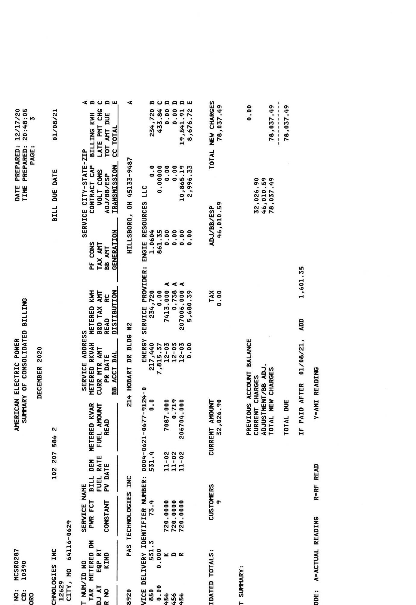

# CONSOLIDATED BILL 

SERVICE ADDRESS:
16769-1 25
$\left.\mathrm{H}\left[\mathrm{H}_{1}\right] \mathrm{H}_{1}\left[\mathrm{H}_{1}\right]\left[\mathrm{H}_{1}\right] \mathrm{H}_{1}\left[\mathrm{H}_{1}\right] \mathrm{H}_{1}\left[\mathrm{H}_{1}\right]\right] \mathrm{H}_{1}\left[\mathrm{H}_{1}\right] \mathrm{H}_{1}\left[\mathrm{H}_{1}\right] \mathrm{H}_{1}\right]$
PAS TECHNOLOGIES INC
PO BOX 12629
KANSAS CITY, MO 64116-0629

## Current Billing Summary:

## Previous charges:

Total Amount Due at Last Billing
Payments
$-$ \$61,984.51
$* 61,984.51$
\$0.00

## Current AEP Ohio Charges

Electric Billing Summary
TOTAL DUE
\$78,037.49

## Notes from AEP Ohio:

This bill is a consolidated bill, meaning several locations are being billed in one bill. Please see the following pages for more details.

Your total account balance is due on or before January 8, 2021

Mailing date is December 17, 2020

## Methods of Payment

aepohio.com
PO Box 371496
Pittsburgh, PA 15250-7496
1-800-611-0964 (fee may apply)

Need to get in touch?
Customer Operations Center: 1-888-237-5566
Outages: AEPOhio.com/outages or 1-800-672-2231

## AEP

## ON

Make check payable and send to: AMERICAN ELECTRIC POWER PO BOX 371496
PITTSBURGH, PA 15250-7496
$11111 m \mathrm{H}_{11} \mathrm{H}_{11} \mathrm{H}_{11} \mathrm{H}_{11} \mathrm{H}_{11} \mathrm{H}_{11} \mathrm{H}_{11} \mathrm{H}_{11} \mathrm{H}_{11} \mathrm{H}_{11} \mathrm{H}_{11} \mathrm{H}_{11} \mathrm{H}_{11} \mathrm{H}_{11} \mathrm{H}_{11} \mathrm{H}_{11} \mathrm{H}_{11} \mathrm{H}_{11} \mathrm{H}_{11}$

Amount $\# 102-207-586-2-6$
Amount due on or before $\$ 78,037.49$

Do Not Pay This Bill
Auto-withdrawal scheduled on 01/08/2021

The Neighbor to Neighbor program helps disdominated customers pay their electric bill. I used to help. My payment reflects my gift of

# PAS TECHNOLOGIES INC 

PO BOX 12629
KANSAS CITY, MO 64116-0629
Account \#102-207-586-2-6

## Line Item Charges:

| Previous Charges |  |
| :--: | :--: |
| Total Amount Due At Last Billing | \$ 61,984.51 |
| Payment 12/08/20 - Thank You | $-61,984.51$ |
| Previous Balance Due | \$ .00 |
| Current AEP Ohio Charges |  |
| Electric Billing Summary | \$ 78,037.49* |
| Total Balance Due   ${ }^{\text {Charges make up the "Total Balance Due" }}$   The Amount Will Be Deducted From Your Bank Account On January 8, 2021. |  |

## Notes from AEP Ohio:

In May 2018, our payment address changed! The new address is $\underline{\text { PQ }}$ Box 371496, Pittsburgh, PA 15250-7496. Please update your records and any bill-pay services to avoid fees or service interruptions. If you have updated your records no action is needed.
The Company will reinstate late payment fees effective with the due date of this bill. In order to avoid a late payment fee, the account will need to be current or a payment arrangement must be executed prior to the due date of this bill. In order to set up a payment arrangement please call 1-888-710-4237.
AEP now furnishes Commercial \& Industrial payment histories to credit reporting agencies.

The image is a photo of a document, specifically a billing statement. It contains detailed information about electric power usage and charges. Key elements include:

- **Header Information:**
  - "AMERICAN ELECTRIC POWER"
  - "SUMMARY OF CONSOLIDATED BILLING"
  - "DECEMBER 2020"
  - "DATE PREPARED: 12/17/20"
  - "TIME PREPARED: 8:10:45"
  - "BILL DUE DATE: 01/08/21"
  - "PAGE: 1 OF 1"

- **Account and Service Details:**
  - "ACCOUNT NO: 102 297 586 2"
  - "SERVICE ADDRESS: 214 HOBART DR"
  - "SERVICE CITY-STATE-ZIP: HILLSBORO, OH 45133-9649"
  - "SERVICE PROVIDER: ENGIE RESOURCES LLC"

- **Billing Details:**
  - Columns with headings such as "PF CONS", "SERVICE", "KWH", "AMT", "TAX AMT", "ADVANTAGE", "TOTAL"
  - Various numerical entries under each column, indicating different charges and usage metrics.

- **Additional Information:**
  - "SERVICE DELIVERY IDENTIFIER NUMBER" followed by a series of numbers.
  - "PAS TECHNOLOGIES INC" appears multiple times, likely indicating the customer or account holder.

The document is structured in a tabular format with multiple rows and columns, detailing different aspects of the billing and service information.

The image is a photo of a document, specifically a billing statement. It contains the following text:

- "AMERICAN ELECTRIC POWER"
- "SUMMARY OF CONSOLIDATED BILLING"
- "DECEMBER, 2020"
- "DATE PREPARED: 12/17/20"
- "TIME PREPARED: 21:49:05"
- "BILL DUE DATE: 01/08/21"
- "PAGE: 1"
- "ACCOUNT NO: 102 297 586 2"
- "SERVICE ADDRESS: 1036 HOMESTEAD AVE"
- "SERVICE PROVIDER: ENGIE RESOURCES LLC"
- "ENERGY SERVICE PROVIDER: ENGIE RESOURCES LLC"
- "BILLING KWH: 3645.00"
- "TOTAL AMOUNT: 1515.23"
- "TAX AMOUNT: 0.00"
- "ENGIE RESOURCES LLC, HILLSBORO, OH 45133-7940"
- "ENGIE RESOURCES LLC, HILLSBORO, OH 45133-4967"
- "ENGIE RESOURCES LLC, HILLSBORO, OH 45133"

The document includes columns with headings such as "PF CONS", "SERVICE CITY-STATE-ZIP", "BILLING KWH", "TAX AMOUNT", "TOTAL AMOUNT", and "ENGIE RESOURCES LLC". There are multiple entries with numerical values under these headings. The text is aligned in a structured format typical of billing statements.

The image is a photo of a billing statement. 

Embedded text includes:

- "DATE PREPARED: 12/17/20"
- "TIME PREPARED: 20:48:36"
- "PAGE: 3"
- "BILL DUE DATE: 01/08/21"
- "AMERICAN ELECTRIC POWER"
- "SUMMARY OF CONSOLIDATED BILLING"
- "DECEMBER 2020"
- "CUSTOMERS: 9"
- "CONSOLIDATED TOTALS:"
- "PREVIOUS ACCOUNT BALANCE: 32,026.90"
- "CURRENT CHARGES: 46,010.59"
- "ADJUSTMENTS: 0.00"
- "TOTAL NEW CHARGES: 78,037.49"
- "TOTAL DUE: 78,037.49"
- "IF PAID AFTER 01/08/21, ADD 1,601.35"
- "SERVICE PROVIDER: ENGIE RESOURCES LLC"
- "SERVICE ADDRESS: 214 HOBART DR BLDG #2"
- "HILLSBORO, OH 45133-9467"
- "ENERGY SERVICE PROVIDER: ENGIE RESOURCES LLC"
- "SERVICE DELIVERY IDENTIFIER NUMBER: 0804-0621-0677-9124-0"
- "SERVICE NAME: PAS TECHNOLOGIES INC"
- "PF CONS: 0.0"
- "SERVICE CITY-STATE-ZIP: HILLSBORO, OH 45133-9467"
- "TOTAL: 78,037.49"
- "ADJ/BESP: 46,010.59"
- "TAX: 0.00"
- "CONTRACT: 0.00"
- "ADJ: 0.00"
- "CONSUMPTION: 10,966.13"
- "GENERATION: 2,996.33"
- "TRANSMISSION: 0.00"
- "DISTRIBUTION: 0.00"
- "METERED KWH: 234,720 B"
- "METERED KWH: 453,804 C"
- "METERED KWH: 0.00 D"
- "METERED KWH: 19,541.91 E"
- "METERED KWH: 19,676.72 E"
- "TOTAL: 78,037.49"
- "ADJ/BESP: 46,010.59"
- "TAX: 0.00"
- "CONTRACT: 0.00"
- "ADJ: 0.00"
- "CONSUMPTION: 10,966.13"
- "GENERATION: 2,996.33"
- "TRANSMISSION: 0.00"
- "DISTRIBUTION: 0.00"

Spatial relationships:
- The text is organized in columns with headings such as "SERVICE PROVIDER," "SERVICE ADDRESS," "METERED KWH," and "TOTAL NEW CHARGES."
- The billing details are aligned in rows under respective headings.
- The total amounts and due dates are prominently displayed at the bottom right of the image.

