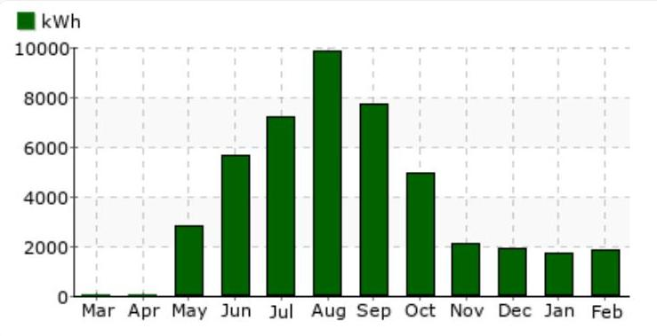

# (1) AdERA ENERGY 

## Contact Information

Phone: 844-692-4372 (844-MY-AGERA)
Fax: 888-277-2380
Hours: 8:30am - 6pm EST
555 Pleasantville Rd. S-107
Briarcliff Manor, NY 10510

## Payment Method: EFT

Do not pay, Automatic withdrawal
Email: CustomerCare@AgeraEnergy.com

## (1) (1)

## Billing Address

Education Station
2828 E Grauwyler Rd
Irving, TX 75061

## Billing Summary

| Current Energy Charges | $\$ 79.06$ |
| :-- | --: |
| TDU Delivery Charges | $\$ 164.16$ |
| Sales and Use Tax | $\$ 20.34$ |
| Gross Receipts Reimb. | $\$ 5.23$ |
| Payments | $\$ 268.79$ |
| Current Amount Due | $\$ 0.00$ |

## Agera Message Center

- In the event of a service outage or emergency, please contact Oncor at (888) 313-4747.
- For more information about residential electric service please visit http://www.powertochoose.com
- If you believe this bill has unauthorized charges, please contact us; if not satisfied with our review, you may file a complaint with PUCT, P.O. Box 13326, Austin, TX 78711-3326, 888-782-8477; REP Cert \#10230. Hearing and speech-impaired individuals with text telephones (TTY) may contact the commiss

## Usage Chart

The image is a bar chart.

- **Chart Type**: Bar chart
- **Y-Axis Title**: kWh
- **X-Axis Labels**: Mar, Apr, May, Jun, Jul, Aug, Sep, Oct, Nov, Dec, Jan, Feb
- **Data Points**:
  - Mar: 0 kWh
  - Apr: 0 kWh
  - May: 2000 kWh
  - Jun: 6000 kWh
  - Jul: 8000 kWh
  - Aug: 10000 kWh
  - Sep: 9000 kWh
  - Oct: 5000 kWh
  - Nov: 2000 kWh
  - Dec: 1000 kWh
  - Jan: 1000 kWh
  - Feb: 1000 kWh
- **Legend**: kWh
- **Styling**: The bars are colored green.

This represents a **yearly usage breakdown (monthly-based)**.

No usage data available before May

## Recent Account Activity

Account Balance prior to Jan 28, 2020: $\$ 0.00$

| Invoice Number | Invoice Date | Due Date | Invoice Amount | Payment Status |
| :-- | :-- | :-- | :-- | :-- |
| 35853062-9400009 | Jan 28, 2020 | Feb 7, 2020 | $\$ 272.39$ | $\$ 0.00$ Paid - Thank You |

Outstanding Balance: $\$ 0.00$

# Invoice Detail 

ESID \#: 10443720002615567

## Billing Type:

Actual
Service Address:
2328 E Grauwyler Rd
Irving, TX 75061
The average price you paid for electric service this month: 13.2 cents per kWh Your fixed rate product will expire on 02/03/2022

| Service Period: Jan 24, 2020 to Feb 24, 2020 |  |  |  |  |  |  |  |
| :--: | :--: | :--: | :--: | :--: | :--: | :--: | :--: |
| Description |  | Consumption |  | Rate | Charge | Tax | Total |
| Kilowatt Hours (kWh) |  | 1,843 | 0.0429000 | 79.06 | 6.52 | 85.58 |
| Meter | Start** | End** | Reading | Multiplier |  |  |  |
| 110797448LG | 65,666 | 67,509 | 1,843 | 1.000000 |  |  |  |
| PUC Assessment |  |  | .40 | 1.0000000 | 0.40 | 0.03 | 0.43 |
| Gross Receipts Reimb. |  |  | 4.83 | 1.0000000 | 4.83 | 0.40 | 5.23 |
| *Meter Charge |  |  | 1 | 30.8200000 | 30.82 | 2.54 | 33.36 |
| *Energy Efficiency Cost Recovery Factor |  |  | 1,843 | 0.0004140 | 0.76 | 0.06 | 0.82 |
| *Nuclear Decommissioning Fee |  |  | 34 | 0.0530000 | 1.80 | 0.00 | 1.80 |
| TDU Surcharges |  |  |  |  |  |  |  |
| *Distribution Cost Recovery Factor |  |  | 34 | 0.0995930 | 3.39 | 0.28 | 3.67 |
| *TDSP Customer Charge |  |  | 1 | 9.2500000 | 9.25 | 0.76 | 10.01 |
| *Distribution System Charge |  |  | 13 | 5.2271740 | 67.95 | 5.61 | 73.56 |
| *Transmission Cost Recovery Factor |  |  | 13 | 3.8605990 | 50.19 | 4.14 | 54.33 |
| Total |  |  |  |  | \$248.45 | \$20.34 | \$268.79 |

| Account Total |  |  |  |  | \$248.45 | $\$ 20.34$ | \$268.79 |
| :--: | :--: | :--: | :--: | :--: | :--: | :--: | :--: |

* TDU Delivery Charges. Please contact Oncor at (888) 313-4747 if you have questions about these charges. ** Start = Previous Meter Read, End = Current Meter Read.

