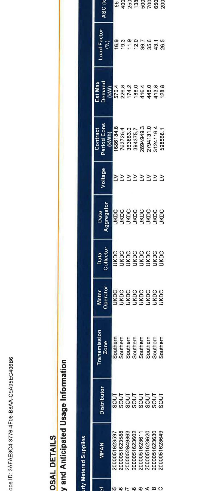
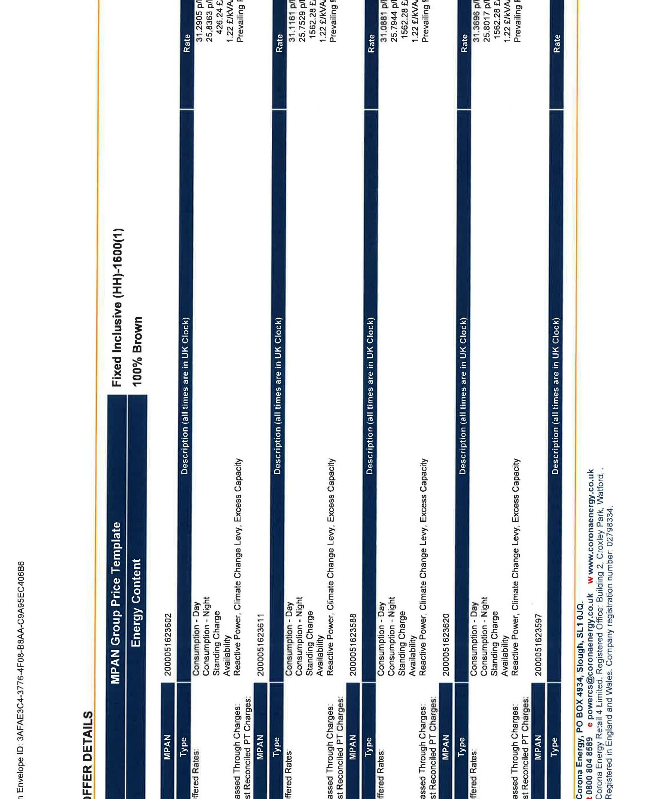
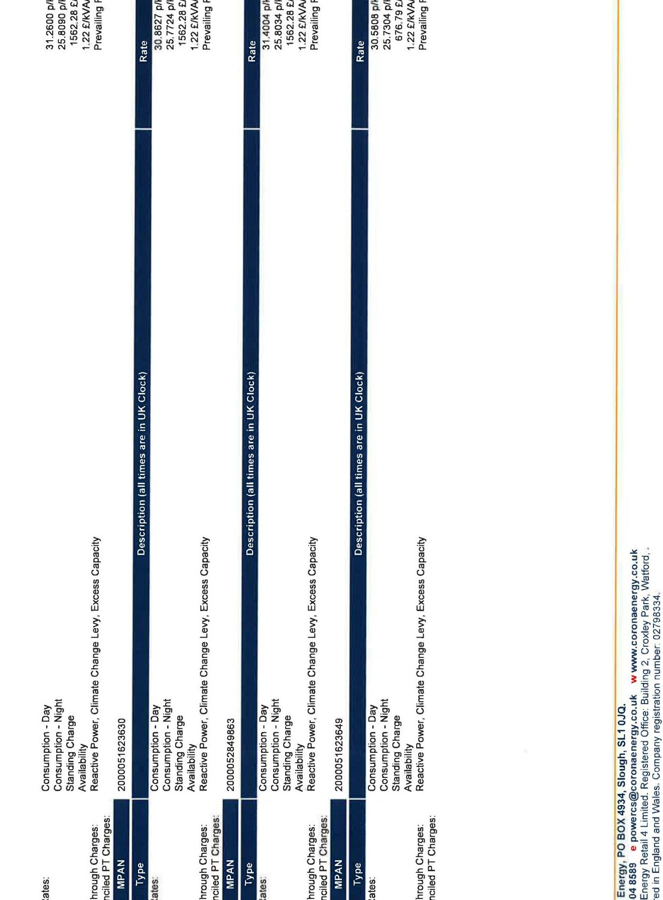

# corona ENERGY 

Site manager
Vector Aerospace International Limited
Fleetlands
Fareham Road
Gosport
Hampshire
PO13 0AA

Telephone: 08008048589
Email: powercs@coronaenergy.co.uk

## Corona Energy Electricity Supply Contract

PARTICULARS OF CONTRACT

| Customer Name: | Vector Aerospace International Limited |
| :-- | :-- |
| Customer Address: | Fleetlands   Fareham Road   Gosport   Hampshire   PO13 0AA |
| Company/Charity Registration   Number: | Registered in England Number: 6404274 |
| Contract Reference: | $256125-23 / 1$ |
| Customer Reference: | 60126956 |
| Start Date: | $01 / 10 / 2023$ |
| End Date: | $30 / 09 / 2025$ |
| Product: | KAM Fixed 2 |
| Number of Sites: | 8 (as detailed in Proposal Details Section) |
| Payment Terms: | 30 |
| Payment Method: | Direct Debit |

The Third Party Intermediary (TPI) is Power Kiosk

The value of that TPI Fee is included in your agreed contract price
the TPI fee payable to Power Kiosk Equates to 0.5 ppkwh

# TERMS AND CONDITIONS 

The Corona Energy Electricity Supply Contract is subject to the acceptance of Corona Energy's Terms and Conditions relating to the Product stated on Page 1 of this document.

Please be aware any Products that relate to an SME Product agreement; if termination has not been served by either party 30 days before the End Date, we will automatically renew your supply for a further twelve month period.

Corona Energy has the right to withdraw this offer at any time prior to issuing written confirmation that the agreement has been accepted on these terms. If the contract is terminated early, additional charges may apply, please ensure you are familiar with all clauses relating to Termination, Change of Ownership/Isolation, Liability and Force Majeure; all of which are highlighted in bold within the terms and conditions.

Our prices are subject to VAT \& Climate Change Levy, signed acceptance, credit approval and successful transfer of the supply point on the agreed start date in the event of a new business supply

The supply contract is a legal document, and as such is binding on both parties once entered into.

The image is a photo of a signed document section.

Embedded text:

- "Signed on behalf of the Customer"
- "Signature:"
- "Print Name:"
- "Position:"
- "Date:"

Handwritten entries:

- Signature: [Signature]
- Print Name: Brent Fawkes
- Position: VP Finance
- Date: May 16/23

Spatial relationships:

- The handwritten entries are aligned to the right of their respective labels.
- The labels are in a vertical list on the left side, with corresponding handwritten entries on the right.

Signed on behalf of the Supplier

| Signature: |  |
| :-- | :-- |
| Print Name: |  |
| Position: |  |
| Date: |  |

The image is a table containing detailed information about energy usage and distribution. The table includes the following columns and data:

- **Proposal Details**: "Summary and Anticipated Usage Information"
- **Hourly Metered Supplies**: "MPAN"
  - 2000051623597
  - 2000051624583
  - 2000052849863
  - 2000051623611
  - 2000051623602
  - 2000051623649
- **Distributor**: "SOUT" for all entries
- **Transmission Zone**: "Southern" for all entries
- **Meter Operator**: "UKDC" for all entries
- **Data Collector**: "UKDC" for all entries
- **Data Aggregator**: "UKDC" for all entries
- **Voltage**: "LV" for all entries
- **Contract Period Cons (KWH)**:
  - 168814.8
  - 763726.4
  - 363863.0
  - 394375.7
  - 2984949.3
  - 3121416.4
  - 598568.1
- **Est Max Demand (kW)**:
  - 570.4
  - 226.8
  - 174.2
  - 186.4
  - 4418.0
  - 413.6
  - 128.8
- **Load Factor (%)**:
  - 16.9
  - 19.3
  - 11.9
  - 12.0
  - 39.7
  - 35.6
  - 26.5
- **ASC (kVA)**:
  - 55
  - 400
  - 250
  - 138
  - 500
  - 650
  - 200

The table is organized with each column header aligned above its respective data entries. The text "Page ID: 3AFAE3C4-3776-4F08-B8AA-C9A95EC406B6" appears vertically along the left side.

The image is a photo of a document with tabular data. It includes the following text:

- "Fixed Inclusive (HH) - 1600(1)"
- "100% Brown"
- "MPAN Group Price Template"
- "Energy Content"
- "Rate"
- "25.386 p/kWh"
- "25.386 p/kWh"
- "25.386 p/kWh"
- "31.688 p/kWh"
- "31.688 p/kWh"
- "31.688 p/kWh"
- "12.42 p/kVA"
- "12.42 p/kVA"
- "12.42 p/kVA"
- "Prevailing"
- "Prevailing"
- "Prevailing"
- "Description (all times are in UK Clock)"
- "Consumption - Day"
- "Consumption - Night"
- "Standing Charge"
- "Reactive Power, Climate Change Levy, Excess Capacity"
- "MPAN"
- "2000051252692"
- "2000051253111"
- "2000051253260"
- "2000051253957"
- "Type"
- "Passed Through Charges: BSUoS, TNUoS, Elexon, Renewables Obligation, Feed in Tariff, Assistance for Areas with High Electricity Distribution Costs, Contracts for Difference, Capacity Market"
- "Availability"
- "Envelope ID: 3AFAE1C3-377E-46F9-B8BA-C9A985C409BB"
- "www.crownenergy.co.uk"
- "Crown Gas and Power is a trading name of Crown Oil Ltd. Registered in England and Wales. Company registration number: 02720334."

The text is organized in columns, with each column containing specific details related to energy pricing and consumption.

The image is a photo or illustration of a document with text arranged in columns. The text includes:

- "Consumption - Day"
- "Consumption - Night"
- "Standing Charge"
- "Available Power, Climate Change Levy, Excess Capacity"
- "Reactive Power Charges"
- "MPAN"
- "2000051628630"
- "2000052498693"
- "2000051628649"
- "Rate"
- "312.600 p/kWh"
- "258.890 p/kWh"
- "152.240 p/kWh"
- "12.240 p/kWh"
- "Prevailing"
- "316.287 p/kWh"
- "252.849 p/kWh"
- "152.240 p/kWh"
- "12.240 p/kWh"
- "Prevailing"
- "316.004 p/kWh"
- "258.049 p/kWh"
- "152.240 p/kWh"
- "12.240 p/kWh"
- "Prevailing"
- "316.080 p/kWh"
- "257.819 p/kWh"
- "152.240 p/kWh"
- "12.240 p/kWh"
- "Prevailing"
- "Description (all times are in UK Clock)"
- "www.coronaenergy.co.uk"
- "PO BOX 4934, Slough, SL1 0JG"
- "Corona Energy Retail 4 Ltd"
- "Registered in England and Wales"
- "Company No. 02722454"
- "Registered Office: 1st Floor, Building 2, Croxley Park, Watford."

The columns are vertically oriented, with the text aligned in rows.

# TERMINOLOGY 

| Acronym/Term | Meaning |
| :--: | :--: |
| MPAN | Meter Point Administration Number - a 13 digit unique reference for your supply point. |
| SSC | Standard Settlement Configuration - for meters that do not take half hourly measurements of consumption this is a 4 digit code that represents the periods of use that your meter is capable of measuring. This will not be displayed for half hourly meters. |
| Site | A geographic location in the United Kingdom. |
| Price Group | A grouping of the supplies for which you are being provided a quotation based on their sharing the same pricing template, rate structure and energy content. |
| Offered Rates | These are the rates that are being offered to you. |
| Passed Through Charges | These are rates that we are either directly charged for your supply (e.g. Distribution costs) or are charged on billed values (e.g. CCL and VAT). These charges will be passed onto you and charged in addition to the "Offered Rates". |
| Est Reconciled PT Charges | Estimated Reconciled Passed-Through Charges - these are Pass-Through charges for which the amount is not known until after the event e.g. TNUoS TRIAD rates. We will charge an estimated amount, based on your forecast usage, up until the actual amount is known and at this point a reconciliation will be performed. The difference between the estimated charges that have been charged up until this point and the actual amount due is calculated by the reconciliation and is then included on your next bill. |
| Estimated Annual Cons (kWh) | An estimate of the amount of electricity that will be used over the next annual period. The value is expressed in kWh and it is based on this prediction of your use that this quote has been provided. If you believe the value displayed is not an accurate estimation of your predicted use please let us know. |
| Contract Period Cons (kWh) | The estimated total consumption over the contract term for an individual supply point on the basis of which the offered rates have been calculated. |
| Est Max Demand (kW) | An estimation of the maximum demand that will be applicable for a supply. |
| Load Factor (\%) | A ratio of the average load on the supply point divided by the peak load. |
| ASC (kVA) | Available Supply Capacity. The amount of electricity that the Distribution Network Operator (DNO) makes available for use through your supply. |
| Metering Point | The term Metering Point relates to the electricity usage at your meter point. Due to losses over the transmission and distribution networks the energy actually used at a meter point is less than the total energy that needs to be generated in order to supply it to you. |
| Grid Supply Point | The term Grid Supply Point relates to the volume of electricity that needs to be delivered to the grid supply point in order to then be distributed to your supply to provide the metering point consumption. The Grid Supply Point consumption is the sum of the Metering Point consumption and distribution losses. |
| Notional Balancing Point | The term Notional Balancing Point relates to the volume of electricity that needs to be generated in order to transmit and distribute the electricity to supply and provide the Metering Point consumption. The Notional Balancing Point consumption is the sum of the Metering Point consumption, distribution losses and transmission losses. |

## MARKET PARTICIPANTS

| Participant Code | Role | Training As |
| :--: | :--: | :--: |
| SOUT | Distributor | SSE Power Distribution |
| UKDC | Meter Operator | IMServ Europe Ltd |
| UKDC | Data Collector | IMServ Europe Ltd |
| UKDC | Data Aggregator | IMServ Europe Ltd |

