# CUSTOMER USAGE INFORMATION AUTHORIZATION 

I hereby authorize my energy utility to act in my behalf for the purpose of obtaining information about my historical energy usage and billing information and consent to the release of same so that the Company named herein may evaluate my energy usage patterns and make me an offer to supply energy. The utility considers all customer usage information to be confidential.

This authorization in no way binds me to the purchase of any service or product from the Company named herein and is to be used for the sole purpose of determining my offer price of energy service or the provision of other energy-related services.

## Supplier/Consultant Information (please print):

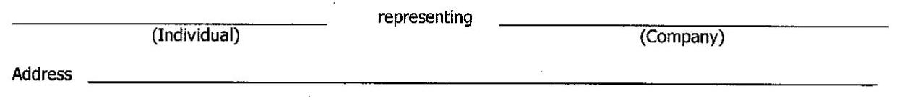

The image is a form with two horizontal lines for input. The first line is labeled "(Individual)" on the left and "(Company)" on the right, with the word "representing" in between. Below this, there is a line labeled "Address" for input.

Address
Email Address $\qquad$ Phone Number

Type of Data Requested (If you select both, you will be charged for each):
$\qquad$ Sixty (60) minute interval data (if available) provided in ASCII text file
$\qquad$ Monthly billing information (will be provided if 60 minute interval data is unavailable)
NOTE: Billing information will typically cover the most recent twelve-month period.

## Operating Company Information (please print):

My Utility $\qquad$
Company Name $\qquad$
Address
City $\qquad$ State $\qquad$ Zip $\qquad$
Business Contact Name $\qquad$ Telephone Number
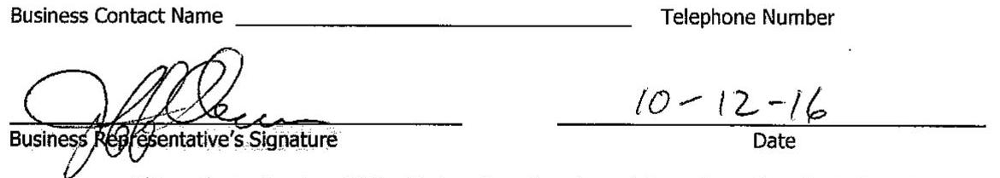

The image is a section of a form with two main parts. On the left, there is a line labeled "Business Contact Name" with a signature below it labeled "Business Representative's Signature." On the right, there is a line labeled "Telephone Number" and below it, a date "10-12-16" is written on a line labeled "Date." The signature and date are handwritten.

This authorization is valid for 90 days from the above date, unless otherwise indicated. I wish to have this authorization valid until $\qquad$ (date \& initial).

Account Number(s) (As shown on Page 3 of Latest Bill)
$\qquad$
$\qquad$
$\qquad$
$\qquad$
$\qquad$

## Nordic

Nordic Energy Services, L.L.C.

For Outages / Emergencies Call:
ComEd
(800) 334-7661

HOW TO CONTACT US
Toll Free: 1 877-808-1022
Fax: 1 630-321-0819
For customer service and billing inquiries
Web: www.nordicenergy-us.com
For more information about our services

Invoice Number: 0001759391

| Account Number: 3201271000 |  | BILL SUMMARY |  |  |
| :--: | :--: | :--: | :--: | :--: |
| Name: | Albany Care Inc - 901 Maple Avenue | Invoice Date:   Previous Balance   Total Payments-Thank You   Amount Due by 10/13/16 |  | 09/29/16 |
| Service | 901 Maple Avenue |  |  | \$8,657.58 |
| Location: | Evanston, IL 60202 |  |  | \$8,657.58) |
|  |  |  |  | \$6,925.01 |
| Service from 08/29/2016 to 09/27/2016 - 30 Days |  |  |  | Charges |
| Current Electric Supply Charges |  |  |  |  |
| Electricity Supply Charge |  | $\begin{gathered} \text { Volume } \\ 109,763.98 \mathrm{kWh} \end{gathered}$ |  | $\$ 0.06309$ |
| Meter Information |  |  |  |  |
| Read Date | Meter Number | Volume | Reading Type |  |
| 09/27/16 | 230145211 | 109,763.98 kWh | Actual |  |
| Statement of Account |  |  |  |  |
| Previous balance from invoice 0001732740. |  |  |  | $\$ 8,657.58$ |
| Payment received on 09/12/16. |  |  |  | (\$8,657.58) |
| Current charges |  |  |  | \$6,925.01 |
| Total Amount Owed by 10/13/16 |  |  |  | \$6,925.01 |

## ComEd

An Exelon Company

## Visit ComEd.com

Customer Service / Power Outage
Sngilish
1.8028COMED1:1.877.426.6331

## Expans!

$1.800 .951 . U C E S(1.800 .955 .8237)$
Hearing/Speech Impaired
$1.800 .572 .5789$ (TTY)

Your Usage Profile
13-Month Usage (Total kWh)

The image is a photo or illustration showing a handwritten signature. There are no additional elements or text visible in the image.
$A .8 .0 .6 .9 .1 . P . M .5 . M .1 .2 . A$
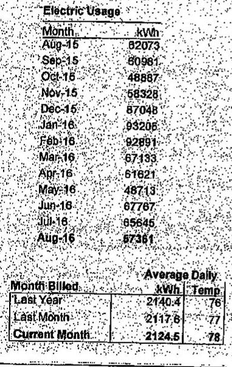

The image is a photo of a table showing electric usage data. 

- **Table Headers:**
  - Electric Usage
  - Month
  - kWh

- **Data Points:**
  - Aug-15: 82073
  - Sep-15: 60981
  - Oct-15: 48887
  - Nov-15: 58328
  - Dec-15: 87048
  - Jan-16: 93205
  - Feb-16: 92891
  - Mar-16: 67133
  - Apr-16: 61621
  - May-16: 48713
  - Jun-16: 67767
  - Jul-16: 95645
  - Aug-16: 57361

- **Additional Table:**
  - Month Billed
  - Average Daily
  - Last Year: 2740.4 kWh, Temp 76
  - Last Month: 2117.6 kWh, Temp 77
  - Current Month: 2124.5 kWh, Temp 78

## $A w$

Page 1 of 3
Account Number 0640112036
Name
GENERATIONS AT APPLEWOOD
Service Location 21020 KOSTNER AVE MATTESON Phone Number 708-337-6789

The image is a photo or illustration showing a handwritten signature. There are no additional elements or text visible in the image.

Bill Summary
Previous Balance
Total Payments - Thank You
Amount Due on September 12, 2016
\$5,462.49
Amount Due on September 12, 2016
$\$ 4,958.16$

| Meter Information |  |  |  |  |  |  |  |  |
| :--: | :--: | :--: | :--: | :--: | :--: | :--: | :--: | :--: |
| Read Dates | Meter Number | $\begin{aligned} & \text { Load } \\ & \text { Type } \end{aligned}$ | Reading Type | Previous | Meter Reading Present | Difference | Multiplier   $\mathrm{X}$ | Usage |
| 824 | 141777883 | General Service | Total kWh | Actual | Actual |  |  | 30767 |
| $\begin{aligned} & 703- \\ & 804 \end{aligned}$ | 141777883 | General Service | On Pk kW | Actual | Actual |  |  | 69.12 |
| $\begin{aligned} & 703- \\ & 804 \end{aligned}$ | 141777888 | Space Heat | Total kWh | Actual | Actual |  |  | 21416 |
| $\begin{aligned} & 703- \\ & 804 \end{aligned}$ | 141777888 | Space Heat | On Pk kW | Actual | Actual |  |  | 74.30 |
| $\begin{aligned} & 703- \\ & 804 \end{aligned}$ | 141777888 | General Service | Total kWh | Actual | Actual |  |  | 5188 |
| $\begin{aligned} & 703- \\ & 804 \end{aligned}$ | 141777888 | General Service | On Pk kW | Actual | Actual |  |  | 14.83 |

Service from 7/28/2016 to 8/24/2016 - 27 Days
Retail Delivery Service - 100 kW to 400 kW
Electricity Supply Services - MC Squared Energy Services
$\$ 3,106.67$
MC2 Custom Fixed Price $57,360.88 \mathrm{kWh} X 0.05416$
3,106.67

MC Squared Energy Services 1-877-622-7607 www.mc2energyservices.com
Please refer to your supplier contract for details.

Delivery Services - ComEd
\$1,155.37
Customer Charge
23.52

Standard Material Charge
Distribution Facilities Charge
158.26 kW X
6.31000
958.62

IL Electricity Distribution Charge
57,361 kWh X
0.00115
65.97

For Electric Supply Choices visit
plugmillinois.org
(continued on next page)
Return only this portion with your check made payable to ComEd. Please write your account number on your check.

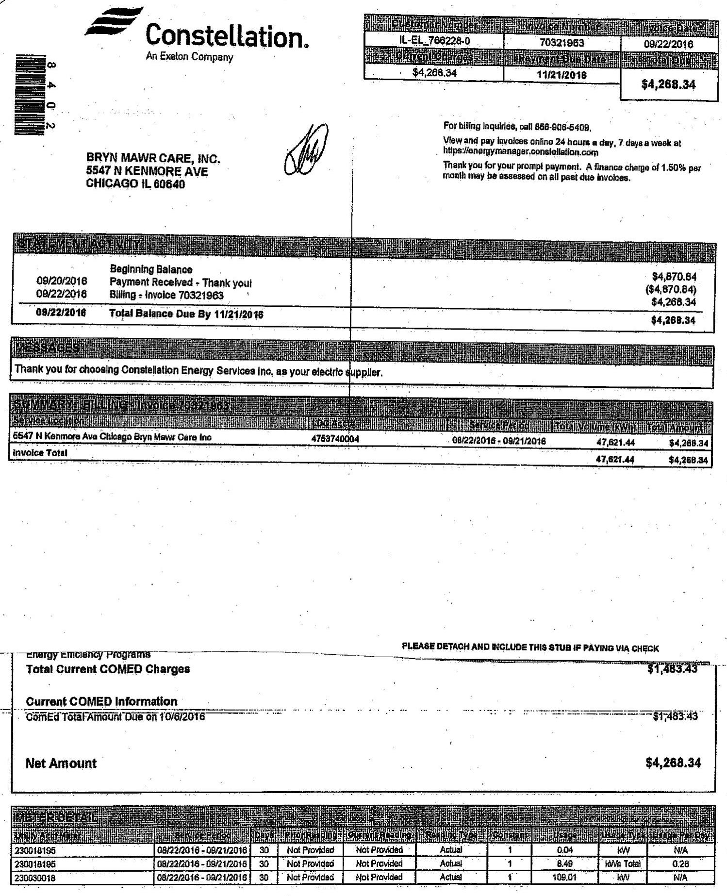

The image is a photo of a billing statement from Constellation, an Exelon Company. The statement is addressed to Bryn Mawr Care, Inc., located at 5547 N Kenmore Ave, Chicago, IL 60640. The account number is IL-EL-766228-0, and the invoice number is 70321963, dated 09/22/2016. The total amount due by 11/21/2016 is $4,268.34.

The statement includes a breakdown of charges:

- Beginning Balance: $4,870.84
- Payment Received: ($4,870.84)
- Billing - Invoice 70321963: $4,268.34
- Total Balance Due: $4,268.34

There is a note thanking the customer for choosing Constellation Energy Services Inc. as their electric supplier.

Additional details include:

- For billing inquiries, call 866-905-5409.
- View and pay invoices online at https://energymanager.constellation.com.
- A finance charge of 1.50% per month may be assessed on all past due invoices.

The invoice total is $47,621.44, with a net amount of $4,268.34.

The statement also mentions energy efficiency programs and current COMED charges totaling $1,483.43, with a COMED total amount due on 10/06/2016.

Meter readings are listed with identifiers and dates, showing usage in kW and kWh.

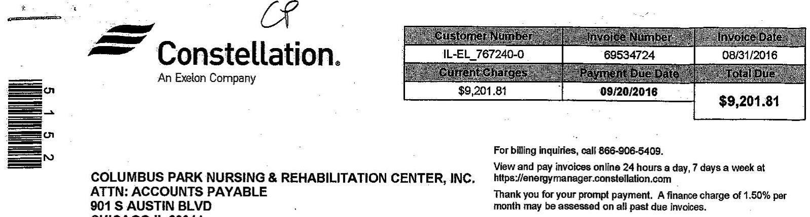

The image is a photo of a billing statement stub from Constellation, an Exelon Company. 

- The top left features the Constellation logo.
- Below the logo, there is a barcode with the number "51512" next to it.
- The address for Columbus Park Nursing & Rehabilitation Center, Inc. is listed:
  - ATTN: ACCOUNTS PAYABLE
  - 901 S AUSTIN BLVD
  - CHICAGO IL 60544

- On the right side, there is a table with the following details:
  - **Customer Number:** IL-EL_767240-0
  - **Invoice Number:** 69534724
  - **Invoice Date:** 08/31/2016
  - **Current Charges:** $9,201.81
  - **Payment Due Date:** 09/20/2016
  - **Total Due:** $9,201.81

- At the bottom right, there is a section for billing inquiries:
  - "For billing inquiries, call 866-906-5409."
  - "View and pay invoices online 24 hours a day, 7 days a week at https://energymanager.constellation.com"
  - "Thank you for your prompt payment. A finance charge of 1.50% per month may be assessed on all past due invoices."

For billing inquiries, call 866-906-5409.
View and pay invoices online 24 hours a day, 7 days a week at
httpa://energymanager.constellation.com
Thank you for your prompt payment. A finance charge of 1.50\% per month may be assessed on all past due invoices.

# STATEMENT ACTIVITY 

|  | Beginning Balance | $\$ 8,807.83$ |
| :-- | :-- | --: |
| 08/09/2016 | Payment Received - Thank you! | $(\$ 8,507.93)$ |
| 08/31/2016 | Billing - Invoice 69534724 | $\$ 9,201.81$ |
| 08/31/2016 | Total Balance Due By 09/20/2016 | $\$ 9,201.81$ |

## MESBACES

Thank you for choosing Constellation Energy Services Inc. as your electric supplier.

| SUMMARY: BILLING, Invoice 69534724 |  |  |  |  |
| :--: | :--: | :--: | :--: | :--: |
| Service Location | LDC Acute | Service Period | Total Volume (VVH) | Total Amount |
| 901 S Austin Bird Chicago Columbus Park Nursing Ctr Inc | 6142750003 | 07/29/2016 - 08/29/2016 | 111,214.89 | $\$ 9,201.81$ |
| Invoice Total |  |  | 111,214.89 | $\$ 9,201.81$ |

PLEASE DETACH AND INCLUDE THIS STUB IF PAYING VIA CHECK

| Customer Number | Invoice Number | Payment Due Date |
| :--: | :--: | :--: |
| IL-EL_767240-0 | 69534724 | 09/20/2016 |
| Invoice Date | Total Due | Amount Enclosed |
| 08/31/2016 | \$9,201.81 |  |

PLEASE USE THE FOLLOWING RELEVANT INFO FOR PAYMENT: PAYABLE TO: CONSTELLATION ENERGY SERVICES, INC ACHAVIRE: US BANK, ABA 07500022 / ACCOUNT 121740451 ACHAVIRE NOTIFICATION: PAYMENTS@CONSTELLATION:COM

COLUMBUS PARK NURSING \& REHABILITATION CENTER, INC. ATTN: ACCOUNTS PAYABLE 901 S AUSTIN BLVD CHICAGO IL 60544
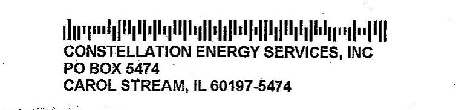

The image is a photo of a billing statement stub from Constellation Energy Services, Inc. 

- At the top, there is a barcode.
- Below the barcode, the text reads:
  - "CONSTELLATION ENERGY SERVICES, INC"
  - "PO BOX 5474"
  - "CAROL STREAM, IL 60197-5474"

## 30

## Constellation.

An Exelon Company

COLUMBUS PARK NURSING \& REHABILITATION CENTER, INC. ATTN: ACCOUNTS PAYABLE 901 S AUSTIN BLVD CHICAGO IL 60644

| Customer Number | Involve Number | Involve Date |
| :--: | :--: | :--: |
| IL-EL_767240-0 | 69534724 | 08/31/2016 |
| Account Number | Service Period |  |
| 836403 | 07/29/2016 - 08/29/2016 |  |

In case of emergency, contact your local utility, ComEd 877-426-8331.
View and pay invoices online 24 hours a day, 7 days a week at
https://energymanager.constellation.com
Thank you for your prompt payment. A finance charge of $1.50 \%$ per month may be assessed on all post due invoices.

# INVOLVE DETAIL - 901 S Austin Blvd Chicago Columbus Park Nursing Ctr Inc. 

COMED: \#8142750002 - ROS: IRIMAL Delivery Service: - 100 - 400 kW

## Current Constellation Energy Charges

| Metered Usage | 111,214.89 kWh |  |
| :-- | :-- | --: |
| Distribution Losses | 111,214.89 kWh @ 0.00237 | $\$ 263.58$ |
| Energy-Fixed Price | 111,214.89 kWh @ 0.03032 | $\$ 3,372.04$ |
| Ancillary Fixed | 111,214.89 kWh @ 0.00311 | $\$ 345.88$ |
| RPS Compliance Charges | 111,214.89 kWh @ 0.00103 | $\$ 114.55$ |
| Transmission Requirement | 111,214.89 kWh @ 0.00706 | $\$ 785.18$ |
| Capacity Charges | 111,214.89 kWh @ 0.01182 | $\$ 1,314.56$ |
| Sub Total |  | $\$ 6,195.79$ |
| Total Charges |  | $\$ 6,195.79$ |
| Total Current Constellation Energy Charges |  | $\$ 8,195.79$ |

## Current COMED Charges

Single Bill Option Credit
Customer Charge
220.56 K1 @ 6.31
$111,215.00 \mathrm{KH} @ 0.00115$
$111,215.00 \mathrm{KH} @ 0.00002$
$\$ 2.22$
$\$ 1.76$
$0.00 @ 0.00$
$\$ 367.81$
$\$ 27.12$
$\$ 436.30$
$\$ 344.53$
$\$ 283.60$
Total Current COMED Charges
$\$ 3,008.02$

## Current COMED Information

ComEd Total Amount Due on 9/13/2016
$\$ 3,005.02$

## Net Amount

$\$ 9,201.81$

| ME-   MRTER-DET |  |  |  |  |  |  |  |  |
| :--: | :--: | :--: | :--: | :--: | :--: | :--: | :--: | :--: |
| MRTER-DETAl |  |  |  |  |  |  |  |  |
| MRTER-DETAl |  |  |  |  |  |  |  |  |
| MRTER-DETAl |  |  |  |  |  |  |  |  |
| MRTER-DETAl |  |  |  |  |  |  |  |  |
| MRTER-DETAl |  |  |  |  |  |  |  |  |
| MRTER-DETAl |  |  |  |  |  |  |  |  |
| 230022991 | 07/29/2016 - 08/29/2016 | 31 | Not Provided | Not Provided | Actual | 1 | 217.54 | kW | N/A |
| 230022991 | 07/29/2016 - 08/29/2016 | 31 | Not Provided | Not Provided | Actual | 1 | 109,284.05 | kWh Total | 3,535.29 |
| 230075905 | 07/29/2016 - 08/29/2016 | 31 | Not Provided | Not Provided | Actual | 1 | 0.03 | kW | N/A |
| 230075905 | 07/29/2016 - 08/29/2016 | 31 | Not Provided | Not Provided | Actual | 1 | 20.45 | kWh Total | 0.66 |

## Constellation.

An Easton Company

| Customer Number | Involve Number | Involve Date |
| :--: | :--: | :--: |
| IL-EL_767240-0 | 69534724 | 08/31/2016 |
| Account Number | Service Period |  |
| 836403 | 07/29/2016 - 08/29/2016 |  |

In case of emergency, contact your local utility, ComEd 877-428-8331.
View and pay involves online 24 hours a day, 7 days a week at https://emergymanager.constellation.com
Thank you for your prompt payment. A finance charge of $1.50 \%$ per month may be assessed on all past due involves.

| METER DETAIL |  |  |  |  |  |  |  |  |
| :--: | :--: | :--: | :--: | :--: | :--: | :--: | :--: | :--: |
| Utility ACT Meter | Service Period | Days | Price Reading | Current Reading | Reading Type | Constant | Usage | Unique Type | Unique Pay Day |
| 271615862 | 07/29/2016 - 08/29/2016 | 31 | Not Provided | Not Provided | Actual | 1 | 4.19 | $M / V$ | N/A |
| 271615862 | 07/29/2016 - 08/29/2016 | 31 | Not Provided | Not Provided | Actual | 1 | 1,910.39 | With Total | 61.63 |

AVERAGE DALY USE
AVERAGE TEMPERATURE

CURRENT: $\mathbf{3 , 6 8 7 . 5 8}$
LASTYEAR: $\mathbf{3 , 2 2 1 . 8 0}$
LAST YEAR: $\mathbf{7 2 *} \mathbf{F}$

# Nordic Energy Services, L.L.C. 

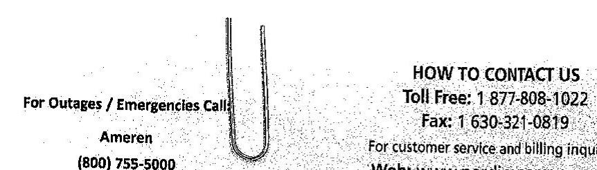

The image is a photo or illustration showing contact information for Nordic Energy Services, L.L.C. 

Embedded text includes:

- "For Outages / Emergencies Call"
- "Ameren"
- "(800) 755-5000"
- "HOW TO CONTACT US"
- "Toll Free: 1 877-808-1022"
- "Fax: 1 630-321-0819"
- "For customer service and billing inquiries:"
- "Web: www.nordicenergy-us.com"

There is a paperclip visible in the image, positioned vertically between the text sections.

HOW TO CONTACT US
Toll Free: 1 877-808-1022
Fax: 1 630-321-0819
For customer service and billing inquiries: Web: www.nordicenergy-us.com For more information about our services

## Account Number: 9463527531

Name: $\quad$ DECATUR MANOR HEALTHCARE, LLC - 1016 W Pershing

Service 1016 W Pershing
Location: Decatur, IL 62526

## BILL SUMMARY

| Invoicse Date: | 10/07/16 |
| :-- | --: |
| Previous Balance | $\$ 3,322.33$ |
| Total Payments-Thank You | $\$ 0.00$ |
| Amount Due by 10/21/16 | $\$ 6,036.15$ |

Service from 09/06/2016 to 10/04/2016 - 29 Days
Charges

| Current Electric Supply Charges | Volume | Rate |
| :--: | :--: | :--: |
| Electricity Supply Charge | 50,250.00 kWh | \$0.05365 |

## Meter Information

| Read Date | Meter Number | Volume | Reading Type |
| :-- | :-- | :--: | :-- |
| $10 / 05 / 16$ | 000000000 | 490.00 kWh | Actual |
| $10 / 05 / 16$ | 92367097 | $49,760.00 \mathrm{kWh}$ | Actual |

Statement of Account
Previous balance from invoice 0001740959.
\$3,322.33
Current charges
\$2,695.91
Late Charges
$\$ 17.91$
Total Amount Owed by 10/21/16
\$6,036.15

The image is a photo or illustration showing a signature. It appears to be a stylized or cursive signature enclosed within an oval shape. There are no additional elements or embedded text visible in the image.

Please retum this portion with your payment
First Class Mail
NORDIC ENERGY SERVICES, LLC
2999 MOMENTUM PLACE
CHICAGO, IL 60689-5329

DECATUR MANOR HEALTHCARE, LLC 1016 W PERSHING
DECATUR, IL 62526

| Account Number: 9463527531 | Invoice Number: 0001766962 |
| :-- | :--: |
| Due Date: 10/21/16 | Total Due: $\$ 6,036.15$ |
| Amount Enclosed: |  |
| Make check payable to Nordic Energy Services, LLC |  |

For Overnight Delivery Please Mail to:
Fifth Third Bank C/O Nordic Enerov Services.LLC
PO Box \#232999
4900 W. 95th Street. Attn Wholesale Lockbox Oak Lown, IL 60453-2542

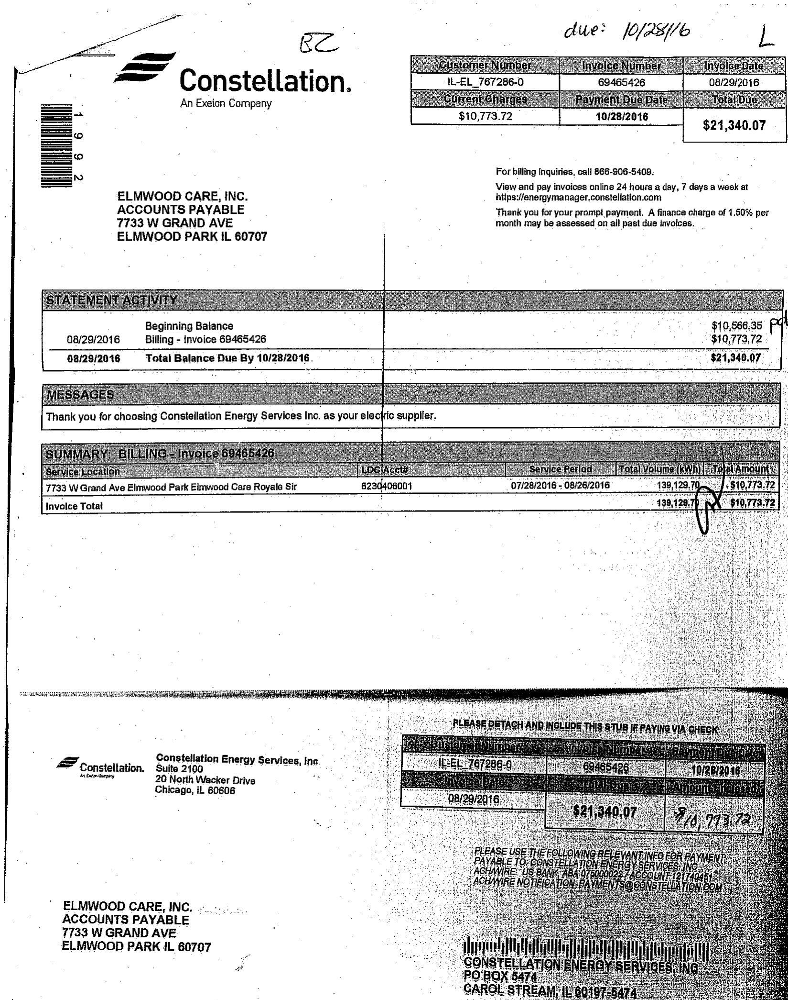

The image is a photo of a billing statement from Constellation, an Exelon Company. It is addressed to Elmwood Care, Inc., Accounts Payable, located at 7733 W Grand Ave, Elmwood Park, IL 60707.

Key details from the statement include:

- **Customer Number:** I-L-EL_767286-0
- **Invoice Number:** 69465426
- **Invoice Date:** 08/29/2016
- **Current Charges:** $10,773.72
- **Payment Due Date:** 10/28/2016
- **Total Due:** $21,340.07

**Statement Activity:**
- **Beginning Balance (08/29/2016):** $10,566.35
- **Billing - Invoice 69465426:** $10,773.72
- **Total Balance Due By 10/28/2016:** $21,340.07

**Messages:**
- "Thank you for choosing Constellation Energy Services Inc. as your electric supplier."

**Summary Billing - Invoice 69465426:**
- **Service Location:** 7733 W Grand Ave Elmwood Park Elmwood Care Royala Sir
- **LDC/Asset:** 6230406001
- **Service Period:** 07/28/2016 - 08/26/2016
- **Total Volume (kWh):** 139,129.70
- **Total Amount:** $10,773.72

The statement includes contact information for billing inquiries and instructions for viewing and paying invoices online. There is also a note about a finance charge of 1.50% per month on past due invoices.

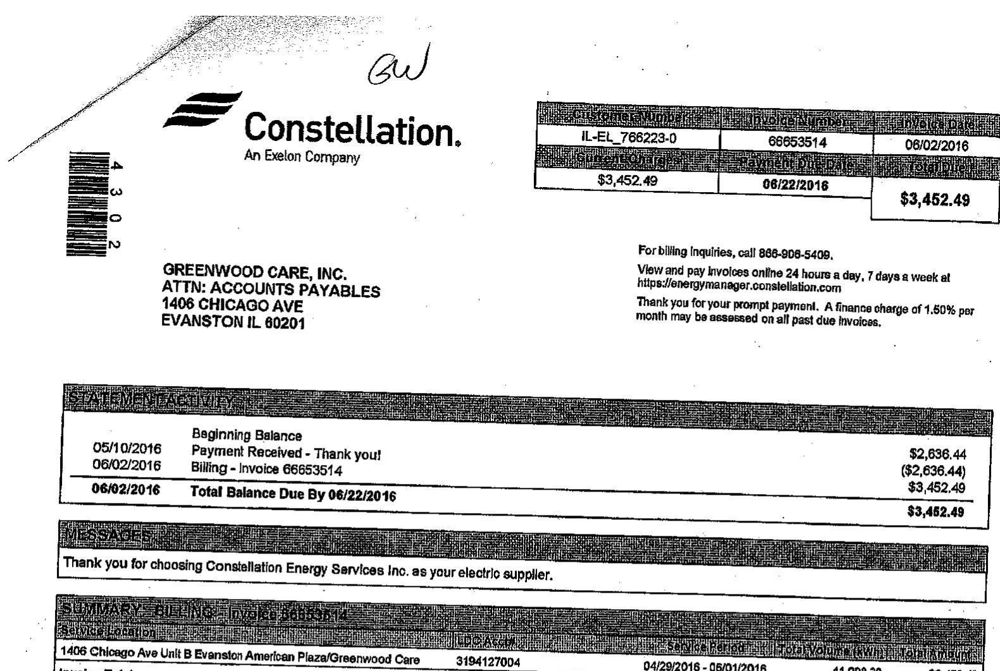

The image is a photo of a billing statement from Constellation, an Exelon Company. 

Embedded text includes:

- "Constellation. An Exelon Company"
- "GREENWOOD CARE, INC. ATTN: ACCOUNTS PAYABLES 1406 CHICAGO AVE EVANSTON IL 60201"
- "IL-EL 766223-0 66553514 06/02/2016"
- "$3,452.49 06/22/2016 $3,452.49"
- "For billing inquiries, call 866-908-5409."
- "View and pay invoices online 24 hours a day, 7 days a week at https://energymanager.constellation.com"
- "Thank you for your prompt payment. A finance charge of 1.50% per month may be assessed on all past due invoices."
- "05/10/2016 Beginning Balance $2,636.44"
- "Payment Received - Thank you! ($2,636.44)"
- "06/02/2016 Billing - Invoice 66553514 $3,452.49"
- "06/02/2016 Total Balance Due By 06/22/2016 $3,452.49"
- "Thank you for choosing Constellation Energy Services Inc. as your electric supplier."
- "1406 Chicago Ave Unit B Evanston American Plaza/Greenwood Care 3194127004 04/29/2016 - 06/01/2016 41,088.30"

|  |  |  |  |
| :--: | :--: | :--: | :--: |
| 1406 Chicago Ave UxS B Evanston Amerban Plaza/Greenwood Care | 3194127004 | 04/29/2018 - 08/01/2018 | 41,088.30 |
| Invelce Total |  |  | $41,088.30$ | $\$ 3,452.49$ |

## 10000000000000000000000000000000000000000000000000000000000000000000000000000000000000000000000000000000000000000000000000000000000000000000000000000000000000000000000000000000000000000000000000000000000

# Constellation. 

An Easton Company

## 60803514

06/02/2016
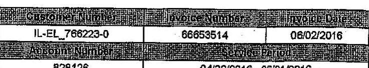

The image is a photo of a document section with the following text:

- **Customer Name**: IL-EL 766223-0
- **Invoice Number**: 66653514
- **Invoice Date**: 06/02/2016

The text is organized in a tabular format with bold headers above each piece of information.

In case of emergency, contact your local ytility, ComEd 877-428-6331. View and pay levulose online 24 hours a day, 7 days a week at httpecl/energymanager.constellation.com

- Thare you for your prompt payment. A finance charge of $1.00 \%$ per month may be assessed on all past due levulose.

|  |  |  |  |  |  |  |  |  |  |
| :-- | :-- | :-- | :-- | :-- | :-- | :-- | :-- | :-- | :-- |
|  |  |  |  |  |  |  |  |  |  |
| 141721759 | 04/06/2016 - 06/01/2016 | 33 | Not Provided | Not Provided | Actual | 1 | 91.58 | 6\% | N/A |
| 141721769 | 04/29/2016 - 06/01/2016 | 35 | Not Provided | Not Provided | Actual | 1 | 41,008.78 | With Total | $1,244.45$ |

AVERAGE DAILY USE
AVERAGE TEMPERATURE
CURRENT: 1,248.40
LAST YEAR: 1,237.00
LAST YEAR: $88^{\circ} \mathrm{F}$

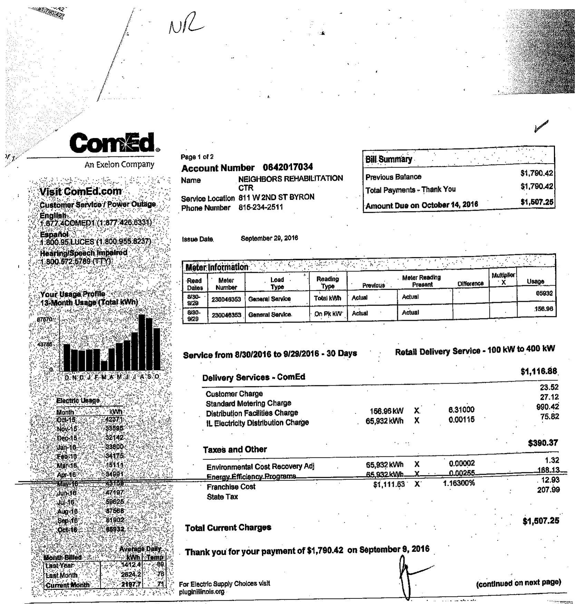

The image is a photo of a utility bill from ComEd, an Exelon Company. It includes various sections detailing account information, billing summary, meter information, service details, and charges.

- **Account Information:**
  - Account Number: 0642017034
  - Name: NEIGHBORS REHABILITATION CTR
  - Service Location: 811 W 2ND ST BYRON
  - Phone Number: 815-234-2511
  - Issue Date: September 29, 2016

- **Bill Summary:**
  - Previous Balance: $1,790.42
  - Total Payments - Thank You: $1,790.42
  - Amount Due on October 14, 2016: $1,507.25

- **Meter Information:**
  - Read Dates: 8/30, 9/29
  - Meter Number: 230045953
  - Load Type: General Service
  - Reading Type: Total kWh, On Pk kW
  - Usage: 65932, 156.96

- **Service Details (8/30/2016 to 9/29/2016 - 30 Days):**
  - Retail Delivery Service - 100 kW to 400 kW: $1,116.88
  - Customer Charge: 23.52
  - Standard Metering Charge: 27.12
  - Distribution Facilities Charge: 156.96 kW X 6.31000 = 990.42
  - IL Electricity Distribution Charge: 65,932 kWh X 0.00115 = 75.82

- **Taxes and Other:**
  - Environmental Cost Recovery Adj: 65,932 kWh X 0.00002 = 1.32
  - Energy Efficiency Programs: 65,932 kWh X 0.00285 = 188.13
  - Franchise Cost: $1,111.63 X 1.163000% = 12.93
  - State Tax: 207.99

- **Total Current Charges:**
  - $1,507.25

- **Usage Profile:**
  - 13-Month Usage (Total kWh) graph with monthly data points labeled from O, N, D, J, F, M, A, M, J, J, A, S, O.
  - Monthly kWh values: Oct-15: 6796, Nov-15: 6707, Dec-15: 6760, Jan-16: 6419, Feb-16: 5461, Mar-16: 5419, Apr-16: 5461, May-16: 5419, Jun-16: 6758, Jul-16: 6758, Aug-16: 6758, Sep-16: 65932

- **Average Daily Usage:**
  - Last Year: 1412.4 kWh
  - Last Month: 2197.2 kWh
  - Current Month: 2197.7 kWh

- **Additional Information:**
  - Thank you for your payment of $1,790.42 on September 9, 2016.
  - For Electric Supply Choices visit pluginillinois.org

The document is marked with handwritten notes "NR" and a checkmark.

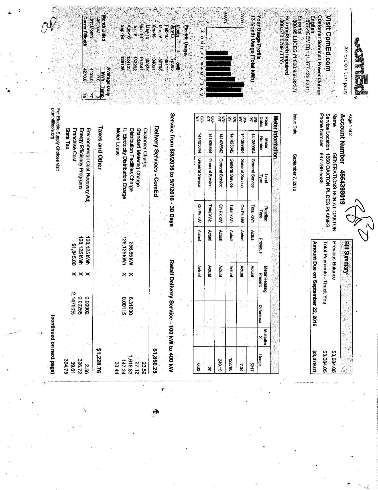

The image is a photo of a utility bill. It includes a bar chart and various tables with detailed billing information.

- **Bar Chart**: 
  - Title: "Electric Usage"
  - X-axis: Months (Sep-15, Oct-15, Nov-15, Dec-15, Jan-16, Feb-16, Mar-16, Apr-16, May-16, Jun-16, Jul-16, Aug-16, Sep-16)
  - Y-axis: Usage in kWh (0 to 70000)
  - Bars represent monthly electric usage in kWh, with the highest usage in Aug-16.

- **Embedded Text**:
  - "Visit ComEd.com"
  - "For Electric Supply Choices, visit PluginIllinois.org"
  - "Account Number: 445358091"
  - "Service from 8/8/2016 to 9/7/2016 - 30 Days"
  - "Retail Delivery Service - 100 kW to 400 kW"
  - "Bill Summary"
  - "Previous Balance: $3,084.05"
  - "Total Payments - Thank You: $3,084.05"
  - "Amount Due on September 27, 2016: $307.94"
  - "Meter Information"
  - "Delivery Services - ComEd"
  - "Taxes and Other"
  - "Environmental Cost Recovery Adj"
  - "Franchise Cost"
  - "Energy Efficiency Programs"
  - "State Tax"
  - "Total Current Charges: $1,580.25"
  - "Total Amount Due: $1,228.76"

- **Spatial Relationships**:
  - The bar chart is located at the top right.
  - The account and billing information are on the right side.
  - The service and meter information are in the center.
  - The charges and taxes are listed on the left side.

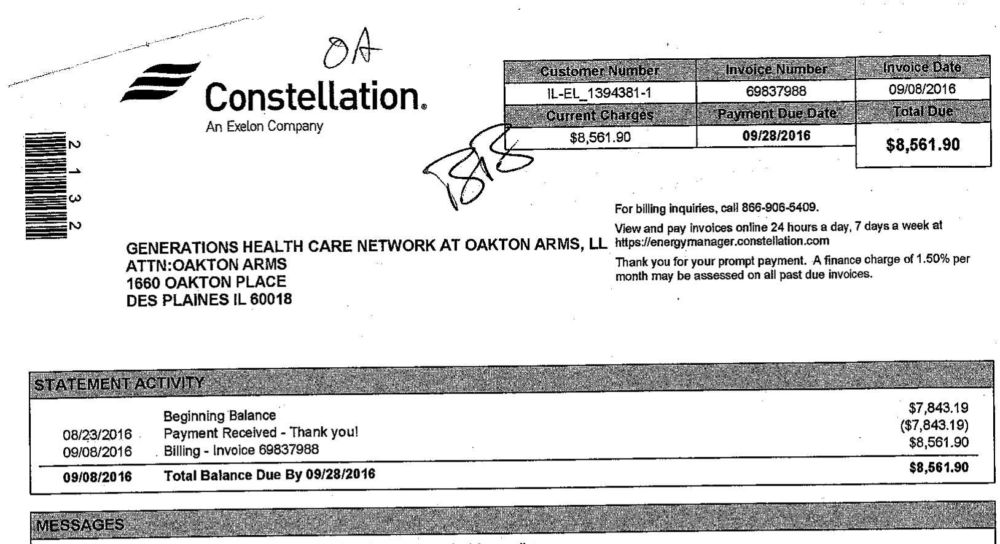

The image is a photo of a billing statement from Constellation, an Exelon Company. It includes the following details:

- **Customer Information:**
  - Customer Number: IL-EL_1394381-1
  - Invoice Number: 69837988
  - Invoice Date: 09/08/2016
  - Payment Due Date: 09/28/2016
  - Total Due: $8,561.90

- **Addressed To:**
  - Generations Health Care Network at Oakton Arms, LL
  - ATTN: Oakton Arms
  - 1660 Oakton Place
  - Des Plaines, IL 60018

- **Statement Activity:**
  - 08/23/2016: Beginning Balance $7,843.19
  - Payment Received - Thank you! ($7,843.19)
  - 09/08/2016: Billing - Invoice 69837988 $8,561.90
  - Total Balance Due By 09/28/2016: $8,561.90

- **Additional Information:**
  - For billing inquiries, call 866-906-5409.
  - View and pay invoices online 24 hours a day, 7 days a week at https://energymanager.constellation.com
  - Thank you for your prompt payment. A finance charge of 1.50% per month may be assessed on all past due invoices.

| SUBMARRY: BILLING - Invoicb 69837988 |  |  |  |  |  |  |  |  |
| :--: | :--: | :--: | :--: | :--: | :--: | :--: | :--: | :--: |
| Service Location | LDC Accra |  | Service Period | Total Volume (kWh) | Total Amount |  |  |  |
| 1865 Oakton PI Des Plaines Oakton Arms | 4554397021 |  | 08/08/2016 - 09/07/2016 | 103,647.96 | $\$ 8,561.90$ |  |  |  |
| Invoice Total |  |  |  | 193,647.96 | $\$ 8,561.90$ |  |  |  |

State Tax
Energy Efficiency Programs
Total Current COMED Charges

103,648.00 KH @ 0.00255
\$264.30
\$2,793.88

Current COMED Information
ComEd Total Amount Due on 9/22/2016
\$2,793.88

Net Amount
\$8,561.90

| METEH DETAIL |  |  |  |  |  |  |  |  |
| :--: | :--: | :--: | :--: | :--: | :--: | :--: | :--: | :--: |
| Utility/Accd Meter | Service Period | Days | Prior Reading | Current Reading | Reading Type | Constant | Usage | Usage Type | Usage Per Day |
| 141420313 | 09/08/2016 - 09/07/2016 | 30 | Not Provided | Not Provided | Actual | 1 | 0.02 | kW | N/A |
| 141420313 | 08/08/2016 - 09/07/2016 | 30 | Not Provided | Not Provided | Actual | 1 | 14.59 | kWh Total | 0.49 |
| 141449806 | 08/08/2016 - 09/07/2016 | 30 | Not Provided | Not Provided | Actual | 1 | 250.68 | kW | N/A |
| 141449806 | 09/08/2016 - 09/07/2016 | 30 | Not Provided | Not Provided | Actual | 1 | 103,617.36 | kWh Total | 3,453.91 |

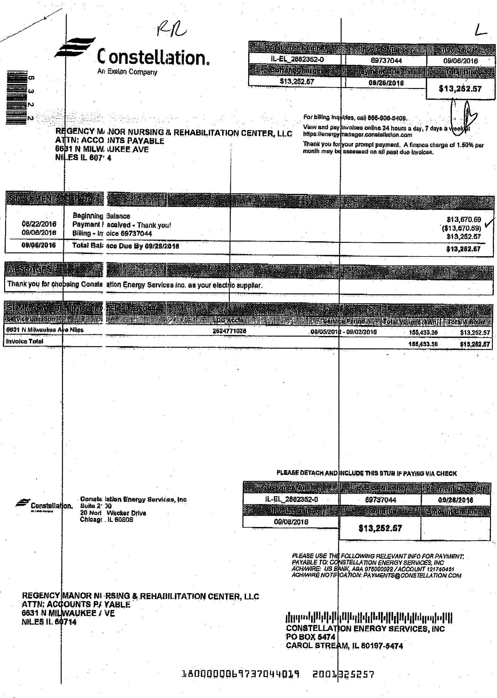

The image is a photo of a billing statement from Constellation, an Exelon Company. It is addressed to Regency Manor Nursing & Rehabilitation Center, LLC at 6631 N Milwaukee Ave, Niles, IL 60714. The statement includes the following details:

- Account Number: IL-EL, 2802352-0
- Invoice Number: 69737044
- Date: 09/06/2016
- Total Amount Due: $13,252.57
- Beginning Balance on 08/22/2016: $13,670.59
- Payment Received on 08/22/2016: ($13,670.59)
- Billing - Invoice 69737044 on 09/06/2016: $13,252.57
- Total Balance Due by 09/28/2016: $13,252.57

Additional information includes a note about a finance charge of 1.50% per month on past due invoices and contact details for billing inquiries. The payment stub at the bottom includes the same account and invoice numbers, with instructions for payment to Constellation Energy Services, Inc.

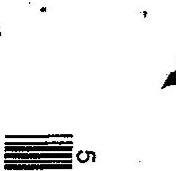

The image is a photo or illustration. It contains a barcode with the number "5" next to it. The rest of the image appears to be mostly blank or contains minimal visible content.

Constellation.
An Exelon Company

WILSON CARE, L.L.C.
ATTN: ACCOUNTS PAYABLE 4544 N HAZEL ST CHICAGO IL 60640

| Customer Number |  |  |  |  |  |  |  |  |  |  |  |  |  |  |  |  |  |  |  |  |  |  |  |  |  |  |  |  |  |  |  |  |  |  |  |  |  |  |  |  |  |  |  |  |  |  |  |  |  |  |  |  |  |  |  |  |  |  |  |  |  |  |  |  |  |  |  |  |  |  |  |  |  |  |  |  |  |  |  |  |  |  |  |  |  |  |  |  |  |  |  |  |  |  |  |  |  |  |  | 

## 40000000000000000000000000000000000000000000000000000000000000000000000000000000000000000000000000000000000000000000000000000000000000000000000000000000000000000000000000000000000000000000000000000000000

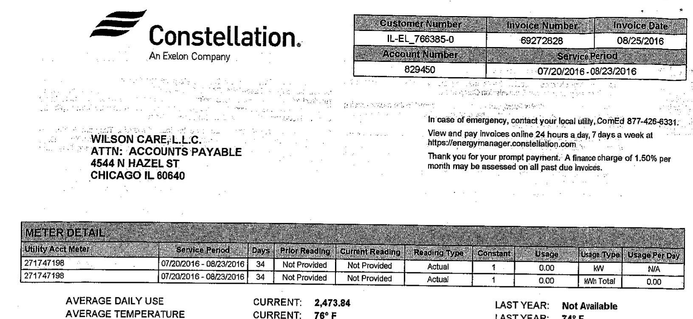

The image is a photo of a utility bill from Constellation, an Exelon Company. It includes the following details:

- **Customer Information:**
  - Customer Number: IL-EL_766385-0
  - Invoice Number: 69272828
  - Invoice Date: 08/25/2016
  - Account Number: 829450
  - Service Period: 07/20/2016 - 08/23/2016

- **Recipient Information:**
  - WILSON CARE, L.L.C.
  - ATTN: ACCOUNTS PAYABLE
  - 4544 N HAZEL ST
  - CHICAGO IL 60640

- **Emergency Contact:**
  - ComEd 877-426-6331

- **Online Payment:**
  - https://energymanager.constellation.com

- **Payment Notice:**
  - A finance charge of 1.50% per month may be assessed on all past due invoices.

- **Meter Detail:**
  - Utility Acct Meter: 271747198
  - Service Period: 07/20/2016 - 08/23/2016
  - Days: 34
  - Prior Reading: Not Provided
  - Current Reading: Not Provided
  - Reading Type: Actual
  - Constant: 1
  - Usage: 0.00 kW
  - Usage Type: kWh Total
  - Usage Per Day: 0.00

- **Average Daily Use:**
  - Current: 2,473.84

- **Average Temperature:**
  - Current: 76°F
  - Last Year: 74.5°F

- **Last Year Usage:**
  - Not Available

## ContEd

An Exelon Company

## Visit ComEd.com

Customer Service / Power Outage English
1.877.4COMED1 (1.877.426.6331)

## Español

1.800.95.LUCES (1.800.955.8237)

Hearing/Speech Impaired
1.800.572.5789 (TTY)

Your Usage Profile
13-Month Usage (Total kWh)
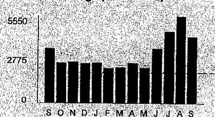

The image is a bar chart showing a **yearly usage breakdown (monthly-based)** for electric usage in kilowatt-hours (kWh). 

- **X-axis**: Represents months, labeled as S, O, N, D, J, F, M, A, M, J, J, A, S, corresponding to September through September.
- **Y-axis**: Represents kWh usage, with markings at 0, 2775, and 5550.
- **Data Points**: 
  - September: Approximately 3496 kWh
  - October: Approximately 2586 kWh
  - November: Approximately 2642 kWh
  - December: Approximately 2538 kWh
  - January: Approximately 2583 kWh
  - February: Approximately 2254 kWh
  - March: Approximately 2258 kWh
  - April: Approximately 2563 kWh
  - May: Approximately 2289 kWh
  - June: Approximately 3497 kWh
  - July: Approximately 4590 kWh
  - August: Approximately 5548 kWh
  - September: Approximately 4262 kWh

The bars are uniformly styled in black, with no additional highlights or emphasis.

## Electric Usage

| Month | kWh |
| :-- | :--: |
| Sep-15 | 3496 |
| Oct-15 | 2586 |
| Nov-15 | 2642 |
| Dec-15 | 2538 |
| Jan-16 | 2583 |
| Feb-16 | 2254 |
| Mar-16 | 2258 |
| Apr-16 | 2563 |
| May-16 | 2289 |
| Jun-16 | 3497 |
| Jul-16 | 4590 |
| Aug-16 | 5548 |
| Sep-16 | 4262 |

| Month Billed | Average Daily |  |
| :--: | :--: | :--: |
|  | kWh | Temp. |
| Last Year | 115.5 | 73 |
| Last Month | 173.4 | 77 |
| Current Month | 142.1 | 78 |

Page 1 of 2
Account Number 0776188017
Name S 1 R MANAGEMENT
Service Location 6834 N LINCOLN AVE LINCOLNWOOD
Phone Number 847-675-7979

## Bill Summary

Previous Balance
Total Payments - Thank You
$520.23
Amount Due on September 26, 2016
$423.99

Issue Date September 9, 2016
$\frac{0}{y}$

| Meter Information |  |  |  |  |  |  |  |  |
| :--: | :--: | :--: | :--: | :--: | :--: | :--: | :--: | :--: |
| Read   Dates | Meter   Number | Load   Type | Reading   Type | Previous | Meter Reading Present | Difference | Multiplier | Usage |
| 09-   9/9 | 141605797 | General Service | Total kWh | 85137 Actual | 88399 Actual | 4262 | 1 | 4262 |
| 89-   9/8 | 141805797 | General Service | kW | 626.69 Actual | 640.55 Actual | 13.86 | 1 | 13.86 |

Service from 8/9/2016 to 9/8/2016 - 30 Days
Retail Delivery Service - 0 to 100 kW
Electricity Supply Services - Direct Energy Business
$238.33$
FIXED PRICE - 4,262 KWH TOTAL (B) 4,262 kWh X 0.05592
238.33

Direct Energy Business 1-888-925-9115 www.directenergy.com
Please refer to your supplier contract for details.

## Delivery Services - ComEd

17.29
Standard Metering Charge
Distribution Facilities Charge
13.86 kW
X
4,262 kWh
$6.20000$
4,262 kWh
$4,262 \mathrm{kWh} \quad X$
6.20000
0.00115
85.93
4.90

Taxes and Other
$65.13$

| Environmental Cost Recovery Adj | $4,262 \mathrm{kWh}$ | $X$ | 0.00002 | 0.09 |
| :-- | --: | --: | --: | --: |
| Energy Efficiency Programs | $4,262 \mathrm{kWh}$ | $X$ | 0.00558 | 28.04 |
| Franchise Cost | $\$ 115.28$ | $X$ | $2.39600 \%$ | 2.76 |
| State Tax |  |  |  | 13.82 |
| For Electric Supply Choices visit |  |  |  |  |
| plugimillinois.org |  |  | (continued on next page) |  |

## ComEd

An Exelon Company

## Visit ComEd.com

Customer Service / Power Outage English
1,877.4COMED1 (1,877.426.6331)

## Expañol

1,800.95.LUCES (1,800.955.8237)

## Hearing/Speech Impaired

1,800.572.5789 (TTY)

Your Usage Profile
13-Month Usage (Total kWh)
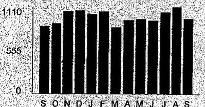

The image is a bar chart.

- **Chart Type**: Bar chart
- **Axes**:
  - **Y-axis**: Labeled with values "0", "555", and "1110".
  - **X-axis**: Labeled with the letters "S", "O", "N", "D", "J", "F", "M", "A", "M", "J", "J", "A", "S", representing months from September to September.
- **Data Representation**: Each bar represents a month's electricity usage in kWh.
- **Yearly Usage Breakdown (Monthly-Based)**: The chart visually represents the electricity usage over a 13-month period.
- **Styling**: The bars are uniformly black, with no additional highlights or emphasis.

## Electric Usage

| Month | kWh |
| :-- | :--: |
| Sep-16 | 858 |
| Oct-15 | 897 |
| Nov-15 | 1061 |
| Dec-15 | 1058 |
| Jan-18 | 1018 |
| Feb-16 | 1045 |
| Mar-16 | 845 |
| Apr-16 | 943 |
| May-16 | 956 |
| Jun-18 | 937 |
| Jul-16 | 1039 |
| Aug-16 | 1104 |
| Sep-16 | 958 |

| Average Daily |  |
| :--: | :--: |
| kWh | Tems |
| Last Year | 25.8 |
| Last Month | 34.5 |
| Current Month | 31.5 |

Page 1 of 2
Account Number 0776187010
Name
S I R MANAGEMENT
Service Location 6830 N LINCOLN AVE LINCOLNWOOD
Phone Number 847-675-7979

## Bill Summary

Previous Balance
Total Payments - Thank You
Amount Due on September 26, 2016

## 1164.14

$164.14$
$139.84$

Issue Date

| Meter Information |  |  |  |  |  |  |  |
| :--: | :--: | :--: | :--: | :--: | :--: | :--: | :--: |
| Read   Dates | Meter   Number | Load   Type | Reading   Type | Previous | Meter Reading   Present | Difference | Multiplier   $\times$ | Usage |
| 88-   98 | 141757569 | General Service | Total kWh | 33127 Actual | 34085 Actual | 958 | 1 | 958 |
| 89-   98 | 141757569 | General Service | kW | 166.62 Actual | 172.92 Actual | 6.20 | 1 | 6.30 |

Service from 8/9/2016 to 9/8/2016 - 30 Days
Retail Delivery Service - 0 to 100 kW
Electricity Supply Services - Direct Energy Business
FIXED PRICE - 958 KWH TOTAL (1) \$0 958 kWh X 0.05592
Direct Energy Business
1-885-925-9115 www.directenergy.com
Please refer to your supplier contract for details.

Delivery Services - ComEd
17.29

Standard Metering Charge
12.41

Distribution Facilities Charge
12.41

IL Electricity Distribution Charge
11.10

Taxes and Other
1.10

Environmental Cost Recovery Adj
Energy Efficiency Programs
958 kWh
958 kWh
958 kWh
958 kWh
958 kWh
958 kWh
958 kWh
958 kWh
958 kWh
958 kWh
958 kWh
958 kWh
958 kWh
958 kWh
958 kWh
958 kWh
958 kWh
958 kWh
958 kWh
958 kWh
958 kWh
958 kWh
958 kWh
958 kWh
958 kWh
958 kWh
958 kWh
958 kWh
958 kWh
958 kWh
958 kWh
958 kWh
958 kWh
958 kWh
958 kWh
958 kWh
958 kWh
958 kWh
958 kWh
958 kWh
958 kWh
958 kWh
958 kWh
958 kWh
958 kWh
958 kWh
958 kWh
958 kWh
958 kWh
958 kWh
958 kWh
958 kWh
958 kWh
958 kWh
958 kWh
958 kWh
958 kWh
958 kWh
958 kWh
958 kWh
958 kWh
958 kWh
958 kWh
958 kWh
958 kWh
958 kWh
958 kWh
958 kWh
958 kWh
958 kWh
958 kWh
958 kWh
958 kWh
958 kWh
958 kWh
958 kWh
958 kWh
958 kWh
958 kWh
958 kWh
958 kWh
958 kWh
958 kWh
958 kWh
958 kWh
958 kWh
958 kWh
958 kWh
958 kWh
958 kWh
958 kWh
958 kWh
958 kWh
958 kWh
958 kWh
958 kWh
958 kWh
958 kWh
958 kWh
958 kWh
958 kWh
958 kWh
958 kWh
958 kWh
958 kWh
958 kWh
958 kWh
958 kWh
958 kWh
958 kWh
958 kWh
958 kWh
958 kWh
958 kWh
958 kWh
958 kWh
958 kWh
958 kWh
958 kWh
958 kWh
958 kWh
958 kWh
958 kWh
958 kWh
958 kWh
958 kWh
958 kWh
958 kWh
958 kWh
958 kWh
958 kWh
958 kWh
958 kWh
958 kWh
958 kWh
958 kWh
958 kWh
958 kWh
958 kWh
958 kWh
958 kWh
958 kWh
958 kWh
958 kWh
958 kWh
958 kWh
958 kWh
958 kWh
958 kWh
958 kWh
958 kWh
958 kWh
958 kWh
958 kWh
958 kWh
958 kWh
958 kWh
958 kWh
958 kWh
958 kWh
958 kWh
958 kWh
958 kWh
958 kWh
958 kWh
958 kWh
958 kWh
958 kWh
958 kWh
958 kWh
958 kWh
958 kWh
958 kWh
958 kWh
958 kWh
958 kWh
958 kWh
958 kWh
958 kWh
958 kWh
958 kWh
958 kWh
958 kWh
958 kWh
958 kWh
958 kWh
958 kWh
958 kWh
958 kWh
958 kWh
958 kWh
958 kWh
958 kWh
958 kWh
958 kWh
958 kWh
958 kWh
958 kWh
958 kWh
958 kWh
958 kWh
958 kWh
958 kWh
958 kWh
958 kWh
958 kWh
958 kWh
958 kWh
958 kWh
958 kWh
958 kWh
958 kWh
958 kWh
958 kWh
958 kWh
958 kWh
958 kWh
958 kWh
958 kWh
958 kWh
958 kWh
958 kWh
958 kWh
958 kWh
958 kWh
958 kWh
958 kWh
958 kWh
958 kWh
958 kWh
958 kWh
958 kWh
958 kWh
958 kWh
958 kWh
958 kWh
958 kWh
958 kWh
958 kWh
958 kWh
958 kWh
958 kWh
958 kWh
958 kWh
958 kWh
958 kWh
958 kWh
958 kWh
958 kWh
958 kWh
958 kWh
958 kWh
958 kWh
958 kWh
958 kWh
958 kWh
958 kWh
958 kWh
958 kWh
958 kWh
958 kWh
958 kWh
958 kWh
958 kWh
958 kWh
958 kWh
958 kWh
958 kWh
958 kWh
958 kWh
958 kWh
958 kWh
958 kWh
958 kWh
958 kWh
958 kWh
958 kWh
958 kWh
958 kWh
958 kWh
958 kWh
958 kWh
958 kWh
958 kWh
958 kWh
958 kWh
958 kWh
958 kWh
958 kWh
958 kWh
958 kWh
958 kWh
958 kWh
958 kWh
958 kWh
958 kWh
958 kWh
958 kWh
958 kWh
958 kWh
958 kWh
958 kWh
958 kWh
958 kWh
958 kWh
958 kWh
958 kWh
958 kWh
958 kWh
958 kWh
958 kWh
958 kWh
958 kWh
958 kWh
958 kWh
958 kWh
958 kWh
958 kWh
958 kWh
958 kWh
958 kWh
958 kWh
958 kWh
958 kWh
958 kWh
958 kWh
958 kWh
958 kWh
958 kWh
958 kWh
958 kWh
958 kWh
958 kWh
958 kWh
958 kWh
958 kWh
958 kWh
958 kWh
958 kWh
958 kWh
958 kWh
958 kWh
958 kWh
958 kWh
958 kWh
958 kWh
958 kWh
958 kWh
958 kWh
958 kWh
958 kWh
958 kWh
958 kWh
958 kWh
958 kWh
958 kWh
958 kWh
958 kWh
958 kWh
958 kWh
958 kWh
958 kWh
958 kWh
958 kWh
958 kWh
958 kWh
958 kWh
958 kWh
958 kWh
958 kWh
958 kWh
958 kWh
958 kWh
958 kWh
958 kWh
958 kWh
958 kWh
958 kWh
958 kWh
958 kWh
958 kWh
958 kWh
958 kWh
958 kWh
958 kWh
958 kWh
958 kWh
958 kWh
958 kWh
958 kWh
958 kWh
958 kWh
958 kWh
958 kWh
958 kWh
958 kWh
958 kWh
958 kWh
958 kWh
958 kWh
958 kWh
958 kWh
958 kWh
958 kWh
958 kWh
958 kWh
958 kWh
958 kWh
958 kWh
958 kWh
958 kWh
958 kWh
958 kWh
958 kWh
958 kWh
958 kWh
958 kWh
958 kWh
958 kWh
958 kWh
958 kWh
958 kWh
958 kWh
958 kWh
958 kWh
958 kWh
958 kWh
958 kWh
958 kWh
958 kWh
958 kWh
958 kWh
958 kWh
958 kWh
958 kWh
958 kWh
958 kWh
958 kWh
958 kWh
958 kWh
958 kWh
958 kWh
958 kWh
958 kWh
958 kWh
958 kWh
958 kWh
958 kWh
958 kWh
958 kWh
958 kWh
958 kWh
958 kWh
958 kWh
958 kWh
958 kWh
958 kWh
958 kWh
958 kWh
958 kWh
958 kWh
958 kWh
958 kWh
958 kWh
958 kWh
958 kWh
958 kWh
958 kWh
958 kWh
958 kWh
958 kWh
958 kWh
958 kWh
958 kWh
958 kWh
958 kWh
958 kWh
958 kWh
958 kWh
958 kWh
958 kWh
958 kWh
958 kWh
958 kWh
958 kWh
958 kWh
958 kWh
958 kWh
958 kWh
958 kWh
958 kWh
958 kWh
958 kWh
958 kWh
958 kWh
958 kWh
958 kWh
958 kWh
958 kWh
958 kWh
958 kWh
958 kWh
958 kWh
958 kWh
958 kWh
958 kWh
958 kWh
958 kWh
958 kWh
958 kWh
958 kWh
958 kWh
958 kWh
958 kWh
958 kWh
958 kWh
958 kWh
958 kWh
958 kWh
958 kWh
958 kWh
958 kWh
958 kWh
958 kWh
958 kWh
958 kWh
958 kWh
958 kWh
958 kWh
958 kWh
958 kWh
958 kWh
958 kWh
958 kWh
958 kWh
958 kWh
958 kWh
958 kWh
958 kWh
958 kWh
958 kWh
958 kWh
958 kWh
958 kWh
958 kWh
958 kWh
958 kWh
958 kWh
958 kWh
958 kWh
958 kWh
958 kWh
958 kWh
958 kWh
958 kWh
958 kWh
958 kWh
958 kWh
958 kWh
958 kWh
958 kWh
958 kWh
958 kWh
958 kWh
958 kWh
958 kWh
958 kWh
958 kWh
958 kWh
958 kWh
958 kWh
958 kWh
958 kWh
958 kWh
958 kWh
958 kWh
958 kWh
958 kWh
958 kWh
958 kWh
958 kWh
958 kWh
958 kWh
958 kWh
958 kWh
958 kWh
958 kWh
958 kWh
958 kWh
958 kWh
958 kWh
958 kWh
958 kWh
958 kWh
958 kWh
958 kWh
958 kWh
958 kWh
958 kWh
958 kWh
958 kWh
958 kWh
958 kWh
958 kWh
958 kWh
958 kWh
958 kWh
958 kWh
958 kWh
958 kWh
958 kWh
958 kWh
958 kWh
958 kWh
958 kWh
958 kWh
958 kWh
958 kWh
958 kWh
958 kWh
958 kWh
958 kWh
958 kWh
958 kWh
958 kWh
958 kWh
958 kWh
958 kWh
958 kWh
958 kWh
958 kWh
958 kWh
958 kWh
958 kWh
958 kWh
958 kWh
958 kWh
958 kWh
958 kWh
958 kWh
958 kWh
958 kWh
958 kWh
958 kWh
958 kWh
958 kWh
958 kWh
958 kWh
958 kWh
958 kWh
958 kWh
958 kWh
958 kWh
958 kWh
958 kWh
958 kWh
958 kWh
958 kWh
958 kWh
958 kWh
958 kWh
958 kWh
958 kWh
958 kWh
958 kWh
958 kWh
958 kWh
958 kWh
958 kWh
958 kWh
958 kWh
958 kWh
958 kWh
958 kWh
958 kWh
958 kWh
958 kWh
958 kWh
958 kWh
958 kWh
958 kWh
958 kWh
958 kWh
958 kWh
958 kWh
958 kWh
958 kWh
958 kWh
958 kWh
958 kWh
958 kWh
958 kWh
958 kWh
958 kWh
958 kWh
958 kWh
958 kWh
958 kWh
958 kWh
958 kWh
958 kWh
958 kWh
958 kWh
958 kWh
958 kWh
958 kWh
958 kWh
958 kWh
958 kWh
958 kWh
958 kWh
958 kWh
958 kWh
958 kWh
958 kWh
958 kWh
958 kWh
958 kWh
958 kWh
958 kWh
958 kWh
958 kWh
958 kWh
958 kWh
958 kWh
958 kWh
958 kWh
958 kWh
958 kWh
958 kWh
958 kWh
958 kWh
958 kWh
958 kWh
958 kWh
958 kWh
958 kWh
958 kWh
958 kWh
958 kWh
958 kWh
958 kWh
958 kWh
958 kWh
958 kWh
958 kWh
958 kWh
958 kWh
958 kWh
958 kWh
958 kWh
958 kWh
958 kWh
958 kWh
958 kWh
958 kWh
958 kWh
958 kWh
958 kWh
958 kWh
958 kWh
958 kWh
958 kWh
958 kWh
958 kWh
958 kWh
958 kWh
958 kWh
958 kWh
958 kWh
958 kWh
958 kWh
958 kWh
958 kWh
958 kWh
958 kWh
958 kWh
958 kWh
958 kWh
958 kWh
958 kWh
958 kWh
958 kWh
958 kWh
958 kWh
958 kWh
958 kWh
958 kWh
958 kWh
958 kWh
958 kWh
958 kWh
958 kWh
958 kWh
958 kWh
958 kWh
958 kWh
958 kWh
958 kWh
958 kWh
958 kWh
958 kWh
958 kWh
958 kWh
958 kWh
958 kWh
958 kWh
958 kWh
958 kWh
958 kWh
958 kWh
958 kWh
958 kWh
958 kWh
958 kWh
958 kWh
958 kWh
958 kWh
958 kWh
958 kWh
958 kWh
958 kWh
958 kWh
958 kWh
958 kWh
958 kWh
958 kWh
958 kWh
958 kWh
958 kWh
958 kWh
958 kWh
958 kWh
958 kWh
958 kWh
958 kWh
958 kWh
958 kWh
958 kWh
958 kWh
958 kWh
958 kWh
958 kWh
958 kWh
958 kWh
958 kWh
958 kWh
958 kWh
958 kWh
958 kWh
958 kWh
958 kWh
958 kWh
958 kWh
958 kWh
958 kWh
958 kWh
958 kWh
958 kWh
958 kWh
958 kWh
958 kWh
958 kWh
958 kWh
958 kWh
958 kWh
958 kWh
958 kWh
958 kWh
958 kWh
958 kWh
958 kWh
958 kWh
958 kWh
958 kWh
958 kWh
958 kWh
958 kWh
958 kWh
958 kWh
958 kWh
958 kWh
958 kWh
958 kWh
958 kWh
958 kWh
958 kWh
958 kWh
958 kWh
958 kWh
958 kWh
958 kWh
958 kWh
958 kWh
958 kWh
958 kWh
958 kWh
958 kWh
958 kWh
958 kWh
958 kWh
958 kWh
958 kWh
958 kWh
958 kWh
958 kWh
958 kWh
958 kWh
958 kWh
958 kWh
958 kWh
958 kWh
958 kWh
958 kWh
958 kWh
958 kWh
958 kWh
958 kWh
958 kWh
958 kWh
958 kWh
958 kWh
958 kWh
958 kWh
958 kWh
958 kWh
958 kWh
958 kWh
958 kWh
958 kWh
958 kWh
958 kWh
958 kWh
958 kWh
958 kWh
958 kWh
958 kWh
958 kWh
958 kWh
958 kWh
958 kWh
958 kWh
958 kWh
958 kWh
958 kWh
958 kWh
958 kWh
958 kWh
958 kWh
958 kWh
958 kWh
958 kWh
958 kWh
958 kWh
958 kWh
958 kWh
958 kWh
958 kWh
958 kWh
958 kWh
958 kWh
958 kWh
958 kWh
958 kWh
958 kWh
958 kWh
958 kWh
958 kWh
958 kWh
958 kWh
958 kWh
958 kWh
958 kWh
958 kWh
958 kWh
958 kWh
958 kWh
958 kWh
958 kWh
958 kWh
958 kWh
958 kWh
958 kWh
958 kWh
958 kWh
958 kWh
958 kWh
958 kWh
958 kWh
958 kWh
958 kWh
958 kWh
958 kWh
958 kWh
958 kWh
958 kWh
958 kWh
958 kWh
958 kWh
958 kWh
958 kWh
958 kWh
958 kWh
958 kWh
958 kWh
958 kWh
958 kWh
958 kWh
958 kWh
958 kWh
958 kWh
958 kWh
958 kWh
958 kWh
958 kWh
958 kWh
958 kWh
958 kWh
958 kWh
958 kWh
958 kWh
958 kWh
958 kWh
958 kWh
958 kWh
958 kWh
958 kWh
958 kWh
958 kWh
958 kWh
958 kWh
958 kWh
958 kWh
958 kWh
958 kWh
958 kWh
958 kWh
958 kWh
958 kWh
958 kWh
958 kWh
958 kWh
958 kWh
958 kWh
958 kWh
958 kWh
958 kWh
958 kWh
958 kWh
958 kWh
958 kWh
958 kWh
958 kWh
958 kWh
958 kWh
958 kWh
958 kWh
958 kWh
958 kWh
958 kWh
958 kWh
958 kWh
958 kWh
958 kWh
958 kWh
958 kWh
958 kWh
958 kWh
958 kWh
958 kWh
958 kWh
958 kWh
958 kWh
958 kWh
958 kWh
958 kWh
958 kWh
958 kWh
958 kWh
958 kWh
958 kWh
958 kWh
958 kWh
958 kWh
958 kWh
958 kWh
958 kWh
958 kWh
958 kWh
958 kWh
958 kWh
958 kWh
958 kWh
958 kWh
958 kWh
958 kWh
958 kWh
958 kWh
958 kWh
958 kWh
958 kWh
958 kWh
958 kWh
958 kWh
958 kWh
958 kWh
958 kWh
958 kWh
958 kWh
958 kWh
958 kWh
958 kWh
958 kWh
958 kWh
958 kWh
958 kWh
958 kWh
958 kWh
958 kWh
958 kWh
958 kWh
958 kWh
958 kWh
958 kWh
958 kWh
958 kWh
958 kWh
958 kWh
958 kWh
958 kWh
958 kWh
958 kWh
958 kWh
958 kWh
958 kWh
958 kWh
958 kWh
958 kWh
958 kWh
958 kWh
958 kWh
958 kWh
958 kWh
958 kWh
958 kWh
958 kWh
958 kWh
958 kWh
958 kWh
958 kWh
958 kWh
958 kWh
958 kWh
958 kWh
958 kWh
958 kWh
958 kWh
958 kWh
958 kWh
958 kWh
958 kWh
958 kWh
958 kWh
958 kWh
958 kWh
958 kWh
958 kWh
958 kWh
958 kWh
958 kWh
958 kWh
958 kWh
958 kWh
958 kWh
958 kWh
958 kWh
958 kWh
958 kWh
958 kWh
958 kWh
958 kWh
958 kWh
958 kWh
958 kWh
958 kWh
958 kWh
958 kWh
958 kWh
958 kWh
958 kWh
958 kWh
958 kWh
958 kWh
958 kWh
958 kWh
958 kWh
958 kWh
958 kWh
958 kWh
958 kWh
958 kWh
958 kWh
958 kWh
958 kWh
958 kWh
958 kWh
958 kWh
958 kWh
958 kWh
958 kWh
958 kWh
958 kWh
958 kWh
958 kWh
958 kWh
958 kWh
958 kWh
958 kWh
958 kWh
958 kWh
958 kWh
958 kWh
958 kWh
958 kWh
958 kWh
958 kWh
958 kWh
958 kWh
958 kWh
958 kWh
958 kWh
958 kWh
958 kWh
958 kWh
958 kWh
958 kWh
958 kWh
958 kWh
958 kWh
958 kWh
958 kWh
958 kWh
958 kWh
958 kWh
958 kWh
958 kWh
958 kWh
958 kWh
958 kWh
958 kWh
958 kWh
958 kWh
958 kWh
958 kWh
958 kWh
958 kWh
958 kWh
958 kWh
958 kWh
958 kWh
958 kWh
958 kWh
958 kWh
958 kWh
958 kWh
958 kWh
958 kWh
958 kWh
958 kWh
958 kWh
958 kWh
958 kWh
958 kWh
958 kWh
958 kWh
958 kWh
958 kWh
958 kWh
958 kWh
958 kWh
958 kWh
958 kWh
958 kWh
958 kWh
958 kWh
958 kWh
958 kWh
958 kWh
958 kWh
958 kWh
958 kWh
958 kWh
958 kWh
958 kWh
958 kWh
958 kWh
958 kWh
958 kWh
958 kWh
958 kWh
958 kWh
958 kWh
958 kWh
958 kWh
958 kWh
958 kWh
958 kWh
958 kWh
958 kWh
958 kWh
958 kWh
958 kWh
958 kWh
958 kWh
958 kWh
958 kWh
958 kWh
958 kWh
958 kWh
958 kWh
958 kWh
958 kWh
958 kWh
958 kWh
958 kWh
958 kWh
958 kWh
958 kWh
958 kWh
958 kWh
958 kWh
958 kWh
958 kWh
958 kWh
958 kWh
958 kWh
958 kWh
958 kWh
958 kWh
958 kWh
958 kWh
958 kWh
958 kWh
958 kWh
958 kWh
958 kWh
958 kWh
958 kWh
958 kWh
958 kWh
958 kWh
958 kWh
958 kWh
958 kWh
958 kWh
958 kWh
958 kWh
958 kWh
958 kWh
958 kWh
958 kWh
958 kWh
958 kWh
958 kWh
958 kWh
958 kWh
958 kWh
958 kWh
958 kWh
958 kWh
958 kWh
958 kWh
958 kWh
958 kWh
958 kWh
958 kWh
958 kWh
958 kWh
958 kWh
958 kWh
958 kWh
958 kWh
958 kWh
958 kWh
958 kWh
958 kWh
958 kWh
958 kWh
958 kWh
958 kWh
958 kWh
958 kWh
958 kWh
958 kWh
958 kWh
958 kWh
958 kWh
958 kWh
958 kWh
958 kWh
958 kWh
958 kWh
958 kWh
958 kWh
958 kWh
958 kWh
958 kWh
958 kWh
958 kWh
958 kWh
958 kWh
958 kWh
958 kWh
958 kWh
958 kWh
958 kWh
958 kWh
958 kWh
958 kWh
958 kWh
958 kWh
958 kWh
958 kWh
958 kWh
958 kWh
958 kWh
958 kWh
958 kWh
958 kWh
958 kWh
958 kWh
958 kWh
958 kWh
958 kWh
958 kWh
958 kWh
958 kWh
958 kWh
958 kWh
958 kWh
958 kWh
958 kWh
958 kWh
958 kWh
958 kWh
958 kWh
958 kWh
958 kWh
958 kWh
958 kWh
958 kWh
958 kWh
958 kWh
958 kWh
958 kWh
958 kWh
958 kWh
958 kWh
958 kWh
958 kWh
958 kWh
958 kWh
958 kWh
958 kWh
958 kWh
958 kWh
958 kWh
958 kWh
958 kWh
958 kWh
958 kWh
958 kWh
958 kWh
958 kWh
958 kWh
958 kWh
958 kWh
958 kWh
958 kWh
958 kWh
958 kWh
958 kWh
958 kWh
958 kWh
958 kWh
958 kWh
958 kWh
958 kWh
958 kWh
958 kWh
958 kWh
958 kWh
958 kWh
958 kWh
958 kWh
958 kWh
958 kWh
958 kWh
958 kWh
958 kWh
958 kWh
958 kWh
958 kWh
958 kWh
958 kWh
958 kWh
958 kWh
958 kWh
958 kWh
958 kWh
958 kWh
958 kWh
958 kWh
958 kWh
958 kWh
958 kWh
958 kWh
958 kWh
958 kWh
958 kWh
958 kWh
958 kWh
958 kWh
958 kWh
958 kWh
958 kWh
958 kWh
958 kWh
958 kWh
958 kWh
958 kWh
958 kWh
958 kWh
958 kWh
958 kWh
958 kWh
958 kWh
958 kWh
958 kWh
958 kWh
958 kWh
958 kWh
958 kWh
958 kWh
958 kWh
958 kWh
958 kWh
958 kWh
958 kWh
958 kWh
958 kWh
958 kWh
958 kWh
958 kWh
958 kWh
958 kWh
958 kWh
958 kWh
958 kWh
958 kWh
958 kWh
958 kWh
958 kWh
958 kWh
958 kWh
958 kWh
958 kWh
958 kWh
958 kWh
958 kWh
958 kWh
958 kWh
958 kWh
958 kWh
958 kWh
958 kWh
958 kWh
958 kWh
958 kWh
958 kWh
958 kWh
958 kWh
958 kWh
958 kWh
958 kWh
958 kWh
958 kWh
958 kWh
958 kWh
958 kWh
958 kWh
958 kWh
958 kWh
958 kWh
958 kWh
958 kWh
958 kWh
958 kWh
958 kWh
958 kWh
958 kWh
958 kWh
958 kWh
958 kWh
958 kWh
958 kWh
958 kWh
958 kWh
958 kWh
958 kWh
958 kWh
958 kWh
958 kWh
958 kWh
958 kWh
958 kWh
958 kWh
958 kWh
958 kWh
958 kWh
958 kWh
958 kWh
958 kWh
958 kWh
958 kWh
958 kWh
958 kWh
958 kWh
958 kWh
958 kWh
958 kWh
958 kWh
958 kWh
958 kWh
958 kWh
958 kWh
958 kWh
958 kWh
958 kWh
958 kWh
958 kWh
958 kWh
958 kWh
958 kWh
958 kWh
958 kWh
958 kWh
958 kWh
958 kWh
958 kWh
958 kWh
958 kWh
958 kWh
958 kWh
958 kWh
958 kWh
958 kWh
958 kWh
958 kWh
958 kWh
958 kWh
958 kWh
958 kWh
958 kWh
958 kWh
958 kWh
958 kWh
958 kWh
958 kWh
958 kWh
958 kWh
958 kWh
958 kWh
958 kWh
958 kWh
958 kWh
958 kWh
958 kWh
958 kWh
958 kWh
958 kWh
958 kWh
958 kWh
958 kWh
958 kWh
958 kWh
958 kWh
958 kWh
958 kWh
958 kWh
958 kWh
958 kWh
958 kWh
958 kWh
958 kWh
958 kWh
958 kWh
958 kWh
958 kWh
958 kWh
958 kWh
958 kWh
958 kWh
958 kWh
958 kWh
958 kWh
958 kWh
958 kWh
958 kWh
958 kWh
958 kWh
958 kWh
958 kWh
958 kWh
958 kWh
958 kWh
958 kWh
958 kWh
958 kWh
958 kWh
958 kWh
958 kWh
958 kWh
958 kWh
958 kWh
958 kWh
958 kWh
958 kWh
958 kWh
958 kWh
958 kWh
958 kWh
958 kWh
958 kWh
958 kWh
958 kWh
958 kWh
958 kWh
958 kWh
958 kWh
958 kWh
958 kWh
958 kWh
958 kWh
958 kWh
958 kWh
958 kWh
958 kWh
958 kWh
958 kWh
958 kWh
958 kWh
958 kWh
958 kWh
958 kWh
958 kWh
958 kWh
958 kWh
958 kWh
958 kWh
958 kWh
958 kWh
958 kWh
958 kWh
958 kWh
958 kWh
958 kWh
958 kWh
958 kWh
958 kWh
958 kWh
958 kWh
958 kWh
958 kWh
958 kWh
958 kWh
958 kWh
958 kWh
958 kWh
958 kWh
958 kWh
958 kWh
958 kWh
958 kWh
958 kWh
958 kWh
958 kWh
958 kWh
958 kWh
958 kWh
958 kWh
958 kWh
958 kWh
958 kWh
958 kWh
958 kWh
958 kWh
958 kWh
958 kWh
958 kWh
958 kWh
958 kWh
958 kWh
958 kWh
958 kWh
958 kWh
958 kWh
958 kWh
958 kWh
958 kWh
958 kWh
958 kWh
958 kWh
958 kWh
958 kWh
958 kWh
958 kWh
958 kWh
958 kWh
958 kWh
958 kWh
958 kWh
958 kWh
958 kWh
958 kWh
958 kWh
958 kWh
958 kWh
958 kWh
958 kWh
958 kWh
958 kWh
958 kWh
958 kWh
958 kWh
958 kWh
958 kWh
958 kWh
958 kWh
958 kWh
958 kWh
958 kWh
958 kWh
958 kWh
958 kWh
958 kWh
958 kWh
958 kWh
958 kWh
958 kWh
958 kWh
958 kWh
958 kWh
958 kWh
958 kWh
958 kWh
958 kWh
958 kWh
958 kWh
958 kWh
958 kWh
958 kWh
958 kWh
958 kWh
958 kWh
958 kWh
958 kWh
958 kWh
958 kWh
958 kWh
958 kWh
958 kWh
958 kWh
958 kWh
958 kWh
958 kWh
958 kWh
958 kWh
958 kWh
958 kWh
958 kWh
958 kWh
958 kWh
958 kWh
958 kWh
958 kWh
958 kWh
958 kWh
958 kWh
958 kWh
958 kWh
958 kWh
958 kWh
958 kWh
958 kWh
958 kWh
958 kWh
958 kWh
958 kWh
958 kWh
958 kWh
958 kWh
958 kWh
958 kWh
958 kWh
958 kWh
958 kWh
958 kWh
958 kWh
958 kWh
958 kWh
958 kWh
958 kWh
958 kWh
958 kWh
958 kWh
958 kWh
958 kWh
958 kWh
958 kWh
958 kWh
958 kWh
958 kWh
958 kWh
958 kWh
958 kWh
958 kWh
958 kWh
958 kWh
958 kWh
958 kWh
958 kWh
958 kWh
958 kWh
958 kWh
958 kWh
958 kWh
958 kWh
958 kWh
958 kWh
958 kWh
958 kWh
958 kWh
958 kWh
958 kWh
958 kWh
958 kWh
958 kWh
958 kWh
958 kWh
958 kWh
958 kWh
958 kWh
958 kWh
958 kWh
958 kWh
958 kWh
958 kWh
958 kWh
958 kWh
958 kWh
958 kWh
958 kWh
958 kWh
958 kWh
958 kWh
958 kWh
958 kWh
958 kWh
958 kWh
958 kWh
958 kWh
958 kWh
958 kWh
958 kWh
958 kWh
958 kWh
958 kWh
958 kWh
958 kWh
958 kWh
958 kWh
958 kWh
958 kWh
958 kWh
958 kWh
958 kWh
958 kWh
958 kWh
958 kWh
958 kWh
958 kWh
958 kWh
958 kWh
958 kWh
958 kWh
958 kWh
958 kWh
958 kWh
958 kWh
958 kWh
958 kWh
958 kWh
958 kWh
958 kWh
958 kWh
958 kWh
958 kWh
958 kWh
958 kWh
958 kWh
958 kWh
958 kWh
958 kWh
958 kWh
958 kWh
958 kWh
958 kWh
958 kWh
958 kWh
958 kWh
958 kWh
958 kWh
958 kWh
958 kWh
958 kWh
958 kWh
958 kWh
958 kWh
958 kWh
958 kWh
958 kWh
958 kWh
958 kWh
958 kWh
958 kWh
958 kWh

## Contiz

An Exelon Company

## Visit ComEd.com

Customer Service / Power Outage English
1,877.4COMED1 (1,877,426,6331)

## Español

1,800,95.LUCES (1,800,955,8237)

## Hearing/Speech Impaired

1,800,572,5789 (TTY)

Your Usage Profile
13-Month Usage (Total kWh)
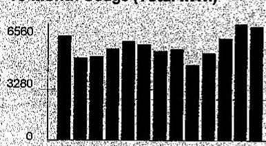

The image is a bar chart. 

- **Chart Type**: Bar chart
- **Axes**:
  - Y-axis: No title visible, but marked with values "0", "3280", and "6560".
  - X-axis: Not visible in the image.
- **Data Representation**: The bars represent monthly kWh usage.
- **Styling**: The bars are uniformly black, with no additional highlights or emphasis.
- **Context**: This chart is part of a yearly usage breakdown (monthly-based), showing electricity usage over a 13-month period.

S O N D T P M A M J J A 6

## Electric Usage

| Month | kWh |
| :-- | :-- |
| Sep-15 | 5899 |
| Oct-15 | 4682 |
| Nov-15 | 4767 |
| Dec-15 | 5184 |
| Jan-16 | 5601 |
| Feb-16 | 5428 |
| Mar-16 | 5050 |
| Apr-16 | 5167 |
| May-16 | 4290 |
| Jun-16 | 4929 |
| Jul-16 | 5771 |
| Aug-16 | 6569 |
| Sep-16 | 6429 |

|  | Average Daily |  |
| :--: | :--: | :--: |
| Month Billed | kWh | Temp |
| Last Year | 196.5 | 73 |
| Last Month | 205.0 | 77 |
| Current Month | 214.3 | 78 |

Page 1 of 2
Account Number 0776193018
Name
S IR MANAGEMENT
Service Location 6840 N LINCOLN AVE LINCOLNWOOD
Phone Number 847-675-7979

| Bill Summary |  |  |
| :--: | :--: | :--: |
| Previous Balance |  | \$646.99 |
| Total Payments - Thank You |  | \$646.99 |
| Amount Due on September 26, 2016 |  | \$643.18 |

Issue Date September 9, 2016

| Meter Information |  |  |  |  |  |  |  |  |
| :--: | :--: | :--: | :--: | :--: | :--: | :--: | :--: | :--: |
| Read   Dates | Meter   Number | Lead   Type | Reading   Type | Previous | Meter Reading Present | Difference | Multiplier   $\times$ | Usage |
| 5/9-   5/9 | 141805864 | General Service | Total kWh | 76222 Actual | 82851 Actual | 6429 | 1 | 6429 |
| 8/9-   5/9 | 141805864 | General Service | kW | 349.99 Actual | 374.16 Actual | 24.17 | 1 | 24.17 |

Service from 8/8/2016 to 9/8/2016 - 30 Days
Retail Delivery Service - 0 to 100 kW

Electricity Supply Services - Direct Energy Business
\$359.51
FIXED PRICE - 6,429 KWH TOTAL (a) 6,429 kWh X 0.05592
Direct Energy Business 1-888-925-9115 www.directenergy.com
Please refer to your supplier contract for details.

Delivery Services - ComEd
\$186.94
Customer Charge
Standard Metering Charge
Distribution Facilities Charge
IL Electricity Distribution Charge

17.29

12.41

149.85

7.39

149.73

12.30

142.30

149.85

7.39

12.73

120.73

For Electric Supply Choices visit
plugintillinois.org
(continued on next page)

## ComEd

An Exelon Company

## Visit ComEd.com

Customer Service / Power Outage English
1,877.4COMED1 (1,877,425,6331)

## Expafol

1,800.95 LUCES (1,800,955,8237)

## Hearing/Speech Impaired

1,800.572,5789 (TTY)

Your Usage Profile
13-Month Usage (Total kWh)
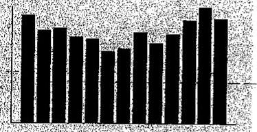

The image is a bar chart.

- **Chart Type**: Bar chart
- **Yearly Usage Breakdown (Monthly-Based)**: The chart shows monthly electricity usage in kWh.
- **Data Points**: The bars represent the following approximate values:
  - Sep-15: 6180 kWh
  - Oct-15: 7008 kWh
  - Nov-15: 7168 kWh
  - Dec-15: 6516 kWh
  - Jan-15: 6348 kWh
  - Feb-15: 5437 kWh
  - Mar-15: 5518 kWh
  - Apr-15: 6821 kWh
  - May-15: 6032 kWh
  - Jun-15: 6721 kWh
  - Jul-15: 7808 kWh
  - Aug-15: 6779 kWh
  - Sep-15: 7923 kWh
- **Styling**: The bars are uniformly black, with no additional colors or highlights.

Electric Usage

| Month | kWh |
| :-- | :-- |
| Sep-15 | 6180 |
| Oct-15 | 7008 |
| Nov-15 | 7168 |
| Dec-15 | 6516 |
| Jan-15 | 6348 |
| Feb-15 | 5437 |
| Mar-15 | 5518 |
| Apr-15 | 6821 |
| May-15 | 6032 |
| Jun-15 | 6721 |
| Ju-15 | 7808 |
| Aug-15 | 6779 |
| Sep-15 | 7923 |

| Year | Average Daily |
| :--: | :--: |
| Month-Billed | kWh |
| Last Year | 372.0 |
| Last Month | 274.3 |
| Current Month | 264.1 |

Page 1 of 2
Account Number 0776211002
Name
4100 W PRATT AVE
LINCOLNWOOD
Phone Number 847-574-5200

|  |  |  |  |  |  |  |  |  |
| :--: | :--: | :--: | :--: | :--: | :--: | :--: | :--: | :--: |
|  |  |  |  |  |  |  | Bill Summary |  |
|  |  |  |  |  |  |  | Previous Balance |  |
|  |  |  |  |  |  |  | Total Payments |  |
|  |  |  |  |  |  |  | Amount Due on September 26, 2016 |  |
|  |  |  |  |  |  |  |  |  |
| Issue Date | September 9, 2016 |  |  |  |  |  | Current $773^{32}$ |  |
|  |  |  |  |  |  |  |  |  |
|  |  |  |  |  |  |  |  |  |
|  |  |  |  |  |  |  |  |  |
|  |  |  |  |  |  |  |  |  |

|  |  |  |  |  |  |  |  |
| :--: | :--: | :--: | :--: | :--: | :--: | :--: | :--: |
| Meter Information |  |  |  |  |  |  |  |
| Read   Dates | Meter   Number | Load   Type | Reading   Type | Previous | Meter Reading Present | Difference | Multiplier   $\times$ | Usage |
| 5/8-   9/8 | 141603676 | General Service | Total kWh | 14440 Actual | 22363 Actual | 7603 | 1 | 7923 |
| 5/8-   9/8 | 141603676 | General Service | kW | 729.57 Actual | 757.58 Actual | 28.01 | 1 | 28.01 |

Service from 8/9/2016 to 9/8/2016 - 30 Days
Retail Delivery Service - 0 to 100 kW
Electricity Supply Services - Direct Energy Business
$\$ 443.05$
FXED PRICE - 7,923 KWH TOTAL @ 7,923 kWh X 0.05592
443.05

Direct Energy Business 1-888-925-9115 www.directenergy.com
Please refer to your supplier contract for details.

Delivery Services - ComEd
\$212.47
Customer Charge
Standard Metering Charge
Distribution Facilities Charge
IL Electricity Distribution Charge

17.29
12.41
173.66
9.11

Taxes and Other
\$118.03

| Environmental Cost Recovery Adj | 7,923 kWh | $X$ | 0.00002 | 0.16 |
| :-- | --: | :-- | :-- | :-- |
| Energy Efficiency Programs | 7,923 kWh | $X$ | 0.00658 | 52.13 |
| Franchise Cost | $\$ 207.22$ | $X$ | $2.39600 \%$ | 4.95 |
| State Tax |  |  |  | 25.49 |

For Electric Supply Choices visit
plugin@ncis.org
(continued on next page)

