# 

The image is a logo with the text "AMBIT ENERGY®". The text is in uppercase, bold, and uses a sans-serif font. The registered trademark symbol "®" is placed at the top right corner of the word "ENERGY". The logo is centered on a white background. 

This Commercial Energy Supply Agreement, together with Exhibits "A", "B" and "C", any applicable addenda and/or schedules attached hereto or incorporated by reference (collectively, the "Agreement") is entered into and made by and between Ambit Northeast, LLC, ( "Ambit Energy") and the buyer of retail electricity (identified herein as "Buyer"). Ambit Energy and Buyer may hereinafter be referred to individually as "Party" or collectively as "Parties". Specific regulatory requirements and terms, if applicable and capitalized herein, will have the meaning ascribed to them in this Agreement, or in any addendum or exhibit attached or referenced in this Agreement.

The Parties hereby agree as follows:

1. Purchase, Sale and Delivery of Electricity. Subject to the terms and conditions set forth in this Agreement, Ambit Energy, a licensed retail electricity supplier ("RES"), shall sell and Buyer shall purchase and receive electricity for Buyer's account(s) at the price(s) per kilowatt hour ( kWh ) specified on Exhibit "A" ("Contract Price") and at the meters on Buyer's premises according to the "Account(s)" specified in Exhibit "A" as the "Buyer's Delivery Point(s)"). The electricity will be delivered by Ambit Energy's supplier to the specific zone on the transmission system ("Point of Delivery") as identified by the electric distribution company ("EDC" as further defined in Section 28 "Standard Definitions") operated by the independent system operator ("ISO" as further defined in Section 28). Delivery of the electricity from the Point of Delivery within the zone for the appropriate Account(s) corresponding to each Buyer Delivery Point will be made by the EDC. Exhibit A will also specify those services, including without limitation scheduling coordination, transmission, and ancillary services, if any, provided by Ambit Energy in connection with the supply of electricity to Buyer.
2. Metering. All electricity delivered hereunder ("Usage") shall be and can only be, measured by the EDC at the meters located at each Buyer Delivery Point. Actual Usage shall be the primary method of calculating the monthly charges for Buyer. However, the parties agree Ambit Energy may use estimated Usage if measurements of actual Usage are not received timely from the EDC, in which case Ambit Energy will make appropriate billing adjustments upon receipt of actual Usage. Ambit Energy may adjust invoices for any Usage measurement errors in accordance with EDC rules. Ambit Energy cannot guarantee the switch of Buyer's account(s) to Ambit Energy will occur by a specific date and Ambit Energy shall not be liable for any delays in this process caused by the ISO, EDC or the Buyer. The Service Start Date shall be the date upon which a particular Account is switched to Ambit Energy. The Service Start Date is typically the first scheduled read date that occurs on or after the Start Date specified in Exhibit "A," unless an alternate date has been requested by Buyer and agreed to by Ambit Energy in writing. If the EDC requires Buyer to install additional metering and/or related equipment at any service address, Buyer will be solely responsible for all charges and arrangements required by the EDC.
3. Term. This Agreement shall be effective as of signing of this Agreement by Buyer ("Effective Date") and shall continue in effect thereafter as to each Buyer Delivery Point for the total number of months (the "Term") specified in Exhibit "A", unless sooner terminated as otherwise provided in this Agreement. Ambit Energy is obligated to begin flowing power on the first scheduled meter read date on or after the Start Date in Exhibit "A".
4. Pricing. Buyer will pay the Contract Price times the Usage. The Contract Price per kWh includes electricity commodity charges and the costs identified on Section 1 of Exhibit "B". The Contract Price does not include the costs and all applicable taxes described in Section 2 of Exhibit "B", which will be passed-through to Buyer without markup. Buyer shall pay Ambit Energy the Contract Price plus the costs and taxes reflected on Section 2, as reflected on the monthly invoice. If Buyer's Usage, as specified in Exhibit "A", or Peak Load Contribution ("PLC") values as determined by the EDC, materially changes as compared to past practice, or the Profile assigned by the EDC to Buyer's Account(s) changes, Ambit Energy may, in addition to other remedies provided for herein, adjust the Contract Price to account for the adverse change in Usage or PLC value, but only to the extent the adjustments are equal to the actual incremental costs resulting from the adverse change in Usage. When Buyer's Usage covers a time period outside of the Term, Buyer will pay Ambit Energy in accordance with the Hold-over Rate terms of Paragraph 6, below.
5. Billing and Payment. Buyer may receive a single monthly "consolidated bill" for both commodity and delivery costs from either the EDC or Ambit, or each of the EDC and Ambit may invoice the Buyer separately "dual billing" for the prior month's electricity usage. Where consolidated billing is applicable, the following shall apply: Buyers EDC will continue to issue Buyer a monthly bill and the bill will include

Ambit Energy supply charges, as well as applicable EDC charges, surcharges, state and local taxes and any other charges incurred in accordance with this Agreement. Bills will continue to be based on actual or estimated meter readings. Buyer will make payment directly to the EDC in accordance with the payment terms stated in the EDC's tariffs, unless otherwise provided herein. Buyer payments remitted in response to a consolidated bill shall be applied in accordance with procedures and regulatory requirements adopted by the ICC or the applicable regulating body or be subject to a late payment charge calculated in accordance with the ICC's rules. In the event of Buyers failure to remit payment when due, Ambit will have the right to terminate commodity service and to seek suspension of distribution. Supplying Buyer under this Agreement may be conditioned on EDC accepting Ambit's enrollment of Buyer's account for consolidated billing. If Buyer is not eligible for consolidated billing, Buyer must remedy that restriction with EDC before Ambit can serve Buyer. If EDC should cease providing consolidated billing for Buyer's Account(s) and/or commence billing Ambit for any charges related to Buyer, the dual billing provisions provided herein shall apply. Where dual billing is applicable, the following shall apply: Ambit will deliver a separate invoice from Buyers EDC, and Buyer shall be solely responsible for payment of such invoice to the EDC. Buyer will receive a monthly commodity, and related charges, bill from Ambit for the prior month's electricity Usage. All bills are due and payable 16 days after issuance ("Due Date"), which is defined as the statement date on your invoice. Bills shall be deemed past due and delinquent if payment is not received by Ambit Energy at the close of business on the Due Date. If the Due Date is a Saturday, Sunday or legal holiday, then the bill will be due on the next day that is not a Saturday, Sunday or legal holiday Late payments, delinquent or past due balances may result in a Late Payment Charge equal to 5\% of the invoiced past- due amount to offset the costs incurred by Ambit Energy associated with collecting and processing the late payment. Ambit Energy charges $\$ 25.00$ for each returned check or each ACH .
6. Hold Over Rate. For periods in which Usage occurs outside of the Term, Ambit Energy may charge Buyer the incremental cost or value of providing electricity to Buyer, based on the difference between the Contract Price and the Market Rate (as defined in Section 13) plus Ambit Energy's retail margin, the costs identified on Section 1 of Exhibit "B" and any other similar charges incurred by Ambit Energy. The Market Rate excludes "Pass-through Charges" on Exhibit "B", which will be invoiced to Buyer at cost or by Buyer's EDC. Appropriate adjustments to the foregoing amounts will be made for partial months. In the event services extend beyond the Term, Buyer's Account(s) will continue to be served under this Agreement, but under the rate differential set forth in this Section 6.
7. Disputed Amounts. If there is a good faith dispute regarding any invoice, Buyer will pay the undisputed amount of the invoice in accordance with the Billing and Payment terms in Section 5. Buyer must present a written statement of any billing discrepancies or other specific basis, in reasonable detail and together with appropriate supporting documentation, to dispute an invoice to Ambit Energy no later than 10 days after the Due Date of such invoice. The Parties will attempt to expeditiously resolve and settle the dispute by negotiation. Upon determination of the correct amount remaining due, any amount owed by Buyer to Ambit Energy shall be paid within ten (10) business days of resolution of the dispute with interest at the interest rate (set in Section 5 at 5\%). All invoices are presumed final and accurate unless such invoices are objected to by Buyer with written notice, including an adequate explanation and supporting documentation of such dispute, to Ambit Energy within sixty (60) days from the date that such invoice was delivered to Buyer. If a dispute is resolved in favor of Buyer, and Buyer is due a refund on a payment, Ambit Energy will apply the applicable credit to the invoice for the next billing cycle. In no event shall the disputed portion of an invoice include a dispute for any items set forth in Exhibit "B".
8. Performance Assurance. At Ambit Energy's request Buyer agrees to provide Ambit Energy with required information, including pertinent financial information necessary for Ambit Energy to assess Buyer's financial position. If, at any time during the Term of this Agreement, Ambit Energy determines in its reasonable discretion that Buyer's creditworthiness or ability to perform under this Agreement has become unsatisfactory (including, but not limited to, Buyer's late payment of any amounts due under this Agreement ), Ambit Energy may require that Buyer provide collateral for its obligations in the form of cash, letter(s) of credit, deposit, corporate or personal guarantees or other security in a form and an amount reasonably acceptable to Ambit Energy ("Performance Assurance"). If Buyer fails to provide Performance Assurance within five (5) business days of receipt of such notice by Ambit Energy, an Event of Default shall be deemed to have occurred and Ambit Energy shall be entitled to any and all remedies set forth in this Agreement.
9. Assignment and Binding Effect. Neither Party may assign this Agreement or any of its rights or obligations under this Agreement without the express written consent of the other Party, which consent shall not be unreasonably withheld. Notwithstanding the above, Ambit Energy may, without the consent of Buyer, (a) assign this Agreement to any affiliate or to any party succeeding to a substantial portion of the assets of Ambit Energy, or (b) pledge or otherwise collaterally assign its rights under this Agreement to any entity providing extensions of credit to Ambit Energy. Any successor or assignee of the rights of either Party shall be subject to all the provisions and conditions of this Agreement to the same extent as though such successor or assignee were the original Party under this Agreement. Any assignment in violation of this Paragraph 9 shall be void.
10. Regulatory Events. If there is a change in law, administrative regulation, tariff, rule, ISO design or structure or other event, including but not limited to an order, judicial decision, statute, or a change in an interpretation or application of any of the foregoing (collectively, a "Regulatory Event") and such Regulatory Event causes Ambit Energy to incur any increased capital, operating, commodity, costs, Taxes or other charges relating to the provision of services contemplated herein, Ambit Energy shall be permitted to pass through the monetary

effects of such Regulatory Event to Buyer at cost and without markup. For the avoidance of doubt, an increase in the rate for network integration transmission service or capacity (as mandated by the PJM OATT and operating agreement) by the EDC or ISO, as applicable and as approved by the FERC, shall be considered a Regulatory Event.
11. Confidentiality. Neither Party shall disclose, unless authorized in writing by the other Party, the terms of this Agreement to a third party (other than the Party's affiliates, employees, lenders, counsel, consultants, accountants and other parties who have agreed to keep such terms confidential), except in order to comply with applicable law, order or regulation. Each Party shall notify the other Party immediately in writing of any proceeding of which it is aware which may result in disclosure. The Parties shall be entitled to all remedies available at law or in equity to enforce, or seek relief in connection with this Section 11.
12. Event of Default. The occurrence of any of the following shall be deemed an "Event of Default" under this Agreement: a) a representation or warranty made by a Party to this Agreement proves to have been false or misleading in any material respect when made or ceases to remain true during the Term (excluding the Buyer-only representations and warranties in Paragraph 21, subsections (a), (b) and (c) regarding Contract Quantities and Usage, which the Parties agree will not be a basis for an Event of Default, if such representation was materially true and accurate when made; however the provisions of Section 4 will continue to apply); (b) the failure of a Party to perform any covenant set forth in this Agreement which is not excused by Force Majeure or cured within five (5) business days after written notice of such is provided; (c) the failure of Buyer to provide Performance Assurance in accordance with Paragraph 9; (d) the failure of Buyer to utilize Ambit Energy as its sole supplier of electricity for the Account(s) specified on Exhibit "A" at any time during the Term (including but not limited to a switch of Buyers electric service to another retail electric provider resulting in an early termination of this Agreement); (e) a Party makes an assignment or any general arrangement for the benefit of creditors or otherwise becomes bankrupt or insolvent; or (f) the EDC disconnects service to one or more of Buyer's Account(s) as a result of Buyer's non-performance. Upon the occurrence of an Event of Default, the Party not committing the Event of Default ("Non-Defaulting Party") shall have the right to terminate this Agreement in accordance with the terms of Paragraph 13, Termination and Remedies in the Event of Default, in addition to all other rights and remedies available hereunder.
13. Termination and Remedies in the Event of Default. Where there exists an uncured Event of Default, the Non-Defaulting Party shall have the right to terminate this Agreement upon written notice being provided to the Defaulting Party (a "Termination"). In the event of such Termination, the Non-Defaulting Party shall be entitled to receive an amount (the "Settlement Amount") equal to the Replacement Value (as defined below) of this Agreement. For purposes hereof, (a) "Replacement Value" for Ambit Energy (as Non-Defaulting Party) shall mean Contract Value plus Costs, minus Market Value, so long as the Contract Value plus Costs is greater than Market Value and (b) "Replacement Value" for Buyer (as Non-Defaulting Party) shall mean the positive amount, if any, by which the Market Value plus Costs exceeds the Contract Value. Under this section, "Contract Value" means the Contract Price times the Usage times the remaining months in the Term, based upon the average Usage prior to the Event of Default; (c) "Market Value" means the Applicable Market Rate times the Usage time the remaining months in the Term, based upon the projected Usage ("Contract Quantity") for the remainder of the Term as set forth in Exhibit A; and, (d) "Costs" mean transaction costs and expenses reasonably incurred by, or on behalf of, the NonDefaulting Party in terminating, liquidating, or obtaining any arrangement pursuant to which it has hedged its obligations, or, in which it must secure alternative electricity supply, including reasonable attorneys' fees, reasonable expenses and costs, if any, incurred in connection with enforcing its rights under this Agreement. In determining "Market Value", the Non-Defaulting Party may consider, among other things, quotations from leading dealers in the wholesale energy industry, the Non-Defaulting Party's internally developed forward price valuations, including but not limited to Ambit Energy's competitive market variable rate pricing at the time of the Termination, and other bona fide offers from either third parties or Affiliates of the Non-Defaulting Party, all as commercially available to the NonDefaulting Party and adjusted for the length of the remaining Term and differences in transmissions costs, volume, and other factors, as the Non-Defaulting Party reasonably determines. Payment for the Settlement Amount shall be due from the Defaulting Party within five (5) business days of receipt of invoice from the Non-Defaulting Party. The Parties hereby agree that they shall discharge mutual debts and payment obligations due and owing to each other arising from this Agreement through netting, in which case all amounts owed by each Party to the other Party shall be netted so that only the excess amount remaining due shall be paid by the owing Party. The Parties expressly acknowledge that upon an Event of Default, damages would be difficult to ascertain and quantify and agree the parties negotiated the terms of this provision, not as a penalty, but in order to calculate damages in a manner to produce a reasonable estimation of such damages in light of the anticipated or actual harm.
14. Force Majeure. Except with regard to a party's obligation to make payment due hereunder, if either Party is rendered unable, wholly or in part, to perform its physical obligations under this Agreement (including but not limited to the delivery or receipt of electricity hereunder) due to the occurrence of a Force Majeure event, the obligations of each Party will be suspended for the duration of the event, for up to a maximum of twenty (20) consecutive days. A Party claiming an inability to perform due to a Force Majeure event (the "Claiming Party") will notify the other Party ("Non-Claiming Party") in writing, as soon as practicable, describing the nature and estimated duration of such event. The Claiming Party must use reasonable diligence to remedy the event with all reasonable dispatch. A "Force Majeure event" means any event or occurrence (including, but not limited to "Acts of God") that is beyond the reasonable control of a Party and that: (a) is not the result of the negligence of the Claiming Party; and (b) which, by the exercise of due diligence, the Claiming

Party was unable to avoid or cause to be avoided. A Force Majeure event shall include any consequence resulting in the curtailment or disruption of firm electricity supply or the transmission on the electric transmission and/or distribution system, including a Force Majeure event experienced by any utility, EDC, ISO or governmental agency. A claim of Force Majeure may not be based on a change in any economic circumstance or condition. Force Majeure shall not excuse Buyer's failure to make payments in a timely manner for electricity supplied by Ambit Energy before a Force Majeure event or during a Force Majeure event provided the electricity is delivered and received pursuant to the terms of this Agreement prior to Ambit Energy receiving notice of the Force Majeure event.
15. Forward Contract. The Parties acknowledge and agree that this Agreement and the transaction(s) contemplated under this Agreement constitute a "forward contract" within the meaning of the United States Bankruptcy Code, and the Parties further acknowledge and agree that each Party is a "forward contract merchant" within the meaning of the United States Bankruptcy Code.
16. Indemnification. As between the Parties, Buyer assumes full responsibility for the electricity on the Buyer's side (downstream) of the Point of Delivery and agrees to and shall indemnify, defend and hold harmless Ambit Energy, its officers, agents, employees and suppliers from and against all claims, damages and actions of any kind (hereinafter collectively referred to as "Claims"), including Claims for personal injury, death, tangible property damage or loss occurring on Buyer's side of the Point of Delivery, arising from or out of any event, circumstance, act or incident occurring or existing with respect to the electricity and/or Buyer's performance under this Agreement. Ambit Energy assumes full responsibility for the electricity on the Ambit Energy's side (upstream) of the Point of Delivery and agrees to and shall indemnify, defend and hold harmless Buyer, its officers, agents, and employees from and against all Claims, including Claims for personal injury, death, tangible property damage or loss occurring on Ambit Energy's side of the Point of Delivery, arising from or out of any event, circumstance, act or incident occurring or existing with respect to the electricity and/or Ambit Energy's performance under this Agreement. It is understood that Ambit Energy is not responsible for the physical infrastructure necessary for the physical delivery of the electricity and as such Ambit Energy will not be responsible or liable for any damages associated with the physical infrastructure, or defects in the physical infrastructure, the failure to deliver the electricity to Buyer or for any damages alleged to have arisen from the electricity while it is between the Point of Delivery and Buyer's Delivery Points. Buyer acknowledges that Ambit Energy does not own or control any of the transmission or distribution facilities used to deliver the electricity, which is solely the responsibility of the ISO and/ or EDC. Ambit Energy, therefore, shall not be liable for damages or indemnification on account of the acts or omissions of such entities for any injury, interruption, failure or delay in the delivery of electricity arising therefrom. Buyer should contact its EDC in the event of an emergency or outage in service. These provisions survive the termination or expiration of this Agreement.
17. Limitation of Remedies, Liability, Damages \& Disclaimer of Warranties. FOR BREACH OF ANY PROVISION FOR WHICH AN EXPRESS REMEDY IS PROVIDED, SUCH EXPRESS REMEDY WILL BE THE SOLE AND EXCLUSIVE REMEDY. IF NO EXPRESS REMEDY IS PROVIDED, A PARTY'S LIABILITY WILL BE LIMITED TO DIRECT ACTUAL DAMAGES ONLY. REGARDLESS OF REMEDY, NEITHER PARTY WILL BE LIABLE FOR CONSEQUENTIAL, INCIDENTAL, PUNITIVE, EXEMPLARY OR INDIRECT DAMAGES, LOST PROFITS OR OTHER BUSINESS INTERRUPTION DAMAGES, BY STATUTE, IN TORT OR CONTRACT, UNDER ANY INDEMNITY PROVISION OR OTHERWISE. THE PARTIES INTEND THAT THE LIMITATIONS HEREIN IMPOSED ON REMEDIES AND THE MEASURE OF DAMAGES BE WITHOUT REGARD TO THE CAUSES RELATED THERETO INCLUDING THE NEGLIGENCE OF ANY PARTY, WHETHER SUCH NEGLIGENCE IS SOLE, JOINT OR CONCURRENT, OR ACTIVE OR PASSIVE. TO THE EXTENT ANY DAMAGES REQUIRED TO BE PAID HEREUNDER ARE CHARACTERIZED OR DEEMED TO BE LIQUIDATED DAMAGES, THE PARTIES ACKNOWLEDGE THAT THE DAMAGES ARE DIFFICULT OR IMPOSSIBLE TO DETERMINE, OBTAINING AN ADEQUATE REMEDY AT LAW IS DEEMED OVERLY BURDENSOME AND THE LIQUIDATED DAMAGES CONSTITUTE A REASONABLE APPROXIMATION OF THE HARM OR LOSS. EXCEPT FOR THE REPRESENTATIONS AND WARRANTIES SET FORTH IN PARAGRAPH 21, AMBIT ENERGY EXPRESSLY DISCLAIMS AND MAKES NO WARRANTIES, WHETHER WRITTEN OR ORAL, WITH RESPECT TO THE ELECTRICITY SUPPLIED UNDER THIS AGREEMENT, INCLUDING EXPRESS, IMPLIED OR STATUTORY WARRANTIES OF MERCHANTABILITY OR FITNESS FOR A PARTICULAR PURPOSE. NOTWITHSTANDING ANYTHING TO THE CONTRARY CONTAINED IN THIS AGREEMENT, THE LIMITATIONS SET FORTH IN THIS PARAGRAPH SHALL SURVIVE THE EXPIRATION OR EARLY TERMINATION OF THIS AGREEMENT. FURTHER, IT IS UNDERSTOOD THAT AMBIT ENERGY SHALL NOT BE LIABLE FOR MATTERS WITHIN THE CONTROL OF THE EDC OR THE ISO, WHICH MAY RESULT FROM THE MAINTENANCE OR OPERATION OF ELECTRIC LINES AND SYSTEMS.
18. No Third Party Beneficiaries; Relationship of the Parties. There are no third party beneficiaries to this Agreement. Ambit Energy and Buyer agree that nothing in this Agreement shall be construed to constitute or imply a joint venture, partnership or association or the creation or existence of any fiduciary duty, or similar obligation or liability between Ambit Energy and the Buyer. Ambit Energy will not provide, and nothing herein will be construed as the provision of, advice regarding the value or the advisability of trading in "commodity interests" which would cause Ambit Energy or an affiliate to be considered a commodity trading advisor under the Commodity Exchange Act, 7 U.S.C. $\$ \$ 1-25$, et seq., as amended.
19. Taxes. Buyer will be responsible for, pay, and indemnify Ambit Energy for all Taxes, whether imposed on Buyer or Ambit Energy with respect to the sale, delivery and purchase of electricity. Ambit Energy may collect such Taxes from Buyer by invoicing Buyer for

the amount of such Taxes. If applicable, Buyer will provide all requested sales and use exemption certificates and information and until provided, Ambit Energy will not recognize any exemption.
20. UCC. Except as otherwise provided in the Agreement, the Uniform Commercial Code ("UCC") or such similar collection of statutory provisions as may have been adopted and are in effect in the State where the services are delivered shall apply to this Agreement and electricity shall be a "good" for purposes of the UCC.
21. Representations and Warranties. As of the Effective Date hereof, each Party represents and warrants to the other that: (a) it is duly organized, validly existing and in good standing both in the jurisdiction of its formation and in the jurisdiction where the facility(ies) receiving electricity under this Agreement are located; (b) it has all regulatory authorizations, permits and licenses necessary for it to legally perform its obligations under this Agreement; (c) it has reviewed and understands this Agreement and the execution, delivery and performance of this Agreement has been duly authorized and is a valid and enforceable obligation; and (d) it is not a party to or subject to any commitment that may restrict or interfere with the delivery or receipt of electricity under this Agreement. Buyer further represents to Ambit Energy during the Term that: (a) it intends to operate its business in substantially the same manner as it has in the previous 12 months for purposes of electricity usage and associated PLC values and that the Contract Quantities reasonably reflect Buyer's anticipated consumption; (b) it understands that if it operates its meter(s) inconsistent with its usual and customary manner it may cause material detrimental financial impact to Ambit Energy and that Ambit Energy may pass along the impact of such changed consumption or PLC value increase to Buyer; (c) the information provided concerning its Accounts) is true and correct; (d) any transactions entered into by Buyer related to this Agreement are understood by Buyer and made at Buyer's sole election in the exercise of independent judgment and Buyer assumes any risk associated with them; and (e) it is purchasing commercial energy strictly for its own use and throughout the term of this Agreement that no Account(s) at Buyer's Delivery Point(s) listed on Exhibit "A" are or will be classified by the applicable Public Utility Commission as a residential or small business account.
22. Governing Law; Counterparts. This Agreement will be interpreted in accordance with the substantive and procedural laws of the State of Illinois and governed by, enforced and performed in the accordance with the rules of the ICC, without giving effect to laws and rules governing conflicts of laws. This Agreement may be executed in counterparts, each of which shall be deemed an original, but all of which together shall constitute one and the same instrument. This Agreement may be executed and be deemed binding through the use of facsimile or .pdf or electronic signature pages that Ambit, in its sole discretion, deem acceptable.
23. Severability. If any provision of this Agreement is held to be invalid, its invalidity shall not affect the validity of any other provision of the Agreement. The parties agree to negotiate reasonable modifications to the terms of the invalid provision to bring the intent of the provision into compliance with applicable law.
24. Survival of Obligations. All confidentiality, indemnity, liability limitation, disclaimer provisions and the rights and obligations that, by their nature, would continue beyond the termination, cancellation, or expiration of this Agreement, shall survive such termination, cancellation or expiration.
25. Entirety of Agreement; Modification. It is the intention of the Parties that this Agreement, together with all exhibits, addenda and/or schedules attached hereto or incorporated by reference (collectively, the "Agreement") shall contain all terms, conditions and protections in any way related to or arising out of, the sale and purchase of the electricity, and supersedes, for the Term, all prior agreements between the Parties, whether written or oral, as to the terms specified herein. This Agreement may not be modified or amended except in a written form that is subsequently duly executed by the Parties hereto. No amendment or modification shall be made to this Agreement by course of performance, course of dealing or consumption of trade,or by the failure of a Party to object to a deviation from the terms of this Agreement.
26. Notices. All notices required or permitted to be given under this Agreement shall be in writing and may be sent by facsimile or mutually acceptable electronic means ("email"), overnight courier, first class mail or hand delivered. The addresses of the Parties for such notices are set forth in Exhibit "C" and include contact information for the applicable EDC.
27. Authorization of Data. Buyer shall, if necessary and as appropriate, designate Ambit Energy to the ISO and/or EDC as an authorized recipient of Buyer's current and historical electricity billing and usage data. Buyer understands that by executing this Agreement, Ambit Energy will be provided certain basic information about Buyer by the EDC, including, but not limited to, account number, data about meter readings, rate class and electric usage, Buyer's address(es) and telephone number and whether or not Buyer is on any sort of special billing plan or payment arrangement.
28. Authority. Each party to this Agreement represents and warrants that it has full and complete authority to enter into and perform

this Agreement and that such party will be bound thereby. This Agreement, including all Exhibits and Addenda attached hereto and referenced herein, sets forth all understandings between the parties with respect to the purchase and sale of electricity and any prior agreements, contracts, understandings and representations, whether oral or written, relating to the purchase and sale of electricity are merged into and superseded by this Agreement. This Agreement may be amended only by a written document executed by authorized representatives of both parties to this Agreement.
29. Standard Definitions. The following standard definitions shall apply to this Agreement: (a) "EDC" means the applicable local utility; (b) "ISO" means the PJM Interconnection LLC ("PJM"); (c) "ICC" and/or "PUC" means the Illinois Commerce Commission or applicable local Public Utility Commission; (d) "REP" or "RES" means a retail electric supplier; (e) "Delivery Point Change Criteria" means the Forecasted Usage of Buyer or the profile or supply group designation for Buyer's account that served as the basis for Seller's determination of the initial Contract Price; (f) "Profile" means the supply group designation for Buyer's account as determined by the EDC; (g) "Accounts" or "Accounts and Meters" means the Buyer's accounts and meters as determined by the EDC; and (h) "Host Utility" means any utility or provider of electric lines whose system is interconnected with and which provides distribution service to Buyer's Delivery Point(s).

IN WITNESS WHEREOF, the Parties, by their respective duly authorized representatives, have executed this Agreement effective as of the Effective Date. This Agreement will not become effective as to either Party unless and until executed by both Parties.

# AMBIT ENERGY 

Signature:

Name:

Title:

Date:

BUYER
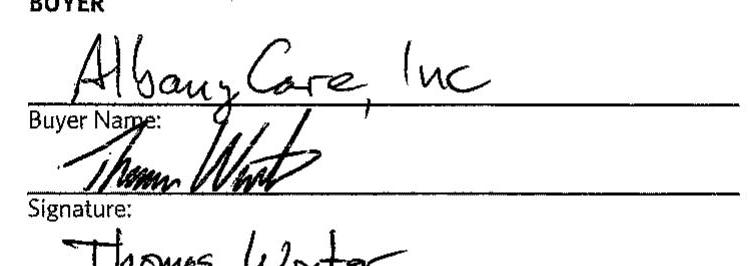

The image is a photo of a section of a document with handwritten elements. It contains the following text:

- **BUYER**
- **Albany Care, Inc**
- **Buyer Name:**
- A handwritten signature
- **Signature:**
- A handwritten name

The text is structured with "Albany Care, Inc" above the signature line, followed by "Buyer Name:" and "Signature:" with corresponding handwritten entries.

Signature:
Themes Wnter
Name:
$C P O$
Title:
$11-2-17$
Date:

Exhibit A
Contract Details \& Service Locations

| Customer Name: Product Type: | AbomCare, Inc. | Contract Date: | $11 / 01 / 17$ |
| :--: | :--: | :--: | :--: |
|  | Fixed | Start Date: | Dec-17 |
|  | Bundled / Un-bundled: | Term (\# of Monthe): | 12 |
|  |  | PLC Value: |  |
|  |  | Contract Price (\$/kWh): | $\$ 0.0191$ |

# Special Provisions: 

Contract Quantity (The monthly kWh quantity per Market Area shown below):

| Market Area |  |
| :--: | :--: |
| Month | Combat |
| Jan | 78,093 |
| Feb | 89,712 |
| Mar | 68,921 |
| Apr | 79,292 |
| May | 84,000 |
| Jun | 100,337 |
| Jul | 127,027 |
| Aug | 105,418 |
| Sep | 98,185 |
| Oct | 87,360 |
| Nov | 71,719 |
| Dec | 71,719 |
| Total | 970,048 |

Delivery Point(s):
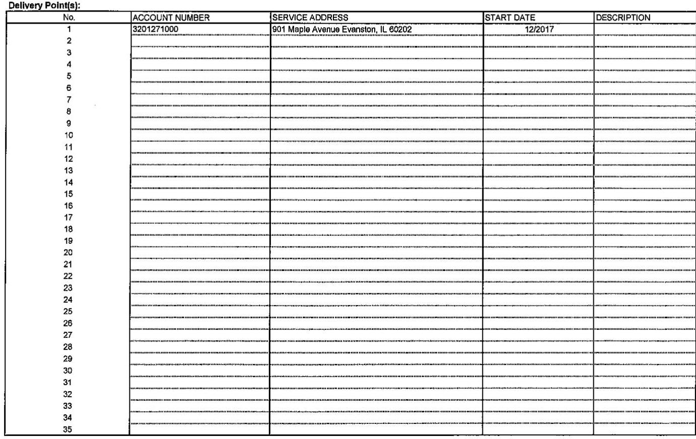

The image is a table listing delivery points. It includes the following columns:

1. **No.**: Sequential numbering from 1 to 35.
2. **Account Number**: Only one entry, "3201271000," is listed in row 1.
3. **Service Address**: Only one entry, "901 Maple Avenue Evanston, IL 60202," is listed in row 1.
4. **Start Date**: Only one entry, "12/2017," is listed in row 1.
5. **Description**: The column is empty for all rows.

Rows 2 to 35 are blank across all columns except for the "No." column, which contains sequential numbers.

# AMBITENERGY 

## Exhibit B

Costs and Taxes

## PJM

- Spot Market Energy
- Transmission Congestion
- Transmission \& Distribution Losses
- Inadvertent Interchange
- Regulation
- Synchronized Reserve
- Operating Reserves
- Black Start Service Charge
- Synchronous Condensing
- Reactive Services
- Meter Correction
- Real-time Economic Load Response
- PJM Scheduling, Control \& Dispatch
- Transmission Owner Scheduling, Control \& Dispatch
- Reactive Supply \& Voltage Control
- NERC \& RFC Charges
- Network Integration Transmission Service ("NITS")
- Expansion and RTO Start-up Cost Recovery
- Transmission Enhancement Charges
- Capacity (only when product contracted is "Bundled" as listed on Exhibit A)
- PJM Settlement, Inc Credit Requirements
- REP Administration and Margin Fees

Pass-through Charges (passed through at cost)
EDC Charges - regulated by Illinois Commerce Commission and imposed and invoiced by the applicable EDC

- Applicable EDC tariff charges
- All applicable taxes
- Capacity (only when product contracted is "Unbundled" as listed on Exhibit A)

Note: This item (Capacity) will be invoiced at cost by Ambit

## Exhibit C Customer Information

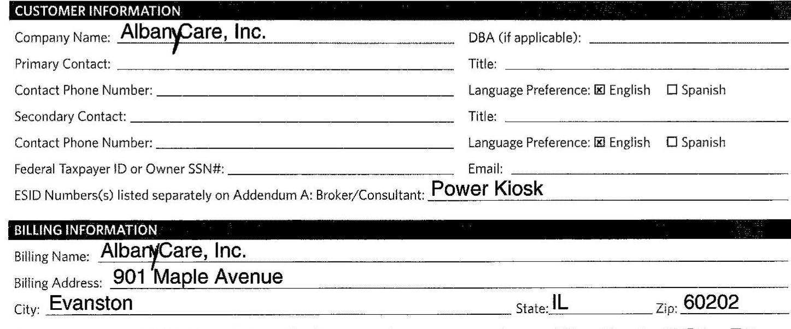

The image is a form containing customer and billing information.

**Customer Information Section:**
- **Company Name:** AlbanyCare, Inc.
- **DBA (if applicable):** [Blank line]
- **Primary Contact:** [Blank line]
- **Contact Phone Number:** [Blank line]
- **Secondary Contact:** [Blank line]
- **Contact Phone Number:** [Blank line]
- **Federal Taxpayer ID or Owner SSN#:** [Blank line]
- **ESID Numbers(s) listed separately on Addendum A: Broker/Consultant:** Power Kiosk
- **Title:** [Blank line]
- **Language Preference:** ☒ English ☐ Spanish
- **Title:** [Blank line]
- **Language Preference:** ☒ English ☐ Spanish
- **Email:** [Blank line]

**Billing Information Section:**
- **Billing Name:** AlbanyCare, Inc.
- **Billing Address:** 901 Maple Avenue
- **City:** Evanston
- **State:** IL
- **Zip:** 60202

If you have multiple ACCOUNT LOCATIONS under this contract, do you want to use the same billing address for all? $\square$ Yes $\square$ No

## TAX STATUS

If claiming exempt, you must forward a copy of your tax exempt certificate. $\square$ Non-Exempt $\square$ Exempt

this Agreement and that such party will be bound thereby. This Agreement, including all Exhibits and Addenda attached hereto and referenced herein, sets forth all understandings between the parties with respect to the purchase and sale of electricity and any prior agreements, contracts, understandings and representations, whether oral or written, relating to the purchase and sale of electricity are merged into and superseded by this Agreement. This Agreement may be amended only by a written document executed by authorized representatives of both parties to this Agreement.
29. Standard Definitions. The following standard definitions shall apply to this Agreement: (a) "EDC" means the applicable local utility; (b) "ISO" means the PJM Interconnection LLC ("PJM"); (c) "ICC" and/or "PUC" means the Illinois Commerce Commission or applicable local Public Utility Commission; (d) "REP" or "RES" means a retail electric supplier; (e) "Delivery Point Change Criteria" means the Forecasted Usage of Buyer or the profile or supply group designation for Buyer's account that served as the basis for Seller's determination of the initial Contract Price; (f) "Profile" means the supply group designation for Buyer's account as determined by the EDC; (g) "Accounts" or "Accounts and Meters" means the Buyer's accounts and meters as determined by the EDC; and (h) "Host Utility" means any utility or provider of electric lines whose system is interconnected with and which provides distribution service to Buyer's Delivery Point(s).

IN WITNESS WHEREOF, the Parties, by their respective duly authorized representatives, have executed this Agreement effective as of the Effective Date. This Agreement will not become effective as to either Party unless and until executed by both Parties.

# AMBIT ENERGY 

Signature:

Name:

Title:

Date:

BUYER

The image is a photo of a handwritten signature. 

Embedded text:
- "Generations at Applewood"
- "Buyer Name:"

Below the "Buyer Name:" line, there is a handwritten signature.

Signature:
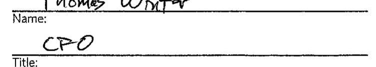

The image is a photo of a handwritten signature section on a document.

Embedded text:
- "Name:"
- "Title:"

Below the "Name:" line, there is a handwritten name, and below the "Title:" line, there is a handwritten title "CPO".

Figure 6

Exhibit A
Contract Details \& Service Locations

| Customer Name: Product Type: Bundled / Un-bundled: | Generations at Applewood Flexed Bundled | Contract Date: Start Date: Term (\# of Months): PLC Value: Contract Price (\$/hWh): | 11/01/17   Dec-17   12   \$0.0393 |
| :--: | :--: | :--: | :--: |

Special Provisions:

Contract Quantity (The monthly hWh quantity per Market Area shown below):

| Market Area |  |
| :--: | :--: |
| Month | ComEd |
| Jan | 84,555 |
| Feb | 61,589 |
| Mar | 67,476 |
| Apr | 50,657 |
| May | 51,467 |
| Jun | 65,265 |
| Jul | 63,304 |
| Aug | 55,289 |
| Sep | 52,671 |
| Oct | 45,556 |
| Nov | 47,770 |
| Dec | 102,743 |
| Total | 788,944 |

Delivery Point(s):

| No. | ACCOUNT NUMBER | BERVICE ADDRESS | START DATE | DESCRIPTION |
| :--: | :--: | :--: | :--: | :--: |
| 1 | 840113036 | 21020 Kostine: Avenue Matieson, IL 60433 | 12/2017 |  |
| 2 |  |  |  |  |
| 3 |  |  |  |  |
| 4 |  |  |  |  |
| 5 |  |  |  |  |
| 6 |  |  |  |  |
| 7 |  |  |  |  |
| 8 |  |  |  |  |
| 9 |  |  |  |  |
| 10 |  |  |  |  |
| 11 |  |  |  |  |
| 12 |  |  |  |  |
| 13 |  |  |  |  |
| 14 |  |  |  |  |
| 15 |  |  |  |  |
| 16 |  |  |  |  |
| 17 |  |  |  |  |
| 18 |  |  |  |  |
| 19 |  |  |  |  |
| 20 |  |  |  |  |
| 21 |  |  |  |  |
| 22 |  |  |  |  |
| 23 |  |  |  |  |
| 24 |  |  |  |  |
| 25 |  |  |  |  |
| 26 |  |  |  |  |
| 27 |  |  |  |  |
| 28 |  |  |  |  |
| 29 |  |  |  |  |
| 30 |  |  |  |  |
| 31 |  |  |  |  |
| 32 |  |  |  |  |
| 33 |  |  |  |  |
| 34 |  |  |  |  |
| 35 |  |  |  |  |

# AMBITENERGY 

## Exhibit B

Costs and Taxes

## PJM

- Spot Market Energy
- Transmission Congestion
- Transmission \& Distribution Losses
- Inadvertent Interchange
- Regulation
- Synchronized Reserve
- Operating Reserves
- Black Start Service Charge
- Synchronous Condensing
- Reactive Services
- Meter Correction
- Real-time Economic Load Response
- PJM Scheduling, Control \& Dispatch
- Transmission Owner Scheduling, Control \& Dispatch
- Reactive Supply \& Voltage Control
- NERC \& RFC Charges
- Network Integration Transmission Service ("NITS")
- Expansion and RTO Start-up Cost Recovery
- Transmission Enhancement Charges
- Capacity (only when product contracted is "Bundled" as listed on Exhibit A)
- PJM Settlement, Inc Credit Requirements
- REP Administration and Margin Fees

Pass-through Charges (passed through at cost)
EDC Charges - regulated by Illinois Commerce Commission and imposed and invoiced by the applicable EDC

- Applicable EDC tariff charges
- All applicable taxes
- Capacity (only when product contracted is "Unbundled" as listed on Exhibit A)

Note: This item (Capacity) will be invoiced at cost by Ambit

## Exhibit C Customer Information

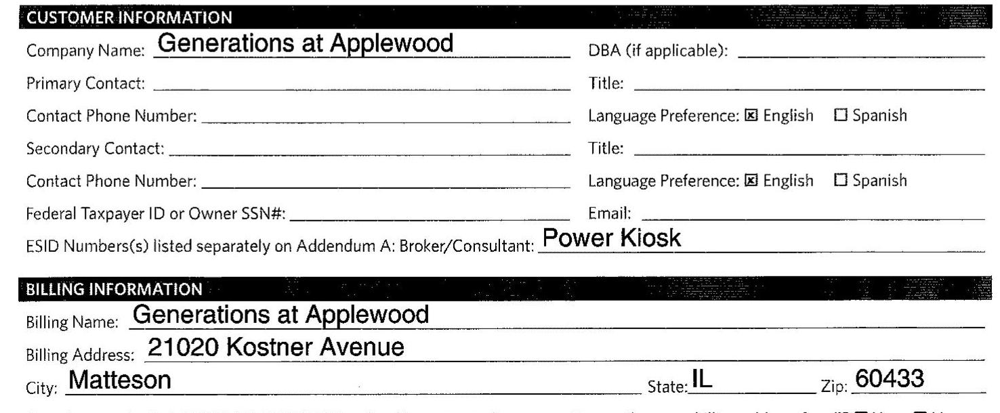

The image is a form with sections for customer and billing information. 

**Customer Information:**
- Company Name: Generations at Applewood
- DBA (if applicable): [Blank]
- Primary Contact: [Blank]
- Title: [Blank]
- Contact Phone Number: [Blank]
- Language Preference: ☒ English ☐ Spanish
- Secondary Contact: [Blank]
- Title: [Blank]
- Contact Phone Number: [Blank]
- Language Preference: ☒ English ☐ Spanish
- Federal Taxpayer ID or Owner SSN#: [Blank]
- Email: [Blank]
- ESID Numbers(s) listed separately on Addendum A: Broker/Consultant: Power Kiosk

**Billing Information:**
- Billing Name: Generations at Applewood
- Billing Address: 21020 Kostner Avenue
- City: Matteson
- State: IL
- Zip: 60433

If you have multiple ACCOUNT LOCATIONS under this contract, do you want to use the same billing address for all? $\square$ Yes $\square$ No

## TAX STATUS

If claiming exempt, you must forward a copy of your tax exempt certificate. $\square$ Non-Exempt $\square$ Exempt

this Agreement and that such party will be bound thereby. This Agreement, including all Exhibits and Addenda attached hereto and referenced herein, sets forth all understandings between the parties with respect to the purchase and sale of electricity and any prior agreements, contracts, understandings and representations, whether oral or written, relating to the purchase and sale of electricity are merged into and superseded by this Agreement. This Agreement may be amended only by a written document executed by authorized representatives of both parties to this Agreement.
29. Standard Definitions. The following standard definitions shall apply to this Agreement: (a) "EDC" means the applicable local utility; (b) "ISO" means the PJM Interconnection LLC ("PJM"); (c) "ICC" and/or "PUC" means the Illinois Commerce Commission or applicable local Public Utility Commission; (d) "REP" or "RES" means a retail electric supplier; (e) "Delivery Point Change Criteria" means the Forecasted Usage of Buyer or the profile or supply group designation for Buyer's account that served as the basis for Seller's determination of the initial Contract Price; (f) "Profile" means the supply group designation for Buyer's account as determined by the EDC; (g) "Accounts" or "Accounts and Meters" means the Buyer's accounts and meters as determined by the EDC; and (h) "Host Utility" means any utility or provider of electric lines whose system is interconnected with and which provides distribution service to Buyer's Delivery Point(s).

IN WITNESS WHEREOF, the Parties, by their respective duly authorized representatives, have executed this Agreement effective as of the Effective Date. This Agreement will not become effective as to either Party unless and until executed by both Parties.

# AMBIT ENERGY 

Signature:

Name:

Title:

Date:

BUYER
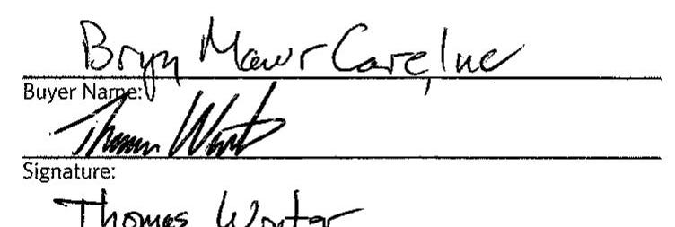

The image is a photo of a section of a document with handwritten elements. It includes:

- The text "Buyer Name:" followed by "Bryn Mawr Care Inc" written in handwriting.
- Below that, there is a signature.
- The text "Signature:" followed by "Thomas Wntor" written in handwriting.

Signature:
Themes Wnstor
Name:
CPO
Title:
$11-2-17$
Date:

Exhibit A
Contract Details \& Service Locations

| Customer Name: Product Type: Bundled / Un-bundled: | Bryn Mawr Care, Inc. Fixed Bundled | Contract Date: Start Date: Term (\# of Months): PLC Value: Contract Price (\$/kWh): | 11/01/17 Dec-17 12 $\$ 8.0595$ |
| :--: | :--: | :--: | :--: |

# Special Provisions: 

Contract Quantity (The monthly kWh quantity per Market Area shown below):
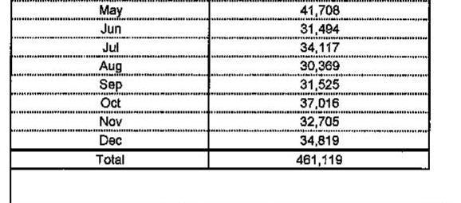

The image is a photo of a table listing monthly kWh quantities. It includes:

- **May**: 41,708
- **Jun**: 31,494
- **Jul**: 34,117
- **Aug**: 30,369
- **Sep**: 31,525
- **Oct**: 37,016
- **Nov**: 32,705
- **Dec**: 34,819
- **Total**: 461,119

The table is structured with months on the left and corresponding kWh quantities on the right. The total is listed at the bottom.

Delivery Point(s):
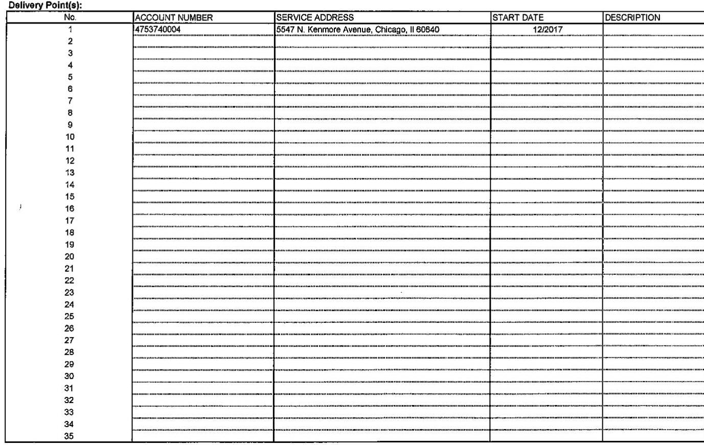

The image is a photo of a table listing delivery points. It includes the following columns:

- **No.**: Sequential numbers from 1 to 35.
- **Account Number**: Only one entry is filled, which is "4753740004" for No. 1.
- **Service Address**: Only one entry is filled, which is "5547 N. Kenmore Avenue, Chicago, IL 60640" for No. 1.
- **Start Date**: Only one entry is filled, which is "12/2017" for No. 1.
- **Description**: The column is empty for all entries.

The table is structured with numbered rows, and only the first row contains data. The rest of the rows are blank.

# AMBITENERGY 

## Exhibit B

Costs and Taxes

## PJM

- Spot Market Energy
- Transmission Congestion
- Transmission \& Distribution Losses
- Inadvertent Interchange
- Regulation
- Synchronized Reserve
- Operating Reserves
- Black Start Service Charge
- Synchronous Condensing
- Reactive Services
- Meter Correction
- Real-time Economic Load Response
- PJM Scheduling, Control \& Dispatch
- Transmission Owner Scheduling, Control \& Dispatch
- Reactive Supply \& Voltage Control
- NERC \& RFC Charges
- Network Integration Transmission Service ("NITS")
- Expansion and RTO Start-up Cost Recovery
- Transmission Enhancement Charges
- Capacity (only when product contracted is "Bundled" as listed on Exhibit A)
- PJM Settlement, Inc Credit Requirements
- REP Administration and Margin Fees

Pass-through Charges (passed through at cost)
EDC Charges - regulated by Illinois Commerce Commission and imposed and invoiced by the applicable EDC

- Applicable EDC tariff charges
- All applicable taxes
- Capacity (only when product contracted is "Unbundled" as listed on Exhibit A)

Note: This item (Capacity) will be invoiced at cost by Ambit

## Exhibit C Customer Information

## CUSTOMER INFORMATION

Company Name: Bryn Mawr Care, Inc.
Primary Contact: $\qquad$
Contact Phone Number: $\qquad$
Secondary Contact: $\qquad$
Contact Phone Number: $\qquad$
Federal Taxpayer ID or Owner SSN\#: $\qquad$
ESID Numbers(s) listed separately on Addendum A: Broker/Consultant: $\qquad$
DBA (If applicable): $\qquad$
Title: $\qquad$
Language Preference: $\boxtimes$ English $\square$ Spanish

Email: $\qquad$
Power Kiosk

## BILLING INFORMATION

Billing Name: Bryn Mawr Care, Inc.
Billing Address: 5547 N. Kenmore Avenue
City: Chicago
State: IL
Zip: 60640
If you have multiple ACCOUNT LOCATIONS under this contract, do you want to use the same billing address for all? $\square$ Yes $\square$ No

## TAM STATUS

If claiming exempt, you must forward a copy of your tax exempt certificate. $\square$ Non-Exempt $\square$ Exempt

this Agreement and that such party will be bound thereby. This Agreement, including all Exhibits and Addenda attached hereto and referenced herein, sets forth all understandings between the parties with respect to the purchase and sale of electricity and any prior agreements, contracts, understandings and representations, whether oral or written, relating to the purchase and sale of electricity are merged into and superseded by this Agreement. This Agreement may be amended only by a written document executed by authorized representatives of both parties to this Agreement.
29. Standard Definitions. The following standard definitions shall apply to this Agreement: (a) "EDC" means the applicable local utility; (b) "ISO" means the PJM Interconnection LLC ("PJM"); (c) "ICC" and/or "PUC" means the Illinois Commerce Commission or applicable local Public Utility Commission; (d) "REP" or "RES" means a retail electric supplier; (e) "Delivery Point Change Criteria" means the Forecasted Usage of Buyer or the profile or supply group designation for Buyer's account that served as the basis for Seller's determination of the initial Contract Price; (f) "Profile" means the supply group designation for Buyer's account as determined by the EDC; (g) "Accounts" or "Accounts and Meters" means the Buyer's accounts and meters as determined by the EDC; and (h) "Host Utility" means any utility or provider of electric lines whose system is interconnected with and which provides distribution service to Buyer's Delivery Point(s).

IN WITNESS WHEREOF, the Parties, by their respective duly authorized representatives, have executed this Agreement effective as of the Effective Date. This Agreement will not become effective as to either Party unless and until executed by both Parties.

# AMBIT ENERGY 

Signature:

Name:

Title:

Date:

BUYER
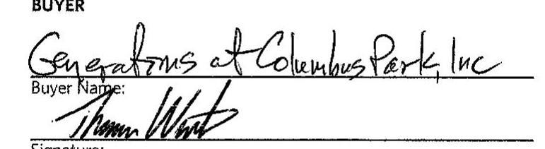

The image is a photo of a signed document section. It includes the following text:

- "BUYER"
- "Generations at Columbus Park, Inc"
- "Buyer Name:"
- A signature is present.
- "Signature:"
- "Thomas Wnther" (appears to be part of the signature).

Signature:
Themes Wnther
Name:
CPO
Title:
$11-2-17$
Date:

Exhibit A
Contract Details \& Service Locations

| Customer Name: | Generations of Columbus Park, Inc. | Contract Data: | $11 / 01 / 17$ |
| :--: | :--: | :--: | :--: |
| Product Type: | Fixed | Start Date: | Dec-17 |
| Bundled / Un-bundled: | Bundled | Term (\# of Months): | 12 |
|  |  | PLC Value: |  |
|  |  | Contract Price (\#/kWh): | \$0.0195 |

# Special Provisions: 

Contract Quantity (The monthly kWh quantity per Market Area shown below):

| Market Area |  |
| :--: | :--: |
| Month | Comed |
| Jan | 72,640 |
| Feb | 63,521 |
| Mar | 62,142 |
| Apr | 68,277 |
| May | 67,458 |
| Jun | 87,478 |
| Jul | 109,138 |
| Aug | 93,098 |
| Sep | 86,161 |
| Oct | 69,494 |
| Nov | 72,876 |
| Dec | 69,228 |
| Total | 913,640 |

Delivery Point(s):

| No. | ACCOUNT NUMBER | SERVICE ADDRESS | START DATE | DESCRIPTION |
| :--: | :--: | :--: | :--: | :--: |
| 1 | 614278003 | 601 S. Austin Blvd. Chicago, IL 65644 | 12/2017 |  |
| 2 |  |  |  |  |
| 3 |  |  |  |  |
| 4 |  |  |  |  |
| 5 |  |  |  |  |
| 6 |  |  |  |  |
| 7 |  |  |  |  |
| 8 |  |  |  |  |
| 9 |  |  |  |  |
| 10 |  |  |  |  |
| 11 |  |  |  |  |
| 12 |  |  |  |  |
| 13 |  |  |  |  |
| 14 |  |  |  |  |
| 15 |  |  |  |  |
| 16 |  |  |  |  |
| 17 |  |  |  |  |
| 18 |  |  |  |  |
| 19 |  |  |  |  |
| 20 |  |  |  |  |
| 21 |  |  |  |  |
| 22 |  |  |  |  |
| 23 |  |  |  |  |
| 24 |  |  |  |  |
| 25 |  |  |  |  |
| 26 |  |  |  |  |
| 27 |  |  |  |  |
| 28 |  |  |  |  |
| 29 |  |  |  |  |
| 30 |  |  |  |  |
| 31 |  |  |  |  |
| 32 |  |  |  |  |
| 33 |  |  |  |  |
| 34 |  |  |  |  |
| 35 |  |  |  |  |

# AMBITENERGY 

## Exhibit B

Costs and Taxes

## PIM

- Spot Market Energy
- Transmission Congestion
- Transmission \& Distribution Losses
- Inadvertent Interchange
- Regulation
- Synchronized Reserve
- Operating Reserves
- Black Start Service Charge
- Synchronous Condensing
- Reactive Services
- Meter Correction
- Real-time Economic Load Response
- PJM Scheduling, Control \& Dispatch
- Transmission Owner Scheduling, Control \& Dispatch
- Reactive Supply \& Voltage Control
- NERC \& RFC Charges
- Network Integration Transmission Service ("NITS")
- Expansion and RTO Start-up Cost Recovery
- Transmission Enhancement Charges
- Capacity (only when product contracted is "Bundled" as listed on Exhibit A)
- PJM Settlement, Inc Credit Requirements
- REP Administration and Margin Fees

## Pass-through Charges (passed through at cost)

EDC Charges - regulated by Illinois Commerce Commission and imposed and invoiced by the applicable EDC

- Applicable EDC tariff charges
- All applicable taxes
- Capacity (only when product contracted is "Unbundled" as listed on Exhibit A)

Note: This item (Capacity) will be invoiced at cost by Ambit

## Exhibit C

Customer Information

## EUSTOMER INFORMATION

Company Name: Generations of Columbus Park, Inc.
DBA (if applicable): $\qquad$
Primary Contact: $\qquad$ Title: $\qquad$
Contact Phone Number: $\qquad$ Language Preference: $\boxtimes$ English $\square$ Spanish
Secondary Contact: $\qquad$ Title: $\qquad$
Contact Phone Number: $\qquad$ Language Preference: $\boxtimes$ English $\square$ Spanish
Federal Taxpayer ID or Owner SSN\#: $\qquad$ Email: $\qquad$
ESID Numbers(s) listed separately on Addendum A: Broker/Consultant: $\overline{\text { Power Kiosk }}$

## BILLING INFORMATION

Billing Name: Generations of Columbus Park, Inc.
Billing Address: 901 S. Austin Blvd.
City: Chicago
State:IL
Zip: 60644
If you have multiple ACCOUNT LOCATIONS under this contract, do you want to use the same billing address for all? $\square$ Yes $\square$ No

## TAX STATUS

If claiming exempt, you must forward a copy of your tax exempt certificate. $\square$ Non-Exempt $\square$ Exempt

this Agreement and that such party will be bound thereby. This Agreement, including all Exhibits and Addenda attached hereto and referenced herein, sets forth all understandings between the parties with respect to the purchase and sale of electricity and any prior agreements, contracts, understandings and representations, whether oral or written, relating to the purchase and sale of electricity are merged into and superseded by this Agreement. This Agreement may be amended only by a written document executed by authorized representatives of both parties to this Agreement.
29. Standard Definitions. The following standard definitions shall apply to this Agreement: (a) "EDC" means the applicable local utility; (b) "ISO" means the PJM Interconnection LLC ("PJM"); (c) "ICC" and/or "PUC" means the Illinois Commerce Commission or applicable local Public Utility Commission; (d) "REP" or "RES" means a retail electric supplier; (e) "Delivery Point Change Criteria" means the Forecasted Usage of Buyer or the profile or supply group designation for Buyer's account that served as the basis for Seller's determination of the initial Contract Price; (f) "Profile" means the supply group designation for Buyer's account as determined by the EDC; (g) "Accounts" or "Accounts and Meters" means the Buyer's accounts and meters as determined by the EDC; and (h) "Host Utility" means any utility or provider of electric lines whose system is interconnected with and which provides distribution service to Buyer's Delivery Point(s).

IN WITNESS WHEREOF, the Parties, by their respective duly authorized representatives, have executed this Agreement effective as of the Effective Date. This Agreement will not become effective as to either Party unless and until executed by both Parties.

# AMBIT ENERGY 

Signature:

Name:

Title:

Date:

## BUYER

The image is a photo of a signature section from a document. It includes handwritten and printed text. The handwritten text reads:

"Generations at Elmwood Park, Inc"

Below this, there is a printed label "Buyer Name:" followed by a handwritten name:

"Thomas Wurtz"

Signature:
Themes Whtr
Name:
CPO
Title:
$11-2-17$
Date:

Exhibit A
Contract Details \& Service Locations

| Customer Name: | Generations At Elmwood Park, Inc. | Contract Date: | $11 / 01 / 17$ |
| :--: | :--: | :--: | :--: |
| Product Type: | Fixed | Start Date: | Dec-17 |
| Bundled / Un-bundled: | Bundled | Term (\# of Months): | 12 |
|  |  | PLC Value: |  |
|  |  | Contract Price (\$/kWh): | \$0.0191 |

# Special Provisions: 

Contract Quantity (The monthly kWh quantity per Market Area shown below):
Market Area

| Month | Cont(s) |
| :--: | :--: |
| Jan | 85,499 |
| Feb | 75,043 |
| Mar | 72,034 |
| Apr | 70,523 |
| May | 55,833 |
| Jun | 109,698 |
| Jul | 120,705 |
| Aug | 118,765 |
| Sep | 109,243 |
| Oct | 85,007 |
| Nov | 86,329 |
| Dec | 83,109 |
| Total | 1,100,909 |

Delivery Point(s):

| No. | ACCOUNT NUMBER | BERVICE ADDRESS | START DATE | DESCRIPTION |
| :--: | :--: | :--: | :--: | :--: |
| 1 | 8230438001 | 7733 W. Grand Ave Elmwood Park, IL 80707 | 12/2017 |  |
| 2 |  |  |  |  |
| 3 |  |  |  |  |
| 4 |  |  |  |  |
| 5 |  |  |  |  |
| 6 |  |  |  |  |
| 7 |  |  |  |  |
| 8 |  |  |  |  |
| 9 |  |  |  |  |
| 10 |  |  |  |  |
| 11 |  |  |  |  |
| 12 |  |  |  |  |
| 13 |  |  |  |  |
| 14 |  |  |  |  |
| 15 |  |  |  |  |
| 16 |  |  |  |  |
| 17 |  |  |  |  |
| 18 |  |  |  |  |
| 19 |  |  |  |  |
| 20 |  |  |  |  |
| 21 |  |  |  |  |
| 22 |  |  |  |  |
| 23 |  |  |  |  |
| 24 |  |  |  |  |
| 25 |  |  |  |  |
| 26 |  |  |  |  |
| 27 |  |  |  |  |
| 28 |  |  |  |  |
| 29 |  |  |  |  |
| 30 |  |  |  |  |
| 31 |  |  |  |  |
| 32 |  |  |  |  |
| 33 |  |  |  |  |
| 34 |  |  |  |  |
| 35 |  |  |  |  |

# AMBITENERGY 

## Exhibit B

Costs and Taxes

## P/M

- Spot Market Energy
- Transmission Congestion
- Transmission \& Distribution Losses
- Inadvertent Interchange
- Regulation
- Synchronized Reserve
- Operating Reserves
- Black Start Service Charge
- Synchronous Condensing
- Reactive Services
- Meter Correction
- Real-time Economic Load Response
- PJM Scheduling, Control \& Dispatch
- Transmission Owner Scheduling, Control \& Dispatch
- Reactive Supply \& Voltage Control
- NERC \& RFC Charges
- Network Integration Transmission Service ("NITS")
- Expansion and RTO Start-up Cost Recovery
- Transmission Enhancement Charges
- Capacity (only when product contracted is "Bundled" as listed on Exhibit A)
- PJM Settlement, Inc Credit Requirements
- REP Administration and Margin Fees

## Pass-through Charges (passed through at cost)

EDC Charges - regulated by Illinois Commerce Commission and imposed and invoiced by the applicable EDC

- Applicable EDC tariff charges
- All applicable taxes
- Capacity (only when product contracted is "Unbundled" as listed on Exhibit A)

Note: This item (Capacity) will be invoiced at cost by Ambit

## Exhibit C

Customer Information

## CUSTOMER INFORMATION

Company Name: Generations At Elmwood Park, Inc.
DBA (if applicable): $\qquad$
Primary Contact: $\qquad$ Title: $\qquad$
Contact Phone Number: $\qquad$ Language Preference: $\boxtimes$ English $\square$ Spanish
Secondary Contact: $\qquad$ Title: $\qquad$
Contact Phone Number: $\qquad$ Language Preference: $\boxtimes$ English $\square$ Spanish
Federal Taxpayer ID or Owner SSN\#: $\qquad$ Email: $\qquad$
ESID Numbers(s) listed separately on Addendum A: Broker/Consultant: $\overline{\text { Power Kiosk }}$

## BILLING INFORMATION

Billing Name: Generations At Elmwood Park, Inc.
Billing Address: 7733 W. Grand Ave
City: Elmwood Park
State:IL
Zip: 60707
If you have multiple ACCOUNT LOCATIONS under this contract, do you want to use the same billing address for all? $\square$ Yes $\square$ No

## TAX STATUS

If claiming exempt, you must forward a copy of your tax exempt certificate. $\square$ Non-Exempt $\square$ Exempt

this Agreement and that such party will be bound thereby. This Agreement, including all Exhibits and Addenda attached hereto and referenced herein, sets forth all understandings between the parties with respect to the purchase and sale of electricity and any prior agreements, contracts, understandings and representations, whether oral or written, relating to the purchase and sale of electricity are merged into and superseded by this Agreement. This Agreement may be amended only by a written document executed by authorized representatives of both parties to this Agreement.
29. Standard Definitions. The following standard definitions shall apply to this Agreement: (a) "EDC" means the applicable local utility; (b) "ISO" means the PJM Interconnection LLC ("PJM"); (c) "ICC" and/or "PUC" means the Illinois Commerce Commission or applicable local Public Utility Commission; (d) "REP" or "RES" means a retail electric supplier; (e) "Delivery Point Change Criteria" means the Forecasted Usage of Buyer or the profile or supply group designation for Buyer's account that served as the basis for Seller's determination of the initial Contract Price; (f) "Profile" means the supply group designation for Buyer's account as determined by the EDC; (g) "Accounts" or "Accounts and Meters" means the Buyer's accounts and meters as determined by the EDC; and (h) "Host Utility" means any utility or provider of electric lines whose system is interconnected with and which provides distribution service to Buyer's Delivery Point(s).

IN WITNESS WHEREOF, the Parties, by their respective duly authorized representatives, have executed this Agreement effective as of the Effective Date. This Agreement will not become effective as to either Party unless and until executed by both Parties.

# AMBIT ENERGY 

Signature:

Name:

Title:

Date:

BUYER

The image is a photo of a signature section from a document. It contains the following text:

- "Generations at Oakton Pavillion, LLC"
- "Buyer Name:"
- A signature is present below the "Buyer Name:" line.

Signature:
Themes Wnstor
Name:
CPO
Title:
$11-2-17$
Date:

Exhibit A
Contract Details \& Service Locations

| Customer Name: | Generations at Oakton Pavillon, LLC |  |  |
| :--: | :--: | :--: | :--: |
| Product Type: | Fixed | Contract Data: | 11/01/17 |
| Bundled / Un-bundled: | Bundled | Start Date:   Term (\# of Months):   PLC Value:   Contract Price (\$/kWh): | $\begin{gathered} \text { Dec-17 } \\ 12 \\ \text { \$3.0395 } \end{gathered}$ |

# Special Provisions: 

Contract Quantity (The monthly kWh quantity per Market Area shown below):
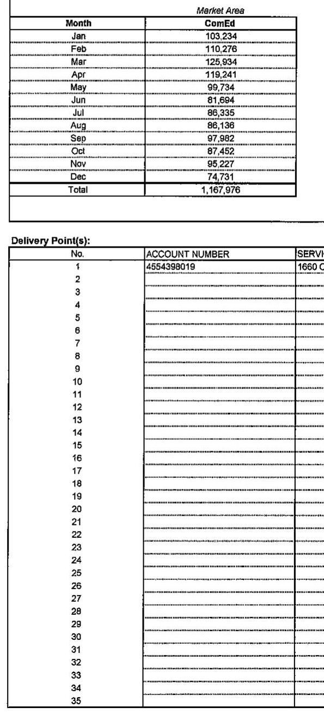

The image is a table listing monthly electricity consumption and delivery points.

1. **Table of Monthly Electricity Consumption:**
   - **Columns:**
     - Month
     - Market Area (ComEd)
   - **Data:**
     - Jan: 103,234
     - Feb: 110,276
     - Mar: 125,934
     - Apr: 119,241
     - May: 99,734
     - Jun: 81,694
     - Jul: 86,335
     - Aug: 86,136
     - Sep: 97,982
     - Oct: 87,452
     - Nov: 95,227
     - Dec: 74,731
     - Total: 1,167,976

2. **Table of Delivery Points:**
   - **Columns:**
     - No.
     - Account Number
     - Service
   - **Data:**
     - No. 1: Account Number 4554398019, Service 1660 C

The tables are organized with the monthly consumption data above the delivery points data.
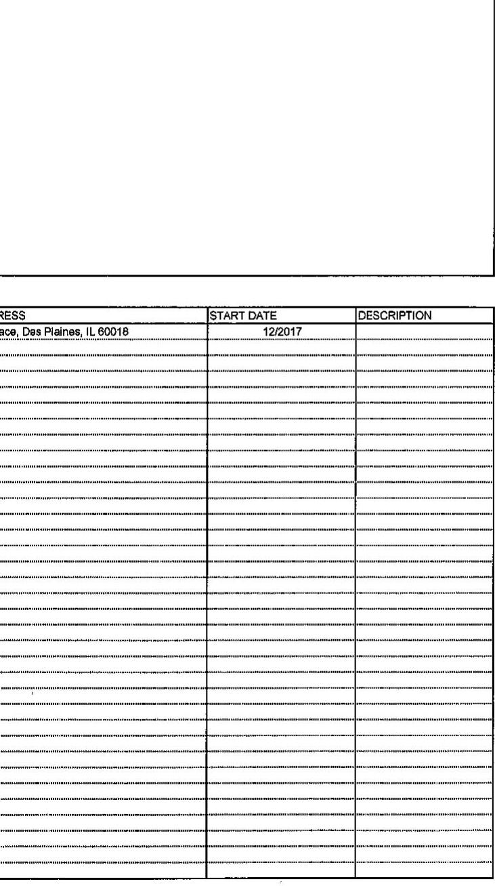

The image is a photo of a table with three columns labeled "ADDRESS," "START DATE," and "DESCRIPTION." The "START DATE" column contains the entry "12/2017." The other columns appear to be mostly empty or filled with lines. The table is organized horizontally with the "ADDRESS" column on the left, followed by "START DATE," and "DESCRIPTION" on the right.

# AMBITENERGY 

## Exhibit B

Costs and Taxes

## PJM

- Spot Market Energy
- Transmission Congestion
- Transmission \& Distribution Losses
- Inadvertent Interchange
- Regulation
- Synchronized Reserve
- Operating Reserves
- Black Start Service Charge
- Synchronous Condensing
- Reactive Services
- Meter Correction
- Real-time Economic Load Response
- PJM Scheduling, Control \& Dispatch
- Transmission Owner Scheduling, Control \& Dispatch
- Reactive Supply \& Voltage Control
- NERC \& RFC Charges
- Network Integration Transmission Service ("NITS")
- Expansion and RTO Start-up Cost Recovery
- Transmission Enhancement Charges
- Capacity (only when product contracted is "Bundled" as listed on Exhibit A)
- PJM Settlement, Inc Credit Requirements
- REP Administration and Margin Fees

Pass-through Charges (passed through at cost)
EDC Charges - regulated by Illinois Commerce Commission and imposed and invoiced by the applicable EDC

- Applicable EDC tariff charges
- All applicable taxes
- Capacity (only when product contracted is "Unbundled" as listed on Exhibit A)

Note: This item (Capacity) will be invoiced at cost by Ambit

## Exhibit C Customer Information

## EUSTOMER INFORMATION

Company Name: Generations at Oakton Pavillion, LLC
Primary Contact: $\qquad$ Title: $\qquad$
Contact Phone Number: $\qquad$ Language Preference: $\boxtimes$ English $\square$ Spanish
Secondary Contact: $\qquad$ Title: $\qquad$
Contact Phone Number: $\qquad$ Language Preference: $\boxtimes$ English $\square$ Spanish
Federal Taxpayer ID or Owner SSN\#: $\qquad$ Email: $\qquad$
ESID Numbers(s) listed separately on Addendum A: Broker/Consultant: $\overline{\text { Power Kiosk }}$

## BILLING INFORMATION

Billing Name: Generations at Oakton Pavillion, LLC
Billing Address: 1660 Oakton Place
City: Des Plaines State:IL Zip: 60018
If you have multiple ACCOUNT LOCATIONS under this contract, do you want to use the same billing address for all? $\square$ Yes $\square$ No

## TAX STATUS

If claiming exempt, you must forward a copy of your tax exempt certificate. $\square$ Non-Exempt $\square$ Exempt

this Agreement and that such party will be bound thereby. This Agreement, including all Exhibits and Addenda attached hereto and referenced herein, sets forth all understandings between the parties with respect to the purchase and sale of electricity and any prior agreements, contracts, understandings and representations, whether oral or written, relating to the purchase and sale of electricity are merged into and superseded by this Agreement. This Agreement may be amended only by a written document executed by authorized representatives of both parties to this Agreement.
29. Standard Definitions. The following standard definitions shall apply to this Agreement: (a) "EDC" means the applicable local utility; (b) "ISO" means the PJM Interconnection LLC ("PJM"); (c) "ICC" and/or "PUC" means the Illinois Commerce Commission or applicable local Public Utility Commission; (d) "REP" or "RES" means a retail electric supplier; (e) "Delivery Point Change Criteria" means the Forecasted Usage of Buyer or the profile or supply group designation for Buyer's account that served as the basis for Seller's determination of the initial Contract Price; (f) "Profile" means the supply group designation for Buyer's account as determined by the EDC; (g) "Accounts" or "Accounts and Meters" means the Buyer's accounts and meters as determined by the EDC; and (h) "Host Utility" means any utility or provider of electric lines whose system is interconnected with and which provides distribution service to Buyer's Delivery Point(s).

IN WITNESS WHEREOF, the Parties, by their respective duly authorized representatives, have executed this Agreement effective as of the Effective Date. This Agreement will not become effective as to either Party unless and until executed by both Parties.

# AMBIT ENERGY 

Signature:

Name:

Title:

Date:

BUYER

The image is a photo of a signature section from a document. It contains handwritten text and printed labels. The handwritten text reads "Generations at Oakton Arms, LLC" and below it, "Buyer Name: Thomas Wnt". The printed labels are "Buyer Name:" and a line for the signature above it.

Signature:
Themes Wnstor
Name:
CPO
Title:
$11-2-17$
Date:

Exhibit A
Contract Details \& Service Locations

| Customer Name: | Generations at Oakton Arms, LLC | Contract Data: | $11 / 01 / 17$ |
| :--: | :--: | :--: | :--: |
| Product Type: | Fixed | Start Date: | Dec-17 |
| Bendied / Un-bundled: | Bundled | Term (\# of Months): | 12 |
|  |  | PLC Value: |  |
|  |  | Contract Price (BkWh): | g/1.0593 |

# Special Provisions: 

Contract Quantity (The monthly kWh quantity per Market Area shown below):

| Market Area |  |
| :--: | :--: |
| Month | ComBat |
| Jan | 76,305 |
| Feb | 79,743 |
| Mar | 92,713 |
| Apr | 68,251 |
| May | 69,198 |
| Jun | 52,640 |
| Jul | 66,196 |
| Aug | 51,700 |
| Sep | 67,672 |
| Oct | 60,457 |
| Nov | 68,298 |
| Dec | 90,214 |
| Total | 619,582 |

Delivery Point(s):

| No. | ACCOUNT NUMBER | SERVICE ADDRESS | START DATE | DESCRIPTION |
| :--: | :--: | :--: | :--: | :--: |
| 1 | 4554397021 | 1055 Oakton Place, Dee Plaines, IL 60016 | 12/2017 |  |
| 2 |  |  |  |  |
| 3 |  |  |  |  |
| 4 |  |  |  |  |
| 5 |  |  |  |  |
| 6 |  |  |  |  |
| 7 |  |  |  |  |
| 8 |  |  |  |  |
| 9 |  |  |  |  |
| 10 |  |  |  |  |
| 11 |  |  |  |  |
| 12 |  |  |  |  |
| 13 |  |  |  |  |
| 14 |  |  |  |  |
| 15 |  |  |  |  |
| 16 |  |  |  |  |
| 17 |  |  |  |  |
| 18 |  |  |  |  |
| 19 |  |  |  |  |
| 20 |  |  |  |  |
| 21 |  |  |  |  |
| 22 |  |  |  |  |
| 23 |  |  |  |  |
| 24 |  |  |  |  |
| 25 |  |  |  |  |
| 26 |  |  |  |  |
| 27 |  |  |  |  |
| 28 |  |  |  |  |
| 29 |  |  |  |  |
| 30 |  |  |  |  |
| 31 |  |  |  |  |
| 32 |  |  |  |  |
| 33 |  |  |  |  |
| 34 |  |  |  |  |
| 35 |  |  |  |  |

# AMBITENERGY 

## Exhibit B

Costs and Taxes

## PIM

- Spot Market Energy
- Transmission Congestion
- Transmission \& Distribution Losses
- Inadvertent Interchange
- Regulation
- Synchronized Reserve
- Operating Reserves
- Black Start Service Charge
- Synchronous Condensing
- Reactive Services
- Meter Correction
- Real-time Economic Load Response
- PIM Scheduling, Control \& Dispatch
- Transmission Owner Scheduling, Control \& Dispatch
- Reactive Supply \& Voltage Control
- NERC \& RFC Charges
- Network Integration Transmission Service ("NITS")
- Expansion and RTO Start-up Cost Recovery
- Transmission Enhancement Charges
- Capacity (only when product contracted is "Bundled" as listed on Exhibit A)
- PIM Settlement, Inc Credit Requirements
- REP Administration and Margin Fees

Pass-through Charges (passed through at cost)
EDC Charges - regulated by Illinois Commerce Commission and imposed and invoiced by the applicable EDC

- Applicable EDC tariff charges
- All applicable taxes
- Capacity (only when product contracted is "Unbundled" as listed on Exhibit A)

Note: This item (Capacity) will be invoiced at cost by Ambit

## Exhibit C Customer Information

## EUSTOMER INFORMATION

Company Name: Generations at Oakton Arms, LLC
Primary Contact: $\qquad$
Contact Phone Number: $\qquad$
Secondary Contact: $\qquad$
Contact Phone Number: $\qquad$
Federal Taxpayer ID or Owner SSN\#: $\qquad$
ESID Numbers(s) listed separately on Addendum A: Broker/Consultant: $\qquad$

DBA (if applicable): $\qquad$
Title: $\qquad$
Language Preference: $\boxtimes$ English $\square$ Spanish
Title: $\qquad$
Language Preference: $\boxtimes$ English $\square$ Spanish

Email: $\qquad$
Power Kiosk

## BILLING INFORMATION

Billing Name: Generations at Oakton Arms, LLC
Billing Address: 1665 Oakton Place
City: Des Plaines State: IL Zip: 60018
If you have multiple ACCOUNT LOCATIONS under this contract, do you want to use the same billing address for all? $\square$ Yes $\square$ No

## TAX STATUS

If claiming exempt, you must forward a copy of your tax exempt certificate. $\square$ Non-Exempt $\square$ Exempt

this Agreement and that such party will be bound thereby. This Agreement, including all Exhibits and Addenda attached hereto and referenced herein, sets forth all understandings between the parties with respect to the purchase and sale of electricity and any prior agreements, contracts, understandings and representations, whether oral or written, relating to the purchase and sale of electricity are merged into and superseded by this Agreement. This Agreement may be amended only by a written document executed by authorized representatives of both parties to this Agreement.
29. Standard Definitions. The following standard definitions shall apply to this Agreement: (a) "EDC" means the applicable local utility; (b) "ISO" means the PJM Interconnection LLC ("PJM"); (c) "ICC" and/or "PUC" means the Illinois Commerce Commission or applicable local Public Utility Commission; (d) "REP" or "RES" means a retail electric supplier; (e) "Delivery Point Change Criteria" means the Forecasted Usage of Buyer or the profile or supply group designation for Buyer's account that served as the basis for Seller's determination of the initial Contract Price; (f) "Profile" means the supply group designation for Buyer's account as determined by the EDC; (g) "Accounts" or "Accounts and Meters" means the Buyer's accounts and meters as determined by the EDC; and (h) "Host Utility" means any utility or provider of electric lines whose system is interconnected with and which provides distribution service to Buyer's Delivery Point(s).

IN WITNESS WHEREOF, the Parties, by their respective duly authorized representatives, have executed this Agreement effective as of the Effective Date. This Agreement will not become effective as to either Party unless and until executed by both Parties.

# AMBIT ENERGY 

Signature:

Name:

Title:

Date:

BUYER
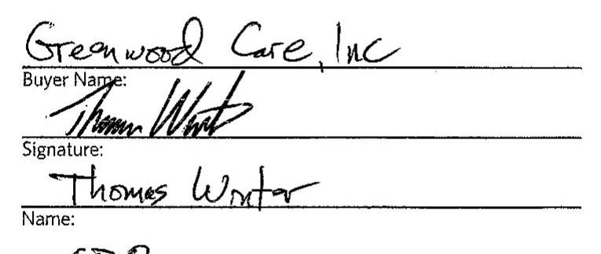

The image is a photo of a signed document section. It includes handwritten and printed text. The text reads:

- "Greenwood Care, Inc"
- "Buyer Name:"
- Handwritten signature
- "Signature:"
- "Thomas Winter"
- "Name:"
- "CPO"

Signature:
Themes Whtr
Name:
CPO
Title:
$11-2-17$
Date:

Exhibit A
Contract Details \& Service Locations

| Customer Name:   Product Type:   Bundled / Un-bundled: | Greenwood Care, Inc.   Fixed   Bundled | Contract Date:   Start Date:   Term (\# of Months):   PLC Value:   Contract Price (\$/kWh): | 11/01/17   Dec-17   12   \$0.0393 |
| :--: | :--: | :--: | :--: |

# Special Provisions: 

Contract Quantity (The monthly kWh quantity per Market Area shown below):

| Market Area |  |
| :--: | :--: |
| Month | Comilid |
| Jan | 40,352 |
| Feb | 43,084 |
| Mar | 49,680 |
| Apr | 47,628 |
| May | 38,345 |
| Jun | 37,623 |
| Jul | 36,113 |
| Aug | 34,305 |
| Sep | 31,833 |
| Oct | 35,366 |
| Nov | 39,886 |
| Dec | 39,836 |
| Total | 471,838 |

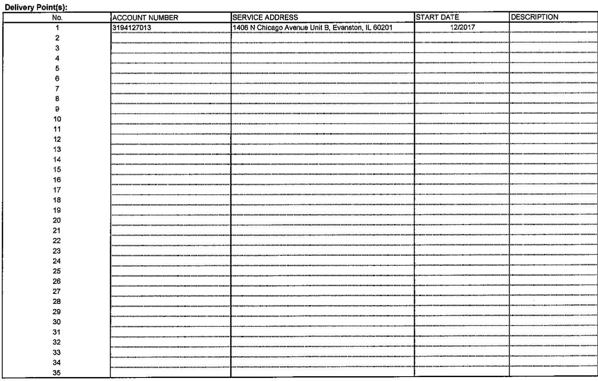

The image is a table listing delivery points. It includes the following columns:

- **No.**: Sequential numbering from 1 to 35.
- **ACCOUNT NUMBER**: The first entry is "3194127D13," with the rest of the rows blank.
- **SERVICE ADDRESS**: The first entry is "1406 N Chicago Avenue Unit B, Evanston, IL 60201," with the rest of the rows blank.
- **START DATE**: The first entry is "12/2017," with the rest of the rows blank.
- **DESCRIPTION**: All rows are blank.

The table is structured with horizontal lines separating each row and vertical lines separating each column.

# AMBITENERGY 

## Exhibit B

Costs and Taxes

## PIM

- Spot Market Energy
- Transmission Congestion
- Transmission \& Distribution Losses
- Inadvertent Interchange
- Regulation
- Synchronized Reserve
- Operating Reserves
- Black Start Service Charge
- Synchronous Condensing
- Reactive Services
- Meter Correction
- Real-time Economic Load Response
- PJM Scheduling, Control \& Dispatch
- Transmission Owner Scheduling, Control \& Dispatch
- Reactive Supply \& Voltage Control
- NERC \& RFC Charges
- Network Integration Transmission Service ("NITS")
- Expansion and RTO Start-up Cost Recovery
- Transmission Enhancement Charges
- Capacity (only when product contracted is "Bundled" as listed on Exhibit A)
- PJM Settlement, Inc Credit Requirements
- REP Administration and Margin Fees

## Pass-through Charges (passed through at cost)

EDC Charges - regulated by Illinois Commerce Commission and imposed and invoiced by the applicable EDC

- Applicable EDC tariff charges
- All applicable taxes
- Capacity (only when product contracted is "Unbundled" as listed on Exhibit A)

Note: This item (Capacity) will be invoiced at cost by Ambit

## Exhibit C

Customer Information

## EUSTOMER INFORMATION

Company Name: Greenwood Care, Inc.
DBA (if applicable): $\qquad$
Primary Contact: $\qquad$ Title: $\qquad$
Contact Phone Number: $\qquad$ Language Preference: $\boxtimes$ English $\square$ Spanish
Secondary Contact: $\qquad$ Title: $\qquad$
Contact Phone Number: $\qquad$ Language Preference: $\boxtimes$ English $\square$ Spanish
Federal Taxpayer ID or Owner SSN\#: $\qquad$ Email: $\qquad$
ESID Numbers(s) listed separately on Addendum A: Broker/Consultant: $\overline{\text { Power Kiosk }}$

## BILLING INFORMATION

Billing Name: Greenwood Care, Inc.
Billing Address: 1406 N. Chicago Avenue
City: Evanston
State:IL
Zip: 60201
If you have multiple ACCOUNT LOCATIONS under this contract, do you want to use the same billing address for all? $\square$ Yes $\square$ No

## TAX STATUS

If claiming exempt, you must forward a copy of your tax exempt certificate. $\square$ Non-Exempt $\square$ Exempt

this Agreement and that such party will be bound thereby. This Agreement, including all Exhibits and Addenda attached hereto and referenced herein, sets forth all understandings between the parties with respect to the purchase and sale of electricity and any prior agreements, contracts, understandings and representations, whether oral or written, relating to the purchase and sale of electricity are merged into and superseded by this Agreement. This Agreement may be amended only by a written document executed by authorized representatives of both parties to this Agreement.
29. Standard Definitions. The following standard definitions shall apply to this Agreement: (a) "EDC" means the applicable local utility; (b) "ISO" means the PJM Interconnection LLC ("PJM"); (c) "ICC" and/or "PUC" means the Illinois Commerce Commission or applicable local Public Utility Commission; (d) "REP" or "RES" means a retail electric supplier; (e) "Delivery Point Change Criteria" means the Forecasted Usage of Buyer or the profile or supply group designation for Buyer's account that served as the basis for Seller's determination of the initial Contract Price; (f) "Profile" means the supply group designation for Buyer's account as determined by the EDC; (g) "Accounts" or "Accounts and Meters" means the Buyer's accounts and meters as determined by the EDC; and (h) "Host Utility" means any utility or provider of electric lines whose system is interconnected with and which provides distribution service to Buyer's Delivery Point(s).

IN WITNESS WHEREOF, the Parties, by their respective duly authorized representatives, have executed this Agreement effective as of the Effective Date. This Agreement will not become effective as to either Party unless and until executed by both Parties.

# AMBIT ENERGY 

Signature:

Name:

Title:

Date:

BUYER
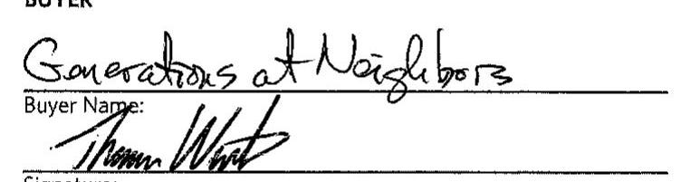

The image is a photo of a section of a document with handwritten elements. It shows a signature section for the "BUYER" with the following details:

- Signature: Generators at Neighbors
- Buyer Name: [Name is handwritten and not clearly legible]
- Title: CPO
- Date: $11-2-17$

The handwritten text is placed on lines designated for each respective field.

Signature:
Themes Wostr
Name:
CPO
Title:
$11-2-17$
Date:

Exhibit A
Contract Details \& Service Locations

| Customer Name: | Generations at Neighbors | Contract Date: | $11 / 01 / 17$ |
| :-- | :-- | :-- | --: |
| Product Type: | Fixed | Start Date: |  |
| Bundled / Un-bundled: | Bundled | Term (\# of Months): |  |
|  |  | PLC Value: |  |
|  |  | Contract Price (\$ikWh): |  |

# Special Provisions: 

Contract Quantity (The monthly kWh quantity per Market Area shown below):
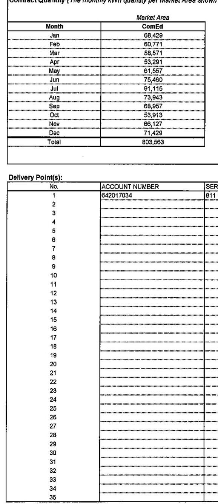

The image is a table listing contract quantities and delivery points.

1. **Contract Quantity Table:**
   - **Title:** Market Area
   - **Columns:** 
     - Month
     - ComEd
   - **Data:**
     - Jan: 68,429
     - Feb: 60,771
     - Mar: 58,571
     - Apr: 53,291
     - May: 61,557
     - Jun: 75,460
     - Jul: 91,115
     - Aug: 73,943
     - Sep: 68,957
     - Oct: 53,913
     - Nov: 66,127
     - Dec: 71,429
     - Total: 803,563

2. **Delivery Points Table:**
   - **Columns:**
     - No.
     - Account Number
     - (Partially visible column, possibly Service Location)
   - **Data:**
     - No. 1: Account Number 642017034, Service Location 811 (rest are blank or not visible)
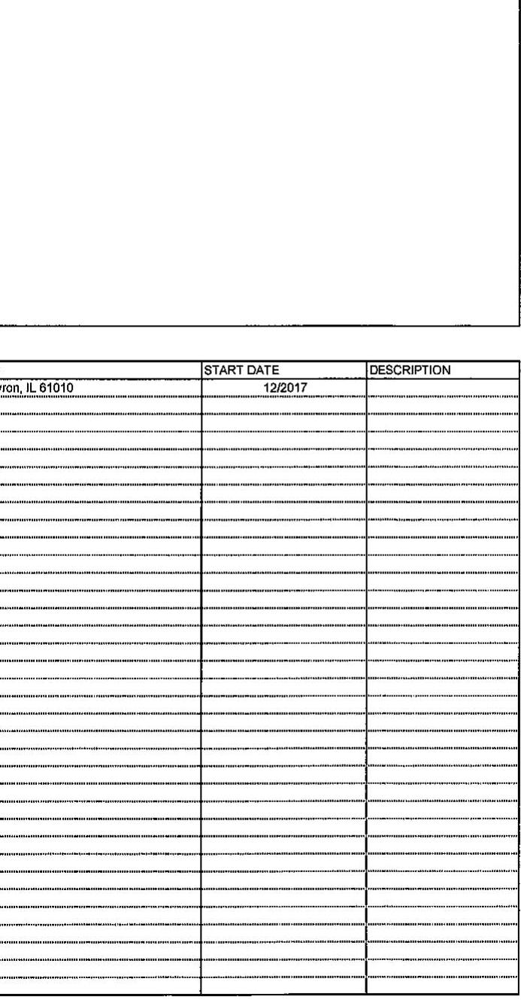

The image is a table with three columns. The columns are labeled "START DATE," "DESCRIPTION," and a partially visible column with text ending in "on, IL 61010." The "START DATE" column contains the entry "12/2017," while the other columns are mostly blank or filled with horizontal lines.
(Continued next page)

# AMBITENERGY' 

## Exhibit B

Costs and Taxes

## PIM

- Spot Market Energy
- Transmission Congestion
- Transmission \& Distribution Losses
- Inadvertent Interchange
- Regulation
- Synchronized Reserve
- Operating Reserves
- Black Start Service Charge
- Synchronous Condensing
- Reactive Services
- Meter Correction
- Real-time Economic Load Response
- PJM Scheduling, Control \& Dispatch
- Transmission Owner Scheduling, Control \& Dispatch
- Reactive Supply \& Voltage Control
- NERC \& RFC Charges
- Network Integration Transmission Service ("NITS")
- Expansion and RTO Start-up Cost Recovery
- Transmission Enhancement Charges
- Capacity (only when product contracted is "Bundled" as listed on Exhibit A)
- PJM Settlement, Inc Credit Requirements
- REP Administration and Margin Fees

Pass-through Charges (passed through at cost)
EDC Charges - regulated by Illinois Commerce Commission and imposed and invoiced by the applicable EDC

- Applicable EDC tariff charges
- All applicable taxes
- Capacity (only when product contracted is "Unbundled" as listed on Exhibit A)

Note: This item (Capacity) will be invoiced at cost by Ambit

## Exhibit C Customer Information

## EUSTOMER INFORMATION

Company Name: Generations at Neighbors
DBA (if applicable): $\qquad$
Primary Contact: $\qquad$ Title: $\qquad$
Contact Phone Number: $\qquad$ Language Preference: $\boxtimes$ English $\square$ Spanish
Secondary Contact: $\qquad$ Title: $\qquad$
Contact Phone Number: $\qquad$ Language Preference: $\boxtimes$ English $\square$ Spanish
Federal Taxpayer ID or Owner SSN\#: $\qquad$ Email: $\qquad$
ESID Numbers(s) listed separately on Addendum A: Broker/Consultant: $\overline{\text { Power Kiosk }}$

## BILLING INFORMATION

Billing Name: Generations at Neighbors
Billing Address: 811 W. 2nd Street
City: Byron
State:IL
Zip: 61010
If you have multiple ACCOUNT LOCATIONS under this contract, do you want to use the same billing address for all? $\square$ Yes $\square$ No

## TAX STATUS

If claiming exempt, you must forward a copy of your tax exempt certificate. $\square$ Non-Exempt $\square$ Exempt

this Agreement and that such party will be bound thereby. This Agreement, including all Exhibits and Addenda attached hereto and referenced herein, sets forth all understandings between the parties with respect to the purchase and sale of electricity and any prior agreements, contracts, understandings and representations, whether oral or written, relating to the purchase and sale of electricity are merged into and superseded by this Agreement. This Agreement may be amended only by a written document executed by authorized representatives of both parties to this Agreement.
29. Standard Definitions. The following standard definitions shall apply to this Agreement: (a) "EDC" means the applicable local utility; (b) "ISO" means the PJM Interconnection LLC ("PJM"); (c) "ICC" and/or "PUC" means the Illinois Commerce Commission or applicable local Public Utility Commission; (d) "REP" or "RES" means a retail electric supplier; (e) "Delivery Point Change Criteria" means the Forecasted Usage of Buyer or the profile or supply group designation for Buyer's account that served as the basis for Seller's determination of the initial Contract Price; (f) "Profile" means the supply group designation for Buyer's account as determined by the EDC; (g) "Accounts" or "Accounts and Meters" means the Buyer's accounts and meters as determined by the EDC; and (h) "Host Utility" means any utility or provider of electric lines whose system is interconnected with and which provides distribution service to Buyer's Delivery Point(s).

IN WITNESS WHEREOF, the Parties, by their respective duly authorized representatives, have executed this Agreement effective as of the Effective Date. This Agreement will not become effective as to either Party unless and until executed by both Parties.

# AMBIT ENERGY 

Signature:

Name:

Title:

Date:

BUYER
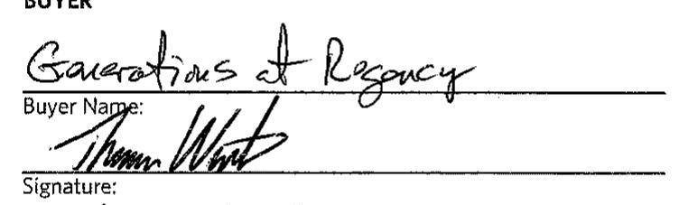

The image is a photo of a section of a document with handwritten elements. It includes:

- The text "BUYER" at the top.
- A handwritten entry "Generations at Regency" on the line labeled "Buyer Name:"
- A signature below the "Buyer Name:" line.
- A line labeled "Signature:" below the signature.

Signature:
Themes Wnth
Name:
CPO
Title:
$11-2-17$
Date:

Exhibit A
Contract Details \& Service Locations

| Customer Name: Product Type: Bundled / Un-bundled: | Generations at Regency, LLC   Fixed   Bundled | Contract Date: Start Date: Term (\# of Months): PLC Value: Contract Price (\$/kWh): | 11/01/17 Dec-17 12   $\$ 3.0393$ |
| :--: | :--: | :--: | :--: |

# Special Provisions: 

Contract Quantity (The monthly kWh quantity per Market Area shown below):
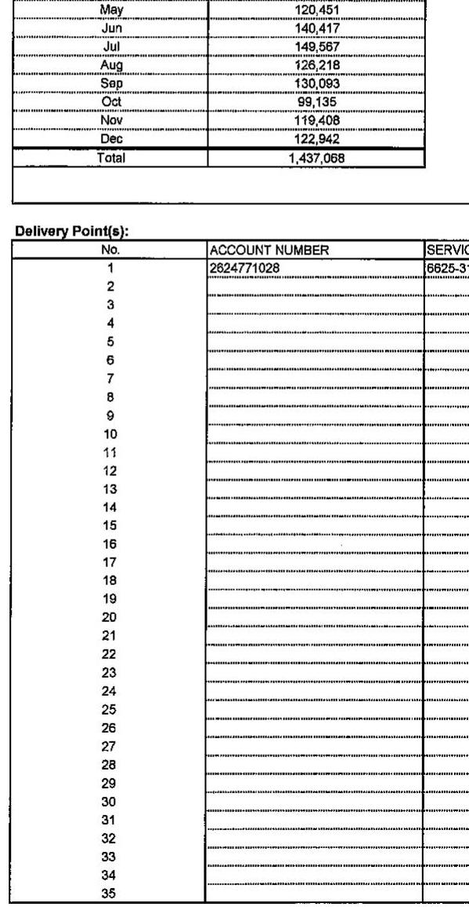

The image is a photo of a table listing delivery points. 

- The table is divided into three columns: "No.", "ACCOUNT NUMBER", and "SERVICE".
- The "No." column lists numbers from 1 to 35.
- The "ACCOUNT NUMBER" column has an entry for number 1: "2624771028". The rest are blank.
- The "SERVICE" column has an entry for number 1: "6625-3". The rest are blank.
- The table is organized with horizontal lines separating each row.
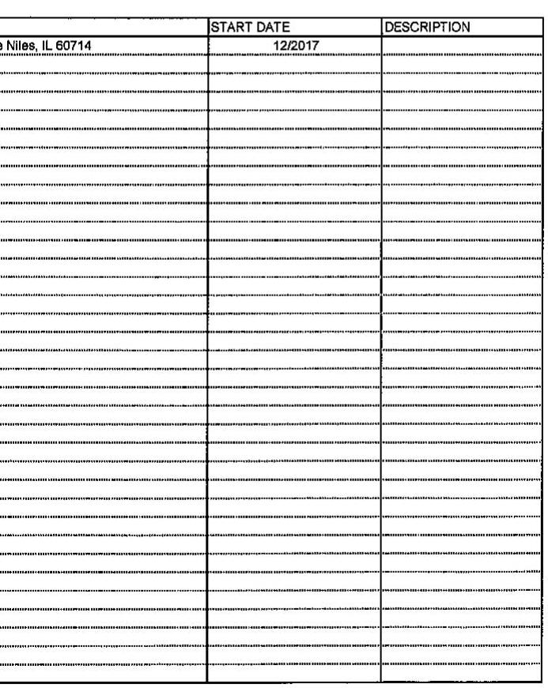

The image is a photo of a table with three columns labeled "ADDRESS", "START DATE", and "DESCRIPTION". 

- The "ADDRESS" column has an entry: "Niles, IL 60714".
- The "START DATE" column has an entry: "12/2017".
- The "DESCRIPTION" column is empty.
- The table is organized with horizontal lines separating each row.

# AMBITENERGY 

## Exhibit B

Costs and Taxes

## PJM

- Spot Market Energy
- Transmission Congestion
- Transmission \& Distribution Losses
- Inadvertent Interchange
- Regulation
- Synchronized Reserve
- Operating Reserves
- Black Start Service Charge
- Synchronous Condensing
- Reactive Services
- Meter Correction
- Real-time Economic Load Response
- PJM Scheduling, Control \& Dispatch
- Transmission Owner Scheduling, Control \& Dispatch
- Reactive Supply \& Voltage Control
- NERC \& RFC Charges
- Network Integration Transmission Service ("NITS")
- Expansion and RTO Start-up Cost Recovery
- Transmission Enhancement Charges
- Capacity (only when product contracted is "Bundled" as listed on Exhibit A)
- PJM Settlement, Inc Credit Requirements
- REP Administration and Margin Fees

Pass-through Charges (passed through at cost)
EDC Charges - regulated by Illinois Commerce Commission and imposed and invoiced by the applicable EDC

- Applicable EDC tariff charges
- All applicable taxes
- Capacity (only when product contracted is "Unbundled" as listed on Exhibit A)

Note: This item (Capacity) will be invoiced at cost by Ambit

## Exhibit C Customer Information

## CUSTOMER INFORMATION

Company Name: Generations at Regency, LLC
Primary Contact: $\qquad$
Contact Phone Number: $\qquad$
Secondary Contact: $\qquad$
Contact Phone Number: $\qquad$
Federal Taxpayer ID or Owner SSN\#: $\qquad$
ESID Numbers(s) listed separately on Addendum A: Broker/Consultant: $\qquad$ Pover Kiosk

DBA (if applicable): $\qquad$
Title: $\qquad$
Language Preference: $\boxtimes$ English $\square$ Spanish

Title: $\qquad$
Language Preference: $\boxtimes$ English $\square$ Spanish

Email: $\qquad$
Power Kiosk

## DILING INFORMATION

Billing Name: Generations at Regency, LLC
Billing Address: 6625-31 N. Milwaukee
City: Niles $\qquad$ State. IL $\qquad$ Zip: 60714

If you have multiple ACCOUNT LOCATIONS under this contract, do you want to use the same billing address for all? $\square$ Yes $\square$ No

## TAX STATUS

If claiming exempt, you must forward a copy of your tax exempt certificate. $\square$ Non-Exempt $\square$ Exempt

this Agreement and that such party will be bound thereby. This Agreement, including all Exhibits and Addenda attached hereto and referenced herein, sets forth all understandings between the parties with respect to the purchase and sale of electricity and any prior agreements, contracts, understandings and representations, whether oral or written, relating to the purchase and sale of electricity are merged into and superseded by this Agreement. This Agreement may be amended only by a written document executed by authorized representatives of both parties to this Agreement.
29. Standard Definitions. The following standard definitions shall apply to this Agreement: (a) "EDC" means the applicable local utility; (b) "ISO" means the PJM Interconnection LLC ("PJM"); (c) "ICC" and/or "PUC" means the Illinois Commerce Commission or applicable local Public Utility Commission; (d) "REP" or "RES" means a retail electric supplier; (e) "Delivery Point Change Criteria" means the Forecasted Usage of Buyer or the profile or supply group designation for Buyer's account that served as the basis for Seller's determination of the initial Contract Price; (f) "Profile" means the supply group designation for Buyer's account as determined by the EDC; (g) "Accounts" or "Accounts and Meters" means the Buyer's accounts and meters as determined by the EDC; and (h) "Host Utility" means any utility or provider of electric lines whose system is interconnected with and which provides distribution service to Buyer's Delivery Point(s).

IN WITNESS WHEREOF, the Parties, by their respective duly authorized representatives, have executed this Agreement effective as of the Effective Date. This Agreement will not become effective as to either Party unless and until executed by both Parties.

# AMBIT ENERGY 

Signature:

Name:

Title:

Date:

## BUYER

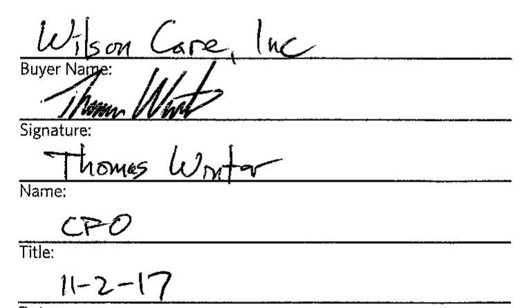

The image is a photo of a signed document section. It contains the following text:

- "Wilson Care, Inc"
- "Buyer Name:"
- A handwritten signature
- "Signature:"
- "Thomas Winter"
- "Name:"
- "CPO"
- "Title:"
- "11-2-17"
- "Date:"

Figure 414
$\square$

Exhibit A
Contract Details \& Service Locations

| Customer Name: | Wilson Care, Inc. | Contract Date: | $11 / 01 / 17$ |
| :-- | :-- | :-- | --: |
| Product Type: | Fixed | Start Date: | Dec-17 |
| Bundled / Un-bundled: | Bundled | Term (\# of Months): | 12 |
|  |  | PLC Value: |  |
|  |  | Contract Price (\$/kWh): | $\$ 0.0595$ |

# Special Provisions: 

Contract Quantity (The monthly kWh quantity per Market Area shown below):
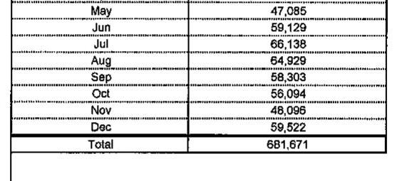

The image is a photo of a table showing monthly kWh quantities. The table includes:

- **May**: 47,085
- **Jun**: 59,129
- **Jul**: 66,138
- **Aug**: 64,929
- **Sep**: 58,303
- **Oct**: 56,094
- **Nov**: 48,095
- **Dec**: 59,522

The total kWh quantity is 681,671. The table is neatly organized with months listed in the left column and corresponding kWh quantities in the right column.

Delivery Point(s):
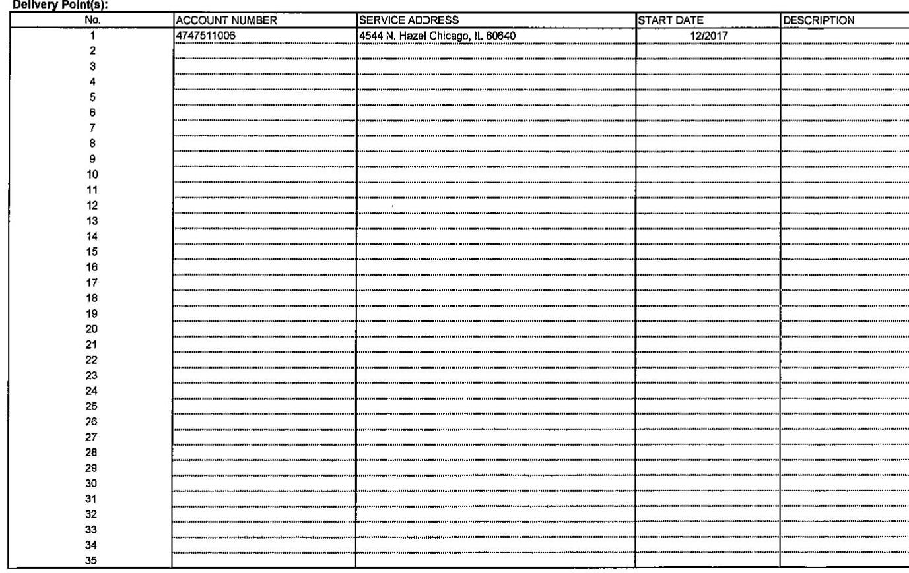

The image is a photo of a table with the following columns: "No.", "ACCOUNT NUMBER", "SERVICE ADDRESS", "START DATE", and "DESCRIPTION". 

- Row 1 contains:
  - No.: 1
  - ACCOUNT NUMBER: 4747511005
  - SERVICE ADDRESS: 4544 N. Hazel Chicago, IL 60640
  - START DATE: 12/2017
  - DESCRIPTION: (blank)

- Rows 2 to 35 are blank across all columns.
(Continued next page)

# 

The image is a logo for "AMBIT ENERGY®" featuring a stylized circular design to the left of the text. The logo is in black and white.   Exhibit B Costs and Taxes 

## PJM

- Spot Market Energy
- Transmission Congestion
- Transmission \& Distribution Losses
- Inadvertent Interchange
- Regulation
- Synchronized Reserve
- Operating Reserves
- Black Start Service Charge
- Synchronous Condensing
- Reactive Services
- Meter Correction
- Real-time Economic Load Response
- PJM Scheduling, Control \& Dispatch
- Transmission Owner Scheduling, Control \& Dispatch
- Reactive Supply \& Voltage Control
- NERC \& RFC Charges
- Network Integration Transmission Service ("NITS")
- Expansion and RTO Start-up Cost Recovery
- Transmission Enhancement Charges
- Capacity (only when product contracted is "Bundled" as listed on Exhibit A)
- PJM Settlement, Inc Credit Requirements
- REP Administration and Margin Fees

## Pass-through Charges (passed through at cost)

EDC Charges - regulated by Illinois Commerce Commission and imposed and invoiced by the applicable EDC

- Applicable EDC tariff charges
- All applicable taxes
- Capacity (only when product contracted is "Unbundled" as listed on Exhibit A)

Note: This item (Capacity) will be invoiced at cost by Ambit

## Exhibit C Customer Information

## EUSTOMER INFORMATION

Company Name: Wilson Care, Inc.
$\qquad$ DBA (if applicable): $\qquad$
Primary Contact: $\qquad$ Title: $\qquad$
Contact Phone Number: $\qquad$ Language Preference: $\boxtimes$ English $\square$ Spanish
Secondary Contact: $\qquad$ Title: $\qquad$
Contact Phone Number: $\qquad$ Language Preference: $\boxtimes$ English $\square$ Spanish
Federal Taxpayer ID or Owner SSN\#: $\qquad$ Email: $\qquad$
ESID Numbers(s) listed separately on Addendum A: Broker/Consultant: $\qquad$ Power Kiosk

## BELING INFORMATION

Billing Name: Wilson Care, Inc.
Billing Address: 4544 N. Hazel
City: Chicago
State:IL
Zip: 60640
If you have multiple ACCOUNT LOCATIONS under this contract, do you want to use the same billing address for all? $\square$ Yes $\square$ No

## TAX STATUS

If claiming exempt, you must forward a copy of your tax exempt certificate. $\square$ Non-Exempt $\square$ Exempt

this Agreement and that such party will be bound thereby. This Agreement, including all Exhibits and Addenda attached hereto and referenced herein, sets forth all understandings between the parties with respect to the purchase and sale of electricity and any prior agreements, contracts, understandings and representations, whether oral or written, relating to the purchase and sale of electricity are merged into and superseded by this Agreement. This Agreement may be amended only by a written document executed by authorized representatives of both parties to this Agreement.
29. Standard Definitions. The following standard definitions shall apply to this Agreement: (a) "EDC" means the applicable local utility; (b) "ISO" means the PJM Interconnection LLC ("PJM"); (c) "ICC" and/or "PUC" means the Illinois Commerce Commission or applicable local Public Utility Commission; (d) "REP" or "RES" means a retail electric supplier; (e) "Delivery Point Change Criteria" means the Forecasted Usage of Buyer or the profile or supply group designation for Buyer's account that served as the basis for Seller's determination of the initial Contract Price; (f) "Profile" means the supply group designation for Buyer's account as determined by the EDC; (g) "Accounts" or "Accounts and Meters" means the Buyer's accounts and meters as determined by the EDC; and (h) "Host Utility" means any utility or provider of electric lines whose system is interconnected with and which provides distribution service to Buyer's Delivery Point(s).

IN WITNESS WHEREOF, the Parties, by their respective duly authorized representatives, have executed this Agreement effective as of the Effective Date. This Agreement will not become effective as to either Party unless and until executed by both Parties.

# AMBIT ENERGY 

Signature:

Name:

Title:

Date:

BUYER
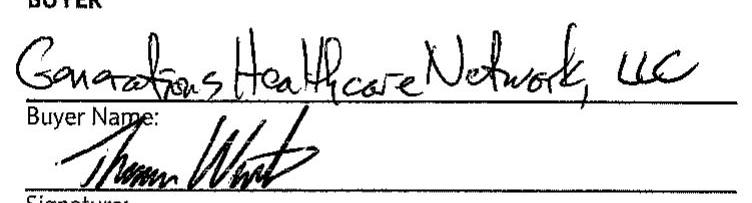

The image is a photo of a signature section from a document. It includes handwritten and typed text. 

- Handwritten text:
  - "Signature:"
  - "Thomes Wostr" (appears to be a signature)
  
- Typed text:
  - "Genarofas Healthcare Network, LLC"
  - "Buyer Name:"
  - "Thomes Wostr" (typed name)

Signature:
Thomes Wostr
Name:
CPO
Title:
$11-2-17$
Date:

Exhibit A
Contract Details \& Service Locations

| Customer Name: | Generations Healthcare Network, LLC. | Contract Date: | $11 / 01 / 17$ |
| :--: | :--: | :--: | :--: |
| Product Type: | Fixed | Start Date: | Dec-17 |
| Bundled / Un-bundled: | Bundled | Term (\# of Monthe):   PLC Value: | 12 |
|  |  | Contract Price (£/kWh): | \$0.0595 |

# Special Provisions: 

Contract Quantity (The monthly kWh quantity per Market Area shown below):

| Market Area |  |
| :--: | :--: |
| Month | DamEd |
| Jan | 1,010 |
| Feb | 965 |
| Mar | 944 |
| Apr | 727 |
| May | 635 |
| Jun | 650 |
| Jul | 768 |
| Aug | 723 |
| Sep | 745 |
| Oct | 1,043 |
| Nov | 891 |
| Dec | 1,090 |
| Total | 10,662 |

Delivery Point(a):

| No. | ACCOUNT NUMBER | SERVICE ADDRESS | START DATE | DESCRIPTION |
| :--: | :--: | :--: | :--: | :--: |
| 1 | 776187010 | 8540 N. Lincoln Avenue Lincolnwood, IL 60712 | 12/2017 |  |
| 2 |  |  |  |  |
| 3 |  |  |  |  |
| 4 |  |  |  |  |
| 5 |  |  |  |  |
| 6 |  |  |  |  |
| 7 |  |  |  |  |
| 8 |  |  |  |  |
| 9 |  |  |  |  |
| 10 |  |  |  |  |
| 11 |  |  |  |  |
| 12 |  |  |  |  |
| 13 |  |  |  |  |
| 14 |  |  |  |  |
| 15 |  |  |  |  |
| 16 |  |  |  |  |
| 17 |  |  |  |  |
| 18 |  |  |  |  |
| 19 |  |  |  |  |
| 20 |  |  |  |  |
| 21 |  |  |  |  |
| 22 |  |  |  |  |
| 23 |  |  |  |  |
| 24 |  |  |  |  |
| 25 |  |  |  |  |
| 26 |  |  |  |  |
| 27 |  |  |  |  |
| 28 |  |  |  |  |
| 29 |  |  |  |  |
| 30 |  |  |  |  |
| 31 |  |  |  |  |
| 32 |  |  |  |  |
| 33 |  |  |  |  |
| 34 |  |  |  |  |
| 35 |  |  |  |  |

# 

The image is a photo or illustration featuring the logo and text. It includes the following text:

"AMBIT ENERGY®
Exhibit B"   Exhibit B Costs and Taxes 

## PJM

- Spot Market Energy
- Transmission Congestion
- Transmission \& Distribution Losses
- Inadvertent Interchange
- Regulation
- Synchronized Reserve
- Operating Reserves
- Black Start Service Charge
- Synchronous Condensing
- Reactive Services
- Meter Correction
- Real-time Economic Load Response
- PJM Scheduling, Control \& Dispatch
- Transmission Owner Scheduling, Control \& Dispatch
- Reactive Supply \& Voltage Control
- NERC \& RFC Charges
- Network Integration Transmission Service ("NITS")
- Expansion and RTO Start-up Cost Recovery
- Transmission Enhancement Charges
- Capacity (only when product contracted is "Bundled" as listed on Exhibit A)
- PJM Settlement, Inc Credit Requirements
- REP Administration and Margin Fees

## Pass-through Charges (passed through at cost)

EDC Charges - regulated by Illinois Commerce Commission and imposed and invoiced by the applicable EDC

- Applicable EDC tariff charges
- All applicable taxes
- Capacity (only when product contracted is "Unbundled" as listed on Exhibit A)

Note: This item (Capacity) will be invoiced at cost by Ambit

## Exhibit C Customer Information

## CUSTOMER INFORMATION

Company Name: Generations Healthcare Network, LLC.
Primary Contact: $\qquad$ Title: $\qquad$
Contact Phone Number: $\qquad$ Language Preference: $\boxtimes$ English $\square$ Spanish
Secondary Contact: $\qquad$ Title: $\qquad$
Contact Phone Number: $\qquad$ Language Preference: $\boxtimes$ English $\square$ Spanish
Federal Taxpayer ID or Owner SSN\#: $\qquad$ Email: $\qquad$
ESID Numbers(s) listed separately on Addendum A: Broker/Consultant: $\underline{\text { Power Kiosk }}$

## BILLING INFORMATION

Billing Name: Generations Healthcare Network, LLC.
Billing Address: 6840 N. Lincoln Avenue
City: Lincolnwood
State: IL
Zip: 60712
If you have multiple ACCOUNT LOCATIONS under this contract, do you want to use the same billing address for all? $\square$ Yes $\square$ No

## TAX STATUS

If claiming exempt, you must forward a copy of your tax exempt certificate. $\square$ Non-Exempt $\square$ Exempt

this Agreement and that such party will be bound thereby. This Agreement, including all Exhibits and Addenda attached hereto and referenced herein, sets forth all understandings between the parties with respect to the purchase and sale of electricity and any prior agreements, contracts, understandings and representations, whether oral or written, relating to the purchase and sale of electricity are merged into and superseded by this Agreement. This Agreement may be amended only by a written document executed by authorized representatives of both parties to this Agreement.
29. Standard Definitions. The following standard definitions shall apply to this Agreement: (a) "EDC" means the applicable local utility; (b) "ISO" means the PJM Interconnection LLC ("PJM"); (c) "ICC" and/or "PUC" means the Illinois Commerce Commission or applicable local Public Utility Commission; (d) "REP" or "RES" means a retail electric supplier; (e) "Delivery Point Change Criteria" means the Forecasted Usage of Buyer or the profile or supply group designation for Buyer's account that served as the basis for Seller's determination of the initial Contract Price; (f) "Profile" means the supply group designation for Buyer's account as determined by the EDC; (g) "Accounts" or "Accounts and Meters" means the Buyer's accounts and meters as determined by the EDC; and (h) "Host Utility" means any utility or provider of electric lines whose system is interconnected with and which provides distribution service to Buyer's Delivery Point(s).

IN WITNESS WHEREOF, the Parties, by their respective duly authorized representatives, have executed this Agreement effective as of the Effective Date. This Agreement will not become effective as to either Party unless and until executed by both Parties.

# AMBIT ENERGY 

Signature:

Name:

Title:

Date:

## BUYER

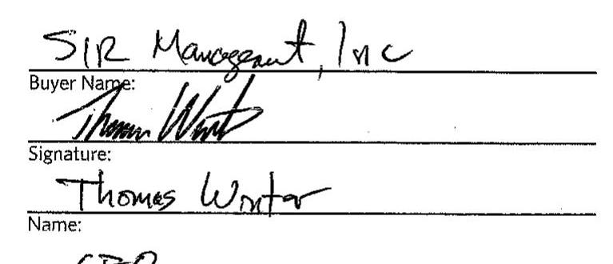

The image is a photo of a document section with handwritten and printed text. 

Embedded text includes:

- "SIR Management, Inc"
- "Buyer Name:"
- "Thomas Winter" (handwritten)
- "Signature:"
- "Thomas Winter" (handwritten)
- "Name:"
- "CEO" (handwritten)

Figure 11-2-17
Date:

Exhibit A
Contract Details \& Service Locations

| Customer Name: | S.I.R. Management, Inc. | Contract Date: | $11 / 01 / 17$ |
| :-- | :-- | :-- | --: |
| Product Type: | Fixed | Start Date: | Dec-17 |
| Bundled / Un-bundled: | Bundled | Term (\# of Months): | 12 |
|  |  | PLC Value: |  |
|  |  | Contract Price (\$/kWh): | $\$ 6.0595$ |

Special Provisions:

Contract Quantity (The monthly kWh quantity per Market Area shown below):

| Market Area |  |
| :--: | :--: |
| Month | Com8d |
| Jan | 2,661 |
| Feb | 3,094 |
| Mar | 4,475 |
| Apr | 4,147 |
| May | 3,329 |
| Jun | 2,760 |
| Jul | 2,717 |
| Aug | 2,557 |
| Sep | 2,517 |
| Oct | 2,910 |
| Nov | 2,497 |
| Dec | 2,862 |
| Total | 35,852 |

Delivery Point(s):

| No. | ACCOUNT NUMBER | BERVIGE ADDRESS | START DATE | DESCRIPTION |
| :--: | :--: | :--: | :--: | :--: |
| 1 | 0778188017 | 6834 M Lincoln Ave, Lincolnwood, IL 60172 | 12/2017 |  |
| 2 |  |  |  |  |
| 3 |  |  |  |  |
| 4 |  |  |  |  |
| 5 |  |  |  |  |
| 6 |  |  |  |  |
| 7 |  |  |  |  |
| 8 |  |  |  |  |
| 9 |  |  |  |  |
| 10 |  |  |  |  |
| 11 |  |  |  |  |
| 12 |  |  |  |  |
| 13 |  |  |  |  |
| 14 |  |  |  |  |
| 15 |  |  |  |  |
| 16 |  |  |  |  |
| 17 |  |  |  |  |
| 18 |  |  |  |  |
| 19 |  |  |  |  |
| 20 |  |  |  |  |
| 21 |  |  |  |  |
| 22 |  |  |  |  |
| 23 |  |  |  |  |
| 24 |  |  |  |  |
| 25 |  |  |  |  |
| 26 |  |  |  |  |
| 27 |  |  |  |  |
| 28 |  |  |  |  |
| 29 |  |  |  |  |
| 30 |  |  |  |  |
| 31 |  |  |  |  |
| 32 |  |  |  |  |
| 33 |  |  |  |  |
| 34 |  |  |  |  |
| 35 |  |  |  |  |

# AMBITENERGY 

## Exhibit B

Costs and Taxes

## PJM

- Spot Market Energy
- Transmission Congestion
- Transmission \& Distribution Losses
- Inadvertent Interchange
- Regulation
- Synchronized Reserve
- Operating Reserves
- Black Start Service Charge
- Synchronous Condensing
- Reactive Services
- Meter Correction
- Real-time Economic Load Response
- PJM Scheduling, Control \& Dispatch
- Transmission Owner Scheduling, Control \& Dispatch
- Reactive Supply \& Voltage Control
- NERC \& RFC Charges
- Network Integration Transmission Service ("NITS")
- Expansion and RTO Start-up Cost Recovery
- Transmission Enhancement Charges
- Capacity (only when product contracted is "Bundled" as listed on Exhibit A)
- PJM Settlement, Inc Credit Requirements
- REP Administration and Margin Fees

Pass-through Charges (passed through at cost)
EDC Charges - regulated by Illinois Commerce Commission and imposed and invoiced by the applicable EDC

- Applicable EDC tariff charges
- All applicable taxes
- Capacity (only when product contracted is "Unbundled" as listed on Exhibit A)

Note: This item (Capacity) will be invoiced at cost by Ambit

## Exhibit C Customer Information

## CUSTOMER INFORMATION

Company Name: S.I.R. Management, Inc.
Pirmary Contact: $\qquad$
Contact Phone Number: $\qquad$
Secondary Contact: $\qquad$
Contact Phone Number: $\qquad$
Federal Taxpayer ID or Owner SSN\#: $\qquad$
ESID Numbers(s) listed separately on Addendum A: Broker/Consultant: Power Kiosk

## BILLING INFORMATION

Billing Name: S.I.R. Management, Inc.
Billing Address: 6834 N Lincoln Ave
City: Lincolnwood
State: IL
Zip: 60172
If you have multiple ACCOUNT LOCATIONS under this contract, do you want to use the same billing address for all? $\square$ Yes $\square$ No

## TAX STATUS

If claiming exempt, you must forward a copy of your tax exempt certificate. $\square$ Non-Exempt $\square$ Exempt

this Agreement and that such party will be bound thereby. This Agreement, including all Exhibits and Addenda attached hereto and referenced herein, sets forth all understandings between the parties with respect to the purchase and sale of electricity and any prior agreements, contracts, understandings and representations, whether oral or written, relating to the purchase and sale of electricity are merged into and superseded by this Agreement. This Agreement may be amended only by a written document executed by authorized representatives of both parties to this Agreement.
29. Standard Definitions. The following standard definitions shall apply to this Agreement: (a) "EDC" means the applicable local utility; (b) "ISO" means the PJM Interconnection LLC ("PJM"); (c) "ICC" and/or "PUC" means the Illinois Commerce Commission or applicable local Public Utility Commission; (d) "REP" or "RES" means a retail electric supplier; (e) "Delivery Point Change Criteria" means the Forecasted Usage of Buyer or the profile or supply group designation for Buyer's account that served as the basis for Seller's determination of the initial Contract Price; (f) "Profile" means the supply group designation for Buyer's account as determined by the EDC; (g) "Accounts" or "Accounts and Meters" means the Buyer's accounts and meters as determined by the EDC; and (h) "Host Utility" means any utility or provider of electric lines whose system is interconnected with and which provides distribution service to Buyer's Delivery Point(s).

IN WITNESS WHEREOF, the Parties, by their respective duly authorized representatives, have executed this Agreement effective as of the Effective Date. This Agreement will not become effective as to either Party unless and until executed by both Parties.

# AMBIT ENERGY 

Signature:

Name:

Title:

Date:

## BUYER

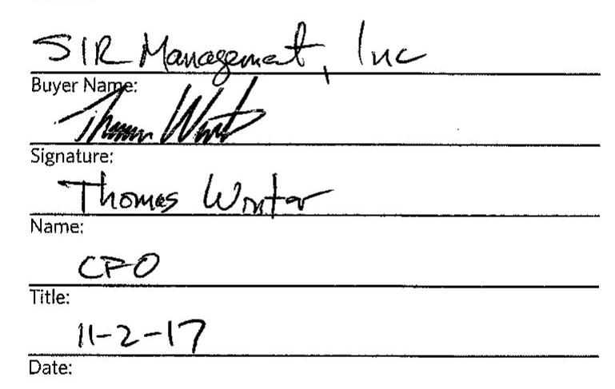

The image is a photo of a signed document section. It contains the following text:

- "SIR Management, Inc"
- "Buyer Name:"
- A signature is present.
- "Signature: Thomas Winter"
- "Name: Thomas Winter"
- "Title: CFO"
- "Date: 11-2-17"

Exhibit A
Contract Details \& Service Locations

| Customer Name: Product Type: | S.I.R. Management, Inc. Fixed | Contract Date: Start Date: Term (\# of Months): | $11 / 01 / 17$   Dec-17 |
| :--: | :--: | :--: | :--: |
|  |  |  | 12 |
|  |  |  |  |
|  |  |  |  |
|  |  | Contract Price (\$/kWh): | $\$ 9.0595$ |

# Special Provisions: 

Contract Quantity (The monthly kWh quantity per Market Area shown below)

| Market Area |  |
| :--: | :--: |
| Month | Combit |
| Jan | 7,231 |
| Feb | 7,124 |
| Mar | 7,337 |
| Apr | 7,625 |
| May | 6,464 |
| Jun | 5,185 |
| Jul | 4,434 |
| Aug | 5,347 |
| Sep | 5,323 |
| Oct | 6,919 |
| Nov | 6,962 |
| Dec | 5,892 |
| Total | 75,872 |

Delivery Point(s):

| No. | ACCOUNT NUMBER | SERVICE ADDRESS | START DATE | DESCRIPTION |
| :--: | :--: | :--: | :--: | :--: |
| 1 | 0776211002 | 4100 W Pratt Ave, Lincolnwood, IL 60172 | 12/2017 |  |
| 2 |  |  |  |  |
| 3 |  |  |  |  |
| 4 |  |  |  |  |
| 5 |  |  |  |  |
| 6 |  |  |  |  |
| 7 |  |  |  |  |
| 8 |  |  |  |  |
| 9 |  |  |  |  |
| 10 |  |  |  |  |
| 11 |  |  |  |  |
| 12 |  |  |  |  |
| 13 |  |  |  |  |
| 14 |  |  |  |  |
| 15 |  |  |  |  |
| 16 |  |  |  |  |
| 17 |  |  |  |  |
| 18 |  |  |  |  |
| 19 |  |  |  |  |
| 20 |  |  |  |  |
| 21 |  |  |  |  |
| 22 |  |  |  |  |
| 23 |  |  |  |  |
| 24 |  |  |  |  |
| 25 |  |  |  |  |
| 26 |  |  |  |  |
| 27 |  |  |  |  |
| 28 |  |  |  |  |
| 29 |  |  |  |  |
| 30 |  |  |  |  |
| 31 |  |  |  |  |
| 32 |  |  |  |  |
| 33 |  |  |  |  |
| 34 |  |  |  |  |
| 35 |  |  |  |  |

# 

The image is a photo or illustration showing the logo and text for "AMBIT ENERGY" and the title "Exhibit B Costs and Taxes." The logo is positioned above the text. There are no additional elements or details visible in the image.   Exhibit B Costs and Taxes 

## PIM

- Spot Market Energy
- Transmission Congestion
- Transmission \& Distribution Losses
- Inadvertent Interchange
- Regulation
- Synchronized Reserve
- Operating Reserves
- Black Start Service Charge
- Synchronous Condensing
- Reactive Services
- Meter Correction
- Real-time Economic Load Response
- PJM Scheduling, Control \& Dispatch
- Transmission Owner Scheduling, Control \& Dispatch
- Reactive Supply \& Voltage Control
- NERC \& RFC Charges
- Network Integration Transmission Service ("NITS")
- Expansion and RTO Start-up Cost Recovery
- Transmission Enhancement Charges
- Capacity (only when product contracted is "Bundled" as listed on Exhibit A)
- PJM Settlement, Inc Credit Requirements
- REP Administration and Margin Fees

Pass-through Charges (passed through at cost)
EDC Charges - regulated by Illinois Commerce Commission and imposed and invoiced by the applicable EDC

- Applicable EDC tariff charges
- All applicable taxes
- Capacity (only when product contracted is "Unbundled" as listed on Exhibit A)

Note: This item (Capacity) will be invoiced at cost by Ambit

## Exhibit C Customer Information

## EUSTOMER INFORMATION

Company Name: S.I.R. Management, Inc.
DBA (If applicable): $\qquad$
Primary Contact: $\qquad$ Title: $\qquad$
Contact Phone Number: $\qquad$ Language Preference: $\boxtimes$ English $\square$ Spanish
Secondary Contact: $\qquad$ Title: $\qquad$
Contact Phone Number: $\qquad$ Language Preference: $\boxtimes$ English $\square$ Spanish
Federal Taxpayer ID or Owner SSN\#: $\qquad$ Email: $\qquad$
ESID Numbers(s) listed separately on Addendum A: Broker/Consultant: $\underline{\text { Power Kiosk }}$

## BILING INFORMATION

Billing Name: S.I.R. Management, Inc.
Billing Address: 4100 W Pratt Ave
City: Lincolnwood
State: IL
Zip: 60172
If you have multiple ACCOUNT LOCATIONS under this contract, do you want to use the same billing address for all? $\square$ Yes $\square$ No

## TAX STATUS

If claiming exempt, you must forward a copy of your tax exempt certificate. $\square$ Non-Exempt $\square$ Exempt

this Agreement and that such party will be bound thereby. This Agreement, including all Exhibits and Addenda attached hereto and referenced herein, sets forth all understandings between the parties with respect to the purchase and sale of electricity and any prior agreements, contracts, understandings and representations, whether oral or written, relating to the purchase and sale of electricity are merged into and superseded by this Agreement. This Agreement may be amended only by a written document executed by authorized representatives of both parties to this Agreement.
29. Standard Definitions. The following standard definitions shall apply to this Agreement: (a) "EDC" means the applicable local utility; (b) "ISO" means the PJM Interconnection LLC ("PJM"); (c) "ICC" and/or "PUC" means the Illinois Commerce Commission or applicable local Public Utility Commission; (d) "REP" or "RES" means a retail electric supplier; (e) "Delivery Point Change Criteria" means the Forecasted Usage of Buyer or the profile or supply group designation for Buyer's account that served as the basis for Seller's determination of the initial Contract Price; (f) "Profile" means the supply group designation for Buyer's account as determined by the EDC; (g) "Accounts" or "Accounts and Meters" means the Buyer's accounts and meters as determined by the EDC; and (h) "Host Utility" means any utility or provider of electric lines whose system is interconnected with and which provides distribution service to Buyer's Delivery Point(s).

IN WITNESS WHEREOF, the Parties, by their respective duly authorized representatives, have executed this Agreement effective as of the Effective Date. This Agreement will not become effective as to either Party unless and until executed by both Parties.

# AMBIT ENERGY 

Signature:

Name:

Title:

Date:

## BUYER

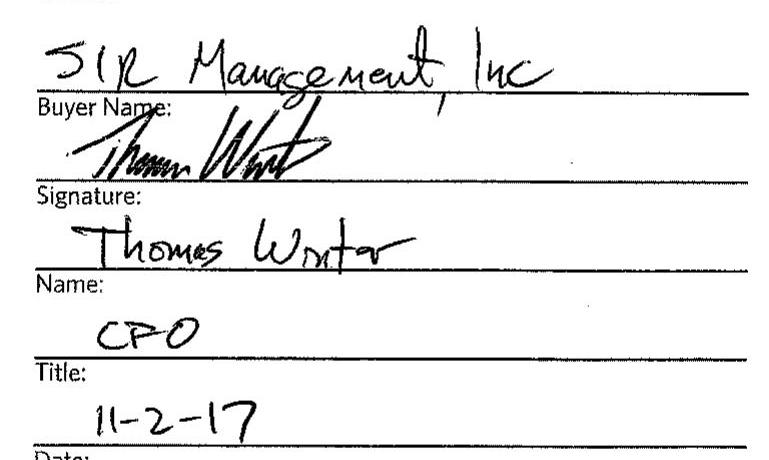

The image is a photo of a signed document section. It contains the following text:

- "SJR Management, Inc"
- "Buyer Name:"
- A signature
- "Signature:"
- "Thomas Winter"
- "Name:"
- "CFO"
- "Title:"
- "11-2-17"
- "Date:"

Figure 6

Exhibit A
Contract Details \& Service Locations

| Customer Name: | S.I.R. Management, Inc. | Contract Date: | $11 / 01 / 17$ |
| :-- | :-- | :-- | --: |
| Product Type: | Fixed | Start Date: | Dec-17 |
| Bundled / Un-bundled: | Bundled | Term (\# of Months): | 12 |
|  |  | PLC Value: |  |
|  |  | Contract Price (\$/kWh): | $\$ 0.0555$ |

# Special Provisions: 

Contract Quantity (The monthly kWh quantity per Market Area shown below):
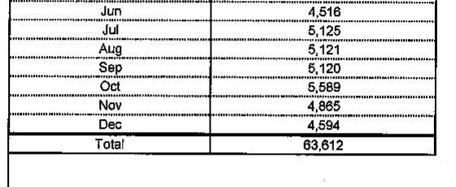

The image is a table listing monthly kWh quantities.

- **Months and Quantities:**
  - Jun: 4,516
  - Jul: 5,125
  - Aug: 5,121
  - Sep: 5,120
  - Oct: 5,589
  - Nov: 4,865
  - Dec: 4,594

- **Total:** 63,612

The table is structured with months listed on the left and corresponding kWh quantities on the right. The total is at the bottom of the table.

Delivery Point(s):
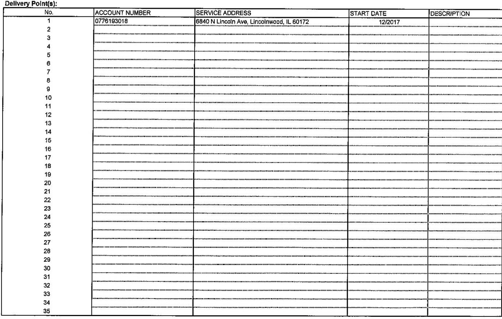

The image is a table listing delivery points. It includes the following columns:

- **No.**: Sequential numbering from 1 to 35.
- **Account Number**: Only one entry is filled with "0776193018" at No. 1.
- **Service Address**: Only one entry is filled with "6840 N Lincoln Ave, Lincolnwood, IL 60172" at No. 1.
- **Start Date**: Only one entry is filled with "12/2017" at No. 1.
- **Description**: This column is empty for all entries.

The table is mostly empty except for the first row, which contains specific details.
(Continued next page)

# 

The image is a logo for "AMBIT ENERGY" with a stylized circular design to the left of the text. The text "AMBIT ENERGY" is in uppercase letters. The logo is black and white.   Exhibit B Costs and Taxes 

## PJM

- Spot Market Energy
- Transmission Congestion
- Transmission \& Distribution Losses
- Inadvertent Interchange
- Regulation
- Synchronized Reserve
- Operating Reserves
- Black Start Service Charge
- Synchronous Condensing
- Reactive Services
- Meter Correction
- Real-time Economic Load Response
- PJM Scheduling, Control \& Dispatch
- Transmission Owner Scheduling, Control \& Dispatch
- Reactive Supply \& Voltage Control
- NERC \& RFC Charges
- Network Integration Transmission Service ("NITS")
- Expansion and RTO Start-up Cost Recovery
- Transmission Enhancement Charges
- Capacity (only when product contracted is "Bundled" as listed on Exhibit A)
- PJM Settlement, Inc Credit Requirements
- REP Administration and Margin Fees

## Pass-through Charges (passed through at cost)

EDC Charges - regulated by Illinois Commerce Commission and imposed and invoiced by the applicable EDC

- Applicable EDC tariff charges
- All applicable taxes
- Capacity (only when product contracted is "Unbundled" as listed on Exhibit A)

Note: This item (Capacity) will be invoiced at cost by Ambit

## Exhibit C Customer Information

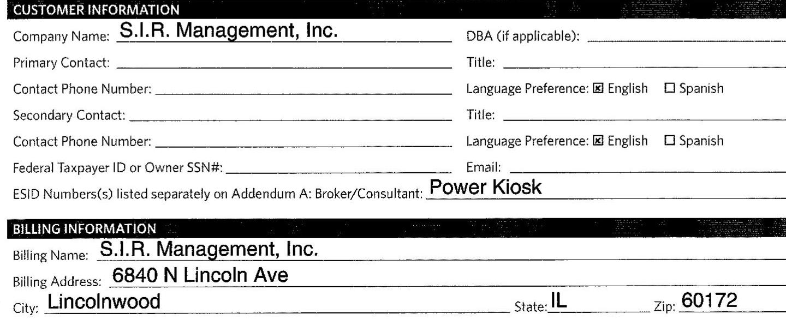

The image is a form with sections for customer and billing information. 

**Customer Information:**
- Company Name: S.I.R. Management, Inc.
- DBA (if applicable): [Blank line]
- Primary Contact: [Blank line]
- Title: [Blank line]
- Contact Phone Number: [Blank line]
- Language Preference: ☒ English ☐ Spanish
- Secondary Contact: [Blank line]
- Title: [Blank line]
- Contact Phone Number: [Blank line]
- Language Preference: ☒ English ☐ Spanish
- Federal Taxpayer ID or Owner SSN#: [Blank line]
- Email: [Blank line]
- ESID Numbers(s) listed separately on Addendum A: Broker/Consultant: Power Kiosk

**Billing Information:**
- Billing Name: S.I.R. Management, Inc.
- Billing Address: 6840 N Lincoln Ave
- City: Lincolnwood
- State: IL
- Zip: 60172

If you have multiple ACCOUNT LOCATIONS under this contract, do you want to use the same billing address for all? $\square$ Yes $\square$ No

## TAX STATUS

If claiming exempt, you must forward a copy of your tax exempt certificate. $\square$ Non-Exempt $\square$ Exempt

