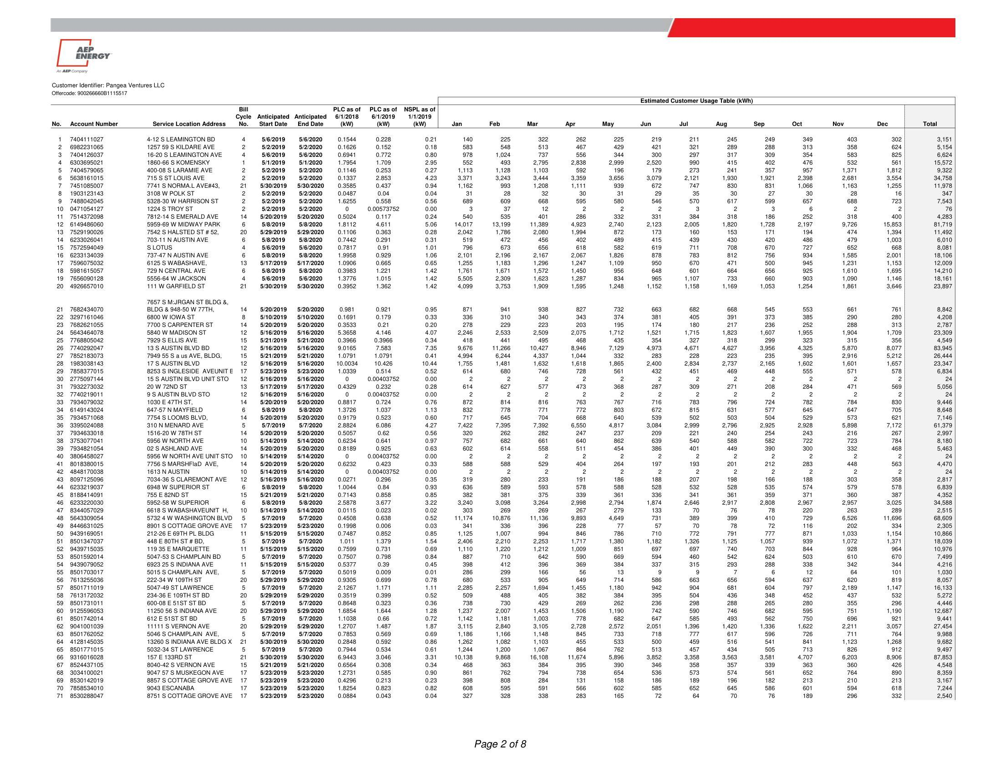
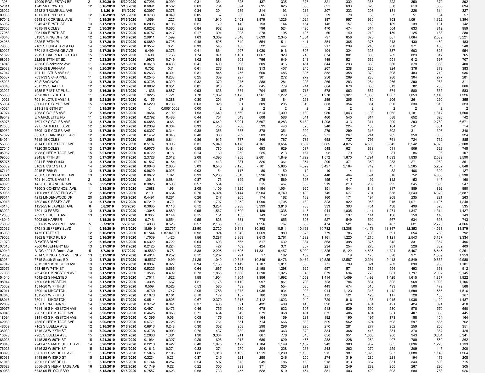

# Attachment A-1: Product and Pricing Summary 

Customer Identifier
Utility/EDC
No. of Service Location(s)

Pangea Ventures LLC
ComEd - IL
520

## Offer Information

## Offer Generation Date

## Offer Expiration Time

## Billing Method

Days to Pay
Product Name
Earlest Anticipated Start Date**

## Term

## $0.04260 \quad$ \$xwh

## Pricing Notes

| Pricing Notes |  |
| :-- | :-- |
| Pricing Index |  |
| $\checkmark$ Energy | Included in Energy Price |
| $\checkmark$ Capacity | Included in Energy Price |
| $\checkmark$ Transmission | Included in Energy Price |
| $\checkmark$ Energy Losses | Included in Energy Price |
| $\checkmark$ Ancillaries | Included in Energy Price |
| $\checkmark$ RPS | Included in Energy Price |

Offercode: 900266660B1115517

## Additional Terms

## Applicable only to the Service Location(s) served under this Attachment A-1.

The General Terms and Conditions and Exhibit A most recently executed between the parties on or prior to the date hereof are hereby incorporated herein by reference and become a part of, and govern, this Attachment A-1. The pricing on this Attachment A-1 does not include any EDC or otherwise non-bypassable charge or any applicable (and not expressly included) tax.

Nowithstanding anything contained in this Agreement to the contrary, Customer shall have the right to amend the list of Service Locations identified in this Attachment A-1 without impact to the Energy Price agreed hereunder by adding to or deleting from such Service Location list provided that (1) there is no Event of Default by Customer; (2) any such Service Location to be added is within the applicable EDC and ISO zone currently served by AEP Energy under the terms of this Attachment A-1; (3) such amendments are made solely in order to reflect additional Service Locations or deletions in respect of Service Location closures or transfers to unaffiliated third parties, and (4) the additions and deletions do not result in a change to overall usage, as specified in the Estimated Customer Usage Table in Attachment A-1 at the time of such addition or deletion, by more than ten percent (10\%) of the Estimated Customer Usage Table in Attachment A-1 as of the effective date of this Agreement (the "Threshold"). If Customer adds Service Locations that result in an increase in annual usage of more than the Threshold, then the Energy Price for such additional usage shall be mutually agreed to in writing by the parties. Any deletions in excess of the Threshold shall result in the payment of actual damages, if any, by Customer.

Pangea Ventures LLC
AEP Energy, Inc.

## Customer Signature

Name (Print)
Title

Date

Signature
Scott D. Silsher

Name
Chief Solutions Officer

Title

Date

The image is a photo of a detailed table titled "Estimated Customer Usage Table (kWh)." It contains multiple columns and rows with the following headers:

- No.
- Account Number
- Service Location Address
- Bill Cycle
- Anticipated Start Date
- Anticipated End Date
- PLC as of 6/1/2018 (kW)
- PLC as of 6/1/2019 (kW)
- NSPL as of 6/1/2019 (kW)
- Jan
- Feb
- Mar
- Apr
- May
- Jun
- Jul
- Aug
- Sep
- Oct
- Nov
- Dec
- Total

Each row lists data for different accounts, including account numbers, addresses, and monthly usage in kWh. The table spans across the page, with monthly data from January to December, followed by a total column. The table is structured with numerical data aligned under each month, showing the electricity usage for each account. The page is labeled "Page 2 of 8" at the bottom.

The image is a table containing multiple rows and columns of data. Each row appears to represent a different entry, with columns providing various numerical values and dates. The data includes:

- A series of numbers and addresses in the first two columns.
- Dates formatted as "5/17/2019" and "5/17/2020" in the third and fourth columns.
- A sequence of numerical values extending across the remaining columns.

The table is densely packed with numbers, likely representing some form of statistical or financial data over time. There is no additional text or labels visible to provide context or explanation for the data.

| 161 | 6367220330 | 131921 W 947H | 16 | 63223016 | 6322820 | 0.6055 | 3.109 | 3.18 | 2.608 | 2.708 | 2.867 | 2.855 | 2.405 | 1.718 | 2.185 | 2.398 | 2.157 | 2.278 | 2.634 | 2.922 | 29.555 |
| :--: | :--: | :--: | :--: | :--: | :--: | :--: | :--: | :--: | :--: | :--: | :--: | :--: | :--: | :--: | :--: | :--: | :--: | :--: | :--: | :--: | :--: |
| 162 | 7348548046 | 7961 S-PAATON AVE | 15 | 6313319 | 6313820 | 1.4862 | 1.64 | 1.31 | 1.165 | 1.086 | 1.086 | 980 | 881 | 777 | 773 | 633 | 607 | 1.094 | 1.177 | 1.157 | 11.815 |
| 163 | 6364480561 | 8109.17 S.AWA.ANG AVE | 15 | 6313319 | 6313820 | 5.1062 | 4.166 | 5.37 | 5.718 | 5.421 | 5.614 | 3.841 | 2.742 | 2.840 | 2.779 | 2.857 | 2.604 | 2.669 | 4.571 | 6.581 | 47.837 |
| 164 | 8937172647 | 724149 PHILLIPS AVE | 12 | 6163319 | 6163820 | 5.7021 | 0.436 | 0.46 | 1.257 | 1.249 | 1.048 | 903 | 915 | 787 | 809 | 675 | 666 | 976 | 1.006 | 1.006 | 11.698 |
| 165 | 6364484969 | 8111 S-AWA.ANG AVE | 15 | 6313319 | 6313820 | 4.8937 | 4.313 | 3.18 | 754 | 660 | 660 | 664 | 849 | 1.026 | 1.292 | 1.385 | 1.072 | 815 | 672 | 1.192 | 10.520 |
| 166 | 8853354059 | 741725 S.PHILLIPS AVE | 12 | 6163319 | 6163820 | 0.7579 | 1.358 | 1.15 | 1.017 | 956 | 833 | 708 | 615 | 528 | 525 | 600 | 581 | 650 | 926 | 773 | 8.426 |
| 167 | 9038548517 | 800103 S.GAMPASTER ST | 15 | 6313319 | 6313820 | 1.6435 | 0.058 | 0.08 | 2.890 | 3.017 | 2.629 | 1.032 | 144 | 144 | 153 | 170 | 138 | 147 | 1.506 | 2.675 | 14.945 |
| 168 | 8853478036 | 7440.45 S.PHILLIPS AVE | 12 | 6163319 | 6163820 | 0.8872 | 1.57 | 1.17 | 790 | 581 | 645 | 610 | 601 | 551 | 620 | 678 | 652 | 674 | 649 | 768 | 7.822 |
| 169 | 9196567561 | 1216.22 W 8399.7 | 15 | 6313319 | 6313820 | 2.4129 | 0.604 | 0.46 | 370 | 302 | 300 | 414 | 555 | 382 | 273 | 289 | 273 | 300 | 323 | 354 | 4.135 |
| 170 | 9444686032 | 7829.31 PHILLIPS BD | 13 | 6173319 | 6173820 | 0.5185 | 0.541 | 0.57 | 239 | 234 | 252 | 237 | 234 | 180 | 214 | 238 | 222 | 237 | 242 | 249 | 2.779 |
| 171 | 9110696534 | 8515.5 GARDA ST | 16 | 6322319 | 6322820 | 0.3213 | 0.438 | 0.47 | 271 | 214 | 240 | 329 | 235 | 207 | 223 | 254 | 246 | 242 | 227 | 2.72 | 2.863 |
| 172 | 9267785042 | 7109.11 S. INDUELAND AVE | 12 | 6163319 | 6163820 | 1.0131 | 0.906 | 0.84 | 1.491 | 1.305 | 1.224 | 1.124 | 1.085 | 941 | 976 | 1.136 | 1.250 | 1.459 | 1.416 | 1.452 | 14.859 |
| 173 | 9322798056 | 7814.5 HARMITAGE AVE | 15 | 6313319 | 6313820 | 1.6148 | 1.809 | 1.19 | 9.059 | 4.997 | 5.063 | 3.134 | 1.442 | 755 | 826 | 1.062 | 1.065 | 4.096 | 5.281 | 5.526 | 38.639 |
| 174 | 9441172077 | 7110-20 S.INDUELAND AVE | 12 | 6163319 | 6163820 | 0.6297 | 0.931 | 1.17 | 3.130 | 2.906 | 2.545 | 1.597 | 1.153 | 920 | 1.038 | 1.098 | 987 | 1.320 | 2.914 | 3.669 | 23.276 |
| 175 | 902632035 | 7915.19 S.HARMINFELD AVE | 14 | 6303319 | 6303820 | 0.3943 | 0.311 | 0.23 | 5.906 | 6.465 | 6.762 | 6.668 | 4.616 | 1.377 | 145 | 152 | 170 | 191 | 3.771 | 6.808 | 43.329 |
| 184 | 8937556019 | 7240-42 YATES | 12 | 6163319 | 6163820 | 0.272 | 0.33 | 0.30 | 402 | 331 | 330 | 280 | 235 | 184 | 184 | 231 | 233 | 228 | 268 | 336 | 3.254 |
| 185 | 9449016534 | 8001.03 S.MARRON BLD | 15 | 6313319 | 6313820 | 0.4467 | 0.422 | 0.50 | 1.571 | 1.610 | 1.953 | 1.508 | 1.187 | 1.042 | 1.033 | 1.022 | 906 | 1.029 | 1.271 | 1.545 | 16.010 |
| 186 | 8937756030 | 7400.03 S YATES BLVD | 12 | 6163319 | 6163820 | 0.4146 | 0.496 | 0.38 | 828 | 805 | 466 | 278 | 254 | 228 | 243 | 249 | 242 | 260 | 291 | 578 | 4.721 |
| 187 | 9448096985 | 805759 S.MARROR BLD AVE | 12 | 6313319 | 6313820 | 0.4381 | 0.455 | 0.42 | 446 | 414 | 481 | 451 | 435 | 392 | 397 | 423 | 402 | 424 | 415 | 438 | 5.117 |
| 188 | 8853505510 | 7409.13 S YATES BD | 12 | 6163319 | 6163820 | 0.5876 | 0.592 | 0.61 | 1.036 | 670 | 874 | 1.125 | 1.155 | 820 | 664 | 624 | 677 | 987 | 1.122 | 1.308 | 11.062 |
| 189 | 9449416581 | 8100.04 S.MARRON BLD | 15 | 6313319 | 6313820 | 0.2912 | 0.039 | 0.06 | 254 | 331 | 364 | 312 | 190 | 97 | 104 | 108 | 124 | 231 | 295 | 352 | 2.862 |
| 190 | 9528640010 | 7549.59 S YATES BLVD | 13 | 6173319 | 6173820 | 0.1562 | 0.66 | 1.04 | 1.189 | 777 | 792 | 827 | 957 | 930 | 1.041 | 1.102 | 1.096 | 1.044 | 1.124 | 1.393 | 12.270 |
| 191 | 9448174524 | 8149.61 S.MARRON BLD | 15 | 6313319 | 6313820 | 0.6485 | 0.035 | 0.05 | 107 | 110 | 129 | 117 | 103 | 80 | 122 | 112 | 84 | 91 | 105 | 125 | 1.247 |
| 192 | 9528178037 | 7701 S YATES BLVD H | 13 | 6173319 | 6173820 | 0.2396 | 0.272 | 0.30 | 211 | 195 | 198 | 199 | 225 | 225 | 215 | 214 | 219 | 229 | 212 | 206 | 2.548 |
| 193 | 9448217039 | 8233.9 MARGHERELD AVE | 15 | 6313319 | 6313820 | 0.3245 | 0.262 | 0.30 | 239 | 296 | 299 | 247 | 239 | 200 | 212 | 225 | 213 | 206 | 211 | 205 | 2.802 |
| 194 | 9528022567 | 7801-11 S YATES BLVD | 13 | 6173319 | 6173820 | 0.939 | 0.888 | 0.89 | 1.762 | 1.842 | 1.719 | 1.479 | 1.105 | 731 | 702 | 730 | 796 | 1.170 | 1.557 | 1.790 | 15.354 |
| 195 | 0172121078 | 1116 W.77TH ST BLDS 1116 | 14 | 6303319 | 6303820 | 0.2938 | 0.447 | 0.33 | 323 | 272 | 267 | 222 | 228 | 212 | 228 | 323 | 303 | 295 | 344 | 365 | 3.383 |
| 196 | 4798312520 | 1200.9 LEXINGTON ST | 2 | 633319 | 633820 | 0.3702 | 0.2 | 0.32 | 367 | 412 | 336 | 287 | 321 | 307 | 274 | 217 | 204 | 237 | 237 | 251 | 3.450 |
| 197 | 7760-45114 | 7701-03 S.MAYES | 14 | 6303319 | 6303820 | 0.9192 | 1.053 | 1.32 | 1.567 | 1.036 | 1.574 | 1.419 | 1.174 | 820 | 800 | 501 | 466 | 609 | 1.255 | 1.738 | 13.289 |
| 198 | 5981463571 | 61719 N.ODHTHAL AVE | 6 | 663319 | 663820 | 0.8517 | 1.552 | 1.53 | 4.209 | 4.397 | 4.502 | 3.831 | 2.828 | 1.026 | 890 | 784 | 799 | 734 | 2.465 | 4.176 | 30.444 |
| 199 | 6112224557 | 8001-03S.MAY | 15 | 6313319 | 6313820 | 0.1213 | 0.065 | 0.10 | 202 | 208 | 205 | 181 | 188 | 174 | 196 | 210 | 176 | 142 | 147 | 2.202 |
| 200 | 7404742540 | 5230-45 W.HARRISON ST | 2 | 633319 | 633820 | 1.2124 | 0.962 | 1.25 | 871 | 812 | 814 | 863 | 664 | 692 | 715 | 776 | 722 | 692 | 683 | 681 | 8.790 |
| 201 | 7660535531 | 7657-59 S.MORRON ST | 14 | 6303319 | 6303820 | 2.9571 | 2.305 | 2.50 | 5.728 | 5.385 | 5.732 | 4.857 | 2.896 | 2.056 | 1.841 | 1.860 | 1.892 | 2.453 | 2.985 | 4.554 | 42.624 |
| 202 | 5809320049 | 430 N.WHLLEM AVE BLDS | 6 | 663319 | 663820 | 2.2559 | 0.681 | 0.41 | 911 | 854 | 774 | 647 | 528 | 453 | 481 | 522 | 570 | 693 | 760 | 743 | 7.936 |
| 203 | 7400365335 | 7741-42 S-NORHAL AVE | 14 | 6303319 | 630820 | 1.3168 | 1.322 | 1.24 | 843 | 740 | 765 | 698 | 684 | 625 | 676 | 726 | 670 | 593 | 707 | 764 | 8.509 |
| 213 | 7660551571 | 7608 S.SMALMARA ST | 14 | 6303319 | 630820 | 2.1832 | 0.079 | 0.06 | 2.191 | 2.526 | 2.317 | 1.801 | 813 | 63 | 71 | 83 | 62 | 79 | 1.286 | 2.259 | 13.662 |
| 214 | 0163026138 | 5541 S WOLD ST | 8 | 6163319 | 6163820 | 1.1588 | 0.098 | 0.10 | 142 | 148 | 102 | 62 | 47 | 67 | 82 | 54 | 45 | 65 | 114 | 115 | 1.022 |
| 215 | 7664675523 | 7655-59 S.SAMGARA AVE | 9 | 6163319 | 6163820 | 0.7185 | 0.081 | 0.69 | 2.895 | 1.991 | 1.757 | 1.359 | 1.054 | 702 | 656 | 702 | 2.087 | 2.453 | 16.196 | 204 | 2.681 |
| 216 | 4887073041 | 41149 W-8AWANGTON BLVD | 8 | 6163319 | 6163820 | 0.7458 | 0.0385 | 0.17 | 37 | 35.940 | 126.391 | 100.690 | 86.300 | 43.818 | 36.772 | 44.339 | 46.232 | 33.205 | 61.228 | 105.932 | 124.987 | 930.835 |
| 217 | 7598545537 | 7755 S.SMALMARA | 14 | 6303319 | 6308220 | 1.284 | 0.726 | 0.93 | 558 | 597 | 547 | 504 | 466 | 465 | 483 | 511 | 487 | 500 | 481 | 458 | 6.164 |
| 218 | 6909447058 | 1250 56 N.A.LBARZ AVE | 8 | 6163319 | 6163820 | 0.2803 | 4.462 | 5.77 | 12.613 | 11.548 | 13.995 | 12.893 | 5.137 | 2.896 | 2.902 | 2.799 | 2.712 | 2.366 | 7.208 | 11.549 | 89.518 |
| 219 | 7346507084 | 7643-57 S.STERMANT AVE | 14 | 6303319 | 6308220 | 1.1856 | 2.059 | 2.41 | 2.071 | 2.247 | 2.520 | 2.096 | 1.256 | 952 | 1.166 | 1.542 | 1.272 | 960 | 1.491 | 2.031 | 19.658 |
| 220 | 3666005039 | 708 W.GARPHELD BLVD | 6 | 663319 | 663820 | 0.0672 | 0.057 | 0.06 | 292 | 270 | 255 | 116 | 48 | 37 | 46 | 50 | 32 | 127 | 342 | 372 | 1.985 |
| 221 | 704506578 | 7701 07 S.STERMANT AVE | 14 | 6303319 | 6308220 | 1.3815 | 0.873 | 1.21 | 1.978 | 2.117 | 1.750 | 1.405 | 1.012 | 687 | 654 | 690 | 697 | 1.170 | 1.943 | 2.125 | 16.263 |
| 222 | 7586195536 | 6022 S-NOMAA AVE | 9 | 6163319 | 6163820 | 0.227 | 0.195 | 0.34 | 908 | 727 | 577 | 454 | 325 | 357 | 338 | 314 | 293 | 269 | 849 | 868 | 6.408 |
| 223 | 9618372527 | 7949-51 S WINGHOLTED | 15 | 6313319 | 6318220 | 0.1831 | 0.155 | 0.17 | 160 | 164 | 191 | 178 | 165 | 155 | 147 | 139 | 132 | 140 | 159 | 167 | 1.922 |
| 224 | 9433656957 | 610137 S.LANGLEY AVE | 8 | 6163319 | 6163820 | 0.7573 | 1.511 | 1.13 | 1.187 | 871 | 1.056 | 971 | 862 | 766 | 142 | 737 | 752 | 992 | 1.100 | 1.200 | 1.316 |
| 225 | 949521039 | 7651 53 S.WOLON ST AVE | 15 | 6313319 | 6318220 | 0.1271 | 0.073 | 0.07 | 213 | 202 | 257 | 238 | 220 | 164 | 126 | 140 | 151 | 172 | 164 | 212 | 2.286 |
| 226 | 9007326615 | 5130.56 S-KING DR | 6 | 663319 | 663820 | 1.1292 | 0.318 | 0.89 | 1.742 | 1.794 | 1.646 | 1.284 | 1.083 | 1.236 | 1.108 | 1.013 | 949 | 1.280 | 1.460 | 1.431 | 16.125 |
| 227 | 7489018554 | 5448 W.AGAMS ST BLDS | 4 | 663319 | 663820 | 0.2943 | 0.315 | 0.33 | 3.297 | 3.214 | 2.925 | 1.802 | 2.75 | 287 | 283 | 282 | 292 | 415 | 2.037 | 3.794 | 18.776 |
| 228 | 9768429017 | 6224-54 S-KING DR | 4 | 6163319 | 6163820 | 0.1841 | 1.337 | 2.00 | 1.595 | 1.456 | 1.194 | 1.010 | 1.035 | 1.015 | 1.048 | 950 | 975 | 1.034 | 1.049 | 1.171 | 13.530 |
| 229 | 5981146553 | 423.25 N.ODHTHAL AVE LIMET | 6 | 663319 | 663820 | 0.7349 | 0.426 | 0.68 | 1.002 | 1.072 | 1.015 | 0.806 | 783 | 635 | 666 | 567 | 550 | 537 | 662 | 864 | 6.210 |
| 230 | 9175130032 | 5300 (8 MOCHDAH BD | 6 | 663319 | 663820 | 1.2816 | 0.842 | 1.16 | 2.169 | 1.982 | 1.999 | 1.730 | 1.166 | 768 | 616 | 758 | 548 | 591 | 1.505 | 1.580 | 15.614 |
| 231 | 5903065025 | 427.28 N.ONOVAL | 6 | 663319 | 663820 | 0.6553 | 0.377 | 0.45 | 827 | 203 | 244 | 218 | 211 | 193 | 214 | 243 | 249 | 291 | 1.746 | 3.062 | 6.385 |
| 232 | 9513433030 | 5854 58 S.MOCHDAH AVE | 7 | 663319 | 663820 | 1.4763 | 0.767 | 0.79 | 1.824 | 1.865 | 1.757 | 1.537 | 985 | 665 | 1.020 | 771 | 1.002 | 808 | 1.324 | 1.728 | 15.245 |
| 233 | 5981946048 | 722 N.ODHTHAL | 6 | 663319 | 663820 | 1.4154 | 1.966 | 2.45 | 5.160 | 4.072 | 4.045 | 3.370 | 2.514 | 2.320 | 1.585 | 1.379 | 1.254 | 1.534 | 1.983 | 1.983 | 31.744 |
| 234 | 7586327538 | 5901 S-MOCHDAH AVE | 9 | 6163319 | 6163820 | 0.5381 | 0.661 | 0.84 | 2.302 | 2.763 | 2.731 | 2.224 | 1.598 | 1.086 | 768 | 558 | 531 | 494 | 653 | 983 | 16.681 |
| 235 | 7032240036 | 4810-98 OCHTZ Z ST | 6 | 663319 | 663820 | 0.794 | 1.528 | 1.69 | 1.347 | 1.210 | 1.366 | 1.187 | 988 | 904 | 876 | 838 | 807 | 634 | 1.123 | 1.058 | 12.798 |
| 236 | 2292340036 | 6000-58 PRWAS | 9 | 6163319 | 6163820 | 0.7197 | 0.646 | 0.73 | 605 | 477 | 482 | 420 | 505 | 539 | 512 | 484 | 477 | 499 | 467 | 495 | 5.972 |
| 237 | 7320166039 | 5007 W. ACKONON BLVD | 4 | 663319 | 663820 | 0.1937 | 0.089 | 0.10 | 233 | 160 | 190 | 181 | 133 | 95 | 86 | 90 | 100 | 188 | 199 | 187 | 1.890 |
| 238 | 9684016336 | 6032 S.ST-VORNON | 8 | 6163319 | 6163820 | 0.5927 | 0.075 | 0.14 | 2.139 | 2.113 | 2.210 | 1.749 | 710 | 161 | 88 | 81 | 64 | 108 | 1.915 | 2.333 | 13.671 |
| 239 | 7320305537 | 5012 W. ACKONON BLVD | 4 | 663319 | 663820 | 0.1872 | 0.251 | 0.17 | 322 | 200 | 256 | 222 | 95 | 74 | 58 | 103 | 747 | 205 | 343 | 242 | 2.453 | 2.453 |
| 240 | 9513713042 | 21 43 E-GARPHELD BLVD | 1 | 663319 | 663820 | 0.1872 | 0.073 | 1.18 | 2.783 | 2.605 | 2.401 | 2.076 | 2.122 | 1.709 | 1.721 | 1.866 | 1.669 | 1.972 | 2.178 | 2.326 | 25.229 |
| 241 | 7320175038 | 5015 18 W. ACKONON BLVD | 4 | 663319 | 663820 | 0.4416 | 0.369 | 0.41 | 574 | 496 | 495 | 481 | 406 | 408 | 338 | 238 | 286 | 442 | 424 | 426 | 438 | 4.983 |
| 242 | 9513735057 | 29 E GARPHELD BLVD | 7 | 663319 | 663820 | 0.298 | 0.338 | 0.338 | 0.43 | 316 | 204 | 390 | 236 | 193 | 194 | 209 | 255 | 220 | 252 | 410 | 369 | 3.197 |
| 243 | 7325214035 | 5018 W. ACKONON BLVD | 4 | 663319 | 663820 | 0.0837 | 0.598 | 0.10 | 545 | 456 | 458 | 276 | 270 | 168 | 111 | 79 | 96 | 14 | 118 | 202 | 199 | 2.839 |
| 244 | 9513736554 | E-GARPHELD BLVD | 6 | 663319 | 663820 | 0.0937 | 0.051 | 0.65 | 262 | 244 | 218 | 21 | 193 | 155 | 214 | 243 | 100 | 155 | 202 | 242 | 262 | 202 | 14.68 |
| 245 | 5009035547 | 148 50 N.A.ACKONS H | 12 | 6163319 | 6163820 | 0.0913 | 0.091 | 0.05 | 55 | 33 | 36 | 26 | 32 | 30 | 25 | 78 | 34 | 105 | 55 | 72 | 85 | 23 | 94 | 2.65 |
| 246 | 2603092587 | 5718 S.WARAOH AVE | 7 | 663319 | 663820 | 0.0456 | 0.052 | 0.05 | 6.08 | 92 | 82 | 300 | 85 | 52 | 36 | 45 | 43 | 45 | 45 | 45 | 45 | 45 | 55 | 55 | 16.85 |
| 247 | 51060355558 | 4824-38 W.8CITERD AVE UN | 12 | 6163319 | 6163820 | 0.0275 | 0.044 | 0.04 | 83 | 84 | 84 | 82 | 92 | 82 | 98 | 71 | 84 | 80 | 81 | 73 | 85 | 81 | 73 | 80 | 2.55 |
| 248 | 4834551081 | 18 | 6163319 | 6163820 | 0.0456 | 0.052 | 0.05 | 0.04 | 0.04 | 83 | 83 | 84 | 83 | 82 | 82 | 88 | 84 | 82 | 81 | 85 | 81 | 82 | 81 | 81 | 80 | 2.55 |
| 249 | 692515081 | 11177 N.AARLER AVE | 6 | 663319 | 663820 | 0.0456 | 0.058 | 0.058 | 0.044 | 0.04 | 4.5 | 4.4 | 4.4 | 4.4 | 4.4 | 4.4 | 4.4 | 4.4 | 4.4 | 4.4 | 4.4 | 4.4 | 4.4 | 4.4 | 4.4 |
| 250 | 483416538 | 12 | 616319 | 6163820 | 0.0456 | 0.052 | 0.05 | 0.045 | 0.04 | 0.04 | 0.04 | 0.04 | 0.04 | 0.04 | 0.04 | 0.04 | 0.04 | 0.04 | 0.04 | 0.04 | 0.04 | 0.04 | 0.04 | 0.04 |
| 251 | 5725146536 | 11 | 616319 | 6163820 | 0.0456 | 0.052 | 0.05 | 0.045 | 0.04 | 0.04 | 0.04 | 0.04 | 0.04 | 0.04 | 0.04 | 0.04 | 0.04 | 0.04 | 0.04 | 0.04 | 0.04 | 0.04 | 0.04 | 0.04 |
| 252 | 4834165355 | 11 | 616319 | 6163820 | 0.0456 | 0.052 | 0.05 | 0.045 | 0.04 | 0.04 | 0.04 | 0.04 | 0.04 | 0.04 | 0.04 | 0.04 | 0.04 | 0.04 | 0.04 | 0.04 | 0.04 | 0.04 | 0.04 | 0.04 |
| 253 | 4834165554 | 11 | 616319 | 6163820 | 0.0456 | 0.052 | 0.045 | 0.045 | 0.045 | 0.045 | 0.045 | 0.045 | 0.045 | 0.045 | 0.045 | 0.045 | 0.045 | 0.045 | 0.045 | 0.045 | 0.045 | 0.045 | 0.045 |
| 254 | 4834165555 | 12 | 616319 | 6163820 | 0.0456 | 0.052 | 0.045 | 0.045 | 0.045 | 0.045 | 0.045 | 0.045 | 0.045 | 0.045 | 0.045 | 0.045 | 0.045 | 0.045 | 0.045 | 0.045 | 0.045 | 0.045 | 0.045 |
| 255 | 4834165555 | 13 | 616319 | 6163820 | 0.0456 | 0.052 | 0.045 | 0.045 | 0.045 | 0.045 | 0.045 | 0.045 | 0.045 | 0.045 | 0.045 | 0.045 | 0.045 | 0.045 | 0.045 | 0.045 | 0.045 | 0.045 | 0.045 |
| 256 | 483416555 | 14 | 616319 | 6163820 | 0.0456 | 0.052 | 0.045 | 0.045 | 0.045 | 0.045 | 0.045 | 0.045 | 0.045 | 0.045 | 0.045 | 0.045 | 0.045 | 0.045 | 0.045 | 0.045 | 0.045 | 0.045 | 0.045 | 0.045 |
| 257 | 483416555 | 15 | 616319 | 6163820 | 0.0456 | 0.045 | 0.045 | 0.045 | 0.045 | 0.045 | 0.045 | 0.045 | 0.045 | 0.045 | 0.045 | 0.045 | 0.045 | 0.045 | 0.045 | 0.045 | 0.045 | 0.045 | 0.045 | 0.045 |
| 258 | 483416555 | 16 | 616319 | 6163820 | 0.045 | 0.045 | 0.045 | 0.045 | 0.045 | 0.045 | 0.045 | 0.045 | 0.045 | 0.045 | 0.045 | 0.045 | 0.045 | 0.045 | 0.045 | 0.045 | 0.045 | 0.045 |
| 259 | 483416555 | 17 | 616319 | 6163820 | 0.045 | 0.045 | 0.045 | 0.045 | 0.045 | 0.045 | 0.045 | 0.045 | 0.045 | 0.045 | 0.045 | 0.045 | 0.045 | 0.045 | 0.045 | 0.045 | 0.045 | 0.045 | 0.045 |
| 269 | 483416555 | 17 | 616319 | 6163820 | 0.045 | 0.045 | 0.045 | 0.045 | 0.045 | 0.045 | 0.045 | 0.045 | 0.045 | 0.045 | 0.045 | 0.045 | 0.045 | 0.045 | 0.045 | 0.045 | 0.045 | 0.045 | 0.045 | 0.045 |
| 279 | 48341655555 | 177319 | 0.045 | 0.045 | 0.045 | 0.045 | 0.045 | 0.045 | 0.045 | 0.045 | 0.045 | 0.045 | 0.045 | 0.045 | 0.045 | 0.045 | 0.045 | 0.045 | 0.045 | 0.045 | 0.045 | 0.045 | 0.045 | 0.045 |
| 269 | 4834165555555555555555555555555555555555555555555555555555555555555555555555555555555555555555555555555555555555555555555555555

| 10 | 6986403056 | 102 S 17TH AVE | 11 | 0.15/2019 | 0.15/2020 | 4.4253 | 4.312 | 5.00 | 5.303 | 3.707 | 4.030 | 3.855 | 5.173 | 2.542 | 2.525 | 2.290 | 2.257 | 2.670 | 5.371 | 7.868 | 45.162 |
| :--: | :--: | :--: | :--: | :--: | :--: | :--: | :--: | :--: | :--: | :--: | :--: | :--: | :--: | :--: | :--: | :--: | :--: | :--: | :--: | :--: | :--: |
| 251 | 6907035050 | 1123 N LAWLER AVE | 6 | 0.9/2018 | 0.9/2020 | 0.4208 | 0.793 | 0.80 | 5.424 | 6.176 | 6.505 | 6.223 | 864 | 287 | 321 | 358 | 293 | 224 | 2.699 | 6.134 | 35.507 |
| 252 | 5910201069 | 812 S 19TH AVE BD | 11 | 0.15/2019 | 0.15/2020 | 0.2206 | 0.102 | 0.10 | 262 | 249 | 257 | 241 | 164 | 82 | 87 | 94 | 122 | 245 | 297 | 312 | 2.411 |
| 253 | 6901403036 | 1042 N LEAMINTON AVE | 6 | 0.9/2018 | 0.9/2020 | 0.6936 | 10.41 | 8.63 | 4.788 | 6.507 | 4.656 | 4.528 | 4.725 | 4.373 | 4.707 | 4.645 | 4.562 | 4.827 | 4.608 | 4.648 | 55.575 |
| 254 | 5910232062 | 817 S 19TH AVE | 12 | 0.15/2019 | 0.15/2020 | 0.1405 | 0.129 | 0.13 | 199 | 200 | 202 | 166 | 131 | 94 | 103 | 103 | 104 | 169 | 195 | 209 | 1.881 |
| 255 | 6901401035 | 1046 N LEAMNGTON AVE | 6 | 0.9/2018 | 0.9/2020 | 0.5752 | 4.033 | 5.13 | 4.600 | 4.462 | 4.696 | 4.566 | 3.452 | 2.452 | 2.557 | 2.253 | 1.372 | 1.355 | 2.695 | 4.083 | 38.984 |
| 256 | 6080150078 | 404 S 47H AVE BD | 12 | 0.16/2019 | 0.16/2020 | 0.2345 | 0.256 | 0.21 | 559 | 459 | 465 | 449 | 478 | 448 | 469 | 510 | 516 | 592 | 575 | 605 | 6.167 |
| 257 | 6907645038 | 1101-05 N LEUGARIE AVE | 6 | 0.9/2018 | 0.9/2020 | 0.339 | 0.587 | 0.42 | 12.873 | 12.810 | 12.939 | 9.557 | 883 | 397 | 395 | 452 | 447 | 489 | 5.525 | 11.477 | 64.044 |
| 258 | 6003139042 | 2115 S 47H AVE | 12 | 0.16/2019 | 0.16/2020 | 0.7541 | 1.272 | 0.72 | 851 | 840 | 845 | 774 | 714 | 599 | 689 | 684 | 592 | 649 | 782 | 8.888 |
| 259 | 6907696062 | 1145 N 45H LECCARIE AVE | 6 | 0.9/2018 | 0.9/2020 | 0.691 | 0.496 | 0.60 | 7.640 | 8.025 | 8.025 | 7.559 | 6.206 | 575 | 247 | 244 | 249 | 255 | 3.654 | 8.292 | 47.972 |
| 260 | 6901493041 | 2125 S 47H AVE | 12 | 0.16/2019 | 0.16/2020 | 0.8502 | 0.569 | 0.61 | 864 | 797 | 843 | 972 | 894 | 625 | 819 | 748 | 656 | 624 | 756 | 772 | 9.035 |
| 261 | 5897534061 | 701-03 N LOTLIS BLDG | 6 | 0.9/2018 | 0.9/2020 | 0.4425 | 0.557 | 0.39 | 6.885 | 7.147 | 6.863 | 6.139 | 2.507 | 512 | 294 | 384 | 363 | 434 | 2.703 | 5.851 | 40.103 |
| 262 | 6920283063 | 2109 S 57H AVE | 12 | 0.16/2019 | 0.16/2020 | 0.0544 | 0.023 | 0.03 | 254 | 244 | 256 | 227 | 228 | 219 | 202 | 242 | 242 | 256 | 219 | 225 | 2.706 |
| 263 | 7152313111 | 4823 NEMRCE | 4 | 0.9/2018 | 0.9/2020 | 0.28 | 0.485 | 0.36 | 511 | 439 | 433 | 430 | 433 | 315 | 283 | 282 | 278 | 308 | 296 | 319 | 4.327 |
| 273 | 0941460593 | 385 FORICST BLVD | 5 | 0.7/2018 | 0.7/2020 | 0.655 | 2.226 | 3.18 | 533 | 459 | 405 | 388 | 723 | 810 | 1.207 | 938 | 43 | 29 | 241 | 546 | 6.318 |
| 273 | 5307812143 | 5314 S 366SHBGTON H | 4 | 0.9/2018 | 0.9/2020 | 0.912 | 0.268 | 0.27 | 486 | 491 | 437 | 353 | 86 | 98 | 112 | 110 | 112 | 154 | 559 | 854 | 3.852 |
| 274 | 1023045231 | 29 LEABS RD LITE | 5 | 0.7/2018 | 0.7/2020 | 0.1008 | 0.1638 | 0.12 | 12 | 11 | 10 | 8 | 9 | 11 | 12 | 13 | 14 | 15 | 11 | 145 |  |
| 275 | 9119152078 | 9000 N 2 S BISHOP ST | 17 | 0.23/2018 | 0.23/2020 | 0.4188 | 0.427 | 0.45 | 649 | 157 | 168 | 163 | 171 | 169 | 164 | 182 | 186 | 166 | 160 | 427 | 2.773 |
| 276 | 1529076016 | 325 FORTONS ST | 5 | 0.7/2018 | 0.7/2020 | 0.7493 | 0.28 | 0.42 | 377 | 350 | 332 | 287 | 239 | 163 | 173 | 171 | 129 | 178 | 205 | 317 | 2.821 |
| 277 | 9118207078 | 9040-42 S BISHOP ST | 17 | 0.23/2018 | 0.23/2020 | 0.2572 | 0.346 | 0.34 | 100 | 118 | 115 | 128 | 107 | 123 | 144 | 161 | 120 | 105 | 109 | 113 | 1.441 |
| 278 | 900088051 | 50 HENKLOCK ST PHG LITES | 5 | 0.7/2018 | 0.7/2020 | 0.2582 | 0.268 | 0.26 | 177 | 138 | 134 | 119 | 111 | 100 | 105 | 114 | 124 | 140 | 146 | 149 | 1.574 |
| 279 | 8029721031 | 9400 N 6 L.ARTLIN ST | 6 | 0.24/2018 | 0.24/2020 | 0.3601 | 0.26 | 0.40 | 571 | 537 | 518 | 502 | 468 | 414 | 436 | 448 | 450 | 496 | 513 | 570 | 5.925 |
| 280 | 2759111023 | 187 LESTER HD PHG LITES | 5 | 0.7/2018 | 0.7/2020 | 0.1648 | 0.0447502 | 0.00 | 2 | 2 | 2 | 2 | 2 | 2 | 2 | 2 | 2 | 2 | 2 | 24 |  |
| 281 | 6332195046 | 1400 BATAAN OR | 11 | 0.16/2018 | 0.16/2020 | 0.4597 | 1.386 | 0.92 | 1.099 | 915 | 906 | 795 | 666 | 557 | 634 | 704 | 691 | 899 | 1.123 | 1.261 | 10.250 |
| 282 | 3000490033 | 126 AGUANWUSTD BLVS LITE | 5 | 0.7/2018 | 0.7/2020 | 0 | 0 | 0.00 | 587 | 475 | 449 | 381 | 358 | 342 | 359 | 573 | 612 | 866 | 843 | 848 | 6.892 |
| 283 | 0610057264 | 320 S 6 L 48TH ST | 5 | 0.7/2018 | 0.7/2020 | 0.9284 | 0.678 | 0.74 | 953 | 963 | 671 | 635 | 583 | 546 | 615 | 594 | 603 | 615 | 630 | 670 | 7.978 |
| 284 | 2971083120 | 391 FORICST BLVD | 5 | 0.7/2018 | 0.7/2020 | 0 | 0 | 0.00 | 322 | 355 | 199 | 165 | 158 | 150 | 151 | 178 | 189 | 220 | 215 | 322 | 2.534 |
| 285 | 8837591043 | 4714 20 S MICHIGAN AVE | 5 | 0.7/2018 | 0.7/2020 | 0.1212 | 1.13 | 1.15 | 1.881 | 1.582 | 1.107 | 872 | 1.121 | 1.120 | 1.125 | 839 | 840 | 1.064 | 1.455 | 1.578 | 14.383 |
| 286 | 3219167051 | 3248 MSSTEINS AVE | 5 | 0.7/2018 | 0.7/2020 | 0 | 0 | 0.00 | 163 | 159 | 151 | 132 | 120 | 129 | 118 | 140 | 148 | 169 | 18 | 1.465 |
| 287 | 8837712060 | 4820-22 S MICHIGAN AVE | 5 | 0.7/2018 | 0.7/2020 | 0.615 | 0.512 | 0.53 | 4.405 | 4.667 | 3.677 | 3.170 | 1.832 | 776 | 408 | 419 | 544 | 2.258 | 3.804 | 4.087 | 29.876 |
| 288 | 3603018143 | 3220 MSSTEINS AVE LITE | 5 | 0.7/2018 | 0.7/2020 | 0 | 0 | 0.00 | 3252 | 303 | 207 | 179 | 178 | 158 | 148 | 134 | 143 | 155 | 167 | 37 | 20 | 31 |
| 289 | 7483044021 | 215 E 68TH ST | 11 | 0.15/2018 | 0.15/2020 | 0.1349 | 1.714 | 1.42 | 2.676 | 2.897 | 2.854 | 2.585 | 1.821 | 1.098 | 106 | 1.296 | 1.538 | 1.843 | 1.997 | 2.093 | 23.398 |
| 290 | 6191184012 | 9624AMHSD BLVD BLDG BE | 5 | 0.7/2018 | 0.7/2020 | 0 | 0.00403752 | 0.00 | 2 | 2 | 2 | 2 | 2 | 2 | 2 | 2 | 2 | 2 | 2 | 24 |  |
| 291 | 1843165084 | 211-17 S 71ST ST | 11 | 0.17/2018 | 0.17/2020 | 5.3925 | 0.198 | 0.12 | 544 | 436 | 97 | 72 | 31 | 52 | 87 | 109 | 281 | 640 | 711 | 703 | 3.385 |
| 292 | 4073025333 | 23 LEABS RD | 5 | 0.7/2018 | 0.7/2020 | 0 | 0.34191252 | 0.00 | 219 | 173 | 171 | 161 | 138 | 128 | 123 | 132 | 147 | 160 | 180 | 213 | 1.997 |
| 293 | 7428775032 | 211 E 21ST ST STO | 13 | 0.17/2018 | 0.17/2020 | 0.1294 | 2.086 | 1.74 | 626 | 694 | 818 | 718 | 500 | 488 | 562 | 586 | 450 | 511 | 508 | 520 | 7.010 |
| 294 | 4535027024 | 116 LESTER RD | 5 | 0.7/2018 | 0.7/2020 | 0.245 | 0.301 | 0.67 | 2.465 | 2.527 | 2.542 | 2.217 | 2.103 | 1.553 | 1.253 | 1.339 | 1.556 | 2.128 | 2.221 | 2.355 | 24.206 |
| 295 | 7428775048 | 213 E 71ST STO | 13 | 0.17/2018 | 0.17/2020 | 3.6342 | 3.259 | 2.54 | 1.074 | 1.063 | 1.031 | 930 | 853 | 736 | 839 | 905 | 792 | 745 | 809 | 896 | 10.723 |
| 296 | 5575152014 | 345 FORICST BLVD | 10 | 0.7/2018 | 0.7/2020 | 0.8243 | 0.671 | 1.25 | 598 | 474 | 433 | 385 | 460 | 531 | 342 | 355 | 141 | 386 | 730 | 572 | 5.778 |
| 297 | 7428777081 | 215 E 71ST ST | 13 | 0.17/2018 | 0.17/2020 | 5.9551 | 5.091 | 5.14 | 3.319 | 3.591 | 3.629 | 3.090 | 2.862 | 2.199 | 3.145 | 2.210 | 2.008 | 2.128 | 2.164 | 2.652 | 31.788 |
| 298 | 5905455048 | 33 HENKLOTS ST | 10 | 0.7/2018 | 0.7/2020 | 0.787 | 0.613 | 0.95 | 402 | 390 | 540 | 469 | 476 | 368 | 398 | 407 | 348 | 361 | 421 | 4.986 |  |
| 312 | 1798034021 | 1403 S 52CHCHS, ST | 10 | 0.74/2018 | 0.74/2020 | 0.347 | 6.466 | 7.11 | 4.230 | 4.062 | 3.999 | 3.796 | 3.688 | 3.321 | 3.829 | 4.072 | 3.826 | 3.580 | 3.724 | 4.132 | 46.268 |
| 302 | 632314639 | 3218 MSSTEINS AVE | 5 | 0.7/2018 | 0.7/2020 | 0.4187 | 0.000 | 34 | 29 | 26 | 22 | 20 | 16 | 18 | 20 | 12 | 12 | 15 | 15 | 18 | 243 |
| 303 | 8104686524 | 749 E 79TH ST IR | 15 | 0.21/2018 | 0.21/2020 | 2.4764 | 0.001 | 0.00 | 2 | 2 | 2 | 2 | 2 | 2 | 2 | 2 | 2 | 2 | 2 | 24 |  |
| 304 | 1624031040 | 1410 S 42018 S 143000000 | 0.3914 | 0.437 | 0.47 | 0.76 | 0.02 | 543 | 533 | 488 | 360 | 364 | 340 | 328 | 390 | 423 | 440 | 492 | 5.330 | 49 |  |
| 305 | 8104686555 | 753 E 79TH ST STS 1ST | 15 | 0.31/2018 | 0.31/2020 | 0.7993 | 1.698 | 1.23 | 1.684 | 1.636 | 877 | 862 | 638 | 741 | 1.127 | 1.305 | 769 | 441 | 854 | 1.485 | 12.265 |
| 306 | 1624031088 | 13907 S 12-APR ST HSE | 11 | 0.15/2018 | 0.15/2020 | 0.345 | 0.301 | 0.67 | 2.465 | 2.327 | 2.542 | 2.217 | 2.103 | 1.553 | 1.253 | 1.339 | 1.556 | 2.128 | 2.221 | 2.355 | 24.206 |
| 307 | 7684555554 | 1108 18 E 82ND ST | 15 | 0.31/2018 | 0.31/2020 | 0.825 | 0.894 | 1.55 | 1.839 | 1.878 | 1.758 | 1.436 | 1.066 | 838 | 786 | 835 | 921 | 1.294 | 1.682 | 1.949 | 16.282 |
| 308 | 1624794075 | 14020 S 52CHCHS, ST BD | 10 | 0.74/2018 | 0.74/2020 | 0.5325 | 0.559 | 0.55 | 769 | 623 | 694 | 575 | 501 | 416 | 414 | 411 | 361 | 466 | 588 | 588 | 592 |
| 309 | 8530584035 | 8806 S 1237TAGE GROVE AVE | 17 | 0.23/2018 | 0.23/2020 | 0.1881 | 0.406 | 0.29 | 339 | 274 | 333 | 290 | 267 | 222 | 306 | 389 | 316 | 317 | 393 | 406 | 3.871 |
| 310 | 1798031031 | 14026 S 42018 S 14300000 | 0.9566 | 0.9566 | 0.798 | 0.718 | 0.913 | 0.95 | 402 | 330 | 648 | 616 | 641 | 628 | 606 | 568 | 634 | 772 | 7.770 | 845 | 578 |
| 311 | 9874331039 | 9100 S 31AJPHW BLDG | 17 | 0.23/2018 | 0.23/2020 | 0.1012 | 0.913 | 0.95 | 402 | 390 | 540 | 469 | 476 | 368 | 398 | 407 | 348 | 361 | 406 | 421 | 438 | 528 |
| 312 | 1798034021 | 14031 S 52CHCHS, ST | 10 | 0.74/2018 | 0.74/2020 | 0.3316 | 0.312 | 0.77 | 852 | 822 | 813 | 777 | 615 | 431 | 327 | 529 | 561 | 715 | 857 | 814 | 8.368 |
| 313 | 7684782057 | 7901-11 S DOBOCM AVE | 15 | 0.31/2018 | 0.31/2020 | 0.6582 | 0.728 | 0.84 | 1.127 | 1.021 | 1.288 | 1.240 | 1.211 | 950 | 805 | 731 | 881 | 788 | 823 | 1.000 | 11.664 |
| 314 | 1798075040 | 14125 S 52CHCS, ST | 10 | 0.74/2018 | 0.74/2020 | 1.2942 | 1.118 | 1.15 | 907 | 896 | 846 | 779 | 637 | 487 | 542 | 510 | 487 | 626 | 664 | 716 | 8.109 |
| 315 | 7798039093 | 7853-59 S DOBOCM AVE | 15 | 0.31/2018 | 0.31/2020 | 0.4147 | 1.168 | 1.50 | 1.070 | 827 | 949 | 1.060 | 1.060 | 862 | 764 | 867 | 899 | 978 | 1.032 | 1.076 | 11.434 |
| 316 | 1798039095 | 14126 S 42018 S 14300000 | 0.7642 | 0.7642 | 0.813 | 0.628 | 1.168 | 0.78 | 313 | 1.447 | 877 | 988 | 953 | 838 | 682 | 731 | 750 | 650 | 793 | 727 | 729 | 9.968 |
| 317 | 8020031072 | 7816 S 20826S | 15 | 0.31/2018 | 0.31/2020 | 0.2572 | 0.579 | 0.60 | 464 | 544 | 545 | 456 | 436 | 424 | 350 | 242 | 238 | 232 | 323 | 365 | 389 | 4.572 |
| 318 | 7452590383 | 21842 JLFFPRT AVE | 8 | 0.10/2018 | 0.10/2020 | 0.4238 | 0.212 | 0.06 | 370 | 342 | 303 | 316 | 243 | 203 | 217 | 214 | 185 | 187 | 221 | 221 | 262 | 3.082 |
| 319 | 769057060 | 21901 JLFFPRT AVE | 8 | 0.10/2018 | 0.10/2020 | 0.1057 | 0.134 | 0.13 | 395 | 611 | 421 | 419 | 370 | 232 | 258 | 226 | 199 | 256 | 312 | 331 | 3.840 | 3.842 |
| 320 | 7836347042 | 900-10 E 82ND ST BLDG | 15 | 0.31/2018 | 0.31/2020 | 0.3316 | 0.312 | 0.27 | 304 | 330 | 325 | 334 | 378 | 326 | 348 | 344 | 277 | 268 | 271 | 291 | 3.785 |  |
| 321 | 7798607573 | 8001 FLUS | 15 | 0.31/2018 | 0.31/2020 | 0.0373 | 0.726 | 0.74 | 1.268 | 1.329 | 1.503 | 1.280 | 1.153 | 1.064 | 1.262 | 1.317 | 1.246 | 1.289 | 1.135 | 1.229 | 15.074 |  |
| 322 | 9616111140 | 1735 W 79TH ST | 15 | 0.31/2018 | 0.31/2020 | 0.4729 | 0.496 | 0.32 | 1.580 | 1.177 | 1.239 | 1.138 | 1.248 | 1.476 | 1.755 | 1.732 | 1.363 | 1.263 | 1.492 | 1.749 | 17.245 | 17.251 | 15.820 |
| 323 | 9616110308 | 2170 W 79TH ST | 15 | 0.31/2018 | 0.31/2020 | 0.0373 | 0.726 | 0.55 | 0.59 | 2.23 | 2.83 | 2.284 | 1.858 | 1.78 | 1.65 | 1.35 | 1.25 | 1.18 | 1.25 | 1.22 | 1.24 | 1.45 | 17.245 | 15.820 |
| 324 | 9616110336 | 1735 W 79TH ST | 15 | 0.31/2018 | 0.31/2020 | 0.0373 | 0.726 | 0.55 | 2.24 | 2.83 | 2.23 | 2.384 | 1.858 | 1.88 | 1.78 | 1.65 | 1.35 | 1.25 | 1.25 | 1.22 | 1.24 | 1.45 | 17.245 | 15.820 |
| 325 | 9616110338 | 2192 W 79TH ST | 15 | 0.31/2018 | 0.31/2020 | 0.0373 | 0.726 | 0.55 | 2.24 | 2.83 | 2.28 | 2.38 | 2.18 | 2.18 | 1.18 | 1.18 | 1.18 | 1.18 | 1.18 | 1.18 | 1.18 | 1.18 | 17.245 | 15.820 |
| 326 | 9616111140 | 1210 W 79TH ST | 15 | 0.31/2018 | 0.31/2020 | 0.0373 | 0.726 | 0.55 | 2.24 | 2.83 | 2.28 | 2.28 | 2.18 | 1.18 | 1.18 | 1.18 | 1.18 | 1.18 | 1.18 | 1.18 | 1.18 | 1.18 | 17.245 | 15.820 |
| 327 | 9616110339 | 2182 W 79TH ST | 15 | 0.31/2018 | 0.31/2020 | 0.0373 | 0.726 | 0.55 | 2.24 | 2.83 | 2.28 | 2.28 | 2.28 | 2.18 | 1.18 | 1.18 | 1.18 | 1.18 | 1.18 | 1.18 | 1.18 | 1.18 | 1.18 | 17.245 | 15.820 |
| 328 | 9616110338 | 2192 W 79TH ST | 15 | 0.31/2018 | 0.31/2020 | 0.0373 | 0.726 | 0.55 | 2.24 | 2.83 | 2.28 | 2.28 | 2.28 | 2.18 | 1.18 | 1.18 | 1.18 | 1.18 | 1.18 | 1.18 | 1.18 | 1.18 | 1.18 | 17.245 | 15.820 |
| 329 | 9616110339 | 2192 W 79TH ST | 15 | 0.31/2018 | 0.31/2020 | 0.0373 | 0.726 | 0.55 | 2.24 | 2.83 | 2.28 | 2.28 | 2.28 | 2.18 | 1.18 | 1.18 | 1.18 | 1.18 | 1.18 | 1.18 | 1.18 | 1.18 | 1.18 | 1.18 | 17.245 |
| 330 | 9616110339 | 2192 W 79TH ST | 15 | 0.31/2018 | 0.31/2020 | 0.0373 | 0.726 | 0.55 | 2.24 | 2.83 | 2.28 | 2.28 | 2.28 | 2.28 | 2.18 | 1.18 | 1.18 | 1.18 | 1.18 | 1.18 | 1.18 | 1.18 | 1.18 | 1.18 | 17.245 |
| 331 | 9616110339 | 2192 W 79TH ST | 15 | 0.31/2018 | 0.31/2020 | 0.0373 | 0.726 | 0.55 | 2.24 | 2.83 | 2.28 | 2.28 | 2.28 | 2.28 | 2.18 | 1.18 | 1.18 | 1.18 | 1.18 | 1.18 | 1.18 | 1.18 | 1.18 | 1.18 | 18.245 |
| 332 | 961611039 | 2192 W 79TH ST | 15 | 0.31/2018 | 0.31/2020 | 0.0373 | 0.726 | 0.55 | 2.24 | 2.83 | 2.28 | 2.28 | 2.28 | 2.28 | 2.18 | 1.18 | 1.18 | 1.18 | 1.18 | 1.18 | 1.18 | 1.18 | 1.18 | 1.18 | 18.245 |
| 333 | 961611039 | 2192 W 79TH ST | 15 | 0.31/2018 | 0.31/2020 | 0.0373 | 0.726 | 0.55 | 2.24 | 2.83 | 2.28 | 2.28 | 2.28 | 2.28 | 2.18 | 1.18 | 1.18 | 1.18 | 1.18 | 1.18 | 1.18 | 1.18 | 1.18 | 1.18 | 1.18 | 18.245 |
| 334 | 961611039 | 2192 W 79TH ST | 15 | 0.31/2018 | 0.31/2020 | 0.0373 | 0.726 | 0.55 | 2.24 | 2.83 | 2.28 | 2.28 | 2.28 | 2.28 | 2.18 | 1.18 | 1.18 | 1.18 | 1.18 | 1.18 | 1.18 | 1.18 | 1.18 | 1.18 | 1.18 | 18.245 |
| 335 | 961611039 | 2192 W 79TH ST | 15 | 0.31/2018 | 0.31/2020 | 0.0373 | 0.726 | 0.55 | 2.24 | 2.83 | 2.28 | 2.28 | 2.28 | 2.28 | 2.18 | 1.18 | 1.18 | 1.18 | 1.18 | 1.18 | 1.18 | 1.18 | 1.18 | 1.18 | 1.18 | 18.245 |
| 336 | 961611039 | 2192 W 79TH ST | 15 | 0.31/2018 | 0.0373 | 0.726 | 0.0373 | 0.726 | 2.24 | 2.83 | 2.28 | 2.28 | 2.28 | 2.28 | 2.18 | 1.18 | 1.18 | 1.18 | 1.18 | 1.18 | 1.18 | 1.18 | 1.18 | 1.18 | 1.18 | 18.245 |
| 337 | 96161039 | 2192 W 79TH ST | 15 | 0.31/2018 | 0.0373 | 0.0373 | 0.726 | 0.55 | 2.24 | 2.83 | 2.28 | 2.28 | 2.28 | 2.28 | 2.28 | 1.18 | 1.18 | 1.18 | 1.18 | 1.18 | 1.18 | 1.18 | 1.18 | 1.18 | 1.18 | 18.245 |
| 338 | 96161039 | 2192 W 79TH ST | 15 | 0.31/2018 | 0.0373 | 0.0373 | 0.726 | 0.55 | 2.24 | 2.83 | 2.28 | 2.28 | 2.28 | 2.28 | 2.18 | 1.18 | 1.18 | 1.18 | 1.18 | 1.18 | 1.18 | 1.18 | 1.18 | 1.18 | 18.245 |
| 339 | 96161039 | 2192 W 79TH ST | 15 | 0.31/2018 | 0.0373 | 0.726 | 0.55 | 2.24 | 2.83 | 2.28 | 2.28 | 2.28 | 2.28 | 2.18 | 1.18 | 1.18 | 1.18 | 1.18 | 1.18 | 1.18 | 1.18 | 1.18 | 1.18 | 18.245 |
| 340 | 96161039 | 2192 W 79TH ST | 15 | 0.31/2018 | 0.037 | 0.726 | 0.55 | 2.24 | 2.83 | 2.28 | 2.28 | 2.28 | 2.28 | 2.28 | 2.18 | 1.18 | 1.18 | 1.18 | 1.18 | 1.18 | 1.18 | 1.18 | 1.18 | 1.18 | 18.245 |
| 341 | 96161039 | 2202 W 79TH ST | 16 | 0.31/2018 | 0.0373 | 0.726 | 0.55 | 2.24 | 2.83 | 2.83 | 2.28 | 2.28 | 2.28 | 2.28 | 2.18 | 1.18 | 1.18 | 1.18 | 1.18 | 1.18 | 1.18 | 1.18 | 1.18 | 1.18 | 1.18 | 18.245 |
| 352 | 96161039 | 2192 W 79TH ST | 15 | 0.31/2018 | 0.0373 | 0.726 | 0.726 | 0.55 | 2.83 | 2.83 | 2.28 | 2.28 | 2.28 | 2.28 | 1.18 | 1.18 | 1.18 | 1.18 | 1.18 | 1.18 | 1.18 | 1.18 | 1.18 | 1.18 | 18.245 |
| 363 | 96161039 | 2192 W 79TH ST | 15 | 0.31/2018 | 0.037 | 0.726 | 0.55 | 2.83 | 2.83 | 2.28 | 2

| 339 | 7768497040 | 8127-37 S ELLIS AVE | 15 |  |  | 0.8364 |  |  |  |  |  |  |  |  |  |  |  |  |  |  |  |  |  |  |  |  |  |  |  |  |  |  |  |  |  |  |  |  |  |  |  |  |  |  |  |  |  |  |  |  |  |  |  |  |  |  |  |  |  |  |  |  |  |  |  |  |  |  |  |  |  |  |  |  |  |  |  |  |  |  |  |  |  |  |  |  |  |  |  |  |  |  |  |  |  |  |  |  |  |  |  |  |  |  |  | 

| 428 | 1293909032 | 464 GORDON AVE | 12 | 0/16/2016 | 0/16/2020 | 0.1579 | 0.256 | 0.22 | 349 | 475 | 538 | 517 | 445 | 373 | 409 | 397 | 352 | 362 | 405 | 459 | 3,312 |
| :--: | :--: | :--: | :--: | :--: | :--: | :--: | :--: | :--: | :--: | :--: | :--: | :--: | :--: | :--: | :--: | :--: | :--: | :--: | :--: | :--: | :--: |
| 429 | 5052685038 | 2714-24 W KITH ST BD | 10 | 0/14/2016 | 0/14/2020 | 0.337 | 0.509 | 0.38 | 7,232 | 9,255 | 8,510 | 2,790 | 249 | 251 | 259 | 256 | 238 | 2,009 | 7,679 | 9,367 | 48,086 |
| 430 | 1293709331 | 470 GORDON AVE | 12 | 0/16/2016 | 0/16/2020 | 0.497 | 0.237 | 0.36 | 883 | 725 | 802 | 748 | 617 | 475 | 509 | 496 | 443 | 627 | 719 | 859 | 7,904 |
| 432 | 9406325329 | 8456-98 E FAMPIELO BLDG | 10 | 0/14/2016 | 0/14/2020 | 0.3064 | 0.311 | 0.31 | 387 | 1 | 302 | 291 | 241 | 262 | 278 | 299 | 284 | 303 | 294 | 340 | 3,651 |
| 433 | 1459685054 | 14538 COTTAGE GROVE AVE | 11 | 0/15/2016 | 0/15/2020 | 0.1008 | 0.934 | 4.47 | 2,192 | 2,118 | 1,996 | 2,189 | 1,728 | 1,699 | 1,619 | 1,833 | 1,761 | 1,592 | 1,956 | 2,010 | 22,883 |
| 434 | 9503279312 | 6358-8 S FAMINOLO AVE | 10 | 0/14/2016 | 0/14/2020 | 0.398 | 0.328 | 0.41 | 341 | 356 | 1,118 | 270 | 268 | 211 | 334 | 314 | 257 | 244 | 300 | 286 | 330 | 3,586 |
| 435 | 1468499033 | 136 E 155TH ST | 10 | 0/21/2016 | 0/21/2020 | 0.7914 | 0.7914 | 2.59 | 2,061 | 1,942 | 2,011 | 1,808 | 1,518 | 1,270 | 1,262 | 1,406 | 1,640 | 1,151 | 2,247 | 2,225 | 21,551 |
| 436 | 5068276516 | 8401-50 S MAPLEWICED | 10 | 0/14/2016 | 0/14/2020 | 0.1883 | 0.202 | 0.25 | 326 | 1 | 253 | 275 | 256 | 245 | 276 | 271 | 264 | 252 | 251 | 239 | 275 | 3,230 |
| 437 | 1585104944 | 7907-5 S.VANO AVE | 15 | 0/21/2016 | 0/21/2020 | 0.6153 | 1.859 | 4.97 | 3,201 | 3,208 | 3,396 | 3,354 | 3,549 | 3,379 | 2,661 | 773 | 8 | 1,259 | 2,836 | 3,392 | 31,016 |
| 448 | 1202743330 | 6200-45 A KANADAV AVE | 12 | 0/23/2016 | 0/23/2020 | 0.4067 | 0.371 | 0.34 | 191 | 151 | 162 | 158 | 143 | 146 | 154 | 172 | 178 | 193 | 187 | 200 | 2,053 | 2 |
| 449 | 5052683516 | 8400-50 S ROGANIELL H | 10 | 0/14/2016 | 0/14/2020 | 0.3755 | 0.358 | 0.21 | 329 | 241 | 293 | 295 | 296 | 237 | 272 | 239 | 219 | 257 | 250 | 244 | 305 | 37,986 |
| 440 | 2560009316 | 8400-50 S ROGANIELL H | 10 | 0/14/2016 | 0/14/2020 | 0.1908 | 0.388 | 0.39 | 339 | 346 | 376 | 378 | 358 | 228 | 282 | 310 | 288 | 313 | 330 | 347 | 3,894 |  |
| 441 | 1708537939 | 14100 S TRACC AVE | 10 | 0/14/2016 | 0/14/2020 | 0.1908 | 0.388 | 0.39 | 339 | 346 | 376 | 378 | 358 | 228 | 282 | 310 | 288 | 313 | 330 | 347 | 3,894 |  |
| 442 | 1712820048 | 101 MEMORIA | 24 | 0/15/2016 | 0/15/2020 | 0.7652 | 0.316 | 0.10 | 191 | 179 | 171 | 156 | 115 | 111 | 126 | 147 | 160 | 155 | 186 | 200 | 1,895 |  |
| 444 | 8762248080 | 6210 S WHPPPLE ST 1 | 6 | 0/15/2016 | 0/15/2020 | 1.552 | 0.176 | 0.174 | 762 | 597 | 598 | 792 | 919 | 829 | 1,099 | 1,158 | 1,046 | 925 | 950 | 10,636 |  |
| 445 | 1965253071 | 308 ELDABETH ST | 12 | 0/16/2016 | 0/16/2020 | 0.1456 | 0.146 | 0.10 | 259 | 240 | 247 | 219 | 191 | 133 | 133 | 145 | 150 | 267 | 304 | 301 | 2,587 |  |
| 446 | 1262743330 | 12507-3 AGA-LAND AVE UNIT B | 6 | 0/15/2016 | 0/15/2020 | 0.212 | 0.308 | 0.25 | 553 | 532 | 429 | 365 | 347 | 271 | 407 | 444 | 454 | 505 | 524 | 458 | 5,330 |  |
| 447 | 2586026540 | 805 E DROVE, SQ | 11 | 0/23/2016 | 0/23/2020 | 0.4067 | 0.371 | 0.34 | 191 | 151 | 162 | 158 | 141 | 146 | 154 | 172 | 178 | 193 | 187 | 200 | 2,053 |  |
| 448 | 5052623071 | S CALLARET AVE | 20 | 0/26/2016 | 0/26/2020 | 0.2721 | 0.144 | 0.18 | 137 | 124 | 142 | 139 | 142 | 156 | 174 | 157 | 133 | 138 | 124 | 137 | 1,705 |  |
| 460 | 0709431090 | 1683 ETAITE ST | 12 | 0/16/2016 | 0/16/2020 | 1.791 | 0.622 | 0.61 | 1,254 | 960 | 1,079 | 1,098 | 1,037 | 887 | 868 | 976 | 896 | 950 | 931 | 1,192 | 12,227 |  |
| 461 | 5223446129 | 12-18 N LECLAARE AVE | 4 | 0/6/2016 | 0/6/2020 | 0.6249 | 2.626 | 3.08 | 3,975 | 3,853 | 3,612 | 3,449 | 3,540 | 902 | 918 | 933 | 894 | 2,248 | 2,760 | 2,933 | 28,113 |  |
| 462 | 0709449358 | 1685 ETAITE ST P6 | 12 | 0/16/2016 | 0/16/2020 | 0.8929 | 0.308 | 0.37 | 872 | 725 | 753 | 743 | 639 | 485 | 505 | 511 | 461 | 606 | 630 | 720 | 7,849 |  |
| 463 | 5223584080 | 107-13 N LARAARE AVE | 5 | 0/7/2016 | 0/7/2020 | 1.0774 | 0.921 | 0.90 | 1,612 | 1,441 | 852 | 707 | 758 | 661 | 670 | 517 | 418 | 475 | 547 | 1,885 | 10,941 |  |
| 464 | 8765578559 | 5658-9 RUDINA | 7 | 0/8/2016 | 0/8/2020 | 0.1417 | 0.056 | 0.06 | 150 | 146 | 103 | 91 | 111 | 92 | 72 | 62 | 62 | 73 | 89 | 1,132 |  |  |
| 465 | 5307111111 | 5511 W GORCORANI PL | 12 | 0/14/2016 | 0/14/2020 | 0.3347 | 0.3347 | 0.00 | 27 | 41 | 52 | 46 | 34 | 10 | 2 | 2 | 2 | 2 | 2 | 2 | 221 |  |
| 466 | 5187163338 | 5800 S AFFESANI AVE UNIT BII | 8 | 0/10/2016 | 0/10/2020 | 0.387 | 0.16 | 0.16 | 683 | 1,158 | 1,714 | 856 | 360 | 219 | 236 | 269 | 296 | 374 | 533 | 572 | 7,327 |  |
| 467 | 5307484041 | 50-62 N LARAARE AVE | 8 | 0/6/2016 | 0/6/2020 | 0.3187 | 0.466 | 0.52 | 375 | 426 | 359 | 843 | 206 | 208 | 103 | 239 | 253 | 293 | 436 | 749 | 4,490 |  |
| 468 | 6925831037 | 7358 S BLACROTEME AVE | 12 | 0/16/2016 | 0/16/2020 | 0.3451 | 0.411 | 0.41 | 418 | 352 | 352 | 326 | 245 | 241 | 288 | 318 | 318 | 358 | 355 | 383 | 3,857 |  |
| 469 | 5475296641 | 5509-17 WASHINGTON BLI | 10 | 0/14/2016 | 0/14/2020 | 0.0592 | 11.077 | 11.64 | 10,559 | 13,642 | 14,296 | 9,222 | 5,791 | 5,335 | 8,036 | 6,237 | 5,027 | 4,528 | 4,181 | 4,367 | 89,219 |  |
| 470 | 5059405947 | 6954 W E CAUJAKIT AVE | 11 | 0/15/2016 | 0/15/2020 | 1.4230 | 1.786 | 1.54 | 4,939 | 3,969 | 3,448 | 2,706 | 1,889 | 1,151 | 818 | 749 | 667 | 550 | 1,853 | 4,512 | 27,162 |  |
| 471 | 5475755040 | W CORCORANI PL | 10 | 0/14/2016 | 0/14/2020 | 0.7082 | 1.7062 | 0.76 | 1,152 | 1,188 | 1,026 | 894 | 953 | 702 | 715 | 798 | 764 | 918 | 1,131 | 1,030 | 11,269 |  |
| 472 | 742820049 | 345-56 E TOKE ST | 12 | 0/17/2016 | 0/17/2020 | 0.5042 | 0.313 | 0.66 | 244 | 1 | 167 | 147 | 190 | 239 | 304 | 265 | 280 | 301 | 293 | 357 | 2,817 |  |
| 473 | 5559032526 | 330-44 N PHA | 5 | 0/7/2016 | 0/7/2020 | 2.9026 | 1.271 | 1.42 | 3,609 | 3,015 | 2,028 | 1,860 | 1,149 | 1,525 | 1,063 | 806 | 803 | 1,455 | 1,822 | 1,710 | 20,647 |  |
| 474 | 5285106526 | 7356-68 S DORCHESTER AVE | 12 | 0/16/2016 | 0/16/2020 | 0.3785 | 0.456 | 0.46 | 3,545 | 5,350 | 5,381 | 3,469 | 3,451 | 672 | 391 | 346 | 432 | 1,189 | 2,096 | 3,254 | 28,408 |  |
| 475 | 5638171039 | 721 S ST LOUIS AVE | 2 | 0/2/2016 | 0/2/2020 | 0.2256 | 1.8 | 2.34 | 3,595 | 3,426 | 3,289 | 3,041 | 2,667 | 2,142 | 1,295 | 1,164 | 1,171 | 1,619 | 2,415 | 3,117 | 28,941 |  |
| 476 | 5271461056 | 7056 W EBERHART AVE | 11 | 0/15/2016 | 0/15/2020 | 0.3111 | 0.22 | 0.24 | 849 | 221 | 197 | 157 | 190 | 188 | 127 | 142 | 172 | 194 | 993 | 1,702 | 5,128 |  |
| 477 | 5722066056 | 3653-55 W FLCHJRNOTS | 2 | 0/2/2016 | 0/2/2020 | 0.6877 | 2.285 | 2.42 | 8,059 | 9,879 | 10,485 | 8,659 | 3,153 | 1,663 | 1,683 | 1,688 | 1,649 | 1,650 | 2,163 | 7,106 | 56,728 |  |
| 478 | 9459096521 | 6923-35 S AIDANA AVE | 11 | 0/15/2016 | 0/15/2020 | 0.3391 | 1.638 | 1.85 | 3,492 | 6,647 | 6,993 | 6,901 | 5,995 | 2,704 | 1,385 | 1,352 | 915 | 1,177 | 1,318 | 1,355 | 40,253 |  |
| 479 | 5811122066 | 430 N WALLER AVE | 12 | 0/16/2016 | 0/16/2020 | 0.3101 | 0.795 | 0.61 | 759 | 486 | 542 | 508 | 350 | 231 | 262 | 488 | 627 | 868 | 917 | 1,010 | 7,050 |  |
| 480 | 7428712044 | 7145-48 S AIDANA AVE | 13 | 0/17/2016 | 0/17/2020 | 0.7169 | 0.495 | 0.54 | 603 | 883 | 668 | 514 | 229 | 214 | 223 | 233 | 215 | 208 | 391 | 510 | 4,889 |  |
| 481 | 5814170561 | 320 N MAGON AVE, | 5 | 0/7/2016 | 0/7/2020 | 0 | 0.015 | 0.01 | 15 | 13 | 15 | 17 | 21 | 23 | 18 | 20 | 30 | 18 | 17 | 225 |  |  |
| 482 | 7428727045 | 7151-53 S AIDANA AVE | 13 | 0/17/2016 | 0/17/2020 | 0.388 | 1.189 | 1.13 | 1,007 | 761 | 848 | 780 | 698 | 634 | 713 | 718 | 675 | 718 | 763 | 825 | 9,269 |  |
| 483 | 5967028073 | 1630-53 S SARYOR AVE | 1 | 0/1/2016 | 0/1/2020 | 0.6725 | 0.595 | 0.59 | 1,071 | 690 | 566 | 503 | 422 | 378 | 414 | 203 | 180 | 216 | 280 | 365 | 5,054 |  |
| 484 | 6211773588 | 6829-49 S HIAU ZH | 11 | 0/15/2016 | 0/15/2020 | 1.385 | 0.408 | 0.69 | 673 | 342 | 573 | 563 | 594 | 579 | 580 | 525 | 466 | 516 | 424 | 6,560 | 548 |  |
| 485 | 6051034574 | 729 N CENTRAL AVE, BLOG | 1 | 0/1/2016 | 0/1/2020 | 0.4456 | 0.509 | 0.55 | 117 | 593 | 613 | 575 | 595 | 569 | 493 | 493 | 546 | 516 | 584 | 661 | 7,666 |  |
| 486 | 6607694558 | 7057 59 S FRIMOSTON AVE | 11 | 0/15/2016 | 0/15/2020 | 0.4336 | 0.297 | 0.27 | 547 | 476 | 464 | 423 | 388 | 334 | 298 | 425 | 412 | 452 | 485 | 5,269 | 5,268 |  |
| 487 | 6051463520 | 2157-57 S CENTRAL PARA UN | 1 | 0/1/2016 | 0/1/2020 | 0.2655 | 0.173 | 0.18 | 844 | 594 | 220 | 195 | 318 | 292 | 119 | 129 | 124 | 148 | 168 | 282 | 2,433 |  |
| 488 | 6034394235 | 7400-02 PHEOZO | 1 | 0/16/2016 | 0/16/2020 | 0.9203 | 0.741 | 0.85 | 1,009 | 830 | 885 | 800 | 712 | 602 | 687 | 669 | 625 | 752 | 786 | 1,024 | 9,432 |  |
| 489 | 6069005036 | 702-10 N WALLER AVE | 6 | 0/8/2016 | 0/8/2020 | 0.156 | 0.163 | 0.17 | 173 | 140 | 150 | 137 | 139 | 122 | 128 | 126 | 123 | 131 | 139 | 148 | 1,856 | 1,500 |  |
| 490 | 5271220331 | 7049 52 ST LAMNOOL AVE | 11 | 0/15/2016 | 0/15/2020 | 0 | 0.152 | 0.17 | 1,344 | 1,428 | 1,446 | 1,195 | 826 | 273 | 300 | 287 | 293 | 319 | 1,425 | 1,518 | 11,162 | 16,926 |  |
| 491 | 6067705085 | 5749-51 W CHICALOO AVE | 6 | 0/8/2016 | 0/8/2020 | 0.2831 | 0.029 | 0.03 | 430 | 323 | 286 | 241 | 102 | 51 | 87 | 90 | 90 | 74 | 85 | 211 | 298 | 2,277 |  |
| 492 | 5663087134 | 7055-57 S ST LAMNOOLS AVE | 11 | 0/15/2016 | 0/15/2020 | 0.222 | 0.319 | 0.29 | 3,428 | 5,628 | 5,108 | 5,109 | 4,035 | 1,215 | 285 | 279 | 356 | 331 | 1,832 | 2,038 | 31,261 | 1,922 |  |
| 493 | 6063 593335 | 751-53 N MENHOL AVE | 6 | 0/8/2016 | 0/8/2020 | 0.2588 | 0.213 | 0.21 | 456 | 398 | 366 | 391 | 193 | 173 | 168 | 186 | 168 | 182 | 274 | 278 | 3,133 |  |  |
| 494 | 8244048584 | 6618 S ANAAGH AVE UNIT H | 10 | 0/14/2016 | 0/14/2020 | 0.0331 | 0.016 | 0.02 | 206 | 176 | 187 | 170 | 146 | 75 | 84 | 122 | 131 | 1,028 | 1,060 | 1,079 | 1,029 | 1,182 | 1,281 | 14,841 |
| 501 | 6920164563 | 2122 S ATH AVE | 12 | 0/16/2016 | 0/16/2020 | 0.8892 | 0.634 | 0.69 | 1,086 | 949 | 1,085 | 1,269 | 933 | 918 | 918 | 895 | 879 | 859 | 1,109 | 1,057 | 2,457 | 11,928 | 1,174 | 11,928 |
| 508 | 7242170532 | 5401 W U AGYMUE ST | 8 | 0/10/2016 | 0/10/2020 | 0.0831 | 0.299 | 0.59 | 12,782 | 13,605 | 12,975 | 11,410 | 8,769 | 8,505 | 4,743 | 2,910 | 760 | 472 | 5,233 | 10,842 | 90,459 | 45,343 | 7,723 | 32,541 |
| 509 | 7068186048 | 4650 55 W JACASON BLVD | 2 | 0/3/2016 | 0/3/2020 | 0.16278 | 0.97 | 0.97 | 3,039 | 2,787 | 3,081 | 2,529 | 888 | 724 | 945 | 1,053 | 744 | 1,625 | 2,434 | 2,733 | 22,541 |  |  |
| 510 | 6109440510 | 3650-56 W 18TH ST | 1 | 0/1/2016 | 0/1/2020 | 0.9311 | 1.083 | 0.96 | 184 | 41 | 230 | 236 | 334 | 380 | 305 | 511 | 514 | 149 | 143 | 143 | 3,346 |  |  |  |
| 511 | 7152026042 | 4814 W MONNDE ST | 2 | 0/3/2016 | 0/3/2020 | 0.104 | 1.283 | 0.16 | 4.18 | 5,756 | 6,247 | 5,089 | 4,288 | 2,671 | 2,345 | 2,435 | 2,547 | 2,562 | 261 | 2,825 | 3,666 | 43,892 |  |  |
| 512 | 1740108017 | 1249-51 S CALIFORNA AVE | 2 | 0/3/2016 | 0/3/2020 | 0.5925 | 0.034 | 0.2 | 6,598 | 5,756 | 4,190 | 3,106 | 2,043 | 1,322 | 1,254 | 1,292 | 1,273 | 2,289 | 3,036 | 5,344 | 38,116 |  |  |  |
| 513 | 7227154035 | 832 NLOKO AVEUNIT H. | 12 | 0/20/2016 | 0/20/2020 | 0.2897 | 0.693 | 0.72 | 1,149 | 910 | 1,318 | 826 | 361 | 319 | 286 | 279 | 246 | 350 | 181 | 145 | 203 | 2,434 | 2,733 | 22,541 |  |
| 514 | 6310560049 | 1245-47 S CALIFORNA AVE | 2 | 0/2/2016 | 0/2/2020 | 1.0359 | 0.785 | 0.69 | 673 | 738 | 678 | 518 | 543 | 543 | 523 | 506 | 656 | 696 | 621 | 560 | 605 | 7,317 | 3,545 |  |  |  |
| 515 | 5500929213 | 5036-38 W QUINCY BD | 4 | 0/8/2016 | 0/8/2020 | 0.1005 | 0.494 | 0.54 | 2,292 | 1,851 | 1,861 | 1,649 | 1,080 | 530 | 933 | 718 | 508 | 206 | 1,572 | 1,551 | 1,552 | 2,543 | 14,841 |  |  |
| 516 | 6564056030 | 327-29 S CENTRAL PARA AVE | 3 | 0/3/2016 | 0/3/2020 | 0.0752 | 0.713 | 3.23 | 7,371 | 7,178 | 7,166 | 5,286 | 3,386 | 2,801 | 2,165 | 2,121 | 2,407 | 3,543 | 5,343 | 7,212 | 55,978 |  |  |  |

Page 7 of 8

| 517 | 7320522028 | 5040-42 W GLINCY ST | 4 | 5/6/2019 | 5/6/2020 | 0.6221 | 0.662 | 0.69 | 2,664 | 3,000 | 3,138 | 2,498 | 481 | 446 | 401 | 440 | 594 | 1,303 | 1,890 | 1,609 | 19,123 |
| :--: | :--: | :--: | :--: | :--: | :--: | :--: | :--: | :--: | :--: | :--: | :--: | :--: | :--: | :--: | :--: | :--: | :--: | :--: | :--: | :--: |
| 518 | 6310282043 | 1249 S FARFIELD | 2 | 5/2/2019 | 5/2/2020 | 0.7886 | 1.45 | 1.89 | 5,828 | 5,477 | 5,816 | 5,369 | 1,619 | 1,162 | 1,074 | 1,109 | 1,142 | 1,856 | 2,722 | 4,471 | 37,648 |
| 519 | 7332813202 | 1606 N KINHTOR AVIL BLDG | 9 | 5/12/2019 | 5/12/2020 | 0 | 0.00403752 | 0.00 | 2 | 2 | 2 | 2 | 2 | 2 | 2 | 2 | 2 | 2 | 2 | 2 | 24 |
| 520 | 5722557016 | 819-21 S INDEPENDENCE BLV | 2 | 5/2/2019 | 5/2/2020 | 0.2244 | 0.685 | 0.75 | 890 | 1,078 | 481 | 119 | 200 | 276 | 415 | 433 | 315 | 207 | 245 | 627 | 5,285 |
| Total |  |  |  |  |  |  |  | 1,073,162 | 1,057,784 | 1,018,758 | 923,302 | 558,706 | 433,262 | 437,982 | 436,717 | 394,774 | 496,497 | 783,813 | 1,017,327 | 8,534,102 |

Page 8 of 8

