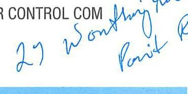
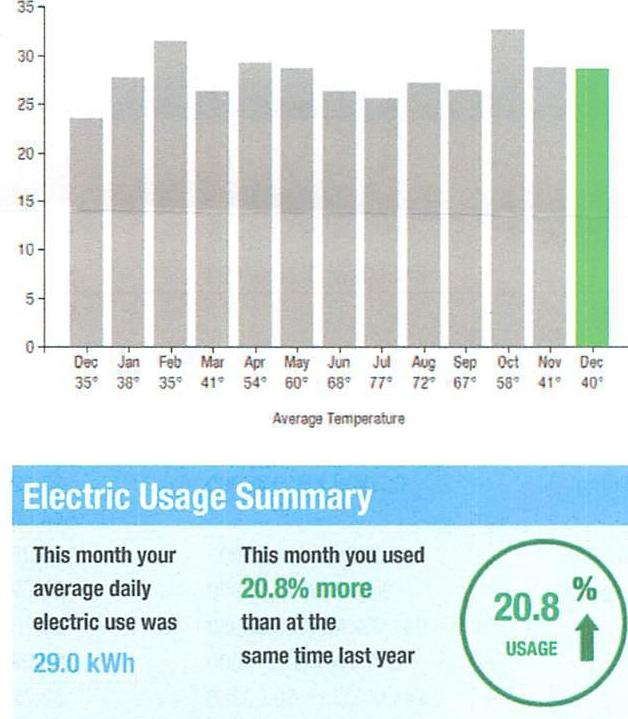
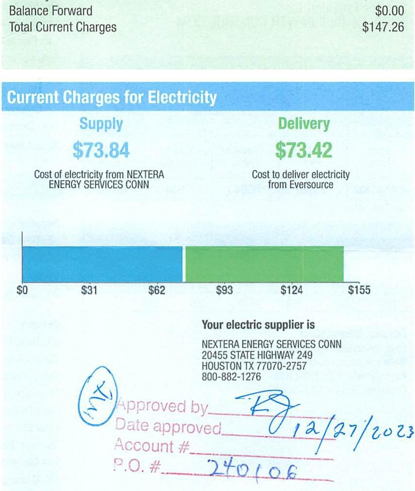

## EVERSEURCE

Account Number: 51407023084
Statement Date: $12 / 15 / 23$
Service Provided To:
TOWN OF BERLIN WTR CONTROL COM

The image is a photo showing handwritten text. The text reads: "27 Worthington Point Rd."

Electric Usage History - Kilowatt Hoges (kWh)

The image is a graph/chart.

- **Chart Type**: Bar chart
- **X-Axis**: Months with average temperatures labeled below each month.
  - Dec 35°
  - Jan 38°
  - Feb 35°
  - Mar 41°
  - Apr 54°
  - May 60°
  - Jun 68°
  - Jul 77°
  - Aug 72°
  - Sep 67°
  - Oct 58°
  - Nov 41°
  - Dec 40°
- **Y-Axis**: No specific title or unit visible, but the scale appears to range from 0 to 35.
- **Legend/Highlight**: The bar for December is highlighted in green.
- **Embedded Text**:
  - "Electric Usage Summary"
  - "This month your average daily electric use was 29.0 kWh"
  - "This month you used 20.8% more than at the same time last year"
  - "20.8% USAGE" with an upward arrow
- **Yearly Usage Breakdown (Monthly-Based)**: The chart shows monthly electric usage with a comparison to the previous year, emphasizing a 20.8% increase in usage for the current December compared to the previous year.

## 6066463 1-4-2024 \$10,559.83

Total Amount Due by $02 / 13 / 24$
Amount Due On 12/11/23
Last Payment Received On 12/13/23
Balance Forward
Total Current Charges
6066463 1-4-2024 \$10,559.83

The image is a photo of a bill statement.

- **Title**: Current Charges for Electricity
- **Sections**:
  - **Supply**: 
    - Amount: $73.84
    - Description: Cost of electricity from NEXTERA ENERGY SERVICES CONN
  - **Delivery**: 
    - Amount: $73.42
    - Description: Cost to deliver electricity from Eversource
- **Graph**: A bar graph showing costs with increments labeled at $0, $31, $62, $93, $124, and $155.
- **Supplier Information**:
  - Name: NEXTERA ENERGY SERVICES CONN
  - Address: 20455 STATE HIGHWAY 249, HOUSTON TX 77070-2757
  - Phone: 800-882-1276
- **Handwritten Notes**:
  - "Approved by" with a signature
  - "Date approved" with "12/27/2023"
  - "Account #" with a blank line
  - "P.O. #" with "240106" written
- **Balance Information**:
  - Balance Forward: $0.00
  - Total Current Charges: $147.26

News For You
A new discount for electric bills is available if you have a financial hardship status on your electric account. Based on your household income or receipt of a public assistance benefit, you may be eligible for a $10 \%$ or $50 \%$ discount off your electric bill per month. For example, if you have a $\$ 100$ monthly bill, it would be $\$ 10$ less if you receive a $10 \%$ discount or $\$ 50$ less if you receive the $50 \%$ discount. See how to enroll at eversource.com/billhelp.

Remit Payment To: Eversource, PO Box 56002, Boston, MA 02205-6002
CE_231215FROD.TXT-7259-888045620

## EVERSEURCE

Account Number: 51407023084
Non-residential and residential non-hardship customers may be subject to a $1.00 \%$ late payment charge if the "Total Amount Due" is not received by $01 / 12 / 24$.

Please make your check payable to Eversource and consider adding $\$ 1$ for Operation Fuel.
You can also add $\$ 2$ or $\$ 3$ when paying your bill online. $100 \%$ of your tax-deductible donation provides energy assistance grants. If mailing, please allow up to 5 business days to post.

## Total Amount Due

by $02 / 13 / 24$
Amount Enclosed
$147.2 b$
$003630000045620$
$H_{f} / I_{f} / I_{f} / I_{f} / I_{f} / I_{f} / I_{f} / I_{f} / I_{f} / I_{f} / I_{f} / I_{f} / I_{f} / I_{f} / I_{f} / I_{f} / I_{f} / I_{f} / I_{f} / I_{f} / I_{f} / I_{f} / I_{f} / I_{f} / I_{f} / I_{f} / I_{f} / I_{f} / I_{f} / I_{f} / I_{f} / I_{f} / I_{f} / I_{f} / I_{f} / I_{f} / I_{f} / I_{f} / I_{f} / I_{f} / I

## EVERSEURCE

Account Number: 51407023084
Customer name key: BERL
Statement Date: 12/15/23
Service Provided To:
TOWN OF BERLIN WTR CONTROL COM

| Svc Add: 27 WORTHINGTON POINT RO BERLIN DT 06037 |  |  |  |  |  |
| :--: | :--: | :--: | :--: | :--: | :--: |
| Sory Ref: 8/8612905 |  |  | Bill Cycle: 09 |  |  |
| Service from 11/09/23 - 12/12/23 |  |  | 33 Days |  |  |
| Next road date on or about: Jan 12-2024 |  |  |  |  |  |
| Meter   Number | Current   Read | Previous Read | Current   Usage | Reading Type |  |
| 890151332 | 80987 | 80043 | 944 | Actual |  |

Total Demand Use $=2.70 \mathrm{~kW}$

| Monthly kWh Use |  |  |  |  |  |
| :--: | :--: | :--: | :--: | :--: | :--: |
| Dec | Jan | Feb | Mar | Apr | May |
| 778 | 860 | 882 | 817 | 877 | 831 |
| Jul | Aug | Sep | Oct | Nov | Dec |
| 767 | 869 | 791 | 946 | 805 | 944 |

## Contact Information

Emergency: 800-286-2000
www.eversource.com
Pay by Phone: 888-783-6618
Customer Service: 888-783-6617

## Total Amount Due by $02 / 13 / 24$

Electric Account Summary
Amount Due On 12/11/23
$\$ 158.96$
Last Payment Received On 12/13/23
$\$ 158.96$
Balance Forward
\$0.00
Current Charges/Credits
Electric Supply Services
$\$ 73.84$
Delivery Services
$\$ 73.42$
Total Current Charges
$\$ 147.26$
Total Amount Due
$\$ 147.26$

## Total Charges for Electricity

## Supplier

NEXTERA ENERGY
Service Reference: 836612005
Supply
$944.00 \mathrm{kWh} \times \$ 0.07822$
$\$ 73.84$
Subtotal Supplier Services
$\$ 73.84$

## Delivery

(DISTRIBUTION RATE: 030)
Service Reference: 836612005
Transmission Demand Chrg
Fixed Monthly Charge
Local Delivery Demand Chrg
Local Delivery Improvements
Revenue Decoupling
CTA Demand Chrg
FMCC Charge
Comb Public Benefit Chrg
Subtotal Delivery Services
Total Cost of Electricity
Total Current Charges
$\$ 147.26$

