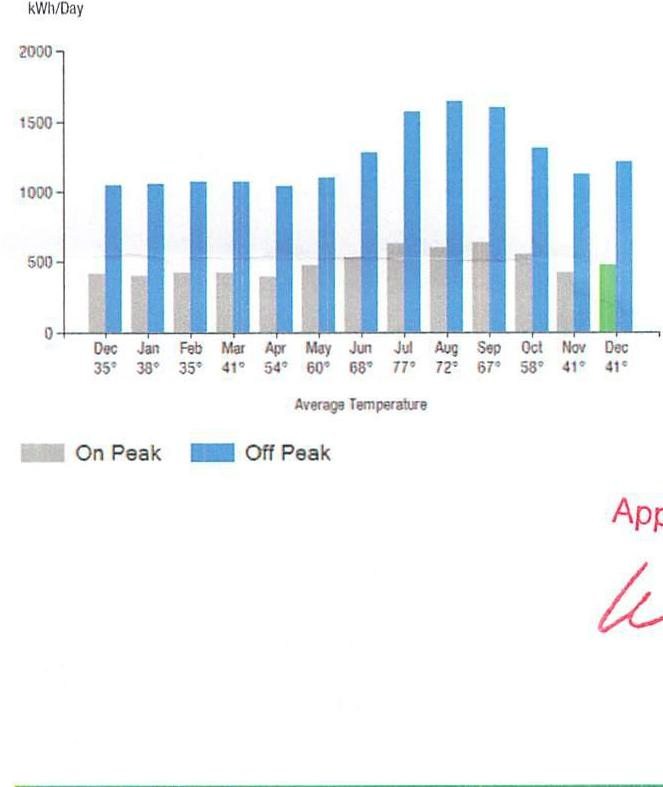
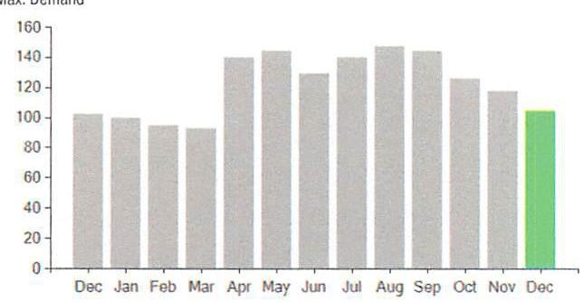

## EVERSEURCE

Account Number: 51600913073
Statement Date: 12/13/23
Service Provided To:
TOWN OF BERLIN BERLIN TOWN HAL

Electric Usage History - Kilowatt Nodes (K90)

The image is a bar chart.

- **Chart Type**: Bar chart
- **Y-Axis Title**: kWh/Day
- **X-Axis Title**: Average Temperature
- **Legend Entries**: 
  - Gray: On Peak
  - Blue: Off Peak
- **Data Points**:
  - December: 35°
  - January: 38°
  - February: 35°
  - March: 41°
  - April: 54°
  - May: 60°
  - June: 68°
  - July: 77°
  - August: 72°
  - September: 67°
  - October: 58°
  - November: 41°
  - December: 41°
- **Yearly Usage Breakdown (Monthly-Based)**: The chart shows monthly electric usage with bars indicating on-peak and off-peak usage. The off-peak usage is represented by blue bars, while on-peak usage is represented by gray bars. The temperature for each month is listed below the month name.

## Newg For You

A new discount for electric bills is available if you have a financial hardship status on your electric account. Based on your household income or receipt of a public assistance benefit, you may be eligible for a $10 \%$ or $50 \%$ discount off your electric bill per month. For example, if you have a $\$ 100$ monthly bill, it would be $\$ 10$ less if you receive a $10 \%$ discount or $\$ 50$ less if you receive the $50 \%$ discount. See how to enroll at eversource.com/billhelp.

Remit Payment To: Eversource, PO Box 56002, Boston, MA 02205-6002

Please make your check payable to Eversource and consider adding $\$ 1$ for Operation Fuel.
You can also add $\$ 2$ or $\$ 3$ when paying your bill online. $100 \%$ of your tax-deductible donation provides energy assistance grants. If mailing, please allow up to 5 business days to post.

Total Amount Due
by $02 / 11 / 24$
Amount Enclosed
$46,125.52$
$15,125.52$
Amount Enclosed
$7681.07$

008322 000022241
$\mathrm{d}\left[\mathrm{H}_{1} \mathrm{H}_{11} \mathrm{H}_{11} \mathrm{H}_{11} \mathrm{H}_{11}\left[\mathrm{HH}_{1}\right]_{1} \mathrm{H}_{11} \mathrm{H}_{11} \mathrm{H}_{11} \mathrm{H}_{11} \mathrm{H}_{11} \mathrm{H}_{11} \mathrm{H}_{11} \mathrm{H}_{11} \mathrm{H}_{11} \mathrm{H}_{11} \mathrm{H}_{11} \mathrm{H}_{11} \mathrm{H}_{11} \mathrm{H}_{11} \mathrm{H}_{11} \mathrm{H}_{11} \mathrm{H}_{11} \mathrm{H}_{11} \mathrm{H}_{11} \mathrm{H}_{11} \mathrm{H}_{11} \mathrm{H}_{11} \mathrm{H}_{11} \mathrm{H}_{11} \mathrm{H}_{11} \mathrm{H}_{11} \mathrm{H}_{11} \mathrm{H}_{11} \mathrm{H}_{11} \mathrm{H}_{11} \mathrm{H}_{11} \mathrm{H}_{11} \mathrm{H}_{11} \mathrm{H}_{11} \mathrm{H}_{11} \mathrm{H}_{11} \mathrm{H}_{11} \mathrm{H}_{11} \mathrm{H}_{11} \mathrm{H}_{11} \mathrm{H}_{11} \mathrm{H}_{11} \mathrm{H}_{11} \mathrm{H}_{11} \mathrm{H}_{11} \mathrm{H}_{11} \mathrm{H}_{11} \mathrm{H}_{11} \mathrm{H}_{11} \mathrm{H}_{11} \mathrm{H}_{11} \mathrm{H}_{11} \mathrm{H}_{11} \mathrm{H}_{11} \mathrm{H}_{11} \mathrm{H}_{11} \mathrm{H}_{11} \mathrm{H}_{11} \mathrm{H}_{11} \mathrm{H}_{11} \mathrm{H}_{11} \mathrm{H}_{11} \mathrm{H}_{11} \mathrm{H}_{11} \mathrm{H}_{11} \mathrm{H}_{11} \mathrm{H}_{11} \mathrm{H}_{11} \mathrm{H}_{11} \mathrm{H}_{11} \mathrm{H}_{11} \mathrm{H}_{11} \mathrm{H}_{11} \mathrm{H}_{11} \mathrm{H}_{11} \mathrm{H}_{11} \mathrm{H}_{11} \mathrm{H}_{11} \mathrm{H}_{11} \mathrm{H}_{11} \mathrm{H}_{11} \mathrm{H}_{11} \mathrm{H}_{11} \mathrm{H}_{11} \mathrm{H}_{11} \mathrm{H}_{11} \mathrm{H}_{11} \mathrm{H}_{11} \mathrm{H}_{11} \mathrm{H}_{11} \mathrm{H}_{11} \mathrm{H}_{11} \mathrm{H}_{11} \mathrm{H}_{11} \mathrm{H}_{11} \mathrm{H}_{11} \mathrm{H}_{11} \mathrm{H}_{11} \mathrm{H}_{11} \mathrm{H}_{11} \mathrm{H}_{11} \mathrm{H}_{11} \mathrm{H}_{11} \mathrm{H}_{11} \mathrm{H}_{11} \mathrm{H}_{11} \mathrm{H}_{11} \mathrm{H}_{11} \mathrm{H}_{11} \mathrm{H}_{11} \mathrm{H}_{11} \mathrm{H}_{11} \mathrm{H}_{11} \mathrm{H}_{11} \mathrm{H}_{11} \mathrm{H}_{11} \mathrm{H}_{11} \mathrm{H}_{11} \mathrm{H}_{11} \mathrm{H}_{11} \mathrm{H}_{11} \mathrm{H}_{11} \mathrm{H}_{11} \mathrm{H}_{11} \mathrm{H}_{11} \mathrm{H}_{11} \mathrm{H}_{11} \mathrm{H}_{11} \mathrm{H}_{11} \mathrm{H}_{11} \mathrm{H}_{11} \mathrm{H}_{11} \mathrm{H}_{11} \mathrm{H}_{11} \mathrm{H}_{11} \mathrm{H}_{11} \mathrm{H}_{11} \mathrm{H}_{11} \mathrm{H}_{11} \mathrm{H}_{11} \mathrm{H}_{11} \mathrm{H}_{11} \mathrm{H}_{11} \mathrm{H}_{11} \mathrm{H}_{11} \mathrm{H}_{11} \mathrm{H}_{11} \mathrm{H}_{11} \mathrm{H}_{11} \mathrm{H}_{11} \mathrm{H}_{11} \mathrm{H}_{11} \mathrm{H}_{11} \mathrm{H}_{11} \mathrm{H}_{11} \mathrm{H}_{11} \mathrm{H}_{11} \mathrm{H}_{11} \mathrm{H}_{11} \mathrm{H}_{11} \mathrm{H}_{11} \mathrm{H}_{11} \mathrm{H}_{11} \mathrm{H}_{11} \mathrm{H}_{11} \mathrm{H}_{11} \mathrm{H}_{11} \mathrm{H}_{11} \mathrm{H}_{11} \mathrm{H}_{11} \mathrm{H}_{11} \mathrm{H}_{11} \mathrm{H}_{11} \mathrm{H}_{11} \mathrm{H}_{11} \mathrm{H}_{11} \mathrm{H}_{11} \mathrm{H}_{11} \mathrm{H}_{11} \mathrm{H}_{11} \mathrm{H}_{11} \mathrm{H}_{11} \mathrm{H}_{11} \mathrm{H}_{11} \mathrm{H}_{11} \mathrm{H}_{11} \mathrm{H}_{11} \mathrm{H}_{11} \mathrm{H}_{11} \mathrm{H}_{11} \mathrm{H}_{11} \mathrm{H}_{11} \mathrm{H}_{11} \mathrm{H}_{11} \mathrm{H}_{11} \mathrm{H}_{11} \mathrm{H}_{11} \mathrm{H}_{11} \mathrm{H}_{11} \mathrm{H}_{11} \mathrm{H}_{11} \mathrm{H}_{11} \mathrm{H}_{11} \mathrm{H}_{11} \mathrm{H}_{11} \mathrm{H}_{11} \mathrm{H}_{11} \mathrm{H}_{11} \mathrm{H}_{11} \mathrm{H}_{11} \mathrm{H}_{11} \mathrm{H}_{11} \mathrm{H}_{11} \mathrm{H}_{11} \mathrm{H}_{11} \mathrm{H}_{11} \mathrm{H}_{11} \mathrm{H}_{11} \mathrm{H}_{11} \mathrm{H}_{11} \mathrm{H}_{11} \mathrm{H}_{11} \mathrm{H}_{11} \mathrm{H}_{11} \mathrm{H}_{11} \mathrm{H}_{11} \mathrm{H}_{11} \mathrm{H}_{11} \mathrm{H}_{11} \mathrm{H}_{11} \mathrm{H}_{11} \mathrm{H}_{11} \mathrm{H}_{11} \mathrm{H}_{11} \mathrm{H}_{11} \mathrm{H}_{11} \mathrm{H}_{11} \mathrm{H}_{11} \mathrm{H}_{11} \mathrm{H}_{11} \mathrm{H}_{11} \mathrm{H}_{11} \mathrm{H}_{11} \mathrm{H}_{11} \mathrm{H}_{11} \mathrm{H}_{11} \mathrm{H}_{11} \mathrm{H}_{11} \mathrm{H}_{11} \mathrm{H}_{11} \mathrm{H}_{11} \mathrm{H}_{11} \mathrm{H}_{11} \mathrm{H}_{11} \mathrm{H}_{11} \mathrm{H}_{11} \mathrm{H}_{11} \mathrm{H}_{11} \mathrm{H}_{11} \mathrm{H}_{11} \mathrm{H}_{11} \mathrm{H}_{11} \mathrm{H}_{11} \mathrm{H}_{11} \mathrm{H}_{11} \mathrm{H}_{11} \mathrm{H}_{11} \mathrm{H}_{11} \mathrm{H}_{11} \mathrm{H}_{11} \mathrm{H}_{11} \mathrm{H}_{11} \mathrm{H}_{11} \mathrm{H}_{11} \mathrm{H}_{11} \mathrm{H}_{11} \mathrm{H}_{11} \mathrm{H}_{11} \mathrm{H}_{11} \mathrm{H}_{11} \mathrm{H}_{11} \mathrm{H}_{11} \mathrm{H}_{11} \mathrm{H}_{11} \mathrm{H}_{11} \mathrm{H}_{11} \mathrm{H}_{11} \mathrm{H}_{11} \mathrm{H}_{11} \mathrm{H}_{11} \mathrm{H}_{11} \mathrm{H}_{11} \mathrm{H}_{11} \mathrm{H}_{11} \mathrm{H}_{11} \mathrm{H}_{11} \mathrm{H}_{11} \mathrm{H}_{11} \mathrm{H}_{11} \mathrm{H}_{11} \mathrm{H}_{11} \mathrm{H}_{11} \mathrm{H}_{11} \mathrm{H}_{11} \mathrm{H}_{11} \mathrm{H}_{11} \mathrm{H}_{11} \mathrm{H}_{11} \mathrm{H}_{11} \mathrm{H}_{11} \mathrm{H}_{11} \mathrm{H}_{11} \mathrm{H}_{11} \mathrm{H}_{11} \mathrm{H}_{11} \mathrm{H}_{11} \mathrm{H}_{11} \mathrm{H}_{11} \mathrm{H}_{11} \mathrm{H}_{11} \mathrm{H}_{11} \mathrm{H}_{11} \mathrm{H}_{11} \mathrm{H}_{11} \mathrm{H}_{11} \mathrm{H}_{11} \mathrm{H}_{11} \mathrm{H}_{11} \mathrm{H}_{11} \mathrm{H}_{11} \mathrm{H}_{11} \mathrm{H}_{11} \mathrm{H}_{11} \mathrm{H}_{11} \mathrm{H}_{11} \mathrm{H}_{11} \mathrm{H}_{11} \mathrm{H}_{11} \mathrm{H}_{11} \mathrm{H}_{11} \mathrm{H}_{11} \mathrm{H}_{11} \mathrm{H}_{11} \mathrm{H}_{11} \mathrm{H}_{11} \mathrm{H}_{11} \mathrm{H}_{11} \mathrm{H}_{11} \mathrm{H}_{11} \mathrm{H}_{11} \mathrm{H}_{11} \mathrm{H}_{11} \mathrm{H}_{11} \mathrm{H}_{11} \mathrm{H}_{11} \mathrm{H}_{11} \mathrm{H}_{11} \mathrm{H}_{11} \mathrm{H}_{11} \mathrm{H}_{11} \mathrm{H}_{11} \mathrm{H}_{11} \mathrm{H}_{11} \mathrm{H}_{11} \mathrm{H}_{11} \mathrm{H}_{11} \mathrm{H}_{11} \mathrm{H}_{11} \mathrm{H}_{11} \mathrm{H}_{11} \mathrm{H}_{11} \mathrm{H}_{11} \mathrm{H}_{11} \mathrm{H}_{11} \mathrm{H}_{11} \mathrm{H}_{11} \mathrm{H}_{11} \mathrm{H}_{11} \mathrm{H}_{11} \mathrm{H}_{11} \mathrm{H}_{11} \mathrm{H}_{11} \mathrm{H}_{11} \mathrm{H}_{11} \mathrm{H}_{11} \mathrm{H}_{11} \mathrm{H}_{11} \mathrm{H}_{11} \mathrm{H}_{11} \mathrm{H}_{11} \mathrm{H}_{11} \mathrm{H}_{11} \mathrm{H}_{11} \mathrm{H}_{11} \mathrm{H}_{11} \mathrm{H}_{11} \mathrm{H}_{11} \mathrm{H}_{11} \mathrm{H}_{11} \mathrm{H}_{11} \mathrm{H}_{11} \mathrm{H}_{11} \mathrm{H}_{11} \mathrm{H}_{11} \mathrm{H}_{11} \mathrm{H}_{11} \mathrm{H}_{11} \mathrm{H}_{11} \mathrm{H}_{11} \mathrm{H}_{11} \mathrm{H}_{11} \mathrm{H}_{11} \mathrm{H}_{11} \mathrm{H}_{11} \mathrm{H}_{11} \mathrm{H}_{11} \mathrm{H}_{11} \mathrm{H}_{11} \mathrm{H}_{11} \mathrm{H}_{11} \mathrm{H}_{11} \mathrm{H}_{11} \mathrm{H}_{11} \mathrm{H}_{11} \mathrm{H}_{11} \mathrm{H}_{11} \mathrm{H}_{11} \mathrm{H}_{11} \mathrm{H}_{11} \mathrm{H}_{11} \mathrm{H}_{11} \mathrm{H}_{11} \mathrm{H}_{11} \mathrm{H}_{11} \mathrm{H}_{11} \mathrm{H}_{11} \mathrm{H}_{11} \mathrm{H}_{11} \mathrm{H}_{11} \mathrm{H}_{11} \mathrm{H}_{11} \mathrm{H}_{11} \mathrm{H}_{11} \mathrm{H}_{11} \mathrm{H}_{11} \mathrm{H}_{11} \mathrm{H}_{11} \mathrm{H}_{11} \mathrm{H}_{11} \mathrm{H}_{11} \mathrm{H}_{11} \mathrm{H}_{11} \mathrm{H}_{11} \mathrm{H}_{11} \mathrm{H}_{11} \mathrm{H}_{11} \mathrm{H}_{11} \mathrm{H}_{11} \mathrm{H}_{11} \mathrm{H}_{11} \mathrm{H}_{11} \mathrm{H}_{11} \mathrm{H}_{11} \mathrm{H}_{11} \mathrm{H}_{11} \mathrm{H}_{11} \mathrm{H}_{11} \mathrm{H}_{11} \mathrm{H}_{11} \mathrm{H}_{11} \mathrm{H}_{11} \mathrm{H}_{11} \mathrm{H}_{11} \mathrm{H}_{11} \mathrm{H}_{11} \mathrm{H}_{11} \mathrm{H}_{11} \mathrm{H}_{11} \mathrm{H}_{11} \mathrm{H}_{11} \mathrm{H}_{11} \mathrm{H}_{11} \mathrm{H}_{11} \mathrm{H}_{11} \mathrm{H}_{11} \mathrm{H}_{11} \mathrm{H}_{11} \mathrm{H}_{11} \mathrm{H}_{11} \mathrm{H}_{11} \mathrm{H}_{11} \mathrm{H}_{11} \mathrm{H}_{11} \mathrm{H}_{11} \mathrm{H}_{11} \mathrm{H}_{11} \mathrm{H}_{11} \mathrm{H}_{11} \mathrm{H}_{11} \mathrm{H}_{11} \mathrm{H}_{11} \mathrm{H}_{11} \mathrm{H}_{11} \mathrm{H}_{11} \mathrm{H}_{11} \mathrm{H}_{11} \mathrm{H}_{11} \mathrm{H}_{11} \mathrm{H}_{11} \mathrm{H}_{11} \mathrm{H}_{11} \mathrm{H}_{11} \mathrm{H}_{11} \mathrm{H}_{11} \mathrm{H}_{11} \mathrm{H}_{11} \mathrm{H}_{11} \mathrm{H}_{11} \mathrm{H}_{11} \mathrm{H}_{11} \mathrm{H}_{11} \mathrm{H}_{11} \mathrm{H}_{11} \mathrm{H}_{11} \mathrm{H}_{11} \mathrm{H}_{11} \mathrm{H}_{11} \mathrm{H}_{11} \mathrm{H}_{11} \mathrm{H}_{11} \mathrm{H}_{11} \mathrm{H}_{11} \mathrm{H}_{11} \mathrm{H}_{11} \mathrm{H}_{11} \mathrm{H}_{11} \mathrm{H}_{11} \mathrm{H}_{11} \mathrm{H}_{11} \mathrm{H}_{11} \mathrm{H}_{11} \mathrm{H}_{11} \mathrm{H}_{11} \mathrm{H}_{11} \mathrm{H}_{11} \mathrm{H}_{11} \mathrm{H}_{11} \mathrm{H}_{11} \mathrm{H}_{11} \mathrm{H}_{11} \mathrm{H}_{11} \mathrm{H}_{11} \mathrm{H}_{11} \mathrm{H}_{11} \mathrm{H}_{11} \mathrm{H}_{11} \mathrm{H}_{11} \mathrm{H}_{11} \mathrm{H}_{11} \mathrm{H}_{11} \mathrm{H}_{11} \mathrm{H}_{11} \mathrm{H}_{11} \mathrm{H}_{11} \mathrm{H}_{11} \mathrm{H}_{11} \mathrm{H}_{11} \mathrm{H}_{11} \mathrm{H}_{11} \mathrm{H}_{11} \mathrm{H}_{11} \mathrm{H}_{11} \mathrm{H}_{11} \mathrm{H}_{11} \mathrm{H}_{11} \mathrm{H}_{11} \mathrm{H}_{11} \mathrm{H}_{11} \mathrm{H}_{11} \mathrm{H}_{11} \mathrm{H}_{11} \mathrm{H}_{11} \mathrm{H}_{11} \mathrm{H}_{11} \mathrm{H}_{11} \mathrm{H}_{11} \mathrm{H}_{11} \mathrm{H}_{11} \mathrm{H}_{11} \mathrm{H}_{11} \mathrm{H}_{11} \mathrm{H}_{11} \mathrm{H}_{11} \mathrm{H}_{11} \mathrm{H}_{11} \mathrm{H}_{11} \mathrm{H}_{11} \mathrm{H}_{11} \mathrm{H}_{11} \mathrm{H}_{11} \mathrm{H}_{11} \mathrm{H}_{11} \mathrm{H}_{11} \mathrm{H}_{11} \mathrm{H}_{11} \mathrm{H}_{11} \mathrm{H}_{11} \mathrm{H}_{11} \mathrm{H}_{11} \mathrm{H}_{11} \mathrm{H}_{11} \mathrm{H}_{11} \mathrm{H}_{11} \mathrm{H}_{11} \mathrm{H}_{11} \mathrm{H}_{11} \mathrm{H}_{11} \mathrm{H}_{11} \mathrm{H}_{11} \mathrm{H}_{11} \mathrm{H}_{11} \mathrm{H}_{11} \mathrm{H}_{11} \mathrm{H}_{11} \mathrm{H}_{11} \mathrm{H}_{11} \mathrm{H}_{11} \mathrm{H}_{11} \mathrm{H}_{11} \mathrm{H}_{11} \mathrm{H}_{11} \mathrm{H}_{11} \mathrm{H}_{11} \mathrm{H}_{11} \mathrm{H}_{11} \mathrm{H}_{11} \mathrm{H}_{11} \mathrm{H}_{11} \mathrm{H}_{11} \mathrm{H}_{11} \mathrm{H}_{11} \mathrm{H}_{11} \mathrm{H}_{11} \mathrm{H}_{11} \mathrm{H}_{11} \mathrm{H}_{11} \mathrm{H}_{11} \mathrm{H}_{11} \mathrm{H}_{11} \mathrm{H}_{11} \mathrm{H}_{11} \mathrm{H}_{11} \mathrm{H}_{11} \mathrm{H}_{11} \mathrm{H}_{11} \mathrm{H}_{11} \mathrm{H}_{11} \mathrm{H}_{11} \mathrm{H}_{11} \mathrm{H}_{11} \mathrm{H}_{11} \mathrm{H}_{11} \mathrm{H}_{11} \mathrm{H}_{11} \mathrm{H}_{11} \mathrm{H}_{11} \mathrm{H}_{11} \mathrm{H}_{11} \mathrm{H}_{11} \mathrm{H}_{11} \mathrm{H}_{11} \mathrm{H}_{11} \mathrm{H}_{11} \mathrm{H}_{11} \mathrm{H}_{11} \mathrm{H}_{11} \mathrm{H}_{11} \mathrm{H}_{11} \mathrm{H}_{11} \mathrm{H}_{11} \mathrm{H}_{11} \mathrm{H}_{11} \mathrm{H}_{11} \mathrm{H}_{11} \mathrm{H}_{11} \mathrm{H}_{11} \mathrm{H}_{11} \mathrm{H}_{11} \mathrm{H}_{11} \mathrm{H}_{11} \mathrm{H}_{11} \mathrm{H}_{11} \mathrm{H}_{11} \mathrm{H}_{11} \mathrm{H}_{11} \mathrm{H}_{11} \mathrm{H}_{11} \mathrm{H}_{11} \mathrm{H}_{11} \mathrm{H}_{11} \mathrm{H}_{11} \mathrm{H}_{11} \mathrm{H}_{11} \mathrm{H}_{11} \mathrm{H}_{11} \mathrm{H}_{11} \mathrm{H}_{11} \mathrm{H}_{11} \mathrm{H}_{11} \mathrm{H}_{11} \mathrm{H}_{11} \mathrm{H}_{11} \mathrm{H}_{11} \mathrm{H}_{11} \mathrm{H}_{11} \mathrm{H}_{11} \mathrm{H}_{11} \mathrm{H}_{11} \mathrm{H}_{11} \mathrm{H}_{11} \mathrm{H}_{11} \mathrm{H}_{11} \mathrm{H}_{11} \mathrm{H}_{11} \mathrm{H}_{11} \mathrm{H}_{11} \mathrm{H}_{11} \mathrm{H}_{11} \mathrm{H}_{11} \mathrm{H}_{11} \mathrm{H}_{11} \mathrm{H}_{11} \mathrm{H}_{11} \mathrm{H}_{11} \mathrm{H}_{11} \mathrm{H}_{11} \mathrm{H}_{11} \mathrm{H}_{11} \mathrm{H}_{11} \mathrm{H}_{11} \mathrm{H}_{11} \mathrm{H}_{11} \mathrm{H}_{11} \mathrm{H}_{11} \mathrm{H}_{11} \mathrm{H}_{11} \mathrm{H}_{11} \mathrm{H}_{11} \mathrm{H}_{11} \mathrm{H}_{11} \mathrm{H}_{11} \mathrm{H}_{11} \mathrm{H}_{11} \mathrm{H}_{11} \mathrm{H}_{11} \mathrm{H}_{11} \mathrm{H}_{11} \mathrm{H}_{11} \mathrm{H}_{11} \mathrm{H}_{11} \mathrm{H}_{11} \mathrm{H}_{11} \mathrm{H}_{11} \mathrm{H}_{11} \mathrm{H}_{11} \mathrm{H}_{11} \mathrm{H}_{11} \mathrm{H}_{11} \mathrm{H}_{11} \mathrm{H}_{11} \mathrm{H}_{11} \mathrm{H}_{11} \mathrm{H}_{11} \mathrm{H}_{11} \mathrm{H}_{11} \mathrm{H}_{11} \mathrm{H}_{11} \mathrm{H}_{11} \mathrm{H}_{11} \mathrm{H}_{11} \mathrm{H}_{11} \mathrm{H}_{11} \mathrm{H}_{11} \mathrm{H}_{11} \mathrm{H}_{11} \mathrm{H}_{11} \mathrm{H}_{11} \mathrm{H}_{11} \mathrm{H}_{11} \mathrm{H}_{11} \mathrm{H}_{11} \mathrm{H}_{11} \mathrm{H}_{11} \mathrm{H}_{11} \mathrm{H}_{11} \mathrm{H}_{11} \mathrm{H}_{11} \mathrm{H}_{11} \mathrm{H}_{11} \mathrm{H}_{11} \mathrm{H}_{11} \mathrm{H}_{11} \mathrm{H}_{11} \mathrm{H}_{11} \mathrm{H}_{11} \mathrm{H}_{11} \mathrm{H}_{11} \mathrm{H}_{11} \mathrm{H}_{11} \mathrm{H}_{11} \mathrm{H}_{11} \mathrm{H}_{11} \mathrm{H}_{11} \mathrm{H}_{11} \mathrm{H}_{11} \mathrm{H}_{11} \mathrm{H}_{11} \mathrm{H}_{11} \mathrm{H}_{11} \mathrm{H}_{11} \mathrm{H}_{11} \mathrm{H}_{11} \mathrm{H}_{11} \mathrm{H}_{11} \mathrm{H}_{11} \mathrm{H}_{11} \mathrm{H}_{11} \mathrm{H}_{11} \mathrm{H}_{11} \mathrm{H}_{11} \mathrm{H}_{11} \mathrm{H}_{11} \mathrm{H}_{11} \mathrm{H}_{11} \mathrm{H}_{11} \mathrm{H}_{11} \mathrm{H}_{11} \mathrm{H}_{11} \mathrm{H}_{11} \mathrm{H}_{11} \mathrm{H}_{11} \mathrm{H}_{11} \mathrm{H}_{11} \mathrm{H}_{11} \mathrm{H}_{11} \mathrm{H}_{11} \mathrm{H}_{11} \mathrm{H}_{11} \mathrm{H}_{11} \mathrm{H}_{11} \mathrm{H}_{11} \mathrm{H}_{11} \mathrm{H}_{11} \mathrm{H}_{11} \mathrm{H}_{11} \mathrm{H}_{11} \mathrm{H}_{11} \mathrm{H}_{11} \mathrm{H}_{11} \mathrm{H}_{11} \mathrm{H}_{11} \mathrm{H}_{11} \mathrm{H}_{11} \mathrm{H}_{11} \mathrm{H}_{11} \mathrm{H}_{11} \mathrm{H}_{11} \mathrm{H}_{11} \mathrm{H}_{11} \mathrm{H}_{11} \mathrm{H}_{11} \mathrm{H}_{11} \mathrm{H}_{11} \mathrm{H}_{11} \mathrm{H}_{11} \mathrm{H}_{11} \mathrm{H}_{11} \mathrm{H}_{11} \mathrm{H}_{11} \mathrm{H}_{11} \mathrm{H}_{11} \mathrm{H}_{11} \mathrm{H}_{11} \mathrm{H}_{11} \mathrm{H}_{11} \mathrm{H}_{11} \mathrm{H}_{11} \mathrm{H}_{11} \mathrm{H}_{11} \mathrm{H}_{11} \mathrm{H}_{11} \mathrm{H}_{11} \mathrm{H}_{11} \mathrm{H}_{11} \mathrm{H}_{11} \mathrm{H}_{11} \mathrm{H}_{11} \mathrm{H}_{11} \mathrm{H}_{11} \mathrm{H}_{11} \mathrm{H}_{11} \mathrm{H}_{11} \mathrm{H}_{11} \mathrm{H}_{11} \mathrm{H}_{11} \mathrm{H}_{11} \mathrm{H}_{11} \mathrm{H}_{11} \mathrm{H}_{11} \mathrm{H}_{11} \mathrm{H}_{11} \mathrm{H}_{11} \mathrm{H}_{11} \mathrm{H}_{11} \mathrm{H}_{11} \mathrm{H}_{11} \mathrm{H}_{11} \mathrm{H}_{11} \mathrm{H}_{11} \mathrm{H}_{11} \mathrm{H}_{11} \mathrm{H}_{11} \mathrm{H}_{11} \mathrm{H}_{11} \mathrm{H}_{11} \mathrm{H}_{11} \mathrm{H}_{11} \mathrm{H}_{11} \mathrm{H}_{11} \mathrm{H}_{11} \mathrm{H}_{11} \mathrm{H}_{11} \mathrm{H}_{11} \mathrm{H}_{11} \mathrm{H}_{11} \mathrm{H}_{11} \mathrm{H}_{11} \mathrm{H}_{11} \mathrm{H}_{11} \mathrm{H}_{11} \mathrm{H}_{11} \mathrm{H}_{11} \mathrm{H}_{11} \mathrm{H}_{11} \mathrm{H}_{11} \mathrm{H}_{11} \mathrm{H}_{11} \mathrm{H}_{11} \mathrm{H}_{11} \mathrm{H}_{11} \mathrm{H}_{11} \mathrm{H}_{11} \mathrm{H}_{11} \mathrm{H}_{11} \mathrm{H}_{11} \mathrm{H}_{11} \mathrm{H}_{11} \mathrm{H}_{11} \mathrm{H}_{11} \mathrm{H}_{11} \mathrm{H}_{11} \mathrm{H}_{11} \mathrm{H}_{11} \mathrm{H}_{11} \mathrm{H}_{11} \mathrm{H}_{11} \mathrm{H}_{11} \mathrm{H}_{11} \mathrm{H}_{11} \mathrm{H}_{11} \mathrm{H}_{11} \mathrm{H}_{11} \mathrm{H}_{11} \mathrm{H}_{11} \mathrm{H}_{11} \mathrm{H}_{11} \mathrm{H}_{11} \mathrm{H}_{11} \mathrm{H}_{11} \mathrm{H}_{11} \mathrm{H}_{11} \mathrm{H}_{11} \mathrm{H}_{11} \mathrm{H}_{11} \mathrm{H}_{11} \mathrm{H}_{11} \mathrm{H}_{11} \mathrm{H}_{11} \mathrm{H}_{11} \mathrm{H}_{11} \mathrm{H}_{11} \mathrm{H}_{11} \mathrm{H}_{11} \mathrm{H}_{11} \mathrm{H}_{11} \mathrm{H}_{11} \mathrm{H}_{11} \mathrm{H}_{11} \mathrm{H}_{11} \mathrm{H}_{11} \mathrm{H}_{11} \mathrm{H}_{11} \mathrm{H}_{11} \mathrm{H}_{11} \mathrm{H}_{11} \mathrm{H}_{11} \mathrm{H}_{11} \mathrm{H}_{11} \mathrm{H}_{11} \mathrm{H}_{11} \mathrm{H}_{11} \mathrm{H}_{11} \mathrm{H}_{11} \mathrm{H}_{11} \mathrm{H}_{11} \mathrm{H}_{11} \mathrm{H}_{11} \mathrm{H}_{11} \mathrm{H}_{11} \mathrm{H}_{11} \mathrm{H}_{11} \mathrm{H}_{11} \mathrm{H}_{11} \mathrm{H}_{11} \mathrm{H}_{11} \mathrm{H}_{11} \mathrm{H}_{11} \mathrm{H}_{11} \mathrm{H}_{11} \mathrm{H}_{11} \mathrm{H}_{11} \mathrm{H}_{11} \mathrm{H}_{11} \mathrm{H}_{11} \mathrm{H}_{11} \mathrm{H}_{11} \mathrm{H}_{11} \mathrm{H}_{11} \mathrm{H}_{11} \mathrm{H}_{11} \mathrm{H}_{11} \mathrm{H}_{11} \mathrm{H}_{11} \mathrm{H}_{11} \mathrm{H}_{11} \mathrm{H}_{11} \mathrm{H}_{11} \mathrm{H}_{11} \mathrm{H}_{11} \mathrm{H}_{11} \mathrm{H}_{11} \mathrm{H}_{11} \mathrm{H}_{11} \mathrm{H}_{11} \mathrm{H}_{11} \mathrm{H}_{11} \mathrm{H}_{11} \mathrm{H}_{11} \mathrm{H}_{11} \mathrm{H}_{11} \mathrm{H}_{11} \mathrm{H}_{11} \mathrm{H}_{11} \mathrm{H}_{11} \mathrm{H}_{11} \mathrm{H}_{11} \mathrm{H}_{11} \mathrm{H}_{11} \mathrm{H}_{11} \mathrm{H}_{11} \mathrm{H}_{11} \mathrm{H}_{11} \mathrm{H}_{11} \mathrm{H}_{11} \mathrm{H}_{11} \mathrm{H}_{11} \mathrm{H}_{11} \mathrm{H}_{11} \mathrm{H}_{11} \mathrm{H}_{11} \mathrm{H}_{11} \mathrm{H}_{11} \mathrm{H}_{11} \mathrm{H}_{11} \mathrm{H}_{11} \mathrm{H}_{11} \mathrm{H}_{11} \mathrm{H}_{11} \mathrm{H}_{11} \mathrm{H}_{11} \mathrm{H}_{11} \mathrm{H}_{11} \mathrm{H}_{11} \mathrm{H}_{11} \mathrm{H}_{11} \mathrm{H}_{11} \mathrm{H}_{11} \mathrm{H}_{11} \mathrm{H}_{11} \mathrm{H}_{11} \mathrm{H}_{11} \mathrm{H}_{11} \mathrm{H}_{11} \mathrm{H}_{11} \mathrm{H}_{11} \mathrm{H}_{11} \mathrm{H}_{11} \mathrm{H}_{11} \mathrm{H}_{11} \mathrm{H}_{11} \mathrm{H}_{11} \mathrm{H}_{11} \mathrm{H}_{11} \mathrm{H}_{11} \mathrm{H}_{11} \mathrm{H}_{11} \mathrm{H}_{11} \mathrm{H}_{11} \mathrm{H}_{11} \mathrm{H}_{11} \mathrm{H}_{11} \mathrm{H}_{11} \mathrm{H}_{11} \mathrm{H}_{11} \mathrm{H}_{11} \mathrm{H}_{11} \mathrm{H}_{11} \mathrm{H}_{11} \mathrm{H}_{11} \mathrm{H}_{11} \mathrm{H}_{11} \mathrm{H}_{11} \mathrm{H}_{11} \mathrm{H}_{11} \mathrm{H}_{11} \mathrm{H}_{11} \mathrm{H}_{11} \mathrm{H}_{11} \mathrm{H}_{11} \mathrm{H}_{11} \mathrm{H}_{11} \mathrm{H}_{11} \mathrm{H}_{11} \mathrm{H}_{11} \mathrm{H}_{11} \mathrm{H}_{11} \mathrm{H}_{11} \mathrm{H}_{11} \mathrm{H}_{11} \mathrm{H}_{11} \mathrm{H}_{11} \mathrm{H}_{11} \mathrm{H}_{11} \mathrm{H}_{11} \mathrm{H}_{11} \mathrm{H}_{11} \mathrm{H}_{11} \mathrm{H}_{11} \mathrm{H}_{11} \mathrm{H}_{11} \mathrm{H}_{11} \mathrm{H}_{11} \mathrm{H}_{11} \mathrm{H}_{11} \mathrm{H}_{11} \mathrm{H}_{11} \mathrm{H}_{11} \mathrm{H}_{11} \mathrm{H}_{11} \mathrm{H}_{11} \mathrm{H}_{11} \mathrm{H}_{11} \mathrm{H}_{11} \mathrm{H}_{11} \mathrm{H}_{11} \mathrm{H}_{11} \mathrm{H}_{11} \mathrm{H}_{11} \mathrm{H}_{11} \mathrm{H}_{11} \mathrm{H}_{11} \mathrm{H}_{11} \mathrm{H}_{11} \mathrm{H}_{11} \mathrm{H}_{11} \mathrm{H}_{11} \mathrm{H}_{11} \mathrm{H}_{11} \mathrm{H}_{11} \mathrm{H}_{11} \mathrm{H}_{11} \mathrm{H}_{11} \mathrm{H}_{11} \mathrm{H}_{11} \mathrm{H}_{11} \mathrm{H}_{11} \mathrm{H}_{11} \mathrm{H}_{11} \mathrm{H}_{11} \mathrm{H}_{11} \mathrm{H}_{11} \mathrm{H}_{11} \mathrm{H}_{11} \mathrm{H}_{11} \mathrm{H}_{11} \mathrm{H}_{11} \mathrm{H}_{11} \mathrm{H}_{11} \mathrm{H}_{11} \mathrm{H}_{11} \mathrm{H}_{11} \mathrm{H}_{11} \mathrm{H}_{11} \mathrm{H}_{11} \mathrm{H}_{11} \mathrm{H}_{11} \mathrm{H}_{11} \mathrm{H}_{11} \mathrm{H}_{11} \mathrm{H}_{11} \mathrm{H}_{11} \mathrm{H}_{11} \mathrm{H}_{11} \mathrm{H}_{11} \mathrm{H}_{11} \mathrm{H}_{11} \mathrm{H}_{11} \mathrm{H}_{11} \mathrm{H}_{11} \mathrm{H}_{11} \mathrm{H}_{11} \mathrm{H}_{11} \mathrm{H}_{11} \mathrm{H}_{11} \mathrm{H}_{11} \mathrm{H}_{11} \mathrm{H}_{11} \mathrm{H}_{11} \mathrm{H}_{11} \mathrm{H}_{11} \mathrm{H}_{11} \mathrm{H}_{11} \mathrm{H}_{11} \mathrm{H}_{11} \mathrm{H}_{11} \mathrm{H}_{11} \mathrm{H}_{11} \mathrm{H}_{11} \mathrm{H}_{11} \mathrm{H}_{11} \mathrm{H}_{11} \mathrm{H}_{11} \mathrm{H}_{11} \mathrm{H}_{11} \mathrm{H}_{11} \mathrm{H}_{11} \mathrm{H}_{11} \mathrm{H}_{11} \mathrm{H}_{11} \mathrm{H}_{11} \mathrm{H}_{11} \mathrm{H}_{11} \mathrm{H}_{11} \mathrm{H}_{11} \mathrm{H}_{11} \mathrm{H}_{11} \mathrm{H}_{11} \mathrm{H}_{11} \mathrm{H}_{11} \mathrm{H}_{11} \mathrm{H}_{11} \mathrm{H}_{11} \mathrm{H}_{11} \mathrm{H}_{11} \mathrm{H}_{11} \mathrm{H}_{11} \mathrm{H}_{11} \mathrm{H}_{11} \mathrm{H}_{11} \mathrm{H}_{11} \mathrm{H}_{11} \mathrm{H}_{11} \mathrm{H}_{11} \mathrm{H}_{11} \mathrm{H}_{11} \mathrm{H}_{11} \mathrm{H}_{11} \mathrm{H}_{11} \mathrm{H}_{11} \mathrm{H}_{11} \mathrm{H}_{11} \mathrm{H}_{11} \mathrm{H}_{11} \mathrm{H}_{11} \mathrm{H}_{11} \mathrm{H}_{11} \mathrm{H}_{11} \mathrm{H}_{11} \mathrm{H}_{11} \mathrm{H}_{11} \mathrm{H}_{11} \mathrm{H}_{11} \mathrm{H}_{11} \mathrm{H}_{11} \mathrm{H}_{11} \mathrm{H}_{11} \mathrm{H}_{11} \mathrm{H}_{11} \mathrm{H}_{11} \mathrm{H}_{11} \mathrm{H}_{11} \mathrm{H}_{11} \mathrm{H}_{11} \mathrm{H}_{11} \mathrm{H}_{11} \mathrm{H}_{11} \mathrm{H}_{11} \mathrm{H}_{11} \mathrm{H}_{11} \mathrm{H}_{11} \mathrm{H}_{11} \mathrm{H}_{11} \mathrm{H}_{11} \mathrm{H}_{11} \mathrm{H}_{11} \mathrm{H}_{11} \mathrm{H}_{11} \mathrm{H}_{11} \mathrm{H}_{11} \mathrm{H}_{11} \mathrm{H}_{11} \mathrm{H}_{11} \mathrm{H}_{11} \mathrm{H}_{11} \mathrm{H}_{11} \mathrm{H}_{11} \mathrm{H}_{11} \mathrm{H}_{11} \mathrm{H}_{11} \mathrm{H}_{11} \mathrm{H}_{11} \mathrm{H}_{11} \mathrm{H}_{11} \mathrm{H}_{11} \mathrm{H}_{11} \mathrm{H}_{11} \mathrm{H}_{11} \mathrm{H}_{11} \mathrm{H}_{11} \mathrm{H}_{11} \mathrm{H}_{11} \mathrm{H}_{11} \mathrm{H}_{11} \mathrm{H}_{11} \mathrm{H}_{11} \mathrm{H}_{11} \mathrm{H}_{11} \mathrm{H}_{11} \mathrm{H}_{11} \mathrm{H}_{11} \mathrm{H}_{11} \mathrm{H}_{11} \mathrm{H}_{11} \mathrm{H}_{11} \mathrm{H}_{11} \mathrm{H}_{11} \mathrm{H}_{11} \mathrm{H}_{11} \mathrm{H}_{11} \mathrm{H}_{11} \mathrm{H}_{11} \mathrm{H}_{11} \mathrm{H}_{11} \mathrm{H}_{11} \mathrm{H}_{11} \mathrm{H}_{11} \mathrm{H}_{11} \mathrm{H}_{11} \mathrm{H}_{11} \mathrm{H}_{11} \mathrm{H}_{11} \mathrm{H}_{11} \mathrm{H}_{11} \mathrm{H}_{11} \mathrm{H}_{11} \mathrm{H}_{11} \mathrm{H}_{11} \mathrm{H}_{11} \mathrm{H}_{11} \mathrm{H}_{11} \mathrm{H}_{11} \mathrm{H}_{11} \mathrm{H}_{11} \mathrm{H}_{11} \mathrm{H}_{11} \mathrm{H}_{11} \mathrm{H}_{11} \mathrm{H}_{11} \mathrm{H}_{11} \mathrm{H}_{11} \mathrm{H}_{11} \mathrm{H}_{11} \mathrm{H}_{11} \mathrm{H}_{11} \mathrm{H}_{11} \mathrm{H}_{11} \mathrm{H}_{11} \mathrm{H}_{11} \mathrm{H}_{11} \mathrm{H}_{11} \mathrm{H}_{11} \mathrm{H}_{11} \mathrm{H}_{11} \mathrm{H}_{11} \mathrm{H}_{11} \mathrm{H}_{11} \mathrm{H}_{11} \mathrm{H}_{11} \mathrm{H}_{11} \mathrm{H}_{11} \mathrm{H}_{11} \mathrm{H}_{11} \mathrm{H}_{11} \mathrm{H}_{11} \mathrm{H}_{11} \mathrm{H}_{11} \mathrm{H}_{11} \mathrm{H}_{11} \mathrm{H}_{11} \mathrm{H}_{11} \mathrm{H}_{11} \mathrm{H}_{11} \mathrm{H}_{11} \mathrm{H}_{11} \mathrm{H}_{11} \mathrm{H}_{11} \mathrm{H}_{11} \mathrm{H}_{11} \mathrm{H}_{11} \mathrm{H}_{11} \mathrm{H}_{11} \mathrm{H}_{11} \mathrm{H}_{11} \mathrm{H}_{11} \mathrm{H}_{11} \mathrm{H}_{11} \mathrm{H}_{11} \mathrm{H}_{11} \mathrm{H}_{11} \mathrm{H}_{11} \mathrm{H}_{11} \mathrm{H}_{11} \mathrm{H}_{11} \mathrm{H}_{11} \mathrm{H}_{11} \mathrm{H}_{11} \mathrm{H}_{11} \mathrm{H}_{11} \mathrm{H}_{11} \mathrm{H}_{11} \mathrm{H}_{11} \mathrm{H}_{11} \mathrm{H}_{11} \mathrm{H}_{11} \mathrm{H}_{11} \mathrm{H}_{11} \mathrm{H}_{11} \mathrm{H}_{11} \mathrm{H}_{11} \mathrm{H}_{11} \mathrm{H}_{11} \mathrm{H}_{11} \mathrm{H}_{11} \mathrm{H}_{11} \mathrm{H}_{11} \mathrm{H}_{11} \mathrm{H}_{11} \mathrm{H}_{11} \mathrm{H}_{11} \mathrm{H}_{11} \mathrm{H}_{11} \mathrm{H}_{11} \mathrm{H}_{11} \mathrm{H}_{11} \mathrm{H}_{11} \mathrm{H}_{11} \mathrm{H}_{11} \mathrm{H}_{11} \mathrm{H}_{11} \mathrm{H}_{11} \mathrm{H}_{11} \mathrm{H}_{11} \mathrm{H}_{11} \mathrm{H}_{11} \mathrm{H}_{11} \mathrm{H}_{11} \mathrm{H}_{11} \mathrm{H}_{11} \mathrm{H}_{11} \mathrm{H}_{11} \mathrm{H}_{11} \mathrm{H}_{11} \mathrm{H}_{11} \mathrm{H}_{11} \mathrm{H}_{11} \mathrm{H}_{11} \mathrm{H}_{11} \mathrm{H}_{11} \mathrm{H}_{11} \mathrm{H}_{11} \mathrm{H}_{11} \mathrm{H}_{11} \mathrm{H}_{11} \mathrm{H}_{11} \mathrm{H}_{11} \mathrm{H}_{11} \mathrm{H}_{11} \mathrm{H}_{11} \mathrm{H}_{11} \mathrm{H}_{11} \mathrm{H}_{11} \mathrm{H}_{11} \mathrm{H}_{11} \mathrm{H}_{11} \mathrm{H}_{11} \mathrm{H}_{11} \mathrm{H}_{11} \mathrm{H}_{11} \mathrm{H}_{11} \mathrm{H}_{11} \mathrm{H}_{11} \mathrm{H}_{11} \mathrm{H}_{11} \mathrm{H}_{11} \mathrm{H}_{11} \mathrm{H}_{11} \mathrm{H}_{11} \mathrm{H}_{11} \mathrm{H}_{11} \mathrm{H}_{11} \mathrm{H}_{11} \mathrm{H}_{11} \mathrm{H}_{11} \mathrm{H}_{11} \mathrm{H}_{11} \mathrm{H}_{11} \mathrm{H}_{11} \mathrm{H}_{11} \mathrm{H}_{11} \mathrm{H}_{11} \mathrm{H}_{11} \mathrm{H}_{11} \mathrm{H}_{11} \mathrm{H}_{11} \mathrm{H}_{11} \mathrm{H}_{11} \mathrm{H}_{11} \mathrm{H}_{11} \mathrm{H}_{11} \mathrm{H}_{11} \mathrm{H}_{11} \mathrm{H}_{11} \mathrm{H}_{11} \mathrm{H}_{11} \mathrm{H}_{11} \mathrm{H}_{11} \mathrm{H}_{11} \mathrm{H}_{11} \mathrm{H}_{11} \mathrm{H}_{11} \mathrm{H}_{11} \mathrm{H}_{11} \mathrm{H}_{11} \mathrm{H}_{11} \mathrm{H}_{11} \mathrm{H}_{11} \mathrm{H}_{11} \mathrm{H}_{11} \mathrm{H}_{11} \mathrm{H}_{11} \mathrm{H}_{11} \mathrm{H}_{11} \mathrm{H}_{11} \mathrm{H}_{11} \mathrm{H}_{11} \mathrm{H}_{11} \mathrm{H}_{11} \mathrm{H}_{11} \mathrm{H}_{11} \mathrm{H}_{11} \mathrm{H}_{11} \mathrm{H}_{11} \mathrm{H}_{11} \mathrm{H}_{11} \mathrm{H}_{11} \mathrm{H}_{11} \mathrm{H}_{11} \mathrm{H}_{11} \mathrm{H}_{11} \mathrm{H}_{11} \mathrm{H}_{11} \mathrm{H}_{11} \mathrm{H}_{11} \mathrm{H}_{11} \mathrm{H}_{11} \mathrm{H}_{11} \mathrm{H}_{11} \mathrm{H}_{11} \mathrm{H}_{11} \mathrm{H}_{11} \mathrm{H}_{11} \mathrm{H}_{11} \mathrm{H}_{11} \mathrm{H}_{11} \mathrm{H}_{11} \mathrm{H}_{11} \mathrm{H}_{11} \mathrm{H}_{11} \mathrm{H}_{11} \mathrm{H}_{11} \mathrm{H}_{11} \mathrm{H}_{11} \mathrm{H}_{11} \mathrm{H}_{11} \mathrm{H}_{11} \mathrm{H}_{11} \mathrm{H}_{11} \mathrm{H}_{11} \mathrm{H}_{11} \mathrm{H}_{11} \mathrm{H}_{11} \mathrm{H}_{11} \mathrm{H}_{11} \mathrm{H}_{11} \mathrm{H}_{11} \mathrm{H}_{11} \mathrm{H}_{11} \mathrm{H}_{11} \mathrm{H}_{11} \mathrm{H}_{11} \mathrm{H}_{11} \mathrm{H}_{11} \mathrm{H}_{11} \mathrm{H}_{11} \mathrm{H}_{11} \mathrm{H}_{11} \mathrm{H}_{11} \mathrm{H}_{11} \mathrm{H}_{11} \mathrm{H}_{11} \mathrm{H}_{11} \mathrm{H}_{11} \mathrm{H}_{11} \mathrm{H}_{11} \mathrm{H}_{11} \mathrm{H}_{11} \mathrm{H}_{11} \mathrm{H}_{11} \mathrm{H}_{11} \mathrm{H}_{11} \mathrm{H}_{11} \mathrm{H}_{11} \mathrm{H}_{11} \mathrm{H}_{11} \mathrm{H}_{11} \mathrm{H}_{11} \mathrm{H}_{11} \mathrm{H}_{11} \mathrm{H}_{11} \mathrm{H}_{11} \mathrm{H}_{11} \mathrm{H}_{11} \mathrm{H}_{11} \mathrm{H}_{11} \mathrm{H}_{11} \mathrm{H}_{11} \mathrm{H}_{11} \mathrm{H}_{11} \mathrm{H}_{11} \mathrm{H}_{11} \mathrm{H}_{11} \mathrm{H}_{11} \mathrm{H}_{11} \mathrm{H}_{11} \mathrm{H}_{11} \mathrm{H}_{11} \mathrm{H}_{11} \mathrm{H}_{11} \mathrm{H}_{11} \mathrm{H}_{11} \mathrm{H}_{11} \mathrm{H}_{11} \mathrm{H}_{11} \mathrm{H}_{11} \mathrm{H}_{11} \mathrm{H}_{11} \mathrm{H}_{11} \mathrm{H}_{11} \mathrm{H}_{11} \mathrm{H}_{11} \mathrm{H}_{11} \mathrm{H}_{11} \mathrm{H}_{11} \mathrm{H}_{11} \mathrm{H}_{11} \mathrm{H}_{11} \mathrm{H}_{11} \mathrm{H}_{11} \mathrm{H}_{11} \mathrm{H}_{11} \mathrm{H}_{11} \mathrm{H}_{11} \mathrm{H}_{11} \mathrm{H}_{11} \mathrm{H}_{11} \mathrm{H}_{11} \mathrm{H}_{11} \mathrm{H}_{11} \mathrm{H}_{11} \mathrm{H}_{11} \mathrm{H}_{11} \mathrm{H}_{11} \mathrm{H}_{11} \mathrm{H}_{11} \mathrm{H}_{11} \mathrm{H}_{11} \mathrm{H}_{11} \mathrm{H}_{11} \mathrm{H}_{11} \mathrm{H}_{11} \mathrm{H}_{11} \mathrm{H}_{11} \mathrm{H}_{11} \mathrm{H}_{11} \mathrm{H}_{11} \mathrm{H}_{11} \mathrm{H}_{11} \mathrm{H}_{11} \mathrm{H}_{11} \mathrm{H}_{11} \mathrm{H}_{11} \mathrm{H}_{11} \mathrm{H}_{11} \mathrm{H}_{11} \mathrm{H}_{11} \mathrm{H}_{11} \mathrm{H}_{11} \mathrm{H}_{11} \mathrm{H}_{11} \mathrm{H}_{11} \mathrm{H}_{11} \mathrm{H}_{11} \mathrm{H}_{11} \mathrm{H}_{11} \mathrm{H}_{11} \mathrm{H}_{11} \mathrm{H}_{11} \mathrm{H}_{11} \mathrm{H}_{11} \mathrm{H}_{11} \mathrm{H}_{11} \mathrm{H}_{11} \mathrm{H}_{11} \mathrm{H}_{11} \mathrm{H}_{11} \mathrm{H}_{11} \mathrm{H}_{11} \mathrm{H}_{11} \mathrm{H}_{11} \mathrm{H}_{11} \mathrm{H}_{11} \mathrm{H}_{11} \mathrm{H}_{11} \mathrm{H}_{11} \mathrm{H}_{11} \mathrm{H}_{11} \mathrm{H}_{11} \mathrm{H}_{11} \mathrm{H}_{11} \mathrm{H}_{11} \mathrm{H}_{11} \mathrm{H}_{11} \mathrm{H}_{11} \mathrm{H}_{11} \mathrm{H}_{11} \mathrm{H}_{11} \mathrm{H}_{11} \mathrm{H}_{11} \mathrm{H}_{11} \mathrm{H}_{11} \mathrm{H}_{11} \mathrm{H}_{11} \mathrm{H}_{11} \mathrm{H}_{11} \mathrm{H}_{11} \mathrm{H}_{11} \mathrm{H}_{11} \mathrm{H}_{11} \mathrm{H}_{11} \mathrm{H}_{11} \mathrm{H}_{11} \mathrm{H}_{11} \mathrm{H}_{11} \mathrm{H}_{11} \mathrm{H}_{11} \mathrm{H}_{11} \mathrm{H}_{11} \mathrm{H}_{11

## EVERSEURCE

Account Number: 51600913073
Customer name key: BERL
Statement Date: 12/13/23
Service Provided To:
TOWN OF BERLIN BERLIN TOWN HAL

| Svc Addr: 240 KENSINGTON RD KENSINGTON DT 06937 |  |  |  |  |  |
| :--: | :--: | :--: | :--: | :--: | :--: |
| Serv Ret: 142343002 |  |  | Bill Cycle: 10 |  |  |
| Service from 11/12/23 - 12/13/23 |  |  | 30 Days |  |  |
| Next read date on or about Jan 15, 2024 |  |  |  |  |  |
| Meter   Number | Current Read | Previous Read | Current   Usage | Reading Type |  |
| 081241711 | 3323 | 3234 | 89 | On Peak |  |
| 081241711 | 8194 | 7967 | 227 | Off Peak |  |

Total Demand Use $=104.20 \mathrm{~kW}$
$89 \times$ Meter Constant of $160=14240$ Billed Usage
227 X Meter Constant of $160=36320$ Billed Usage
Max Off-Peak Demand: 104.2 kW
Max On-Peak Demand: 103.4 kW

| Monthly kWh Use - On Peak |  |  |  |  |  |
| :--: | :--: | :--: | :--: | :--: | :--: |
| Dec | Jan | Feb | Mar | Apr | May |
| 12480 | 13120 | 11840 | 12160 | 11840 | 13760 |
| Jul | Aug | Sep | Oct | Nov | Dec |
| 18880 | 19200 | 19200 | 16000 | 13120 | 14240 |

| Monthly kWh Use - Off Peak |  |  |  |  |  |
| :--: | :--: | :--: | :--: | :--: | :--: |
| Dec | Jan | Feb | Mar | Apr | May |
| 31360 | 34720 | 29760 | 30880 | 31200 | 31840 |
| Jul | Aug | Sep | Oct | Nov | Dec |
| 46880 | 52480 | 47840 | 37760 | 34560 | 36320 |

Contact Information
Emergency: 800-286-2000
www.eversource.com
Pay by Phone: 888-783-6618
Customer Service: 888-783-6617

## Total Amount Due

by $62 / 11 / 24$

## $15,125.52

Electric Account Summary
Amount Due On 12/11/23
Last Payment Received
$7,444.45$
$0.00
Balance Forward
$7,444.45
Current Charges/Credits
Electric Supply Services
Delivery Services
Other Charges or Credits
Total Current Charges
Total Amount Due

Total Charges for Electricity

## Supplier

NEXTERA ENERGY
Service Reference: 142343002
Supply
Subtotal Supplier Services
$3,954.80
Delivery
(DISTRIBUTION RATE: 037)
Service Reference: 142343002
Prod/Trans Dmd Chrg
Transmission Peak
Transmission Off-Peak
Fixed Monthly Charge
Local Delivery Demand Chrg
Local Delivery Improvements
Revenue Decoupling Peak
Revenue Decoupling Off-Peak
Prod/Trans CTA Dmd Chrg
FMCC Charge Peak
FMCC Charge Off-Peak
Comb Public Benefit Chrg
Subtotal Delivery Services

| 103.40KW X $\$ 5.94000$ | $\$ 614.20$ |
| :-- | --: |
| 14240.00kWh X $\$ 0.03755$ | $\$ 534.71$ |
| 36320.00kWh X $\$ 0.00842$ | $\$ 305.81$ |
|  | $\$ 270.00$ |
| 147.40KW X $\$ 8.69000$ | $\$ 1,280.91$ |
| 147.40KW X $\$ 1.33000$ | $\$ 196.04$ |
| 14240.00kWh X $\$ 0.00080$ | $\$ 11.39$ |
| 36320.00kWh X $\$ 0.00080$ | $\$ 29.06$ |
| 103.40KW X $\$-0.16000$ | - $\$ 16.54$ |
| 14240.00kWh X $\$ 0.00596$ | $\$ 84.87$ |
| 36320.00kWh X $\$ 0.00133$ | $\$ 48.31$ |
| 50560.00kWh X $\$ 0.00730$ | $\$ 369.09$ |
|  | $\$ 3,727.85$ |

CE_231213PRCO.TXT-16944-00022241

## EVERSEURCE

Account Number: 51600913073
Customer name key: BERL
Statement Date: 12/13/23
Service Provided To:
TOWN OF BERLIN BERLIN TOWN HAL

Continued from previous page...

## Supply Rate

Dollars / kWh

The image is a bar chart.

- **Chart Type**: Bar chart
- **X-Axis**: Months (Dec, Jan, Feb, Mar, Apr, May, Jun, Jul, Aug, Sep, Oct, Nov, Dec)
- **Y-Axis**: Unlabeled, but numerical values are shown (0, 20, 40, 60, 80, 100, 120, 140, 160)
- **Data Points**: 
  - Dec: ~100
  - Jan: ~90
  - Feb: ~90
  - Mar: ~100
  - Apr: ~140
  - May: ~140
  - Jun: ~120
  - Jul: ~140
  - Aug: ~140
  - Sep: ~120
  - Oct: ~100
  - Nov: ~100
  - Dec: ~110 (highlighted in green)
- **Styling**: The bar for December is highlighted in green, while the other bars are in gray.
- **Yearly usage breakdown (monthly-based)**: The chart shows monthly demand, with the highest demand in April, May, July, and August, and the lowest in January and February.

Demand Profile
Max. Demand

The image is a bar chart.

- **Chart Type**: Bar chart
- **X-Axis**: Months (Dec, Jan, Feb, Mar, Apr, May, Jun, Jul, Aug, Sep, Oct, Nov, Dec)
- **Y-Axis**: Unlabeled, but numerical values are shown (0, 20, 40, 60, 80, 100, 120, 140, 160)
- **Data Points**: 
  - Dec: ~100
  - Jan: ~90
  - Feb: ~90
  - Mar: ~100
  - Apr: ~140
  - May: ~140
  - Jun: ~120
  - Jul: ~140
  - Aug: ~140
  - Sep: ~120
  - Oct: ~100
  - Nov: ~100
  - Dec: ~110 (highlighted in green)
- **Styling**: The bar for December is highlighted in green, while the other bars are in gray.
- **Yearly usage breakdown (monthly-based)**: The chart shows monthly demand, with the highest demand in April, May, July, and August, and the lowest in January and February.

Total Amount Due
by $02 / 11 / 24$
Continued from previous page...
Total Cost of Electricity
$\$ 7,682.65$

Other Charges or Credits
Balance Transfer Dec 07
$-\$ 1.58$
Subtotal Other Charges or Credits
Total Current Charges
$\$ 7,681.07$

