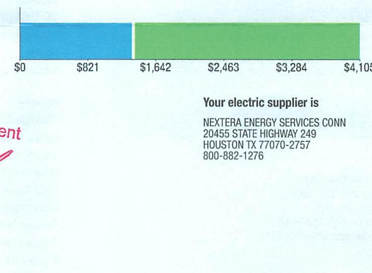
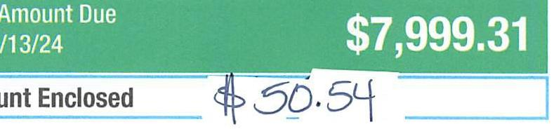
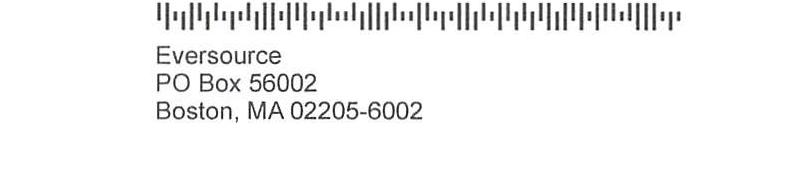
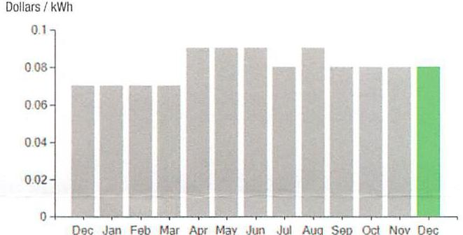

## EVERSEURCE

Account Number: 51960513026
Statement Date: 12/15/23
Service Provided To:
TOWN OF BERLIN BOARD OF EDUCAT

At Eversource, we appreciate your contribution to renewable energy and welcome you to your new cogeneration billing! Each month the electricity you purchase and the amount of any excess electricity you generate will be displayed on your statement.

Please remember the amount of energy you generate will differ from your sales amount, which refers to the amount of generated energy that is unused and sold back to the electric grid.

Total Amount Due
by $92 / 13 / 24$
Amount Due On 12/11/23
Last Payment Received On 11/15/23
Balance Forward
Total Current Charges

## Gurrent Charges for Electricity

Supply
\$1,351.64
Cost of electricity from NEXTERA ENERGY SERVICES CONN

## $2,747.84$

Cost to deliver electricity from Eversource

The image is a bar chart.

- **Chart Type**: Bar chart
- **Data Points**:
  - $0
  - $821
  - $1,642
  - $2,463
  - $3,284
  - $4,105
- **Text**:
  - "Your electric supplier is"
  - "NEXTERA ENERGY SERVICES CONN"
  - "20455 STATE HIGHWAY 249"
  - "HOUSTON TX 77070-2757"
  - "800-882-1276"
- **Styling**: The chart has a blue section followed by a green section, indicating different categories or segments.

## News For You

A new discount for electric bills is available if you have a financial hardship status on your electric account. Based on your household income or receipt of a public assistance benefit, you may be eligible for a $10 \%$ or $50 \%$ discount off your electric bill per month. For example, if you have a $\$ 100$ monthly bill, it would be $\$ 10$ less if you receive a $10 \%$ discount or $\$ 50$ less if you receive the $50 \%$ discount. See how to enroll at eversource.com/billhelp.

Remit Payment To: Eversource, PO Box 56002, Boston, MA 02205-6002
CE_231216PROC.TXT-5651-000040331

## EVERSEURCE

Account Number: 51960513026
Non-residential and residential non-hardship customers may be subject to a 1.00\% late payment charge if the "Total Amount Due" is not received by $01 / 12 / 24$.

## $7,999.31$

Amount Enclosed

The image is a photo of a section of a billing statement.

- **Text**:
  - "Amount Due"
  - "1/13/24"
  - "$7,999.31"
  - "Amount Enclosed"
  - "$50.54"

- **Styling**: The background is green with white text for the amount due. The amount enclosed is handwritten in blue ink.

002831000046331

The image is a photo of a section of a billing statement.

- **Text**:
  - "Eversource"
  - "PO Box 56002"
  - "Boston, MA 02205-6002"

- **Styling**: The text is printed in black on a white background, with a barcode above the address.

## EVERSEURCE

Account Number: 51960513026
Customer name key: BERL
Statement Date: 12/15/23
Service Provided To:
TOWN OF BERLIN BOARD OF EDUCAT

| Svc Add: 135 GROVE ST |  |  |  |  |
| :--: | :--: | :--: | :--: | :--: |
| CAST BERLIN ET 66023 |  |  |  |  |
| Serv Roll 602312007 |  |  | Bill Cycle: 09 |  |
| Service Trim 11/08/23 - 12/12/23 |  |  | 33 Days |  |
| Next road date on or about - Jan 12, 2024 |  |  |  |  |
| Meter | Current | Previous | Current | Reading |
| Number | Read | Read |  | Type |
| 894288482 | 8373 | 8252 | 121 | Purchases |
| 894288482 | 2467 | 2454 | 13 | Sales |

Total Demand Use $=95.50 \mathrm{~kW}$
121 X Meter Constant of $160=19360$ Billed Usage for 33 days
13 X Meter Constant of $160=2080$ Billed Usage for 33 days

| Previous   Carry   Forward | Plus   Current   Sales   (Customer) | Minus   Current   Purchases   (Eversource) | Current   Net Billed   Usage | New   Carry   Forward |
| :--: | :--: | :--: | :--: | :--: |
| 0 | 2080 | 19360 | 17280 | 0 |

## Contact Information

Emergency: 800-286-2000
www.eversource.com
Pay by Phone: 888-783-6618
Customer Service: 888-783-6617

Total Amount Due by 02/13/24

## Electric Account Summary

Amount Due On 12/11/23
Last Payment Received On 11/15/23
Balance Forward
Current Charges/Credits
Electric Supply Services
Delivery Services
Total Current Charges
Total Amount Due

Total Charges for Electricity

## Supplier

NEXTERA ENERGY
Service Reference: 602312007
Supply
Subtotal Supplier Services

## Delivery

(DISTRIBUTION RATE: 030)
Service Reference: 602312007
Transmission Demand Chrg
Fixed Monthly Charge
Local Delivery Demand Chrg
Local Delivery Improvements
Revenue Decoupling
Systems Benefit Chrg
Conserv Adj*
Renew Enrgy Invstmnt Chrg
CTA Demand Chrg
FMCC Charge
Subtotal Delivery Services
Total Cost of Electricity

Total Current Charges
$\$ 7,999.31$
$\qquad$
$\qquad$
$\qquad$
$\qquad$

# EVERSEURCE 

Account Number: 51960513026
Customer name-key: BERL
Statement Date: 12/15/23
Service Provided To:
TOWN OF BERLIN BOARD OF EDUCAT

Continued from previous page...

Supply Rate

The image is a bar chart.

- **Chart Type**: Bar chart
- **Y-Axis Title**: Dollars / kWh
- **X-Axis Labels**: Dec, Jan, Feb, Mar, Apr, May, Jun, Jul, Aug, Sep, Oct, Nov, Dec
- **Data Points**: 
  - Dec: ~0.07
  - Jan: ~0.07
  - Feb: ~0.07
  - Mar: ~0.09
  - Apr: ~0.09
  - May: ~0.09
  - Jun: ~0.09
  - Jul: ~0.08
  - Aug: ~0.08
  - Sep: ~0.08
  - Oct: ~0.07
  - Nov: ~0.07
  - Dec: ~0.08 (highlighted in green)
- **Notable Styling**: The bar for December is highlighted in green, while all other bars are in gray.

This represents a **yearly usage breakdown (monthly-based)** of the supply rate in dollars per kWh.

Demand Profile
Max. Demand

The image is a bar chart.

- **Chart Type**: Bar chart
- **Y-Axis Title**: Max. Demand
- **X-Axis Labels**: Dec, Jan, Feb, Mar, Apr, May, Jun, Jul, Aug, Sep, Oct, Nov, Dec
- **Data Points**: 
  - Dec: ~80
  - Jan: ~70
  - Feb: ~70
  - Mar: ~70
  - Apr: ~50
  - May: ~50
  - Jun: ~120
  - Jul: ~100
  - Aug: ~100
  - Sep: ~80
  - Oct: ~80
  - Nov: ~80
  - Dec: ~90 (highlighted in green)
- **Notable Styling**: The bar for December is highlighted in green, while all other bars are in gray.

