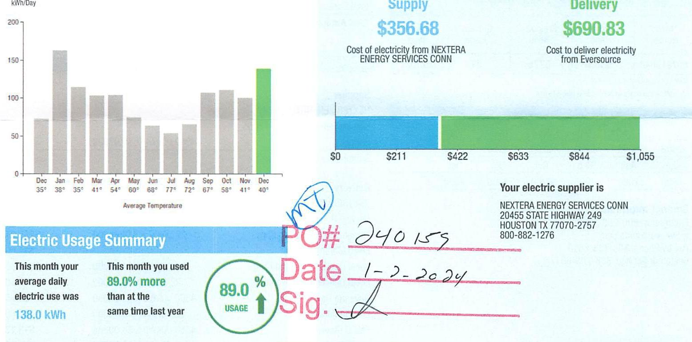
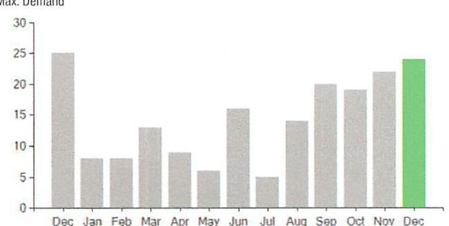

## EVERSEURCE

Account Number: 51561813064
Statement Date: $12 / 15 / 23$
Service Provided To:
TOWN OF BERLIN PUBLIC GROUNDS

## Electric Usage History - Kilnwott House (kWh)

The image is a combination of a bar chart and a summary section related to electric usage.

- **Chart Type**: Bar chart
- **X-Axis**: Months with average temperatures labeled below each month (e.g., Dec 35°, Jan 38°, etc.).
- **Y-Axis**: kWh/Day, ranging from 0 to 200.
- **Data Points**: 
  - Dec: ~130 kWh/Day
  - Jan: ~170 kWh/Day
  - Feb: ~110 kWh/Day
  - Mar: ~100 kWh/Day
  - Apr: ~80 kWh/Day
  - May: ~70 kWh/Day
  - Jun: ~60 kWh/Day
  - Jul: ~70 kWh/Day
  - Aug: ~90 kWh/Day
  - Sep: ~100 kWh/Day
  - Oct: ~110 kWh/Day
  - Nov: ~100 kWh/Day
  - Dec: ~150 kWh/Day (highlighted in green)

- **Yearly Usage Breakdown (Monthly-Based)**: The chart shows monthly electric usage in kWh/Day with corresponding average temperatures.

- **Styling**: The December bar is highlighted in green.

- **Embedded Text**:
  - "Electric Usage Summary"
  - "This month your average daily electric use was 138.0 kWh"
  - "This month you used 89.0% more than at the same time last year"
  - "89.0% USAGE"
  - "Supply $356.68 Cost of electricity from NEXTERA ENERGY SERVICES CONN"
  - "Delivery $690.83 Cost to deliver electricity from Eversource"
  - "Your electric supplier is NEXTERA ENERGY SERVICES CONN 20455 STATE HIGHWAY 249 HOUSTON TX 77070-2757 800-882-1276"
  - "PO# 240155"
  - "Date 1-2-2024"
  - "Sig."

## News For You

A new discount for electric bills is available if you have a financial hardship status on your electric account. Based on your household income or receipt of a public assistance benefit, you may be eligible for a $10 \%$ or $50 \%$ discount off your electric bill per month. For example, if you have a $\$ 100$ monthly bill, it would be $\$ 10$ less if you receive a $10 \%$ discount or $\$ 50$ less if you receive the $50 \%$ discount. See how to enroll at eversource.com/billhelp.

Remit Payment To: Eversource, PO Box 56002, Boston, MA 02205-6002
CE_231218PROC.TXT-6749-08045842

## EVERSEURCE

Account Number: 51561813064
Non-residential and residential non-hardship customers may be subject to a $1.00 \%$ late payment charge if the "Total Amount Due" is not received by $01 / 12 / 24$.

## $1,891.92$

Amount Enclosed
$047.51$

003375000045842
$100000000000000000000000000000000000000000000000000000000000000000000000000000000000000000000000000000000000000000000000000000000000000000000000000000000000000000000000000000000000000000000000000000000

## EVERSEURCE

Account Number: 51561813064
Customer name key: BERL
Statement Date: 12/15/23
Service Provided To:
TOWN OF BERLIN PUBLIC GROUNDS

| Svc Add: 1567 BERLIN TPKE BERLIN ET 06057 |  |  |  |  |  |
| :--: | :--: | :--: | :--: | :--: | :--: |
| Serv Ref: 335512005 |  |  | Bill Cycle: 69 |  |  |
| Service from 11/08/23 - 12/12/23 |  |  | 33 Days |  |  |
| Next read date on or about: Jan 12, 2024 |  |  |  |  |  |
| Meter   Number | Current   Read | Previous   Read | Current   Usage |  | Reading   Type |
| 892916042 | 5333 | 5276 | 57 |  | Actual |
| Total Demand Use $=24.20 \mathrm{~kW}$ |  |  |  |  |  |
| 57 X Meter Constant of $80=4,560$ Billed Usage |  |  |  |  |  |
| Monthly kWh Use |  |  |  |  |  |
| Dec | Jan | Feb | Mar | Apr | May | Jun |
| 2400 | 5040 | 3200 | 3200 | 3120 | 2160 | 2080 |
| Jul | Aug | Sep | Oct | Nov | Dec |  |
| 1600 | 2080 | 3200 | 3200 | 2800 | 4560 |  |

## Contact Information

Emergency: 800-286-2000
www.eversource.com
Pay by Phone: 888-783-6618
Customer Service: 888-783-6617

Total Amount Due
by $02 / 13 / 24$

## $1,891.92

Electric Account Summary
Amount Due On 12/11/23
Last Payment Received On 11/22/23
Balance Forward
Current Charges/Credits
Electric Supply Services
Delivery Services
Total Current Charges
Total Amount Due

## Total Charges for Electricity

## Supplier

NEXTERA ENERGY
Service Reference: 335512005 Supply
Subtotal Supplier Services

## Delivery

(DISTRIBUTION RATE: 030)
Service Reference: 335512005
Transmission Demand Chrg
Fixed Monthly Charge
Local Delivery Demand Chrg
Local Delivery Improvements
Revenue Decoupling
CTA Demand Chrg
FMCC Charge
Comb Public Benefit Chrg
Subtotal Delivery Services
Total Cost of Electricity

Total Current Charges
$1,636.10
$-$ 791.69
\$844.41
\$356.68
\$690.83
\$1,047.51
\$1,891.92

## $4560.00 \mathrm{kWh} \times \$ 0.007822$   \$356.68

\$356.68

## $22.20 \mathrm{KW} \times \$ 10.46000$   \$44.00

\$315.68
\$50.39
\$3.65
\$2.89
\$13.13
\$34.66
\$690.83

## \$1,047.51

\$1,047.51

Total Current Charges

# EVERSEURCE 

Account Number: 51561813064
Customer name key: BERL
Statement Date: 12/15/23
Service Provided To:
TOWN OF BERLIN PUBLIC GROUNDS

Continued from previous page...

Supply Rate
Dollars / kWh

The image is a bar chart.

- **Chart Type**: Bar chart
- **X-Axis**: Months (Dec, Jan, Feb, Mar, Apr, May, Jun, Jul, Aug, Sep, Oct, Nov, Dec)
- **Y-Axis**: No title visible, but the scale is numerical, ranging from 0 to 30.
- **Legend/Labels**: Not explicitly labeled, but the chart represents "Max. Demand."
- **Data Points**:
  - December (first): ~25
  - January: ~10
  - February: ~10
  - March: ~5
  - April: ~5
  - May: ~10
  - June: ~15
  - July: ~10
  - August: ~15
  - September: ~15
  - October: ~15
  - November: ~20
  - December (second): ~25
- **Styling**: The bars are gray, except for the last bar (December), which is highlighted in green.
- **Yearly Usage Breakdown (Monthly-Based)**: The chart shows the maximum demand for each month, with a notable increase in December.

Demand Profile
Max. Demand

The image is a bar chart.

- **Chart Type**: Bar chart
- **X-Axis**: Months (Dec, Jan, Feb, Mar, Apr, May, Jun, Jul, Aug, Sep, Oct, Nov, Dec)
- **Y-Axis**: No title visible, but the scale is numerical, ranging from 0 to 30.
- **Legend/Labels**: Not explicitly labeled, but the chart represents "Max. Demand."
- **Data Points**:
  - December (first): ~25
  - January: ~10
  - February: ~10
  - March: ~5
  - April: ~5
  - May: ~10
  - June: ~15
  - July: ~10
  - August: ~15
  - September: ~15
  - October: ~15
  - November: ~20
  - December (second): ~25
- **Styling**: The bars are gray, except for the last bar (December), which is highlighted in green.
- **Yearly Usage Breakdown (Monthly-Based)**: The chart shows the maximum demand for each month, with a notable increase in December.

