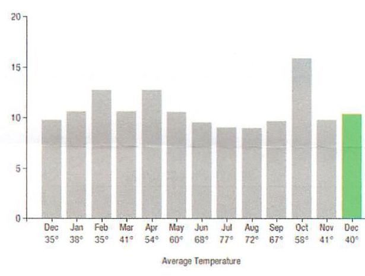
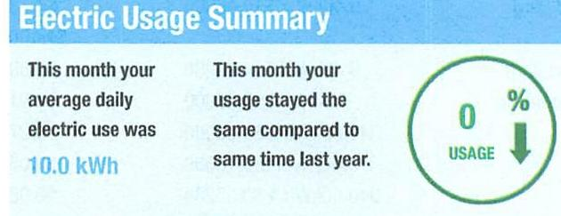
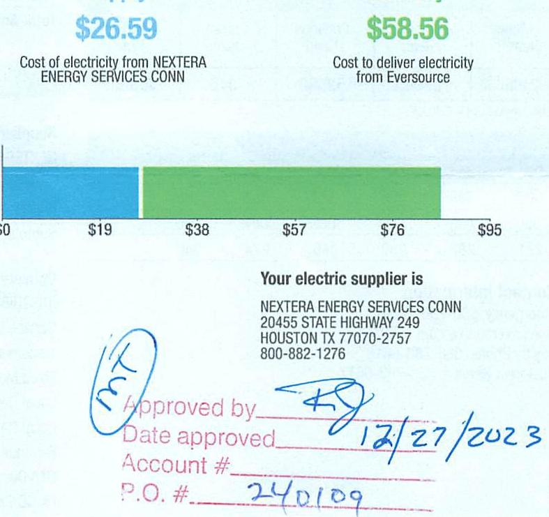

## EVERSEURCE

Account Number: 51745023069
Statement Date: 12/15/23
Service Provided To:
TOWN OF BERLIN WATER CONTROL C
Qufid

The image is a bar chart.

- **Chart Type**: Bar chart
- **X-Axis**: Months with average temperatures labeled below each month.
  - Dec 35°
  - Jan 39°
  - Feb 35°
  - Mar 41°
  - Apr 54°
  - May 60°
  - Jun 68°
  - Jul 77°
  - Aug 72°
  - Sep 67°
  - Oct 58°
  - Nov 41°
  - Dec 40°
- **Y-Axis**: No specific title, but the scale ranges from 0 to 20.
- **Data Representation**: Bars represent some form of usage or measurement corresponding to each month.
- **Notable Styling**: The bar for December is highlighted in green, while the others are in gray.
- **Yearly Usage Breakdown (Monthly-Based)**: The chart provides a monthly breakdown, likely related to usage or consumption, with corresponding average temperatures.

Electric Usage Summary

The image is a photo/illustration containing text and graphical elements.

- **Text**: 
  - "Electric Usage Summary"
  - "This month your average daily electric use was 10.0 kWh"
  - "This month your usage stayed the same compared to same time last year."
  - "0% USAGE" with a downward arrow inside a circle.

- **Spatial Relationships**:
  - The title "Electric Usage Summary" is at the top.
  - The text about average daily electric use is on the left.
  - The text about usage comparison is in the middle.
  - The "0% USAGE" graphic is on the right.

## 5066463-1-1-2024-510-550-83

Total Amount Due
by $02 / 13 / 24$
Amount Due On 12/11/23
Last Payment Received On 12/13/23
Balance Forward
Total Current Charges
$885.15$

Current Charges for Electricity

The image is a photo/illustration containing text and graphical elements.

- **Text**:
  - "$26.59"
  - "Cost of electricity from NEXTERA ENERGY SERVICES CONN"
  - "$58.56"
  - "Cost to deliver electricity from Eversource"
  - "Your electric supplier is"
  - "NEXTERA ENERGY SERVICES CONN"
  - "20455 STATE HIGHWAY 249"
  - "HOUSTON TX 77070-2757"
  - "800-882-1276"
  - "Approved by ______"
  - "Date approved ______"
  - "Account # ______"
  - "P.O. # ______"
  - "12/27/2023"
  - "240109"

- **Graphical Elements**:
  - A bar chart with two colored bars: one in blue and one in green.
  - The blue bar is labeled "$26.59" and represents the cost of electricity from Nextera Energy Services Conn.
  - The green bar is labeled "$58.56" and represents the cost to deliver electricity from Eversource.
  - The x-axis has dollar values: $0, $19, $38, $57, $76, $95.

- **Spatial Relationships**:
  - The blue bar is on the left, followed by the green bar.
  - Text about the electric supplier is below the bars.
  - Handwritten elements and approval information are at the bottom.

## News For You

A new discount for electric bills is available if you have a financial hardship status on your electric account. Based on your household income or receipt of a public assistance benefit, you may be eligible for a $10 \%$ or $50 \%$ discount off your electric bill per month. For example, if you have a $\$ 100$ monthly bill, it would be $\$ 10$ less if you receive a $10 \%$ discount or $\$ 50$ less if you receive the $50 \%$ discount. See how to enroll at eversource.com/billhelp.

Remit Payment To: Eversource, PO Box 56002, Boston, MA 02205-6002
CE. 231219 PROD.TXT-6257-00046055

## EVERSEURCE

Account Number: 51745023069
Non-residential and residential non-hardship customers may be subject to a $1.00 \%$ late payment charge if the "Total Amount Due" is not received by $01 / 12 / 24$.

## $003129000046065$

1|/11| |11|11|11|11|11|11|11|11|11|11|11|11|11|11|11|11|11|11|11|11|11|11|11|11|11|11|11|11|11|11|11|11|11|11|11|11|11|11|11|11|11|11|11|11|11|11|11|11|11|11|11|11|11|11|11|11|11|11|11|11|11|11|11|11|11|11|11|

## EVERSEURCE

Account Number: 51745023069
Customer name key: BERL
Statement Date: 12/15/23
Service Provided To:
TOWN OF BERLIN WATER CONTROL C

| Svc Ador: UROHARD RD |  |  |  |  |  |
| :--: | :--: | :--: | :--: | :--: | :--: |
| REASONCTION ET DROIT |  |  |  |  |  |
| Serv Ref: 528612000 |  |  | Bill Cycle: 09 |  |  |
| Service from 11/09/24 - 12/12/23 |  |  | 33 Days |  |  |
| Next read | Date on or about: Jan 12, 29/24 |  |  |  |  |
| Meter | Current | Previous | Current | Reading |  |
| Number | Read | Read |  | Type |  |
| 892405732 | 53900 | 53560 | 340 | Actual |  |

Total Demand Use $=2.40 \mathrm{~kW}$

| Monthly kWh Use |  |  |  |  |  |
| :--: | :--: | :--: | :--: | :--: | :--: |
| Dec | Jan | Feb | Mar | Apr | May |
| 322 | 329 | 355 | 329 | 382 | 306 |
| Jul | Aug | Sep | Oct | Nov | Dec |
| 271 | 287 | 289 | 460 | 274 | 340 |

## Contact Information

Emergency: 800-286-2000
www.eversource.com
Pay by Phone: 888-783-6618
Customer Service: 888-783-6617

## Total Amount Due by 02/13/24

Electric Account Summary
Amount Due On 12/11/23
$88.52$
Last Payment Received On 12/13/23
$868.52$
Balance Forward
$0.00
Current Charges/Credits
Electric Supply Services
$26.59
Delivery Services
$58.56
Total Current Charges
$85.15
Total Amount Due
$85.15$

Total Charges for Electricity

## Supplier

NEXTERA ENERGY
Service Reference: 528612000
Supply
$340.00 \mathrm{kWh} \times \$ 0.07822$
$26.59
Subtotal Supplier Services
$26.59

## Delivery

(DISTRIBUTION RATE: 030)
Service Reference: 528612000
Transmission Demand Chrg
Fixed Monthly Charge
Local Delivery Demand Chrg
Local Delivery Improvements
Revenue Decoupling
CTA Demand Chrg
FMCC Charge
Comb Public Benefit Chrg
Subtotal Delivery Services
Total Cost of Electricity
Total Current Charges
$26.59

## $26.59$

$44.00$
$55.69$
$50.91$
$50.27$
$-$ 0.05
$50.98$
$52.58$
\$85.15

## $85.15$

