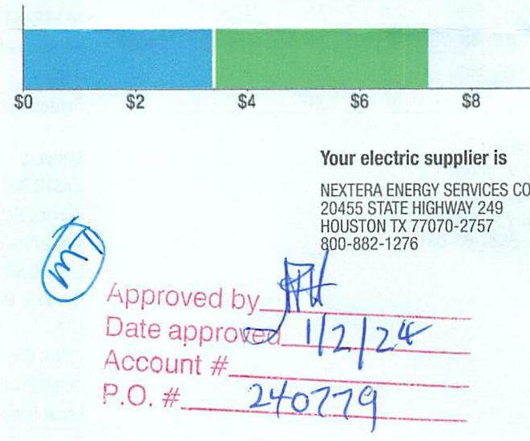
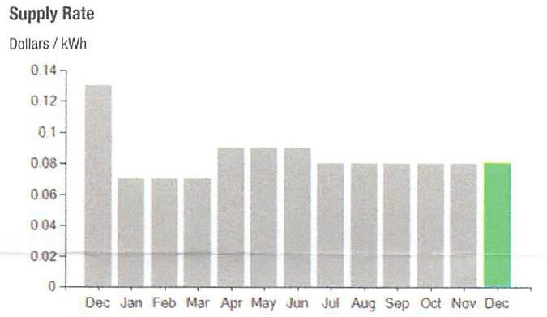

## EVERSEURCE

Account Number: 51562313031
Statement Date: 12/20/23
Service Provided To:
TOWN OF BERLIN/PUBLIC WORKS

## Total Amount Due

by 02/18/24
Amount Due On 12/18/23
Last Payment Received
$\$ 6.84$
Total Current Charges
$56.84-$ $\$ 7.21$

## Current Charges for Electricity

| Supply | Delivery |
| :--: | :--: |
| \$3.38 | \$3.83 |
| Cost of electricity from NEXTERA ENERGY SERVICES CONN | Cost to deliver electricity from Eversource |

The image is a photo/illustration of a section of a bill or statement. It includes a bar chart and some text.

- The bar chart shows two segments: a blue segment representing approximately $3.38 and a green segment representing approximately $3.83. The x-axis is labeled with dollar amounts: $0, $2, $4, $6, $8.
- Text on the right side reads: 
  - "Your electric supplier is NEXTERA ENERGY SERVICES CO 20455 STATE HIGHWAY 249 HOUSTON TX 77070-2757 800-882-1276"
- Handwritten annotations include:
  - A circled "MW"
  - "Approved by" with an illegible signature
  - "Date approved" with "12/2/24"
  - "Account #" with an illegible number
  - "P.O. #" with "240779"

## News For You

A new discount for electric bills is available if you have a financial hardship status on your electric account. Based on your household income or receipt of a public assistance benefit, you may be eligible for a 10\% or 50\% discount off your electric bill per month. For example, if you have a $\$ 100$ monthly bill, it would be $\$ 10$ less if you receive a $10 \%$ discount or $\$ 50$ less if you receive the $50 \%$ discount. See how to enroll at eversource.com/billhelp.

Remit Payment To: Eversource, PO Box 56002, Boston, MA 02205-6002

Please make your check payable to Eversource and consider adding $\$ 1$ for Operation Fuel.
You can also add $\$ 2$ or $\$ 3$ when paying your bill online. $100 \%$ of your tax-deductible donation provides energy assistance grants. If mailing, please allow up to 5 business days to post.

## EVERSEURCE

Account Number: 51562313031
Non-residential and residential non-hardship customers may be subject to a $1.00 \%$ late payment charge if the "Total Amount Due" is not received by 01/17/24.

## 004228 000030297

$\left\|\mid n\right\| \mid n|n| n \mid n \mid n \mid n \mid n \mid n \mid n \mid n \mid n \mid n \mid n \mid n \mid n \mid n \mid n \mid n \mid n \mid n$
TOWN OF BERLIN/PUBLIC WORKS
DBA TOWN OF BERLIN
C/O PUBLIC WORKS
240 KENSINGTON RD STE 2
BERLIN CT 06037-2655
$\left\lvert\, \begin{aligned} & \text { I }|n| \mid n \mid| | n \mid n \mid n \mid n \mid n \mid| | n \mid n \mid n \mid n \mid n \mid n \mid n \mid n \mid n \mid n \mid n \mid\right.$
Eversource
PO Box 56002
Boston, MA 02205-6002

## EVERSEURCE

Account Number: 51562313031
Customer name key: BERL
Statement Date: 12/20/23
Service Provided To:
TOWN OF BERLIN/PUBLIC WORKS

| Syc Addr: 143 PERCIVAL AVE KENSIMPTON 0706037 |  |  |  |  |  |
| :--: | :--: | :--: | :--: | :--: | :--: |
| Rate 117 Serv Ref: 739973000 | Bill Cycle: 10 |  |  |  |  |
| Service From: 11/20/23 - 12/20/23 | 30 Days |  |  |  |  |
| OTHER WATRRE BORN-NISE EDDIP |  |  |  |  |  |
| Number of Devices |  |  | Unmetered Usage |  |  |
| 0001 |  |  | 43 kWh |  |  |

Cust provided ID: 143 PERCIVAL P LOT

| Monthly kWh Use |  |  |  |  |  |
| :--: | :--: | :--: | :--: | :--: | :--: |
| Dec | Jan | Feb | Mar | Apr | May | Jun |
| 43 | 0 | 38 | 0 | 33 | 29 | 26 |
| Jul | Aug | Sep | Oct | Nov | Dec |  |
| 0 | 29 | 0 | 37 | 40 | 43 |  |

## Contact Information

Emergency: 800-286-2000
www.eversource.com
Pay by Phone: 888-783-6618
Customer Service: 888-783-6617

## Total Amount Due

by $02 / 18 / 24$
\$14.05

Electric Account Summary
Amount Due On 12/18/23
Last Payment Received
\$0.00
Balance Forward
Current Charges/Credits
Electric Supply Services
Delivery Services
Total Current Charges
\$3.38
\$7.21
Total Amount Due
Total Charges by Electricity

## Supplier

NEXTERA ENERGY
Service Reference: 739973000
Supply
Subtotal Supplier Services
$\$ 14.05$

## Delivery

(DISTRIBUTION RATE: 117)
Service Reference: 739973000
Transmission
Local Delivery
Revenue Decoupling
CTA
FMCC Charge
Comb Public Benefit Chrg
Local Delivery Improvements
Subtotal Delivery Services
Total Cost of Electricity
Total Current Charges
$\$ 14.05$

# $43.20 \mathrm{kWh} \times \$ 0.07822$ 

\$3.38
\$3.38

## 43.20kWh X \$0.02454 \$1.06 \$1.41 \$0.03 \$0.02

\$1.06
\$1.41
\$0.03
\$0.02
\$0.08
\$0.33
\$0.94
\$3.83

Total Current Charges

# EVERSEURCE 

Account Number: 51562313031
Customer name key: BERL
Statement Date: 12/20/23
Service Provided To:
TOWN OF BERLIN/PUBLIC WORKS

Continued from previous page...

The image is a bar chart.

- **Chart Type**: Bar chart
- **Title**: Supply Rate
- **Y-Axis Title**: Dollars / kWh
- **X-Axis Labels**: Dec, Jan, Feb, Mar, Apr, May, Jun, Jul, Aug, Sep, Oct, Nov, Dec
- **Data Points**:
  - December (first): ~0.13
  - January to November: ~0.06
  - December (second): ~0.07
- **Notable Styling**: The bar for the second December is highlighted in green, while all other bars are in gray.
- **Description**: This chart provides a yearly usage breakdown (monthly-based) of the supply rate in dollars per kWh, showing a decrease from December to January, consistent rates through November, and a slight increase in the second December.

