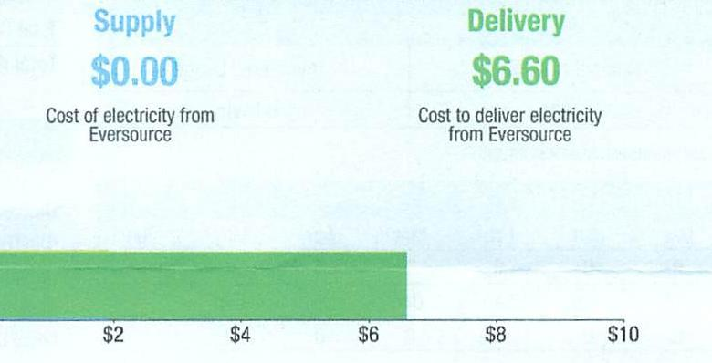
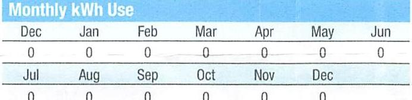

## EVERSEURCE

Account Number: 51161223052
Statement Date: 01/02/24
Service Provided To:
TOWN OF BERLIN WTR DEPT

The image is a photo or illustration showing a handwritten signature in blue ink. The signature is stylized and cursive, but the specific name or details of the signature are not identifiable. The background is plain, emphasizing the signature itself.

## Total Amount Due

by 03/02/24
Amount Due On 12/29/23
Last Payment Received On 12/20/23
$\$ 6.60$
Balance Forward
Total Current Charges
$\$ 6.60$

Current Charges for Electricity

The image is a graph/chart.

- **Chart Type**: Bar chart
- **Axis Titles and Units**: 
  - X-axis: No specific title, but labeled with dollar amounts: $2, $4, $6, $8, $10.
- **Legend Entries and Data Points**:
  - Supply: $0.00
  - Delivery: $6.60
- **Embedded Text**:
  - "Supply $0.00 Cost of electricity from Eversource"
  - "Delivery $6.60 Cost to deliver electricity from Eversource"
- **Styling**:
  - The bar for "Delivery" is highlighted in green, extending to the $6.60 mark on the x-axis.
  - The "Supply" section is indicated as $0.00, with no bar extending from the baseline.

## APPROVED FOR PAYMENT

A new discount for electric bills is available if you have a financial hardship status on your electric account. Based on your household income or receipt of a public assistance benefit, you may be eligible for a $10 \%$ or $50 \%$ discount off your electric bill per month. For example, if you have a $\$ 100$ monthly bill, it would be $\$ 10$ less if you receive a $10 \%$ discount or $\$ 50$ less if you receive the $50 \%$ discount. See how to enroll at eversource.com/billhelp.

Remit Payment To: Eversource, PO Box 56002, Boston, MA 02205-6002
CE 240102PRCD.TXT-139199-000002408

## EVERSEURCE

Account Number: 51161223052
Non-residential and residential non-hardship customers may be subject to a $1.00 \%$ late payment charge if the "Total Amount Due" is not received by 01/30/24.

## $069595000002408$

$1 \frac{1}{10} 10 \frac{1}{10} 10 \frac{1}{10} 10 \frac{1}{10} 10 \frac{1}{10} 10 \frac{1}{10} 10 \frac{1}{10} 10 \frac{1}{10} 10 \frac{1}{10} 10 \frac{1}{10} 10 \frac{1}{10} 10 \frac{1}{10} 10 \frac{1}{10} 10 \frac{1}{10} 10 \frac{1}{10} 10 \frac{1}{10} 10$
$069595000002408$
$1 \frac{1}{10} 10 \frac{1}{10} 10 \frac{1}{10} 10 \frac{1}{10} 10 \frac{1}{10} 10 \frac{1}{10} 10 \frac{1}{10} 10 \frac{1}{10} 10 \frac{1}{10} 10 \frac{1}{10} 10 \frac{1}{10} 10 \frac{1}{10} 10 \frac{1}{10} 10 \frac{1}{10} 10 \frac{1}{10} 10 \frac{1}{10} 10 \frac{1}{10} 10 \frac{1}{10} 10 \frac{1}{10} 10 \frac{1}{10} 10 \frac{1}{10} 10 \frac{1}{10} 10 \frac{1}{10} 10 \frac{1}{10} 10 \frac{1}{10} 10 \frac{1}{10} 10 \frac{1}{10} 10 \frac{1}{10} 10 \frac{1}{10} 10 \frac{1}{10} 10 \frac{1}{10} 10 \frac{1}{10} 10 \frac{1}{10} 10 \frac{1}{10} 10 \frac{1}{10} 10 \frac{1}{10} 10 \frac{1}{10} 10 \frac{1}{10} 10 \frac{1}{10} 10 \frac{1}{10} 10 \frac{1}{10} 10 \frac{1}{10} 10 \frac{1}{10} 10 \frac{1}{10} 10 \frac{1}{10} 10 \frac{1}{10} 10 \frac{1}{10} 10 \frac{1}{10} 10 \frac{1}{10} 10 \frac{1}{10} 10 \frac{1}{10} 10 \frac{1}{10} 10 \frac{1}{10} 10 \frac{1}{10} 10 \frac{1}{10} 10 \frac{1}{10} 10 \frac{1}{10} 10 \frac{1}{10} 10 \frac{1}{10} 10 \frac{1}{10} 10 \frac{1}{10} 10 \frac{1}{10} 10 \frac{1}{10} 10 \frac{1}{10} 10 \frac{1}{10} 10 \frac{1}{10} 10 \frac{1}{10} 10 \frac{1}{10} 10 \frac{1}{10} 10 \frac{1}{10} 10 \frac{1}{10} 10 \frac{1}{10} 10 \frac{1}{10} 10 \frac{1}{10} 10 \frac{1}{10} 10 \frac{1}{10} 10 \frac{1}{10} 10 \frac{1}{10} 10 \frac{1}{10} 10 \frac{1}{10} 10 \frac{1}{10} 10 \frac{1}{10} 10 \frac{1}{10} 10 \frac{1}{10} 10 \frac{1}{10} 10 \frac{1}{10} 10 \frac{1}{10} 10 \frac{1}{10} 10 \frac{1}{10} 10 \frac{1}{10} 10 \frac{1}{10} 10 \frac{1}{10} 10 \frac{1}{10} 10 \frac{1}{10} 10 \frac{1}{10} 10 \frac{1}{10} 10 \frac{1}{10} 10 \frac{1}{10} 10 \frac{1}{10} 10 \frac{1}{10} 10 \frac{1}{10} 10 \frac{1}{10} 10 \frac{1}{10} 10 \frac{1}{10} 10 \frac{1}{10} 10 \frac{1}{10} 10 \frac{1}{10} 10 \frac{1}{10} 10 \frac{1}{10} 10 \frac{1}{10} 10 \frac{1}{10} 10 \frac{1}{10} 10 \frac{1}{10} 10 \frac{1}{10} 10 \frac{1}{10} 10 \frac{1}{10} 10 \frac{1}{10} 10 \frac{1}{10} 10 \frac{1}{10} 10 \frac{1}{10} 10 \frac{1}{10} 10 \frac{1}{10} 10 \frac{1}{10} 10 \frac{1}{10} 10 \frac{1}{10} 10 \frac{1}{10} 10 \frac{1}{10} 10 \frac{1}{10} 10 \frac{1}{10} 10 \frac{1}{10} 10 \frac{1}{10} 10 \frac{1}{10} 10 \frac{1}{10} 10 \frac{1}{10} 10 \frac{1}{10} 10 \frac{1}{10} 10 \frac{1}{10} 10 \frac{1}{10} 10 \frac{1}{10} 10 \frac{1}{10} 10 \frac{1}{10} 10 \frac{1}{10} 10 \frac{1}{10} 10 \frac{1}{10} 10 \frac{1}{10} 10 \frac{1}{10} 10 \frac{1}{10} 10 \frac{1}{10} 10 \frac{1}{10} 10 \frac{1}{10} 10 \frac{1}{10} 10 \frac{1}{10} 10 \frac{1}{10} 10 \frac{1}{10} 10 \frac{1}{10} 10 \frac{1}{10} 10 \frac{1}{10} 10 \frac{1}{10} 10 \frac{1}{10} 10 \frac{1}{10} 10 \frac{1}{10} 10 \frac{1}{10} 10 \frac{1}{10} 10 \frac{1}{10} 10 \frac{1}{10} 10 \frac{1}{10} 10 \frac{1}{10} 10 \frac{1}{10} 10 \frac{1}{10} 10 \frac{1}{10} 10 \frac{1}{10} 10 \frac{1}{10} 10 \frac{1}{10} 10 \frac{1}{10} 10 \frac{1}{10} 10 \frac{1}{10} 10 \frac{1}{10} 10 \frac{1}{10} 10 \frac{1}{10} 10 \frac{1}{10} 10 \frac{1}{10} 10 \frac{1}{10} 10 \frac{1}{10} 10 \frac{1}{10} 10 \frac{1}{10} 10 \frac{1}{10} 10 \frac{1}{10} 10 \frac{1}{10} 10 \frac{1}{10} 10 \frac{1}{10} 10 \frac{1}{10} 10 \frac{1}{10} 10 \frac{1}{10} 10 \frac{1}{10} 10 \frac{1}{10} 10 \frac{1}{10} 10 \frac{1}{10} 10 \frac{1}{10} 10 \frac{1}{10} 10 \frac{1}{10} 10 \frac{1}{10} 10 \frac{1}{10} 10 \frac{1}{10} 10 \frac{1}{10} 10 \frac{1}{10} 10 \frac{1}{10} 10 \frac{1}{10} 10 \frac{1}{10} 10 \frac{1}{10} 10 \frac{1}{10} 10 \frac{1}{10} 10 \frac{1}{10} 10 \frac{1}{10} 10 \frac{1}{10} 10 \frac{1}{10} 10 \frac{1}{10} 10 \frac{1}{10} 10 \frac{1}{10} 10 \frac{1}{10} 10 \frac{1}{10} 10 \frac{1}{10} 10 \frac{1}{10} 10 \frac{1}{10} 10 \frac{1}{10} 10 \frac{1}{10} 10 \frac{1}{10} 10 \frac{1}{10} 10 \frac{1}{10} 10 \frac{1}{10} 10 \frac{1}{10} 10 \frac{1}{10} 10 \frac{1}{10} 10 \frac{1}{10} 10 \frac{1}{10} 10 \frac{1}{10} 10 \frac{1}{10} 10 \frac{1}{10} 10 \frac{1}{10} 10 \frac{1}{10} 10 \frac{1}{10} 10 \frac{1}{10} 10 \frac{1}{10} 10 \frac{1}{10} 10 \frac{1}{10} 10 \frac{1}{10} 10 \frac{1}{10} 10 \frac{1}{10} 10 \frac{1}{10} 10 \frac{1}{10} 10 \frac{1}{10} 10 \frac{1}{10} 10 \frac{1}{10} 10 \frac{1}{10} 10 \frac{1}{10} 10 \frac{1}{10} 10 \frac{1}{10} 10 \frac{1}{10} 10 \frac{1}{10} 10 \frac{1}{10} 10 \frac{1}{10} 10 \frac{1}{10} 10 \frac{1}{10} 10 \frac{1}{10} 10 \frac{1}{10} 10 \frac{1}{10} 10 \frac{1}{10} 10 \frac{1}{10} 10 \frac{1}{10} 10 \frac{1}{10} 10 \frac{1}{10} 10 \frac{1}{10} 10 \frac{1}{10} 10 \frac{1}{10} 10 \frac{1}{10} 10 \frac{1}{10} 10 \frac{1}{10} 10 \frac{1}{10} 10 \frac{1}{10} 10 \frac{1}{10} 10 \frac{1}{10} 10 \frac{1}{10} 10 \frac{1}{10} 10 \frac{1}{10} 10 \frac{1}{10} 10 \frac{1}{10} 10 \frac{1}{10} 10 \frac{1}{10} 10 \frac{1}{10} 10 \frac{1}{10} 10 \frac{1}{10} 10 \frac{1}{10} 10 \frac{1}{10} 10 \frac{1}{10} 10 \frac{1}{10} 10 \frac{1}{10} 10 \frac{1}{10} 10 \frac{1}{10} 10 \frac{1}{10} 10 \frac{1}{10} 10 \frac{1}{10} 10 \frac{1}{10} 10 \frac{1}{10} 10 \frac{1}{10} 10 \frac{1}{10} 10 \frac{1}{10} 10 \frac{1}{10} 10 \frac{1}{10} 10 \frac{1}{10} 10 \frac{1}{10} 10 \frac{1}{10} 10 \frac{1}{10} 10 \frac{1}{10} 10 \frac{1}{10} 10 \frac{1}{10} 10 \frac{1}{10} 10 \frac{1}{10} 10 \frac{1}{10} 10 \frac{1}{10} 10 \frac{1}{10} 10 \frac{1}{10} 10 \frac{1}{10} 10 \frac{1}{10} 10 \frac{1}{10} 10 \frac{1}{10} 10 \frac{1}{10} 10 \frac{1}{10} 10 \frac{1}{10} 10 \frac{1}{10} 10 \frac{1}{10} 10 \frac{1}{10} 10 \frac{1}{10} 10 \frac{1}{10} 10 \frac{1}{10} 10 \frac{1}{10} 10 \frac{1}{10} 10 \frac{1}{10} 10 \frac{1}{10} 10 \frac{1}{10} 10 \frac{1}{10} 10 \frac{1}{10} 10 \frac{1}{10} 10 \frac{1}{10} 10 \frac{1}{10} 10 \frac{1}{10} 10 \frac{1}{10} 10 \frac{1}{10} 10 \frac{1}{10} 10 \frac{1}{10} 10 \frac{1}{10} 10 \frac{1}{10} 10 \frac{1}{10} 10 \frac{1}{10} 10 \frac{1}{10} 10 \frac{1}{10} 10 \frac{1}{10} 10 \frac{1}{10} 10 \frac{1}{10} 10 \frac{1}{10} 10 \frac{1}{10} 10 \frac{1}{10} 10 \frac{1}{10} 10 \frac{1}{10} 10 \frac{1}{10} 10 \frac{1}{10} 10 \frac{1}{10} 10 \frac{1}{10} 10 \frac{1}{10} 10 \frac{1}{10} 10 \frac{1}{10} 10 \frac{1}{10} 10 \frac{1}{10} 10 \frac{1}{10} 10 \frac{1}{10} 10 \frac{1}{10} 10 \frac{1}{10} 10 \frac{1}{10} 10 \frac{1}{10} 10 \frac{1}{10} 10 \frac{1}{10} 10 \frac{1}{10} 10 \frac{1}{10} 10 \frac{1}{10} 10 \frac{1}{10} 10 \frac{1}{10} 10 \frac{1}{10} 10 \frac{1}{10} 10 \frac{1}{10} 10 \frac{1}{10} 10 \frac{1}{10} 10 \frac{1}{10} 10 \frac{1}{10} 10 \frac{1}{10} 10 \frac{1}{10} 10 \frac{1}{10} 10 \frac{1}{10} 10 \frac{1}{10} 10 \frac{1}{10} 10 \frac{1}{10} 10 \frac{1}{10} 10 \frac{1}{10} 10 \frac{1}{10} 10 \frac{1}{10} 10 \frac{1}{10} 10 \frac{1}{10} 10 \frac{1}{10} 10 \frac{1}{10} 10 \frac{1}{10} 10 \frac{1}{10} 10 \frac{1}{10} 10 \frac{1}{10} 10 \frac{1}{10} 10 \frac{1}{10} 10 \frac{1}{10} 10 \frac{1}{10} 10 \frac{1}{10} 10 \frac{1}{10} 10 \frac{1}{10} 10 \frac{1}{10} 10 \frac{1}{10} 10 \frac{1}{10} 10 \frac{1}{10} 10 \frac{1}{10} 10 \frac{1}{10} 10 \frac{1}{10} 10 \frac{1}{10} 10 \frac{1}{10} 10 \frac{1}{10} 10 \frac{1}{10} 10 \frac{1}{10} 10 \frac{1}{10} 10 \frac{1}{10} 10 \frac{1}{10} 10 \frac{1}{10} 10 \frac{1}{10} 10 \frac{1}{10} 10 \frac{1}{10} 10 \frac{1}{10} 10 \frac{1}{10} 10 \frac{1}{10} 10 \frac{1}{10} 10 \frac{1}{10} 10 \frac{1}{10} 10 \frac{1}{10} 10 \frac{1}{10} 10 \frac{1}{10} 10 \frac{1}{10} 10 \frac{1}{10} 10 \frac{1}{10} 10 \frac{1}{10} 10 \frac{1}{10} 10 \frac{1}{10} 10 \frac{1}{10} 10 \frac{1}{10} 10 \frac{1}{10} 10 \frac{1}{10} 10 \frac{1}{10} 10 \frac{1}{10} 10 \frac{1}{10} 10 \frac{1}{10} 10 \frac{1}{10} 10 \frac{1}{10} 10 \frac{1}{10} 10 \frac{1}{10} 10 \frac{1}{10} 10 \frac{1}{10} 10 \frac{1}{10} 10 \frac{1}{10} 10 \frac{1}{10} 10 \frac{1}{10} 10 \frac{1}{10} 10 \frac{1}{10} 10 \frac{1}{10} 10 \frac{1}{10} 10 \frac{1}{10} 10 \frac{1}{10} 10 \frac{1}{10} 10 \frac{1}{10} 10 \frac{1}{10} 10 \frac{1}{10} 10 \frac{1}{10} 10 \frac{1}{10} 10 \frac{1}{10} 10 \frac{1}{10} 10 \frac{1}{10} 10 \frac{1}{10} 10 \frac{1}{10} 10 \frac{1}{10} 10 \frac{1}{10} 10 \frac{1}{10} 10 \frac{1}{10} 10 \frac{1}{10} 10 \frac{1}{10} 10 \frac{1}{10} 10 \frac{1}{10} 10 \frac{1}{10} 10 \frac{1}{10} 10 \frac{1}{10} 10 \frac{1}{10} 10 \frac{1}{10} 10 \frac{1}{10} 10 \frac{1}{10} 10 \frac{1}{10} 10 \frac{1}{10} 10 \frac{1}{10} 10 \frac{1}{10} 10 \frac{1}{10} 10 \frac{1}{10} 10 \frac{1}{10} 10 \frac{1}{10} 10 \frac{1}{10} 10 \frac{1}{10} 10 \frac{1}{10} 10 \frac{1}{10} 10 \frac{1}{10} 10 \frac{1}{10} 10 \frac{1}{10} 10 \frac{1}{10} 10 \frac{1}{10} 10 \frac{1}{10} 10 \frac{1}{10} 10 \frac{1}{10} 10 \frac{1}{10} 10 \frac{1}{10} 10 \frac{1}{10} 10 \frac{1}{10} 10 \frac{1}{10} 10 \frac{1}{10} 10 \frac{1}{10} 10 \frac{1}{10} 10 \frac{1}{10} 10 \frac{1}{10} 10 \frac{1}{10} 10 \frac{1}{10} 10 \frac{1}{10} 10 \frac{1}{10} 10 \frac{1}{10} 10 \frac{1}{10} 10 \frac{1}{10} 10 \frac{1}{10} 10 \frac{1}{10} 10 \frac{1}{10} 10 \frac{1}{10} 10 \frac{1}{10} 10 \frac{1}{10} 10 \frac{1}{10} 10 \frac{1}{10} 10 \frac{1}{10} 10 \frac{1}{10} 10 \frac{1}{10} 10 \frac{1}{10} 10 \frac{1}{10} 10 \frac{1}{10} 10 \frac{1}{10} 10 \frac{1}{10} 10 \frac{1}{10} 10 \frac{1}{10} 10 \frac{1}{10} 10 \frac{1}{10} 10 \frac{1}{10} 10 \frac{1}{10} 10 \frac{1}{10} 10 \frac{1}{10} 10 \frac{1}{10} 10 \frac{1}{10} 10 \frac{1}{10} 10 \frac{1}{10} 10 \frac{1}{10} 10 \frac{1}{10} 10 \frac{1}{10} 10 \frac{1}{10} 10 \frac{1}{10} 10 \frac{1}{10} 10 \frac{1}{10} 10 \frac{1}{10} 10 \frac{1}{10} 10 \frac{1}{10} 10 \frac{1}{10} 10 \frac{1}{10} 10 \frac{1}{10} 10 \frac{1}{10} 10 \frac{1}{10} 10 \frac{1}{10} 10 \frac{1}{10} 10 \frac{1}{10} 10 \frac{1}{10} 10 \frac{1}{10} 10 \frac{1}{10} 10 \frac{1}{10} 10 \frac{1}{10} 10 \frac{1}{10} 10 \frac{1}{10} 10 \frac{1}{10} 10 \frac{1}{10} 10 \frac{1}{10} 10 \frac{1}{10} 10 \frac{1}{10} 10 \frac{1}{10} 10 \frac{1}{10} 10 \frac{1}{10} 10 \frac{1}{10} 10 \frac{1}{10} 10 \frac{1}{10} 10 \frac{1}{10} 10 \frac{1}{10} 10 \frac{1}{10} 10 \frac{1}{10} 10 \frac{1}{10} 10 \frac{1}{10} 10 \frac{1}{10} 10 \frac{1}{10} 10 \frac{1}{10} 10 \frac{1}{10} 10 \frac{1}{10} 10 \frac{1}{10} 10 \frac{1}{10} 10 \frac{1}{10} 10 \frac{1}{10} 10 \frac{1}{10} 10 \frac{1}{10} 10 \frac{1}{10} 10 \frac{1}{10} 10 \frac{1}{10} 10 \frac{1}{10} 10 \frac{1}{10} 10 \frac{1}{10} 10 \frac{1}{10} 10 \frac{1}{10} 10 \frac{1}{10} 10 \frac{1}{10} 10 \frac{1}{10} 10 \frac{1}{10} 10 \frac{1}{10} 10 \frac{1}{10} 10 \frac{1}{10} 10 \frac{1}{10} 10 \frac{1}{10} 10 \frac{1}{10} 10 \frac{1}{10} 10 \frac{1}{10} 10 \frac{1}{10} 10 \frac{1}{10} 10 \frac{1}{10} 10 \frac{1}{10} 10 \frac{1}{10} 10 \frac{1}{10} 10 \frac{1}{10} 10 \frac{1}{10} 10 \frac{1}{10} 10 \frac{1}{10} 10 \frac{1}{10} 10 \frac{1}{10} 10 \frac{1}{10} 10 \frac{1}{10} 10 \frac{1}{10} 10 \frac{1}{10} 10 \frac{1}{10} 10 \frac{1}{10} 10 \frac{1}{10} 10 \frac{1}{10} 10 \frac{1}{10} 10 \frac{1}{10} 10 \frac{1}{10} 10 \frac{1}{10} 10 \frac{1}{10} 10 \frac{1}{10} 10 \frac{1}{10} 10 \frac{1}{10} 10 \frac{1}{10} 10 \frac{1}{10} 10 \frac{1}{10} 10 \frac{1}{10} 10 \frac{1}{10} 10 \frac{1}{10} 10 \frac{1}{10} 10 \frac{1}{10} 10 \frac{1}{10} 10 \frac{1}{10} 10 \frac{1}{10} 10 \frac{1}{10} 10 \frac{1}{10} 10 \frac{1}{10} 10 \frac{1}{10} 10 \frac{1}{10} 10 \frac{1}{10} 10 \frac{1}{10} 10 \frac{1}{10} 10 \frac{1}{10} 10 \frac{1}{10} 10 \frac{1}{10} 10 \frac{1}{10} 10 \frac{1}{10} 10 \frac{1}{10} 10 \frac{1}{10} 10 \frac{1}{10} 10 \frac{1}{10} 10 \frac{1}{10} 10 \frac{1}{10} 10 \frac{1}{10} 10 \frac{1}{10} 10 \frac{1}{10} 10 \frac{1}{10} 10 \frac{1}{10} 10 \frac{1}{10} 10 \frac{1}{10} 10 \frac{1}{10} 10 \frac{1}{10} 10 \frac{1}{10} 10 \frac{1}{10} 10 \frac{1}{10} 10 \frac{1}{10} 10 \frac{1}{10} 10 \frac{1}{10} 10 \frac{1}{10} 10 \frac{1}{10} 10 \frac{1}{10} 10 \frac{1}{10} 10 \frac{1}{10} 10 \frac{1}{10} 10 \frac{1}{10} 10 \frac{1}{10} 10 \frac{1}{10} 10 \frac{1}{10} 10 \frac{1}{10} 10 \frac{1}{10} 10 \frac{1}{10} 10 \frac{1}{10} 10 \frac{1}{10} 10 \frac{1}{10} 10 \frac{1}{10} 10 \frac{1}{10} 10 \frac{1}{10} 10 \frac{1}{10} 10 \frac{1}{10} 10 \frac{1}{10} 10 \frac{1}{10} 10 \frac{1}{10} 10 \frac{1}{10} 10 \frac{1}{10} 10 \frac{1}{10} 10 \frac{1}{10} 10 \frac{1}{10} 10 \frac{1}{10} 10 \frac{1}{10} 10 \frac{1}{10} 10 \frac{1}{10} 10 \frac{1}{10} 10 \frac{1}{10} 10 \frac{1}{10} 10 \frac{1}{10} 10 \frac{1}{10} 10 \frac{1}{10} 10 \frac{1}{10} 10 \frac{1}{10} 10 \frac{1}{10} 10 \frac{1}{10} 10 \frac{1}{10} 10 \frac{1}{10} 10 \frac{1}{10} 10 \frac{1}{10} 10 \frac{1}{10} 10 \frac{1}{10} 10 \frac{1}{10} 10 \frac{1}{10} 10 \frac{1}{10} 10 \frac{1}{10} 10 \frac{1}{10} 10 \frac{1}{10} 10 \frac{1}{10} 10 \frac{1}{10} 10 \frac{1}{10} 10 \frac{1}{10} 10 \frac{1}{10} 10 \frac{1}{10} 10 \frac{1}{10} 10 \frac{1}{10} 10 \frac{1}{10} 10 \frac{1}{10} 10 \frac{1}{10} 10 \frac{1}{10} 10 \frac{1}{10} 10 \frac{1}{10} 10 \frac{1}{10} 10 \frac{1}{10} 10 \frac{1}{10} 10 \frac{1}{10} 10 \frac{1}{10} 10 \frac{1}{10} 10 \frac{1}{10} 10 \frac{1}{10} 10 \frac{1}{10} 10 \frac{1}{10} 10 \frac{1}{10} 10 \frac{1}{10} 10 \frac{1}{10} 10 \frac{1}{10} 10 \frac{1}{10} 10 \frac{1}{10} 10 \frac{1}{10} 10 \frac{1}{10} 10 \frac{1}{10} 10 \frac{1}{10} 10 \frac{1}{10} 10 \frac{1}{10} 10 \frac{1}{10} 10 \frac{1}{10} 10 \frac{1}{10} 10 \frac{1}{10} 10 \frac{1}{10} 10 \frac{1}{10} 10 \frac{1}{10} 10 \frac{1}{10} 10 \frac{1}{10} 10 \frac{1}{10} 10 \frac{1}{10} 10 \frac{1}{10} 10 \frac{1}{10} 10 \frac{1}{10} 10 \frac{1}{10} 10 \frac{1}{10} 10 \frac{1}{10} 10 \frac{1}{10} 10 \frac{1}{10} 10 \frac{1}{10} 10 \frac{1}{10} 10 \frac{1}{10} 10 \frac{1}{10} 10 \frac{1}{10} 10 \frac{1}{10} 10 \frac{1}{10} 10 \frac{1}{10} 10 \frac{1}{10} 10 \frac{1}{10} 10 \frac{1}{10} 10 \frac{1}{10} 10 \frac{1}{10} 10 \frac{1}{10} 10 \frac{1}{10} 10 \frac{1}{10} 10 \frac{1}{10} 10 \frac{1}{10} 10 \frac{1}{10} 10 \frac{1}{10} 10 \frac{1}{10} 10 \frac{1}{10} 10 \frac{1}{10} 10 \frac{1}{10} 10 \frac{1}{10} 10 \frac{1}{10} 10 \frac{1}{10} 10 \frac{1}{10} 10 \frac{1}{10} 10 \frac{1}{10} 10 \frac{1}{10} 10 \frac{1}{10} 10 \frac{1}{10} 10 \frac{1}{10} 10 \frac{1}{10} 10 \frac{1}{10} 10 \frac{1}{10} 10 \frac{1}{10} 10 \frac{1}{10} 10 \frac{1}{10} 10 \frac{1}{10} 10 \frac{1}{10} 10 \frac{1}{10} 10 \frac{1}{10} 10 \frac{1}{10} 10 \frac{1}{10} 10 \frac{1}{10} 10 \frac{1}{10} 10 \frac{1}{10} 10 \frac{1}{10} 10 \frac{1}{10} 10 \frac{1}{10} 10 \frac{1}{10} 10 \frac{1}{10} 10 \frac{1}{10} 10 \frac{1}{10} 10 \frac{1}{10} 10 \frac{1}{10} 10 \frac{1}{10} 10 \frac{1}{10} 10 \frac{1}{10} 10 \frac{1}{10} 10 \frac{1}{10} 10 \frac{1}{10} 10 \frac{1}{10} 10 \frac{1}{10} 10 \frac{1}{10} 10 \frac{1}{10} 10 \frac{1}{10} 10 \frac{1}{10} 10 \frac{1}{10} 10 \frac{1}{10} 10 \frac{1}{10} 10 \frac{1}{10} 10 \frac{1}{10} 10 \frac{1}{10} 10 \frac{1}{10} 10 \frac{1}{10} 10 \frac{1}{10} 10 \frac{1}{10} 10 \frac{1}{10} 10 \frac{1}{10} 10 \frac{1}{10} 10 \frac{1}{10} 10 \frac{1}{10} 10 \frac{1}{10} 10 \frac{1}{10} 10 \frac{1}{10} 10 \frac{1}{10} 10 \frac{1}{10} 10 \frac{1}{10} 10 \frac{1}{10} 10 \frac{1}{10} 10 \frac{1}{10} 10 \frac{1}{10} 10 \frac{1}{10} 10 \frac{1}{10} 10 \frac{1}{10} 10 \frac{1}{10} 10 \frac{1}{10} 10 \frac{1}{10} 10 \frac{1}{10} 10 \frac{1}{10} 10 \frac{1}{10} 10 \frac{1}{10} 10 \frac{1}{10} 10 \frac{1}{10} 10 \frac{1}{10} 10 \frac{1}{10} 10 \frac{1}{10} 10 \frac{1}{10} 10 \frac{1}{10} 10 \frac{1}{10} 10 \frac{1}{10} 10 \frac{1}{10} 10 \frac{1}{10} 10 \frac{1}{10} 10 \frac{1}{10} 10 \frac{1}{10} 10 \frac{1}{10} 10 \frac{1}{10} 10 \frac{1}{10} 10 \frac{1}{10} 10 \frac{1}{10} 10 \frac{1}{10} 10 \frac{1}{10} 10 \frac{1}{10} 10 \frac{1}{10} 10 \frac{1}{10} 10 \frac{1}{10} 10 \frac{1}{10} 10 \frac{1}{10} 10 \frac{1}{10} 10 \frac{1}{10} 10 \frac{1}{10} 10 \frac{1}{10} 10 \frac{1}{10} 10 \frac{1}{10} 10 \frac{1}{10} 10 \frac{1}{10} 10 \frac{1}{10} 10 \frac{1}{10} 10 \frac{1}{10} 10 \frac{1}{10} 10 \frac{1}{10} 10 \frac{1}{10} 10 \frac{1}{10} 10 \frac{1}{10} 10 \frac{1}{10} 10 \frac{1}{10} 10 \frac{1}{10} 10 \frac{1}{10} 10 \frac{1}{10} 10 \frac{1}{10} 10 \frac{1}{10} 10 \frac{1}{10} 10 \frac{1}{10} 10 \frac{1}{10} 10 \frac{1}{10} 10 \frac{1}{10} 10 \frac{1}{10} 10 \frac{1}{10} 10 \frac{1}{10} 10 \frac{1}{10} 10 \frac{1}{10} 10 \frac{1}{10} 10 \frac{1}{10} 10 \frac{1}{10} 10 \frac{1}{10} 10 \frac{1}{10} 10 \frac{1}{10} 10 \frac{1}{10} 10 \frac{1}{10} 10 \frac{1}{10} 10 \frac{1}{10} 10 \frac{1}{10} 10 \frac{1}{10} 10 \frac{1}{10} 10 \frac{1}{10} 10 \frac{1}{10} 10 \frac{1}{10} 10 \frac{1}{10} 10 \frac{1}{10} 10 \frac{1}{10} 10 \frac{1}{10} 10 \frac{1}{10} 10 \frac{10} 10 \frac{1}{10} 10 \frac{1}{10} 10 \frac{1}{10} 10 \frac{1}{10} 10 \frac{1}{10} 10 \frac{1}{10} 10 \frac{1}{10} 10 \frac{1}{10} 10 \frac{10} 10 \frac{10} 10 \frac{10 \frac{10} 10 \frac{10} 10 \frac{10} 10 \frac{10} 10 \frac{10} 10 \frac{10} 10 \frac{10} 10 \frac{10} 10 \frac{10} 10 \frac{10} 10 \frac{10} 10 \frac{10} 10 \frac{10} 10 \frac{10} 10 \frac{10} 10 \frac{10} 10 \frac{10} 10 \frac{10} 10 \frac{10} 10 \frac{10} 10 \frac{10} 10 \frac{10} 10 \frac{10} 10 \frac{10} 10 \frac{10} 10 \frac{10} 10 \frac{10} 10 \frac{10} 10 \frac{10} 10 \frac{10} 10 \frac{10} 10 \frac{10} 10 \frac{10} 10 \frac{10} 10 \frac{10} 10 \frac{10} 10 \frac{10} 10 \frac{10} 10 \frac{10} 10 \frac{10} 10 \frac{10} 10 \frac{10} 10 \frac{10} 10 \frac{10} 10 \frac{10} 10 \frac{10} 10 \frac{10} 10 \frac{10} 10 \frac{10} 10 \frac{10} 10 \frac{10} 10 \frac{10} 10 \frac{10} 10 \frac{10} 10 \frac{10} 10 \frac{10} 10 \frac{10} 10 \frac{10} 10 \frac{10} 10 \frac{10} 10 \frac{10} 10 \frac{10} 10 \frac{10} 10 \frac{10} 10 \frac{10} 10 \frac{10} 10 \frac{10} 10 \frac{10} 10 \frac{10} 10 \frac{10} 10 \frac{10} 10 \frac{10} 10 \frac{10} 10 \frac{10} 10 \frac{10} 10 \frac{10} 10 \frac{10} 10 \frac{10} 10 \frac{10} 10 \frac{10} 10 \frac{10} 10 \frac{10} 10 \frac{10} 10 \frac{10} 10 \frac{10} 10 \frac{10} 10 \frac{10} 10 \frac{10} 10 \frac{10} 10 \frac{10} 10 \frac{10} 10 \frac{10} 10 \frac{10} 10 \frac{10} 10 \frac{10} 10 \frac{10} 10 \frac{10} 10 \frac{10} 10 \frac{10} 10 \frac{10} 10 \frac{10} 10 \frac{10} 10 \frac{10} 10 \frac{10} 10 \frac{10} 10 \frac{10} 10 \frac{10} 10 \frac{10} 10 \frac{10} 10 \frac{10} 10 \frac{10} 10 \frac{10} 10 \frac{10} 10 \frac{10} 10 \frac{10} 10 \frac{10} 10 \frac{10} 10 \frac{10} 10 \frac{10} 10 \frac{10} 10 \frac{10} 10 \frac{10} 10 \frac{10} 10 \frac{10} 10 \frac{10} 10 \frac{10} 10 \frac{10} 10 \frac{10} 10 \frac{10} 10 \frac{10} 10 \frac{10} 10 \frac{10} 10 \frac{10} 10 \frac{10} 10 \frac{10} 10 \frac{10} 10 \frac{10} 10 \frac{10} 10 \frac{10} 10 \frac{10} 10 \frac{10} 10 \frac{10} 10 \frac{10} 10 \frac{10} 10 \frac{10} 10 \frac{10} 

## EVERSEURCE

Account Number: 51161223052
Customer name key: BERL
Statement Date: 01/02/24
Service Provided To:
TOWN OF BERLIN WTR DEPT

| Svc Addr: DEMING RU |  |  |  |  |  |
| :--: | :--: | :--: | :--: | :--: | :--: |
| BERLIN ET 06037 |  |  |  |  |  |
| Rate 115 Serv Ref: 108712003 |  |  |  | Bill Gychs: 20 |  |
| Service From: 12/01/23 - 01/02/24 |  |  |  | 32 Days |  |
| Number of Devices |  |  | Unmetered Usage |  |  |
| 0001 |  |  | 0 kWh |  |  |

Cust provided ID: SEWER MONITOR-----

The image is a graph/chart.

- **Chart Type**: Table
- **Title**: Monthly kWh Use
- **Columns**: 
  - Dec: 0
  - Jan: 0
  - Feb: 0
  - Mar: 0
  - Apr: 0
  - May: 0
  - Jun: 0
  - Jul: 0
  - Aug: 0
  - Sep: 0
  - Oct: 0
  - Nov: 0
  - Dec: 0

This represents a **yearly usage breakdown (monthly-based)** with all values at 0 kWh.

## Contact Information

Emergency: 800-286-2000
www.eversource.com
Pay by Phone: 888-783-6618
Customer Service: 888-783-6617

## Total Amount Due by 03/02/24

Electric Account Summary
Amount Due On 12/29/23
\$6.60
Last Payment Received On 12/20/23
\$6.60
Balance Forward
\$0.00
Current Charges/Credits
Electric Supply Services
$\$ 0.00$
Delivery Services
$\$ 6.60$
Total Current Charges
$\$ 6.60$
Total Amount Due
Total Charges for Electricity

## Delivery

(DISTRIBUTION RATE: 115)
Service Reference: 108712003
Allocated for 12/01/23 to 12/31/23
Local Delivery
Allocated for 12/31/23 to 01/02/24
Local Delivery
Subtotal Delivery Services
Total Cost of Electricity
Total Current Charges

