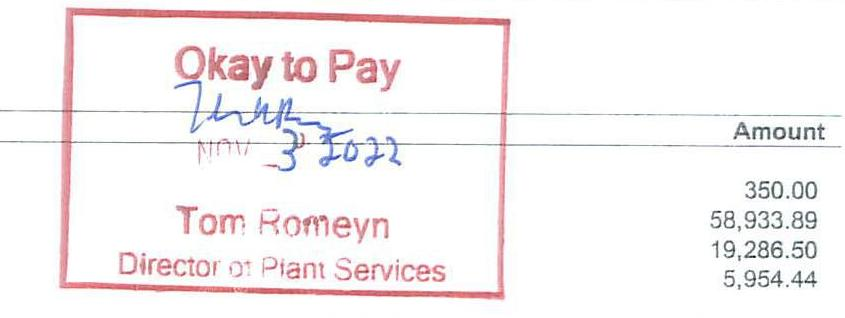
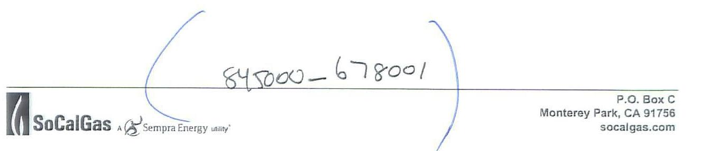
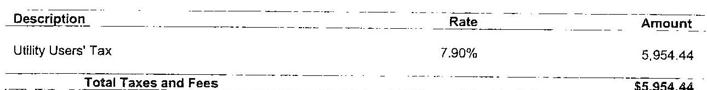

The image is a photo of a section of an envelope or document. It contains the following text:

- Huntington Memorial Hospital
- Accounts Payable
- 100 W. California Blvd.
- Pasadena, CA 91105

There are handwritten numbers and symbols on the sides: "# 10700" on the left and "6 + 9" on the right.

SoCalGas
P.O. BOX C

MONT. PK., CA 91756

PLEASE PAY THIS AMOUNT
\$84,524.83

# 80 1824209200 0845248371 

| Customer Name | Huntington Memorial Hospital |  | Last Payment |  |
| :--: | :--: | :--: | :--: | :--: |
| Service Address | 720 Fairmount Ave |  | Date | Amount |
|  | Pasadena CA 91105 |  | 10/05/2022 | $\$ 86,487.97$ |
| Account Number | 182-420-9200 7 |  |  |  |
| OCC | H02 |  |  |  |
| Billing Period: | From | To |  | 244,102 |
|  | 09/01/2022 | 10/01/2022 |  |  |

SUMMARY OF BILLING CHARGES:
Description Of Charges
Customer Charge
Transmission Charge
State Mandated Charges
Taxes and Fees
TOTAL CURRENT CHARGE

The image is a photo of a section of a document with a red stamp and handwritten notes. The stamp reads "Okay to Pay" and is signed with a date written as "Nov 3 2022." Below the stamp, the text "Tom Romeyn" and "Director of Plant Services" is visible. To the right, there is a list of amounts:

- 350.00
- 58,933.89
- 19,286.50
- 5,954.44

Past Due If Not Paid By 10/29/2022
$\$ 84,524.83$

## PREVIOUS BALANCE

TOTAL AMOUNT DUE
$0.7 \%$ Late Payment Charge Due If Paid After 11/01/2022
** For questions regarding this bill, please call Jason Chong at (213) 231-6124 or send email to JChong@socalgas.com
** Your account executive is always available to provide service and information regarding your energy needs. Please call Gregory G Heintz at (714) 634-3189 or send email to GHeintz@socalgas.com
** Go paperless! It's convenient and easy to sign up through Business My Account. If you aren't registered for Business My Account, contact your Account Executive. For questions regarding the Business My Account website at business.socalgas.com, please call 1-800-GAS-2000 (1-800-427-2000)

The image is a photo of a section of a document. It includes the following elements:

- The SoCalGas logo with the text "A Sempra Energy utility."
- Address details: "P.O. Box C, Monterey Park, CA 91756" and "socalgas.com."
- Handwritten text in the center: "84,500.00 - 67,800.1."
- Blue curved lines on either side of the handwritten text.

# IMPORTANT CUSTOMER INFORMATION PUBLIC UTILITIES COMMISSION NOTICE 

If you believe there is an error on your bill or have a question about your service, please call Southern California Gas Company customer support at (800) 427-2200. If you are not satisfied with Southern California Gas Company's response, submit a complaint to the California Public Utilities Commission (CPUC) by visiting http://www.cpuc.ca.gov/complaints/. Billing and service complaints are handled by the CPUC's Consumer Affairs Branch (CAB), 505 Van Ness Avenue, Room 2003, San Francisco, CA 94102. Phone: 800-649-7578

If you have limitations hearing or speaking, dial 711 to reach the California Relay Service, which is for those needing assistance relaying telephone conversations. Dial one of the numbers below to be routed to the California Relay Service provider in your preferred mode of communication.

## California Relay Service Phone Numbers:

| Type of Call | Language | Toll-free 800 Number |
| :-- | :-- | :-- |
| TTVIVCGHCO to Voice | English | $1-800-735-2928$ |
| Voice to TTVIVCGHCO | English | $1-800-855-3000$ |
| From or to | Spanish | $1-800-855-3000$ |
| Speech-to-Speech | English \& | $1-800-854-7784$ |

To avoid having service turned off while waiting for the outcome of a complaint to the CPUC specifically regarding the accuracy of your bill, please contact CAB for assistance. If your case meets the eligibility criteria, CAB will provide you instructions on how to mail a check or money order to be impounded pending resolution of your case. You must continue to pay your current charges while your complaint is under review to keep your service turned on.

## INFORMATION RELATED TO DEPOSITS

## Amount of Deposit

The amount of the deposit required to establish or re-establish service credit is twice the estimated average periodic bill.

## Return of Deposit/Interest on Deposit

This deposit, together with any interest due, less the amount of any unpaid bills will normally be returned either on discontinuance of service or after the deposit has been held for twelve (12) consecutive months, during which time continuous gas service has been received and all bills for such service have been paid in accordance with the rules in effect and filed with the Public Utilities Commission of the State of California. No interest will be paid if service is temporarily or permanently discontinued for non-payment of bills.

## Electronic Check Processing

When you pay your bill by check, you authorize us to electronically process your payment. If your check is processed electronically, your checking account may be debited on the same day we receive the check. Your check will not be returned by your bank, however, the transaction will appear on your bank statement. If you do not wish to participate in this program, have your account number ready and call 1-877-272-3303.

## EXPLANATION OF BILLING TERMS

Call your Account Executive for more information.

## Public Purpose Programs Surcharge

A charge to fund Public Purpose Programs such as California Alternate Rates for Energy (CARE), Energy Savings Assistance Program (ESAP), energy efficiency, and research and development. CARE customers pay a reduced surcharge which excludes CARE program costs.

## State Regulatory Fee

A fee used to fund the California Public Utilities Commission. Each customer's fee is determined by the number of gas therms used.

## Municipal Surcharge

A mandated state fee which compensates local governments for the private use of public lands during the transportation of gas. Charges are based on the value of the gas and current franchise agreements. Excluded from this fee is transported gas subject to existing franchise agreements.

## WACOG

The monthly WACOG is the Weighted Average Cost of Gas purchased by SoCalGas on behalf of its gas procurement customers in the current month

# BILLING SCHEDULE: 

| Tariff |  |  |  |  |  |  |  |  |  |  |  |  |  |  |  |  |  |  |  |  |  |  |  |  |  |  |  |  |  |  |  |  |  |  |  |  |  |  |  |  |  |  |  |  |  |  |  |  |  |  |  |  |  |  |  |  |  |  |  |  |  |  |  |  |  |  |  |  |  |  |  |  |  |  |  |  |  |  |  |  |  |  |  |  |  |  |  |  |  |  |  |  |  |  |  |  |  |  |  | 

# TAXES AND FEES: 

The image is a photo or scanned document showing a section of a bill or invoice. It contains a table with three columns labeled "Description," "Rate," and "Amount." 

- Under "Description," it lists "Utility Users' Tax."
- The "Rate" is shown as "7.90%."
- The "Amount" is "$5,954.44."
- Below this, it states "Total Taxes and Fees" with the same amount "$5,954.44."

## METER INFORMATION:

| Meter   Number | Effective Date | Total CCF | Billing   Factor | Total   Therms |
| :--: | :--: | :--: | :--: | :--: |
| 8571539 | 09/01/2022 | 235,620 | 1.036 | 244,102 |
| Total |  | 235,620 |  | 244,102 |

HISTORY:

| Period |  |  |  |
| :--: | :--: | :--: | :--: |
| Current |  | 244,102 |  |
| Aug 2022 |  | 249,045 |  |
| Jul 2022 |  | 256,548 |  |
| Jun 2022 |  | 242,888 |  |
| May 2022 |  | 249,459 |  |
| Apr 2022 |  | 228,521 |  |
| Mar 2022 |  | 234,507 |  |
| Feb 2022 |  | 212,472 |  |
| Jan 2022 |  | 228,272 |  |
| Dec 2021 |  | 246,811 |  |
| Nov 2021 |  | 222,608 |  |
| Oct 2021 |  | 254,164 |  |

MESSAGES:

## WIRE TRANSFER BILL INSTRUCTIONS:

Payee Bank: UNION BANK OF CALIFORNIA
Bank Address: 445 SO. FIGUEROA ST.
LOS ANGELES, CA 90013
Bank Aba Number: 122000496
Payee Name: SOUTHERN CALIFORNIA GAS CO.
Payee Account No: 10001-27805
Reference: CUSTOMER BILL ACCOUNT NUMBER (182-420-9200)
Please send remittance advice (including payment details) to:
SCGRemittanceProcessing@semprautilities.com
SoCalGas: Delivering affordable, clean and increasingly renewable energy to more than 21 million Californians.

