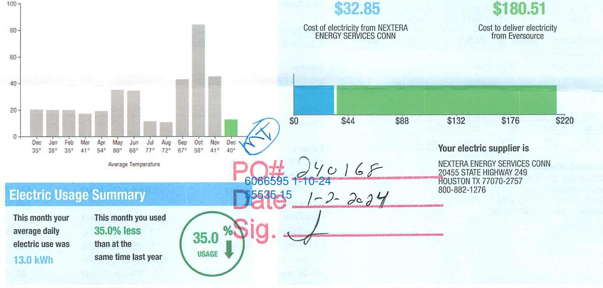
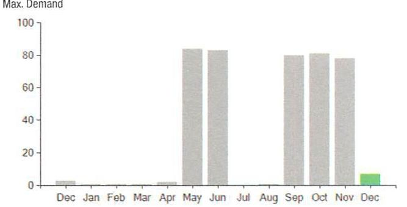

## EVERSEURGE

Account Number: 51705123099
Statement Date: $12 / 15 / 23$
Service Provided To:
TOWN OF BERLIN PUBLIC GROUNDS

## EIJ 30

| Total Amount Due |
| :-- |
| by $12 / 13 / 24$ |
| Amount Due On 12/11/23 |
| Last Payment Received On 11/22/23 |
| Balance Forward |
| Total Current Charges |

## EIJ 35

## Current Charges for Electricity

The image is a combination of a bar chart and a cost breakdown.

- **Bar Chart**: 
  - **Type**: Bar chart
  - **X-axis**: Months with average temperatures (Dec 35°, Jan 38°, Feb 35°, Mar 41°, Apr 54°, May 60°, Jun 68°, Jul 77°, Aug 72°, Sep 67°, Oct 58°, Nov 41°, Dec 40°).
  - **Y-axis**: Unlabeled, but likely represents energy usage.
  - **Data Points**: Bars show varying heights, with October having the highest usage and November the lowest.

- **Cost Breakdown**:
  - **Cost of Electricity**: $32.85 from NEXTERA ENERGY SERVICES CONN.
  - **Cost to Deliver Electricity**: $180.51 from Eversource.
  - **Bar**: Horizontal bar showing cost distribution from $0 to $220, with markers at $44, $88, $132, $176, and $220.

- **Electric Usage Summary**:
  - "This month your average daily electric use was 13.0 kWh."
  - "This month you used 35.0% less than at the same time last year."
  - "35.0% USAGE" with a downward arrow.

- **Additional Text**:
  - "PO# 240168"
  - "Date 1-10-24"
  - "$5535.15"
  - "Sig." with a handwritten signature.
  - "Your electric supplier is NEXTERA ENERGY SERVICES CONN, 20455 STATE HIGHWAY 249, HOUSTON TX 77070-2757, 800-882-1276."

## News For You

A new discount for electric bills is available if you have a financial hardship status on your electric account. Based on your household income or receipt of a public assistance benefit, you may be eligible for a $10 \%$ or $50 \%$ discount off your electric bill per month. For example, if you have a $\$ 100$ monthly bill, it would be $\$ 10$ less if you receive a $10 \%$ discount or $\$ 50$ less if you receive the $50 \%$ discount. See how to enroll at eversource.com/billhelp.

Remit Payment To: Eversource, PO Box 56002, Boston, MA 02205-6002
CE_231219/PRCO.TXT-6371-936946013

## EVERSEURGE

Account Number: 51705123099
Non-residential and residential non-hardship customers may be subject to a $1.00 \%$ late payment charge if the "Total Amount Due" is not received by $01 / 12 / 24$.

## $2,062.36$

Amount Enclosed
$212.30$

003186000046013
$\frac{11111111111111111111111111111111111111111111111111111111111111111111111111111111111111111111111111111111111111111111111111111111111111111111111111111111111111111111111111111111111111111111111111111111

## EVERSEURCE

Account Number: 51705123099
Customer name key: BERL
Statement Date: 12/15/23
Service Provided To:
TOWN OF BERLIN PUBLIC GROUNDS

| Svc Add: 1517 BERLIN TPKE BERLIN CT 00037 |  |  |  |  |  |
| :--: | :--: | :--: | :--: | :--: | :--: |
| Serv Ref: 536712000 |  |  | Bill Cycle: 09 |  |  |
| Service from 11/09/23 - 12/12/23 |  |  | 33 Days |  |  |
| Next road date on or about: Jan 12-2024 |  |  |  |  |  |
| Meter   Number | Current   Read | Previous   Read | Current   Usage | Reading   Type |  |
| 890479712 | 38250 | 38208 | 42 | Actual |  |

Total Demand Use $=7.70 \mathrm{~kW}$
42 X Meter Constant of $10=420$ Billed Usage

| Monthly KWh Use |  |  |  |  |  |
| :--: | :--: | :--: | :--: | :--: | :--: |
| Dec | Jan | Feb | Mar | Apr | May |
| 670 | 620 | 560 | 530 | 570 | 1020 |
| Jul | Aug | Sep | Oct | Nov | Dec |
| 340 | 350 | 1290 | 2450 | 1260 | 420 |

## Contact Information

Emergency: 800-286-2000
www.eversource.com
Pay by Phone: 888-783-6618
Customer Service: 888-783-6617

## Total Amount Due by $02 / 13 / 24$

## Electric Account Summary

Amount Due On 12/11/23
Last Payment Received On 11/22/23
Balance Forward
Current Charges/Credits
Electric Supply Services
Delivery Services
Total Current Charges
Total Amount Due

## Total Charges for Electricity

## Supplier

NEXTERA ENERGY
Service Reference: 536712000
Supply
Subtotal Supplier Services

## Delivery

(RATE 30A-DELIVERY)
Service Reference: 536712000
Transmission Demand Chrg
Fixed Monthly Charge
Local Delivery
Local Delivery Demand Chrg
Local Delivery Improvements
Revenue Decoupling
CTA Demand Chrg
FMCC Charge
Comb Public Benefit Chrg
Subtotal Delivery Services
Total Cost of Electricity

Total Current Charges
\$2,062.35

## \$2,062.35

\$3,880.80
\$2,031.81
\$1,848.99
\$32.85
\$180.51
\$213.36
\$2,062.35

## Total Charges for Electricity

## $420.00 \mathrm{kWh} \times \$ 0.07822$

\$32.85
\$32.85

## Delivery

(RATE 30A-DELIVERY)
Service Reference: 536712000
Transmission Demand Chrg
Fixed Monthly Charge
Local Delivery
420.00kWh X \$0.01843
5.70KW X \$9.16000
5.70KW X \$2.27000
420.00kWh X \$0.00080
5.70KW X \$-0.13000
420.00kWh X \$0.00288
420.00kWh X \$0.00760
\$59.62
\$44.00
\$7.74
\$52.21
\$12.94
\$0.34
\$0.74
\$1.21
\$3.19
\$180.51

Total Cost of Electricity
Total Current Charges

# EVERSEURCE 

## Account Number: 51705123099

Customer name key: BERL
Statement Date: $12 / 15 / 23$
Service Provided To:
TOWN OF BERLIN PUBLIC GROUNDS

Continued from previous page...

The image is a bar chart.

- **Chart Type**: Bar chart
- **Title**: Max. Demand
- **Y-Axis**: No title visible, but the scale is from 0 to 100.
- **X-Axis**: Labeled with months from Dec to Dec.
- **Data Points**:
  - Dec: ~5
  - Jan: ~0
  - Feb: ~0
  - Mar: ~0
  - Apr: ~5
  - May: ~95
  - Jun: ~95
  - Jul: ~0
  - Aug: ~95
  - Sep: ~95
  - Oct: ~95
  - Nov: ~95
  - Dec: ~10
- **Styling**: Most bars are gray, with the bar for December highlighted in green.
- **Description**: This chart provides a **yearly usage breakdown (monthly-based)** of maximum demand, showing significant demand in May, June, August, September, October, and November, with lower demand in other months.

Demand Profile
Max. Demand

The image is a bar chart.

- **Chart Type**: Bar chart
- **Title**: Max. Demand
- **Y-Axis**: No title visible, but the scale is from 0 to 100.
- **X-Axis**: Labeled with months from Dec to Dec.
- **Data Points**:
  - Dec: ~5
  - Jan: ~0
  - Feb: ~0
  - Mar: ~0
  - Apr: ~5
  - May: ~95
  - Jun: ~95
  - Jul: ~0
  - Aug: ~95
  - Sep: ~95
  - Oct: ~95
  - Nov: ~95
  - Dec: ~10
- **Styling**: Most bars are gray, with the bar for December highlighted in green.
- **Description**: This chart provides a **yearly usage breakdown (monthly-based)** of maximum demand, showing significant demand in May, June, August, September, October, and November, with lower demand in other months.

