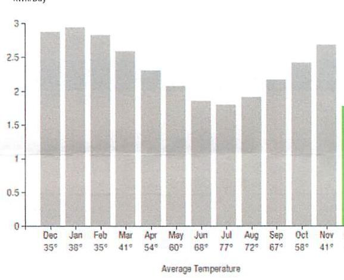
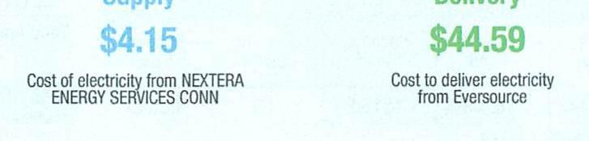
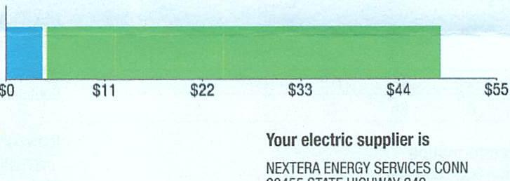
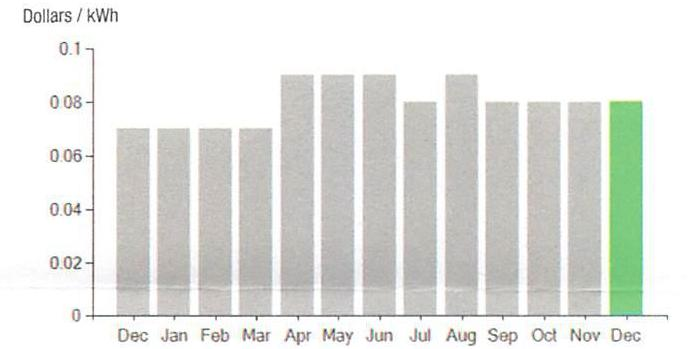

## EVERSEURCE

Account Number: 51864223045
Statement Date: 12/14/23
Service Provided To:
TOWN OF BERLIN/PUBLIC WORKS

## Electric Usage History - Kilowatt Modes (kWh)

The image is a bar chart.

- **Chart Type**: Bar chart
- **Y-Axis Title**: kWh/Day
- **X-Axis Title**: Average Temperature
- **Data Points**:
  - December: 35°, ~2.8 kWh
  - January: 35°, ~3 kWh
  - February: 35°, ~2.9 kWh
  - March: 41°, ~2.5 kWh
  - April: 54°, ~2.2 kWh
  - May: 60°, ~1.8 kWh
  - June: 68°, ~1.5 kWh
  - July: 77°, ~1.5 kWh
  - August: 72°, ~1.5 kWh
  - September: 67°, ~1.8 kWh
  - October: 58°, ~2.2 kWh
  - November: 41°, ~2.5 kWh
- **Yearly Usage Breakdown (Monthly-Based)**: The chart shows monthly electric usage in kilowatt-hours per day, with corresponding average temperatures for each month.
- **Styling**: The bars are gray, with the November bar highlighted in green.

## Electric Usage Summary

This month your average daily electric use was 2.0 kWh

## Total Amount Due

by $02 / 12 / 24$
Amount Due On 12/11/23
Last Payment Received On 11/22/23
Balance Forward
Total Current Charges

## Current Charges for Electricity

The image is a photo or illustration showing two sections related to electricity charges.

- On the left, it reads:
  - "Supply"
  - "$4.15"
  - "Cost of electricity from NEXTERA ENERGY SERVICES CONN"

- On the right, it reads:
  - "Delivery"
  - "$44.59"
  - "Cost to deliver electricity from Eversource"

The text is color-coded, with "Supply" and its cost in blue, and "Delivery" and its cost in green.

## Current Charges for Electricity

The image is a graph or chart.

- **Chart Type**: Bar chart
- **X-Axis Labels**: $0, $11, $22, $33, $44, $55
- **Bar Colors**: 
  - A small section in blue at the start
  - A larger section in green following the blue
- **Embedded Text**:
  - "Your electric supplier is"
  - "NEXTERA ENERGY SERVICES CONN"
  - "20455 STATE HIGHWAY 249"

Your electric supplier is
NEXTERA ENERGY SERVICES CONN
20455 STATE HIGHWAY 249
HOUSTON TX 77070-2757
800-882-1276

## News For You

A new discount for electric bills is available if you have a financial hardship status on your electric account. Based on your household income or receipt of a public assistance benefit, you may be eligible for a 10\% or 50\% discount off your electric bill per month. For example, if you have a $\$ 100$ monthly bill, it would be $\$ 10$ less if you receive a $10 \%$ discount or $\$ 50$ less if you receive the $50 \%$ discount. See how to enroll at eversource.com/billhelp.

Remit Payment To: Eversource, PO Box 56002, Boston, MA 02205-6002
CE_231214PROC.TAT-5271-00034129

## EVERSEURCE

Account Number: 51864223045
Non-residential and residential non-hardship customers may be subject to a 1.00\% late payment charge if the "Total Amount Due" is not received by $01 / 11 / 24$.

## $100.17$

$($ ) $\square$
$1 / 11 / 24$
$1 / 11 / 24$
$1 / 11 / 24$
$1 / 11 / 24$

| 003136 | 000034129 |
| :--: | :--: |
|  |  |
|  |  |
|  |  |
|  |  |
|  |  |
|  |  |
|  |  |
|  |  |
|  |  |
|  |  |
|  |  |
|  |  |
|  |  |
|  |  |
|  |  |
|  |  |
|  |  |
|  |  |
|  |  |
|  |  |
|  |  |
|  |  |
|  |  |
|  |  |
|  |  |
|  |  |
|  |  |
|  |  |
|  |  |
|  |  |
|  |  |
|  |  |
|  |  |
|  |  |
|  |  |
|  |  |
|  |  |
|  |  |
|  |  |
|  | 

## EVERSEURCE

Account Number: 51864223045
Customer name key: BERL
Statement Date: 12/14/23
Service Provided To:
TOWN OF BERLIN/PUBLIC WORKS

| Svc Addr: 0 PART ST |  |  |  |  |  |
| :--: | :--: | :--: | :--: | :--: | :--: |
| KENNINGTON DT 88937 |  |  |  |  |  |
| Serv Ref: 764812006 |  |  | Bill Cycle: 10 |  |  |
| Service from 11/12/23 - 12/12/23 |  |  | 30 Days: |  |  |
| Next read date on or about: Jan 15, 2024 |  |  |  |  |  |
| Meter   Number | Current   Read | Previous   Read | Current   Usage | Reading   Type |  |
| 892595742 | 18203 | 18150 | 53 | Actual |  |
| Total Demand Use $=0.20 \mathrm{~kW}$ |  |  |  |  |  |
| Monthly kWh Use |  |  |  |  |  |
| Dec | Jan | Feb | Mar | Apr | May | Jun |
| 86 | 97 | 79 | 75 | 69 | 60 | 61 |
| Jul | Aug | Sep | Oct | Nov | Dec |  |
| 54 | 61 | 65 | 70 | 83 | 53 |  |

## Contact Information

Emergency: 800-286-2000
www.eversource.com
Pay by Phone: 888-783-6618
Customer Service: 888-783-6617

## Total Amount Due

by $02 / 12 / 24$

## $100.17

Electric Account Summary
Amount Due On 12/11/23
Last Payment Received On 11/22/23
Balance Forward
Current Charges/Credits
Electric Supply Services
Delivery Services
Total Current Charges
Total Amount Due

## Total Charges for Electricity

## Supplier

NEXTERA ENERGY
Service Reference: 764812006 Supply
Subtotal Supplier Services

## Delivery

(DISTRIBUTION RATE: 030)
Service Reference: 764812006
Fixed Monthly Charge
Revenue Decoupling
FMCC Charge
Comb Public Benefit Chrg
Subtotal Delivery Services
Total Cost of Electricity

Total Current Charges
$101.70
$-$50.27
\$51.43
\$4.15
\$44.59
\$48.74
\$100.17

# $53.00 \mathrm{kWh} \times \$ 0.07822$ 

\$4.15
\$4.15

## $53.00 \mathrm{kWh} \times \$ 0.00080$

\$0.04
\$0.15
\$0.40
\$44.59
\$48.74

## $54.15$

$\$ 48.74$

# EVERSEURCE 

Account Number: 51864223045
Customer name key: BERL
Statement Date: 12/14/23
Service Provided To:
TOWN OF BERLIN/PUBLIC WORKS

Continued from previous page...

Supply Rate
Dollars / kWh

The image is a bar chart.

- **Chart Type**: Bar chart
- **X-Axis**: Labeled with months from "Dec" to "Dec" (December to December).
- **Y-Axis**: Labeled "Dollars / kWh" with a scale from 0 to 0.1.
- **Data Points**: 
  - Each month from December to November has a bar with a height around 0.08.
  - The bar for December is highlighted in green and slightly higher than the others, reaching approximately 0.09.
- **Yearly Usage Breakdown (Monthly-Based)**: The chart shows the supply rate in dollars per kWh for each month, with a notable increase in December.

