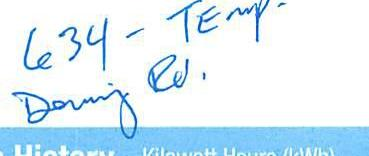
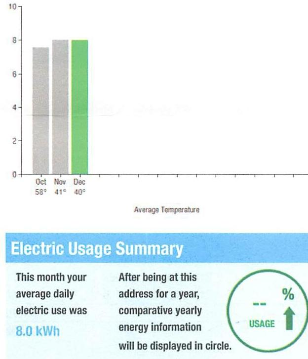
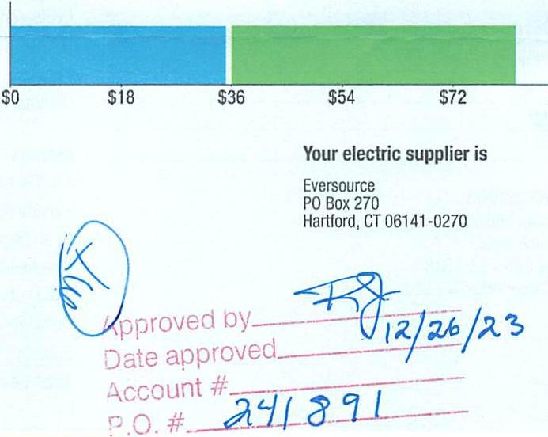

## EVERSEURCE

Account Number: 51362210122
Statement Date: 12/14/23
Service Provided To:
TOWN OF BERLIN WATER CONTROL C

The image is a photo or illustration showing handwritten text. The text reads:

"634 - Temp-
During Re."

Electric Usage History - Edward Houth (HWH)

The image is a graph/chart.

- **Chart Type**: Bar chart
- **X-Axis**: Labeled with months and average temperatures:
  - Oct: 58°
  - Nov: 41°
  - Dec: 40°
- **Y-Axis**: No specific label or unit visible, but the scale ranges from 0 to 10.
- **Data Points**: Bars for each month (Oct, Nov, Dec) with no specific values labeled, but visually similar in height.
- **Styling**: 
  - October and November bars are gray.
  - December bar is green.
- **Additional Text**:
  - "Average Temperature" below the x-axis.
  - "Electric Usage Summary" in a blue banner.
  - "This month your average daily electric use was 8.0 kWh" on the left.
  - "After being at this address for a year, comparative yearly energy information will be displayed in circle." on the right.
  - A circle with "-- % USAGE" on the right side.

## 6066463 1-4-2024 \$10,559.83

Total Amount Due
by $02 / 12 / 24$
Amount Due On 12/12/23
Last Payment Received On 11/22/23
Balance Forward
Total Current Charges

## Current Charges for Electricity

| Supply | Delivery |
| :--: | :--: |
| \$35.23 | \$46.79 |
| Cost of electricity from   Eversource | Cost to deliver electricity   from Eversource |

The image is a photo or illustration showing a section of a document with printed and handwritten text.

- **Printed Text**:
  - A bar chart with a scale showing dollar amounts: $0, $18, $36, $54, $72.
  - "Your electric supplier is Eversource PO Box 270 Hartford, CT 06141-0270"

- **Handwritten Text**:
  - "Approved by" with a signature.
  - "Date approved" with the date "12/26/23".
  - "Account #" with "241891".
  - "P.O. #" with a signature or initials.

## News For You

A new discount for electric bills is available if you have a financial hardship status on your electric account. Based on your household income or receipt of a public assistance benefit, you may be eligible for a $10 \%$ or $50 \%$ discount off your electric bill per month. For example, if you have a $\$ 100$ monthly bill, it would be $\$ 10$ less if you receive a $10 \%$ discount or $\$ 50$ less if you receive the $50 \%$ discount. See how to enroll at eversource.com/billhelp.

Remit Payment To: Eversource, PO Box 56002, Boston, MA 02205-6002
CE_231214PROC0.TXT-9817-060032576

## EVERSEURCE

Account Number: 51362210122
Non-residential and residential non-hardship customers may be subject to a $1.00 \%$ late payment charge if the "Total Amount Due" is not received by $01 / 11 / 24$.

## $60664631-4-2024 \$10,559.83$

## $164.18$

## $164.18$

$164909000032576$
$\left[1\left[1^{11}\left[1^{11}\right]^{\wedge}\left[1^{11}\left[1^{11}\right]^{\prime}\left[1^{11}\left[1^{11}\right]^{\prime}\left[1^{11}\right]^{\prime}\left[1^{11}\right]^{\prime}\left[1^{11}\right]^{\prime}\right]^{\prime}\right]^{\prime}\right]^{\prime}\right]^{\prime}\right]^{\prime}\right]^{\prime}\right]^{\prime}\right]^{\prime} \mid 11 / 11 / 11 / 11 / 11 / 11$
$1 / 11 / 24$
TOWN OF BERLIN WATER CONTROL C 240 KENSINGTON RD BERLIN CT 06037-2655

| SVERSEURCES   Account Number: 51382210122   Customer name key: BERL   Statement Date: 12/14/23   Service Provided To:   TOWN OF BERLIN WATER CONTROL C |
| :--: | :--: |
|  |  |
| Svc Addr: 634 DEMING RO   LOT TEMP SVC   BERLIN OT 06037 |  |
| Serv Rel: 312334004   Service from 11/13/23 - 12/14/23   Next read date on or about: Jan 15, 2024 | Bill Cycle: 10   31 Days |
| Meter   Number | Current   Read | Previous   Read | Current   Usage | Reading   Type |
| 037199042 | 563 | 316 | 247 | Actual |
| Total Demand Use $=0.30 \mathrm{KW}$ |  |  |  |  |
| Monthly AWh Use |  |  |  |  |
| Oct | Nov | Dec |  |  |
| 68 | 248 | 247 |  |  |

## Contact Information

Emergency: 800-286-2000
www.eversource.com
Pay by Phone: 888-783-6618
Customer Service: 888-783-6617

## Total Amount Due

by $02 / 12 / 24$
$164.18

## Electric Account Summary

Amount Due On 12/12/23
Last Payment Received On 11/22/23
Balance Forward
Current Charges/Credits
Electric Supply Services
Delivery Services
Total Current Charges
Total Amount Due

Total Charges for Electricity

## Supplier

Eversource
Service Reference: 312334004
Supply
Subtotal Supplier Services

## Delivery

(DISTRIBUTION RATE: 030)
Service Reference: 312334004
Fixed Monthly Charge
Revenue Decoupling
FMCC Charge
Comb Public Benefit Chrg
Subtotal Delivery Services
Total Cost of Electricity

Total Current Charges
\$105.83
$-$ \$23.67
\$82.16
\$35.23
\$46.79
\$164.18

## $247.00 \mathrm{KWh} \times \$ 0.14264$   \$35.23

\$35.23

## Delivery

(DISTRIBUTION RATE: 030)
Service Reference: 312334004
Fixed Monthly Charge
\$44.00
\$0.20
\$0.71
\$1.88
\$46.79
\$82.02

Total Current Charges

