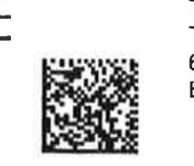
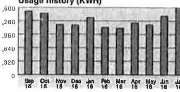

Hudson Energy Services, LLC
P.O. Box 142109

Irvine, TV 75014

Questions or Comments

53 HudsonEnergyCare@hudsonenergy.net
C www.HudsonEnergy.net

866-483-7664
Mon - Fri: 9:00 am - 5:30 pm Central
Emergencies and Power Outages
Call Centerpoint directly at
1-800-332-7143
The amount billed may include price changes allowed by law or regulatory action.
$\pm 103$

The image is a photo or illustration containing text. The text is mostly illegible due to blurriness, but it appears to contain numbers and possibly a signature or handwritten note.

Usage history (KWH)

The image is a graph or chart.

- **Chart Type**: Bar chart
- **Title**: Usage history (KWH)
- **X-Axis**: Months labeled as Sep 15, Oct 16, Nov 16, Dec 16, Jan 16, Feb 16, Mar 16, Apr 16, May 16, Jun 16, Jul 18, Aug 18, Sep 16
- **Y-Axis**: Values labeled as 0, .820, .640, .460, .280, .100
- **Data Points**: Bars representing usage for each month
- **Yearly Usage Breakdown (Monthly-Based)**: The chart shows monthly electricity usage over a period, with each bar representing a different month.
- **Styling**: Bars are uniformly styled with a consistent color.

Tawa, Inc.
Tawa, Inc.
6281 Regio Ave.
Sugar Land, TX 774784408-4408

Buena Park, CA 90620

| 

The image is a photo or illustration containing text. The visible text includes:

- "Hudson Energy"
- "P.O. Box"

The text appears to be part of a logo or letterhead, with the "Hudson Energy" text positioned to the right of a graphic element. The overall design is minimalistic with a focus on the text and logo. | New Charge |  | Payments/Ash, |  | Due Amount |  | Due Date |
| :--: | :--: | :--: | :--: | :--: | :--: | :--: | :--: |
|  | \$14,941.16 | \$14,843.78 | \$14,941.16 |  | \$14,843.78 |  | 10/20/16 |
| 16 Motor | LWG | 120 | 180 | Mail | Lcage | Gomup | Creece 1 arta |
| 80769155 | ACT (09/10-05/09) | 51810 | 50749 | 192 | 203,712.00 | 424.00 | 0 |
| Previous Balance. |  |  |  |  |  |  | \$14,941.16 |
| Payments and Adjustments |  |  |  |  |  |  |  |
| Payment on 09/19/16. |  |  |  |  |  |  | - $\$ 14,941.16$ |
| Total Payments/Adjustments. |  |  |  |  |  |  | - $\$ 14,941.16$ |
| Current Charges |  |  | Qty |  | Rate |  | Amount |
| Electric Service |  |  |  |  |  |  |  |
| Electric Energy Charges. |  |  | 203,712.00 |  | 0.04760 |  | \$9,696.69 |
| TDU Delivery Charges. |  |  |  |  |  |  | \$2,588.14 |
| Transmission Distribution Charges. |  |  |  |  |  |  | \$1,257.72 |
| Applicable Taxes |  |  |  |  |  |  |  |
| City Tax. |  |  |  |  |  |  | \$251.01 |
| Gross Receipts Reim |  |  |  |  |  |  | \$245.33 |
| PUC Assessment. |  |  |  |  |  |  | \$20.48 |
| State Tax. |  |  |  |  |  |  | \$784.41 |
| Total Current Charges. |  |  |  |  |  |  | \$14,843.78 |
| Total Amount Due. |  |  |  |  |  |  | \$14,843.78 |
| Agreement Details |  |  | Usage kWh |  | Avg Rate |  | Amount |
| 08/11/16 - 09/09/16 Fixed Rate |  |  | 203,712.00 |  | 0.04760 |  | \$9,696.69 |

The average price you paid for electricity this month is 6.6 g per kWh . Contract valid through 08/17/2017.

If you believe this bill includes unauthorized charges, please contact Hudson Energy to dispute such charges and, if you are not satisfied with our review, you may file a complaint with the Public Utility Commission of Texas, P.O. Box 13326, Austin, TX 78711-3326, (512) 936-7120 or toll-free in Texas at (888) 782-8477. Hearing and speech impaired individuals with text telephones (TTY) may contact the Commission at (512) 936-7136.
...Please return this portion with your payment ....

## Hudson Energy

Hudson Energy Services, LLC
P.O. Box 142109

Irving, TX 75014

Tawa, Inc.
Tawa, Inc.
6281 Regio Ave.
Buena Park, CA 90620

Amount Due: \$14,843.78 Due by: 10/20/16

Amount Enclosed : \$
Do Not Pay - Auto Credit Card Payment Scheduled on Due Date
Please call us if you are interested in participating in the Bill Assistance Program.

Hudson Energy Services, LLC
P.O. Box 731137

Dallas, TX 75373-1137

Hudson Energy Services, LLC
P.O. Box 142109

Irvina, TX 75014

Questions or Comments

E3 HudsonEnergyCare@hudsonenergy.net
( www.HudsonEnergy.net

## 866-483-7664

Mon - Fri: 9:00 am - 5:30 pm Central
Emergencies and Power Outages Call Centerpoint directly at 1-800-332-7143

The amount billed may include price changes allowed by law or regulatory action.

The image is a graph/chart.

- **Chart Type**: Bar chart
- **Title**: Usage history (KWH)
- **X-Axis Labels**: Jan 16, Feb 16, Mar 16, Apr 16, May 16, Jun 16, Jul 16, Aug 16, Sep 16
- **Y-Axis Labels**: 0, 400, 800, 1,200, 1,600, 2,000
- **Data Points**:
  - Jan 16: No visible bar
  - Feb 16: No visible bar
  - Mar 16: No visible bar
  - Apr 16: No visible bar
  - May 16: No visible bar
  - Jun 16: No visible bar
  - Jul 16: Bar slightly below 1,600
  - Aug 16: Bar slightly above 1,600
  - Sep 16: Bar at 2,000
- **Notable Styling**: The bars for July, August, and September are significantly taller than the others, indicating higher usage during these months.

This represents a **yearly usage breakdown (monthly-based)**.

## Tawa, Inc.

Tawa, Inc.
00904/16 - 09/05/16 Fixed Rate
$251,962.37$
$0.04590$
$11,565.07$
$3,648.12$
$1,586.81$
Application Taxes
City Tax.
Special Tax
PUC Assessment
State Tax
Total Current Charges
Total Amount Due

| Agreement Details | Usage kWh | Avg Rate | Amount |
| :--: | :--: | :--: | :--: |
| 08/04/16 - 09/05/16 Fixed Rate | 251,962.37 | 0.04590 | \$11,565.07 |

The average price you paid for electricity this month is 6.72 per kWh . Contract valid through 12/10/2016.

If you believe this bill includes unauthorized charges, please contact Hudson Energy to dispute such charges and, if you are not satisfied with our review, you may file a complaint with the Public Utility Commission of Texas, P.O. Box 13326, Austin, TX 78711-3326, (512) 936-7120 or toll-free in Texas at (888) 782-8477. Hearing and speech impaired individuals with text telephones (TTY) may contact the Commission at (512) 936-7136.
...Please return this portion with your payment ....

## Hudson Energy

Hudson Energy Services, LLC
P.O. Box 142109

Irving, TX 75014

The image is a photo/illustration of a QR code. There is no additional text or notable elements surrounding the QR code in the image.

Tawa, Inc.
Tawa, Inc.
6281 Regio Ave.
Buena Park, CA 90620

Hudson Energy Services, LLC
P.O. Box 731137

Dallas, TX 75373-1137

Hudson Energy Services, LLC
P.O. Box 142109

Irvinn TV 75014

Questions or Comments

53 HudsonEnergyCare@hudsonenergy.net
www.HudsonEnergy.net

## 866-483-7664

Mon - Fri: 9:00 am - 5:30 pm Central
Emergencies and Power Outages Call Centerpoint directly at 1-800-332-7143

The amount billed may include price changes allowed by law or regulatory action.

The image is a photo or illustration showing the text "#101" written in a handwritten style.

Usage history (KWH)

The image is a bar chart showing a **yearly usage breakdown (monthly-based)** for electricity usage in kilowatt-hours (KWH). 

- **Y-axis**: Labeled with increments of 320, starting from 0 up to 1,600.
- **X-axis**: Displays months from September 2015 (Sep 15) to August 2016 (Aug 16).
- Each bar represents the electricity usage for a specific month.
- The bars are uniformly styled with a dark fill.
- The chart title is "Usage history (KWH)".

Tawa, Inc.
Tawa Supermarket, Inc.
1005 Blalock Hd
Tawa, Inc.
Houston, TX 770557441-7441
6281 Regio Ave.
Buena Park, CA 90620

| Invoice Date: 09/15/16 | Invoice Period - 08/09/16 thru 09/08/16 |  |  |  |  |  |
| :--: | :--: | :--: | :--: | :--: | :--: | :--: |
| Previous Balance | New Charges |  | Payments/Adj. |  | Due Amount |  |
| \$27,871.05 | \$26,875.29 |  | \$27,871.05 |  | \$26,875.29 | 10/17/16 |
| 84 Motor | 1 V4V | 209/09 | 2 V4V, Btr. | 2 V4V, Btr. | 2 V4V, Btr. | 2 V4V, Btr. |
| 012397 | AC1 (05/09 - 09/08) | 38.945 | 9448.48 | 578 | 340,155.07 | 229,710.24 |
| Previous Balance |  |  |  |  |  | \$27,871.05 |
| Payments and Adjustments |  |  |  |  |  |  |
| Payment on 09/14/16 |  |  |  |  |  | - $\$ 27,871.05$ |
| Total Payments/Adjustments |  |  |  |  |  | - $\$ 27,871.05$ |
| Current Charges |  |  | Qty | Rate |  | Amount |
| Electric Service |  |  |  |  |  |  |
| Electric Energy Charges |  |  | 340,155.07 | 0.04760 |  | \$16,191.38 |
| TDU Delivery Charges. |  |  |  |  |  | \$6,118.82 |
| Transmission Distribution Charges. |  |  |  |  |  | \$2,201.95 |
| Applicable Taxes |  |  |  |  |  |  |
| City Tax. |  |  |  |  |  | \$227.93 |
| Gross Receipts Reimb. |  |  |  |  |  | \$445.53 |
| Special Tax. |  |  |  |  |  | \$227.93 |
| PUC Assessment. |  |  |  |  |  | \$37.19 |
| State Tax. |  |  |  |  |  | \$1,424.56 |
| Total Current Charges. |  |  |  |  |  | \$26,875.29 |
| Total Amount Due. |  |  |  |  |  | \$26,875.29 |
| Agreement Details |  | Usage kWh |  | Avg Rate |  | Amount |
| 08/09/16 - 09/08/16 Fixed Rate |  | 340,155.07 |  | 0.04760 |  | \$16,191.38 |

The average price you paid for electricity this month is 7.28 per kWh . Contract valid through 08/09/2017.

If you believe this bill includes unauthorized charges, please contact Hudson Energy to dispute such charges and, if you are not satisfied with our review, you may file a complaint with the Public Utility Commission of Texas, P.O. Box 13326, Austin, TX 78711-3326, (512) 936-7120 or toll-free in Texas at (888) 782-8477. Hearing and speech impaired individuals with text telephones (TTY) may contact the Commission at (512) 936-7136.
...Please return this portion with your payment ....

## Hudson Energy

Hudson Energy Services, LLC
P.O. Box 142109

Irving, TX 75014

Tawa, Inc.
Tawa Supermarket, Inc.
Tawa, Inc.
6281 Regio Ave.
Buena Park, CA 90620

|  |  |  |  |
| :--: | :--: | :--: | :--: |
| Amount Due: \$26,875.29 | Due by: 10/17/16 |  |  |
|  |  |  |  |
| Amount Enclosed : \$ |  |  |  |
| Do Not Pay - Auto Credit Card Payment Scheduled on Due Date |  |  |  |
|  |  |  |  |

Please call us if you are interested in participating in the Bill Assistance Program.

Hudson Energy Services, LLC
P.O. Box 731137

Dallas, TX 75373-1137

