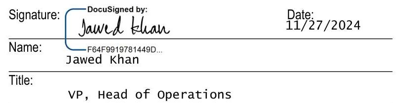

# CONTRACT SUMMARY   New Jersey - Electricity Supply Confirmation - Commercial Customers 

| Customer Name \& Address | Regal Cinemas Inc. |
| :--: | :--: |
| Utility Account Number | PE000009571810247736   If you signed up more than one account, please see the Facility Attachment. |
| Third Party Supplier (TPS)   Information   By entering into this contract you are agreeing to purchase your electric supply from this supplier. | Freepoint Energy Solutions LLC BPU License No. ESL-0197   2 University Plaza Drive, Hackensack, NJ 07601   www.freepointsolutions.com   Customer Service Toll Free Number: 1-800-982-1670   Customer Service Email: CustomerRelations@freepointsolutions.com   Freepoint Energy Solutions LLC is responsible for your electricity supply. |
| Price Structure | Variable rate. Certain Cost Components may be subject to changes; see Sections 3, 6 of the Master Agreement and Additional Charges and Demand Charges as defined on the Coversheet of this Confirmation for details. Sales and use tax is included in the Price. Variable rates may fluctuate each month to reflect market conditions. Weather may influence market conditions. |
| Generation/Supply Price | \$0.02876/kWh during the Initial Term. |
| Statement Regarding Savings | The price may be higher or lower than the Utility's price to compare. Therefore, savings are not guaranteed. |
| Amount of time required to change from TPS back to default service or to another TPS | After termination or cancellation of the Confirmation, your electric supply services will be transferred to the Utility's default service or another TPS on the next applicable meter read date as determined by your Utility. |
| Incentives | None. |
| Right to Cancel/Rescind | There is no rescission period for a commercial customer. |
| Contract Start Date | Deliveries of electricity will start on the first meter read date during or after 12/1/2024. If you signed up more than one account, please refer to the date in the Facility Attachment. |
| Contract Term/Length | The Initial Term of this Confirmation will end on the meter read date during or immediately following 12/1/2027, depending on your Utility's meter reading schedule. If you signed up more than one account, please refer to the date in the Facility Attachment. |
| Cancellation/Early Termination Fees | Yes. The Early Termination Amount ("ETA") is calculated as the value of any remaining volumes of electricity that would have been delivered during the Initial Term of the Confirmation (based on the difference between market prices and the contract price) and the costs incurred to terminate any related hedge or trading positions. There is no ETA if the Facility or this Confirmation is terminated after the end of the Initial Term of this Confirmation. Please see Section 7 Early Termination of the Master Agreement for details. |
| Renewal Terms | We will send you a renewal notice at least 30 days prior to the expiration of the Initial Term of this Confirmation. The notice will explain your options. If you do not renew, we will continue to serve you on a month-to-month term at a variable price. |
| Distribution Company Information | Your Utility will continue to deliver the electricity and you will continue to pay the Utility for this service. In case of an electrical emergency or a power outage, you should immediately contact your Utility: ACE: 1:800-833-7476; PSE\&G: 1-800-436-7734; JCP\&L: 1-888-5444877 |
| Spanish Language | To receive this Contract Summary in Spanish, please call our customer service at the number provided above. Para recibir este resumen del contrato en español, llame a nuestro servicio al cliente al número provisto arriba. |

# ELECTRICITY SUPPLY CONFIRMATION (PJM-NJ) Coversheet 

This Electricity Supply Confirmation together with the Coversheet, the Facility Attachment, the Special Provisions, the Contract Summary (if required by the applicable Law), and any other addenda hereto (collectively, the "Confirmation") is made pursuant to, forms part of and is subject to the Master Electricity Supply Agreement (the "Master Agreement") entered into by and between Freepoint Energy Solutions LLC ("Seller") and the customer party identified below ("Customer") on or about October 15, 2024. This Confirmation will be effective as of the date it is executed by Customer and Seller. The Master Agreement, this Confirmation and any exhibits, attachments and addenda hereto shall be collectively referred to as the "Agreement". Capitalized terms used but not defined herein shall have the meanings ascribed to them in the Master Agreement.

Customer Information:

| Customer Name (legal entity name): |  |  | DBA (if applicable): | Wallace Theatres (see facility list) |  |  |  |  |
| :--: | :--: | :--: | :--: | :--: | :--: | :--: | :--: | :--: |
| Customer Contact: Name: Laura Switaj (Required) |  |  | Title: Energy Manager (Required) |  |  |  |  |  |
| Phone: 865-910-3397   (Required) |  |  | Email:   (Required) | Laura.switaj@regalcinemas.com |  | Fax: |  |  |
| Address for Notices: Street: 101 E Blount Ave (Required) |  |  | City:   (Required) | Knoxville   (Required) |  | State:   (Required) | TN   (Required) | Zip: 37920   (Required) |

Electricity Supply Selection:

| Pricing: $\boxtimes$ | Price:   $\$ 0.02876 / k W h$ | Cost Components Included in the Price (check if included): $\square$ Energy $\square$ Capacity $\square$ Transmission |  |  |  |  |
| :--: | :--: | :--: | :--: | :--: | :--: | :--: |
| Index |  |  |  |  |  |  |
| Broker: NRG Kiosk LLC dba Power Kiosk |  |  |  |  |  |  |

Seller reserves the right to not enter into this Agreement in its sole discretion including if: (i) information provided by Customer or its representative (broker/agent) to Seller is incomplete or inaccurate, (ii) the Price listed was not authorized by Seller or rates have changed based on market conditions, (iii) transfer of Customer account(s) is denied or significantly delayed by the relevant Utility, or (iv) Customer does not meet Seller's credit approval criteria. Customer acknowledges and agrees that, in order for Seller to process a Confirmation submitted by Customer, Customer must deliver the signed Confirmation to Seller before 3:00 pm Eastern Time on the day it has received an executable version of such Confirmation from Seller. Seller may use the contact information provided above to contact Customer including by e-mail, autodialed calls, text messages or calls that use artificial or prerecorded voice regarding any billing, service or account-related matter. The Price includes the Cost Components marked above as included in the Price and will not change except for Additional Charges and Demand Charges as set forth in the paragraphs below of this Confirmation or Regulatory Charges, as set forth in Section 6 of the Master Agreement.

Customer hereby agrees to purchase its full requirements of electricity from Seller for each of the Facilities listed on the Facilities Attachment and authorizes Seller to become its electricity supplier, obtain Customer Data from the relevant Utility and take the actions required to switch all relevant electric accounts listed herein to Seller. The undersigned represents and warrants that each of the following is true and accurate: (i) I am an authorized representative of Customer, (ii) I have the authority to make decisions on behalf of Customer regarding its electricity supplier, (iii) none of the Facilities for which it is purchasing electricity from Seller is a residence and the electricity purchased hereunder will not be used for a residential purpose, and (iv) Customer is in agreement and will comply with all terms and conditions of the Agreement.

Change in Usage. With respect to any Transaction, Customer shall provide Seller with timely Notice of any material change in the attributes or use of any Facility (including any event) that is likely to result in a load change of one hundred percent (100\%) or more across all the Facilities included in this Confirmation (the "Load Change Percentage"), as compared to the Forecasted Volume. Examples of such changes may include equipment outages, shutdowns or replacements, on-site generation, openings or closings, and/or changes in operating hours. Customer shall be responsible for payment of the losses, costs and/or charges reasonably incurred by Seller resulting from such change including additional ISO or Utility charges (collectively, "Additional Charges").

Change in Demand. If there is a Regulatory Change that causes Seller to incur new or modified fees, costs or charges for Capacity, Transmission and/or Demand Determinants, Seller reserves the right pass through any such fees, costs or charges to Customer (collectively, the "Demand Charges").

At the end of the Initial Term of this Confirmation, Seller may continue to provide electricity supply to the Facilities on a month-to-month basis at market based pricing as per Section 3 Customer Charges of the Master Agreement, unless and until terminated by either Party upon providing the other Party with 30 days' prior Notice.

Additional Charges and Demand Charges described in this Confirmation and Regulatory Charges as described in the Master Agreement may impact any or all of the charges described in this Agreement, including, but not limited to, any Cost Component specified on the Confirmation's Coversheet, whether described as "fixed," "variable," "included in the Price," "passed through" or otherwise.

This Confirmation shall not become binding and effective until it is executed by Customer and Seller.

Customer: Regal Cinemas, Inc.

The image is a photo of a signature section from a document. It includes the following elements:

- **Signature:** A digital signature with the text "DocuSigned by: Jawed Khan."
- **Date:** "11/27/2024" is written to the right of the signature.
- **Name:** "Jawed Khan" is written below the signature line.
- **Title:** "VP, Head of Operations" is written below the name line.

The signature is positioned on the left, with the date on the right. The name is directly below the signature, and the title is below the name.

## FREEPOINT ENERGY SOLUTIONS LLC

Signature:
Date:

Name:
Title:

# ELECTRICITY SUPPLY CONFIRMATION   Facility Attachment 

This Facility Attachment supplements and forms a part of the Confirmation.
Customer Name: Regal Cinemas, Inc.

|  | Utility   Name | Account Number | DBA | Service Address | Estimated Start Date* | Service End Date | Bill Option** | PLC | NSPL | $\begin{gathered} \text { Tax } \\ \text { Exempt } \\ \%^{* * *} \end{gathered}$ |
| :--: | :--: | :--: | :--: | :--: | :--: | :--: | :--: | :--: | :--: | :--: |
| 1 | AECO | 055031230125700 0540166 |  | AMERICAN BLVD, TURNERSVILLE, NJ 08012 | 12/23/2024 | 12/22/2027 | Utility Consolidated - Bill Ready | 0.01 | 0.01 |  |
| 2 | AECO | 055031230141700 0474272 |  | AMERICAN BLVD, TURNERSVILLE, NJ 08012 | 12/23/2024 | 12/22/2027 | Utility Consolidated - Bill Ready | 139.92 | 153.00 |  |
| 3 | AECO | 055031230174700 0513357 |  | FRIESMILL RD, TURNERSVILLE, NJ 08012 | 12/23/2024 | 12/22/2027 | Utility Consolidated - Bill Ready | 185.93 | 210.00 |  |
| 4 | AECO | 055031230190700 0621929 |  | FRIESMILL RD, TURNERSVILLE, NJ 08012 | 12/23/2024 | 12/22/2027 | Utility Consolidated - Bill Ready | 1.86 | 2.06 |  |
| 5 | PSEG | PE0000081143034 59103 |  | 2399 RTE 1 SIGN, NORTH BRUNSWICK TWP, NJ 08902 | 01/10/2025 | 12/10/2027 | Utility Consolidated - Bill Ready | 0.01 | 0.01 |  |
| 6 | PSEG | PE0000082749417 38953 |  | 2465 S BROAD ST, HAMILTON TWP MER, NJ 08619 | 12/27/2024 | 12/29/2027 | Utility Consolidated - Bill Ready | 253.19 | 193.76 |  |
| 7 | PSEG | PE0000095718102 47736 |  | 2399 RTE 1 CINEMA, NORTH BRUNSWICK TWP, NJ 08902 | 12/31/2024 | 01/03/2028 | Utility Consolidated - Bill Ready | 366.57 | 286.12 |  |
| 8 | PSEG | PE0000103579637 47736 |  | 250 BROMLEY BLVD, BURLINGTON TWP, NJ 08016 | 01/08/2025 | 12/08/2027 | Utility Consolidated - Bill Ready | 325.37 | 257.77 |  |
| 9 | PSEG | PE0000107425936 79465 |  | S LENOLA RD SIGN, MOORESTOWN TWP, NJ 08057 | 12/31/2024 | 01/03/2028 | Utility Consolidated - Bill Ready | 0.01 | 0.01 |  |
| 10 | PSEG | PE0000108416793 59145 |  | 1000 CORPORATE CT   SIGN, SOUTH   PLAINFIELD BORO, NJ 07080 | 01/07/2025 | 12/07/2027 | Utility Consolidated - Bill Ready | 0.72 | 0.58 |  |
| 11 | PSEG | PE0000112317128 79465 |  | 400 W ROUTE 38 POLE, MOORESTOWN TWP, NJ 08057 | 12/31/2024 | 01/03/2028 | Utility Consolidated - Bill Ready | 1.31 | 1.11 |  |
| 12 | PSEG | PE0000113313803 44489 |  | 1000 CORPORATE CT, SOUTH PLAINFIELD BORO, NJ 07080 | 01/09/2025 | 12/09/2027 | Utility Consolidated - Bill Ready | 267.75 | 214.05 |  |
| 13 | PSEG | PE0000118811066 03476 | Wallace Theatres | 650 PLAZA DR, SECAUCUS TOWN, NJ 07094 | 01/03/2025 | 01/05/2028 | Utility Consolidated - Bill Ready | 482.50 | 369.47 |  |
| 14 | PSEG | PE0000120219407 79465 |  | 400 W ROUTE 38 STE 1600, MOORESTOWN TWP, NJ 08057 | 12/31/2024 | 01/03/2028 | Utility Consolidated - Bill Ready | 285.85 | 231.32 |  |

*The Service Start Date is estimated to occur on the first meter read date during or after the month specified above. However, this is an estimated start date and the actual start date will occur only after the enrollment processes are completed by the Utility.
**For Dual Billing, Seller will generate a separate invoice for the Seller Charges either as Account Level Billing or as Summary Billing. If no selection is made or if no Dual Billing Address is provided, Seller will use Account Level Billing.
$\square$ Account-Level Billing - each Facility will have a separate invoice generated and sent to each Facility's service address, unless a Dual Billing Address or e-mail address is provided herein.
$\square$ Summary Billing - one invoice for all Facilities sent to the Dual Billing Address or e-mail address, if provided.
Dual Billing Address: Street; City: State:
Zip:
Please check this box if you wish to receive invoices by mail.
***Tax exemption certificate needs to be provided by Customer to receive the applicable tax exemption on its electricity invoices.

## Forecasted Volume

| Month | Summary Forecasted   Volume (kWh) |
| :--: | :--: |
| $12 / 2024$ | $47,023.83$ |
| $1 / 2025$ | $526,059.84$ |
| $2 / 2025$ | $508,744.02$ |
| $3 / 2025$ | $529,516.43$ |
| $4 / 2025$ | $488,127.68$ |
| $5 / 2025$ | $569,048.99$ |
| $6 / 2025$ | $714,053.42$ |
| $7 / 2025$ | $886,150.06$ |
| $8 / 2025$ | $822,045.91$ |
| $9 / 2025$ | $638,535.14$ |
| $10 / 2025$ | $540,289.54$ |
| $11 / 2025$ | $504,938.52$ |
| $12 / 2025$ | $566,366.96$ |
| $1 / 2026$ | $563,729.64$ |
| $2 / 2026$ | $509,140.46$ |
| $3 / 2026$ | $533,553.08$ |
| $4 / 2026$ | $489,318.48$ |
| $5 / 2026$ | $564,023.07$ |
| $6 / 2026$ | $717,106.06$ |
| $7 / 2026$ | $890,095.11$ |
| $8 / 2026$ | $822,144.21$ |
| $9 / 2026$ | $639,529.67$ |
| $10 / 2026$ | $538,212.11$ |
| $11 / 2026$ | $505,601.79$ |
| $12 / 2026$ | $562,783.95$ |
| $1 / 2027$ | $562,318.37$ |
| $2 / 2027$ | $508,872.17$ |
| $3 / 2027$ | $541,062.65$ |
| $4 / 2027$ | $489,208.52$ |
| $5 / 2027$ | $562,998.61$ |
| $6 / 2027$ | $715,931.34$ |
| $7 / 2027$ | $887,452.61$ |
| $8 / 2027$ | $830,367.58$ |
| $9 / 2027$ | $644,157.08$ |
| $10 / 2027$ | $537,214.28$ |
| $11 / 2027$ | $508,442.17$ |
| $12 / 2027$ | $401,339.19$ |
| $1 / 2028$ | $17,575.28$ |
| Total | $21,883,077.81$ |

By signing below Customer confirms that all information set forth in this Facility Attachment is true, complete and accurate.

Customer: Regal Cinemas, Inc.

The image is a photo of a signed document section. It includes the following text:

- **Signature:** DocuSigned by: Jawed Khan
- **Date:** 11/27/2024
- **Name:** Jawed Khan
- **Title:** VP, Head of Operations

There is a digital signature with the identifier "F64F9919781449D..." above the name. The layout shows the signature on the left, the date on the right, and the name and title below the signature.

FREEPOINT ENERGY SOLUTIONS LLC
Signature: Date:

Name:

Title:

Vp, Head of Operations

# ELECTRICITY SUPPLY CONFIRMATION Special Provisions Applicable to Facilities Located in New Jersey 

Seller is licensed as an electric power supplier by the Commission under license no. ESL-0197. The name and energy service for which the Customer is solicited is shown on the Confirmation and the preamble of this Master Agreement. The Customer's Utility remains responsible for the delivery of power and energy to the Customer's premises and will continue to respond to any service calls and emergencies. Switching to an electric power supplier is not mandatory and Customer has the option to remain with the Utility for basic generation service. Nothing contained in the Agreement will constitute a waiver of any rights Customer has under New Jersey or Federal consumer protection laws. Notwithstanding any other provision of the Agreement, the Price applicable to electricity sales in New Jersey includes the New Jersey sales and use tax in effect as of the effective date of the Agreement and may be subject to change if there is a Regulatory Change as described in Section 6 Regulatory Change of the Master Agreement or Demand Charges as described on the Coversheet of this Confirmation. If Seller incurs any Additional Charges in connection with a load change of any Facility, the Additional Charges will be equal to the applicable LMP multiplied by any hourly load change beyond +/- the Load Change Percentage of the applicable Facility's Forecasted Volume, plus any additional ISO or Utility charges. Seller makes no representations about guaranteed savings and does not offer budget billing. Customer represents and warrants to Seller that it is not a residential customer. Without limitation to Seller's rights in Sections 7 Early Termination and Section 8 Termination Payment Calculation of the Master Agreement, if an Event of Default occurs and is continuing, Supplier may terminate this Confirmation upon 30-days' Notice to Customer of such termination. If Customer fails to cure the Event of Default within the 30-day notice period, Seller may terminate this Confirmation even if Customer subsequently cured the Event of Default after such period has expired. In the event of any dispute, complaint or other concern Customer may have concerning the Agreement or our services, please contact Customer Service using the contact information set forth in the Notice section of the Master Agreement. If your complaint is not resolved after you have called Seller and/or your Utility, Customer may contact the Commission for further assistance at (973) 648-2350 or 1-800-624-0241 (toll free), or at 44 S. Clinton Avenue, $9^{\text {th }}$ Floor, PO Box 350, Trenton, NJ 08625-0350, or online at http://www.bpu.state.nj.us/bpu/about/contact/. An electric supplier or an electric public utility shall not cause an unauthorized change in a customer's electric power supplier, a practice known as "slamming." If you have a slamming complaint you may go to: https://nj.gov/bpu/assistance/complaints/slamming.html. For third party supplier complaints, you may go to: https://nj.gov/bpu/pdf/custassistance/bjs_bpu_complaint.pdf.To submit your utility complaint electronically, you may go to: https://nj.gov/bpu/assistance/complaints/inquiry.html.

The Utility is responsible for the distribution charges shown on each bill, as well as any emergencies and electric outages. In an electrical emergency or a power outage, Customer should immediately contact the relevant Utility:
Atlantic City Electric ("ACE"): 1:800-833-7476
Jersey Central Power \&Light ("JCPL") 1-888-544-4877
PSE\&G: 1-800-436-7734
With respect to Transactions for Facilities located in New Jersey, the following terms have the meanings set forth below:
"Commission" means the New Jersey Board of Public Utilities.
"Protected Class Customer" means a commercial electric customer with a cumulative peak load of 50 kilowatts or less.
"Utility" means the electric distribution company which is a public utility (as defined in N.J.S.A 48:2-13) that transmits and distributes electricity to end users in New Jersey.

