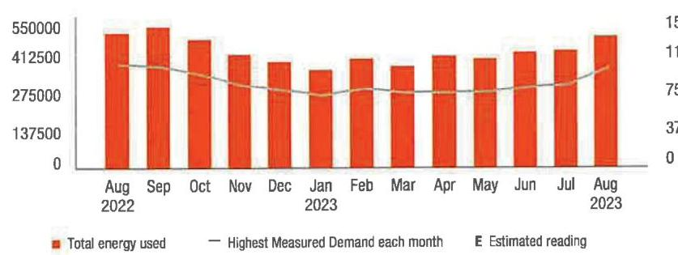
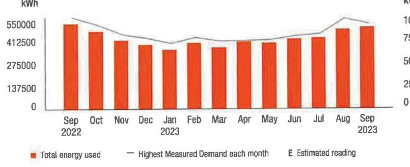
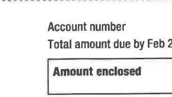
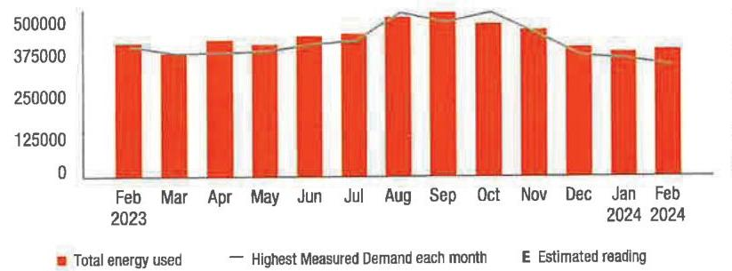

## Your energy bill

## Message Center

This bill reflects BPU-approved changes in the Delivery portion of your electric bill, effective on and after August 1, 2023. There will be an increase due to changes in the Tax Adjustment Credit. The overall impact for business customers will vary by individual customer usage. Tariff information may also be found by visiting pseg.com.

Don't fall victim to payment scams if you receive a phone call demanding immediate bill payment with a prepaid card or cash transfer app, it is a scam. When in doubt, hang up and call the number listed on your bill: 1-800-436-7734. For more information, visit pseg.com/scamalert.

Never miss a payment! With Automatic Bill Pay, your bill is automatically paid from your designated bank account on your bill due date. You can even set up a maximum monthly withdrawal amount. For more information about AutoPay and a variety of other convenient ways to pay your bill, visit pseg.com/paymentoptions.

## NEXT METER READING August 31, 2023

## How to contact us

## 1-855-BIZ-PSEG (249-7734)

Customer Service: 8am to 5:30pm Mon to Fri, Closed on weekends and holidays
Emergencies / Outages / WorryFree Services: 24/7
TTY for the hearing impaired: 1-800-225-0072
Visit pseg.com/myaccount to access your account anytime
Text us. Register for MyAlerts by texting REG to 4PSEG(47734)
$>$ Text OUT to report an outage.
facebook.com/pseg
twitter.com/psegdelivers

Bill date: August 09, 2023
For the period: July 01, 2023 to July 31, 2023

## - TRIS PHARMA INC

## ACCOUNT NUMBER

4226402200

## SERVICE ADDRESS

2033 ROUTE 130 BLDG B A-G SOUTH BRUNSWICK TWP NJ 08852

## Your billing summary

## Balance remaining from your last bill

PSE\&G balance from last bill
$\$ 56,154.16$
Less Payment received July 21, 2023 - thank you!
Balanced
Balance remaining from your last bill
This month's charges and credits
Electric charges - PSE\&G for 1 meter
This month's charges and credits
Total amount due by Aug 24, 2023
\$66,096.13

Page 1 of 3

## PSEG

We make things work for you.

## PAY YOUR WAY, 24/7

We offer a variety of methods that make it easy to pay your bill. See reverse side for more information,

By checking this box, I authorize PSE\&G to initiate recurring AOH/Electronic Debits using the bank account number on the enclosed check.

By checking this box, I authorize PSE\&G to enroll me in paperless billing at this email address:

TRIS PHARMA INC
2033 RTE 130 STE D
MONMOUTH JUNCTION NJ 08852

| Account number | 4226402200 |
| :-- | --: |
| Total amount due by Aug 24, 2023 | $\$ 66,096.13$ |
| Amount enclosed |  |

PSE\&G CO
PO BOX 14444
NEW BRUNSWICK NJ 08906-4444

## Details of your electric charges

Your rate: Large Power \& Lighting Secondary (LPLS)

| Meter \# 9221367 | Usage |
| :--: | :--: |
| Reading Jul 31, 2023 |  |
| On-Peak Actual | 15898 |
| Reading Jul 1, 2023 |  |
| Less On-Peak Actual | 14312 |
| Multiplier | 300 |
| Total On kWh | 209,882 |
| Total Off kWh | 266,057 |
| Total kWh | 475,939 |

## Delivery charges

| Monthly service charge | $\$ 370.81$ |
| :--: | :--: |
| Charges for delivering electric to you: |  |
| Annual Demand 960.700 kW x \$4.943198 | $\$ 4,748.93$ |
| The highest Measured Demand in any time period in the current month. |  |
| Summer Demand 960.700 kW x \$9.149703 | $\$ 8,790.12$ |
| The Measured Demand (excluding off-peak) in each billing month of June through September. |  |
| kWh - On-peak 209,882 kWh x \$0.008558 | \$1,796.17 |
| Energy consumed between 8am-10pm, Monday to Friday. |  |
| kWh - Off-peak 266,057 kWh x \$0.008558 | $\$ 2,276.92$ |
| Energy consumed outside peak hours. |  |
| Societal Benefits 475,939 kWh x \$0.010413 | $\$ 4,955.95$ |
| This charge recovers the cost of government mandated programs designed to achieve public policy goals, such as energy conservation. |  |
| Total electric delivery charges | $\$ 22,938.90$ |
| Supply charges |  |
| BGS Capacity |  |
| Generation 983,921 kW x \$10.733199 | \$10,560.62 |
| Transmission 870,090 kW x \$13.284499 | \$11,558.71 |
| Cost of electric supplied by PSE\&G: |  |
| Charges 475,939 kWh x \$0.044203 | \$21,037.90 |
| Total electric supply charges | $\$ 43,157.23$ |

## 44 Total electric charges

\$66,096.13

## Your monthly electric use

kWh

The image is a bar chart with a line graph overlay. 

- **Chart Type**: Bar chart with a line graph.
- **X-Axis**: Displays months from August 2022 to August 2023.
- **Y-Axis (Left)**: Represents total energy used, with values ranging from 0 to 550,000.
- **Y-Axis (Right)**: Represents the highest measured demand each month, with values ranging from 0 to 15.
- **Legend Entries**:
  - Red bars: "Total energy used"
  - Grey line: "Highest Measured Demand each month"
  - "E" for "Estimated reading"
- **Data Points**: Monthly energy usage and demand are shown, with notable peaks in August 2022 and August 2023.
- **Styling**: Red bars indicate energy usage, and a grey line indicates the highest measured demand. The chart includes estimated readings marked with "E."
- **Yearly Usage Breakdown (Monthly-Based)**: The chart provides a monthly breakdown of energy usage and demand over a year.

Visit MyAccount for more details regarding your energy usage.

## MEASURED DEMAND

| On-Peak kW | 960.70 |
| :-- | --: |
| Off-Peak2 kW | 839.70 |

Measured Demand is the maximum use of electricity at any time during a monthly time period, as measured by your meter.

## BILLED DEMAND

| Annual Demand kW | 960.70 |
| :-- | --: |
| Summer Demand kW | 960.70 |

## SUPPLY CAPACITY

| Generation kW | 983.921 |
| :-- | --: |
| Transmission kW | 870.090 |

Supply capacity is required to serve the system's annual peak usage. It represents your share of these facilities, in kilowatts (kW). It is calculated based on your peak usage from the previous summer. Supply capacity values are updated periodically throughout the year and are prorated based on your service period.

## Price to compare

If you want to consider getting your electric supply from another supplier, compare their price with ours. This month, your cost for energy supply is $\$ 43,157.23$. This price to compare varies month to month, depending on your usage.

Your PoD ID is: PE000012025094968332 Your PoD ID is your Point of Delivery identification within PSE\&G's system. You will need this number if you are considering enrolling with another supplier.

## Your energy bill

## Message Center

This bill reflects a BPU-approved change in the Supply portion of your electric bill effective on and after September 1, 2023. The increase in the Supply portion of your bill is due to a change in the Transmission rate. The overall impact for business customers will vary by individual customer usage. Tariff information may also be found by visiting pseg.com.

The success of your business is important to us. We are working hard to make it easier to do business with us. To learn more about how we can help, visit pseg.com/Business.
J.D. Power named PSE\&G \#1 in customer satisfaction for both Residential Electric and Natural Gas Service in the East among Large Utilities. On behalf of the more than 12,000 PSEG employees who work hard every day, we thank you for rating us as a top utilities provider. For J.D. Power 2022 award information, visit jdpower.com/awards.

## (2) NEXT METER READING

September 30, 2023

## How to contact us

## 1-855-BIZ-PSEG (249-7734)

Customer Service: Item to 5:30pm Mon to Fri,
Closed on weekends and holidays
Emergencies / Outages / WorryFree Services: 24/7
TTY for the hearing impaired: 1-800-225-0072
Visit pseg.com/myaccount to access your account anytime
Text us. Register for MyAlerts by texting REG to 4PSEG(47734)
$>$ Text OUT to report an outage.
facebook.com/pseg
twitter.com/psegdelivers

Bill date: September 08, 2023
For the period: August 01, 2023 to August 31, 2023

## - TRIS PHARMA INC

## ACCOUNT NUMBER

4226402200

## SERVICE ADDRESS

2033 ROUTE 130 BLDG B A-G SOUTH BRUNSWICK TWP NJ 08852

## Your billing summary

## Balance remaining from your last bill

PSE\&G balance from last bill
$\$ 66.096 .13$
Less Payment received August 23, 2023 - thank you!
Balance remaining from your last bill
\$0.00

This month's charges and credits
Electric charges - PSE\&G for 1 meter
This month's charges and credits
Total amount due by Sep 25, 2023
\$60,816.38

Page 1 of 3

## COMPUT

$\qquad$ 4226402200
Total amount due by Sep 25, 2023
\$60,816.38

Amount enclosed

By checking this box, I authorize PSE\&G to initiate recurring AOH/Electronic Debits using the bank account number on the enclosed check.

By checking this box, I authorize PSE\&G to enroll me in paperless billing at this email address:

## PSE\&G CO

PO BOX 14444
NEW BRUNSWICK NJ 08906-4444

## Details of your electric charges

Your rate: Large Power \& Lighting Secondary (LPLS)

## Meter \# 9221367

## Usage

Reading Aug 31, 2023
On-Peak Actual
17527
Reading Aug 1, 2023
Less On-Peak Actual
15898
Multiplier
Total On kWh
232,625
Total Off kWh
Total kWh
488,571

## Delivery charges

## Monthly service charge

$\$ 370.81$
$\begin{array}{ll}\text { Annual Demand } & 903.500 \mathrm{~kW} \times \$ 4.943199 \\ \text { The highest Measured Demand in any time period in the } & \$ 4,466.18\end{array}$
current month.
Summer Demand
903.500 kW x $\$ 9.149696$
The Measured Demand (excluding off-peak) in each billing month of June through September.
kWh - On-peak
232,625 kWh x $\$ 0.008773$
Energy consumed between 6am-10pm. Monday to Friday.
kWh - Off-peak
255,946 kWh x $\$ 0.008773$
Energy consumed outside peak hours.
Societal Benefits
488,571 kWh x $\$ 0.010413$
This charge recovers the cost of government mandated programs designed to achieve public policy goals, such as energy conservation.

Total electric delivery charges
$\$ 22,477.46$
Supply charges
BGS Capacity
Generation
983.921 kW x $\$ 10.733199$
\$10,560.62

Transmission
870.090 kW x $\$ 13.284499$
Cost of electric supplied by PSE\&G:
Charges
488,571 kWh x $\$ 0.033198$
Total electric supply charges
$\$ 16,219.59$
$\$ 38,338.92$

## $\stackrel{\text { Ma }}{\text { Total electric charges }}$

\$60,816.38

## Your monthly electric use

kWh

The image is a bar chart.

- **Chart Type**: Bar chart
- **X-Axis**: Months from September 2022 to September 2023
- **Y-Axis**: kWh (ranging from 0 to 550,000)
- **Legend Entries**:
  - Red bars: Total energy used
  - Line: Highest Measured Demand each month
  - E: Estimated reading
- **Data Points**:
  - Each month from Sep 2022 to Sep 2023 has a corresponding red bar indicating total energy used.
- **Notable Styling**:
  - The bars are red, representing total energy used.
  - A line indicates the highest measured demand each month.
- **Yearly Usage Breakdown (Monthly-Based)**: The chart provides a visual representation of energy usage per month over the course of a year.

Visit MyAccount for more details regarding your energy usage.

## MEASURED DEMAND

On-Peak kW
903.50

Off-Peak2 kW
743.10

Measured Demand is the maximum use of electricity at any time during a monthly time period, as measured by your meter.

## BILLED DEMAND

Annual Demand kW
903.50

Summer Demand kW
903.50

## SUPPLY CAPACITY

Generation kW
983.921

Transmission kW
870.090

Supply capacity is required to serve the system's annual peak usage. It represents your share of these facilities, in kilowatts (kW). It is calculated based on your peak usage from the previous summer. Supply capacity values are updated periodically throughout the year and are prorated based on your service period.

## Price to compare

If you want to consider getting your electric supply from another supplier, compare their price with ours. This month, your cost for energy supply is $\$ 38,338.92$. This price to compare varies month to month, depending on your usage.

Your PoD ID is: PE000012025094968332 Your PoD ID is your Point of Delivery identification within PSE\&G's system. You will need this number if you are considering enrolling with another supplier.

## Your energy bill

## Message Center

At PSE\&G, we are committed to supporting your business needs. That's why we have a dedicated, toll-free phone number to address your energy questions and concerns. PSE\&G's Business Solutions Center is available Monday-Friday, 8:00 a.m. - 5:30 p.m. at 1-855-249-7734 (1-855-BIZ-PSEG).

Don't fall victim to payment scams if you receive a phone call demanding immediate bill payment with a prepaid card or cash transfer app, it is a scam. When in doubt, hang up and call the number listed on your bill. 1-800-436-7734. For more information, visit pseg.com/ScamAlert.

Heating can be a big part of your business's energy costs. To save energy and money, we recommend setting thermostats between $66^{\circ} \mathrm{F}$ $68^{\circ} \mathrm{F}$ during heating months. For more tips, visit pseg.com/BizEnergyTips.

## 1710, 64010, Electric

## NEXT METER READING February 29, 2024

## How to contact us

## 1-855-BIZ-PSEG (249-7734)

Customer Service: Bam to 5:30pm Mon to Fri. Closed on weekends and holidays Emergencies / Outages / WorryFree Services: 24/7 TTY for the hearing impaired: 1-800-225-0072

Visit pseg.com/myaccount to access your account anytime
Text us. Register for MyAlerts by texting REG to 4PSEG(47734) $>$ Text OUT to report an outage.

## 1 facebook.com/pseg

twitter.com/pseg delivers

## PSEG

We make things work for you.

## PAY YOUR WAY, 24/7

We offer a variety of methods that make it easy to pay your bill. See reverse side for more information.

By checking this box, I authorize PSE\&G to inflate recurring ACH/Electronic Debits using the bank account number on the enclosed check.

By checking this box, I authorize PSE\&G to enroll me in paperless billing at this email address:

## THIS PHARMA INC

2033 RTE 130 STE D
MONMOUTH JUNCTION NJ 08852

Bill date: February 08, 2024
For the period: January 01, 2024 to January 31, 2024

## - TRIS PHARMA INC

## ACCOUNT NUMBER

4226402200

## SERVICE ADDRESS

2033 ROUTE 130 BLDG B A-G SOUTH BRUNSWICK TWP NJ 08852

## Your billing summary

Balance remaining from your last bill
PSE\&G balance from last bill
\$45,569.47
Less Payment received February 6, 2024 - thank you!
\$45,569.47
Balance remaining from your last bill
\$0.00

This month's charges and credits
Electric charges - PSE\&G for 1 meter
This month's charges and credits
Total amount due by Feb 23, 2024
\$53,108.98

The image is a photo or illustration of a handwritten signature with the date "02/15/24" written next to it.

Page 1 of 3

The image is a photo or illustration showing a section of a document. It includes the following text:

- "Account number"
- "Total amount due by Feb 2"
- "Amount enclosed"

The text is arranged in a vertical list format, with "Amount enclosed" inside a bordered box below the other text.

PSE\&G CO
PO BOX 14444
NEW BRUNSWICK NJ 08906-4444

## Details of your electric charges

Your rate: Large Power \& Lighting Secondary (LPLS)

| Meter \# 9221367 | Usage |
| :--: | :--: |
| Reading Jan 31, 2024 |  |
| On-Peak Actual | 24298 |
| Reading Jan 1, 2024 |  |
| Less On-Peak Actual | 23032 |
| Multiplier | 300 |
| Total On kWh | 176,410 |
| Total Off kWh | 203,435 |
| Total kWh | 379,845 |

## Delivery charges

Monthly service charge
$\$ 370.81$
Charges for delivering electric to you:
Annual Demand
$649,400 \mathrm{~kW} \times \$ 4.959593$
\$3,220.76
The highest Measured Demand in any time period in the current month
kWh - On-peak
$176,410 \mathrm{kWh} \times \$ 0.008773$
\$1,547.64
Energy consumed between 8am-10pm, Monday to Friday
kWh - Off-peak
$203,435 \mathrm{kWh} \times \$ 0.008773$
Energy consumed outside peak hours.
Socetal Benefits
$379,845 \mathrm{kWh} \times \$ 0.008282$
This charge recovers the cost of government mandated programs designed to achieve public policy goals, such as energy conservation.
Total electric delivery charges
$\$ 10,069.83$
Supply charges
BGS Capacity
Generation
$980.631 \mathrm{~kW} \times \$ 10.733201$
\$10,525.31
Transmission
$848,602 \mathrm{~kW} \times \$ 13.297506$
\$11,284.29
Cost of electric supplied by PSE\&G:
Charges
$379,845 \mathrm{kWh} \times \$ 0.055890$
Total electric supply charges
$\$ 43,039.15$
Total electric charges
$\$ 53,108.98$

Your monthly electric use
kWh

The image is a bar and line chart.

- **Chart Type**: Bar and line chart
- **X-Axis**: Months from February 2023 to February 2024
- **Y-Axis**: Energy usage in kWh, ranging from 0 to 500,000
- **Legend Entries**:
  - Red bars: Total energy used
  - Black line: Highest Measured Demand each month
  - "E": Estimated reading
- **Data Points**: 
  - Each month from February 2023 to February 2024 has a corresponding red bar indicating total energy used.
  - A black line indicates the highest measured demand for each month.
- **Styling**: Red bars represent total energy used, and a black line represents the highest measured demand. The letter "E" indicates estimated readings for certain months.
- **Yearly Usage Breakdown (Monthly-Based)**: The chart provides a visual representation of monthly energy usage and demand over a year.

Visit MyAccount for more details regarding your energy usage.

## MEASURED DEMAND

On-Peak kW
649.40

Off-Peak2 kW
611.80

Measured Demand is the maximum use of electricity at any time during a monthly time period, as measured by your meter.

## BILLED DEMAND

Annual Demand kW
649.40

## SUPPLY CAPACITY

Generation kW
648.602

Transmission kW
Supply capacity is required to serve the system's annual peak usage. It represents your share of these facilities, in kilowatts (kW). It is calculated based on your peak usage from the previous summer. Supply capacity values are updated periodically throughout the year and are prorated based on your service period.

## Price to compare

If you want to consider getting your electric supply from another supplier, compare their price with ours. This month, your cost for energy supply is $\$ 43,039.15$. This price to compare varies month to month, depending on your usage.

Your PoD ID is: PE000012025094968332 Your PoD ID is your Point of Delivery identification within PSE\&G's system. You will need this number if you are considering enrolling with another supplier.

## Message Center (Continued from page 1)

Si desea recibir en español una notificación de desconexión del servicio, llame al 1-800-357-2262.

All PSE\&G employees carry identification cards with their pictures on it. For your safety, ask to see the ID card of any PSE\&G employee visiting your home or business.

## Don't miss your meter reading

If you'll be away on your meter reading day, use our mobile app to upload a picture of your meter or enter your reading manually, or call 1-800-622-0197.

## Electric \& Gas Rate Information

For news about PSE\&G's rate filing and upcoming public hearings visit www.pseg.com/pseandgfilings. Under applicable tax law, the State Sales and Use Tax and corporate business tax are imposed upon the energy you have used.

# IT'S YOUR BILL. HOW YOU PAY IS YOUR CHOICE. 

My Account
Make a payment anytime from a checking or savings account stored in My Account. Visit pseg.com/ myaccount

Mobile: Download our Mobile App "PSE\&G"

Pay by text: Text PAY to 4PSEG (47734)

Voice: Ask Alexa or use Google Assistant.

## ㅇ

Automatic payments from your bank. Skip checks and stamps. Never worry about due dates.

## Enroll at:

pseg.com/autopay

Credit Card
Pay your bill with a credit card online or by phone. Because we don't use customer rates to subsidize the cost of this service, there is a fee.

My Account: pseg.com/myaccount

Phone:
$1-833-277-8710$

## Phone

Bank Account: 1-800-553-7734
Credit Card:
$1-833-277-8710$

## By Mail

Make your check payable to PSE\&G and write your account number on your check.

When you pay by check, you authorize PSE\&G to make a one-time electronic fund transfer from your account, in the amount of your check. If you prefer not to authorize us, call 1-800-436-PSEG.

## In Person

Payments are accepted at any customer service center or authorized location.

Locations can be found at: pseg.com/cac

