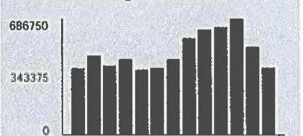
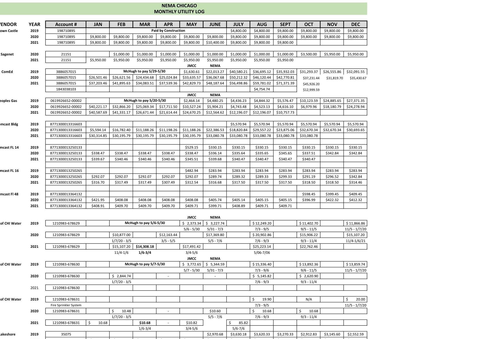
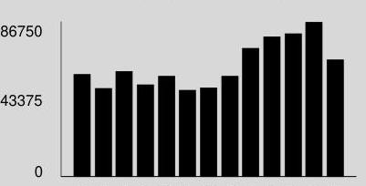
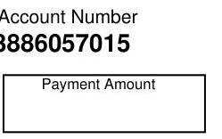

## UnitComEd.com

Customer Service / Power Outage English
1.877.4COMED1 (1.877.426.6331)

## Español

1.800.95 LUCES (1.800.955.8237)

Hearing/Speech Impaired
1.800.572.5789 (TTY)

Your Usage Profile
13-Month Usage (Total kWh)

The image is a bar chart.

- **Chart Type**: Bar chart
- **Y-Axis Title**: Not explicitly labeled, but values are shown as 0, 343375, 686750.
- **X-Axis Title**: Not visible
- **Data Representation**: Bars representing monthly kWh usage
- **Notable Styling**: Bars are uniformly colored in dark gray/black
- **Yearly Usage Breakdown (Monthly-Based)**: The bars show a trend of increasing usage over the months, peaking towards the end of the period.

Electric Usage

| Month | kWh |
| :-- | :-- |
| Dec-20 | 390850 |
| Jan-21 | 467192 |
| Feb-21 | 407620 |
| Mar-21 | 445807 |
| Apr-21 | 384481 |
| May-21 | 395147 |
| Jun-21 | 445383 |
| Jul-21 | 570138 |
| Aug-21 | 619956 |
| Sep-21 | 634747 |
| Oct-21 | 686746 |
| Nov-21 | 517996 |
| Dec-21 | 397302 |

|  | Average Daily |  |
| :--: | :--: | :--: |
| Month Billed | kWh | Temp |
| Last Year | 13477.6 | 47 |
| Last Month | 17861.9 | 63 |
| Current Month | 13700.1 | 44 |

Page 1 of 3
Account Number 3886057015
Name
SOUTH LOOP CHICAGO DEV
Service Location BLDG 1210 S INDIANA AVE CHICAGO
Phone Number 312-986-8000

Issue Date
November 29, 2021

| Meter information |  |  |  |  |  |  |  |  |
| :--: | :--: | :--: | :--: | :--: | :--: | :--: | :--: | :--: |
| Read   Dates | Meter   Number | Load   Type | Reading   Type | Previous | Meter Reading   Present | Difference | Multiplier   $X$ | Usage |
| 1005-   1104 | 230321181 | General Service | Total kWh | Actual | Actual |  |  |  |
| 1005-   1104 | 230321181 | General Service | On Pk kW | Actual | Actual |  |  | f |
| 1005-   1104 | 230322838 | General Service | Total kWh | Actual | Actual |  |  | 33 |
| 1005-   1104 | 230322838 | General Service | On Pk kW | Actual | Actual |  |  | 4: |
| 1005-   1104 | 230322839 | General Service | Total kWh | Actual | Actual |  |  |  |
| 1005-   1104 | 230322839 | General Service | On Pk kW | Actual | Actual |  |  | 1 |
| 1005-   1104 | 230323030 | General Service | Total kWh | Actual | Actual |  |  | 282 |
| 1005-   1104 | 230323030 | General Service | On Pk kW | Actual | Actual |  |  | 48: |
| 1005-   1104 | 230323076 | General Service | Total kWh | Actual | Actual |  |  | 26 |
| 1005-   1104 | 230323076 | General Service | On Pk kW | Actual | Actual |  |  | 41 |
| 1005-   1104 | 230323077 | General Service | Total kWh | Actual | Actual |  |  | 55 |
| 1005-   1104 | 230323077 | General Service | On Pk kW | Actual | Actual |  |  | 101 |
| 1005-   1104 | 230323086 | General Service | Total kWh | Actual | Actual |  |  |  |
| 1005-   1104 | 230323086 | General Service | On Pk kW | Actual | Actual |  |  | 1 |
| 1005-   1104 | 230345691 | General Service | Total kWh | Actual | Actual |  |  |  |
| 1005-   1104 | 230345691 | General Service | On Pk kW | Actual | Actual |  |  | 1 |

| 1005-   1104 | 230345691 | General Service | On Pk kW | Actual | Actual |  |  | 1 |
| :--: | :--: | :--: | :--: | :--: | :--: | :--: | :--: | :--: |
| 1005-   1104 | 230345691 | General Service | On Pk kW | Actual | Actual |  |  | 1 |

| 1005-   1104 | 230345691 | General Service | On Pk kW | Actual | Actual |  |  | 1 |
| :--: | :--: | :--: | :--: | :--: | :--: | :--: | :--: | :--: |
| 1005-   1104 | 230345691 | General Service | On Pk kW | Actual | Actual |  |  | 1 |

| 1005-   1104 | 230345691 | General Service | On Pk kW | Actual | Actual |  |  |  |
| :--: | :--: | :--: | :--: | :--: | :--: | :--: | :--: | :--: |
| 1005-   1104 | 230345691 | General Service | On Pk kW | Actual | Actual |  |  | 1 |

| 1005-   1104 | 230345691 | General Service | On Pk kW | Actual |  |  |  |
| :--: | :--: | :--: | :--: | :--: | :--: | :--: | :--: |
| 1005-   1104 | 230345691 | General Service | On Pk kW | Actual |  |  |  |
| 1005-   1104 | 230345691 | General Service |  |  |  |  |  |

| 1005-   1104 | 230345691 | General Service | On Pk kW | Actual |  |  |  |
| :--: | :--: | :--: | :--: | :--: | :--: | :--: | :--: |
| 1005-   1104 | 230345691 | General Service |  |  |  |  |  |

| 1005-   1104 | 230345691 | General Service |  |  |  |  |
| :--: | :--: | :--: | :--: | :--: | :--: |
| 1005-   1104 | 230345691 | General Service |  |  |  |  |
| 1005-   1104 | 230345691 | General Service |  |  |  |  |
| 1005-   1104 | 230345691 | General Service |  |  |  |  |

| 1005-   1104 | 230345691 | General Service |  |  |  |  |
| :--: | :--: | :--: | :--: | :--: | :--: |
| 1005-   1104 | 230345691 | General Service |  |  |  |  |
| 1005-   1104 | 230345691 | General Service |  |  |  |  |
| 1005-   1104 | 230345691 | General Service |  |  |  |  |
| 1005-   1104 | 230345691 | General Service |  |  |  |  |

| 1005-   1104 | 230345691 |  |  |  |  |
| :--: | :--: | :--: | :--: | :--: |
| 1005-   1104 | 230345691 |  |  |  |  |
| 1005-   1104 | 230345691 |  |  |  |  |
| 1005-   1104 | 230345691 |  |  |  |  |
| 1005-   1104 | 230345691 |  |  |  |  |
| 1005-   1104 | 230345691 |  |  |  |  |
|  |  |  |  |  |  |

| 1005-   1104 | 230345691 |  |  |  |  |
| :--: | :--: | :--: | :--: | :--: | :--: |
| 1005-   1104 | 230345691 |  |  |  |  |
| 1005-   1104 | 230345691 |  |  |  |  |
| 1005-   1104 | 230345691 |  |  |  |  |
| 1005-   1104 | 230345691 |  |  |  |  |
| 1005-   1104 | 230345691 |  |  |  |  |
|  |  |  |  |  |  |

| 1005-   1104 | 230345691 |  |  |  |  |
| :--: | :--: | :--: | :--: | :--: | :--: |
| 1005-   1104 | 230345691 |  |  |  |  |
| 1005-   1104 | 230345691 |  |  |  |  |
| 1005-   1104 | 230345691 |  |  |  |  |
| 1005-   1104 | 230345691 |  |  |  |  |
| 1005-   1104 | 230345691 |  |  |  |  |
|  |  |  |  |  |  |

| 1005-   1104 | 230345691 |  |  |  |  |
| :--: | :--: | :--: | :--: | :--: | :--: |
| 1005-   1104 | 230345691 |  |  |  |  |
| 1005-   1104 | 230345691 |  |  |  |  |
| 1005-   1104 | 230345691 |  |  |  |  |
| 1005-   1104 | 230345691 |  |  |  |  |
| 1005-   1104 | 230345691 |  |  |  |  |
| 1005-   1104 | 230345691 |  |  |  |  |
| 1005-   1104 | 230345691 |  |  |  |  |
| 1005-   1104 | 230345691 |  |  |  |  |
| 1005-   1104 | 230345691 |  |  |  |  |
| 1005-   1104 | 230345691 |  |  |  |  |
| 1005-   1104 | 230345691 |  |  |  |  |
| 1005-   1104 | 230345691 |  |  |  |  |
| 1005-   1104 | 230345691 |  |  |  |  |
| 1005-   1104 | 230345691 |  |  |  |  |
| 1005-   1104 | 230345691 |  |  |  |  |
| 1005-   1104 | 230345691 |  |  |  |  |
| 1005-   1104 | 230345691 |  |  |  |  |
| 1005-   1104 | 230345691 |  |  |  |  |
| 1005-   1104 | 230345691 |  |  |  |  |
| 1005-   1104 | 230345691 |  |  |  |  |
| 1005-   1104 | 230345691 |  |  |  |  |
| 1005-   1104 | 230345691 |  |  |  |  |
| 1005-   1104 | 230345691 |  |  |  |  |
| 1005-   1104 | 230345691 |  |  |  |  |
| 1005-   1104 | 230345691 |  |  |  |  |
| 1005-   1104 | 230345691 |  |  |  |  |
| 1005-   1104 | 230345691 |  |  |  |  |
| 1005-   1104 | 230345691 |  |  |  |  |
| 1005-   1104 | 230345691 |  |  |  |  |
| 1005-   1104 | 230345691 |  |  |  |  |
| 1005-   1104 | 230345691 |  |  |  |  |

| Table | Number of |  |  |  |
| :--: | :--: | :--: | :--: | :--: |
| Service from 10/26/2021 to 11/24/2021 - 29 Days | Commercial Hourly - 1000 kW to 10MW |  |  |  |
| Electricity Supply Services |  |  |  | \$33,318.11 |
| Electricity Supply Charge | 397,302 kWh |  |  | 20,845.20 |
| Capacity Charge | $1,340.40 \mathrm{~kW}$ | X | 6.09233 | 8,166.16 |
| Transmission Services Charge | 397,302 kWh | X | 0.00838 | 3,329.39 |
| Misc Procurement Component Chg | 397,302 kWh | X | 0.00091 | 361.54 |
| Purchased Electricity Adjustment |  |  |  | 615.82 |
| Delivery Services - ComEd |  |  |  | \$6,547.08 |
| Customer Charge |  |  |  | 554.12 |
| Standard Metering Charge |  |  |  | 12.64 |
| Distribution Facilities Charge | 686.92 kW | X | 7.91000 | 5,433.54 |
| IL Electricity Distribution Charge | 397,302 kWh | X | 0.00121 | 480.74 |
| Meter Lease |  |  |  | 66.04 |
| Taxes and Other |  |  |  | \$6,061.01 |
| Environmental Cost Recovery Adj | 397,302 kWh | X | 0.00022 | 87.41 |
| Renewable Portfolio Standard | 397,302 kWh | X | 0.00189 | 750.90 |
| Zero Emission Standard | 397,302 kWh | X | 0.00195 | 774.74 £ |
| Energy Efficiency Programs | 397,302 kWh | X | 0.00137 | 544.30 |
| Franchise Cost |  |  |  | 1,240.37 |
| State Tax |  |  |  | 1,194.21 |
| Municipal Tax |  |  |  | 1,469.08 |
| Total Current Charges |  |  |  | \$45,926.20 |
| Miscellaneous |  |  |  | \$68,580.08 |
| Charges from previous bill |  |  |  | 64,701.58 |
| Current late payment charge (s) - electric |  |  |  | 1,013.50 |
| Previous late payment charge (s) - electric |  |  |  | 2,865.00 |

(continued on next page)

## Visit ComEd.com

Customer Service / Power Outage English
1.877.4COMED1 (1.877.426.6331)

## Español

1.800.95.LUCES (1.800.955.8237)

Hearing/Speech Impaired
1.800.572.5789 (TTY)

Page 3 of 3
Account Number 3886057015

## Total Amount Due

## Message Center

## ComEd

- WAYS TO PAY: Looking for ways to pay your bill? Additional fees are no longer assessed on payments man by credit and debit card, or electronic check. And you can now use PayPal. It's safe, convenient and free! VI ComEd.com/Pay
- STOP ENERGY SCAMS: Scammers may threaten to disconnect service in exchange for immediate paymen or personal information. We will never demand payment using prepaid cash cards, third-party banking apps, cryptocurrency such as Bitcoin. Learn more: ComEd.com/ScamAlert.
- RESOLVING DISPUTES: The Illinois Commerce Commission Consumer Division is available at 800-524-07 to help resolve disputes with ComEd. However, customers should contact ComEd before seeking assistance from the ICC.

The image is a photo of a table titled "NEMA CHICAGO MONTHLY UTILITY LOG." It contains data organized by vendor, year, account number, and monthly utility costs from January to December for various years. 

Key elements include:

- **VENDOR**: Lists different vendors such as Crown Castle, Sagenet, ComEd, Peoples Gas, Comcast Bldg, etc.
- **YEAR**: Ranges from 2019 to 2021.
- **Account #**: Various account numbers are listed for each vendor and year.
- **Monthly Columns**: JAN, FEB, MAR, APR, MAY, JUNE, JULY, AUG, SEPT, OCT, NOV, DEC, showing utility costs.
- **Notes**: Includes specific notes like "Paid by Construction," "McHugh to pay 5/25-9/25," "JMCC," and "NEMA."
- **Data Values**: Specific monetary values are listed under each month for each account.

The table is structured with rows for each vendor and year, and columns for account numbers and monthly costs. Some cells contain notes or are left blank.

Payee Ledger

|  |  |  |  |  |  |  |  |  |  |  |  |  |  |  |  |  |  |  |  |
| :--: | :--: | :--: | :--: | :--: | :--: | :--: | :--: | :--: | :--: | :--: | :--: | :--: | :--: | :--: | :--: | :--: | :--: | :--: | :--: |
| Payee Code |  | Payee Name | Description | Content | Property | Service Date | Payment Median |  | Service | Account |  | Service # | Amount |  | Due Date | Urgent | Payment/ | Payment/ |  |
|  |  |  |  |  |  |  |  | Post Month |  |  |  |  |  |  |  | Amount | Receipt # | Receipt Date |  |
| (192) | Condit |  |  |  |  |  |  |  |  |  |  |  |  |  |  |  |  |  |  |
|  |  |  | Building Act (CCM-VC/2021) | P-650/65 |  | 092 | 01/2021 |  | Chest | 02-0021 |  | 5000-1000-8995-0001-1000aw - Electric |  | 3000/07/01/ 0221 |  | 27,025.46 | 01/2021 |  | 0.00 | 2822 | 02/02021 |
|  |  |  | Building Act (CCM-VC/0121) | P-651/1/0 |  | 092 | 03/2021 |  | Chest | 03-0021 |  | 5000-1000-8995-0001-1000aw - Electric |  | 3000/07/01/ 0321 |  | 41,895.63 | 03/2021 |  | 0.00 | 2824 | 02/02021 |
|  |  |  | Condit Building Act (CCCC-VC/221) | P-650/072 |  | 092 | 07/22021 |  | Chest | 04-0021 |  | 5000-1000-8995-0001-1000aw - Electric |  | 3000/07/01/ 0421 |  | 34,895.51 | 07/22021 |  | 0.00 | 2898 | 04/2021 |
|  |  |  | Condit Building Act (CBCC-VC/221) | P-650/220 |  | 092 | 02/02021 |  | Chest | 05-0021 |  | 5000-1000-8995-0001-1000aw - Electric |  | 3000/07/01/ 0521 |  | 42,829.73 | 02/02021 |  | 0.00 | 3146 | 07/2021 |
|  |  |  | Condit Building Act (CM-VC/0) | P-650/40 |  | 092 | 02/02021 |  | Chest | 05-0021 |  | 5000-1000-8995-0001-1000aw - Electric |  | 3000/07/01/ 0421 |  | 27,035.35 | 02/02021 |  | 0.00 | 3144 | 07/2021 |
|  |  |  | Building Act (CCV-VC/0) | P-700/077 |  | 092 | 02/02020 |  | Chest | 07-0021 |  | 5000-1000-8995-0001-1000aw - Electric |  | 3000/07/01/ 0621 |  | 46,307.64 | 02/02020 |  | 0.00 | 3359 | 07/22021 |
|  |  |  | Building Act (CM-BC/021) | P-707/782 |  | 092 | 02/21021 |  | Chest | 03-0021 |  | 5000-1000-8995-0001-1000aw - Electric |  | 3000/07/01/ 0621 |  | 39,761.62 | 02/21021 |  | 0.00 | 3712 | 03/122021 |
|  |  |  | Building Act (CM-VC/021) | P-707/783 |  | 092 | 02/02021 |  | Chest | 03-0021 |  | 5000-1000-8995-0001-1000aw - Electric |  | 3000/07/01/ 0521 |  | 31,271.39 | 02/02021 |  | 0.00 | 3713 | 03/122021 |
|  |  |  | Building Act (CM-TC/021) | P-707/784 |  | 092 | 02/02021 |  | Chest | 03-0021 |  | 5000-1000-8995-0001-1000aw - Electric |  | 3000/07/01/ 0721 |  | 30,498.86 | 02/02021 |  | 0.00 | 3714 | 03/122021 |
| Total |  |  |  |  |  |  |  |  |  |  |  |  |  |  |  |  |  |  |  |  |  |  |  |  |  |  |  |  |  |  |  |  |  |  |  |  |  |  |  |  |  |  |  |  |  |  |  |  |  |  |  |  |  |  |  |  |  |  |  |  |  |  |  |  |  |  |  |  |  |  |  |  |  |  |  |  |  |  |  |  |  |  |  |  |  |  |  |  |  |  |  |  |  |  |  |  |  |  |  | 

## Visit ComEd.com

Customer Service / Power Outage English
1.877.4COMED1 (1.877.426.6331)

## Español

1.800.95.LUCES (1.800.955.8237)

Hearing/Speech Impaired
1.800.572.5789 (TTY)

Your Usage Profile 13-Month Usage (Total kWh)

The image is a bar chart. 

- **Chart Type**: Bar chart
- **Y-Axis Labels**: 0, 43375, 86750
- **Bars**: There are 13 bars representing monthly data.
- **Styling**: The bars are black, and the background is gray.

This chart likely represents a **yearly usage breakdown (monthly-based)**, showing variations in usage over a 13-month period.

## Electric Usage

| Month | kWh |
| :-- | :-- |
| Nov-20 | 452799 |
| Dec-20 | 390850 |
| Jan-21 | 467192 |
| Feb-21 | 407620 |
| Mar-21 | 445807 |
| Apr-21 | 384481 |
| May-21 | 395147 |
| Jun-21 | 445383 |
| Jul-21 | 570138 |
| Aug-21 | 619956 |
| Sep-21 | 634747 |
| Oct-21 | 686746 |
| Nov-21 | 517996 |

## Month Billed

Last Year
Last Month
Current Month
Average Daily
kWh Temp
$14150.0 \quad 55$
$21460.8 \quad 71$
$17861.9 \quad 63$

For Electric Supply Choices visit
pluginillinois.org

## Bill Summary

Previous Balance
Total Payments - Thank You
Amount Due on November 11, 2021
\$191,000.32
\$187,651.27
\$67,566.58

| Meter information |  |  |  |  |  |  |  |  |
| :--: | :--: | :--: | :--: | :--: | :--: | :--: | :--: | :--: |
| Read Dates | Meter Number | Load   Type | Reading Type | Previous | Meter Reading Present | Difference | Multiplier | Usage |
| $\begin{aligned} & 9 / 27 . \\ & 10 / 26 \end{aligned}$ | 230321181 | General Service | Total kWh | Actual | Actual |  |  | 17 |
| $\begin{aligned} & 9 / 27 . \\ & 10 / 26 \end{aligned}$ | 230321181 | General Service | On Pk kW | Actual | Actual |  |  | 0.02 |
| $\begin{aligned} & 9 / 27 . \\ & 10 / 26 \end{aligned}$ | 230322838 | General Service | Total kWh | Actual | Actual |  |  | 33114 |
| $\begin{aligned} & 9 / 27 . \\ & 10 / 26 \end{aligned}$ | 230322838 | General Service | On Pk kW | Actual | Actual |  |  | 48.84 |
| $\begin{aligned} & 9 / 27 . \\ & 10 / 26 \end{aligned}$ | 230322839 | General Service | Total kWh | Actual | Actual |  |  | 0 |
| $\begin{aligned} & 9 / 27 . \\ & 10 / 26 \end{aligned}$ | 230322839 | General Service | On Pk kW | Actual | Actual |  |  | 0.00 |
| $\begin{aligned} & 9 / 27 . \\ & 10 / 26 \end{aligned}$ | 230323030 | General Service | Total kWh | Actual | Actual |  |  | 401556 |
| $\begin{aligned} & 9 / 27 . \\ & 10 / 26 \end{aligned}$ | 230323030 | General Service | On Pk kW | Actual | Actual |  |  | 858.00 |
| $\begin{aligned} & 9 / 27 . \\ & 10 / 26 \end{aligned}$ | 230323076 | General Service | Total kWh | Actual | Actual |  |  | 24615 |
| $\begin{aligned} & 9 / 27 . \\ & 10 / 26 \end{aligned}$ | 230323076 | General Service | On Pk kW | Actual | Actual |  |  | 39.60 |
| $\begin{aligned} & 9 / 27 . \\ & 10 / 26 \end{aligned}$ | 230323077 | General Service | Total kWh | Actual | Actual |  |  | 58678 |
| $\begin{aligned} & 9 / 27 . \\ & 10 / 26 \end{aligned}$ | 230323077 | General Service | On Pk kW | Actual | Actual |  |  | 110.10 |
| $\begin{aligned} & 9 / 27 . \\ & 10 / 26 \end{aligned}$ | 230323086 | General Service | Total kWh | Actual | Actual |  |  | 0 |
| $\begin{aligned} & 9 / 27 . \\ & 10 / 26 \end{aligned}$ | 230323086 | General Service | On Pk kW | Actual | Actual |  |  | 0.00 |
| $\begin{aligned} & 9 / 27 . \\ & 10 / 26 \end{aligned}$ | 230345691 | General Service | Total kWh | Actual | Actual |  |  | 17 |
| $\begin{aligned} & 9 / 27 . \\ & 10 / 26 \end{aligned}$ | 230345691 | General Service | On Pk kW | Actual | Actual |  |  | 0.03 |

| 010158401 AV 0.423 **AUTO TS 01214 60605-274899 -CDA-B1-P00000-11 |
| :--: |
|  |  |
|  |  |
|  |  |
|  |  |
|  |  |
|  |  |
|  |  |
|  |  |
|  |  |
|  |  |
|  |  |
|  |  |
|  |  |
|  |  |
|  |  |
|  |  |
|  |  |
|  |  |
|  |  |
|  |  |
|  |  |
|  |  |

To pay by phone call 1-800-588-9477.
A convenience fee will apply.

## Current Number

3886057015
Payment Amount

Please pay this
amount by $11 / 11 / 2021$
\$67,566.58

The image is a photo or illustration containing text.

- **Text**: 
  - "Account Number"
  - "3886057015"
  - "Payment Amount"

- **Spatial Relationships**: 
  - "Account Number" is positioned above "3886057015".
  - "Payment Amount" is below "3886057015" within a bordered box.

## $[\mathrm{m}] \mathrm{m}^{\mathrm{h}}[\mathrm{h}] \mathrm{m}^{\mathrm{h}}[\mathrm{m}^{\mathrm{h}}[\mathrm{m} \mathrm{l}][\mathrm{l}][\mathrm{h}][\mathrm{l}][\mathrm{l}][\mathrm{l}][\mathrm{l}][\mathrm{l}][\mathrm{l}][\mathrm{l}]$

COMED
PO BOX 6112
CAROL STREAM, IL 60197-6112
$38860570150000000013150000007$

| Service from 9/27/2021 to 10/26/2021 - 29 Days | Commercial Hourly - 1000 kW to 10MW |  |  |  |
| --- | --- | --- | --- | --- |
|  | Electricity Supply Services |  |  | \$43,861.52 |
| Electricity Supply Charge | 517,996 kWh |  |  | 29,940.42 |
| Capacity Charge | 1,340.40 kW | X | 6.09233 | 8,166.16 |
| Transmission Services Charge | 517,996 kWh | X | 0.00838 | 4,340.81 |
| Misc Procurement Component Chg | 517,996 kWh | X | 0.00091 | 471.38 |
| Purchased Electricity Adjustment |  |  |  | 942.75 |
| Delivery Services - ComEd |  |  |  | \$9,617.21 |
| Customer Charge |  |  |  | 554.12 |
| Standard Metering Charge |  |  |  | 12.64 |
| Distribution Facilities Charge | 1,056.59 kW | X | 7.91000 | 8,357.63 |
| IL Electricity Distribution Charge | 517,996 kWh | X | 0.00121 | 626.78 |
| Meter Lease |  |  |  | 66.04 |
| Taxes and Other |  |  |  | \$7,873.80 |
| Environmental Cost Recovery Adj | 517,996 kWh | X | 0.00022 | 113.96 |
| Renewable Portfolio Standard | 517,996 kWh | X | 0.00189 | 979.01 |
| Zero Emission Standard | 517,996 kWh | X | 0.00195 | 1,010.09 |
| Energy Efficiency Programs | 517,996 kWh | X | 0.00137 | 709.65 |
| Franchise Cost |  |  |  | 1,607.59 |
| State Tax |  |  |  | 1,550.69 |
| Municipal Tax |  |  |  | 1,902.81 |
| Total Current Charges |  |  |  | \$61,352.53 |
| Miscellaneous |  |  |  | \$6,214.05 |
| Charges from previous bill |  |  |  | 3,349.05 |
| Current late payment charge (s) - electric |  |  |  | 2,865.00 |
| Thank you for your payment of \$56,498.86 on October 25, 2021 |  |  |  |  |
| Thank you for your payment of \$71,371.39 on October 25, 2021 |  |  |  |  |

(continued on next page)

## Visit ComEd.com

Customer Service / Power Outage English
1.877.4COMED1 (1.877.426.6331)

## Español

1.800.95.LUCES (1.800.955.8237)

Hearing/Speech Impaired
1.800.572.5789 (TTY)

##underline 3 of 3

Account Number 3886057015

## Thank you for your payment of $\$ 59,781.02$ on October 25, 2021

Total Amount Due
\$67,566.58

## Message Center

## ComEd

- WAYS TO PAY: Looking for ways to pay your bill? Visit ComEd.com/PAY
- STOP ENERGY SCAMS: Scammers may threaten to disconnect service in exchange for immediate payment or personal information. We will never demand payment using prepaid cash cards, third-party banking apps, or cryptocurrency such as Bitcoin. Learn more: ComEd.com/ScamAlert.
- RESOLVING DISPUTES: The Illinois Commerce Commission Consumer Division is available at 800-524-0795 to help resolve disputes with ComEd. However, customers should contact ComEd before seeking assistance from the ICC.

