nationalgrid

## Bank Account / Electronic Check

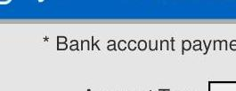

The image is a close-up photo showing text on a screen. The text reads: "* Bank account payments only". The text is displayed in a simple, sans-serif font, and the background is a light gray color. There is no additional context or imagery visible in the image.

* Bank account payments only
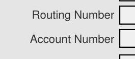

The image is a close-up photo showing text on a screen. The text reads:

- "Routing Number"
- "Account Number"

The text is displayed in a simple, sans-serif font. There are rectangular input fields next to each label, suggesting a form for entering these numbers. The background is a light gray color.

| YOUR NAME | 1234 Main Street |
| :-- | :-- |
| Anywhere, OH 0000 |  |
| PAY TO THE |  |
| ORDER OF |  |

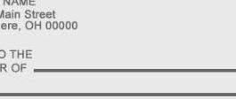

The image is a close-up photo of a section of a check. It shows the following text:

- "YOUR NAME"
- "1234 Main Street"
- "Anywhere, OH 0000"
- "PAY TO THE"
- "ORDER OF"

There are lines for writing additional information, such as the payee's name. The background is a light gray color.

|  |  |  |  |
| :-- | :-- | :-- | :-- |
| ROUTING | ACCOUNT | CHECK |  |
| NUMBER | NUMBER | NUMBER |  |

Amount to be paid
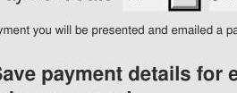

The image is a close-up photo showing text on a screen. The text reads:

- "Opon payment you will be presented and emailed a payment confirmation."
- "Save payment details for easy future payments"

The text is displayed in a simple, sans-serif font, and the background is a light gray color. There is no additional context or imagery visible in the image.

Opon payment you will be presented and emailed a payment confirmation.
Save payment details for easy future payments
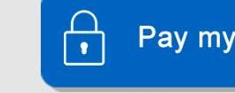

The image is a close-up photo showing a section of a button on a screen. The button is blue and contains a white padlock icon followed by the text "Pay my bill" in white. The background outside the button is a light gray color.

By clicking on the Pay my bill button, you are agreeing to the Terms and Conditions

## Credit / Debit Card

The image is a photo/illustration showing a section of a webpage or document. It features a blue horizontal bar at the top, followed by a thin gray line, and then a light gray background. There is no text or additional elements visible in the image.

## Click here to pay with a credit/debit card

You will be redirected to the service site for Speedpay®, an ACI Worldwide Company, to pay with a debit or credit card on any device.
*A convenience fee will apply

## Other Payment Options

## Automated Payments

## Never miss another payment!

Enroll in Automated Payments to have your full bill amount automatically deducted from your bank account. That's one less thing to remember next month!

The Speedpay name, logo and related trademarks and service marks, owned by E Commerce Group Products, Inc., are used with permission.

www.nationalgridus.com
C \& I BUSINESS TEAM M-F 8-5
1-800-664-6729
GAS EMERGENCIES
1-800-892-2345
(Does not replace 911 emergency medical service)

OUTAGE AND ELECTRIC EMERGENCIES
1-800-867-5222
CORRESPONDENCE ADDRESS
300 Erie Blvd West
Syracuse, NY 13202
DATE BILL ISSUED
Oct 30, 2020

## Enrollment Information

To enroll with a supplier or change to another supplier, you will need the following information about your account:

Acct No: 09210-97083 Cycle: 2, HUDS
Electric Usage History

| Month | kWh |
| :-- | --: |
| Oct 20 | 302719 |
| Nov 20 | 564276 |

Billed Demand Last 12 months

| Minimum | 785.7 |
| :-- | --: |
| Maximum | 828.9 |
| Average | 807.3 |

nationalgrid
300 Erie Blvd West
Syracuse NY 13202-0960

HUDSON DATA CENTER
193 E SENECA ST SHOP
OSWEGO NY 13126

BILLING PERIOD
Sep 25, 2020 to Oct 27, 2020
ACCOUNT NUMBER
09210-97083

PULSION DATA
34,191.56
$-\$ 0.00$
$+29,713.79$
Amount Due
\$ 63,905.35

## SUMMARY OF CURRENT CHARGES

|  | DELIVERY   SERVICES | SUPPLY   SERVICES | OTHER CHARGES/   ADJUSTMENTS | TOTAL |
| :--: | :--: | :--: | :--: | :--: |
| Electric Service | 16,855.26 | 12,858.94 |  | 29,714.20 |
| Other Charges/Adjustments |  |  | $-0.41$ | $-0.41$ |
| Total Current Charges | \$ 16,855.26 | \$ 12,858.94 | - $\$ 0.41$ | \$ 29,713.79 |

Important Updates to your Terms - By accepting service from National Grid, you expressly consent to the Company or its representatives contacting you by phone, autodialed and automated voice call, email, or text message regarding your utility service. You may opt-out of these calls by contacting us at the number or address above.

Tougher Penalties Help Protect Utility Workers: New York State has new laws in place to help better protect our field workers who face a number of challenges. Now, any action by a member of the public that prevents a utility worker from performing their job, or causes the worker physical injury, is considered a felony.

Payment concerns? We are here to help. To learn about solutions to help you take control of your energy use and bills, visit www.ngrid.com/billhelp.

KEEP THIS PORTION FOR YOUR RECORDS.
RETURN THIS PORTION WITH YOUR PAYMENT.
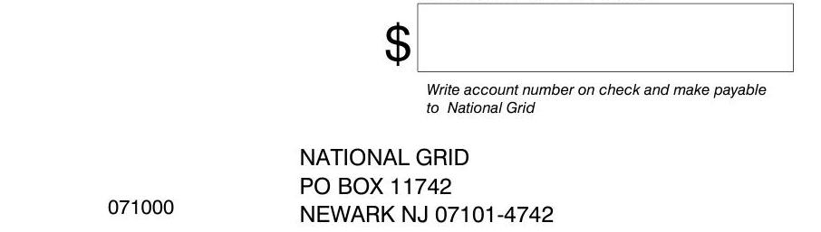

The image is a photo of a payment stub. It includes the following text:

- A large dollar sign "$" with a blank space for an amount.
- "Write account number on check and make payable to National Grid"
- "NATIONAL GRID"
- "PO BOX 11742"
- "NEWARK NJ 07101-4742"
- The number "071000" is printed at the bottom left.

# DETAIL OF CURRENT CHARGES 

## Delivery Services

|  | Energy | Demand |
| :--: | :--: | :--: |
| Metered Usage | 564276 kWh | 828.9 kW |
| Billed Usage | 564276 kWh | 828.9 kW |
| METER NUMBER 11135719 | NETT SCHEDULED READ DATE ON OR ABOUT Dec 1 |  |
| SERVICE PERIOD Sep 26 - Oct 27 | NUMBER OF DAYS IN PERIOD 32 | METERING TYPE Secondary |
| RATE Electric SC3 | voltage delivery level | $0-2.2 \mathrm{kV}$ |
| TRANSFORMER OWNERSHIP |  |  |
| Customer |  | 487.50 |
| Demand | 11.819375 | $\times 828.9 \mathrm{~kW}$ |
| SBC | 0.005491 | $\times 564276 \mathrm{kWh}$ |
| Legacy Transition Chrg | 0.001636 | $\times 564276 \mathrm{kWh}$ |
| Transmission Rev Adj | 0.001 | $\times 564276 \mathrm{kWh}$ |
| RDM | 0.7 | $\times 828.9 \mathrm{~kW}$ |
| Tariff Surcharge | 1.0101\% |  |
| Sales Tax | 8.0\% | 1,248.51 |
|  | Total Delivery Services | \$ 16,855.26 |

## Supply Services

SUPPLIER National Grid

| Electricity Supply | 0.02595 | $\times 564276 \mathrm{kWh}$ | 14,642.96 |
| :-- | --: | --: | --: |
| Merchant Function | 0.00035736 | $\times 564276 \mathrm{kWh}$ | 201.66 |
| ESRM | -0.005418 | $\times 564276 \mathrm{kWh}$ | $-3,057.25$ |
| Tariff Surcharge | 1.0101\% |  | 119.06 |
| Sales Tax | 8.0\% |  | 952.51 |
|  | Total Supply Services | \$ 12,858.94 |  |

## SERVICE FOR

HUDSON DATA CENTER 193 E SENECA ST SHOP OSWEGO NY 13126

## SERVICE FOR

BILLING PERIOD
Sep 25, 2020 to Oct 27, 2020
ACCOUNT NUMBER
09210-97083

PAGE 3 of 4
PAGE 3 of 4
$09210-97083$

## Other Charges/Adjustments

| Paperless Billing Credit | -0.41 |
| :--: | :--: |
| Total Other Charges/Adjustments | -\$ 0.41 |

## - For Your Information

The following charges are already included in the "Delivery Services" portion of your bill. If you were to choose an alternate supplier, billing charges would be paid to National Grid by that supplier. For information on metering services visit, http://www.dps.state.ny.us/esco_metering.html.

## Billing \& Metering Services

Electric Meter Ownership
5.96

Electric Meter Installation \& Maintenance
5.08

Electric Meter Data Service/Reading
3.46

Billing
0.98

Total Metering \& Billing Services $\quad \$ 15.48$

# nationalgrid 

## For Your Information

We want you to easily understand your bill, the terms we use and the charges that appear. Following is a brief explanation of items that appear on your bill, as well as payment programs and billing services we offer. If you have questions or want more detailed explanations, please visit our website at www.nationalgrid.com or call 1-800-642-4272.
Paying Your Bill/
Payment Options

- DirectPay: If you choose, National Grid will automatically withdraw your monthly bill payment from your checking or savings account. You will avoid the inconvenience of check writing, stamps, mailing and due dates. Your service bill will indicate your energy usage and the date of your next automatic withdrawal.
- By Mail: Send us your payment in the envelope provided with your bill. For your protection, please do not send cash. Put your 10-digit account number on your check or money order and include your bill stub. Please do not staple or paper clip your check to the stub.
- In Person: Pay at an authorized payment location by cash or check. Please bring your bill with you. Most locations charge a fee for providing this service. For the payment locations nearest you, visit our website or contact us.
- Online: Enroll online to receive and pay your bill online. The online function will begin with the next billing cycle following your enrollment.
- Late Payment Charge: To avoid Late Payment Charges, your payment must be received by the date shown on the front of the bill.

## Charges

Charges for electric or gas service are based on rates or prices approved by the New York State Public Service Commission (PSC). When changes in prices are approved by the PSC, information will be included with your bill. Complete price schedules are available on our website or by contacting us. National Grid reserves the right to upwardly adjust a previously issued bill or back bill.
Basic Service: A charge to cover costs for meter reading, billing, equipment and maintenance. This charge is the same regardless of how much energy is used during the billing period.
Tariff Surcharge: New York State and many local municipalities impose taxes on National Grid's revenue. These operating costs are recovered through a tariff surcharge applied to all rates and charges and may vary among taxing municipalities within the National Grid system area.
Sales Tax: In some areas National Grid is required to collect state and local sales taxes. Some school districts also impose taxes.

## Billing Credits

Paperless Billing Credit: A credit provided to Customers who elect to receive their bills electronically through the Company's Online Bill-Pay Program.
Outage Credit : A Credit issued by the company in the event of a prolonged electric service outage.

## Energy Measurement Terms

kWh: The unit of electricity usage measured by your meter. One kilowatt-hour(kWh) is 1000 watts-hours, and will light a 100-watt bulb for 10 hours. The number of kWh is is used to determine the electricity charges on your bill.
Meter Multiplier: Due to their design, some meters record a fraction of the total usage. The multiplier is used to convert the recorded meter reading on these types of meters to total actual consumption.

## Electric Service

Delivery: National Grid's charge for bringing electricity from your supplier to your premise, regardless of supplier. Included, when applicable, are the following surcharges: Earnings Adjustment Mechanism, Dynamic Load Management, Non-Wires Alternative, Clean Energy Standard Delivery, Value of Delivery Energy Resources and Reliability Services Surcharge.
Legacy Transition Charge (LTC): All delivery service customers are billed the cost or benefit of electricity supply contracts the Company entered prior to June 1, 2001. Residential customers also receive the benefit of low cost hydropower and a discount payment from the New York Power Authority.

Merchant Function Charge: A charge for the Company's cost to procure electricity supply. The Company will not bill you this charge if you choose an alternate supplier.
Capacity Tag: Your adjusted electricity demand at the hour of the New York Control Area peak load in the most recent 12 month period ending May 1.
SBC: These charges reflect costs associated with mandated public policy programs, such as the Clean Energy Fund.
Clean Energy Delivery :Charges associated with Clean Energy Standard program costs.
Revenue Decoupling Mechanism ("RDM") Reconciles actual billed delivery service revenues to annual target revenues. Delivery service revenues above target are refunded to customers. Target revenues above actual delivery service revenues are collected from customers.
Transmission Revenue Adjustment: Reconciles wholesale transmission service revenue to the forecasted transmission service revenue embedded in electric delivery rates. Transmission service revenues above those forecasted are credited to customers. Forecast revenues above actual revenues are collected from customers.
SBC Exemption: A credit provided to Customers who are not subject to the SBC.
Electricity Supply: The price of electricity supply used during the billing period. If you choose an alternate supplier, the price will be what you agree upon with that supplier.
Electricity Supply Reconciliation Mechanism (ESRM): Reconciles National Grid's electricity supply service revenues to the cost of Company purchased electricity, including Clean Energy Standard costs. Costs above revenues are recovered from customers. Revenues above costs are credited to customers.

## Estimating Your Usage

When we are unable to obtain a reading, we estimate your usage based on your past usage, taking current weather conditions into account. Because our meters keep a continuous record of usage, any difference between estimated and actual usage is reconciled with the next meter reading. To avoid estimated readings, you can take your own reading on or just before the scheduled date shown on your bill and call it in at 1-888-932-0301.

For more information, visit us at:
www.nationalgrid.com or call 1-800-642-4272
Customers with problems paying their National Grid bill should call 1-800-443-1837.

The image is a photo showing a woman and a child sitting on a couch, embracing each other warmly. The setting appears cozy and relaxed, suggesting a home environment. In the bottom left corner, there is an orange rectangle with the text "fall 2020." On the right side, there is a blue vertical band with a partial view of a text box containing the letter "W." The overall tone of the image conveys warmth and comfort.

# we connect 

Energy news for our electric and gas customers in Upstate New York

Gas Emergency 1-800-892-2345 or 911
Electric Emergency 1-800-867-5222
Customer Service 1-800-642-4272
ngrid.com | † 0

We're here to help now, and in the days ahead.
As the warmth of summer gives way to shorter days and cooler nights of autumn, the uncertainty from COVID-19 remains with us all.
If you have been financially impacted by the pandemic and are concerned about paying your National Grid bill, rest assured that solutions are available to help you.

## All customers qualify for payment assistance

Our COVID-19 Payment Agreement allows you to spread your past due amount over 12 manageable monthly installments - with $0 \%$ down payment and no financial reporting.
To learn more, visit ngrid.com/billhelp or call us at 1-800-443-1837.

## Receive outage

alerts your way.
You can choose how -
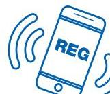

The image is an illustration of a smartphone with the text "REG" displayed on its screen. The phone is depicted with curved lines on either side, suggesting sound or signal waves, indicating communication or alerts. The illustration is simple and uses a blue color scheme.
and when - to be informed during an electric outage - by text, email or phone. Set up your alerts today. Visit ngrid.com/connect and follow the simple steps.
Want alerts by text*? Simply text REG to 64743.
*We do not charge for text alerts but normal message and data rates may apply based on your mobile carrier plan.

## Manage monthly energy bills with the Budget Plan.

The Budget Plan uses the amount you usually pay on your National Grid bill in a year and breaks that into predictable monthly payments based on your usage. You will still pay only for the total amount of energy you use in a year. Visit ngrid.com to see if the Budget Plan is right for you.

## Tips for paying your bill in person.

When paying your bill in person use an authorized payment agency to ensure your payment is made on a timely basis and your account is credited properly. Remember to bring your bill and keep your receipt.

For locations near you visit ngrid.com/unybillpay

See page 2 for more payment assistance options.

# Explore the Marketplace. 

Explore affordable, energy-efficient products that will help you conserve energy while you're spending more time at home this winter. Instant rebates on LED light bulbs, smart thermostats, powerstrips and more available for National Grid customers. Special discounts on thermostats and lighting will be available during Black Friday and Cyber Monday.
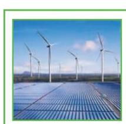

The image is a photo/illustration depicting a landscape with several wind turbines in the background and solar panels in the foreground. The scene suggests a focus on renewable energy sources, specifically wind and solar power. The image is framed with a green border. There is no embedded text within the image.

## GreenUp ${ }^{\text {TM }}$ renewable energy options.

You choose to have all or part of your electricity from renewable energy sources - wind, solar, and hydroelectric - while keeping National Grid as your electricity supplier. Learn more in the rates section of our website.
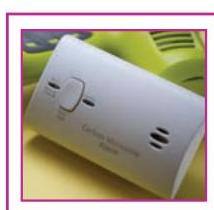

The image is a photo of a carbon monoxide detector. It is positioned against a yellow background with some green elements visible. The detector has a simple design with a few slots and a button. The text "Carbon Monoxide Alarm" is visible on the device. The image is framed with a pink border.

Take steps to avoid carbon monoxide poisoning.

- Schedule a heating system checkup with a licensed professional.
- Be sure to check CO detectors to make sure they are working properly.
- If your detector sounds the alarm have everyone go outside immediately and call 1-800-892-2345 or 911.
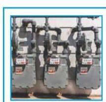

The image is a photo showing three gas meters mounted on a wall. The meters are connected by a network of pipes. The image is framed with a blue border. There is no embedded text within the image.

What to know about shared meters.
If you are a residential building tenant, you are not obligated to pay for gas service in any area outside your own dwelling unit. For more information about shared meter conditions, please call Customer Service.

## Where to find assistance.

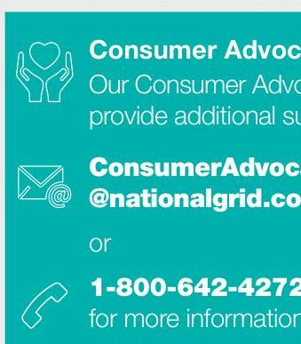

The image is a photo/illustration with a teal background featuring three icons: a heart held by hands, an envelope, and a telephone. The text reads:

"Consumer Advocates
Our Consumer Advocates provide additional support.

ConsumerAdvocates
@nationalgrid.com

or
1-800-642-4272
for more information"

## HEAP and the Energy Affordability Program

The Home Energy Assistance Program (HEAP) helps income eligible customers with their home heating bills. HEAP typically opens in November. To learn more visit: https://otda.ny.gov/programs/heap/ or call the OTDA HEAP Hotline at 1-800-342-3009. Enrollment in our Energy Affordability Program (EAP), which provides a monthly bill discount, is automatic with the receipt of a HEAP payment. The EAP discount continues for those that apply for HEAP annually. To learn more visit: ngrid.com/discount

## Planning fall planting?

Call 811 or visit digsafelynewyork.com to have underground lines marked before starting any digging project.

Multi-family, apartment or business complex owners please post. This is an important safety notice. Please have it translated. See "select language" link at ngrid.com
Vea ei enlace «seleccionar idioma» en ngrid.com
Voir le lien «sélectionner la langue» sur ngrid.com
Vedere il collegamento "seleziona lingua" su ngrid.com

Smell gas. Act fast. Gas Emergency? 1-800-892-2345 or call 911

[^0]
[^0]:    Ver a ligação "selecionar língua" em ngrid.com
    Cn. ссылку "Выбрать язык" на сайте ngrid.com
    Xem lẽn kẽt "lura chon ngõn ngu" tai ngrid.com

# Chapter 10 

## Rights and Responsibilities of Non-Residential Customers

As a National Grid customer receiving non-residential service in New York State, you have certain rights and responsibilities. This pamphlet summarizes your rights, as well as your responsibilities and obligations. If anything in this pamphlet is not clear, you may call our Commercial and Industrial Business Team at 1-800-864-6729. Monday-Friday, 8 a.m.-5 p.m. Our tariff is available for review at the New York State Public Service Commission (PSC) headquarters in Albany or on our website at nationalgridus.com. These rights and responsibilities are provided for in Part 13, Rules of Subchapter B, Chapter 1. Title 16 of the New York Code of Rules and Regulations.

## Applications for Non-Residential Service

You may apply for service by telephone. However, you may be required to complete a written application for service.
Following the receipt of a completed application, we will either provide or deny service within 10 days, unless prevented by circumstances beyond our control. If service is denied, we will provide you with a written statement containing our reasons for denial, what you must do to qualify for service and notice of your right to appeal to the PSC. If you qualify for service, you may be required to pay any past due amounts for which you are responsible and comply with all other customer responsibilities as required by our tariff before service is turned on. Additionally, if another party controls access to our meters, you will be required to provide us with the name and contact information of that party.

## Eligibility for Residential Rates

Certain religious organizations, farms, community residences as defined in the Mental Hygiene Law, and posts or halls owned or leased by a not-for-profit corporation that is a veterans' organization, may be eligible for billing at residential rates. Residential rates may be more beneficial depending on factors including the type (gas or electric), amount, and pattern of usage. In order to qualify, National Grid requires evidence of eligibility. For more information about eligibility requirements, call 1-800-864-6729. Monday-Friday, 8 a.m. - 5 p.m.

## Deposit Policy

When you apply for service, National Grid may require that you pay a security deposit prior to establishing service in your name. Deposits may also be required from existing customers who have either become delinquent or before reliable evidence exist(s) are likely to default on payment of billed service charges. Deposits also may be obtained from customers who have fixed for reorganization or bankruptcy and from some customers who are back billed for service provided through tampered equipment.
You can pay a security deposit by cash, check or by an alternative method such as a surely bond or letter of credit. Please note that National Grid pays interest only on security deposits that are paid in full by cash or check. Such deposits are held at a rate of interest set by the PSC. Interest is either paid to you at the time your deposit is returned or annually applied to your account as a credit for as long as we continue to hold the deposit. Deposits will be returned after three years if you have paid all of your service bills on time and there is no evidence that adverse financial conditions exist.
Security deposit amounts will ordinarily be twice the cost of your average monthly usage. In the case of customers whose usage varies widely, however, the amount can be twice the cost of your average monthly usage during the peak usage season.

## Meter Reading and Billing Policy

We are responsible for supplying gas and/or electric service to our customers in a reliable manner and accurately billing customers for the service they use.
You, as our customer, are responsible for arranging access to our meters and have an obligation to pay your utility bills on time. Here are some important highlights of our billing policies and procedures:

## When To Pay - National Grid bills are due and payable when

received. A payment is considered (overdue 20 days after the bill is mailed to you. You will see a date on your service bill that tells you what date you must pay the bill by to avoid late charges.
Where To Pay - Payments can be made by mail, at payment agencies located throughout our service area, through Online Bill-Pay, or by automatic withdrawal from your bank account (Direct Debit). To by mail, use the return envelope included with your service bill. For more information, visit nationalgridus.com or call 1-800-864-6729.

## Bill Contents - All of our service bills contain the following information:

1. Our Company's name and location of our main office.
2. The service classification (rate) on which we are billing you.
3. Your name, account number and service address.
4. The start and end dates of the billing period.
5. The quantity of service billed.
6. The amount of individual charges and total charges billed.
7. A date by which you must pay to avoid late payment charges.
8. A telephone number to call if you have a question about your bill.

## Budget Plan - If you want to spread your energy charges as evenly

as possible over a 12-month period, National Grid offers the Budget Plan. This payment plan does not reduce your overall energy expenses, but it may help you manage your budget. This plan is available to all non-residential customers except:
1. Customers who have less than 12 months of billing history at the premises.
2. Seasonal, short-term or temporary customers.
3. Customers who have arrears.
4. Interruptible, temperature-controlled or dual-fuel customers.
5. Customers who, for any reason, ceased being billed on a previous levelized payment plan before the end of the plan year, in the past 24 months.
6. Customers whose pattern of consumption is not sufficiently predictable to be estimated on an annual basis with any reasonable degree of certainty.
This voluntary plan is designed to reduce fluctuations in payments caused by seasonal patterns of consumption. If you would like more information or wish to determine whether you are eligible, call 1-800664-6729. Monday-Friday, 8 a.m.-5 p.m.

## Meter Reading/Access to Meters - Normal reading hours

are from 8 a.m. to 5 p.m. on business days. If we are unable to get to the meter, we will either estimate your bill or, in some cases, make additional attempts to actually read the meter.
If estimates continue, we are required by law to provide you with notices stating that we are unable to get to the meters and that you have an obligation to arrange access or be subject to additional notices and penalties in the form of charges that can be added to your service bill. Once you have exceeded the maximum number of allowable consecutive estimates, a $\$ 100$ continuing charge can be added each time a regularly scheduled reading fails to produce an actual reading. If there is a problem with access to your meter on a regular basis, please contact us to arrange a special appointment or report your reading at 1-888-932-0001 or nationalgridus.com.
Estimated Bills - If we are unable to read your meter, you may receive an estimated bill. The method we use to estimate service bills is approved by the PSC and each estimated bill clearly states that service charges billed are based on an estimate. Many estimated bills will also contain the Access to Meter notices mentioned previously. The company has the right to revise estimated bills, which may result in additional charges to you. Subsequent revision of estimated bills may potentially be avoided by arranging for appropriate access to the meter.

## Back billing - If we send you a bill for charges not previously billed,

the bill will contain an explanation of our reasons for the back billing. Additionally, customers receiving back bills for a period of time exceeding one month have the right to request a billing statement showing how the charges were calculated and will be offered the opportunity to pay over a period of time by entering into a Deferred Payment Agreement.

## Deferred Payment Agreements

Non-residential customers experiencing financial difficulty may qualify for arrangements to pay past due bills over a specified period of time. If you are eligible for this type of agreement, we have the right to a down payment. By law, if we make a field visit to shut off service, this down payment may be up to 50 percent of your outstanding balance or four times your average monthly usage, whichever is greater. If you contact us prior to a scheduled field visit, the down payment need not exceed 30 percent of the outstanding balance or twice your average monthly usage, whichever is greater. If you are eligible, and enter into a Deferred Payment Agreement with us, you will be required to pay the following:
1. The down payment required.
2. All future current bills on time.
3. The monthly installment amounts on time.

You also may be required to pay:
1. Late payment charges on the remaining past due balance.
2. A security deposit that can be paid in up to three installments, with 50 percent down and two monthly payments of the balance. The best way to determine if you are eligible for this type of arrangement is to contact us by phone.

If you are back billed for an amount in excess of $\$ 100$, you may request to pay in installments by entering into a Deferred Payment Agreement. Agreements on back billed amounts require payment of current bills on time and a monthly installment amount on the back bill.

Inspection and Examination of Meters and Other Utility Apparatus
Right to Inspect - National Grid personnel, or agents acting on our behalf, have the right to inspect meters and other equipment at all reasonable times, provided they can produce a photo identification badge that confirms they are authorized to do so. A customer who prevents or hinders such an inspection may be billed a $\$ 100$ penalty for each such offense.
Duty to Inspect - We have a duty to perform a field inspection of our equipment when we have received a reasonable request from a customer, a report of possible metering problems or a directive from the PSC. It is our obligation to provide such an inspection within 60 days of receipt of the request, unless circumstances beyond our control prevent completion of the inspection.
Inactive Gas Meters - All premises with open gas meters must have an active customer on the gas account. Open meters at premises with no responsible customer will either be locked or removed, or the service line supplying gas to the premises will be cut off. Customers terminating service should coordinate an appointment to lock the meter.

## Late Payment and Other Charges

We may impose a continuing late payment charge of 1.5 percent permonth on the unpaid balance of past service bills, any unpaid latepayment charges applied to previous bills, amounts previously unbilled where service was provided through tampered equipment or the balance due under a Deferred Payment Agreement.
We may also impose a reasonable charge for other lawful purposes, such as handling a dishonored check, reestablishment of service, customer costs or customer failure to provide access to meters or other Company equipment.

## Final Termination Notice, Service Turn Off

and Turn On Procedures
If you fail to pay past due bills, we may turn off your service after we have given the required notice. Some nonresidential customers, however, qualify for Home Energy Fair Practices Act (HEFPA) special protections. To find out if you qualify for these protections, please contact us.
Final Termination Notice - A Final Termination Notice may be sent if your bill is not paid and 23 days have elapsed since the date it was sent. If a Final Termination Notice is personally served on you, service may be shut off in five days; if the Final Termination Notice is mailed, service may be shut off in eight days from the mailing date. The notice will tell you the amount you may be shut off for, the earliest date service may be shut off, how you can contact us to discuss payment of the bill and what procedures (both National Grid and PSC) are available should you have a complaint or feel there may be a problem with your bill.
Termination of Service - We are allowed to shut off service for nonpayment between 8 a.m. and 6 p.m. Monday through Friday. We cannot shut off services in Saturday or Sunday, a public holiday as defined in the General Construction Law of the State or on any day that either our offense or the PSC offices are closed. At the time service is to be shut off, you have the right to pay the Company field representative to avoid disconnection. If you have paid us with a dishonored check in the last 24 months, however, we have the right to accept only a certified check, money order or cash as payment. It service is to be shut off after 3 p.m. on a day preceding a day when termination of service is prohibited, our field representative will contact you and be prepared to accept payments (including personal checks) to avoid termination of service.
Interruption of Service Without Advance Notice - We can turn off service without prior notice in the following circumstances:

1. When an emergency threatens the safety of persons, areas or our equipment.
2. When there is a need to repair, change or improve our equipment.
3. When there is a governmental order directing us to do so.

National Grid will, however, attempt to notify our customers (when reasonably feasible) prior to such interruptions.
Restoration of Service - If your service is shut off for nonpayment of bills, failure to provide access to our meters or a violation of our tariff, we will restore service within 24 hours after you have paid the bill, entered into a Deferred Payment Agreement, made satisfactory arrangements to grant us access or corrected the conditions that constitute the tariff violation. If we are unable to restore service due to circumstances beyond our control, we will restore service within 24 hours after such circumstances cease to exist.

## Demand Charges

Applied to nonresidential customers' service bills, demand charges help National Grid provide and maintain its electric service equipment and meet peak consumption periods.
Demand usage levels are used to determine the appropriate service classification under which a nonresidential customer will be billed. A change in recorded demand may cause a customer to be moved to a different service classification (SC) with different rates and charges, and may require that National Grid install a demand meter. If installation of a
demand meter is required, you my be required to make modifications to customer-owner electric equipment and service connections.
Whenever a nonresidential customer served under SC-2 has recorded energy consumption greater than 2,000 kWh per month for four consecutive months, or whenever the connected load of a customer indicates that the energy consumption will exceed 2,000 kWh per month, National Grid will install a demand meter. Once demand billing begins under SC-2, it does not end until after a customer's monthly energy consumption has been less than 2,000 kWh per month for 12 consecutive months. This requirement cannot be avoided by terminating service.
If a customer's monthly measured demand has equaled or exceeded 100 kW in each of the previous 12 months, or when in the Company's opinion the applican't's demand will equal or exceed 100 kW in 12 consecutive months, the customer will be moved to SC-3. A customer will remain on SC-3 until the monthly measured demand has been less than 100 kW for 12 consecutive months following the initial term of service.
Information relating to the applicability of service classifications and demand billing can be found in National Grid's electric tariff.
Important Information for Landlords
By law, tenants are required to pay only for the electricity or natural gas they use. Sometimes a tenant's electric or natural gas meter also registers electricity or natural gas used outside the tenant's dwelling. This is called a "shared meter" condition. A tenant that is billed for a shared condition must be reimbursed by law and/or, under certain conditions, with our approval, a tenant may enter into a mutually acceptable agreement with their landlord to address the situation. To determine if a shared meter condition might exist, we will need access to the apartment, the meters and any common areas of the building. National Grid is required by law to provide written notification of a pending investigation and the resulting determination to all parties involved. Failure by the landlord to cooperate with our request to investigate may still result in our determination of a "shared meter" condition. If the landlord fails to take any action within 120 days of a "shared meter" determination, the law requires that National Grid establish an account in the landlord's name for all future service measured on the shared meter until they meet compliance requirements. Under certain circumstances, the landlord may be billed for other charges, where applicable, regardless if the situation is corrected or not.
More information about shared metering can be obtained at nationalgridus.com or by calling 1-800-642-4272.

## Complaint Handling Procedures

Contact National Grid as soon as possible if you have any complaints, questions or problems about your service. You are entitled to a prompt answer and National Grid representatives are available to help you by phone 24 hours a day. Call our Customer Service Contact Center at 1-800-642-4272. You may also call our Commercial and Industrial Business Team at 1-800-664-6729, Monday-Friday, 8 a.m.-5 p.m. Emergency service is available 24 hours a day, every day. In a life-threatening gas emergency, please call 1-800-892-3345 or call 911. For electric emergencies, please call 1-800-867-5222.
Our customer service representatives will do their best to handle your inquiry promptly and considerately. If, however, you are not satisfied by our representative's response or determination, please request that your inquiry or complaint be reviewed by a supervisor. If we are unable to help, you may contact the New York State Public Service Commission online at dps.rw.gov/complaints, by calling 1-800-342-3377 (tail free), 8:30 a.m. - 4 p.m. Monday-Friday, or by mail: New York State Public Service Commission, Empire State Plaza, Albany, NY 12223. PSC consumer representatives will investigate your complaint and issue a determination. The PSC also has a special emergency hotline for residential customers and nonresidential customers with service provided to residential dwelling units. The hotline number is 1-800-342-3355.
While your complaint is being considered by the PSC, we cannot shut off your service for failure to pay an amount in dispute or for any other reason that is the subject of the complaint. We do have the right, however, to terminate service for nonpayment of billed amounts not in dispute or for other valid reasons not at issue in the complaint.

## Commercial \& Industrial Business Team

300 Erie Boulevard West
Syracuse, NY 13202

## Phone: 1-800-664-6729

## Monday-Friday, 8 a.m. - 5 p.m.

nationalgridus.com
This is an important notice. Please have it translated.

[^0]
[^0]:    See also www.nepemore. [online] www.nepemore. [online] www.nepemore. You are also inescapable.

# 5 PAYMENT INSTRUCTIONS 

## 6

SECURITY

## 2

PAYMENT FAQs

## PAYMENT INSTRUCTIONS

1. Enter account details for your selected payment type.
2. Confirm payment details at the bottom of the form.
3. Click the Submit this payment button.
4. Click OK to submit payment.
5. Select Allow when you see the security pop-up.
6. You will receive both onscreen and e-mail payment confirmations.

The image is a screenshot of a security warning dialog box. 

- **Title:** Security Warning
- **Warning Message:** "The document is trying to connect to https://striata.speedpay.com/http/striatahttpwrapper.asp"
- **Instructions:** "If you trust the site, choose Allow. If you do not trust the site, choose Block."
- **Checkbox Option:** "Remember my action for this site"
- **Buttons:** 
  - "Help"
  - "Allow"
  - "Block"

The checkbox is located below the warning message, and the buttons are aligned horizontally at the bottom of the dialog box.

Adobe will verify that you are about to connect to the Internet when submitting a payment to Speedpay. Click the "Allow" button when you see the warning above. Note: If you do not wish to see this warning again select the check box "Remember my action for the site ...."

Example of an onscreen confirmation.

## Back to Top

## SECURITY

## PAYMENT SECURITY

Payments from this Paperless Bill are submitted securely to a bank accredited payment processor using the same 128 bit SSL connection as online payment ( $\triangle$ HTTPS). As this payment is paid directly from your encrypted PDF (and not on a web site), it is significantly more secure.
Payments are processed by accredited and audited payment providers.

- NACHA - The Electronic Payments Association is the leading organization in developing electronic solutions to improve the payments system.

## PAPERLESS BILL DOCUMENT SECURITY

The PDF that contains this payment form has been encrypted. Encryption is of the highest 'banking-industry' standard. Your secure PDF is being viewed offline (locally on your computer) and the information is not accessible over the Internet. It is only available on your computer when you open the secure document using the first five digits of your service address ZIP code. This information is only held locally on your machine for as long as you have the document open.

## Back to Top

# SYSTEM REQUIREMENTS 

## FOR MAC USERS

Payment requires Adobe Reader Version 7 or above. (Download now). You cannot use your Mac Preview.

Complete these steps to open your secure PDF in Adobe Reader:

1. Open the e-mail that contains the attachment.
2. Save the attachment to your hard disk.
3. Open Adobe Reader and select File - Open... .
4. In the screen that pops up, select the saved PDF from the location where you saved it.

## Back to Top

## ADOBE READER

Payment requires Adobe Reader Version 7 or above. Click here to download.

Q: What is the proper way to open my Paperless Bill PDF so it offers me full functionality?
A: PC Users - click to download the attachment and open with Adobe Reader.

MAC Users - save the PDF to your computer, right click and select "Open with Adobe Reader".

Google Chrome Users - Return to your email and click "download". When presented with a document link at the bottom of the browser, click on the arrow and select "Open with System Viewer".

Q: How do I know if my payment went through?
A: When the process is complete and you have selected "Submit this payment", the payment is processed and you will receive an immediate pop-up window that looks like the following:
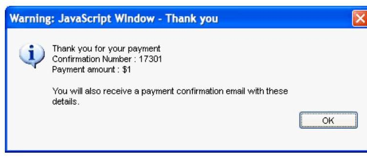

The image is a screenshot of a pop-up window with the following text:

- Title: "Warning: JavaScript Window - Thank you"
- Body:
  - "Thank you for your payment"
  - "Confirmation Number: 17301"
  - "Payment amount: $1"
  - "You will also receive a payment confirmation email with these details."
- There is an "OK" button at the bottom right of the window.

You will also receive a payment confirmation e-mail with relevant payment details and confirmation number. It may take up to two business days for your account to reflect the payment.
Q: What if I see the below error when attempting to submit payment?
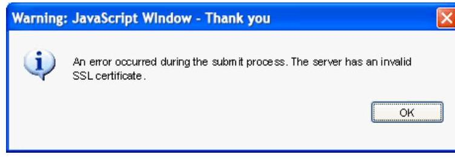

The image is a screenshot of a pop-up window with the following text:

- Title: "Warning: JavaScript Window - Thank you"
- Body:
  - "An error occurred during the submit process. The server has an invalid SSL certificate."
- There is an "OK" button at the bottom right of the window.

A: Following a recent security upgrade, PDF payments are no longer compatible with some older operating systems and browsers. If you are using Windows XP, Windows Vista or Mac OS 10.9.5, you can still make a payment here as long as you use one of the supported browsers below:

Internet Explorer 11+
Chrome 30+
Safari 7+
Firefox 27+
Microsoft Edge
Back to Top

Q: I don't think my payment went through. Who should I contact?
A: If you have any questions about your payment, please use Contact us from the e-mail.

Q: What does the "Save payment details" option do?
A: "Save payment details" will remember your partial payment information, so next time you receive a secure PDF, the information will be pre-populated. When you select this option, instead of re-entering the information each time, you just click the "Submit this payment" button.

## Q: Why should I do this?

A: By clicking on the checkbox, this payment method will automatically be saved. This eliminates the need to enter your payment method details again, making future online payments using this method easier and faster.

Q: Can I pay with a different account/payment method once my details have been remembered?
A: Yes, simply type over the pre-populated information with your new banking details or select a new payment option and complete the relevant details. If you select the "Save payment details" again, the new banking information will be stored once you click "Submit this payment" and successfully make a payment.

Q: How do I prevent the secure PDF from saving my payment information?
A: Uncheck the "Save payment details" box, and the system will not save your details. Once you click "Submit this payment" and successfully make a payment, your details will not be stored for future use.

Q: How do I permanently remove previously saved payment details?
A: Contact a customer service representative to have your payment details removed from the system.

