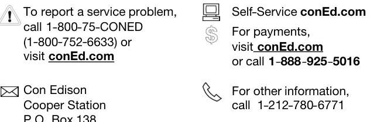

## ST FRANCIS COLLEGE

Your account number: 69-6041-3010-0001-7
Service delivered to: 160 REMSEN ST ENT
Your electric rate: EL9 General Large
Next meter reading date: Thursday, Feb 6, 2020
Avoid estimated bills - please give us access to read your meter.

## Your billing summaryas of Jan 8, 2020

Your previous charges and payments
Total charges from your last bill
\$56,289.35
Payments through Jan 6, thank you
$-$ \$56,289.35

## Remaining balance

Your new charges - details start on page 2
Billing period: Dec 06, 2019 to Jan 07, 2020
Esco electricity supply charges - for 32 days
Con Edison electricity charges
\$38,643.89
\$24,667.52

Total new charges
Total amount due
Direct Payment Plan - The amount of \$63,311.41 will be automatically deducted from your bank on Jan 21, 2020.

## Message Center

Con Edison's offices will be closed Monday, January 20, in observance of Martin Luther King Day. In the event of an emergency, our call center is available 24 hours a day, every day, including the holiday. However, we will experience very high call volumes on Tuesday, January 21. You can avoid an extended wait by not calling on that day.

Contact us 24 hours a day, 7 days a week

The image is a photo/illustration containing contact information for Con Edison. It includes the following text:

- "To report a service problem, call 1-800-75-CONED (1-800-752-6633) or visit conEd.com"
- "Self-Service conEd.com"
- "For payments, visit conEd.com or call 1-888-925-5016"
- "Con Edison Cooper Station P.O. Box 138"
- "For other information, call 1-212-780-6771"

The layout shows the contact information organized in a structured manner with icons next to each type of service or contact method. The text is divided into sections with phone numbers and website URLs for different services like reporting problems, self-service, payments, and general information.

## Direct Payment Record Do not Pay

Your account number: 69-6041-3010-0001-7
Total amount due: \$63,311.41
The amount of $\$ 63,311.41$ will be automatically deducted from your bank on Jan 21, 2020.

## Direct Payment Plan Do not mail a payment

## Your electricity charges

These charges are for the electricity you used (supply) and getting that electricity to you (delivery). Rates are based on a 30 day period. When your billing period is more or less than 30 days, we prorate your bill accordingly.

## Electricity you used during this 32 day billing period from Dec 06, 2019 to Jan 7, 2020

Rate: EL9 General Large
We measure your electricity by how many kilowatt hours (KWh) you use. One KWh will light a 100 watt bulb for 10 hours. The meter multiplier is the factor by which the meter difference is multiplied to determine your usage. Demand or kW is the highest amount of electric usage in any half hour during the bill period. Reactive-Power charges are measured in excess kVar above $95 \%$ power factor. Your total electricity use is the sum of the usage from your various meters as shown in the meter detail section of your bill starting on page 3.

| Total electricity use | 376,800 kWh | 754.08 kW |
| :--: | :--: | :--: |
| On peak energy | 179,358 kWh |  |
| (Mon-Fri 8am -10pm) |  |  |
| Off peak energy | 197,442 kWh |  |
| (Mon-Fri 10pm - 8am) |  |  |
| G \& T demand | 754.08 kW |  |
| (Mon-Fri 8am - 6pm) |  |  |
| Primary demand | 754.08 kW |  |
| (Mon-Fri 8am - 10pm) |  |  |
| Secondary demand | 754.08 kW |  |
| (all hours, all days) |  |  |
| Billable kVar |  | 27.04 |

## Your supply charges

Your electricity is supplied by EAST COAST POWER INC. Your supply charges appear on page 4.

## - Your delivery charges

On peak 179,358 kWh @2.1059c/kWh
$\$ 3,777.09$
Charge for maintaining the system through which Con Edison delivers electricity to you during on peak hours.
Off peak 197,442 kWh @2.1059c/kWh
$\$ 4,157.92$
Charge for maintaining the system through which Con Edison delivers electricity to you during off peak hours.
G \& T demand 754.0 kW @\$0.0000/kW
$\$ 0.00$
Charge for the electricity delivered to you by Con Edison during the hours of 8 am to 6 pm , Monday through Friday.

## Ways To Pay Your Bill

1. Direct Payment - Pay your bill automatically from your checking or savings account at no charge. Enroll at conEd.com/myaccount or call 1-212-243-1900.
2. Internet - Pay online at conEd.com/myaccount. There is no fee for payments from a checking or savings account, but our payment agent charges a small fee for debit/credit card transactions.
3. Phone - Pay by phone at 1-888-925-5016. There is no fee for payments from a checking or savings account, but our payment agent charges a small fee for debit/credit card transactions.
4. In-Person Authorized Payment Agents - Visit conEd.com/paymentagents or call 1-212-243-1900 for the nearest agents in your area.
Our walk-in centers are open Monday to Friday, 8:30 a.m. to 5 p.m.

Primary demand 754.0 kW @\$13.7067/kW
$\$ 10,334.85$
Charge for the electricity delivered to you by Con Edison during the hours of 8 am to 10 pm , Monday through Friday.
Secondary demand 754.0 kW @\$5.6107/kW
$\$ 4,230.44$
Charge for the electricity delivered to you by Con Edison all hours, all days during the billing period.
Reactive-Power demand 27.0 kVar @\$2.1014/kW \$56.74
Charge applies when power factor is less than $95 \%$. Visit conEd.com/reactivepower for more information.
System Benefit Charge @0.6406c/kWh
\$2,413.77
The System Benefits Charge recovers costs associated with clean energy activities conducted by the New York State Energy Research and Development Authority (NYSERDA) and energy efficiency programs implemented by the Company.
Meter charges
$\$ 152.63$
Charge includes $\$ 29.07$ for the meter(s), $\$ 71.06$ for meter reading, and $\$ 52.50$ for meter maintenance. Some or all the charges may be avoided if you switch to an alternate provider.
Tax Sur-Credit @-0.0937c/kWh
$\$ 353.25$
Credit reflecting the tax savings related to the Tax Cuts and Jobs Act of 2017.
Tax Sur-Credit @ -\$0.8999/kW
$\$ 678.60$
Credit reflecting the tax savings related to the Tax Cuts and Jobs Act of 2017
GRT \& other tax surcharges
$\$ 575.93$
Taxes on Con Edison gross receipts from sales of utility services and other tax surcharges.

Total delivery charges
$\$ 24,667.52$

Con Edison electric charges
$\$ 24,667.52$

Manhattan - 122 East 124th Street
Queens - @National Grid - 89-67 162nd Street
Staten Island - 1140 Richmond Terrace (exact pay only)
Bronx - 1775 Grand Concourse
Brooklyn - @National Grid - 345 Jay Street
Westchester - @Food Bazaar - 1 Bogopa Plaza, Mt. Vernon
5. Mail - Make check or money order payable to Con Edison and mail it in the window envelope provided with your bill. Do not send cash.
Mail to: Con Edison, JAF Station, PO Box 1702, New York, NY 10116-1702
Check processing notice: When you provide a check as payment, you authorize us to either use information from your check to make a one-time electronic fund transfer from your account or to process the payment as a check. You will not receive your check back from your financial institution.
Address Change? - If you are moving or changing your mailing address, call 1-800-752-6633 and let us know.
For more information, call 1-800-75-CONED (1-800-752-6633).

# Meter Detail 

|  | Meter number | New reading | Reading type | Prior reading | Reading type | Reading difference | Meter multiplier | Total usage kWh/kW | Usage Distribution |  |
| :--: | :--: | :--: | :--: | :--: | :--: | :--: | :--: | :--: | :--: | :--: |
| E |  | 22915 | Actual | 22718 | Actual | 197 | 800 | 157600 | 75018 | 82582 |
| E | L | 008008257 | 45308 | Actual | 45034 | Actual | 274 | 800 | 219200 | 104340 | 114860 |
| Total |  |  |  |  |  |  |  |  | 376800 | 179,358 | 197,442 |
| D | L | 001008252 | 6.52 | Actual | .00 | Actual | 6.52 | 48 | 312.96 |  |  |
| D | L | 001008257 | 9.19 | Actual | .00 | Actual | 9.19 | 48 | 441.12 |  |  |
|  |  | Meter number |  | Reading type | Power   Factor(\%) |  | Actual kVar | Allowable kVar | Billable kVar |  |  |
| R | L | 001008252 |  | Actual | 89.44 |  | 156.48 | 104.32 | 52.16 |  |  |
| R | L | 001008257 |  | Actual | 96.39 |  | 121.92 | 147.04 | $-25.12$ |  |  |
| Total |  |  |  |  |  |  |  |  | 27.04 |  |  |

# Your electricity supply detail 

## Your electricity supplier

EAST COAST POWER INC
340 JACKSON AVENUE
BRONX NY 10454
For information call: 1-800-545-9155

## Your electricity supply charges

32 day billing period from Dec 06, 2019 to Jan 07, 2020
kWh used 376800
Customer charge
\$0.00
Supply cost @9.4198¢ per kWh
\$35,493.81
Sales tax @8.8750\%
\$3,150.08

Total electricity supply charges
\$38,643.89

## MESSAGES from your electricity ESCO

NEW! Login to My Account at coned.com for a new ESCO bill comparison tool!
Rate adjusted to cover arrears

