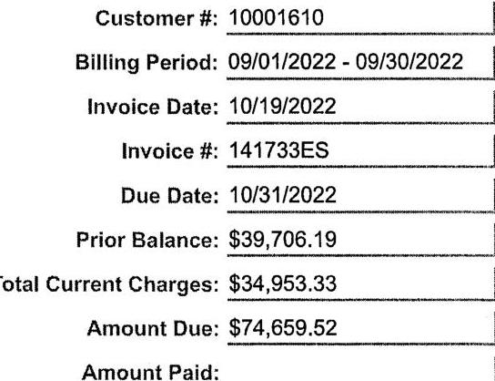

| Punter | (877) 432-4530 |
| :--: | :--: |
|  | www.edfenergyna.com |
|  | Customer \#: 10001610 |
| Invoice | Billing Period: 09/01/2022 - 09/30/2022 |
|  | Invoice Date: 10/19/2022 |
|  | Invoice \#: 141733ES |
| Puritan Bakery | Due Date: 10/31/2022 |
| Teresa Marquez | Prior Balance: \$39,706.19 |
| 1624 East Carson Street | Total Current Charges: \$34,953.33 |
| Carson, CA 90745-0000 | Amount Due: \$74,659.52 |

ATTENTION: If you pay by Wire or ACH, please ignore this message. If you pay by CHECK, please direct payments to: EDF Energy Services, LLC, PO Box 74007029, Chicago, IL 60674-7029. In an effort to streamline the application of payments to your invoices, we prefer electronic payments at the below instructions. As always, we appreciate you allowing us to serve your energy needs.

Beneficiary Account Name: EDF Energy Services, LLC
Account Number: 4427288634
Wire ABA Number: 026009593
ACH ABA Number: 111000012
Swift Code: BOFAUS3N
Bank Name: Bank of America, NA

Please detach and remit this portion when mailing your payment

Customer Information: Puritan Bakery
1624 East Carson Street
Carson, CA 90745-0000

ACH To:

Bank Name: Bank of America
ABA \#: $\quad 111000012$
Account \#: $\quad 4427288634$

Attn: Teresa Marquez
Phone: (310)-830-5451
tmarquez@puritanbakery.com
cc:matt@puritanbakery.com
cc:matt@puritanbakery.com
cc:matt@puritanbakery.com

The image is a photo of an invoice section with the following text:

- Customer #: 10001610
- Billing Period: 09/01/2022 - 09/30/2022
- Invoice Date: 10/19/2022
- Invoice #: 141733ES
- Due Date: 10/31/2022
- Prior Balance: $39,706.19
- Total Current Charges: $34,953.33
- Amount Due: $74,659.52
- Amount Paid:

| Name: | Puritan Bakery | Service Address: | 1624 East Carson Street |  |
| :--: | :--: | :--: | :--: | :--: |
| Utility: | Southern California Gas | Utility Account \#: | 161-401-5100 |  |

Current Charges

| Description | Term | MMBtu | Price | Cost |
| :--: | :--: | :--: | :--: | :--: |
| Basis Hedge | 09/01/2022 - 09/30/2022 | 0 | \$15,8650 | \$0.00 |
| Excess Gas | 09/01/2022 - 09/30/2022 | 3,593 | \$9,537426 | \$34,267.97 |
| Totals: |  | 3,593 |  | \$34,267.97 |
|  | Other Charges |  |  |  |
| Description | Taxable Rate |  |  | Cost |
| City of Carson Utility Users Tax | $2.0 \%$ |  |  | \$685.36 |
| Totals: |  |  |  | \$685.36 |
| Total Account Charges: |  |  |  | \$34,953.33 |

# EDF Energy Services, LLC 

| Phone | (877) 432-4530 |
| :-- | :-- |
|  | www.edfenergyna.com |

## Invoice

## Purlan Bakery

Teresa Marquez
1624 East Carson Street
Carson, CA 90745-0000

## Customer Information:

Purlan Bakery
1624 East Carson Street
Carson, CA 90745-0000

## ADH To:

Bank Name: Bank of America
ABA\#: 111000012
Account \#: 4427288634

## http://www.edfenergyna.com

Customer \#: 10001610
Billing Period: 08/01/2022 - 08/31/2022
Invoice Date: 09/16/2022
Invoice \#: 140369ES
Due Date: 09/26/2022
Prior Balance: $\$ 0.00$
Total Current Charges: $\$ 39,706.19$
Amount Due: $\$ 39,706.19$

ATTENTION: If you pay by Wire or ACH, please ignore this message. If you pay by CHECK, please direct payments to: EDF Energy Services, LLC, PO Box 74007029, Chicago, IL 60674-7029. In an effort to streamline the application of payments to your invoices, we prefer electronic payments at the below instructions. As always, we appreciate you allowing us to serve your energy needs.

Beneficiary Account Name: EDF Energy Services, LLC
Account Number: 4427288634
Wire ABA Number: 026009593
ACH ABA Number: 111000012
Swift Code: BOFAUS3N
Bank Name: Bank of America, NA

## Customer \#: 10001610

Billing Period: 08/01/2022 - 08/31/2022
Invoice Date: 09/16/2022
Invoice \#: 140369ES
Due Date: 09/26/2022
Prior Balance: $\$ 0.00$
Total Current Charges: $\$ 39,706.19$
Amount Due: $\$ 39,706.19$
Amount Paid:

| Name: | Puritan Bakery | Service Address: | 1624 East Carson Street |  |
| :--: | :--: | :--: | :--: | :--: |
| Utility: | Southern California Gas | Utility Account \#: | 161-401-5100 |  |

Current Charges

| Description | Term | MMBtu | Price | Cost |
| :--: | :--: | :--: | :--: | :--: |
| Basis Hedge | 08/01/2022 - 08/31/2022 | 0 | \$9.2250 | \$0.00 |
| Excess Gas | 08/01/2022 - 08/31/2022 | 3,774 | \$10.31469 | \$38,927.64 |
| Totals: |  | 3,774 |  | \$38,927.64 |
|  | Other Charges |  |  |  |
| Description | Taxable Rate |  |  | Cost |
| City of Carson Utility Users Tax | $2.0 \%$ |  |  | \$778.55 |
| Totals: |  |  |  | \$778.55 |
| Total Account Charges: |  |  | \$39,706.19 |  |

