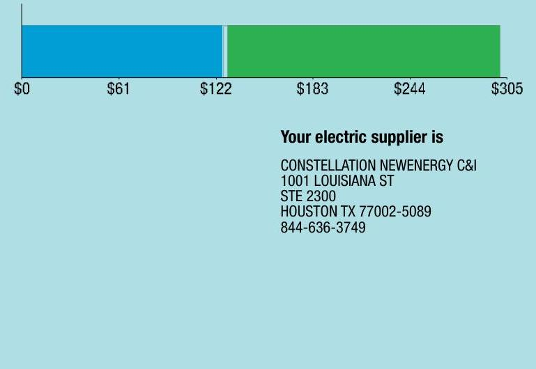
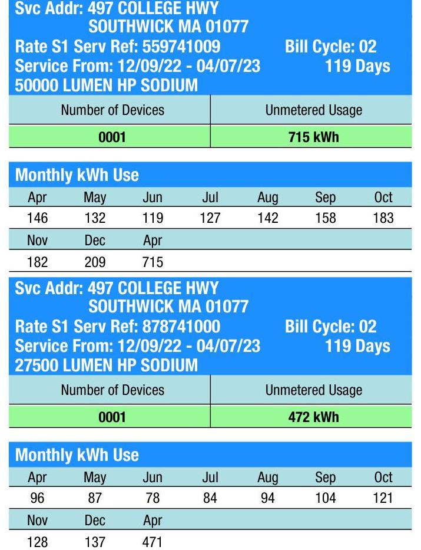

## EVERSEURCE

Account Number: $\quad 54700702038$
Statement Date: 04/07/23
Service Provided To:
LORI DONUTS INC

## Total Amount Due

by 05/02/23
Amount Due On 04/03/23
Last Payment Received On 04/04/23
Balance Forward
Total Current Charges
$73.83

Current Charges for Electricity

| Supply | Delivery |
| :--: | :--: |
| \$126.39 | \$173.19 |
| Cost of electricity from CONSTELLATION NEWENERGY CSJ | Cost to deliver electricity from Eversource |

The image is a bar chart.

- **Chart Type**: Bar chart
- **Axis Titles and Units**: 
  - X-axis: Dollar amounts ($0, $61, $122, $183, $244, $305)
- **Data Representation**: 
  - The chart visually represents costs, with two segments: a blue segment from $0 to $122 and a green segment from $122 to $305.
- **Text**: 
  - "Your electric supplier is"
  - "CONSTELLATION NEWENERGY C&I"
  - "1001 LOUISIANA ST"
  - "STE 2300"
  - "HOUSTON TX 77002-5089"
  - "844-636-3749"
- **Styling**: 
  - The bar is divided into two colored segments: blue and green, indicating different cost components.

## News For You

If you're having trouble paying your energy bill, we have programs to help - even if you've never needed them before. Visit Eversource.com/billhelp for info on payment plans and other assistance programs available to you.

Remit Payment To: Eversource, PO Box 56005, Boston, MA 02205-6005

## EVERSEURCE

Account Number: $\quad 54700702038$
You may be subject to a 1.02\% late payment charge if the "Total Amount Due" is not received by 05/02/23

Please make your check payable to Eversource and consider adding $\$ 1$ for Good Neighbor.
Visit Eversource.com to make your payment today. If mailing payment, please allow up to 5 business days to post.

## Total Amount Due

by $05 / 02 / 23$
Amount Enclosed

LORI DONUTS INC
C/O SOUTHWICK LOCATION
4 HARDING AVE
LUDLOW MA 01056-2370

Eversource
PO Box 56005
Boston, MA 02205-6005

# EVERSEURCE 

Account Number: 54700702038
Customer name key: LORI
Statement Date: 04/07/23
Service Provided To:
LORI DONUTS INC

The image is a photo of a utility bill summary.

- **Service Address**: 497 COLLEGE HWY, SOUTHWICK MA 01077
- **Rate S1 Service Reference**: 559741009 and 878741000
- **Bill Cycle**: 02
- **Service Period**: 12/09/22 - 04/07/23
- **Duration**: 119 Days
- **Lighting Type**: 50000 LUMEN HP SODIUM and 27500 LUMEN HP SODIUM

For the first service reference:
- **Number of Devices**: 0001
- **Unmetered Usage**: 715 kWh

**Monthly kWh Use**:
- Apr: 146
- May: 132
- Jun: 119
- Jul: 127
- Aug: 142
- Sep: 158
- Oct: 183
- Nov: 182
- Dec: 209
- Apr: 715

For the second service reference:
- **Number of Devices**: 0001
- **Unmetered Usage**: 472 kWh

**Monthly kWh Use**:
- Apr: 96
- May: 87
- Jun: 78
- Jul: 84
- Aug: 94
- Sep: 104
- Oct: 121
- Nov: 128
- Dec: 137
- Apr: 471

## Total Amount Due

by $05 / 02 / 23$

## Electric Account Summary

Amount Due On 04/03/23
Last Payment Received On 04/04/23
$874.98$
Balance Forward
$0.00

Current Charges/Credits
Electric Supply Services
$126.39$
Delivery Services
$173.19$
Other Charges or Credits
$225.75$
Total Current Charges
$73.83$
Total Amount Due
$73.83$

Total Charges for Electricity

## Supplier

CONSTELLATION NEWENERGY
Service Reference: 559741009
Allocated for 12/09/22 to 12/31/22
Generation Srvc Chrg
$149.90 \mathrm{kWh} \times \$ 0.10650$
$15.96$
Allocated for 12/31/22 to 04/07/23
$565.40 \mathrm{kWh} \times \$ 0.10650$
$60.22$

| Service Reference: 878741000 |  |
| :-- | :-- |
| Allocated for 12/09/22 to 12/31/22 |  |
| Generation Srvc Chrg | $98.80 \mathrm{kWh} \times \$ 0.10650$ |
| Allocated for 12/31/22 to 04/07/23 |  |
| Generation Srvc Chrg | $372.70 \mathrm{kWh} \times \$ 0.10650$ |
| Subtotal Supplier Services |  |
| Delivery |  |
| (S1 STREETLIGHTING) |  |
| Service Reference: 559741009 |  |
| Allocated for 12/09/22 to 12/31/22 |  |
| Transmission Chrg | $149.90 \mathrm{kWh} \times \$ 0.01594$ |
| Distribution Services |  |

$98.80 \mathrm{kWh} \times \$ 0.10650$
$10.52$
$372.70 \mathrm{kWh} \times \$ 0.10650$
$39.69$
$149.90 \mathrm{kWh} \times \$ 0.01594$
$10.37$

Eversource is required to comply with Department of Public Utilities' billing and termination regulations. If you have a dispute please see the bill insert for more information.
For an electronic version of this insert, residential customers go to Eversource.com/about-residential-bill and business customers go to Eversource.com/about-business-bill. Then select "Monthly Bill Inserts" from the page. Budget Billing is also available to pay a more consistent bill each month. Please see the Customer Rights Supplement for more information.

# EVERSEURCE 

## Notal Amount Due

Account Number: 54700702038
Customer name key: LORI
Statement Date: 04/07/23
Service Provided To: LORI DONUTS INC

Continued from previous page...

## Contact Information

Emergency: 877-659-6326
www.eversource.com
Pay by Phone: 888-783-6618
Customer Service: 888-783-6610

## Important Messages About Your Account

Allocated use for 97 days.

Because the billing period spans a change in the rates, your usage has been calculated partly on the old rate and partly on the new rate.

Continued from previous page...

| Res Assist Adj Clause | 149.90kWh X $\$ 0.00298$ | $\$ 0.45$ |
| :-- | :-- | --: |
| Pension/PBOP Adj Mechn PPAM | 149.90 kWh X $\$ 0.00304$ | $\$ 0.46$ |
| Basic Srvc Cost Adj | 149.90 kWh X $\$ 0.00005$ | $-\$ 0.01$ |
| Net metering recovery surchrge | 149.90 kWh X $\$ 0.00394$ | $\$ 0.59$ |
| Transition Chrg | 149.90 kWh X $\$ 0.00177$ | $-\$ 0.27$ |
| Renew Enrgy Investmnt Chrg | 149.90 kWh X $\$ 0.00050$ | $\$ 0.07$ |
| Energy Efficiency | 149.90 kWh X $\$ 0.01094$ | $\$ 1.64$ |
| Storm recovery adjustment | 149.90 kWh X $\$ 0.00064$ | $\$ 0.10$ |
| Revenue Decoupling Adj | 149.90 kWh X $\$ 0.00139$ | $\$ 0.21$ |
| Lng-Trm Rnwbl Contr Adj | 149.90 kWh X $\$ 0.00045$ | $-\$ 0.07$ |
| Vegetation Management | 149.90 kWh X $\$ 0.00405$ | $\$ 0.61$ |
| Solar Expansion Charge | 149.90 kWh X $\$ 0.00052$ | $\$ 0.08$ |
| Grid Modernization Charge | 149.90 kWh X $\$ 0.00097$ | $\$ 0.15$ |
| Tax Act Credit | 149.90 kWh X $\$ 0.00085$ | $-\$ 0.13$ |
| Distributed Solar Charge | 149.90 kWh X $\$ 0.00177$ | $\$ 0.27$ |
|  |  |  |
| Allocated for 12/31/22 to 04/07/23 |  |  |
| Transmission Chrg | 565.40 kWh X $\$ 0.01602$ | $\$ 9.06$ |
| Distribution Services |  | $\$ 52.52$ |
| Exogenous Cost Adjustment | 565.40 kWh X $\$ 0.00070$ | $\$ 0.40$ |
| Res Assist Adj Clause | 565.40 kWh X $\$ 0.00962$ | $\$ 5.44$ |
| Pension/PBOP Adj Mechn PPAM | 565.40 kWh X $\$ 0.00058$ | $-\$ 0.33$ |
| Basic Srvc Cost Adj | 565.40 kWh X $\$ 0.00222$ | $\$ 1.26$ |
| Net metering recovery surchrge | 565.40 kWh X $\$ 0.00524$ | $\$ 2.96$ |
| Solar Program Cost Adjustment | 565.40 kWh X $\$ 0.00003$ | $-\$ 0.02$ |
| Transition Chrg | 565.40 kWh X $\$ 0.00411$ | $-\$ 2.32$ |
| Renew Enrgy Investmnt Chrg | 565.40 kWh X $\$ 0.00050$ | $\$ 0.28$ |
| Energy Efficiency | 565.40 kWh X $\$ 0.01094$ | $\$ 6.19$ |
| Atty Geni consultant exp adj | 565.40 kWh X $\$ 0.00002$ | $\$ 0.01$ |
| Storm recovery adjustment | 565.40 kWh X $\$ 0.00218$ | $\$ 1.23$ |
| Revenue Decoupling Adj | 565.40 kWh X $\$ 0.00212$ | $\$ 1.20$ |
| Lng-Trm Rnwbl Contr Adj | 565.40 kWh X $\$ 0.00306$ | $\$ 1.73$ |
| Vegetation Management | 565.40 kWh X $\$ 0.00089$ | $\$ 0.50$ |
| Solar Expansion Charge | 565.40 kWh X $\$ 0.00027$ | $-\$ 0.15$ |
| Grid Modernization Charge | 565.40 kWh X $\$ 0.00130$ | $\$ 0.74$ |
| Tax Act Credit | 565.40 kWh X $\$ 0.00113$ | $-\$ 0.64$ |
| Distributed Solar Charge | 565.40 kWh X $\$ 0.00327$ | $\$ 1.85$ |
| Advanced Meter infrastructure | 565.40 kWh X $\$ 0.00222$ | $\$ 1.26$ |
|  |  |  |
| (S1 STREETLIGHTING) |  |  |
| Service Reference: 878741000 |  |  |
|  |  |  |
| Allocated for 12/09/22 to 12/31/22 |  |  |
| Transmission Chrg | 98.80 kWh X $\$ 0.01594$ | $\$ 1.57$ |
|  |  |  |

# EVERSEURCE 

## Notation Service

Account Number: 54700702038
Customer name key: LORI
Statement Date: 04/07/23
Service Provided To: LORI DONUTS INC

## Total Amount Due by 05/02/23

Continued from previous page...

| Distribution Services |  | $\$ 8.95$ |
| :--: | :--: | :--: |
| Res Assist Adj Clause | 98.80kWh X \$0.00298 | \$0.29 |
| Pension/PBOP Adj Mechn PPAM | 98.80kWh X \$0.00304 | \$0.30 |
| Net metering recovery surchrge | 98.80kWh X \$0.00394 | \$0.39 |
| Transition Chrg | 98.80kWh X \$-0.00177 | -\$0.17 |
| Renew Enrgy Invstmnt Chrg | 98.80kWh X \$0.00050 | \$0.05 |
| Energy Efficiency | 98.80kWh X \$0.01094 | \$1.08 |
| Storm recovery adjustment | 98.80kWh X \$0.00064 | \$0.06 |
| Revenue Decoupling Adj | 98.80kWh X \$0.00139 | \$0.14 |
| Lng-Trm Rnwbl Contr Adj | 98.80kWh X \$-0.00045 | -\$0.04 |
| Vegetation Management | 98.80kWh X \$0.00405 | \$0.40 |
| Solar Expansion Charge | 98.80kWh X \$0.00052 | \$0.05 |
| Grid Modernization Charge | 98.80kWh X \$0.00097 | \$0.10 |
| Tax Act Credit | 98.80kWh X \$-0.00085 | -\$0.08 |
| Distributed Solar Charge | 98.80kWh X \$0.00177 | \$0.17 |
| Allocated for 12/31/22 to 04/07/23 |  |  |
| Transmission Chrg | 372.70kWh X \$0.01602 | \$5.97 |
| Distribution Services |  | \$45.39 |
| Exogenous Cost Adjustment | 372.70kWh X \$0.00070 | \$0.26 |
| Res Assist Adj Clause | 372.70kWh X \$0.00962 | \$3.59 |
| Pension/PBOP Adj Mechn PPAM | 372.70kWh X \$-0.00058 | -\$0.22 |
| Basic Srvc Cost Adj | 372.70kWh X \$0.00222 | \$0.83 |
| Net metering recovery surchrge | 372.70kWh X \$0.00524 | \$1.95 |
| Solar Program Cost Adjustment | 372.70kWh X \$-0.00003 | -\$0.01 |
| Transition Chrg | 372.70kWh X \$-0.00411 | -\$1.53 |
| Renew Enrgy Invstmnt Chrg | 372.70kWh X \$0.00050 | \$0.19 |
| Energy Efficiency | 372.70kWh X \$0.01094 | \$4.08 |
| Atty Geni consultant exp adj | 372.70kWh X \$0.00002 | \$0.01 |
| Storm recovery adjustment | 372.70kWh X \$0.00218 | \$0.81 |
| Revenue Decoupling Adj | 372.70kWh X \$0.00212 | \$0.79 |
| Lng-Trm Rnwbl Contr Adj | 372.70kWh X \$-0.00306 | -\$1.14 |
| Vegetation Management | 372.70kWh X \$0.00089 | \$0.33 |
| Solar Expansion Charge | 372.70kWh X \$-0.00027 | -\$0.10 |
| Grid Modernization Charge | 372.70kWh X \$0.00130 | \$0.48 |
| Tax Act Credit | 372.70kWh X \$-0.00113 | -\$0.42 |
| Distributed Solar Charge | 372.70kWh X \$0.00327 | \$1.22 |
| Advanced Meter infrastructure | 372.70kWh X \$0.00222 | \$0.83 |
| Subtotal Delivery Services |  | \$173.19 |
| Total Cost of Electricity |  | \$299.58 |
| Other Charges or Credits |  |  |
| Cancel Billing Mar 13 |  | -\$43.26 |
| Cancel Billing Mar 13 |  | -\$43.36 |

# EVERSEURCE 

| Account Number: $\quad \mathbf{5 4 7 0} \mathbf{0 7 0} \mathbf{2 0 3 8}$ |  |
| :-- | --: |
| Customer name key: LORI |  |
| Statement Date: $\quad 04 / 07 / 23$ |  |
| Service Provided To: |  |
| LORI DONUTS INC |  |

| Total Amount Due |  |
| :-- | --: |
| by 05/02/23 | $\$ 73.83$ |

Continued from previous page...

Cancel Billing Mar 13 - $\$ 48.39$
Cancel Billing Mar 13 - $\$ 31.72$
Cancel Billing Mar 13 - $\$ 31.79$
Cancel Billing Mar 13 - $\$ 35.13$
6.25\% MA Sales Tax Supplier \$7.90
Subtotal Other Charges or Credits - $\$ 225.75$
Total Current Charges $\$ 73.83$

