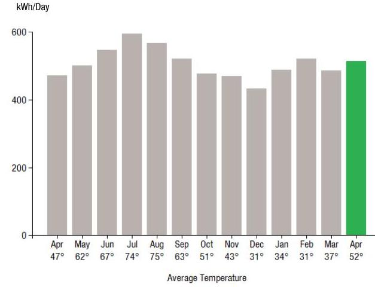
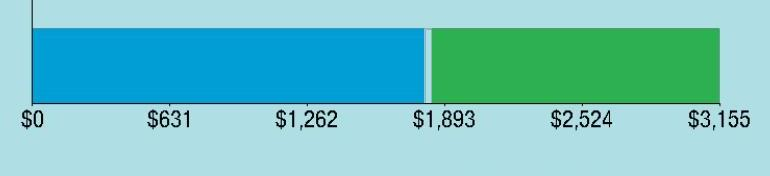
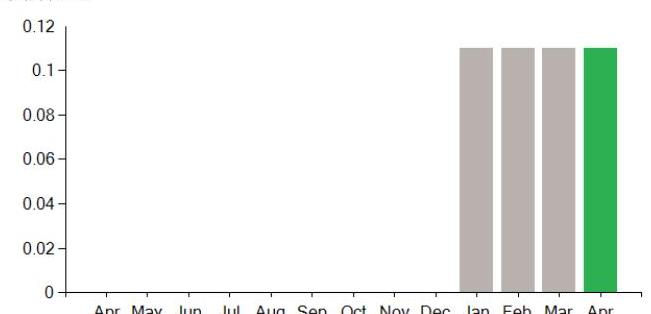
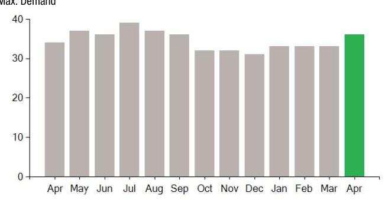

## EVERSEURCE

Account Number: 54598896017
Statement Date: 04/24/23
Service Provided To:
SPRINGFIELD DONUTS INC.

## Electric Usage History - Kilowash House (kWh)

The image is a bar chart.

- **Chart Type**: Bar chart
- **Y-Axis Title**: kWh/Day
- **X-Axis Title**: Average Temperature
- **Data Points**:
  - April (47°): ~450 kWh/Day
  - May (62°): ~500 kWh/Day
  - June (67°): ~550 kWh/Day
  - July (74°): ~600 kWh/Day
  - August (75°): ~550 kWh/Day
  - September (63°): ~500 kWh/Day
  - October (51°): ~450 kWh/Day
  - November (43°): ~400 kWh/Day
  - December (31°): ~350 kWh/Day
  - January (31°): ~300 kWh/Day
  - February (34°): ~350 kWh/Day
  - March (37°): ~400 kWh/Day
  - April (52°): ~500 kWh/Day (highlighted in green)

- **Yearly Usage Breakdown (Monthly-Based)**: The chart shows monthly electric usage in kWh per day, with the April 52° bar highlighted in green.

## Electric Usage Summary

| This month your   average daily   electric use was   513.0 kWh | This month you used   $8.9 \%$ more   than at the   same time last year | $8.9 \%$   USAGE |
| :-- | :-- | :-- |

## No Payment Due

Amount Due On 04/16/23
Last Payment Received
\$0.00
Balance Forward
Total Current Charges
\$1,026.91

Current Charges for Electricity

| Supply | Delivery |
| :--: | :--: |
| \$1,803.58 | \$1,343.37 |
| Cost of electricity from | Cost to deliver electricity |
| CONSTELLATION NEWENERGY | from Eversource |
| CSJ |  |

The image is a bar chart.

- **Chart Type**: Bar chart
- **Data Points**:
  - $0
  - $631
  - $1,262
  - $1,893
  - $2,524
  - $3,155
- **Styling**: The bar is divided into two segments, with the left segment in blue and the right segment in green.

Your electric supplier is
CONSTELLATION NEWENERGY CSJ
1001 LOUISIANA ST
STE 2300
HOUSTON TX 77002-5089
844-636-3749

## News For You

If you're having trouble paying your energy bill, we have programs to help - even if you've never needed them before. Visit Eversource.com/billhelp for info on payment plans and other assistance programs available to you.

Remit Payment To: Eversource, PO Box 56005, Boston, MA 02205-6005

## EVERSEURCE

Account Number: 54598896017
You may be subject to a $1.02 \%$ late payment charge if the "Total Amount Due" is not received by 05/19/23

Please make your check payable to Eversource and consider adding $\$ 1$ for Good Neighbor.
Visit Eversource.com to make your payment today. If mailing payment, please allow up to 5 business days to post.

## No Payment Due

Amount Enclosed

Eversource
PO Box 56005
Boston, MA 02205-6005

# EVERSEURCE 

Account Number: 54598896017
Customer name key: SPRI
Statement Date: 04/24/23
Service Provided To:
SPRINGFIELD DONUTS INC.

| Svc Addr: 560 BEL MONT AVE SPRINGFIELD MA 01108 |  |  |  |  |  |
| :--: | :--: | :--: | :--: | :--: | :--: |
| Serv Ref: 792553003 |  |  |  | Bill Cycle: 16 |  |
| Service from 03/22/23 - 04/24/23 |  |  |  | 33 Days |  |
| Next read date on or about: May 22, 2023 |  |  |  |  |  |
| Meter   Number | Current   Read | Previous   Read | Current   Usage | Reading   Type |  |
| 892903912 | 80071 | 63136 | 16935 | Actual |  |
| Total Demand Use $=36.70 \mathrm{kW}$ |  |  |  |  |  |
| Monthly kWh Use |  |  |  |  |  |
| Apr | May | Jun | Jul | Aug | Sep | Oct |
| 15533 | 14530 | 16411 | 19033 | 16993 | 15627 | 14759 |
| Nov | Dec | Jan | Feb | Mar | Apr |  |
| 13637 | 12957 | 16084 | 15082 | 13613 | 16935 |  |

## Contact Information

Emergency: 877-659-6326
www.eversource.com
Pay by Phone: 888-783-6618
Customer Service: 888-783-6610

## No Payment Due

## Electric Account Summary

| Amount Due On 04/16/23 | $-\$ 15,199.81$ |
| :-- | --: |
| Last Payment Received | $\$ 0.00$ |
| Balance Forward | $-\$ 15,199.81$ |
| Current Charges/Credits |  |
| Electric Supply Services | $\$ 1,803.58$ |
| Delivery Services | $\$ 1,343.37$ |
| Other Charges or Credits | $-\$ 2,120.04$ |
| Total Current Charges | $\$ 1,026.91$ |
| Total Amount Due | $-\$ 14,172.90$ |

## Total Charges for Electricity

## Supplier

CONSTELLATION NEWENERGY
Service Reference: 792553003
Generation Srvc Chrg
Subtotal Supplier Services

## Delivery

(RATE G1)
Service Reference: 792553003
Customer Chrg
34.50 KW X \$10.83000
34.50 KW X \$10.83000
34.50 KW X \$10.83000
16935.00kWh X \$0.00320
16935.00kWh X \$-0.00411
\$69.60
Transmission Dmd Chrg
34.50 KW X \$9.94000
\$342.93
Res Assist Adj Clause
16935.00kWh X \$0.00962
\$162.91
Pension/PBOP Adj Mechn PPAM
16935.00kWh X \$-0.00058
\$9.82
Basic Srv Cost Adj
16935.00kWh X \$0.00222
16935.00kWh X \$0.00524
\$37.60
\$88.74
Solar Program Cost Adjustment
16935.00kWh X \$-0.00003
\$0.51
Renewable Enrgy Chrg
Energy Efficiency
16935.00kWh X \$0.01094
\$8.47
\$185.27

[^0]
[^0]:    VIM_230424PROD.TXT

    Eversource is required to comply with Department of Public Utilities' billing and termination regulations. If you have a dispute please see the bill insert for more information.
    For an electronic version of this insert, residential customers go to Eversource.com/about-residential-bill and business customers go to Eversource.com/about-business-bill. Then select "Monthly Bill Inserts" from the page. Budget Billing is also available to pay a more consistent bill each month. Please see the Customer Rights Supplement for more information.

# EVERSEURCE 

## Account Number: 54598896017

Customer name key: SPRI
Statement Date: 04/24/23
Service Provided To:
SPRINGFIELD DONUTS INC.

Continued from previous page...

## Supply Rate

Dollars / kWh

The image is a bar chart.

- **Chart Type**: Bar chart
- **X-Axis**: Labeled with months from April to April (Apr, May, Jun, Jul, Aug, Sep, Oct, Nov, Dec, Jan, Feb, Mar, Apr).
- **Y-Axis**: Labeled with values from 0 to 0.12.
- **Data Points**: Bars are present for January, February, March, and April.
- **Styling**: The bars for January, February, and March are gray, while the bar for April is green.
- **Context**: This represents a **yearly usage breakdown (monthly-based)**.

## Demand Profile

Max. Demand

The image is a bar chart.

- **Chart Type**: Bar chart
- **X-Axis**: Labeled with months from April to April (Apr, May, Jun, Jul, Aug, Sep, Oct, Nov, Dec, Jan, Feb, Mar, Apr).
- **Y-Axis**: Labeled with values from 0 to 40.
- **Data Points**: Bars are present for each month.
- **Styling**: The bars from April to March are gray, while the bar for the following April is green.
- **Context**: Represents maximum demand over a yearly period.

## No Payment Due

Continued from previous page...

| Atty Geni consultant exp adj | 16935.00kWh X $\$ 0.00002$ | $\$ 0.34$ |
| :-- | --: | --: |
| Storm recovery adjustment | 16935.00kWh X $\$ 0.00218$ | $\$ 36.92$ |
| Exogenous Cost Adjustment | 16935.00kWh X $\$ 0.00070$ | $\$ 11.85$ |
| Revenue Decoupling Adj | 16935.00kWh X $\$ 0.00212$ | $\$ 35.90$ |
| Lng-Trm Rnwbl Contr Adj | 16935.00kWh X $\$$-0.00306$ | $-\$ 51.82$ |
| Vegetation Management | 16935.00kWh X $\$ 0.00089$ | $\$ 15.07$ |
| Solar Expansion Charge | 16935.00kWh X $\$-0.00027$ | $-\$ 4.57$ |
| Grid Modernization Charge | 16935.00kWh X $\$ 0.00130$ | $\$ 22.02$ |
| Tax Act Credit | 16935.00kWh X $\$-0.00113$ | $-\$ 19.14$ |
| Distributed Solar Charge | 16935.00kWh X $\$ 0.00327$ | $\$ 55.38$ |
| Advanced Meter Infrastructure | 16935.00kWh X $\$ 0.00222$ | $\$ 37.60$ |
| Subtotal Delivery Services |  | $\$ 1,343.37$ |
| Total Cost of Electricity |  | $\$ 3,146.95$ |

Other Charges or Credits
AOBC Transfer Mar 29
- $\$ 609.81$
AOBC Transfer Apr 03
- $\$ 668.87$
AOBC Transfer Apr 03
- $\$ 555.39$
AOBC Transfer Apr 21
- $\$ 398.69$
6.25\% MA Sales Tax Supplier
$\$ 112.72$
Subtotal Other Charges or Credits
Total Current Charges
$\$ 1,026.91$

