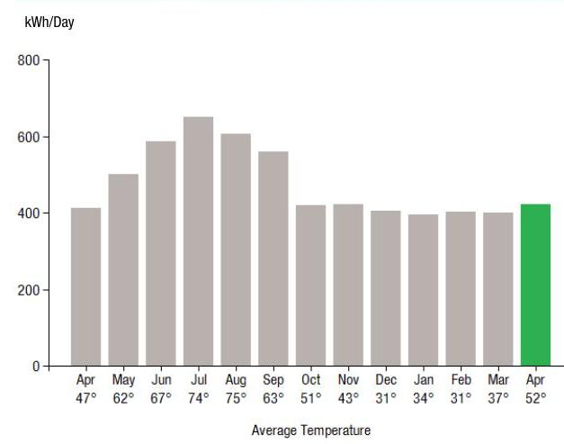
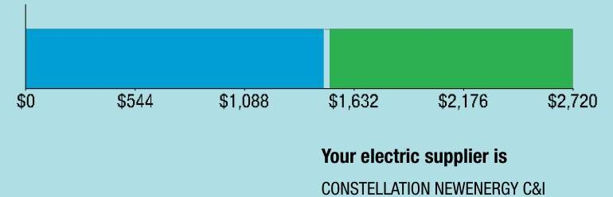
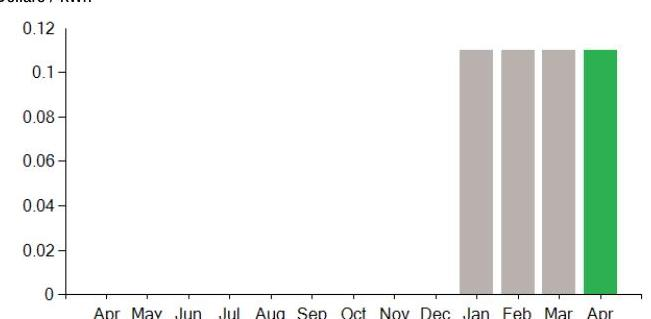
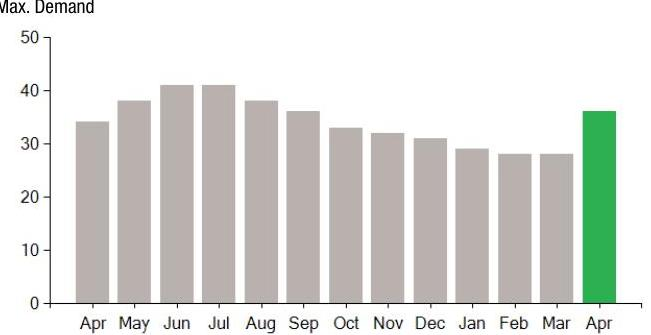

## EVERSEURCE

Account Number: 54148271075
Statement Date: 04/26/23
Service Provided To:
BE DONUTS INC

## Electric Usage History - Kilowash House (kWh)

The image is a bar chart.

- **Chart Type**: Bar chart
- **Y-Axis Title**: kWh/Day
- **X-Axis Title**: Average Temperature
- **Data Points**:
  - April: 47°, ~400 kWh
  - May: 62°, ~450 kWh
  - June: 67°, ~600 kWh
  - July: 74°, ~700 kWh
  - August: 75°, ~650 kWh
  - September: 63°, ~500 kWh
  - October: 51°, ~400 kWh
  - November: 43°, ~350 kWh
  - December: 31°, ~350 kWh
  - January: 34°, ~350 kWh
  - February: 31°, ~350 kWh
  - March: 37°, ~400 kWh
  - April: 52°, ~420 kWh (highlighted in green)
- **Notable Styling**: The bar for April is highlighted in green.
- **Yearly Usage Breakdown (Monthly-Based)**: The chart shows monthly electric usage in kWh per day, with corresponding average temperatures for each month.

## Electric Usage Summary

| This month your   average daily   electric use was   422.0 kWh | This month you used   $2.2 \%$ more   than at the   same time last year |
| :-- | :-- |

## No Payment Due

Amount Due On 04/18/23
Last Payment Received
\$16,278.13
\$0.00
Balance Forward
Total Current Charges
$-$ \$16,278.13
$\$ 459.64$

Current Charges for Electricity

| Supply | Delivery |
| :--: | :--: |
| \$1,483.97 | \$1,227.20 |
| Cost of electricity from | Cost to deliver electricity |
| CONSTELLATION NEWENERGY | from Eversource |
| CSJ |  |

The image is a bar chart.

- **Chart Type**: Bar chart
- **Data Points**:
  - The chart shows a horizontal bar divided into two segments.
  - The first segment is blue, ranging from $0 to $1,632.
  - The second segment is green, ranging from $1,632 to $2,720.
- **Embedded Text**:
  - Below the bar: "$0", "$544", "$1,088", "$1,632", "$2,176", "$2,720"
  - Below the chart: "Your electric supplier is CONSTELLATION NEWENERGY C&I"
- **Notable Styling**: The bar is divided into blue and green segments, indicating different portions of the total amount.

Your electric supplier is
CONSTELLATION NEWENERGY CSJ
1001 LOUISIANA ST
STE 2300
HOUSTON TX 77002-5089
844-636-3749

# News For You 

If you're having trouble paying your energy bill, we have programs to help - even if you've never needed them before. Visit Eversource.com/billhelp for info on payment plans and other assistance programs available to you.

Remit Payment To: Eversource, PO Box 56005, Boston, MA 02205-6005

## EVERSEURCE

Account Number: 54148271075
You may be subject to a $1.02 \%$ late payment charge if the "Total Amount Due" is not received by 05/21/23

Please make your check payable to Eversource and consider adding $\$ 1$ for Good Neighbor.
Visit Eversource.com to make your payment today. If mailing payment, please allow up to 5 business days to post.

## No Payment Due

## Amount Enclosed

Eversource
PO Box 56005
Boston, MA 02205-6005

# EVERSEURCE 

Account Number: 54148271075
Customer name key: BE 0
Statement Date: 04/26/23
Service Provided To:
BE DONUTS INC

| Svc Addr: 694 PAGE RIVO |  |  |  |  |  |
| :--: | :--: | :--: | :--: | :--: | :--: |
| SPRINGFIELD MA 01104 |  |  |  |  |  |
| Serv Ref: 018721006 |  |  |  | Bill Cycle: 18 |  |
| Service from 03/24/23 - 04/26/23 |  |  |  | 33 Days |  |
| Next read date on or about: May 24, 2023 |  |  |  |  |  |
| Meter | Current | Previous | Current | Reading |  |
| Number | Read | Read |  | Type |  |
| \#90865742 | 82360 | 68426 | 13934 | Actual |  |
| Total Demand Use $=36.20 \mathrm{kW}$ |  |  |  |  |  |
| Monthly kWh Use |  |  |  |  |  |
| Apr | May | Jun | Jul | Aug | Sep |
| 13635 | 14560 | 18773 | 19545 | 18198 | 17913 |
| Nov | Dec | Jan | Feb | Mar | Apr |
| 13945 | 12152 | 11489 | 11703 | 11232 | 13934 |

## Contact Information

Emergency: 877-659-6326
www.eversource.com
Pay by Phone: 888-783-6618
Customer Service: 888-783-6610

## No Payment Due

## Electric Account Summary

| Amount Due On 04/18/23 | $-\$ 16,278.13$ |
| :-- | --: |
| Last Payment Received | $\$ 0.00$ |
| Balance Forward | $-\$ 16,278.13$ |
| Current Charges/Credits |  |
| Electric Supply Services | $\$ 1,483.97$ |
| Delivery Services | $\$ 1,227.20$ |
| Other Charges or Credits | $-\$ 3,170.81$ |
| Total Current Charges | $-\$ 459.64$ |
| Total Amount Due | $-\$ 16,737.77$ |

Total Charges for Electricity

## Supplier

CONSTELLATION NEWENERGY
Service Reference: 018721006
Generation Srvc Chrg
$13934.00 \mathrm{kWh} \times \$ 0.10650$
$1,483.97$

Subtotal Supplier Services
$\$ 1,483.97$

## Delivery

(RATE G1)
Service Reference: 018721006
Customer Chrg
34.00 KW X $\$ 10.83000$
$34.00 \mathrm{KW} \times \$ 10.83000$
$34.00 \mathrm{KW} \times \$ 0.00320$
$13934.00 \mathrm{kWh} \times \$ 0.00411$
$13934.00 \mathrm{kWh} \times \$ 0.00411$
$34.00 \mathrm{KW} \times \$ 9.94000$
$34.00 \mathrm{KW} \times \$ 9.94000$
$13934.00 \mathrm{kWh} \times \$ 0.00962$
$13934.00 \mathrm{kWh} \times \$ 0.00962$
$13934.00 \mathrm{kWh} \times \$ 0.00222$
$13934.00 \mathrm{kWh} \times \$ 0.00524$
$13934.00 \mathrm{kWh} \times \$ 0.00003$
$13934.00 \mathrm{kWh} \times \$ 0.00050$
$13934.00 \mathrm{kWh} \times \$ 0.01094$

## $-\$ 30.00$

\$368.22
\$44.59
\$57.27
\$337.96
\$134.05
\$8.08
\$30.93
\$73.01
\$0.42
\$6.97
\$152.44

[^0]
[^0]:    $V M$ ZSNGRPROD.TXT

    Eversource is required to comply with Department of Public Utilities' billing and termination regulations. If you have a dispute please see the bill insert for more information.
    For an electronic version of this insert, residential customers go to Eversource.com/about-residential-bill and business customers go to Eversource.com/about-business-bill. Then select "Monthly Bill Inserts" from the page. Budget Billing is also available to pay a more consistent bill each month. Please see the Customer Rights Supplement for more information.

## EVERSEURCE

Account Number: 54148271075
Customer name key: BE 0
Statement Date: 04/26/23
Service Provided To: BE DONUTS INC

## Continued from previous page...

## Supply Rate

Dollars / kWh

The image is a bar chart.

- **Chart Type**: Bar chart
- **X-Axis**: Months (Apr, May, Jun, Jul, Aug, Sep, Oct, Nov, Dec, Jan, Feb, Mar, Apr)
- **Y-Axis**: Dollars / kWh (ranging from 0 to 0.12)
- **Legend/Colors**: 
  - Bars for Dec, Jan, Feb, and Mar are gray.
  - The bar for Apr is green.
- **Data Points**: 
  - Dec, Jan, Feb, Mar: Approximately 0.1 dollars/kWh
  - Apr: Approximately 0.1 dollars/kWh
- **Notable Styling**: The bar for April is highlighted in green, indicating a possible emphasis or change compared to previous months.
- **Yearly Usage Breakdown (Monthly-Based)**: The chart shows the supply rate in dollars per kWh for each month, highlighting consistency in the rate over the months displayed.

## Demand Profile

Max. Demand

The image is a bar chart.

- **Chart Type**: Bar chart
- **X-Axis**: Months (Apr, May, Jun, Jul, Aug, Sep, Oct, Nov, Dec, Jan, Feb, Mar, Apr)
- **Y-Axis**: Max. Demand (ranging from 0 to 50)
- **Data Points**: 
  - Apr (previous year): Approximately 35
  - May: Approximately 38
  - Jun and Jul: Approximately 42
  - Aug: Approximately 40
  - Sep: Approximately 38
  - Oct: Approximately 35
  - Nov: Approximately 33
  - Dec: Approximately 32
  - Jan: Approximately 30
  - Feb: Approximately 28
  - Mar: Approximately 30
  - Apr (current year): Approximately 38
- **Notable Styling**: The bar for April (current year) is highlighted in green, indicating a possible emphasis or change compared to previous months. All other bars are gray.

## No Payment Due

Continued from previous page...

| Atty Geni consultant exp adj | 13934.00kWh X $\$ 0.00002$ | $\$ 0.28$ |
| :-- | --: | --: |
| Storm recovery adjustment | 13934.00kWh X $\$ 0.00218$ | $\$ 30.38$ |
| Exogenous Cost Adjustment | 13934.00kWh X $\$ 0.00070$ | $\$ 9.75$ |
| Revenue Decoupling Adj | 13934.00kWh X $\$ 0.00212$ | $\$ 29.54$ |
| Lng-Trm Rnwbl Contr Adj | 13934.00kWh X $\$$-0.00306$ | $-\$ 42.64$ |
| Vegetation Management | 13934.00kWh X $\$ 0.00089$ | $\$ 12.40$ |
| Solar Expansion Charge | 13934.00kWh X $\$-0.00027$ | $-\$ 3.76$ |
| Grid Modernization Charge | 13934.00kWh X $\$ 0.00130$ | $\$ 18.11$ |
| Tax Act Credit | 13934.00kWh X $\$-0.00113$ | $-\$ 15.75$ |
| Distributed Solar Charge | 13934.00kWh X $\$ 0.00327$ | $\$ 45.56$ |
| Advanced Meter Infrastructure | 13934.00kWh X $\$ 0.00222$ | $\$ 30.93$ |
| Subtotal Delivery Services |  | $\$ 1,227.20$ |
| Total Cost of Electricity |  | $\$ 2,711.17$ |

Other Charges or Credits
AOBC Transfer Mar 29 -\$609.81
AOBC Transfer Apr 03 - $\$ 668.87$
AOBC Transfer Apr 03 - $\$ 555.39$
AOBC Transfer Apr 21 - $\$ 398.69$
AOBC Transfer Apr 26 - $\$ 1,030.80$
6.25\% MA Sales Tax Supplier \$92.75
Subtotal Other Charges or Credits - $\$ 3,170.81$
Total Current Charges - $\$ 459.64$

