## Service For:

CHERRY AVE DEV CO
DBA CHERRY AVE
Please see details page.

## Questions about your bill?

Mon-Fri 7 a.m.-7 p.m.
Saturday 8 a.m.-5 p.m.
Phone: 1-800-743-5000
www.pge.com/MyEnergy

## Ways To Pay

www.pge.com/waystopay

| Vendor \# | 375 |  |
| :-- | :-- | :-- |
| Date Paid | $11 / 08 / 24$ | RB |
| Prop | Amount | Account |
| CWDA | $\$ 823.88$ | $\mathbf{5 7 0 0 1 - 0 0 2}$ |
| CWDA | $\$ 6,962.52$ | $\mathbf{5 7 0 0 3 - 0 0 0}$ |

## Your Account Summary

Amount Due on Previous Statement \$8,489.86
Payment(s) Received Since Last Statement -8,489.86
Previous Unpaid Balance $\$ 0.00$
Current PG\&E Electric Delivery Charges ..... \$1,151.91
Electric Adjustments ..... $-885.44$
San Jose Clean Energy Electric Generation Charges ..... 557.41
Current PG\&E Gas Delivery Charges ..... 5,086.90
COMMERCIAL ENERGY Gas Procurement Charges ..... 1,875.62
Total Amount Due by 11/14/2024 ..... \$7,786.40
(5) Current charges include a discount of $\$ 882.72$ for CA Climate Credit.

## Monthly Billing History

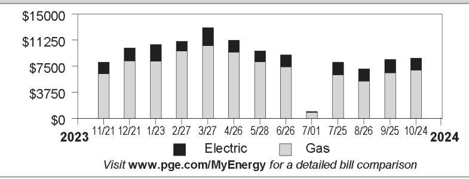

The image is a bar chart showing a **yearly usage breakdown (monthly-based)** for electric and gas charges from November 2023 to October 2024. 

- **Y-axis**: Labeled with dollar amounts ranging from $0 to $15,000.
- **X-axis**: Displays dates in the format MM/DD, starting from 11/21/2023 to 10/24/2024.
- **Legend**: 
  - Black bars represent "Electric"
  - Gray bars represent "Gas"

Each month has a stacked bar with varying heights for electric and gas charges. Notable months with higher total charges include 3/27 and 4/26. The month of 7/01 shows a significantly lower total charge compared to other months. 

The chart includes the text: "Visit www.pge.com/MyEnergy for a detailed bill comparison."

## Important Messages

California is fighting climate change and so can you! Your bill includes a Climate Credit from a state program to cut carbon pollution while also reducing your energy costs. Find out how at cpuc.ca.gov/climatecredit.

Master meter service obligations As a master meter customer, you have billing and service obligations for your sub-metered tenants. To find out more, visit www.leginfo.ca.gov/calaw.html, check the box next to Public Utilities Code, and type 739.5 in the search field for details on this California Code.

Continued on page 81
Please return this portion with your payment. No staples or paper clips. Do not fold. Thank you.

99902074b78314900008b71840000778b40

The image is a photo of a billing statement section from PG&E. It includes the following details:

- **Logo**: PG&E logo on the left side.
- **Account Number**: 2074678314-9
- **Due Date**: 11/14/2024
- **Total Amount Due**: $7,786.40
- **Amount Enclosed**: A section with boxes for entering the amount being paid, prefixed by a dollar sign ($) and followed by a period (.).

CHERRY AVE DEV CO
DBA CHERRY AVE
PO BOX 5368
SAN JOSE, CA 95150-5368

PG\&E
BOX 997300
SACRAMENTO, CA 95899-7300

# Important Phone Numbers - Monday-Friday 7 a.m.-7 p.m., Saturday 8 a.m.-5 p.m. Customer Service (All Languages; Relay Calls Accepted) 1-800-743-5000 TTY 7-1-1 

Servicio al Cliente en Español (Spanish) 1-800-660-6789
華語客戶服務 (Chinese) 1-800-893-9555

## Rules and rates

You may be eligible for a lower rate. To learn more about optional rates or view a complete list of rules and rates, visit www.pge.com or call 1-800-743-5000.
If you believe there is an error on your bill, please call 1-800-743-5000 to speak with a representative. If you are not satisfied with our response, contact the California Public Utilities Commission (CPUC), Consumer Affairs Branch (CAB), 505 Van Ness Avenue, Room 2003, San Francisco, CA 94102, 1-800-649-7570 or 7-1-1 (8:30 AM to 4:30 PM, Monday through Friday) or by visiting www.cpuc.ca.gov/complaints/.

To avoid having service turned off while you wait for the outcome of a complaint to the CPUC specifically regarding the accuracy of your bill, please contact CAB for assistance. If your case meets the eligibility criteria, CAB will provide you with instructions on how to mail a check or money order to be impounded pending resolution of your case. You must continue to pay your current charges while your complaint is under review to keep your service turned on.
If you are not able to pay your bill, call PG\&E to discuss how we can help. You may qualify for reduced rates under PG\&E's CARE program or other special programs and agencies may be available to assist you. You may qualify for PG\&E's Energy Savings Assistance Program which is an energy efficiency program for income-qualified residential customers.

## Important definitions

Rotating outage blocks are subject to change without advance notice due to operational conditions.
Tier 1/Baseline allowance: Some residential rates are given a Tier 1/Baseline allowance - a CPUC approved percentage of average customer usage during summer and winter months. Your Tier 1/Baseline allowance provides for basic needs at an affordable price and encourages conservation. Your allowance is assigned based on the climate where you live, the season and your heat source. As you use more energy, you pay more for usage. Any usage over your baseline allowance will be charged at a higher price.
Wildfire Fund Charge: Charge on behalf of the State of California Department of Water Resources (DWR) to fund the California Wildfire Fund. For usage prior to October 1, 2020, this charge included costs related to the 2001 California energy crisis, also collected on behalf of the DWR. These charges belong to DWR, not PG\&E.

[^0]Dich vu khách tiếng Việt (Vietnamese) 1-800-298-8438
Business Customer Service 1-800-468-4743

Power Charge Indifference Adjustment (PCIA): The PCIA is a charge to ensure that both PG\&E customers and those who have left PG\&E service to purchase electricity from other providers pay for the above market costs for electric generation resources that were procured by PG\&E on their behalf. 'Above market' refers to the difference between what the utility pays for electric generation and current market prices for the sale of those resources. Visit www.pge.com/cca.
Wildfire Hardening Charge: PG\&E has been permitted to issue bonds that enable it to recover more quickly certain costs related to preventing and mitigating catastrophic wildfires, while reducing the total cost to its customers. Your bill for electric service includes a fixed recovery charge called the Wildfire Hardening Charge that has been approved by the CPUC to repay those bonds. The right to recover the Wildfire Hardening Charge has been transferred to a separate entity (called the Special Purpose Entity) that issued the bonds and does not belong to PG\&E. PG\&E is collecting the Wildfire Hardening Charge on behalf of the Special Purpose Entity. For details visit: www.pge.com/tariffs/assets/pdf/tariffbook/ELEC_PRELIM_JF.pdf.
Recovery Bond Charge/Credit: Your bill for electric service includes a charge that has been approved by the CPUC to repay bonds issued for certain costs related to catastrophic wildfires. The Recovery Bond Charge (RBC) rate is currently $\$ 0.00650$ per kWh. PG\&E has also contributed certain amounts to a trust fund which is used to provide a customer credit equal to $\$ 0.00650$ per kWh (Recovery Bond Credit). The right to recover the RBC has been transferred to one or more Special Purpose Entities that issued the bonds and does not belong to PG\&E. PG\&E is collecting that portion of the RBC on behalf of the Special Purpose Entities.
Gas Public Purpose Program (PPP) Surcharge. Used to fund state-mandated gas assistance programs for low-income customers, energy efficiency programs, and public-interest research and development.

Visit www.pge.com/billexplanation for more definitions. To view most recent bill inserts including legal or mandated notices, visit www.pge.com/billinserts.

See the table reflecting "Your Electric Charges Breakdown" on the last page
"PG\&E" refers to Pacific Gas and Electric Company, a subsidiary of PG\&E Corporation, © 2024 Pacific Gas and Electric Company. All rights reserved.
Please do not mark in box. For system use only.

## Update My Information (English Only)

Please allow 1-2 billing cycles for changes to take effect

## Account Number: 2074678314-9

Change my mailing address to: $\qquad$

| City | State $\qquad$ ZIP code $\qquad$ |
| :-- | :-- |
| Primary | Primary |
| Phone | Email $\qquad$ |

## Ways To Pay

- Online via web or mobile at www.pge.com/waystopay
- By mail: Send your payment along with this payment stub in the envelope provided.
- By debit card, Visa, MasterCard, American Express, or Discover: Call 877-704-8470 at any time. (Our independent service provider charges a fee per transaction.)
- At a neighborhood payment center: To find a neighborhood payment center near you, please visit www.pge.com or call 800-743-5000. Please bring a copy of your bill with you.

[^0]:    "PG\&E" refers to Pacific Gas and Electric Company, a subsidiary of PG\&E Corporation, © 2024 Pacific Gas and Electric Company. All rights reserved.

# Summary of your energy related services 

|  | Meter Number | Usage | Amount |
| :--: | :--: | :--: | :--: |
| Service For: 4950 CHERRY AVE BLDG 1 |  |  |  |
| Service Agreement ID: 2072595041 Bldg 11 Apt 1 |  |  |  |
| PG\&E Electric Delivery Charges | 1006954109 | 193.769400 kWh | $\$ 51.42$ |
| Electric Adjustments |  |  | $-55.34$ |
| Service Agreement ID: 2073286944 |  |  |  |
| SAN JOSE CLEAN ENERGY Electric Generation |  | 193.769400 kWh | \$28.01 |
| Total |  |  | \$24.09 |
| Service For: 4950 CHERRY AVE BLDG 3 |  |  |  |
| Service Agreement ID: 2074678025 HSE MTR BOILER \#1,3,4 |  |  |  |
| PG\&E Gas Delivery Charges | 4482334X | 427.000000 Therm | \$924.17 |
| Service Agreement ID: 2075622178 |  |  |  |
| COMMERCIAL ENERGY Gas Procurement Charges |  | 427.000000 Therm | \$348.83 |
| Total |  |  | \$1,273.00 |
| Service For: 4950 CHERRY AVE BLDG 4 |  |  |  |
| Service Agreement ID: 2078145870 Bldg 11 Apt 4 |  |  |  |
| PG\&E Electric Delivery Charges | 1010269487 | 113.855500 kWh | $\$ 30.18$ |
| Electric Adjustments |  |  | $-55.34$ |
| Service Agreement ID: 2075994921 |  |  |  |
| SAN JOSE CLEAN ENERGY Electric Generation |  | 113.855500 kWh | \$16.36 |
| Total |  |  | - $\$ 8.80$ |
| Service For: 4950 CHERRY AVE BLDG 5 |  |  |  |
| Service Agreement ID: 2079478911 Bldg 11 Apt 5 |  |  |  |
| PG\&E Electric Delivery Charges | 1010272776 | 116.744100 kWh | $\$ 30.93$ |
| Electric Adjustments |  |  | $-55.34$ |
| Service Agreement ID: 2078467220 |  |  |  |
| SAN JOSE CLEAN ENERGY Electric Generation |  | 116.744100 kWh | \$16.77 |
| Total |  |  | - $\$ 7.64$ |
| Service For: 4950 CHERRY AVE BLDG 6 |  |  |  |
| Service Agreement ID: 2074257132 Bldg 11 Apt 6 |  |  |  |
| PG\&E Electric Delivery Charges | 1006952519 | 509.056500 kWh | \$159.22 |
| Electric Adjustments |  |  | $-55.34$ |
| Service Agreement ID: 2071608319 |  |  |  |
| SAN JOSE CLEAN ENERGY Electric Generation |  | 509.056500 kWh | \$76.13 |
| Total |  |  | \$180.01 |
| Service For: 4950 CHERRY AVE BLDG 7 |  |  |  |
| Service Agreement ID: 2074678055 HSE MTR BOILER \#6,7,8 |  |  |  |
| PG\&E Gas Delivery Charges | 61499700 | 525.000000 Therm | \$1,136.29 |

Summary of your energy related services (continued)

| Service Agreement ID: 2076093296 | Meter Number | Usage | Amount |
| :--: | :--: | :--: | :--: |
| COMMERCIAL ENERGY Gas Procurement Charges |  | 525.000000 Therm | \$428.86 |
| Total |  |  | \$1,565.15 |
| Service For: 4950 CHERRY AVE BLDG 2 |  |  |  |
| Service Agreement ID: 2078415296 Bldg 11 Apt 2 |  |  |  |
| PG\&E Electric Delivery Charges | 1010272398 | 65.470300 kWh | \$17.29 |
| Electric Adjustments |  |  | $-55.34$ |
| Service Agreement ID: 2078659652 |  |  |  |
| SAN JOSE CLEAN ENERGY Electric Generation |  | 65.470300 kWh | \$9.35 |
| Total |  |  | -\$28.70 |
| Service For: 4950 CHERRY AVE BLDG 8-B |  |  |  |
| Service Agreement ID: 2071565938 FIRE ALARM |  |  |  |
| PG\&E Electric Delivery Charges | 1006954059 | 6.210500 kWh | \$12.04 |
| Electric Adjustments |  |  | $-55.34$ |
| Service Agreement ID: 2071980486 |  |  |  |
| SAN JOSE CLEAN ENERGY Electric Generation |  | 6.210500 kWh | \$0.90 |
| Total |  |  | -\$42.40 |
| Service For: 4950 CHERRY AVE BLDG 8-A |  |  |  |
| Service Agreement ID: 2076563391 HSE MTR |  |  |  |
| PG\&E Electric Delivery Charges | 1010272579 | 154.102900 kWh | \$40.77 |
| Electric Adjustments |  |  | $-55.34$ |
| Service Agreement ID: 2079342334 |  |  |  |
| SAN JOSE CLEAN ENERGY Electric Generation |  | 154.102900 kWh | \$22.00 |
| Total |  |  | \$7.43 |
| Service For: 4950 CHERRY AVE BLDG 9-A |  |  |  |
| Service Agreement ID: 2076752175 Bldg 11 Apt 9 |  |  |  |
| PG\&E Electric Delivery Charges | 1010272548 | 278.771500 kWh | \$73.94 |
| Electric Adjustments |  |  | $-55.34$ |
| Service Agreement ID: 2076786906 |  |  |  |
| SAN JOSE CLEAN ENERGY Electric Generation |  | 278.771500 kWh | \$39.79 |
| Total |  |  | \$58.39 |
| Service For: 4950 CHERRY AVE BLDG 10 |  |  |  |
| Service Agreement ID: 2077745022 Bldg 11 Apt 10 |  |  |  |
| PG\&E Electric Delivery Charges | 1006954078 | 432.483800 kWh | \$130.54 |
| Electric Adjustments |  |  | $-55.34$ |
| Service Agreement ID: 2079217704 |  |  |  |
| SAN JOSE CLEAN ENERGY Electric Generation |  | 432.483800 kWh | \$62.78 |

Summary of your energy related services (continued)

| Service Agreement ID: 2074678080 |  |  |  |  |
| :--: | :--: | :--: | :--: | :--: |
|  | Meter Number |  | Usage | Amount |
|  | 9,10,11 |  |  |  |
| PG\&E Gas Delivery Charges | 62392188 |  | 368.000000 |  |
| Service Agreement ID: 2075648333 |  |  |  |  |
| COMMERCIAL ENERGY Gas Procurement Charges |  |  | 368.000000 |  |
| Total |  |  |  | \$1,235.07 |
| Service For: 4950 CHERRY AVE BLDG 15 |  |  |  |  |
| Service Agreement ID: 2073463235 UTIL RM |  |  |  |  |
| PG\&E Electric Delivery Charges | 1011329176 |  | 153.215500 |  |
| Electric Adjustments |  |  |  | $-55.34$ |
| Service Agreement ID: 2079751173 |  |  |  |  |
| SAN JOSE CLEAN ENERGY Electric Generation |  |  | 153.215500 |  |
| Total |  |  |  | \$7.25 |
| Service For: 4950 CHERRY AVE BLDG 16 |  |  |  |  |
| Service Agreement ID: 2077004451 HSE MTR-BLDG 16 |  |  |  |  |
| PG\&E Electric Delivery Charges | 1010272557 |  | 31.699700 |  |
| Electric Adjustments |  |  |  | $-55.34$ |
| Service Agreement ID: 2077694268 |  |  |  |  |
| SAN JOSE CLEAN ENERGY Electric Generation |  |  | 31.699700 |  |
| Total |  |  |  | - $\$ 38.48$ |
| Service For: 4950 CHERRY AVE BLDG 17 |  |  |  |  |
| Service Agreement ID: 2074678130 REC RM |  |  |  |  |
| PG\&E Gas Delivery Charges | 61599638 |  | 158.000000 |  |
| Service Agreement ID: 2070331521 |  |  |  |  |
| COMMERCIAL ENERGY Gas Procurement Charges |  |  | 158.000000 |  |
| Total |  |  |  | \$545.78 |
| Service For: 4950 CHERRY AVE BLDG 11 |  |  |  |  |
| Service Agreement ID: 2072883336 UTILITY RM-BLDG 11 |  |  |  |  |
| PG\&E Electric Delivery Charges | 1010272630 |  | 117.974400 |  |
| Electric Adjustments |  |  |  | $-55.34$ |
| Service Agreement ID: 2072897566 |  |  |  |  |
| SAN JOSE CLEAN ENERGY Electric Generation |  |  | 117.974400 |  |
| Total |  |  |  | - $\$ 7.26$ |
| Service For: 4950 CHERRY AVE |  |  |  |  |
| Service Agreement ID: 2075611967 HSE MTR \#12,13,15 |  |  |  |  |
| PG\&E Electric Delivery Charges | 1006952543 |  | 786.705600 |  |
| Electric Adjustments |  |  |  | $-55.34$ |
| Service Agreement ID: 2078113345 |  |  |  |  |
| SAN JOSE CLEAN ENERGY Electric Generation |  |  | 786.705600 |  |

Summary of your energy related services (continued)

| Service Agreement ID: 2074678095 HSE MTR \#12,13,15 | Meter Number | Usage | Amount |
| :--: | :--: | :--: | :--: |
| PG\&E Gas Delivery Charges | 61448485 | 402.000000 Therm | \$910.50 |
| Service Agreement ID: 2078257404 |  |  |  |
| COMMERCIAL ENERGY Gas Procurement Charges |  | 402.000000 Therm | \$328.40 |
| Total |  |  | \$1,558.77 |

Service For: 4950 CHERRY AVE BLDG 14
Service Agreement ID: 2072403524 HSE LITES-BLDG 14
PG\&E Electric Delivery Charges 1006954050 189.670000 kWh $\$ 50.19$
Electric Adjustments
$-55.34$
Service Agreement ID: 2078414368
SAN JOSE CLEAN ENERGY Electric Generation
Total
$\$ 22.02$
Service For: 4950 CHERRY AVE BLDG 13
Service Agreement ID: 2078066386 HSE MTR-LTS-BLDG 13
PG\&E Electric Delivery Charges 1009900277 573.988400 kWh $\$ 183.85$
Electric Adjustments
$-55.34$
Service Agreement ID: 2079240479
SAN JOSE CLEAN ENERGY Electric Generation
Total
$\$ 215.49$
Service For: 4950 CHERRY AVE BLDG 9-B
Service Agreement ID: 2077272112 Bldg 11 Apt 9B
PG\&E Electric Delivery Charges 1010272393 97.599300 kWh $\$ 25.88$
Electric Adjustments
$-55.34$
Service Agreement ID: 2070336970
SAN JOSE CLEAN ENERGY Electric Generation
Total
$-$ \$15.37
Service For: 4950 CHERRY AVE
Service Agreement ID: 2074678150 REC RM BOIL \#2,14,16
PG\&E Gas Delivery Charges 61712803 416.000000 Therm
\$ 902.77
Service Agreement ID: 2074246024
COMMERCIAL ENERGY Gas Procurement Charges
Total
$\$ 339.83$
Total $\$ 1,242.60$

Details of PG\&E Electric Delivery Charges
09/16/2024 - 10/14/2024 (29 billing days)
Service For: 4950 CHERRY AVE BLDG 1
Service Agreement ID: 2072595041 Bldg 11 Apt 1
Rate Schedule: Time-of-Use (Peak Pricing 4 - 9 p.m. Every Day)
09/16/2024 - 09/30/2024

Baseline Allowance
Energy Charges
Peak
Off Peak
Baseline Credit
Generation Credit
Power Charge Indifference Adjustment
Franchise Fee Surcharge
San Jose Utility Users' Tax (5.000\%)
San Jose Franchise Surcharge

147.00 kWh (15 days $\times 9.8 \mathrm{kWh} /$ day)

| Peak | 18.684200 kWh | @ \$0.59342 | \$11.09 |
| :--: | :--: | :--: | :--: |
| Off Peak | 81.293500 kWh | @ \$0.49042 | 39.87 |
| Baseline Credit | 99.977700 kWh | @-\$0.09837 | $-9.83$ |
| Generation Credit |  |  | $-15.60$ |
| Power Charge Indifference Adjustment |  |  | 0.96 |
| Franchise Fee Surcharge |  |  | 0.11 |
| San Jose Utility Users' Tax (5.000\%) |  |  | 1.32 |
| San Jose Franchise Surcharge |  |  | 0.08 |

10/01/2024 - 10/14/2024

| Baseline Allowance | 135.80 kWh | (14 days $\times 9.7 \mathrm{kWh} /$ day) |  |
| :-- | --: | --: | --: |
| Energy Charges |  |  |  |
| Peak | 18.159200 kWh | @ \$0.49378 | $\$ 8.97$ |
| Off Peak | 75.632500 kWh | @ $\$ 0.46378$ | 35.08 |
| Baseline Credit | 93.791700 kWh | @ -\$0.10117 | $-9.49$ |
| Generation Credit |  |  | $-13.32$ |
| Power Charge Indifference Adjustment |  |  | 0.90 |
| Franchise Fee Surcharge |  |  | 0.10 |
| San Jose Utility Users' Tax (5.000\%) |  |  | 1.11 |
| San Jose Franchise Surcharge |  |  | 0.07 |

Total PG\&E Electric Delivery Charges
2018 Vintaged Power Charge Indifference Adjustment
Average Daily Usage (kWh / day)

| Last Year | Last Period | Current Period |
| :--: | :--: | :--: |
| 8.87 | 6.88 | 6.68 |

Rate Identification Number

The image is a photo of a QR code. There is no additional text or elements visible in the image.

USCA-PGCC-0100-0000
www.pge.com/rin
To program your smart device, scan the QR code or enter the RIN code above and follow the on-screen instructions.

Service Information
Meter \#
Total Usage
Baseline Territory
Heat Source
Serial
Rotating Outage Block
Additional Messages
You received a California Climate Credit on your electric bill. Learn how you can use these savings to further reduce your energy costs and help fight climate change at
cpuc.ca.gov/climatecredit.

Electric Usage This Period: 193.769400 kWh, 29 billing days
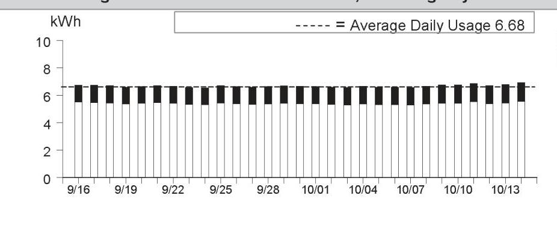

The image is a bar chart showing daily electric usage in kWh from 9/16 to 10/14. The y-axis is labeled "kWh" and ranges from 0 to 10. Each bar represents a day's usage, with most bars slightly above 6 kWh. A dashed line indicates the "Average Daily Usage 6.68." The chart provides a visual representation of consistent daily usage over the period.

|  |  |
| :-- | --: |
|  |  |
|  |  |
|  |  |
|  |  |
| Details of PG&E Electric Delivery Charges |  |
| (continued) |  |
| Service For: 4950 CHERRY AVE BLDG 1 |  |
| Service Agreement ID: 2072595041 Bldg 11 Apt 1 |  |
| Adjustments |  |
| California Climate Credit | -$55.17 |
| CA Climate Credit City Franchise Surcharge Adjustment | -$0.17 |
| Total Adjustments | -$55.34 |
|  |  |
|  |  |
|  |  |
|  |  |
|  |  |
|  |  |
|  |  |
|  |  |
|  |  |
|  |  |
|  |  |

Details of San Jose Clean Energy Electric Generation Charges
09/16/2024 - 10/14/2024 (29 billing days)
Service For: 4950 CHERRY AVE BLDG 1
Service Agreement ID: 2073286944 ESP Customer Number: 2074678015
09/16/2024 - 10/14/2024

Rate Schedule: E-TOU-C
Generation - Off Peak - Winter 75.632500 kWh @ \$0.12542 \$9.49
Generation - Off Peak - Summer 81.293500 kWh @ \$0.12816 10.42
Generation - On Peak - Winter 18.159200 kWh @ \$0.15209 2.76
Generation - On Peak - Summer 18.684200 kWh @ \$0.21116 3.95
Net Charges 26.62
Local Utility Users Tax
1.33

Energy Commission Surcharge
0.06

Your service: GreenSource - SJCE's standard service with more renewable energy
For more detail on your San Jose Clean Energy bill, call us at 833-432-2454

## Total San Jose Clean Energy Electric Generation Charges

\$28.01

Rate Identification Number

The image is a photo of a QR code. There is no additional text or elements present in the image.

USCA-XXSJ-0448-0000
www.pge.com/rin
To program your smart device, scan the QR code or enter the RIN code above and follow the on-screen instructions.

Service Information
Total Usage
193.769400 kWh

For questions regarding charges on this page, please contact:
SAN JOSE CLEAN ENERGY
200 E SANTA CLARA ST
SAN JOSE CA 95113
1-833-432-2454
www.sanjosecleanenergy.org
info@SanJoseCleanEnergy.org

## Additional Messages

About San José Clean Energy (SJCE)
San José Clean Energy is a program of the City of San José and provides its residents and businesses with electricity from sources like solar, wind, and hydropower. SJCE offers the additional benefits of customer choice, community programs, local control, transparency, and accountability.

SJCE's standard electricity generation service, GreenSource, provides customers with more renewable power. SJCE also offers a 100\% renewable product, TotalGreen, for a small premium. Learn more.
www.SanJoseCleanEnergy.org/TotalGreen.

## Understanding SJCE Charges

SJCE replaces PG\&E Generation Charges. PG\&E continues to provide all electric delivery, billing, and gas services. Under PG\&E Electric Delivery Charges, note the Generation Credit. This is what PG\&E would have charged for power, and now credits back to you. The PG\&E Power Charge Indifference Adjustment and Franchise Fee are factored into SJCE's rate-setting. Learn more.
www.SanJoseCleanEnergy.org/Understandin g-Your-Bill.

SJ Cares is SJCE's program that allows customers enrolled in CARE or FERA financial assistance programs to receive cleaner energy at the lowest possible rates. Learn more: www.SanJoseCleanEnergy.org/Discount-Pro grams.

Please pay your SJCE charges directly to PG\&E (see page 1 of this bill). Do not send payment to San José Clean Energy.

Details of PG\&E Gas Delivery Charges
09/11/2024 - 10/09/2024 (29 billing days)
Service For: 4950 CHERRY AVE BLDG 3
Service Agreement ID: 2074678025 HSE MTR BOILER \#1,3,4
Rate Schedule: GM X Master-Metered Multi-Family Service
Number of Dwelling Units: 48
09/11/2024 - 09/30/2024

| Tier 1 Allowance | 412.80000 | Therm |
| :-- | --: | --: |
| Tier 1 Usage | 294.482759 | Therms @ \$2.39227 |
| Gas Procurement Credit ${ }^{1}$ |  | -130.26 |
| Franchise Fee Surcharge |  | 0.11 |
| Gas PPP Surcharge (\$0.11051 /Therm) |  | 32.54 |
| San Jose Utility Users' Tax (5.000\%) |  | 28.71 |
| San Jose Franchise Surcharge |  | 1.72 |

10/01/2024 - 10/09/2024

| Tier 1 Allowance | 185.76000 | Therms |
| :-- | --: | --: |
| Tier 1 Usage | 132.517241 | Therms @ \$2.30397 |
| Gas Procurement Credit ${ }^{1}$ | -46.91 |  |
| Franchise Fee Surcharge |  | 0.12 |
| Gas PPP Surcharge (\$0.11051 /Therm) |  | 14.64 |
| San Jose Utility Users' Tax (5.000\%) |  | 12.92 |
| San Jose Franchise Surcharge |  | 0.78 |

Total PG\&E Gas Delivery Charges
\$924.17
${ }^{1}$ Credits you for the PG\&E Gas Usage charge that otherwise would have been included in this rate

Average Daily Usage (Therms / day)

| Last Year | Last Period | Current Period |
| :--: | :--: | :--: |
| 14.41 | 14.13 | 14.72 |

Gas Usage This Period: 427.000000 Therms, 29 billing days
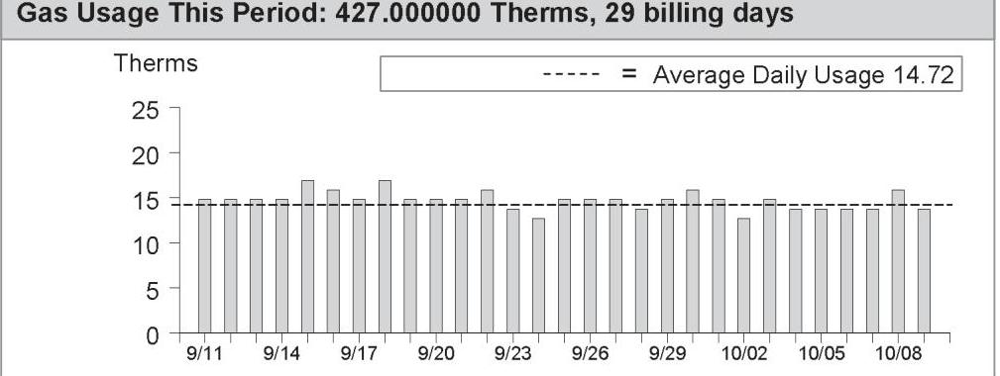

The image is a bar chart showing gas usage over a period from 9/11 to 10/09. The y-axis is labeled "Therms" and ranges from 0 to 25. Each bar represents daily gas usage in Therms for each date within the period. A dashed line across the chart indicates the "Average Daily Usage" at 14.72 Therms. The bars fluctuate around this average, with most bars slightly above or below the line, indicating daily variations in gas usage. The chart provides a visual representation of the "Gas Usage This Period: 427.000000 Therms, 29 billing days."

[^0]
[^0]:    Visit www.pge.com/MyEnergy for a detailed bill comparison.

Details of COMMERCIAL ENERGY Gas Procurement Charges

09/11/2024 - 10/09/2024 (29 billing days)
Service For: 4950 CHERRY AVE BLDG 3
Service Agreement ID: 2075622178 ESP Customer Number: 2074678025

09/11/2024 - 10/09/2024

Rate Schedule: PGGPG24911
Gas Procurement
Gas Procurement

Thank You For Your Business!
UTILITY USERS TAX

## Total COMMERCIAL ENERGY Gas Procurement Charges

For questions regarding charges on this page, please contact:
COMMERCIAL ENERGY
7677 OAKPORT ST STE 525
OAKLAND CA 94621
1-510-567-2700

## Additional Messages

If you believe there is an error or have a question in your Gas Service Provider's gas procurement charges, please call your Gas Service Provider at the number listed on your bill. If you are not satisfied with their response, please contact the CPUC's Consumer Affairs Branch at 1-800-649-7570. If you have limitations hearing or speaking, a specially-trained Communications Assistant can relay telephone conversations for all of your calls. Dial 711 to reach the California Relay Service.

To avoid being returned to PG&E bundled service by COMMERCIAL ENERGY while you wait for the outcome of your complaint, specifically regarding the accuracy of your bill, mail a check or money order payable to "California Public Utilities Commission" for the disputed amount, along with a description of the dispute to: California Public Utilities Commission, Consumer Affairs Branch, 505 Van Ness Avenue, Room 2003, San Francisco CA 94102. COMMERCIAL ENERGY cannot turn off your service for nonpayment while your complaint is under review. However, you must continue to pay your current charges to avoid disconnection of your service. The CPUC will not accept the payment for the disputed amount if the complaint to CAB is not directly related to the accuracy of your bill and your payment will be returned.

Details of PG\&E Electric Delivery Charges
09/16/2024 - 10/14/2024 (29 billing days)
Service For: 4950 CHERRY AVE BLDG 4
Service Agreement ID: 2078145870 Bldg 11 Apt 4
Rate Schedule: Time-of-Use (Peak Pricing 4 - 9 p.m. Every Day)

## 09/16/2024 - 09/30/2024

Baseline Allowance
Energy Charges
Peak
Off Peak
Baseline Credit
Generation Credit
Power Charge Indifference Adjustment
Franchise Fee Surcharge
San Jose Utility Users' Tax (5.000\%)
San Jose Franchise Surcharge

147.00 kWh (15 days $\times 9.8 \mathrm{kWh} /$ day)

| 9.989700 kWh | @ \$0.59342 | $\$ 5.93$ |
| :-- | :-- | :-- |
| 48.633300 kWh | @ \$0.49042 | 23.85 |
| 58.623000 kWh | @ - $\$ 0.09837$ | -5.77 |
|  |  | -9.06 |
|  |  | 0.56 |
|  |  | 0.06 |
|  |  | 0.78 |
|  |  | 0.05 |

10/01/2024 - 10/14/2024

| Baseline Allowance | 135.80 kWh | (14 days $\times 9.7 \mathrm{kWh} /$ day) |  |
| :-- | :-- | :-- | :-- |
| Energy Charges |  |  |  |
| Peak | 10.616700 kWh | @ $\$ 0.49378$ | $\$ 5.24$ |
| Off Peak | 44.615800 kWh | @ $\$ 0.46378$ | 20.69 |
| Baseline Credit | 55.232500 kWh | @ - $\$ 0.10117$ | -5.59 |
| Generation Credit |  |  | -7.84 |
| Power Charge Indifference Adjustment |  |  | 0.53 |
| Franchise Fee Surcharge |  |  | 0.06 |
| San Jose Utility Users' Tax (5.000\%) |  |  | 0.65 |
| San Jose Franchise Surcharge |  |  | 0.04 |

Total PG\&E Electric Delivery Charges
2018 Vintaged Power Charge Indifference Adjustment
Average Daily Usage (kWh / day)

| Last Year | Last Period | Current Period |
| :--: | :--: | :--: |
| 3.84 | 3.46 | 3.93 |

Rate Identification Number

The image is a photo of a QR code. There are no additional elements or text visible in the image.

USCA-PGCC-0100-0000
www.pge.com/rin
To program your smart device, scan the QR code or enter the RIN code above and follow the on-screen instructions.

Service Information
Meter \#
Total Usage
Baseline Territory
Heat Source
Serial
Rotating Outage Block
1010269487
113.855500 kWh
$\times$
B - Not Electric
Q
Rotating Outage Block
50

## Additional Messages

You received a California Climate Credit on your electric bill. Learn how you can use these savings to further reduce your energy costs and help fight climate change at
cpuc.ca.gov/climatecredit.

Electric Usage This Period: 113.855500 kWh, 29 billing days
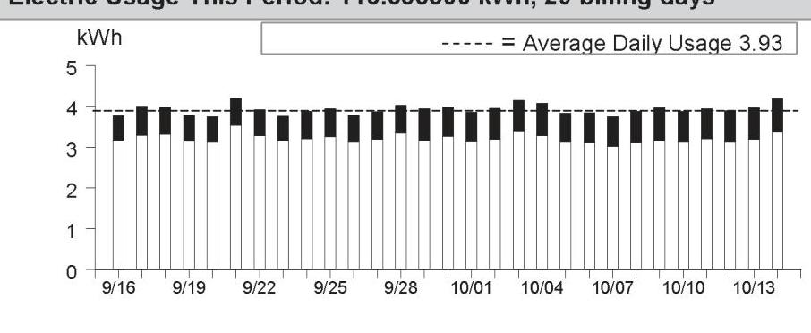

The image is a bar chart.

- **Chart Type**: Bar chart
- **X-Axis**: Dates ranging from 9/16 to 10/13
- **Y-Axis**: kWh (kilowatt-hours)
- **Legend**: "----- = Average Daily Usage 3.93"
- **Data Points**: Each bar represents daily usage in kWh, with values mostly around 4 kWh per day.
- **Styling**: A dashed line indicates the average daily usage of 3.93 kWh across the period.
- **Yearly Usage Breakdown (Monthly-Based)**: The chart shows daily electricity usage over a month-long period, indicating consistent usage around the average line.

|  |  |
| :-- | --: |
|  |  |
|  |  |
|  |  |
|  |  |
| Details of PG&E Electric Delivery Charges |  |
| (continued) |  |
| Service For: 4950 CHERRY AVE BLDG 4 |  |
| Service Agreement ID: 2078145870 Bldg 11 Apt 4 |  |
| Adjustments |  |
| California Climate Credit | -$55.17 |
| CA Climate Credit City Franchise Surcharge Adjustment | -$0.17 |
| Total Adjustments | -$55.34 |
|  |  |
|  |  |
|  |  |
|  |  |
|  |  |
|  |  |
|  |  |
|  |  |
|  |  |
|  |  |
|  |  |
|  |  |
|  |  |
|  |  |
|  |  |
|  |  |
|  |  |
|  |  |
|  |  |
|  |  |
|  |  |
|  |  |
|  |  |
|  |  |
|  |  |
|  |  |
|  |  |
|  |  |
|  |  |
|  |  |
|  |  |
|  |  |
|  |  |
|  |  |
|  |  |
|  |  |
|  |  |
|  |  |
|  |  |
|  | 

Details of San Jose Clean Energy Electric Generation Charges
09/16/2024 - 10/14/2024 (29 billing days)
Service For: 4950 CHERRY AVE BLDG 4
Service Agreement ID: 2075994921 ESP Customer Number: 2074678030
09/16/2024 - 10/14/2024

Rate Schedule: E-TOU-C
Generation - Off Peak - Winter $\quad 44.615800 \mathrm{kWh} \quad$ \$0.12542 \$5.60
Generation - Off Peak - Summer $\quad 48.633300 \mathrm{kWh} \quad$ \$0.12816 6.23
Generation - On Peak - Winter $\quad 10.616700 \mathrm{kWh} \quad$ \$0.15209 1.61
Generation - On Peak - Summer $\quad 9.989700 \mathrm{kWh} \quad$ \$0.21116 2.11
Total San Jose Clean Energy Electric Generation Charges
\$16.36

## Rate Identification Number

The image is a photo of a QR code. There are no additional elements or text visible in the image.

USCA-XXSJ-0448-0000
www.pge.com/rin
To program your smart device, scan the QR code or enter the RIN code above and follow the on-screen instructions.

## Service Information

Total Usage
113.855500 kWh

For questions regarding charges on this page, please contact:
SAN JOSE CLEAN ENERGY
200 E SANTA CLARA ST
SAN JOSE CA 95113
1-833-432-2454
www.sanjosecleanenergy.org
info@SanJoseCleanEnergy.org

## Additional Messages

About San José Clean Energy (SJCE)
San José Clean Energy is a program of the City of San José and provides its residents and businesses with electricity from sources like solar, wind, and hydropower. SJCE offers the additional benefits of customer choice, community programs, local control, transparency, and accountability.

SJCE's standard electricity generation service, GreenSource, provides customers with more renewable power. SJCE also offers a 100\% renewable product, TotalGreen, for a small premium. Learn more.
www.SanJoseCleanEnergy.org/TotalGreen.

## Understanding SJCE Charges

SJCE replaces PG\&E Generation Charges. PG\&E continues to provide all electric delivery, billing, and gas services. Under PG\&E Electric Delivery Charges, note the Generation Credit. This is what PG\&E would have charged for power, and now credits back to you. The PG\&E Power Charge Indifference Adjustment and Franchise Fee are factored into SJCE's rate-setting. Learn more.
www.SanJoseCleanEnergy.org/Understandin g-Your-Bill.

SJ Cares is SJCE's program that allows customers enrolled in CARE or FERA financial assistance programs to receive cleaner energy at the lowest possible rates. Learn more: www.SanJoseCleanEnergy.org/Discount-Pro grams.

Please pay your SJCE charges directly to PG\&E (see page 1 of this bill). Do not send payment to San José Clean Energy.

Details of PG\&E Electric Delivery Charges
09/16/2024 - 10/14/2024 (29 billing days)
Service For: 4950 CHERRY AVE BLDG 5
Service Agreement ID: 2079478911 Bldg 11 Apt 5
Rate Schedule: Time-of-Use (Peak Pricing 4 - 9 p.m. Every Day)
09/16/2024 - 09/30/2024

Baseline Allowance
Energy Charges
Peak
Off Peak
Baseline Credit
Generation Credit
Power Charge Indifference Adjustment
Franchise Fee Surcharge
San Jose Utility Users' Tax (5.000\%)
San Jose Franchise Surcharge

147.00 kWh (15 days $\times 9.8 \mathrm{kWh} /$ day)

| Peak | 10.071400 kWh | @ \$0.59342 | \$5.98 |
| :--: | :--: | :--: | :--: |
| Off Peak | 49.780200 kWh | @ \$0.49042 | 24.41 |
| Baseline Credit | 59.851600 kWh | @ - $\$ 0.09837$ | $-5.89$ |
| Generation Credit |  |  | $-9.25$ |
| Power Charge Indifference Adjustment |  |  | 0.57 |
| Franchise Fee Surcharge |  |  | 0.06 |
| San Jose Utility Users' Tax (5.000\%) |  |  | 0.79 |
| San Jose Franchise Surcharge |  |  | 0.05 |

10/01/2024 - 10/14/2024

| Baseline Allowance | 135.80 kWh | (14 days $\times 9.7 \mathrm{kWh} /$ day) |  |
| :-- | --: | :-- | --: |
| Energy Charges |  |  |  |
| Peak | 10.362200 kWh | @ $\$ 0.49378$ | $\$ 5.12$ |
| Off Peak | 46.530300 kWh | @ $\$ 0.46378$ | 21.58 |
| Baseline Credit | 56.892500 kWh | @ - $\$ 0.10117$ | $-5.76$ |
| Generation Credit |  |  | $-8.05$ |
| Power Charge Indifference Adjustment |  |  | 0.55 |
| Franchise Fee Surcharge |  |  | 0.06 |
| San Jose Utility Users' Tax (5.000\%) |  |  | 0.67 |
| San Jose Franchise Surcharge |  |  | 0.04 |

Total PG\&E Electric Delivery Charges
2018 Vintaged Power Charge Indifference Adjustment
Average Daily Usage (kWh / day)

| Last Year | Last Period | Current Period |
| :--: | :--: | :--: |
| 4.05 | 3.72 | 4.03 |

Rate Identification Number

The image is a QR code. There is no additional text or information embedded within the image itself.

USCA-PGCC-0100-0000
www.pge.com/rin
To program your smart device, scan the QR code or enter the RIN code above and follow the on-screen instructions.

Service Information
Meter \#
Total Usage
Baseline Territory
Heat Source
Serial
Rotating Outage Block
1010272776
116.744100 kWh

B - Not Electric
Rotation Outage Block

## Additional Messages

You received a California Climate Credit on your electric bill. Learn how you can use these savings to further reduce your energy costs and help fight climate change at
cpuc.ca.gov/climatecredit.

Electric Usage This Period: 116.744100 kWh, 29 billing days
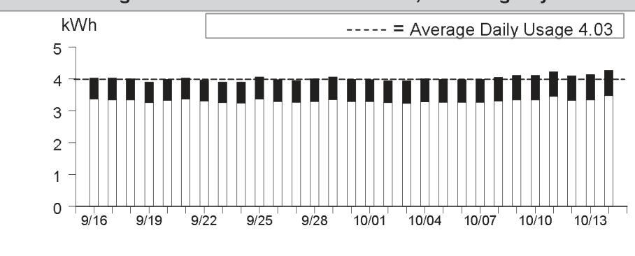

The image is a bar chart showing daily electricity usage in kWh from September 16 to October 14. 

- **Y-axis:** kWh
- **X-axis:** Dates from 9/16 to 10/14
- **Data Points:** Each bar represents daily usage, consistently around 4 kWh.
- **Dashed Line:** Represents the average daily usage of 4.03 kWh.
- **Styling:** Bars are uniform in height, indicating consistent daily usage close to the average. 

This chart provides a **yearly usage breakdown (monthly-based)** for the specified period.

|  |  |
| :-- | --: |
|  |  |
|  |  |
|  |  |
|  |  |
|  |  |
| Details of PG&E Electric Delivery Charges |  |
| (continued) |  |
| Service For: 4950 CHERRY AVE BLDG 5 |  |
| Service Agreement ID: 2079478911 Bldg 11 Apt 5 |  |
| Adjustments |  |
| California Climate Credit | -$55.17 |
| CA Climate Credit City Franchise Surcharge Adjustment | -$0.17 |
| Total Adjustments | -$55.34 |
|  |  |
|  |  |
|  |  |
|  |  |
|  |  |
|  |  |
|  |  |
|  |  |
|  |  |
|  |  |
|  |  |
|  |  |
|  |  |
|  |  |
|  |  |
|  |  |
|  |  |
|  |  |
|  |  |
|  |  |
|  |  |
|  |  |
|  |  |
|  |  |
|  |  |
|  |  |
|  |  |
|  |  |
|  |  |
|  |  |
|  |  |
|  |  |
|  |  |
|  |  |
|  |  |
|  |  |
|  |  |
|  |  |
|  |  |
|  | 

Details of San Jose Clean Energy Electric Generation Charges
09/16/2024 - 10/14/2024 (29 billing days)
Service For: 4950 CHERRY AVE BLDG 5
Service Agreement ID: 2078467220 ESP Customer Number: 2074678035
09/16/2024 - 10/14/2024

Rate Schedule: E-TOU-C
Generation - Off Peak - Winter
$46.530300 \mathrm{kWh} \quad$ \$ 0.12542
$5.84$
Generation - Off Peak - Summer
$49.780200 \mathrm{kWh} \quad$ \$ 0.12816
$6.38$
Generation - On Peak - Winter
$10.362200 \mathrm{kWh} \quad$ \$ 0.15209
$1.58$
Generation - On Peak - Summer
$10.071400 \mathrm{kWh} \quad$ \$ 0.21116
Net Charges 15.93
Local Utility Users Tax
0.80

Energy Commission Surcharge
Your service: GreenSource - SJCE's standard service with more renewable energy
For more detail on your San Jose Clean Energy bill, call us at 833-432-2454

## Total San Jose Clean Energy Electric Generation Charges

\$16.77

Rate Identification Number

The image is a photo of a QR code. There are no additional elements or text present in the image.

USCA-XXSJ-0448-0000
www.pge.com/rin
To program your smart device, scan the QR code or enter the RIN code above and follow the on-screen instructions.

## Service Information

Total Usage
116.744100 kWh

For questions regarding charges on this page, please contact:
SAN JOSE CLEAN ENERGY
200 E SANTA CLARA ST
SAN JOSE CA 95113
1-833-432-2454
www.sanjosecleanenergy.org
info@SanJoseCleanEnergy.org

## Additional Messages

About San José Clean Energy (SJCE)
San José Clean Energy is a program of the City of San José and provides its residents and businesses with electricity from sources like solar, wind, and hydropower. SJCE offers the additional benefits of customer choice, community programs, local control, transparency, and accountability.

SJCE's standard electricity generation service, GreenSource, provides customers with more renewable power. SJCE also offers a 100\% renewable product, TotalGreen, for a small premium. Learn more.
www.SanJoseCleanEnergy.org/TotalGreen.

## Understanding SJCE Charges

SJCE replaces PG\&E Generation Charges. PG\&E continues to provide all electric delivery, billing, and gas services. Under PG\&E Electric Delivery Charges, note the Generation Credit. This is what PG\&E would have charged for power, and now credits back to you. The PG\&E Power Charge Indifference Adjustment and Franchise Fee are factored into SJCE's rate-setting. Learn more.
www.SanJoseCleanEnergy.org/Understandin g-Your-Bill.

SJ Cares is SJCE's program that allows customers enrolled in CARE or FERA financial assistance programs to receive cleaner energy at the lowest possible rates. Learn more: www.SanJoseCleanEnergy.org/Discount-Pro grams.

Please pay your SJCE charges directly to PG\&E (see page 1 of this bill). Do not send payment to San José Clean Energy.

Details of PG\&E Electric Delivery Charges
09/16/2024 - 10/14/2024 (29 billing days)
Service For: 4950 CHERRY AVE BLDG 6
Service Agreement ID: 2074257132 Bldg 11 Apt 6
Rate Schedule: Time-of-Use (Peak Pricing 4 - 9 p.m. Every Day)
09/16/2024 - 09/30/2024

Baseline Allowance
Energy Charges
Peak
Off Peak
Baseline Credit
Generation Credit
Power Charge Indifference Adjustment
Franchise Fee Surcharge
San Jose Utility Users' Tax (5.000\%)
San Jose Franchise Surcharge

147.00 kWh (15 days $\times 9.8 \mathrm{kWh} /$ day)

| Peak | 67.283800 kWh | @ \$0.59342 | \$39.93 |
| :--: | :--: | :--: | :--: |
| Off Peak | 192.330600 kWh | @ \$0.49042 | 94.32 |
| 147.000000 kWh | @ - $\$ 0.09837$ | -14.46 |  |
|  |  | -42.07 |  |
|  |  | 2.49 |  |
|  |  | 0.28 |  |
|  |  | 4.01 |  |
|  |  | 0.24 |  |
| 10/01/2024 - 10/14/2024 |  |  |  |
|  |  |  |  |
| Baseline Allowance | 135.80 kWh | (14 days $\times 9.7 \mathrm{kWh} /$ day) |  |
| Energy Charges |  |  |  |
| Peak | 83.055100 kWh | @ \$0.49378 | \$41.01 |
| Off Peak | 166.387000 kWh | @ \$0.46378 | 77.17 |
| 135.800000 kWh | @ - $\$ 0.10117$ | -13.74 |  |
| Generation Credit |  | -36.34 |  |
| Power Charge Indifference Adjustment |  | 2.39 |  |
| Franchise Fee Surcharge |  | 0.26 |  |
| San Jose Utility Users' Tax (5.000\%) |  | 3.52 |  |
| San Jose Franchise Surcharge |  | 0.21 |  |

Total PG\&E Electric Delivery Charges
2018 Vintaged Power Charge Indifference Adjustment
Average Daily Usage (kWh / day)

| Last Year | Last Period | Current Period |
| :--: | :--: | :--: |
| 18.17 | 17.35 | 17.55 |

Rate Identification Number

The image is a QR code. There are no additional elements or embedded text within the image itself.

USCA-PGCC-0100-0000
www.pge.com/rin
To program your smart device, scan the QR code or enter the RIN code above and follow the on-screen instructions.

Service Information
Meter \#
Total Usage
Baseline Territory
Heat Source
Serial
Rotating Outage Block
1006952519
509.056500 kWh
$\times$
B - Not Electric
Q
$Q$
Rotating Outage Block

## Additional Messages

You received a California Climate Credit on your electric bill. Learn how you can use these savings to further reduce your energy costs and help fight climate change at
cpuc.ca.gov/climatecredit.

Electric Usage This Period: 509.056500 kWh, 29 billing days
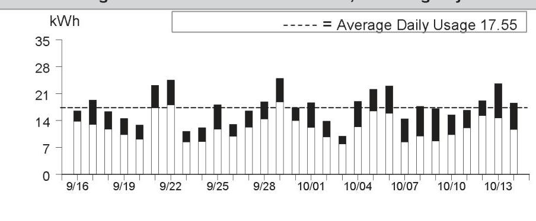

The image is a bar chart.

- **Chart Type**: Bar chart
- **X-Axis**: Dates from 9/16 to 10/13
- **Y-Axis**: kWh (kilowatt-hours)
- **Legend**: Dashed line labeled as "Average Daily Usage 17.55"
- **Data Points**: Daily kWh usage values are represented by bars, with varying heights indicating different usage levels. The average daily usage is marked by a horizontal dashed line at approximately 17.55 kWh.
- **Notable Styling**: The dashed line represents the average daily usage, providing a visual reference against the daily usage bars. The bars vary in height, showing fluctuations in daily energy consumption.

|  |  |
| :-- | --: |
|  |  |
|  |  |
|  |  |
|  |  |
|  |  |
| Details of PG&E Electric Delivery Charges |  |
| (continued) |  |
| Service For: 4950 CHERRY AVE BLDG 6 |  |
| Service Agreement ID: 2074257132 Bldg 11 Apt 6 |  |
| Adjustments |  |
| California Climate Credit | -$55.17 |
| CA Climate Credit City Franchise Surcharge Adjustment | -$0.17 |
| Total Adjustments | -$55.34 |
|  |  |
|  |  |
|  |  |
|  |  |
|  |  |
|  |  |
|  |  |
|  |  |
|  |  |
|  |  |
|  |  |
|  |  |
|  |  |
|  |  |
|  |  |
|  |  |
|  |  |
|  |  |
|  |  |
|  |  |
|  |  |
|  |  |
|  |  |
|  |  |
|  |  |
|  |  |
|  |  |
|  |  |
|  |  |
|  |  |
|  |  |
|  |  |
|  |  |
|  |  |
|  |  |
|  |  |
|  |  |
|  |  |
|  |  |
|  | 

Details of San Jose Clean Energy Electric Generation Charges
09/16/2024 - 10/14/2024 (29 billing days)
Service For: 4950 CHERRY AVE BLDG 6
Service Agreement ID: 2071608319 ESP Customer Number: 2074678040
09/16/2024 - 10/14/2024

Rate Schedule: E-TOU-C
Generation - Off Peak - Winter 166.387000 kWh @ \$0.12542 \$20.87
Generation - Off Peak - Summer 192.330600 kWh @ \$0.12816 24.65
Generation - On Peak - Winter 83.055100 kWh @ \$0.15209 12.63
Generation - On Peak - Summer 67.283800 kWh @ \$0.21116 14.21

Local Utility Users Tax
3.62

Energy Commission Surcharge
20.87

Your service: GreenSource - SJCE's standard service with more renewable energy
For more detail on your San Jose Clean Energy bill, call us at 833-432-2454

## Total San Jose Clean Energy Electric Generation Charges

\$76.13

Rate Identification Number

The image is a photo of a QR code. There are no additional elements or text visible in the image.

USCA-XXSJ-0448-0000
www.pge.com/rin
To program your smart device, scan the QR code or enter the RIN code above and follow the on-screen instructions.

## Service Information

Total Usage
509.056500 kWh

For questions regarding charges on this page, please contact:
SAN JOSE CLEAN ENERGY
200 E SANTA CLARA ST
SAN JOSE CA 95113
1-833-432-2454
www.sanjosecleanenergy.org
info@SanJoseCleanEnergy.org

## Additional Messages

About San José Clean Energy (SJCE)
San José Clean Energy is a program of the City of San José and provides its residents and businesses with electricity from sources like solar, wind, and hydropower. SJCE offers the additional benefits of customer choice, community programs, local control, transparency, and accountability.

SJCE's standard electricity generation service, GreenSource, provides customers with more renewable power. SJCE also offers a 100\% renewable product, TotalGreen, for a small premium. Learn more.
www.SanJoseCleanEnergy.org/TotalGreen.

## Understanding SJCE Charges

SJCE replaces PG\&E Generation Charges. PG\&E continues to provide all electric delivery, billing, and gas services. Under PG\&E Electric Delivery Charges, note the Generation Credit. This is what PG\&E would have charged for power, and now credits back to you. The PG\&E Power Charge Indifference Adjustment and Franchise Fee are factored into SJCE's rate-setting. Learn more.
www.SanJoseCleanEnergy.org/Understandin g-Your-Bill.

SJ Cares is SJCE's program that allows customers enrolled in CARE or FERA financial assistance programs to receive cleaner energy at the lowest possible rates. Learn more: www.SanJoseCleanEnergy.org/Discount-Pro grams.

Please pay your SJCE charges directly to PG\&E (see page 1 of this bill). Do not send payment to San José Clean Energy.

Details of PG\&E Gas Delivery Charges
09/11/2024 - 10/09/2024 (29 billing days)
Service For: 4950 CHERRY AVE BLDG 7
Service Agreement ID: 2074678055 HSE MTR BOILER \#6,7,8
Rate Schedule: GM X Master-Metered Multi-Family Service
Number of Dwelling Units: 62
09/11/2024 - 09/30/2024

| Tier 1 Allowance | 533.20000 | Therm |
| :-- | --: | --: |
| Tier 1 Usage | 362.068966 | Therms @ \$2.39227 |
| Gas Procurement Credit ${ }^{1}$ |  | -160.15 |
| Franchise Fee Surcharge |  | 0.13 |
| Gas PPP Surcharge (\$0.11051 /Therm) |  | 40.01 |
| San Jose Utility Users' Tax (5.000\%) |  | 35.30 |
| San Jose Franchise Surcharge |  | 2.12 |

10/01/2024 - 10/09/2024

| Tier 1 Allowance | 239.94000 | Therm |
| :-- | --: | --: |
| Tier 1 Usage | 162.931034 | Therms @ \$2.30397 |
| Gas Procurement Credit ${ }^{1}$ |  | -57.68 |
| Franchise Fee Surcharge |  | 0.15 |
| Gas PPP Surcharge (\$0.11051 /Therm) |  | 18.01 |
| San Jose Utility Users' Tax (5.000\%) |  | 15.89 |
| San Jose Franchise Surcharge |  | 0.95 |

Total PG\&E Gas Delivery Charges
$\$ 1,136.29$
${ }^{1}$ Credits you for the PG\&E Gas Usage charge that otherwise would have been included in this rate

Average Daily Usage (Therms / day)

| Last Year | Last Period | Current Period |
| :--: | :--: | :--: |
| 18.17 | 16.75 | 18.10 |

Gas Usage This Period: 525.000000 Therms, 29 billing days
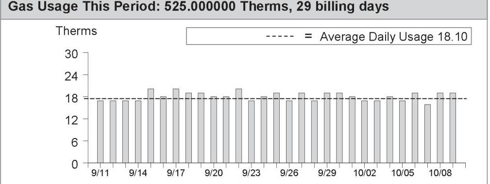

The image is a bar chart showing gas usage over a period from 9/11 to 10/09. 

- **Chart Type**: Bar chart
- **X-axis**: Dates from 9/11 to 10/09
- **Y-axis**: Therms, ranging from 0 to 30
- **Legend**: Dashed line labeled "Average Daily Usage 18.10"
- **Data Points**: Each bar represents daily gas usage in therms, with most bars slightly below or around the 18 therms mark, aligning closely with the average daily usage line.
- **Styling**: The average daily usage is indicated by a dashed line across the chart at the 18.10 therms level.

| Service Information |  |
| :--: | :--: |
| Meter \# | 61499700 |
| Current Meter Reading | 86,630 |
| Prior Meter Reading | 86,134 |
| Difference | 496 |
| Multiplier | 1.059109 |
| Total Usage | 525.000000 Therm |
| Baseline Territory | X |
| Serial | Q |

Gas Procurement Costs (\$/Therm)
09/11/2024 - 09/30/2024 \$0.44232
10/01/2024 - 10/09/2024 \$0.35402

Details of COMMERCIAL ENERGY Gas Procurement Charges

09/11/2024 - 10/09/2024 (29 billing days)
Service For: 4950 CHERRY AVE BLDG 7
Service Agreement ID: 2076093296 ESP Customer Number: 2074678055

09/11/2024 - 10/09/2024

Rate Schedule: PGGPG24911
Gas Procurement
Gas Procurement

Thank You For Your Business!
UTILITY USERS TAX

362.069000Therms @ $\$ 0.77800$
162.931000Therms @ $\$ 0.77800$
TOTAL NET CHARGES 408.45

20.41

Total COMMERCIAL ENERGY Gas Procurement Charges

For questions regarding charges on this page, please contact:
COMMERCIAL ENERGY
7677 OAKPORT ST STE 525
OAKLAND CA 94621
1-510-567-2700

## Additional Messages

If you believe there is an error or have a question in your Gas Service Provider's gas procurement charges, please call your Gas Service Provider at the number listed on your bill. If you are not satisfied with their response, please contact the CPUC's Consumer Affairs Branch at 1-800-649-7570. If you have limitations hearing or speaking, a specially-trained Communications Assistant can relay telephone conversations for all of your calls. Dial 711 to reach the California Relay Service.

To avoid being returned to PG&E bundled service by COMMERCIAL ENERGY while you wait for the outcome of your complaint, specifically regarding the accuracy of your bill, mail a check or money order payable to "California Public Utilities Commission" for the disputed amount, along with a description of the dispute to: California Public Utilities Commission, Consumer Affairs Branch, 505 Van Ness Avenue, Room 2003, San Francisco CA 94102. COMMERCIAL ENERGY cannot turn off your service for nonpayment while your complaint is under review. However, you must continue to pay your current charges to avoid disconnection of your service. The CPUC will not accept the payment for the disputed amount if the complaint to CAB is not directly related to the accuracy of your bill and your payment will be returned.

Details of PG\&E Electric Delivery Charges
09/16/2024 - 10/14/2024 (29 billing days)
Service For: 4950 CHERRY AVE BLDG 2
Service Agreement ID: 2078415296 Bldg 11 Apt 2
Rate Schedule: Time-of-Use (Peak Pricing 4 - 9 p.m. Every Day)

## 09/16/2024 - 09/30/2024

Baseline Allowance
Energy Charges
Peak
Off Peak
Baseline Credit
Generation Credit
Power Charge Indifference Adjustment
Franchise Fee Surcharge
San Jose Utility Users' Tax (5.000\%)
San Jose Franchise Surcharge

147.00 kWh (15 days $\times 9.8 \mathrm{kWh} /$ day)

| 5.261600 kWh | @ \$0.59342 | $\$ 3.12$ |
| :-- | :-- | :-- |
| 27.344000 kWh | @ \$0.49042 | 13.41 |
| 32.605600 kWh | @ - $\$ 0.09837$ | -3.21 |
|  |  | -5.02 |
|  |  | 0.31 |
|  |  | 0.03 |
|  |  | 0.43 |
|  |  | 0.03 |

## 10/01/2024 - 10/14/2024

| Baseline Allowance | 135.80 kWh | (14 days $\times 9.7 \mathrm{kWh} /$ day) |  |
| :-- | --: | :-- | --: |
| Energy Charges |  |  |  |
| Peak | 6.055900 kWh | @ $\$ 0.49378$ | $\$ 2.99$ |
| Off Peak | 26.808800 kWh | @ $\$ 0.46378$ | 12.43 |
| Baseline Credit | 32.864700 kWh | @ - $\$ 0.10117$ | -3.32 |
| Generation Credit |  |  | -4.66 |
| Power Charge Indifference Adjustment |  |  | 0.31 |
| Franchise Fee Surcharge |  |  | 0.03 |
| San Jose Utility Users' Tax (5.000\%) |  |  | 0.39 |
| San Jose Franchise Surcharge |  |  | 0.02 |

## Total PG\&E Electric Delivery Charges

2018 Vintaged Power Charge Indifference Adjustment
Average Daily Usage (kWh / day)

| Last Year | Last Period | Current Period |
| :--: | :--: | :--: |
| 2.23 | 2.04 | 2.26 |

## Rate Identification Number

The image is a photo of a QR code. There is no additional text or elements present in the image.

USCA-PGCC-0100-0000
www.pge.com/rin
To program your smart device, scan the QR code or enter the RIN code above and follow the on-screen instructions.

## Service Information

| Meter \# | 1010272398 |
| :-- | --: |
| Total Usage | 65.470300 kWh |
| Baseline Territory | X |
| Heat Source | B - Not Electric |
| Serial | Q |
| Rotating Outage Block | 50 |

## Additional Messages

You received a California Climate Credit on your electric bill. Learn how you can use these savings to further reduce your energy costs and help fight climate change at
cpuc.ca.gov/climatecredit.

Electric Usage This Period: 65.470300 kWh, 29 billing days
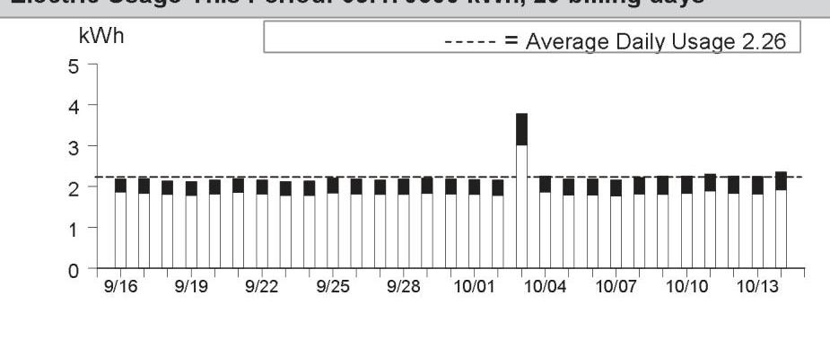

The image is a bar chart.

- **Chart Type**: Bar chart
- **X-Axis**: Dates ranging from 9/16 to 10/13
- **Y-Axis**: kWh (kilowatt-hours)
- **Legend**: "----- = Average Daily Usage 2.26"
- **Data Points**: Bars represent daily kWh usage, mostly around 2 kWh, with a notable spike on 10/04 reaching above 4 kWh.
- **Styling**: The average daily usage is indicated with a dashed line at 2.26 kWh, which most bars align with, except for the spike on 10/04.

This represents a **yearly usage breakdown (monthly-based)** for the specified period.

|  |  |
| :-- | --: |
|  |  |
|  |  |
|  |  |
|  |  |
| Details of PG&E Electric Delivery Charges |  |
| (continued) |  |
| Service For: 4950 CHERRY AVE BLDG 2 |  |
| Service Agreement ID: 2078415296 Bldg 11 Apt 2 |  |
| Adjustments |  |
| California Climate Credit | -$55.17 |
| CA Climate Credit City Franchise Surcharge Adjustment | -$0.17 |
| Total Adjustments | -$55.34 |
|  |  |
|  |  |
|  |  |
|  |  |
|  |  |
|  |  |
|  |  |
|  |  |
|  |  |
|  |  |
|  |  |

Details of San Jose Clean Energy Electric Generation Charges
09/16/2024 - 10/14/2024 (29 billing days)
Service For: 4950 CHERRY AVE BLDG 2
Service Agreement ID: 2078659652 ESP Customer Number: 2074678140
09/16/2024 - 10/14/2024

Rate Schedule: E-TOU-C
Generation - Off Peak - Winter
26.808800 kWh @ \$0.12542
$3.36

Generation - Off Peak - Summer
27.344000 kWh @ \$0.12816
$3.50

Generation - On Peak - Winter
6.055900 kWh @ \$0.15209
$0.92$

Generation - On Peak - Summer
5.261600 kWh @ \$0.21116
Net Charges 8.89
Local Utility Users Tax
0.44

Energy Commission Surcharge
0.02

Your service: GreenSource - SJCE's standard service with more renewable energy
For more detail on your San Jose Clean Energy bill, call us at 833-432-2454

## Total San Jose Clean Energy Electric Generation Charges

Rate Identification Number

The image is a photo of a QR code. There is no additional text or elements visible in the image.

USCA-XXSJ-0448-0000
www.pge.com/rin
To program your smart device, scan the QR code or enter the RIN code above and follow the on-screen instructions.

## Service Information

Total Usage
65.470300 kWh

For questions regarding charges on this page, please contact:
SAN JOSE CLEAN ENERGY
200 E SANTA CLARA ST
SAN JOSE CA 95113
1-833-432-2454
www.sanjosecleanenergy.org
info@SanJoseCleanEnergy.org

## Additional Messages

About San José Clean Energy (SJCE)
San José Clean Energy is a program of the City of San José and provides its residents and businesses with electricity from sources like solar, wind, and hydropower. SJCE offers the additional benefits of customer choice, community programs, local control, transparency, and accountability.

SJCE's standard electricity generation service, GreenSource, provides customers with more renewable power. SJCE also offers a 100\% renewable product, TotalGreen, for a small premium. Learn more.
www.SanJoseCleanEnergy.org/TotalGreen.

## Understanding SJCE Charges

SJCE replaces PG\&E Generation Charges. PG\&E continues to provide all electric delivery, billing, and gas services. Under PG\&E Electric Delivery Charges, note the Generation Credit. This is what PG\&E would have charged for power, and now credits back to you. The PG\&E Power Charge Indifference Adjustment and Franchise Fee are factored into SJCE's rate-setting. Learn more.
www.SanJoseCleanEnergy.org/Understandin g-Your-Bill.

SJ Cares is SJCE's program that allows customers enrolled in CARE or FERA financial assistance programs to receive cleaner energy at the lowest possible rates. Learn more: www.SanJoseCleanEnergy.org/Discount-Pro grams.

Please pay your SJCE charges directly to PG\&E (see page 1 of this bill). Do not send payment to San José Clean Energy.

Details of PG\&E Electric Delivery Charges
09/16/2024 - 10/14/2024 (29 billing days)
Service For: 4950 CHERRY AVE BLDG 8-B
Service Agreement ID: 2071565938 FIRE ALARM
Rate Schedule: Time-of-Use (Peak Pricing 4 - 9 p.m. Every Day)
09/16/2024 - 09/30/2024

Minimum Delivery Charge ${ }^{1}$
15 days @ $\$ 0.39167$
$0.03 \quad 0.30$
Power Charge Indifference Adjustment
San Jose Utility Users' Tax (5.000\%)
San Jose Franchise Surcharge
10/01/2024 - 10/14/2024

Minimum Delivery Charge ${ }^{1}$
14 days @ $\$ 0.39167$
Power Charge Indifference Adjustment
San Jose Utility Users' Tax (5.000\%)
San Jose Franchise Surcharge

Total PG\&E Electric Delivery Charges
${ }^{1}$ Minimum daily charge set by the CPUC
2018 Vintaged Power Charge Indifference Adjustment
Average Daily Usage (kWh / day)

| Last Year | Last Period | Current Period |
| :--: | :--: | :--: |
| 0.22 | 0.22 | 0.21 |

## Adjustments

California Climate Credit
CA Climate Credit City Franchise Surcharge Adjustment
Total Adjustments
$-\$ 55.34$

Rate Identification Number

This is a photo of a QR code. There are no additional elements or text within the image.

USCA-PGCC-0100-0000
www.pge.com/rin
To program your smart device, scan the QR code or enter the RIN code above and follow the on-screen instructions.

## Service Information

Meter \#
Total Usage
Baseline Territory
Heat Source
Serial
Rotating Outage Block

1006954059
6.210500 kWh

50

## Additional Messages

You received a California Climate Credit on your electric bill. Learn how you can use these savings to further reduce your energy costs and help fight climate change at cpuc.ca.gov/climatecredit.

Electric Usage This Period: 6.210500 kWh, 29 billing days
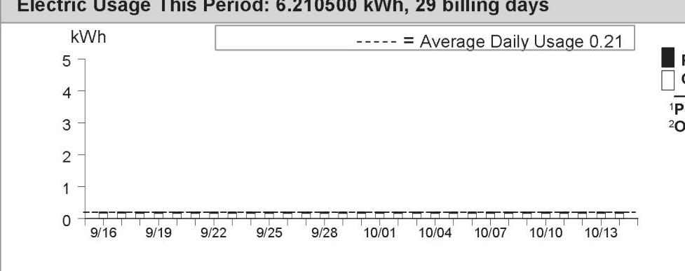

The image is a graph/chart.

- **Chart Type**: Line graph
- **X-Axis**: Dates ranging from 9/16 to 10/13
- **Y-Axis**: kWh (kilowatt-hours) ranging from 0 to 5
- **Legend**: 
  - Dashed line represents "Average Daily Usage 0.21"
  - Solid black square represents "1P"
  - Hollow square represents "2Q"
- **Data Points**: The graph shows a flat line at 0 kWh for each date, indicating no daily usage recorded.
- **Notable Styling**: The average daily usage is indicated by a dashed line at 0.21 kWh.

Details of San Jose Clean Energy Electric Generation Charges
09/16/2024 - 10/14/2024 (29 billing days)
Service For: 4950 CHERRY AVE BLDG 8-B
Service Agreement ID: 2071980486 ESP Customer Number: 2074678060
09/16/2024 - 10/14/2024

## Rate Schedule: E-TOU-C

Generation - Off Peak - Winter
Generation - Off Peak - Summer
Generation - On Peak - Winter
Generation - On Peak - Summer

Local Utility Users Tax
Energy Commission Surcharge
Your service: GreenSource - SJCE's standard service with more renewable energy
For more detail on your San Jose Clean Energy bill, call us at 833-432-2454

## Total San Jose Clean Energy Electric Generation Charges

## Rate Identification Number

The image is a photo of a QR code. There is no additional text or elements visible in the image.

USCA-XXSJ-0448-0000
www.pge.com/rin
To program your smart device, scan the QR code or enter the RIN code above and follow the on-screen instructions.

## Service Information

Total Usage
$6.210500 \mathrm{kWh}$
For questions regarding charges on this page, please contact:
SAN JOSE CLEAN ENERGY
200 E SANTA CLARA ST
SAN JOSE CA 95113
1-833-432-2454
www.sanjosecleanenergy.org
info@SanJoseCleanEnergy.org

## Additional Messages

About San José Clean Energy (SJCE)
San José Clean Energy is a program of the City of San José and provides its residents and businesses with electricity from sources like solar, wind, and hydropower. SJCE offers the additional benefits of customer choice, community programs, local control, transparency, and accountability.

SJCE's standard electricity generation service, GreenSource, provides customers with more renewable power. SJCE also offers a 100\% renewable product, TotalGreen, for a small premium. Learn more.
www.SanJoseCleanEnergy.org/TotalGreen.

## Understanding SJCE Charges

SJCE replaces PG\&E Generation Charges. PG\&E continues to provide all electric delivery, billing, and gas services. Under PG\&E Electric Delivery Charges, note the Generation Credit. This is what PG\&E would have charged for power, and now credits back to you. The PG\&E Power Charge Indifference Adjustment and Franchise Fee are factored into SJCE's rate-setting. Learn more.
www.SanJoseCleanEnergy.org/Understandin g-Your-Bill.

SJ Cares is SJCE's program that allows customers enrolled in CARE or FERA financial assistance programs to receive cleaner energy at the lowest possible rates. Learn more: www.SanJoseCleanEnergy.org/Discount-Pro grams.

Please pay your SJCE charges directly to PG\&E (see page 1 of this bill). Do not send payment to San José Clean Energy.

Details of PG\&E Electric Delivery Charges
09/16/2024 - 10/14/2024 (29 billing days)
Service For: 4950 CHERRY AVE BLDG 8-A
Service Agreement ID: 2076563391 HSE MTR
Rate Schedule: Time-of-Use (Peak Pricing 4 - 9 p.m. Every Day)
09/16/2024 - 09/30/2024

Baseline Allowance
Energy Charges
Peak
Off Peak
Baseline Credit
Generation Credit
Power Charge Indifference Adjustment
Franchise Fee Surcharge
San Jose Utility Users' Tax (5.000\%)
San Jose Franchise Surcharge

147.00 kWh (15 days $\times 9.8 \mathrm{kWh} /$ day)

| Peak | 12.092900 kWh | @ \$0.59342 | \$7.18 |
| :--: | :--: | :--: | :--: |
| Off Peak | 66.577600 kWh | @ \$0.49042 | 32.65 |
| Baseline Credit | 78.670500 kWh | @ - $\$ 0.09837$ | $-7.74$ |
| Generation Credit |  |  | $-12.06$ |
| Power Charge Indifference Adjustment |  |  | 0.75 |
| Franchise Fee Surcharge |  |  | 0.08 |
| San Jose Utility Users' Tax (5.000\%) |  |  | 1.04 |
| San Jose Franchise Surcharge |  |  | 0.06 |

10/01/2024 - 10/14/2024

| Baseline Allowance | 135.80 kWh | (14 days $\times 9.7 \mathrm{kWh} /$ day) |  |
| :-- | --: | :-- | --: |
| Energy Charges |  |  |  |
| Peak | 13.251300 kWh | @ $\$ 0.49378$ | $\$ 6.54$ |
| Off Peak | 62.181100 kWh | @ $\$ 0.46378$ | 28.84 |
| Baseline Credit | 75.432400 kWh | @ - $\$ 0.10117$ | $-7.63$ |
| Generation Credit |  |  | $-10.68$ |
| Power Charge Indifference Adjustment |  |  | 0.72 |
| Franchise Fee Surcharge |  |  | 0.08 |
| San Jose Utility Users' Tax (5.000\%) |  |  | 0.89 |
| San Jose Franchise Surcharge |  |  | 0.05 |

Total PG\&E Electric Delivery Charges
2018 Vintaged Power Charge Indifference Adjustment
Average Daily Usage (kWh / day)

| Last Year | Last Period | Current Period |
| :--: | :--: | :--: |
| 4.94 | 4.79 | 5.31 |

Rate Identification Number

This is a photo of a QR code. The QR code is a square, pixelated pattern designed to be scanned by a device to access information or a website. There are no other elements or text visible in the image.

USCA-PGCC-0100-0000
www.pge.com/rin
To program your smart device, scan the QR code or enter the RIN code above and follow the on-screen instructions.

Service Information
Meter \#
Total Usage
Baseline Territory
Heat Source
Serial
Rotating Outage Block
1010272579
154.102900 kWh

$$
X
$$

- Not Electric

50

# Additional Messages 

You received a California Climate Credit on your electric bill. Learn how you can use these savings to further reduce your energy costs and help fight climate change at
cpuc.ca.gov/climatecredit.

Electric Usage This Period: 154.102900 kWh, 29 billing days
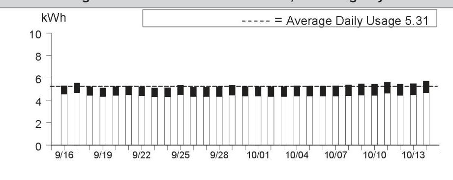

This is a bar chart illustrating daily electricity usage over a period from September 16 to October 13. 

- **Chart Type**: Bar chart
- **X-Axis**: Dates ranging from 9/16 to 10/13
- **Y-Axis**: kWh (kilowatt-hours), ranging from 0 to 10
- **Data Points**: Each bar represents daily usage, with most bars reaching just above 5 kWh.
- **Average Daily Usage**: A dashed line labeled "Average Daily Usage 5.31" runs horizontally across the chart, indicating the average usage level.
- **Yearly Usage Breakdown (Monthly-Based)**: The chart provides a visual representation of electricity consumption on a daily basis within the specified date range.

|  |  |
| :-- | --: |
|  |  |
|  |  |
|  |  |
|  |  |
|  |  |
| Details of PG&E Electric Delivery Charges |  |
| (continued) |  |
| Service For: 4950 CHERRY AVE BLDG 8-A |  |
| Service Agreement ID: 2076563391 HSE MTR |  |
| Adjustments |  |
| California Climate Credit | -$55.17 |
| CA Climate Credit City Franchise Surcharge Adjustment | -$0.17 |
| Total Adjustments | -$55.34 |
|  |  |
|  |  |
|  |  |
|  |  |
|  |  |
|  |  |
|  |  |
|  |  |
|  |  |
|  |  |
|  |  |
|  |  |
|  |  |
|  |  |
|  |  |
|  |  |
|  |  |
|  |  |
|  |  |
|  |  |
|  |  |
|  |  |
|  |  |
|  |  |
|  |  |
|  |  |
|  |  |
|  |  |
|  |  |
|  |  |
|  |  |
|  |  |
|  |  |
|  |  |
|  |  |
|  |  |
|  |  |
|  |  |
|  |  |
|  | 

Details of San Jose Clean Energy Electric Generation Charges
09/16/2024 - 10/14/2024 (29 billing days)
Service For: 4950 CHERRY AVE BLDG 8-A
Service Agreement ID: 2079342334 ESP Customer Number: 2074678065
09/16/2024 - 10/14/2024

Rate Schedule: E-TOU-C
Generation - Off Peak - Winter
$62.181100 \mathrm{kWh} \quad$ \$ 0.12542
\$7.80
Generation - Off Peak - Summer
66.577600 kWh @ \$0.12816

| 13.251300 | kWh | @ \$0.15209 |
| :-- | :-- | --: |
| 12.092900 | kWh | @ \$0.21116 |
|  | Net Charges | 20.90 |

Local Utility Users Tax
Energy Commission Surcharge
Your service: GreenSource - SJCE's standard service with more renewable energy
For more detail on your San Jose Clean Energy bill, call us at 833-432-2454

## Total San Jose Clean Energy Electric Generation Charges

\$22.00

Rate Identification Number

The image is a photo of a QR code. There are no additional elements or text visible in the image.

USCA-XXSJ-0448-0000
www.pge.com/rin
To program your smart device, scan the QR code or enter the RIN code above and follow the on-screen instructions.

## Service Information

Total Usage
154.102900 kWh

For questions regarding charges on this page, please contact:
SAN JOSE CLEAN ENERGY
200 E SANTA CLARA ST
SAN JOSE CA 95113
1-833-432-2454
www.sanjosecleanenergy.org
info@SanJoseCleanEnergy.org

## Additional Messages

About San José Clean Energy (SJCE)
San José Clean Energy is a program of the City of San José and provides its residents and businesses with electricity from sources like solar, wind, and hydropower. SJCE offers the additional benefits of customer choice, community programs, local control, transparency, and accountability.

SJCE's standard electricity generation service, GreenSource, provides customers with more renewable power. SJCE also offers a 100\% renewable product, TotalGreen, for a small premium. Learn more.
www.SanJoseCleanEnergy.org/TotalGreen.

## Understanding SJCE Charges

SJCE replaces PG\&E Generation Charges. PG\&E continues to provide all electric delivery, billing, and gas services. Under PG\&E Electric Delivery Charges, note the Generation Credit. This is what PG\&E would have charged for power, and now credits back to you. The PG\&E Power Charge Indifference Adjustment and Franchise Fee are factored into SJCE's rate-setting. Learn more.
www.SanJoseCleanEnergy.org/Understandin g-Your-Bill.

SJ Cares is SJCE's program that allows customers enrolled in CARE or FERA financial assistance programs to receive cleaner energy at the lowest possible rates. Learn more: www.SanJoseCleanEnergy.org/Discount-Pro grams.

Please pay your SJCE charges directly to PG\&E (see page 1 of this bill). Do not send payment to San José Clean Energy.

Details of PG\&E Electric Delivery Charges
09/16/2024 - 10/14/2024 (29 billing days)
Service For: 4950 CHERRY AVE BLDG 9-A
Service Agreement ID: 2076752175 Bldg 11 Apt 9
Rate Schedule: Time-of-Use (Peak Pricing 4 - 9 p.m. Every Day)
09/16/2024 - 09/30/2024

Baseline Allowance
Energy Charges
Peak
Off Peak
Baseline Credit
Generation Credit
Power Charge Indifference Adjustment
Franchise Fee Surcharge
San Jose Utility Users' Tax (5.000\%)
San Jose Franchise Surcharge

147.00 kWh (15 days $\times 9.8 \mathrm{kWh} /$ day)

| Peak | 21.908400 kWh | @ \$0.59342 | \$13.00 |
| :--: | :--: | :--: | :--: |
| Off Peak | 119.528100 kWh | @ \$0.49042 | 58.62 |
| 141.436500 kWh | @ - $\$ 0.09837$ | -13.91 |  |
|  |  |  | -21.70 |
|  |  | 1.35 |  |
|  |  | 0.15 |  |
| 10/01/2024 - 10/14/2024 |  |  |  |
|  |  |  |  |
| Baseline Allowance | 135.80 kWh | (14 days $\times 9.7 \mathrm{kWh} /$ day) |  |
| Energy Charges |  |  |  |
| Peak | 24.289100 kWh | @ \$0.49378 | \$11.99 |
| Off Peak | 113.045900 kWh | @ \$0.46378 | 52.43 |
| 135.800000 kWh | @ - $\$ 0.10117$ | -13.74 |  |
|  |  |  | -19.43 |
| Generation Credit |  |  | 1.32 |
| Power Charge Indifference Adjustment |  |  | 0.15 |
| Franchise Fee Surcharge |  |  | 1.63 |
| San Jose Utility Users' Tax (5.000\%) |  |  | 0.10 |
|  |  |  |  |
| 2018 Vintaged Power Charge Indifference Adjustment |  |  |  |
| Average Daily Usage (kWh / day) |  |  |  |
| Last Year | Last Period | Current Period |  |
| 9.61 | 8.62 | 9.61 |  |

Rate Identification Number

The image is a QR code. There is no embedded text or additional information visible within the QR code itself.

USCA-PGCC-0100-0000
www.pge.com/rin
To program your smart device, scan the QR code or enter the RIN code above and follow the on-screen instructions.

Service Information
Meter \#
Total Usage
Baseline Territory
Heat Source
Serial
Rotating Outage Block
Additional Messages
You received a California Climate Credit on your electric bill. Learn how you can use these savings to further reduce your energy costs and help fight climate change at
cpuc.ca.gov/climatecredit.

Electric Usage This Period: 278.771500 kWh, 29 billing days

The image is a bar chart.

- **Chart Type**: Bar chart
- **X-Axis**: Dates from 9/16 to 10/13
- **Y-Axis**: kWh (kilowatt-hours)
- **Data Points**: Daily usage values are shown for each date, with bars mostly around the 8 to 12 kWh range.
- **Average Daily Usage**: Indicated by a dashed line at 9.61 kWh
- **Yearly Usage Breakdown (Monthly-Based)**: The chart provides a daily breakdown of electricity usage over the specified period.
- **Styling**: The average daily usage is highlighted with a dashed line across the chart.

|  | Usage | Energy Charges |
| :--: | :--: | :--: |
|  | 16.57\% | $\$ 24.99$ |
|  | 83.43\% | \$111.05 |

${ }^{1}$ Peak: 4:00pm-9:00pm, Every Day;
${ }^{2}$ Off Peak: All Other Hours

|  |  |
| :-- | --: |
|  |  |
|  |  |
|  |  |
|  |  |
| Details of PG&E Electric Delivery Charges |  |
| (continued) |  |
| Service For: 4950 CHERRY AVE BLDG 9-A |  |
| Service Agreement ID: 2076752175 Bldg 11 Apt 9 |  |
| Adjustments |  |
| California Climate Credit | -$55.17 |
| CA Climate Credit City Franchise Surcharge Adjustment | -$0.17 |
| Total Adjustments | -$55.34 |
|  |  |
|  |  |
|  |  |
|  |  |
|  |  |
|  |  |
|  |  |
|  |  |
|  |  |
|  |  |
|  |  |
|  |  |
|  |  |
|  |  |
|  |  |
|  |  |
|  |  |
|  |  |
|  |  |
|  |  |
|  |  |
|  |  |
|  |  |
|  |  |
|  |  |
|  |  |
|  |  |
|  |  |
|  |  |
|  |  |
|  |  |
|  |  |
|  |  |
|  |  |
|  |  |
|  |  |
|  |  |
|  |  |
|  |  |
|  | 

Details of San Jose Clean Energy Electric Generation Charges
09/16/2024 - 10/14/2024 (29 billing days)
Service For: 4950 CHERRY AVE BLDG 9-A
Service Agreement ID: 2076786906 ESP Customer Number: 2074678070
09/16/2024 - 10/14/2024

Rate Schedule: E-TOU-C
Generation - Off Peak - Winter 113.045900 kWh @ \$0.12542 \$14.18
Generation - Off Peak - Summer 119.528100 kWh @ \$0.12816 15.32
Generation - On Peak - Winter 24.289100 kWh @ \$0.15209 3.69
Generation - On Peak - Summer 21.908400 kWh @ \$0.21116 4.63
Total San Jose Clean Energy Electric Generation Charges
$119.528100 \mathrm{kWh} @ \$ 0.12816$
15.32
$21.908400 \mathrm{kWh} @ \$ 0.21116$
Net Charges 37.82
1.89

1.89

1.89

1.08

2.08

2.08

For more detail on your San Jose Clean Energy bill, call us at 833-432-2454

# Total San Jose Clean Energy Electric 

Generation Charges
Rate Identification Number

The image is a photo of a QR code. There is no additional text or elements present in the image.

USCA-XXSJ-0448-0000
www.pge.com/rin
To program your smart device, scan the QR code or enter the RIN code above and follow the on-screen instructions.

## Service Information

Total Usage
278.771500 kWh

For questions regarding charges on this page, please contact:
SAN JOSE CLEAN ENERGY
200 E SANTA CLARA ST
SAN JOSE CA 95113
1-833-432-2454
www.sanjosecleanenergy.org
info@SanJoseCleanEnergy.org

## Additional Messages

About San José Clean Energy (SJCE)
San José Clean Energy is a program of the City of San José and provides its residents and businesses with electricity from sources like solar, wind, and hydropower. SJCE offers the additional benefits of customer choice, community programs, local control, transparency, and accountability.

SJCE's standard electricity generation service, GreenSource, provides customers with more renewable power. SJCE also offers a 100\% renewable product, TotalGreen, for a small premium. Learn more.
www.SanJoseCleanEnergy.org/TotalGreen.

## Understanding SJCE Charges

SJCE replaces PG\&E Generation Charges. PG\&E continues to provide all electric delivery, billing, and gas services. Under PG\&E Electric Delivery Charges, note the Generation Credit. This is what PG\&E would have charged for power, and now credits back to you. The PG\&E Power Charge Indifference Adjustment and Franchise Fee are factored into SJCE's rate-setting. Learn more.
www.SanJoseCleanEnergy.org/Understandin g-Your-Bill.

SJ Cares is SJCE's program that allows customers enrolled in CARE or FERA financial assistance programs to receive cleaner energy at the lowest possible rates. Learn more: www.SanJoseCleanEnergy.org/Discount-Pro grams.

Please pay your SJCE charges directly to PG\&E (see page 1 of this bill). Do not send payment to San José Clean Energy.

Details of PG\&E Electric Delivery Charges
09/16/2024 - 10/14/2024 (29 billing days)
Service For: 4950 CHERRY AVE BLDG 10
Service Agreement ID: 2077745022 Bldg 11 Apt 10
Rate Schedule: Time-of-Use (Peak Pricing 4 - 9 p.m. Every Day)
09/16/2024 - 09/30/2024

Baseline Allowance
Energy Charges
Peak
Off Peak
Baseline Credit
Generation Credit
Power Charge Indifference Adjustment
Franchise Fee Surcharge
San Jose Utility Users' Tax (5.000\%)
San Jose Franchise Surcharge

147.00 kWh (15 days $\times 9.8 \mathrm{kWh} /$ day)

| Peak | 44.548300 kWh | @ \$0.59342 | $\$ 26.44$ |
| :-- | --: | --: | --: |
| Off Peak | 179.536800 kWh | @ $\$ 0.49042$ | 88.05 |
| Baseline Credit | 147.000000 kWh | @ -\$0.09837 | -14.46 |
| Generation Credit |  |  | -35.19 |
| Power Charge Indifference Adjustment |  |  | 2.15 |
| Franchise Fee Surcharge |  |  | 0.24 |
| San Jose Utility Users' Tax (5.000\%) |  |  | 3.35 |
| San Jose Franchise Surcharge |  |  | 0.20 |

10/01/2024 - 10/14/2024

| Baseline Allowance | 135.80 kWh | (14 days $\times 9.7 \mathrm{kWh} /$ day) |  |
| :-- | --: | --: | --: |
| Energy Charges |  |  |  |
| Peak | 42.041000 kWh | @ $\$ 0.49378$ | $\$ 20.76$ |
| Off Peak | 166.357700 kWh | @ $\$ 0.46378$ | 77.15 |
| Baseline Credit | 135.800000 kWh | @ -\$0.10117 | -13.74 |
| Generation Credit |  |  | -29.63 |
| Power Charge Indifference Adjustment |  |  | 2.00 |
| Franchise Fee Surcharge |  |  | 0.22 |
| San Jose Utility Users' Tax (5.000\%) |  |  | 2.83 |
| San Jose Franchise Surcharge |  |  | 0.17 |

Total PG\&E Electric Delivery Charges
2018 Vintaged Power Charge Indifference Adjustment
Average Daily Usage (kWh / day)

| Last Year | Last Period | Current Period |
| :--: | :--: | :--: |
| 15.27 | 14.72 | 14.91 |

Rate Identification Number

The image is a photo of a QR code. There are no additional elements or embedded text visible in the image.

USCA-PGCC-0100-0000
www.pge.com/rin
To program your smart device, scan the QR code or enter the RIN code above and follow the on-screen instructions.

Service Information
Meter \#
Total Usage
Baseline Territory
Heat Source
Serial
Rotating Outage Block
Additional Messages
You received a California Climate Credit on your electric bill. Learn how you can use these savings to further reduce your energy costs and help fight climate change at
cpuc.ca.gov/climatecredit.

Electric Usage This Period: 432.483800 kWh, 29 billing days
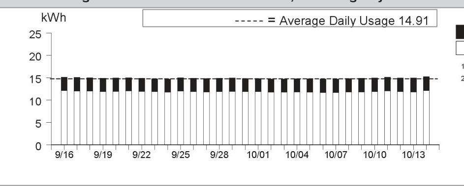

The image is a bar chart.

- **Chart Type**: Bar chart
- **X-Axis**: Dates from 9/16 to 10/14
- **Y-Axis**: kWh (kilowatt-hours)
- **Legend**: 
  - Dashed line represents "Average Daily Usage 14.91"
- **Data Points**: Each bar represents daily kWh usage, with values consistently around 15 kWh.
- **Styling**: The chart includes a dashed line indicating the average daily usage, which is 14.91 kWh. The bars are uniform in height, indicating consistent daily usage. 

This provides a **yearly usage breakdown (monthly-based)** for the specified period.

|  |  |
| :-- | --: |
|  |  |
|  |  |
|  |  |
|  |  |
|  |  |
| Details of PG&E Electric Delivery Charges |  |
| (continued) |  |
| Service For: 4950 CHERRY AVE BLDG 10 |  |
| Service Agreement ID: 2077745022 Bldg 11 Apt 10 |  |
| Adjustments |  |
| California Climate Credit | -$55.17 |
| CA Climate Credit City Franchise Surcharge Adjustment | -$0.17 |
| Total Adjustments | -$55.34 |
|  |  |
|  |  |
|  |  |
|  |  |
|  |  |
|  |  |
|  |  |
|  |  |
|  |  |
|  |  |
|  |  |

Details of San Jose Clean Energy Electric Generation Charges
09/16/2024 - 10/14/2024 (29 billing days)
Service For: 4950 CHERRY AVE BLDG 10
Service Agreement ID: 2079217704 ESP Customer Number: 2074678075
09/16/2024 - 10/14/2024

Rate Schedule: E-TOU-C
Generation - Off Peak - Winter 166.357700 kWh @ \$0.12542 \$20.86
Generation - Off Peak - Summer 179.536800 kWh @ \$0.12816 23.01
Generation - On Peak - Winter 42.041000 kWh @ \$0.15209 6.39
Generation - On Peak - Summer 44.548300 kWh @ \$0.21116 9.41
Total San Jose Clean Energy Electric Generation Charges
$44.548300 \mathrm{kWh} @ \$ 0.21116$
Net Charges 59.67
2.98

2.98

2.98

2.13

Rate Identification Number

The image is a photo of a QR code. There is no additional text or elements visible in the image.

USCA-XXSJ-0448-0000
www.pge.com/rin
To program your smart device, scan the QR code or enter the RIN code above and follow the on-screen instructions.

## Service Information

Total Usage
432.483800 kWh

For questions regarding charges on this page, please contact:
SAN JOSE CLEAN ENERGY
200 E SANTA CLARA ST
SAN JOSE CA 95113
1-833-432-2454
www.sanjosecleanenergy.org
info@SanJoseCleanEnergy.org

## Additional Messages

About San José Clean Energy (SJCE)
San José Clean Energy is a program of the City of San José and provides its residents and businesses with electricity from sources like solar, wind, and hydropower. SJCE offers the additional benefits of customer choice, community programs, local control, transparency, and accountability.

SJCE's standard electricity generation service, GreenSource, provides customers with more renewable power. SJCE also offers a 100\% renewable product, TotalGreen, for a small premium. Learn more.
www.SanJoseCleanEnergy.org/TotalGreen.

## Understanding SJCE Charges

SJCE replaces PG\&E Generation Charges. PG\&E continues to provide all electric delivery, billing, and gas services. Under PG\&E Electric Delivery Charges, note the Generation Credit. This is what PG\&E would have charged for power, and now credits back to you. The PG\&E Power Charge Indifference Adjustment and Franchise Fee are factored into SJCE's rate-setting. Learn more.
www.SanJoseCleanEnergy.org/Understandin g-Your-Bill.

SJ Cares is SJCE's program that allows customers enrolled in CARE or FERA financial assistance programs to receive cleaner energy at the lowest possible rates. Learn more: www.SanJoseCleanEnergy.org/Discount-Pro grams.

Please pay your SJCE charges directly to PG\&E (see page 1 of this bill). Do not send payment to San José Clean Energy.

Details of PG\&E Gas Delivery Charges
09/11/2024 - 10/09/2024 (29 billing days)
Service For: 4950 CHERRY AVE BLDG 10
Service Agreement ID: 2074678080 HSE MTR BOILER 9,10,11
Rate Schedule: GM XB Master-Metered Multi-Family Service
Number of Dwelling Units: 48
09/11/2024 - 09/30/2024

| Tier 1 Allowance | 412.80000 | Therm |
| :-- | --: | --: |
| Tier 1 Usage | 253.793103 | Therms @ \$2.39227 |
| Gas Procurement Credit ${ }^{1}$ |  | -112.26 |
| Franchise Fee Surcharge |  | 0.09 |
| Gas PPP Surcharge (\$0.11051 /Therm) |  | 28.04 |
| San Jose Utility Users' Tax (5.000\%) |  | 24.74 |
| San Jose Franchise Surcharge |  | 1.48 |

10/01/2024 - 10/09/2024

| Tier 1 Allowance | 185.76000 | Therm |
| :-- | --: | --: |
| Tier 1 Usage | 114.206897 | Therms @ \$2.30397 |
| Gas Procurement Credit ${ }^{1}$ | -40.43 |  |
| Franchise Fee Surcharge |  | 0.10 |
| Gas PPP Surcharge (\$0.11051 /Therm) |  | 12.62 |
| San Jose Utility Users' Tax (5.000\%) |  | 11.14 |
| San Jose Franchise Surcharge |  | 0.67 |

Total PG\&E Gas Delivery Charges
\$796.46
${ }^{1}$ Credits you for the PG\&E Gas Usage charge that otherwise would have been included in this rate

Average Daily Usage (Therms / day)

| Last Year | Last Period | Current Period |
| :--: | :--: | :--: |
| 13.90 | 12.56 | 12.69 |

Gas Usage This Period: 368.000000 Therms, 29 billing days
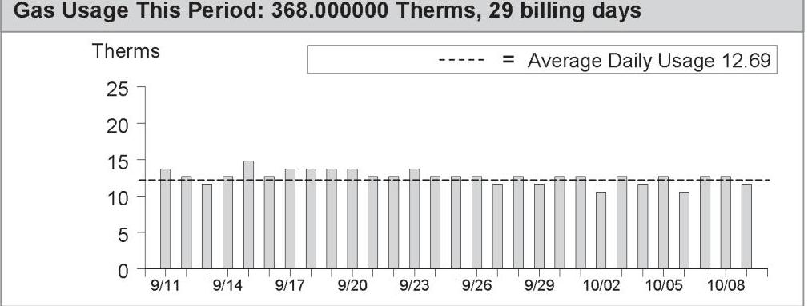

The image is a bar chart.

- **Chart Type**: Bar chart
- **X-Axis**: Dates ranging from 9/11 to 10/09
- **Y-Axis**: Therms (ranging from 0 to 25)
- **Legend**: Dashed line represents "Average Daily Usage 12.69"
- **Data Points**: Daily gas usage in Therms for each date, with most bars slightly above or below the average daily usage line of 12.69 Therms.
- **Notable Styling**: The average daily usage is indicated by a dashed line across the chart. The bars are uniform in color and height, showing slight variations around the average usage line.
- **Yearly Usage Breakdown (Monthly-Based)**: The chart provides a visual representation of gas usage over the specified billing period.

| Service Information |  |
| :--: | :--: |
| Meter \# | 62392188 |
| Current Meter Reading | 6,665 |
| Prior Meter Reading | 6,318 |
| Difference | 347 |
| Multiplier | 1.059109 |
| Total Usage | 368.000000 Therm |
| Baseline Territory | X |
| Serial | Q |

Gas Procurement Costs (\$/Therm)
09/11/2024 - 09/30/2024 \$0.44232
10/01/2024 - 10/09/2024 \$0.35402

Details of COMMERCIAL ENERGY Gas Procurement Charges

09/11/2024 - 10/09/2024 (29 billing days)
Service For: 4950 CHERRY AVE BLDG 10
Service Agreement ID: 2075648333 ESP Customer Number: 2074678080

09/11/2024 - 10/09/2024

Rate Schedule: PGGPG24911
Gas Procurement
Gas Procurement

Thank You For Your Business!
UTILITY USERS TAX

## Total COMMERCIAL ENERGY Gas Procurement Charges

For questions regarding charges on this page, please contact:
COMMERCIAL ENERGY
7677 OAKPORT ST STE 525
OAKLAND CA 94621
1-510-567-2700

## Additional Messages

If you believe there is an error or have a question in your Gas Service Provider's gas procurement charges, please call your Gas Service Provider at the number listed on your bill. If you are not satisfied with their response, please contact the CPUC's Consumer Affairs Branch at 1-800-649-7570. If you have limitations hearing or speaking, a specially-trained Communications Assistant can relay telephone conversations for all of your calls. Dial 711 to reach the California Relay Service.

To avoid being returned to PG\&E bundled service by COMMERCIAL ENERGY while you wait for the outcome of your complaint, specifically regarding the accuracy of your bill, mail a check or money order payable to "California Public Utilities Commission" for the disputed amount, along with a description of the dispute to: California Public Utilities Commission, Consumer Affairs Branch, 505 Van Ness Avenue, Room 2003, San Francisco CA 94102. COMMERCIAL ENERGY cannot turn off your service for nonpayment while your complaint is under review. However, you must continue to pay your current charges to avoid disconnection of your service. The CPUC will not accept the payment for the disputed amount if the complaint to CAB is not directly related to the accuracy of your bill and your payment will be returned.

Details of PG\&E Electric Delivery Charges
09/16/2024 - 10/14/2024 (29 billing days)
Service For: 4950 CHERRY AVE BLDG 15
Service Agreement ID: 2073463235 UTIL RM
Rate Schedule: Time-of-Use (Peak Pricing 4 - 9 p.m. Every Day)
09/16/2024 - 09/30/2024

Baseline Allowance
Energy Charges
Peak
Off Peak
Baseline Credit
Generation Credit
Power Charge Indifference Adjustment
Franchise Fee Surcharge
San Jose Utility Users' Tax (5.000\%)
San Jose Franchise Surcharge

147.00 kWh (15 days $\times 9.8 \mathrm{kWh} /$ day)

| Peak | 13.456000 kWh | @ \$0.59342 | \$7.99 |
| :--: | :--: | :--: | :--: |
| Off Peak | 64.272000 kWh | @ \$0.49042 | 31.52 |
| Baseline Credit | 77.728000 kWh | @ - $\$ 0.09837$ | $-7.65$ |
| Generation Credit |  |  | $-12.04$ |
| Power Charge Indifference Adjustment |  |  | 0.74 |
| Franchise Fee Surcharge |  |  | 0.08 |
| San Jose Utility Users' Tax (5.000\%) |  |  | 1.03 |
| San Jose Franchise Surcharge |  |  | 0.06 |

10/01/2024 - 10/14/2024

| Baseline Allowance | 135.80 kWh | (14 days $\times 9.7 \mathrm{kWh} /$ day) |  |
| :-- | --: | :-- | --: |
| Energy Charges |  |  |  |
| Peak | 14.610000 kWh | @ $\$ 0.49378$ | $\$ 7.21$ |
| Off Peak | 60.877500 kWh | @ $\$ 0.46378$ | 28.23 |
| Baseline Credit | 75.487500 kWh | @ - $\$ 0.10117$ | $-7.64$ |
| Generation Credit |  |  | $-10.72$ |
| Power Charge Indifference Adjustment |  |  | 0.72 |
| Franchise Fee Surcharge |  |  | 0.08 |
| San Jose Utility Users' Tax (5.000\%) |  |  | 0.89 |
| San Jose Franchise Surcharge |  |  | 0.05 |

Total PG\&E Electric Delivery Charges
2018 Vintaged Power Charge Indifference Adjustment
Average Daily Usage (kWh / day)

| Last Year | Last Period | Current Period |
| :--: | :--: | :--: |
| 7.52 | 4.81 | 5.28 |

Rate Identification Number

The image is a QR code. There is no additional text or elements present in the image.

USCA-PGCC-0100-0000
www.pge.com/rin
To program your smart device, scan the QR code or enter the RIN code above and follow the on-screen instructions.

Service Information
Meter \#
Total Usage
Baseline Territory
Heat Source
Serial
Rotating Outage Block
1011329176
153.215500 kWh

50

## Additional Messages

You received a California Climate Credit on your electric bill. Learn how you can use these savings to further reduce your energy costs and help fight climate change at
cpuc.ca.gov/climatecredit.

Electric Usage This Period: 153.215500 kWh, 29 billing days
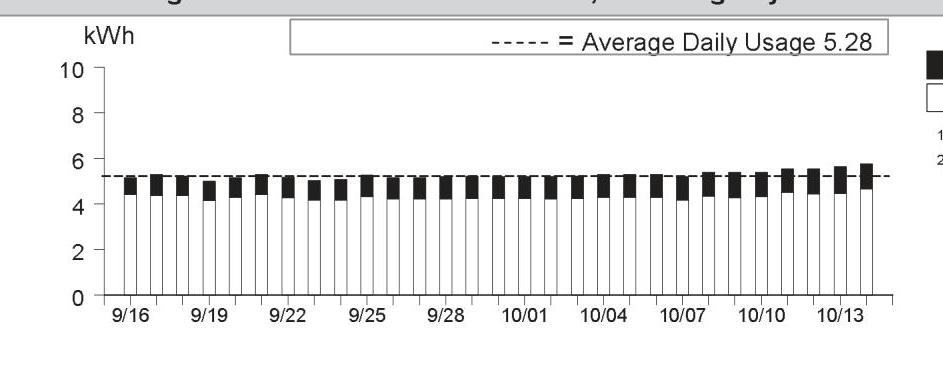

The image is a bar chart.

- **Chart Type**: Bar chart
- **X-Axis**: Dates from 9/16 to 10/14
- **Y-Axis**: kWh (kilowatt-hours)
- **Data Points**: Daily usage values are shown with bars, each representing a day. The bars are mostly consistent, slightly above 5 kWh.
- **Average Daily Usage**: Indicated by a dashed line at 5.28 kWh
- **Styling**: The bars are black and white, with a dashed line representing the average daily usage. The bars are uniform in height, indicating consistent daily usage.

|  |  |
| :-- | --: |
|  |  |
|  |  |
|  |  |
|  |  |
| Details of PG&E Electric Delivery Charges |  |
| (continued) |  |
| Service For: 4950 CHERRY AVE BLDG 15 |  |
| Service Agreement ID: 2073463235 UTIL RM |  |
| Adjustments |  |
| California Climate Credit | -$55.17 |
| CA Climate Credit City Franchise Surcharge Adjustment | -$0.17 |
| Total Adjustments | -$55.34 |
|  |  |
|  |  |
|  |  |
|  |  |
|  |  |
|  |  |
|  |  |
|  |  |
|  |  |
|  |  |
|  |  |
|  |  |
|  |  |
|  |  |
|  |  |
|  |  |
|  |  |
|  |  |
|  |  |
|  |  |
|  |  |
|  |  |
|  |  |
|  |  |
|  |  |
|  |  |
|  |  |
|  |  |
|  |  |
|  |  |
|  |  |
|  |  |
|  |  |
|  |  |
|  |  |
|  |  |
|  |  |
|  |  |
|  |  |
|  | 

Details of San Jose Clean Energy Electric Generation Charges
09/16/2024 - 10/14/2024 (29 billing days)
Service For: 4950 CHERRY AVE BLDG 15
Service Agreement ID: 2079751173 ESP Customer Number: 2074678100
09/16/2024 - 10/14/2024

Rate Schedule: E-TOU-C
Generation - Off Peak - Winter
$60.877500 \mathrm{kWh} \quad$ \$ 0.12542
\$7.64
Generation - Off Peak - Summer
64.272000 kWh
\$0.12816
\$0.12816
14.610000 kWh
\$0.15209
2.22

Generation - On Peak - Summer
13.456000 kWh
\$0.21116
Net Charges 20.94
Local Utility Users Tax
1.05

Energy Commission Surcharge
20.05

Your service: GreenSource - SJCE's standard service with more renewable energy
For more detail on your San Jose Clean Energy bill, call us at 833-432-2454

## Total San Jose Clean Energy Electric Generation Charges

\$22.04

Rate Identification Number

The image is a photo of a QR code. There are no additional elements or text visible in the image.

USCA-XXSJ-0448-0000
www.pge.com/rin
To program your smart device, scan the QR code or enter the RIN code above and follow the on-screen instructions.

## Service Information

Total Usage
153.215500 kWh

For questions regarding charges on this page, please contact:
SAN JOSE CLEAN ENERGY
200 E SANTA CLARA ST
SAN JOSE CA 95113
1-833-432-2454
www.sanjosecleanenergy.org
info@SanJoseCleanEnergy.org

## Additional Messages

About San José Clean Energy (SJCE)
San José Clean Energy is a program of the City of San José and provides its residents and businesses with electricity from sources like solar, wind, and hydropower. SJCE offers the additional benefits of customer choice, community programs, local control, transparency, and accountability.

SJCE's standard electricity generation service, GreenSource, provides customers with more renewable power. SJCE also offers a 100\% renewable product, TotalGreen, for a small premium. Learn more.
www.SanJoseCleanEnergy.org/TotalGreen.

## Understanding SJCE Charges

SJCE replaces PG\&E Generation Charges. PG\&E continues to provide all electric delivery, billing, and gas services. Under PG\&E Electric Delivery Charges, note the Generation Credit. This is what PG\&E would have charged for power, and now credits back to you. The PG\&E Power Charge Indifference Adjustment and Franchise Fee are factored into SJCE's rate-setting. Learn more.
www.SanJoseCleanEnergy.org/Understandin g-Your-Bill.

SJ Cares is SJCE's program that allows customers enrolled in CARE or FERA financial assistance programs to receive cleaner energy at the lowest possible rates. Learn more: www.SanJoseCleanEnergy.org/Discount-Pro grams.

Please pay your SJCE charges directly to PG\&E (see page 1 of this bill). Do not send payment to San José Clean Energy.

Details of PG\&E Electric Delivery Charges
09/16/2024 - 10/14/2024 (29 billing days)
Service For: 4950 CHERRY AVE BLDG 16
Service Agreement ID: 2077004451 HSE MTR-BLDG 16
Rate Schedule: Time-of-Use (Peak Pricing 4 - 9 p.m. Every Day)
09/16/2024 - 09/30/2024

Minimum Delivery Charge ${ }^{1}$
15 days @ $\$ 0.39167$
$0.15$
$\begin{array}{ll}\text { Power Charge Indifference Adjustment } & 0.15 \\ \text { Franchise Fee Surcharge } & 0.02\end{array}$
$\begin{array}{ll}\text { San Jose Utility Users' Tax (5.000\%) } & 0.30 \\ \text { San Jose Franchise Surcharge } & 0.02\end{array}$
10/01/2024 - 10/14/2024

| Minimum Delivery Charge ${ }^{1}$ | 14 days @ $\$ 0.39167$ | $\$ 5.48$ |
| :-- | :-- | --: |
| Power Charge Indifference Adjustment |  | 0.15 |
| Franchise Fee Surcharge |  | 0.02 |
| San Jose Utility Users' Tax (5.000\%) |  | 0.28 |
| San Jose Franchise Surcharge |  | 0.02 |

Total PG\&E Electric Delivery Charges
${ }^{1}$ Minimum daily charge set by the CPUC
2018 Vintaged Power Charge Indifference Adjustment
Average Daily Usage (kWh / day)

| Last Year | Last Period | Current Period |
| :--: | :--: | :--: |
| 1.11 | 1.00 | 1.09 |

## Adjustments

California Climate Credit
CA Climate Credit City Franchise Surcharge Adjustment
Total Adjustments
$-\$ 55.34$

Rate Identification Number

The image is a photo of a QR code. There are no additional elements or text visible in the image.

USCA-PGCC-0100-0000
www.pge.com/rin
To program your smart device, scan the QR code or enter the RIN code above and follow the on-screen instructions.

## Service Information

| Meter \# | 1010272557 |
| :-- | :-- |
| Total Usage | 31.699700 kWh |
| Baseline Territory | X |
| Heat Source | B - Not Electric |
| Serial | Q |
| Rotating Outage Block | 50 |

## Additional Messages

You received a California Climate Credit on your electric bill. Learn how you can use these savings to further reduce your energy costs and help fight climate change at cpuc.ca.gov/climatecredit.

Electric Usage This Period: 31.699700 kWh, 29 billing days
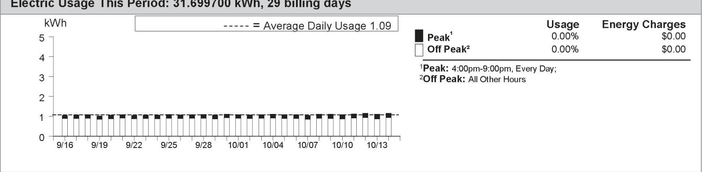

The image is a graph/chart.

- **Chart Type**: Bar chart
- **X-Axis**: Dates from 9/16 to 10/13
- **Y-Axis**: kWh (kilowatt-hours)
- **Legend Entries**:
  - Black bars represent "Peak" usage.
  - White bars represent "Off Peak" usage.
- **Data Points**: Each day from 9/16 to 10/13 shows a bar with usage slightly above 1 kWh.
- **Average Daily Usage**: Indicated by a dashed line at 1.09 kWh.
- **Usage and Energy Charges**:
  - Peak Usage: 0.00%
  - Peak Energy Charges: $0.00
  - Off Peak Usage: 0.00%
  - Off Peak Energy Charges: $0.00
- **Additional Text**:
  - "Peak¹: 4:00pm-9:00pm, Every Day;"
  - "Off Peak²: All Other Hours"
- **Yearly Usage Breakdown (monthly-based)**: The chart provides a breakdown of daily usage over the specified period.

Details of San Jose Clean Energy Electric Generation Charges
09/16/2024 - 10/14/2024 (29 billing days)
Service For: 4950 CHERRY AVE BLDG 16
Service Agreement ID: 2077694268 ESP Customer Number: 2074678105
09/16/2024 - 10/14/2024

Rate Schedule: E-TOU-C
Generation - Off Peak - Winter $\quad 12.624900 \mathrm{kWh} \quad$ \$0.12542 \$1.58
Generation - Off Peak - Summer $\quad 13.450700 \mathrm{kWh} \quad$ \$0.12816 1.72
Generation - On Peak - Winter $\quad 2.910800 \mathrm{kWh} \quad$ \$0.15209 0.44
Generation - On Peak - Summer $\quad 2.713300 \mathrm{kWh} \quad$ \$ $\$ 0.21116$ 0.57

Local Utility Users Tax
0.22

Energy Commission Surcharge
0.01

Your service: GreenSource - SJCE's standard service with more renewable energy
For more detail on your San Jose Clean Energy bill, call us at 833-432-2454

## Total San Jose Clean Energy Electric Generation Charges

\$4.54

Rate Identification Number

The image is a photo of a QR code. There is no additional text or elements present in the image.

USCA-XXSJ-0448-0000
www.pge.com/rin
To program your smart device, scan the QR code or enter the RIN code above and follow the on-screen instructions.

## Service Information

Total Usage
31.699700 kWh

For questions regarding charges on this page, please contact:
SAN JOSE CLEAN ENERGY
200 E SANTA CLARA ST
SAN JOSE CA 95113
1-833-432-2454
www.sanjosecleanenergy.org
info@SanJoseCleanEnergy.org

## Additional Messages

About San José Clean Energy (SJCE)
San José Clean Energy is a program of the City of San José and provides its residents and businesses with electricity from sources like solar, wind, and hydropower. SJCE offers the additional benefits of customer choice, community programs, local control, transparency, and accountability.

SJCE's standard electricity generation service, GreenSource, provides customers with more renewable power. SJCE also offers a 100\% renewable product, TotalGreen, for a small premium. Learn more.
www.SanJoseCleanEnergy.org/TotalGreen.

## Understanding SJCE Charges

SJCE replaces PG\&E Generation Charges. PG\&E continues to provide all electric delivery, billing, and gas services. Under PG\&E Electric Delivery Charges, note the Generation Credit. This is what PG\&E would have charged for power, and now credits back to you. The PG\&E Power Charge Indifference Adjustment and Franchise Fee are factored into SJCE's rate-setting. Learn more.
www.SanJoseCleanEnergy.org/Understandin g-Your-Bill.

SJ Cares is SJCE's program that allows customers enrolled in CARE or FERA financial assistance programs to receive cleaner energy at the lowest possible rates. Learn more: www.SanJoseCleanEnergy.org/Discount-Pro grams.

Please pay your SJCE charges directly to PG\&E (see page 1 of this bill). Do not send payment to San José Clean Energy.

Details of PG\&E Gas Delivery Charges
09/11/2024 - 10/09/2024 (29 billing days)
Service For: 4950 CHERRY AVE BLDG 17
Service Agreement ID: 2074678130 REC RM
Rate Schedule: G1 X Residential Service
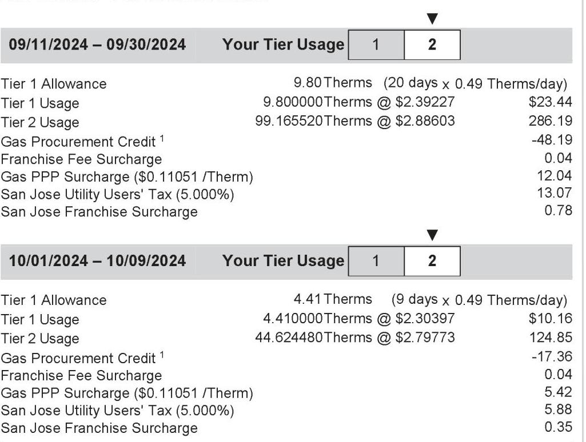

The image is a photo of a billing statement detailing PG&E gas delivery charges for two periods: 09/11/2024 - 09/30/2024 and 10/01/2024 - 10/09/2024. 

For the period 09/11/2024 - 09/30/2024:
- **Tier 1 Allowance**: 9.80 Therms (20 days x 0.49 Therms/day)
- **Tier 1 Usage**: 9.800000 Therms @ $2.39227 = $23.44
- **Tier 2 Usage**: 99.165520 Therms @ $2.88603 = $286.19
- **Gas Procurement Credit**: -$48.19
- **Franchise Fee Surcharge**: $0.04
- **Gas PPP Surcharge ($0.11051 /Therm)**: $12.04
- **San Jose Utility Users' Tax (5.000%)**: $13.07
- **San Jose Franchise Surcharge**: $0.78

For the period 10/01/2024 - 10/09/2024:
- **Tier 1 Allowance**: 4.41 Therms (9 days x 0.49 Therms/day)
- **Tier 1 Usage**: 4.410000 Therms @ $2.30397 = $10.16
- **Tier 2 Usage**: 44.624480 Therms @ $2.79773 = $124.85
- **Gas Procurement Credit**: -$17.36
- **Franchise Fee Surcharge**: $0.04
- **Gas PPP Surcharge ($0.11051 /Therm)**: $5.42
- **San Jose Utility Users' Tax (5.000%)**: $5.88
- **San Jose Franchise Surcharge**: $0.35

The layout shows the charges for each tier and additional surcharges and credits for each period.

## Total PG\&E Gas Delivery Charges

## Service Information

| Meter \# | 61599638 |
| :-- | --: |
| Current Meter Reading | 6,729 |
| Prior Meter Reading | 6,580 |
| Difference | 149 |
| Multiplier | 1.059109 |
| Total Usage | 158.000000 |
| Baseline Territory | X |
| Serial | Q |

Gas Procurement Costs (\$/Therm)
09/11/2024 - 09/30/2024
\$0.44232
10/01/2024 - 10/09/2024
\$0.35402

Details of COMMERCIAL ENERGY Gas Procurement Charges

09/11/2024 - 10/09/2024 (29 billing days)
Service For: 4950 CHERRY AVE BLDG 17
Service Agreement ID: 2070331521 ESP Customer Number: 2074678130

09/11/2024 - 10/09/2024

Rate Schedule: PGGPG24911
Gas Procurement
Gas Procurement

Thank You For Your Business!
UTILITY USERS TAX

## Total COMMERCIAL ENERGY Gas Procurement Charges

For questions regarding charges on this page, please contact:
COMMERCIAL ENERGY
7677 OAKPORT ST STE 525
OAKLAND CA 94621
1-510-567-2700

## Additional Messages

If you believe there is an error or have a question in your Gas Service Provider's gas procurement charges, please call your Gas Service Provider at the number listed on your bill. If you are not satisfied with their response, please contact the CPUC's Consumer Affairs Branch at 1-800-649-7570. If you have limitations hearing or speaking, a specially-trained Communications Assistant can relay telephone conversations for all of your calls. Dial 711 to reach the California Relay Service.

To avoid being returned to PG&E bundled service by COMMERCIAL ENERGY while you wait for the outcome of your complaint, specifically regarding the accuracy of your bill, mail a check or money order payable to "California Public Utilities Commission" for the disputed amount, along with a description of the dispute to: California Public Utilities Commission, Consumer Affairs Branch, 505 Van Ness Avenue, Room 2003, San Francisco CA 94102. COMMERCIAL ENERGY cannot turn off your service for nonpayment while your complaint is under review. However, you must continue to pay your current charges to avoid disconnection of your service. The CPUC will not accept the payment for the disputed amount if the complaint to CAB is not directly related to the accuracy of your bill and your payment will be returned.

Details of PG\&E Electric Delivery Charges
09/16/2024 - 10/14/2024 (29 billing days)
Service For: 4950 CHERRY AVE BLDG 11
Service Agreement ID: 2072883336 UTILITY RM-BLDG 11
Rate Schedule: Time-of-Use (Peak Pricing 4 - 9 p.m. Every Day)
09/16/2024 - 09/30/2024

Baseline Allowance
Energy Charges
Peak
Off Peak
Baseline Credit
Generation Credit
Power Charge Indifference Adjustment
Franchise Fee Surcharge
San Jose Utility Users' Tax (5.000\%)
San Jose Franchise Surcharge

147.00 kWh (15 days $\times 9.8 \mathrm{kWh} /$ day)

| 9.372100 kWh | @ \$0.59342 | $\$ 5.56$ |
| :-- | :-- | --: |
| 50.802900 kWh | @ \$0.49042 | 24.91 |
| 60.175000 kWh | @ -\$0.09837 | -5.92 |
|  |  | -9.23 |
|  |  | 0.58 |
|  |  | 0.06 |
|  |  | 0.80 |
|  |  | 0.05 |

10/01/2024 - 10/14/2024

| Baseline Allowance | 135.80 kWh | (14 days $\times 9.7 \mathrm{kWh} /$ day) |  |
| :-- | --: | --: | --: |
| Energy Charges |  |  |  |
| Peak | 10.113300 kWh | @ $\$ 0.49378$ | $\$ 4.99$ |
| Off Peak | 47.686100 kWh | @ $\$ 0.46378$ | 22.12 |
| Baseline Credit | 57.799400 kWh | @ -\$0.10117 | -5.85 |
| Generation Credit |  |  | -8.17 |
| Power Charge Indifference Adjustment |  |  | 0.55 |
| Franchise Fee Surcharge |  |  | 0.06 |
| San Jose Utility Users' Tax (5.000\%) |  |  | 0.68 |
| San Jose Franchise Surcharge |  |  | 0.04 |

Total PG\&E Electric Delivery Charges
2018 Vintaged Power Charge Indifference Adjustment
Average Daily Usage (kWh / day)

| Last Year | Last Period | Current Period |
| :--: | :--: | :--: |
| 4.08 | 3.66 | 4.07 |

Rate Identification Number

The image is a QR code. It is a black and white square pattern used for scanning with a device to access information or a website. There is no additional text or elements within the image.

USCA-PGCC-0100-0000
www.pge.com/rin
To program your smart device, scan the QR code or enter the RIN code above and follow the on-screen instructions.

Service Information
Meter \#
Total Usage
Baseline Territory
Heat Source
Serial
Rotating Outage Block
1010272630
117.974400 kWh

50

## Additional Messages

You received a California Climate Credit on your electric bill. Learn how you can use these savings to further reduce your energy costs and help fight climate change at
cpuc.ca.gov/climatecredit.

Electric Usage This Period: 117.974400 kWh, 29 billing days
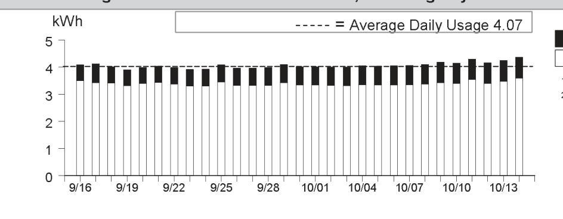

The image is a bar chart.

- **Chart Type**: Bar chart
- **X-Axis**: Dates ranging from 9/16 to 10/13
- **Y-Axis**: kWh (kilowatt-hours), ranging from 0 to 5
- **Legend**: 
  - Dashed line labeled as "Average Daily Usage 4.07"
- **Data Points**: Bars for each date showing daily kWh usage, with most bars slightly above or below the 4 kWh mark.
- **Styling**: The average daily usage is indicated by a dashed line across the chart at the 4.07 kWh level.
- **Yearly Usage Breakdown (Monthly-Based)**: The chart provides a visual representation of daily electricity usage over the specified period.

|  |  |
| :-- | --: |
|  |  |
|  |  |
|  |  |
|  |  |
|  |  |
| Details of PG&E Electric Delivery Charges |  |
| (continued) |  |
| Service For: 4950 CHERRY AVE BLDG 11 |  |
| Service Agreement ID: 2072883336 UTILITY RM-BLDG 11 |  |
| Adjustments |  |
| California Climate Credit | -$55.17 |
| CA Climate Credit City Franchise Surcharge Adjustment | -$0.17 |
| Total Adjustments | -$55.34 |
|  |  |
|  |  |
|  |  |
|  |  |
|  |  |
|  |  |
|  |  |
|  |  |
|  |  |
|  |  |
|  |  |
|  |  |
|  |  |
|  |  |
|  |  |
|  |  |
|  |  |
|  |  |
|  |  |
|  |  |
|  |  |
|  |  |
|  |  |
|  |  |
|  |  |
|  |  |
|  |  |
|  |  |
|  |  |
|  |  |
|  |  |
|  |  |
|  |  |
|  |  |
|  |  |
|  |  |
|  |  |
|  |  |
|  |  |
|  | 

Details of San Jose Clean Energy Electric Generation Charges
09/16/2024 - 10/14/2024 (29 billing days)
Service For: 4950 CHERRY AVE BLDG 11
Service Agreement ID: 2072897566 ESP Customer Number: 2074678085
09/16/2024 - 10/14/2024

Rate Schedule: E-TOU-C
Generation - Off Peak - Winter $\quad 47.686100 \mathrm{kWh} \quad$ \$0.12542 \$5.98
Generation - Off Peak - Summer $\quad 50.802900 \mathrm{kWh} \quad$ \$0.12816 6.51
Generation - On Peak - Winter $\quad 10.113300 \mathrm{kWh} \quad$ \$0.15209 1.54

Generation - On Peak - Summer $\quad 9.372100 \mathrm{kWh} \quad$ \$0.21116 1.98

Local Utility Users Tax
Net Charges 16.01
0.80

Energy Commission Surcharge
0.04

Your service: GreenSource - SJCE's standard service with more renewable energy
For more detail on your San Jose Clean Energy bill, call us at 833-432-2454

## Total San Jose Clean Energy Electric Generation Charges

\$16.85

Rate Identification Number

The image is a photo of a QR code. There are no additional elements or text visible in the image.

USCA-XXSJ-0448-0000
www.pge.com/rin
To program your smart device, scan the QR code or enter the RIN code above and follow the on-screen instructions.

## Service Information

Total Usage
117.974400 kWh

For questions regarding charges on this page, please contact:
SAN JOSE CLEAN ENERGY
200 E SANTA CLARA ST
SAN JOSE CA 95113
1-833-432-2454
www.sanjosecleanenergy.org
info@SanJoseCleanEnergy.org

## Additional Messages

About San José Clean Energy (SJCE)
San José Clean Energy is a program of the City of San José and provides its residents and businesses with electricity from sources like solar, wind, and hydropower. SJCE offers the additional benefits of customer choice, community programs, local control, transparency, and accountability.

SJCE's standard electricity generation service, GreenSource, provides customers with more renewable power. SJCE also offers a 100\% renewable product, TotalGreen, for a small premium. Learn more.
www.SanJoseCleanEnergy.org/TotalGreen.

## Understanding SJCE Charges

SJCE replaces PG\&E Generation Charges. PG\&E continues to provide all electric delivery, billing, and gas services. Under PG\&E Electric Delivery Charges, note the Generation Credit. This is what PG\&E would have charged for power, and now credits back to you. The PG\&E Power Charge Indifference Adjustment and Franchise Fee are factored into SJCE's rate-setting. Learn more.
www.SanJoseCleanEnergy.org/Understandin g-Your-Bill.

SJ Cares is SJCE's program that allows customers enrolled in CARE or FERA financial assistance programs to receive cleaner energy at the lowest possible rates. Learn more: www.SanJoseCleanEnergy.org/Discount-Pro grams.

Please pay your SJCE charges directly to PG\&E (see page 1 of this bill). Do not send payment to San José Clean Energy.

Details of PG\&E Electric Delivery Charges
09/16/2024 - 10/14/2024 (29 billing days)
Service For: 4950 CHERRY AVE
Service Agreement ID: 2075611967 HSE MTR \#12,13,15
Rate Schedule: Time-of-Use (Peak Pricing 4 - 9 p.m. Every Day)

## 09/16/2024 - 09/30/2024

Baseline Allowance
Energy Charges
Peak
Off Peak
Baseline Credit
Generation Credit
Power Charge Indifference Adjustment
Franchise Fee Surcharge
San Jose Utility Users' Tax (5.000\%)
San Jose Franchise Surcharge

147.00 kWh (15 days $\times 9.8 \mathrm{kWh} /$ day)

| Peak | 75.438200 kWh | @ \$0.59342 | $\$ 44.77$ |
| :-- | --: | --: | --: |
| Off Peak | 329.521500 kWh | @ \$0.49042 | 161.60 |
| Baseline Credit | 147.000000 kWh | @-\$0.09837 | -14.46 |
| Generation Credit |  |  | -63.17 |
| Power Charge Indifference Adjustment |  |  | 3.88 |
| Franchise Fee Surcharge |  |  | 0.43 |
| San Jose Utility Users' Tax (5.000\%) |  |  | 6.63 |
| San Jose Franchise Surcharge |  |  | 0.40 |
|  |  |  |  |
| 10/01/2024 - 10/14/2024 |  |  |  |
|  |  |  |  |
| Baseline Allowance | 135.80 kWh | (14 days $\times 9.7 \mathrm{kWh} /$ day) |  |
| Energy Charges |  |  |  |
| Peak | 73.777800 kWh | @ \$0.49378 | $\$ 36.43$ |
| Off Peak | 307.968100 kWh | @ \$0.46378 | 142.83 |
| Baseline Credit | 135.800000 kWh | @ -\$0.10117 | -13.74 |
| Generation Credit |  |  | -54.19 |
| Power Charge Indifference Adjustment |  |  | 3.66 |
| Franchise Fee Surcharge |  |  | 0.40 |
| San Jose Utility Users' Tax (5.000\%) |  |  | 5.75 |
| San Jose Franchise Surcharge |  |  | 0.34 |

Total PG\&E Electric Delivery Charges
2018 Vintaged Power Charge Indifference Adjustment
Average Daily Usage (kWh / day)

| Last Year | Last Period | Current Period |
| :--: | :--: | :--: |
| 27.47 | 25.69 | 27.13 |

Rate Identification Number

The image is a photo of a QR code. There are no additional elements or text visible in the image.

USCA-PGCC-0100-0000
www.pge.com/rin
To program your smart device, scan the QR code or enter the RIN code above and follow the on-screen instructions.

Service Information
Meter \#
Total Usage
Baseline Territory
Heat Source
Serial
Rotating Outage Block
Additional Messages
You received a California Climate Credit on your electric bill. Learn how you can use these savings to further reduce your energy costs and help fight climate change at
cpuc.ca.gov/climatecredit.

Electric Usage This Period: 786.705600 kWh, 29 billing days
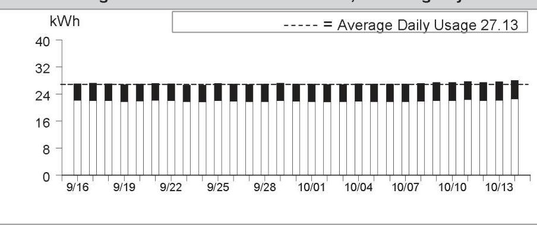

The image is a bar chart.

- **Chart Type**: Bar chart
- **X-Axis**: Dates ranging from 9/16 to 10/14
- **Y-Axis**: kWh (kilowatt-hours)
- **Legend**: Dashed line labeled as "Average Daily Usage 27.13"
- **Data Points**: Each bar represents daily usage, with values consistently around 27 kWh, aligning with the average daily usage line.
- **Notable Styling**: The average daily usage is indicated by a dashed line across the chart. Bars are uniform in height, suggesting consistent daily usage.

|  |  |
| :-- | --: |
|  |  |
|  |  |
|  |  |
|  |  |
| Details of PG&E Electric Delivery Charges |  |
| (continued) |  |
| Service For: 4950 CHERRY AVE |  |
| Service Agreement ID: 2075611967 HSE MTR \#12,13,15 |  |
| Adjustments |  |
| California Climate Credit | -$55.17 |
| CA Climate Credit City Franchise Surcharge Adjustment | -$0.17 |
| Total Adjustments | -$55.34 |
|  |  |
|  |  |
|  |  |
|  |  |
|  |  |
|  |  |
|  |  |
|  |  |
|  |  |
|  |  |

Details of San Jose Clean Energy Electric Generation Charges
09/16/2024 - 10/14/2024 (29 billing days)
Service For: 4950 CHERRY AVE
Service Agreement ID: 2078113345 ESP Customer Number: 2074678090
09/16/2024 - 10/14/2024

Rate Schedule: E-TOU-C
Generation - Off Peak - Winter $\quad 307.968100 \mathrm{kWh} \quad$ \$0.12542 \$38.63
Generation - Off Peak - Summer $\quad 329.521500 \mathrm{kWh} \quad$ \$0.12816 42.23
Generation - On Peak - Winter $\quad 73.777800 \mathrm{kWh} \quad$ \$0.15209 11.22
Generation - On Peak - Summer $\quad 75.438200 \mathrm{kWh} \quad$ \$0.21116 15.93
Local Utility Users Tax
5.40

Energy Commission Surcharge
Your service: GreenSource - SJCE's standard service with more renewable energy For more detail on your San Jose Clean Energy bill, call us at 833-432-2454

## Total San Jose Clean Energy Electric Generation Charges

\$113.65

Rate Identification Number

The image is a photo of a QR code. There are no additional elements or text visible in the image.

USCA-XXSJ-0448-0000
www.pge.com/rin
To program your smart device, scan the QR code or enter the RIN code above and follow the on-screen instructions.

## Service Information

Total Usage
786.705600 kWh

For questions regarding charges on this page, please contact:
SAN JOSE CLEAN ENERGY
200 E SANTA CLARA ST
SAN JOSE CA 95113
1-833-432-2454
www.sanjosecleanenergy.org
info@SanJoseCleanEnergy.org

## Additional Messages

About San José Clean Energy (SJCE)
San José Clean Energy is a program of the City of San José and provides its residents and businesses with electricity from sources like solar, wind, and hydropower. SJCE offers the additional benefits of customer choice, community programs, local control, transparency, and accountability.

SJCE's standard electricity generation service, GreenSource, provides customers with more renewable power. SJCE also offers a 100\% renewable product, TotalGreen, for a small premium. Learn more.
www.SanJoseCleanEnergy.org/TotalGreen.

## Understanding SJCE Charges

SJCE replaces PG\&E Generation Charges. PG\&E continues to provide all electric delivery, billing, and gas services. Under PG\&E Electric Delivery Charges, note the Generation Credit. This is what PG\&E would have charged for power, and now credits back to you. The PG\&E Power Charge Indifference Adjustment and Franchise Fee are factored into SJCE's rate-setting. Learn more.
www.SanJoseCleanEnergy.org/Understandin g-Your-Bill.

SJ Cares is SJCE's program that allows customers enrolled in CARE or FERA financial assistance programs to receive cleaner energy at the lowest possible rates. Learn more: www.SanJoseCleanEnergy.org/Discount-Pro grams.

Please pay your SJCE charges directly to PG\&E (see page 1 of this bill). Do not send payment to San José Clean Energy.

Details of PG\&E Gas Delivery Charges
09/11/2024 - 10/09/2024 (29 billing days)
Service For: 4950 CHERRY AVE
Service Agreement ID: 2074678095 HSE MTR \#12,13,15
Rate Schedule: GM XB Master-Metered Multi-Family Service
Number of Dwelling Units: 26
09/11/2024 - 09/30/2024

| Tier 1 Allowance | 223.60000 | Therm |
| :-- | --: | --: |
| Tier 1 Usage | 223.600000 | Therm |
| Tier 2 Usage | 53.641379 | Therm |
| Gas Procurement Credit ${ }^{1}$ |  | -122.63 |
| Franchise Fee Surcharge |  | 0.10 |
| Gas PPP Surcharge (\$0.11051 /Therm) |  | 30.64 |
| San Jose Utility Users' Tax (5.000\%) |  | 28.35 |
| San Jose Franchise Surcharge |  | 1.70 |

10/01/2024 - 10/09/2024

| Tier 1 Allowance | 100.62000 | Therm |
| :-- | --: | --: |
| Tier 1 Usage | 100.620000 | Therm |
| Tier 2 Usage | 24.138621 | Therm |
| Gas Procurement Credit ${ }^{1}$ |  | -44.17 |
| Franchise Fee Surcharge |  | 0.11 |
| Gas PPP Surcharge (\$0.11051 /Therm) |  | 13.79 |
| San Jose Utility Users' Tax (5.000\%) |  | 12.76 |
| San Jose Franchise Surcharge |  | 0.77 |

Total PG\&E Gas Delivery Charges
\$910.50
${ }^{1}$ Credits you for the PG\&E Gas Usage charge that otherwise would have been included in this rate

Average Daily Usage (Therms / day)

| Last Year | Last Period | Current Period |
| :--: | :--: | :--: |
| 9.33 | 9.81 | 13.86 |

Gas Usage This Period: 402.000000 Therms, 29 billing days
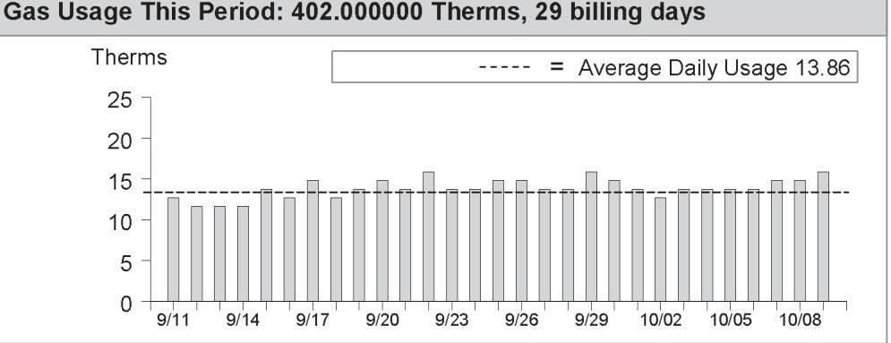

The image is a bar chart.

- **Chart Type**: Bar chart
- **Y-Axis Title**: Therms
- **X-Axis Labels**: Dates ranging from 9/11 to 10/08
- **Legend**: Dashed line labeled as "Average Daily Usage 13.86"
- **Data Points**: Bars representing daily therm usage, with values approximately ranging between 10 and 15 therms per day.
- **Notable Styling**: A dashed line across the chart indicates the average daily usage of 13.86 therms. The bars are uniformly styled in light gray.

This chart provides a **yearly usage breakdown (monthly-based)**, showing daily gas usage over the billing period with an average usage line for comparison.

| Service Information |  |
| :--: | :--: |
| Meter \# | 61448485 |
| Current Meter Reading | 1,343 |
| Prior Meter Reading | 963 |
| Difference | 380 |
| Multiplier | 1.059109 |
| Total Usage | 402.000000 Therm |
| Baseline Territory | X |
| Serial | Q |

Gas Procurement Costs (\$/Therm)
09/11/2024 - 09/30/2024 \$0.44232
10/01/2024 - 10/09/2024 \$0.35402

Details of COMMERCIAL ENERGY Gas Procurement Charges

09/11/2024 - 10/09/2024 (29 billing days)
Service For: 4950 CHERRY AVE
Service Agreement ID: 2078257404 ESP Customer Number: 2074678095

09/11/2024 - 10/09/2024

Rate Schedule: PGGPG24911
Gas Procurement
Gas Procurement

Thank You For Your Business!
UTILITY USERS TAX

## Total COMMERCIAL ENERGY Gas Procurement Charges

For questions regarding charges on this page, please contact:
COMMERCIAL ENERGY
7677 OAKPORT ST STE 525
OAKLAND CA 94621
1-510-567-2700

## Additional Messages

If you believe there is an error or have a question in your Gas Service Provider's gas procurement charges, please call your Gas Service Provider at the number listed on your bill. If you are not satisfied with their response, please contact the CPUC's Consumer Affairs Branch at 1-800-649-7570. If you have limitations hearing or speaking, a specially-trained Communications Assistant can relay telephone conversations for all of your calls. Dial 711 to reach the California Relay Service.

To avoid being returned to PG&E bundled service by COMMERCIAL ENERGY while you wait for the outcome of your complaint, specifically regarding the accuracy of your bill, mail a check or money order payable to "California Public Utilities Commission" for the disputed amount, along with a description of the dispute to: California Public Utilities Commission, Consumer Affairs Branch, 505 Van Ness Avenue, Room 2003, San Francisco CA 94102. COMMERCIAL ENERGY cannot turn off your service for nonpayment while your complaint is under review. However, you must continue to pay your current charges to avoid disconnection of your service. The CPUC will not accept the payment for the disputed amount if the complaint to CAB is not directly related to the accuracy of your bill and your payment will be returned.

Details of PG\&E Electric Delivery Charges
09/16/2024 - 10/14/2024 (29 billing days)
Service For: 4950 CHERRY AVE BLDG 14
Service Agreement ID: 2072403524 HSE LITES-BLDG 14
Rate Schedule: Time-of-Use (Peak Pricing 4 - 9 p.m. Every Day)

## 09/16/2024 - 09/30/2024

Baseline Allowance
Energy Charges
Peak
Off Peak
Baseline Credit
Generation Credit
Power Charge Indifference Adjustment
Franchise Fee Surcharge
San Jose Utility Users' Tax (5.000\%)
San Jose Franchise Surcharge

## 10/01/2024 - 10/14/2024

Baseline Allowance
Energy Charges
Peak
Off Peak
Baseline Credit
Generation Credit
Power Charge Indifference Adjustment
Franchise Fee Surcharge
San Jose Utility Users' Tax (5.000\%)
San Jose Franchise Surcharge

## 10/01/2024 - 10/14/2024

Baseline Allowance
Energy Charges
Peak
Off Peak
Baseline Credit
Generation Credit
Power Charge Indifference Adjustment
Franchise Fee Surcharge
San Jose Utility Users' Tax (5.000\%)
San Jose Franchise Surcharge

135.80 kWh (14 days $\times 9.7 \mathrm{kWh} /$ day)

16.654700 kWh @ $\$ 0.49378$
77.405600 kWh @ $\$ 0.46378$
94.060300 kWh @ -\$0.10117

## Total PG\&E Electric Delivery Charges

2018 Vintaged Power Charge Indifference Adjustment
Average Daily Usage (kWh / day)

| Last Year | Last Period | Current Period |
| :--: | :--: | :--: |
| 6.43 | 6.12 | 6.54 |

## Rate Identification Number

The image is a QR code. There are no additional details or embedded text visible in the image itself.

USCA-PGCC-0100-0000
www.pge.com/rin
To program your smart device, scan the QR code or enter the RIN code above and follow the on-screen instructions.

## Service Information

| Meter \# | 1006954050 |
| :-- | --: |
| Total Usage | 189.670000 kWh |
| Baseline Territory | X |
| Heat Source | B - Not Electric |
| Serial | Q |
| Rotating Outage Block | 50 |

## Additional Messages

You received a California Climate Credit on your electric bill. Learn how you can use these savings to further reduce your energy costs and help fight climate change at
cpuc.ca.gov/climatecredit.

Electric Usage This Period: 189.670000 kWh, 29 billing days
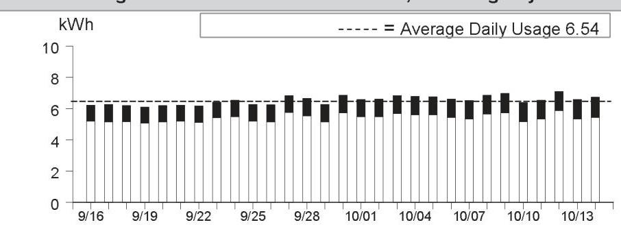

The image is a bar chart.

- **Chart Type**: Bar chart
- **X-Axis**: Dates ranging from 9/16 to 10/13
- **Y-Axis**: kWh (kilowatt-hours), ranging from 0 to 10
- **Legend**: Dashed line labeled as "Average Daily Usage 6.54"
- **Data Points**: Daily kWh usage is shown with bars for each date. The bars are mostly around the 6 kWh mark, with slight variations above and below.
- **Styling**: The average daily usage is indicated with a dashed line across the chart at approximately 6.54 kWh.

This chart provides a **yearly usage breakdown (monthly-based)**, showing daily electricity usage over the specified period.

|  |  |
| :-- | --: |
|  |  |
|  |  |
|  |  |
|  |  |
|  |  |
| Details of PG&E Electric Delivery Charges |  |
| (continued) |  |
| Service For: 4950 CHERRY AVE BLDG 14 |  |
| Service Agreement ID: 2072403524 HSE LITES-BLDG 14 |  |
| Adjustments |  |
| California Climate Credit | -$55.17 |
| CA Climate Credit City Franchise Surcharge Adjustment | -$0.17 |
| Total Adjustments | -$55.34 |
|  |  |
|  |  |
|  |  |
|  |  |
|  |  |
|  |  |
|  |  |
|  |  |
|  |  |
|  |  |
|  |  |

Details of San Jose Clean Energy Electric Generation Charges
09/16/2024 - 10/14/2024 (29 billing days)
Service For: 4950 CHERRY AVE BLDG 14
Service Agreement ID: 2078414368 ESP Customer Number: 2074678110
09/16/2024 - 10/14/2024

Rate Schedule: E-TOU-C
Generation - Off Peak - Winter $\quad 77.405600 \mathrm{kWh} \quad$ \$ 0.12542
\$9.71
Generation - Off Peak - Summer $\quad 79.607400 \mathrm{kWh} \quad$ \$ 0.12816
\$0.12816
Generation - On Peak - Winter $\quad 16.654700 \mathrm{kWh} \quad$ \$ 0.15209
\$0.15209
Generation - On Peak - Summer $\quad 16.002300 \mathrm{kWh} \quad$ \$ 0.21116
Net Charges 25.82
Local Utility Users Tax
1.29

Energy Commission Surcharge
0.06

Your service: GreenSource - SJCE's standard service with more renewable energy
For more detail on your San Jose Clean Energy bill, call us at 833-432-2454

## Total San Jose Clean Energy Electric Generation Charges

\$27.17

Rate Identification Number

The image is a photo of a QR code. There are no additional elements or text visible in the image.

USCA-XXSJ-0448-0000
www.pge.com/rin
To program your smart device, scan the QR code or enter the RIN code above and follow the on-screen instructions.

## Service Information

Total Usage
189.670000 kWh

For questions regarding charges on this page, please contact:
SAN JOSE CLEAN ENERGY
200 E SANTA CLARA ST
SAN JOSE CA 95113
1-833-432-2454
www.sanjosecleanenergy.org
info@SanJoseCleanEnergy.org

## Additional Messages

About San José Clean Energy (SJCE)
San José Clean Energy is a program of the City of San José and provides its residents and businesses with electricity from sources like solar, wind, and hydropower. SJCE offers the additional benefits of customer choice, community programs, local control, transparency, and accountability.

SJCE's standard electricity generation service, GreenSource, provides customers with more renewable power. SJCE also offers a 100\% renewable product, TotalGreen, for a small premium. Learn more.
www.SanJoseCleanEnergy.org/TotalGreen.

## Understanding SJCE Charges

SJCE replaces PG\&E Generation Charges. PG\&E continues to provide all electric delivery, billing, and gas services. Under PG\&E Electric Delivery Charges, note the Generation Credit. This is what PG\&E would have charged for power, and now credits back to you. The PG\&E Power Charge Indifference Adjustment and Franchise Fee are factored into SJCE's rate-setting. Learn more.
www.SanJoseCleanEnergy.org/Understandin g-Your-Bill.

SJ Cares is SJCE's program that allows customers enrolled in CARE or FERA financial assistance programs to receive cleaner energy at the lowest possible rates. Learn more: www.SanJoseCleanEnergy.org/Discount-Pro grams.

Please pay your SJCE charges directly to PG\&E (see page 1 of this bill). Do not send payment to San José Clean Energy.

Details of PG\&E Electric Delivery Charges
09/16/2024 - 10/14/2024 (29 billing days)
Service For: 4950 CHERRY AVE BLDG 13
Service Agreement ID: 2078066386 HSE MTR-LTS-BLDG 13
Rate Schedule: Time-of-Use (Peak Pricing 4 - 9 p.m. Every Day)
09/16/2024 - 09/30/2024

Baseline Allowance
Energy Charges
Peak
Off Peak
Baseline Credit
Generation Credit
Power Charge Indifference Adjustment
Franchise Fee Surcharge
San Jose Utility Users' Tax (5.000\%)
San Jose Franchise Surcharge

147.00 kWh (15 days $\times 9.8 \mathrm{kWh} /$ day)

| Peak | 93.305100 kWh | @ \$0.59342 | \$55.37 |
| :--: | :--: | :--: | :--: |
| Off Peak | 208.836700 kWh | @ \$0.49042 | 102.42 |
| Baseline Credit | 147.000000 kWh | @ - $\$ 0.09837$ | $-14.46$ |
| Generation Credit |  |  | $-50.21$ |
| Power Charge Indifference Adjustment |  |  | 2.89 |
| Franchise Fee Surcharge |  |  | 0.32 |
| San Jose Utility Users' Tax (5.000\%) |  |  | 4.80 |
| San Jose Franchise Surcharge |  |  | 0.29 |

10/01/2024 - 10/14/2024

| Baseline Allowance | 135.80 kWh | (14 days $\times 9.7 \mathrm{kWh} /$ day) |  |
| :-- | --: | :-- | --: |
| Energy Charges |  |  |  |
| Peak | 79.759200 kWh | @ $\$ 0.49378$ | $\$ 39.38$ |
| Off Peak | 192.087400 kWh | @ $\$ 0.46378$ | 89.09 |
| Baseline Credit | 135.800000 kWh | @ - $\$ 0.10117$ | $-13.74$ |
| Generation Credit |  |  | $-39.32$ |
| Power Charge Indifference Adjustment |  |  | 2.60 |
| Franchise Fee Surcharge |  |  | 0.29 |
| San Jose Utility Users' Tax (5.000\%) |  |  | 3.90 |
| San Jose Franchise Surcharge |  |  | 0.23 |

Total PG\&E Electric Delivery Charges
2018 Vintaged Power Charge Indifference Adjustment
Average Daily Usage (kWh / day)

| Last Year | Last Period | Current Period |
| :--: | :--: | :--: |
| 21.59 | 20.04 | 19.79 |

Rate Identification Number

The image is a photo of a QR code. There are no additional elements or text visible in the image.

USCA-PGCC-0100-0000
www.pge.com/rin
To program your smart device, scan the QR code or enter the RIN code above and follow the on-screen instructions.

Service Information
Meter \#
Total Usage
Baseline Territory
Heat Source
Serial
Rotating Outage Block
Additional Messages
You received a California Climate Credit on your electric bill. Learn how you can use these savings to further reduce your energy costs and help fight climate change at
cpuc.ca.gov/climatecredit.

Electric Usage This Period: 573.988400 kWh, 29 billing days
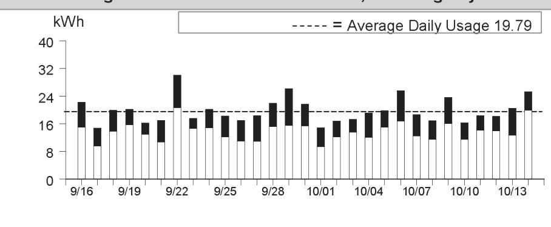

The image is a graph/chart.

- **Chart Type**: Bar chart
- **X-Axis**: Dates ranging from 9/16 to 10/13
- **Y-Axis**: kWh (kilowatt-hours), ranging from 0 to 40
- **Legend**: Dashed line labeled as "Average Daily Usage 19.79"
- **Data Points**: Daily kWh usage is represented by bars for each date. The height of each bar varies, with some days showing usage above or below the average daily usage line.
- **Styling**: The average daily usage is indicated by a dashed line across the chart at approximately 19.79 kWh. The bars are black and vary in height, indicating daily fluctuations in energy usage.
- **Yearly Usage Breakdown (Monthly-Based)**: The chart provides a visual representation of daily energy usage over a period of approximately one month.

|  |  |
| :-- | --: |
|  |  |
|  |  |
|  |  |
|  |  |
|  |  |
| Details of PG&E Electric Delivery Charges |  |
| (continued) |  |
| Service For: 4950 CHERRY AVE BLDG 13 |  |
| Service Agreement ID: 2078066386 HSE MTR-LTS-BLDG 13 |  |
| Adjustments |  |
| California Climate Credit | -$55.17 |
| CA Climate Credit City Franchise Surcharge Adjustment | -$0.17 |
| Total Adjustments | -$55.34 |
|  |  |
|  |  |
|  |  |
|  |  |
|  |  |
|  |  |
|  |  |
|  |  |
|  |  |
|  |  |
|  |  |

Details of San Jose Clean Energy Electric Generation Charges
09/16/2024 - 10/14/2024 (29 billing days)
Service For: 4950 CHERRY AVE BLDG 13
Service Agreement ID: 2079240479 ESP Customer Number: 2074678115
09/16/2024 - 10/14/2024

Rate Schedule: E-TOU-C
Generation - Off Peak - Winter $\quad 192.087400 \mathrm{kWh} \quad$ \$0.12542 \$24.09
Generation - Off Peak - Summer $\quad 208.836700 \mathrm{kWh} \quad$ \$0.12816 26.76
Generation - On Peak - Winter $\quad 79.759200 \mathrm{kWh} \quad$ \$0.15209 12.13
Generation - On Peak - Summer $\quad 93.305100 \mathrm{kWh} \quad$ \$0.21116 19.70

Local Utility Users Tax
4.13

Energy Commission Surcharge
Your service: GreenSource - SJCE's standard service with more renewable energy
For more detail on your San Jose Clean Energy bill, call us at 833-432-2454

## Total San Jose Clean Energy Electric Generation Charges

\$86.98

Rate Identification Number

The image is a photo of a QR code. There are no additional elements or text within the image itself.

USCA-XXSJ-0448-0000
www.pge.com/rin
To program your smart device, scan the QR code or enter the RIN code above and follow the on-screen instructions.

## Service Information

Total Usage
573.988400 kWh

For questions regarding charges on this page, please contact:
SAN JOSE CLEAN ENERGY
200 E SANTA CLARA ST
SAN JOSE CA 95113
1-833-432-2454
www.sanjosecleanenergy.org
info@SanJoseCleanEnergy.org

## Additional Messages

About San José Clean Energy (SJCE)
San José Clean Energy is a program of the City of San José and provides its residents and businesses with electricity from sources like solar, wind, and hydropower. SJCE offers the additional benefits of customer choice, community programs, local control, transparency, and accountability.

SJCE's standard electricity generation service, GreenSource, provides customers with more renewable power. SJCE also offers a 100\% renewable product, TotalGreen, for a small premium. Learn more.
www.SanJoseCleanEnergy.org/TotalGreen.

## Understanding SJCE Charges

SJCE replaces PG\&E Generation Charges. PG\&E continues to provide all electric delivery, billing, and gas services. Under PG\&E Electric Delivery Charges, note the Generation Credit. This is what PG\&E would have charged for power, and now credits back to you. The PG\&E Power Charge Indifference Adjustment and Franchise Fee are factored into SJCE's rate-setting. Learn more.
www.SanJoseCleanEnergy.org/Understandin g-Your-Bill.

SJ Cares is SJCE's program that allows customers enrolled in CARE or FERA financial assistance programs to receive cleaner energy at the lowest possible rates. Learn more: www.SanJoseCleanEnergy.org/Discount-Pro grams.

Please pay your SJCE charges directly to PG\&E (see page 1 of this bill). Do not send payment to San José Clean Energy.

Details of PG\&E Electric Delivery Charges
09/16/2024 - 10/14/2024 (29 billing days)
Service For: 4950 CHERRY AVE BLDG 9-B
Service Agreement ID: 2077272112 Bldg 11 Apt 9B
Rate Schedule: Time-of-Use (Peak Pricing 4 - 9 p.m. Every Day)

## 09/16/2024 - 09/30/2024

Baseline Allowance
Energy Charges
Peak
Off Peak
Baseline Credit
Generation Credit
Power Charge Indifference Adjustment
Franchise Fee Surcharge
San Jose Utility Users' Tax (5.000\%)
San Jose Franchise Surcharge

## 10/01/2024 - 10/14/2024

Baseline Allowance
Energy Charges
Peak
Off Peak
Baseline Credit
Generation Credit
Power Charge Indifference Adjustment
Franchise Fee Surcharge
San Jose Utility Users' Tax (5.000\%)
San Jose Franchise Surcharge

## 135.80 kWh (14 days $\times 9.7 \mathrm{kWh} /$ day)

$9.126700 \mathrm{kWh} \quad$ @ \$0.59342 \$5.42
41.121600 kWh @ \$0.49042 20.17
50.248300 kWh @-\$0.09837 -4.94
$7.82$
0.48
0.05
0.67
0.04

## 10/01/2024 - 10/14/2024

Baseline Allowance
Energy Charges
Peak
Off Peak
Baseline Credit
Generation Credit
Power Charge Indifference Adjustment
Franchise Fee Surcharge
San Jose Utility Users' Tax (5.000\%)
San Jose Franchise Surcharge

## Total PG\&E Electric Delivery Charges

2018 Vintaged Power Charge Indifference Adjustment
Average Daily Usage (kWh / day)

| Last Year | Last Period | Current Period |
| :--: | :--: | :--: |
| 3.39 | 3.10 | 3.37 |

Rate Identification Number

This is a QR code. It is a type of matrix barcode that can be scanned using a smartphone or QR code reader to access information or a website. There is no visible text or additional information embedded within the image itself.

USCA-PGCC-0100-0000
www.pge.com/rin
To program your smart device, scan the QR code or enter the RIN code above and follow the on-screen instructions.

## Service Information

| Meter \# | 1010272393 |
| :-- | --: |
| Total Usage | 97.599300 kWh |
| Baseline Territory | X |
| Heat Source | B - Not Electric |
| Serial | Q |
| Rotating Outage Block | 50 |

## Additional Messages

You received a California Climate Credit on your electric bill. Learn how you can use these savings to further reduce your energy costs and help fight climate change at
cpuc.ca.gov/climatecredit.

Electric Usage This Period: 97.599300 kWh, 29 billing days
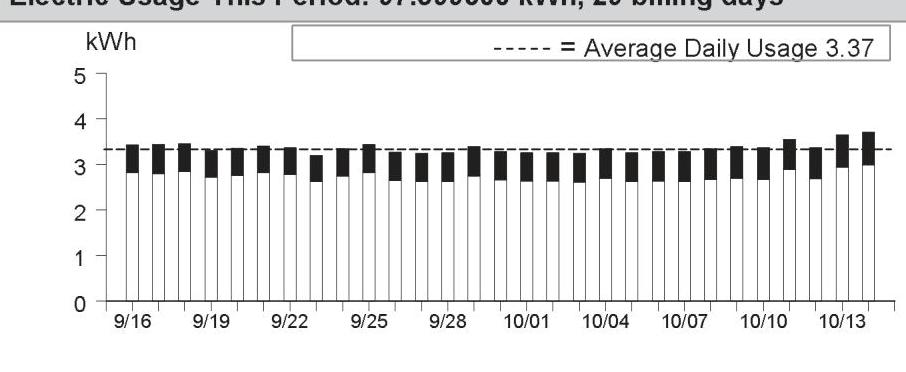

The image is a bar chart.

- **Chart Type**: Bar chart
- **X-Axis**: Dates from 9/16 to 10/14
- **Y-Axis**: kWh (kilowatt-hours)
- **Legend**: "----- = Average Daily Usage 3.37"
- **Data Points**: Each bar represents daily kWh usage, with values mostly around 3 to 4 kWh.
- **Styling**: The average daily usage is indicated by a dashed line at 3.37 kWh.
- **Yearly Usage Breakdown (Monthly-Based)**: The chart shows daily energy usage over a period of approximately one month.

|  |  |
| :-- | --: |
|  |  |
|  |  |
|  |  |
|  |  |
|  |  |
| Details of PG&E Electric Delivery Charges |  |
| (continued) |  |
| Service For: 4950 CHERRY AVE BLDG 9-B |  |
| Service Agreement ID: 2077272112 Bldg 11 Apt 9B |  |
| Adjustments |  |
| California Climate Credit | -$55.17 |
| CA Climate Credit City Franchise Surcharge Adjustment | -$0.17 |
| Total Adjustments | -$55.34 |
|  |  |
|  |  |
|  |  |
|  |  |
|  |  |
|  |  |
|  |  |
|  |  |
|  |  |
|  |  |
|  |  |
|  |  |
|  |  |
|  |  |
|  |  |
|  |  |
|  |  |
|  |  |
|  |  |
|  |  |
|  |  |
|  |  |
|  |  |
|  |  |
|  |  |
|  |  |
|  |  |
|  |  |
|  |  |
|  |  |
|  |  |
|  |  |
|  |  |
|  |  |
|  |  |
|  |  |
|  |  |
|  |  |
|  |  |
|  | 

Details of San Jose Clean Energy Electric Generation Charges
09/16/2024 - 10/14/2024 (29 billing days)
Service For: 4950 CHERRY AVE BLDG 9-B
Service Agreement ID: 2070336970 ESP Customer Number: 2074678135
09/16/2024 - 10/14/2024

Rate Schedule: E-TOU-C
Generation - Off Peak - Winter
38.080000 kWh @ \$0.12542
\$4.78
Generation - Off Peak - Summer
41.121600 kWh @ \$0.12816
5.27

Generation - On Peak - Winter
9.271000 kWh @ \$0.15209
1.41

Generation - On Peak - Summer
9.126700 kWh @ \$0.21116
Net Charges 13.39
Local Utility Users Tax
0.67

Energy Commission Surcharge
0.03

Your service: GreenSource - SJCE's standard service with more renewable energy
For more detail on your San Jose Clean Energy bill, call us at 833-432-2454

## Total San Jose Clean Energy Electric Generation Charges

\$14.09

Rate Identification Number

The image is a photo of a QR code. There is no additional text or elements present in the image.

USCA-XXSJ-0448-0000
www.pge.com/rin
To program your smart device, scan the QR code or enter the RIN code above and follow the on-screen instructions.

## Service Information

Total Usage
97.599300 kWh

For questions regarding charges on this page, please contact:
SAN JOSE CLEAN ENERGY
200 E SANTA CLARA ST
SAN JOSE CA 95113
1-833-432-2454
www.sanjosecleanenergy.org
info@SanJoseCleanEnergy.org

## Additional Messages

About San José Clean Energy (SJCE)
San José Clean Energy is a program of the City of San José and provides its residents and businesses with electricity from sources like solar, wind, and hydropower. SJCE offers the additional benefits of customer choice, community programs, local control, transparency, and accountability.

SJCE's standard electricity generation service, GreenSource, provides customers with more renewable power. SJCE also offers a 100\% renewable product, TotalGreen, for a small premium. Learn more.
www.SanJoseCleanEnergy.org/TotalGreen.

## Understanding SJCE Charges

SJCE replaces PG\&E Generation Charges. PG\&E continues to provide all electric delivery, billing, and gas services. Under PG\&E Electric Delivery Charges, note the Generation Credit. This is what PG\&E would have charged for power, and now credits back to you. The PG\&E Power Charge Indifference Adjustment and Franchise Fee are factored into SJCE's rate-setting. Learn more.
www.SanJoseCleanEnergy.org/Understandin g-Your-Bill.

SJ Cares is SJCE's program that allows customers enrolled in CARE or FERA financial assistance programs to receive cleaner energy at the lowest possible rates. Learn more: www.SanJoseCleanEnergy.org/Discount-Pro grams.

Please pay your SJCE charges directly to PG\&E (see page 1 of this bill). Do not send payment to San José Clean Energy.

Details of PG\&E Gas Delivery Charges
09/20/2024 - 10/18/2024 (29 billing days)
Service For: 4950 CHERRY AVE
Service Agreement ID: 2074678150 REC RM BOIL \#2,14,16
Rate Schedule: GM X Master-Metered Multi-Family Service
Number of Dwelling Units: 33
09/20/2024 - 09/30/2024

| Tier 1 Allowance | 156.09000 | Therm |
| :-- | --: | --: |
| Tier 1 Usage | 156.090000 | Therm |
| Tier 2 Usage | 1.703103 | Therm |
| Gas Procurement Credit ${ }^{1}$ |  | -69.79 |
| Franchise Fee Surcharge |  | 0.06 |
| Gas PPP Surcharge (\$0.11051 /Therm) |  | 17.43 |
| San Jose Utility Users' Tax (5.000\%) |  | 15.43 |
| San Jose Franchise Surcharge |  | 0.93 |

10/01/2024 - 10/18/2024

| Tier 1 Allowance | 255.42000 | Therm |
| :-- | --: | --: |
| Tier 1 Usage | 255.420000 | Therm |
| Tier 2 Usage | 2.786897 | Therm |
| Gas Procurement Credit ${ }^{1}$ |  | -91.41 |
| Franchise Fee Surcharge |  | 0.23 |
| Gas PPP Surcharge (\$0.11051 /Therm) |  | 28.53 |
| San Jose Utility Users' Tax (5.000\%) |  | 25.24 |
| San Jose Franchise Surcharge |  | 1.51 |

Total PG\&E Gas Delivery Charges
\$902.77
${ }^{1}$ Credits you for the PG\&E Gas Usage charge that otherwise would have been included in this rate

Average Daily Usage (Therms / day)

| Last Year | Last Period | Current Period |
| :--: | :--: | :--: |
| 15.60 | 14.23 | 14.34 |

Gas Usage This Period: 416.000000 Therms, 29 billing days
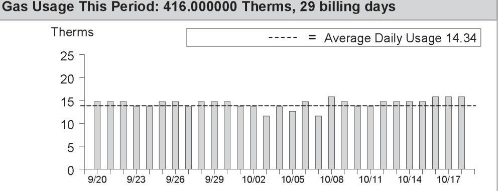

The image is a bar chart.

- **Chart Type**: Bar chart
- **X-Axis**: Dates ranging from 9/20 to 10/17
- **Y-Axis**: Therms, ranging from 0 to 25
- **Legend**: Dashed line represents "Average Daily Usage 14.34"
- **Data Points**: Bars represent daily therm usage, mostly around 14 therms per day, with slight variations.
- **Styling**: The average daily usage is highlighted with a dashed line across the chart at approximately 14.34 therms.

This chart provides a **yearly usage breakdown (monthly-based)** for the specified billing period.

[^0]
[^0]:    Visit www.pge.com/MyEnergy for a detailed bill comparison.

Details of COMMERCIAL ENERGY Gas Procurement Charges

09/20/2024 - 10/18/2024 (29 billing days)
Service For: 4950 CHERRY AVE
Service Agreement ID: 2074246024 ESP Customer Number: 2074678150

09/20/2024 - 10/18/2024

Rate Schedule: PGGPG24911
Gas Procurement 157.793130Therms @ $50.77800
Gas Procurement 258.206870Therms @ $50.77800
TOTAL NET CHARGES 323.65

Thank You For Your Business! UTILITY USERS TAX

## Total COMMERCIAL ENERGY Gas Procurement Charges

For questions regarding charges on this page, please contact:
COMMERCIAL ENERGY
7677 OAKPORT ST STE 525
OAKLAND CA 94621
1-510-567-2700

## Additional Messages

If you believe there is an error or have a question in your Gas Service Provider's gas procurement charges, please call your Gas Service Provider at the number listed on your bill. If you are not satisfied with their response, please contact the CPUC's Consumer Affairs Branch at 1-800-649-7570. If you have limitations hearing or speaking, a specially-trained Communications Assistant can relay telephone conversations for all of your calls. Dial 711 to reach the California Relay Service.

To avoid being returned to PG&E bundled service by COMMERCIAL ENERGY while you wait for the outcome of your complaint, specifically regarding the accuracy of your bill, mail a check or money order payable to "California Public Utilities Commission" for the disputed amount, along with a description of the dispute to: California Public Utilities Commission, Consumer Affairs Branch, 505 Van Ness Avenue, Room 2003, San Francisco CA 94102. COMMERCIAL ENERGY cannot turn off your service for nonpayment while your complaint is under review. However, you must continue to pay your current charges to avoid disconnection of your service. The CPUC will not accept the payment for the disputed amount if the complaint to CAB is not directly related to the accuracy of your bill and your payment will be returned.

## Important Messages (continued from page 1)

Winter electric baseline season: The winter electric baseline season began on Oct 1. The total electric baseline quantities shown in your energy statement were calculated using daily winter baseline quantities. Any billing days in the billing period prior to Oct 1 were calculated with summer baseline quantities.

The Family Electric Rate Assistance (FERA) Program provides a monthly discount on electric bills for income-qualified households of three or more persons. To see if you qualify, please call 1-800-PGE-5000 or apply online at www.pge.com/fera.

El Programa FERA ofrece ahorros mensuales sólo en las facturas de electricidad a hogares de ingresos económicos bajos y medianos con tres o más personas. Para determinar si califica, por favor llame al 1-800-PGE-5000 o puede aplicar a través de nuestra página web www.pge.com/fera.

Energy Savings Assistance Program: provides free home improvements to help keep your home more energy efficient, safe and comfortable. Apply by answering a few simple questions at www.pge.com/energysavings or call 1-800-989-9744.

Programa Energy Savings Assistance: proporciona mejoras al hogar sin costo para ayudar a que este sea más eficiente en el consumo de energía, más seguro y más cómodo. Solicite respondiendo a unas pocas preguntas simples en www.pge.com/ahorreenergia o llamando al 1-800-989-9744.

| Your Electric Charges Breakdown (from page 2) |  |
| :--: | :--: |
| Conservation Incentive | - $\$ 27.63$ |
| Transmission | 174.03 |
| Distribution | 771.70 |
| Electric Public Purpose Programs | 101.20 |
| Nuclear Decommissioning | $-9.93$ |
| Wildfire Fund Charge | 21.46 |
| Recovery Bond Charge | 24.84 |
| Recovery Bond Credit | $-24.84$ |
| Wildfire Hardening Charge | 18.86 |
| Competition Transition Charges (CTC) | 3.88 |
| Energy Cost Recovery Amount | $-0.08$ |
| PCIA | 36.59 |
| Taxes and Other | 61.83 |
| Total Electric Charges | \$1,151.91 |

