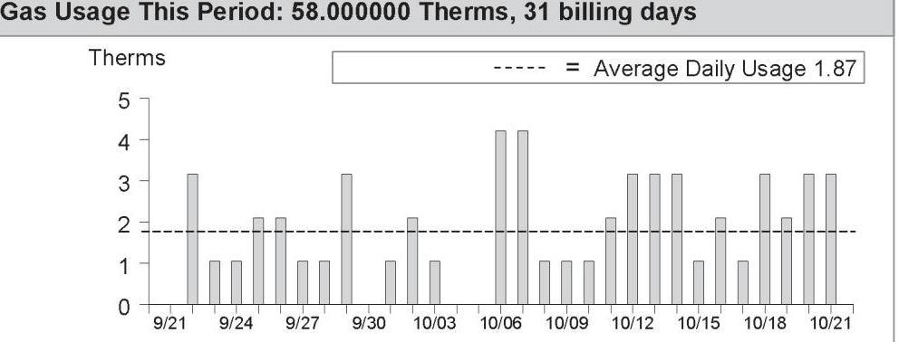
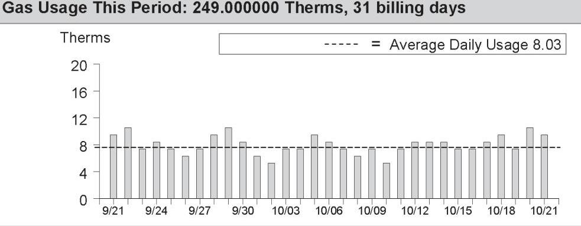

## Service For:

ARCADIA MANAGEMENT SERVICES CO Please see details page.

## Questions about your bill?

Business Specialist available:
Mon-Fri: 7am to 6pm
$1-800-468-4743$
www.pge.com/MyEnergy

## Ways To Pay

www.pge.com/waystopay

| Vendor \# | 375 |  |
| :-- | :-- | :-- |
| Date Paid | $11 / 08 / 24$ | Ext NM |
| Prop | Amount | Account |
| wdsc | $\$ \quad(178.48)$ | $57001-002$ |
| wdsc | $\$ \quad 1,340.17$ | $57003-000$ |

## Your Account Summary

Amount Due on Previous Statement \$1,345.12
Payment(s) Received Since Last Statement -1,345.12
Previous Unpaid Balance $\$ 0.00$
Current PG\&E Electric Delivery Charges \$42.88
Electric Adjustments -221.36
San Jose Clean Energy Electric Generation Charges 752.10
Current Gas Charges 588.07
Total Amount Due by 11/15/2024 \$1,161.69

| Monthly Billing History |  |
| :--: | :--: |
| \$15000 |  |
| \$11250 |  |
| \$7500 |  |
| \$3750 |  |
| \$0 |  |
| 2023 | 10211204162261361329562663628661800 9/27 10232024 |
|  |  |
|  |  |
| Visit www.pge.com/MyEnergy for a detailed bill comparison |  |

Please return this portion with your payment. No staples or paper clips. Do not fold. Thank you.

99909067281248500001383050000116169

Account Number: Due Date: 9067281248-5 11/15/2024

Total Amount Due: \$1,161.69

Amount Enclosed: $\$$
$\$$

ARCADIA MANAGEMENT SERVICES CO
PO BOX 5368
SAN JOSE, CA 95150-5368

PG\&E
BOX 997300
SACRAMENTO, CA 95899-7300

Important Phone Numbers - Monday-Friday 7 a.m.-7 p.m., Saturday 8 a.m.-5 p.m.

# Customer Service (All Languages; Relay Calls Accepted) 1-800-743-5000 

TTY 7-1-1

Servicio al Cliente en Español (Spanish) 1-800-660-6789
華語客戶服務 (Chinese) 1-800-893-9555

## Rules and rates

You may be eligible for a lower rate. Find out about optional rates or view a complete list of rules and rates, visit www.pge.com or call 1-800-743-5000.
If you believe there is an error on your bill, please call 1-800-743-5000 to speak with a representative. If you are not satisfied with our response, contact the California Public Utilities Commission (CPUC), Consumer Affairs Branch (CAB), 505 Van Ness Avenue, Room 2003, San Francisco, CA 94102, 1-800-649-7570 or 7-1-1 (8:30 AM to 4:30 PM, Monday through Friday) or by visiting www.cpuc.ca.gov/complaints/.
To avoid having service turned off while you wait for the outcome of a complaint to the CPUC specifically regarding the accuracy of your bill, please contact CAB for assistance. If your case meets the eligibility criteria, CAB will provide you with instructions on how to mail a check or money order to be impounded pending resolution of your case. You must continue to pay your current charges while your complaint is under review to keep your service turned on.
If you are not able to pay your bill, call PG\&E to discuss how we can help. You may qualify for reduced rates under PG\&E's CARE program or other special programs and agencies may be available to assist you. You may qualify for PG\&E's Energy Savings Assistance Program which is an energy efficiency program for income-qualified residential customers.

## Important definitions

Rotating outage blocks are subject to change without advance notice due to operational conditions.
Demand charge: Many non-residential rates include a demand charge. Demand is a measurement of the highest usage of electricity in any single fifteen (or sometimes five) minute period during a monthly billing cycle. Demand is measured in kilowatts (or kW). High demand is usually associated with equipment start-up. By spreading equipment start-ups over a longer period of time, you may be able to lower demand and reduce your demand charges.
Time-of-use electric prices are higher every day during afternoons and evenings, and lower at other times of the day. Prices also change by season, with higher prices in the summer and lower prices in the winter.
Wildfire Fund Charge: Charge on behalf of the State of California Department of Water Resources (DWR) to fund the California Wildfire Fund. For usage prior to October 1, 2020, this charge included costs related to the 2001 California energy crisis, also collected on behalf of the DWR. These charges belong to DWR, not PG\&E.

Dich vu khách tiếng Việt (Vietnamese) 1-800-298-8438
Business Customer Service 1-800-468-4743

Power Charge Indifference Adjustment (PCIA): The PCIA is a charge to ensure that both PG\&E customers and those who have left PG\&E service to purchase electricity from other providers pay for the above market costs for electric generation resources that were procured by PG\&E on their behalf. 'Above market' refers to the difference between what the utility pays for electric generation and current market prices for the sale of those resources. Visit www.pge.com/cca.
Wildfire Hardening Charge: PG\&E has been permitted to issue bonds that enable it to recover more quickly certain costs related to preventing and mitigating catastrophic wildfires, while reducing the total cost to its customers. Your bill for electric service includes a fixed recovery charge called the Wildfire Hardening Charge that has been approved by the CPUC to repay those bonds. The right to recover the Wildfire Hardening Charge has been transferred to a separate entity (called the Special Purpose Entity) that issued the bonds and does not belong to PG\&E. PG\&E is collecting the Wildfire Hardening Charge on behalf of the Special Purpose Entity. For details visit: www.pge.com/tariffs/assets/pdf/tariffbook/ELEC_PRELIM_JF.pdf.
Recovery Bond Charge/Credit: Your bill for electric service includes a charge that has been approved by the CPUC to repay bonds issued for certain costs related to catastrophic wildfires. The Recovery Bond Charge (RBC) rate is currently $\$ 0.00650$ per kWh. PG\&E has also contributed certain amounts to a trust fund which is used to provide a customer credit equal to $\$ 0.00650$ per kWh (Recovery Bond Credit). The right to recover the RBC has been transferred to one or more Special Purpose Entities that issued the bonds and does not belong to PG\&E. PG\&E is collecting that portion of the RBC on behalf of the Special Purpose Entities.
Gas Public Purpose Program (PPP) Surcharge. Used to fund state-mandated gas assistance programs for low-income customers, energy efficiency programs, and public-interest research and development.

Visit www.pge.com/billexplanation for more definitions. To view most recent bill inserts including legal or mandated notices, visit www.pge.com/billinserts.

[^0]
## Update My Information (English Only)

Please allow 1-2 billing cycles for changes to take effect

## Account Number: 9067281248-5

Change my mailing address to: $\qquad$

| City | State | ZIP code |
| :-- | :-- | :-- |
| Primary | Primary |  |
| Phone | Email |  |

## Ways To Pay

- Online via web or mobile at www.pge.com/waystopay
- By mail: Send your payment along with this payment stub in the envelope provided.
- By debit card, Visa, MasterCard, American Express, or Discover: Call 877-704-8470 at any time. (Our independent service provider charges a fee per transaction.)
- At a neighborhood payment center: To find a neighborhood payment center near you, please visit www.pge.com or call 800-743-5000. Please bring a copy of your bill with you.

[^0]:    "PG\&E" refers to Pacific Gas and Electric Company, a subsidiary of PG\&E Corporation, © 2024 Pacific Gas and Electric Company. All rights reserved.
    Please do not mark in box. For system use only.

# Summary of your energy related services 

|  | Meter Number | Usage | Amount |
| :--: | :--: | :--: | :--: |
| Service For: 4100 THE WOODS DR BLDG 2 |  |  |  |
| Service Agreement ID: 9068860984 |  |  |  |
| PG\&E Electric Delivery Charges | 1009180358 | 338.000000 kWh | $\$ 10.72$ |
| Electric Adjustments |  |  | $-55.34$ |
| Service Agreement ID: 9065700298 |  |  |  |
| SAN JOSE CLEAN ENERGY Electric Generation |  | 338.000000 kWh | \$30.37 |
| Total |  |  | - $\$ 14.25$ |
| Service For: 4100 THE WOODS DR BLDG 2 |  |  |  |
| Service Agreement ID: 9061037672 |  |  |  |
| Gas Charges | 61531690 | 58.000000 Therm | \$115.04 |
| Total |  |  | \$115.04 |
| Service For: 4100 THE WOODS DR |  |  |  |
| Service Agreement ID: 9064468507 |  |  |  |
| PG\&E Electric Delivery Charges | 1009857050 | 4,572.000000 kWh | $\$ 10.72$ |
| Electric Adjustments |  |  | $-55.34$ |
| Service Agreement ID: 9063947823 |  |  |  |
| SAN JOSE CLEAN ENERGY Electric Generation |  | 4,572.000000 kWh | $\$ 639.41$ |
| Service Agreement ID: 9067363311 |  |  |  |
| Gas Charges | 813976C | 249.000000 Therm | \$473.03 |
| Total |  |  | \$1,067.82 |
| Service For: 4100 THE WOODS DR BLDG 6 |  |  |  |
| Service Agreement ID: 9063149813 |  |  |  |
| PG\&E Electric Delivery Charges | 1009180366 | 317.000000 kWh | $\$ 10.72$ |
| Electric Adjustments |  |  | $-55.34$ |
| Service Agreement ID: 9063432387 |  |  |  |
| SAN JOSE CLEAN ENERGY Electric Generation |  | 317.000000 kWh | $\$ 44.43$ |
| Total |  |  | - $\$ 0.19$ |
| Service For: 4100 THE WOODS DR BLDG 4 |  |  |  |
| Service Agreement ID: 9060786125 |  |  |  |
| PG\&E Electric Delivery Charges | 1009180403 | 272.000000 kWh | $\$ 10.72$ |
| Electric Adjustments |  |  | $-55.34$ |
| Service Agreement ID: 9064673479 |  |  |  |
| SAN JOSE CLEAN ENERGY Electric Generation |  | 272.000000 kWh | $\$ 37.89$ |
| Total |  |  | - $\$ 6.73$ |

Details of PG\&E Electric Delivery Charges
09/20/2024 - 10/20/2024 (31 billing days)
Service For: 4100 THE WOODS DR BLDG 2
Service Agreement ID: 9058860984
09/20/2024 - 10/20/2024
Rate Schedule: NEM2AA
Rate Description: NEMA Aggregated Account
Net Charges
$\$ 10.18$
San Jose Utility Users' Tax
0.51

San Jose Franchise Surcharge
Total PG\&E Electric Delivery Charges
2018 Vintaged Power Charge Indifference Adjustment
Average Daily Usage (kWh / day)

| Last Year | Last Period | Current Period |
| :--: | :--: | :--: |
| -0.03 | 2.40 | 10.90 |

## Adjustments

CA Climate Credit
CA Climate Credit City Franchise Surcharge Adj
Total Adjustments
$\$ 55.17$
$\sim 0.17$

## Rate Identification Number

The image is a QR code. There is no additional text or information embedded within the image itself.

USCA-PGCC-0600-0000
www.pge.com/rin
To program your smart device, scan the QR code or enter the RIN code above and follow the on-screen instructions.

Service Information
Meter \#
Total Usage
Serial
Rotating Outage Block
1009180358
338.000000 kWh
Z
50

## Additional Messages

CA Climate Credit -
You received a Climate Credit on this month's electric bill. For more information about this California Climate Credit, visit
www.cpuc.ca.gov/smallbusinessclimatecredit
Visit www.pge.com/guidenema to get your guide to Net Energy Metering Aggregation billing.

Details of San Jose Clean Energy Electric Generation Charges
09/20/2024 - 10/20/2024 (31 billing days)
Service For: 4100 THE WOODS DR BLDG 2
Service Agreement ID: 9065700298 ESP Customer Number: 9068860984
09/20/2024 - 10/20/2024

## Rate Schedule: NEM B-1

| Generation - Off Peak - Winter | 109.000000 | kWh | (1) \$0.12629 | \$13.77 |
| :--: | :--: | :--: | :--: | :--: |
| Generation - Off Peak - Summer | 4.000000 | kWh | (1) \$0.12771 | 0.51 |
| Generation - On Peak - Winter | 162.000000 | kWh | (1) $\$ 0.14340$ | 23.23 |
| Generation - Part Peak - Summer | $-3.000000$ | kWh | (1) $\$ 0.14978$ | $-0.45$ |
| Generation - On Peak - Summer | 66.000000 | kWh | (1) $\$ 0.20200$ | 13.33 |
|  |  | Net Charges | 50.39 |  |
| Local Utility Users Tax |  |  |  | 2.52 |
| Energy Commission Surcharge |  |  |  | 0.10 |
| Charged to NEM Balance |  |  |  | $-22.64$ |
| Your NEM Credit balance is $\$ 0.00$. |  |  |  |  |
| Your cumulative kWh relevant period year-to-date: -112 kWh |  |  |  |  |
| Your service: GreenSource - SJCE's standard service with more renewable energy |  |  |  |  |
| For more detail on your San Jose Clean Energy bill, call us at 833-432-2454 |  |  |  |  |

Total San Jose Clean Energy Electric Generation Charges
\$30.37

## Rate Identification Number

The image is a photo of a QR code. There is no additional text or elements visible within the image itself.

USCA-XXSJ-0169-0000
www.pge.com/rin
To program your smart device, scan the QR code or enter the RIN code above and follow the on-screen instructions.

For questions regarding charges on this page, please contact:
SAN JOSE CLEAN ENERGY
200 E SANTA CLARA ST
SAN JOSE CA 95113
1-833-432-2454
www.sanjosecleanenergy.org
info@SanJoseCleanEnergy.org

## Additional Messages

About San José Clean Energy (SJCE)
San José Clean Energy is a program of the City of San José and provides its residents and businesses with electricity from sources like solar, wind, and hydropower. SJCE offers the additional benefits of customer choice, community programs, local control, transparency, and accountability.

SJCE's standard electricity generation service, GreenSource, provides customers with more renewable power. SJCE also offers a 100\% renewable product, TotalGreen, for a small premium. Learn more.
www.SanJoseCleanEnergy.org/TotalGreen.

## Understanding SJCE Charges

SJCE replaces PG\&E Generation Charges. PG\&E continues to provide all electric delivery, billing, and gas services. Under PG\&E Electric Delivery Charges, note the Generation Credit. This is what PG\&E would have charged for power, and now credits back to you. The PG\&E Power Charge Indifference Adjustment and Franchise Fee are factored into SJCE's rate-setting. Learn more.
www.SanJoseCleanEnergy.org/Understandin g-Your-Bill.

SJ Cares is SJCE's program that allows customers enrolled in CARE or FERA financial assistance programs to receive cleaner energy at the lowest possible rates. Learn more: www.SanJoseCleanEnergy.org/Discount-Pro grams.

Please pay your SJCE charges directly to PG\&E (see page 1 of this bill). Do not send payment to San José Clean Energy.

## Details of Gas Charges

## 09/21/2024 - 10/21/2024 (31 billing days)

Service For: 4100 THE WOODS DR BLDG 2
Service Agreement ID: 9061037672
Rate Schedule: GNR1 Gas Service to Small Commercial Customers

## 09/21/2024 - 09/30/2024

Customer Charge
Gas Charges
First 4,000 Therm
Gas Mobile Home Park Surcharge $\$ 0.00000$
Gas PPP Surcharge (\$0.09693 /Therm)
San Jose Utility Users' Tax (5.000\%)
San Jose Franchise Surcharge

## 10/01/2024 - 10/21/2024

Customer Charge
Gas Charges
First 4,000 Therm
Gas Mobile Home Park Surcharge $\$ 0.00000$
Gas PPP Surcharge (\$0.09693 /Therm)
San Jose Utility Users' Tax (5.000\%)
San Jose Franchise Surcharge

## Total Gas Charges

Average Daily Usage (Therms / day)

| Last Year | Last Period | Current Period |
| :--: | :--: | :--: |
| 2.25 | 1.47 | 1.87 |

## Service Information

| Meter \# | 61531690 |
| :-- | --: |
| Current Meter Reading | 1,886 |
| Prior Meter Reading | 1,831 |
| Difference | 55 |
| Multiplier | 1.054329 |
| Total Usage | 58.000000 Therm |
| Serial | Z |

Gas Procurement Costs (\$/Therm)
09/21/2024 - 09/30/2024 \$0.40301
10/01/2024 - 10/21/2024 \$0.31389

## Additional Messages

Customer Charge To help deliver safe, reliable and affordable gas service to your business, PG\&E charges a customer fee which is based on your highest average daily gas usage within the past 12 months. For the billing period ending on 05/22/2024, your highest average daily gas usage was 2.7 therms.

## Gas Usage This Period: 58.000000 Therms, 31 billing days

The image is a bar chart.

- **Chart Type**: Bar chart
- **Title**: Gas Usage This Period: 58.000000 Therms, 31 billing days
- **Y-Axis Title**: Therms
- **X-Axis Labels**: Dates from 9/21 to 10/21
- **Legend**: Dashed line labeled as "Average Daily Usage 1.87"
- **Data Points**: Bars representing daily therm usage, with a dashed line indicating the average daily usage of 1.87 therms.
- **Notable Styling**: The average daily usage is highlighted with a dashed line across the chart. Bars vary in height, indicating fluctuations in daily usage.

Details of PG\&E Electric Delivery Charges
09/20/2024 - 10/20/2024 (31 billing days)
Service For: 4100 THE WOODS DR
Service Agreement ID: 9064468507
09/20/2024 - 10/20/2024

Rate Schedule: NEM2AA
Rate Description: NEMA Aggregated Account
Net Charges
$\$ 10.18$
San Jose Utility Users' Tax
0.51

San Jose Franchise Surcharge
0.03

Total PG\&E Electric Delivery Charges
2018 Vintaged Power Charge Indifference Adjustment
Average Daily Usage (kWh / day)

| Last Year | Last Period | Current Period |
| :--: | :--: | :--: |
| 165.41 | 160.90 | 147.48 |

## Adjustments

CA Climate Credit
CA Climate Credit City Franchise Surcharge Adj
Total Adjustments
$\$ 55.17$
$\begin{array}{r}\text {- $\$ 55.17}$ } \\ \text {-0.17 }\end{array}$
$\qquad$
$\qquad$

## Rate Identification Number

The image is a photo of a QR code. There are no additional elements or text visible in the image.

USCA-PGCC-0700-0000
www.pge.com/rin
To program your smart device, scan the QR code or enter the RIN code above and follow the on-screen instructions.

Service Information
Meter \#
Total Usage
Serial
Rotating Outage Block
1009857050
4,572.000000 kWh
Z
50

## Additional Messages

CA Climate Credit -
You received a Climate Credit on this month's electric bill. For more information about this California Climate Credit, visit
www.cpuc.ca.gov/smallbusinessclimatecredit
Visit www.pge.com/guidenema to get your guide to Net Energy Metering Aggregation billing.

Details of San Jose Clean Energy Electric Generation Charges
09/20/2024 - 10/20/2024 (31 billing days)
Service For: 4100 THE WOODS DR
Service Agreement ID: 9063947823 ESP Customer Number: 9064468507
09/20/2024 - 10/20/2024

## Rate Schedule: NEM B-6

Generation - Off Peak - Winter
Generation - Off Peak - Summer
Generation - On Peak - Winter
Generation - On Peak - Summer

Local Utility Users Tax
Energy Commission Surcharge
Your NEM Balance Owed is $\$ 0.00$.
Your cumulative kWh relevant period year-to-date: 125513 kWh
Your service: GreenSource - SJCE's standard service with more renewable energy
For more detail on your San Jose Clean Energy bill, call us at 833-432-2454

## Total San Jose Clean Energy Electric Generation Charges

\$639.41

## Rate Identification Number

The image is a QR code. There are no additional elements or text visible in the image.

USCA-XXSJ-0307-0000
www.pge.com/rin
To program your smart device, scan the QR code or enter the RIN code above and follow the on-screen instructions.

## Service Information

For questions regarding charges on this page, please contact:
SAN JOSE CLEAN ENERGY
200 E SANTA CLARA ST
SAN JOSE CA 95113
1-833-432-2454
www.sanjosecleanenergy.org
info@SanJoseCleanEnergy.org

## Additional Messages

About San José Clean Energy (SJCE)
San José Clean Energy is a program of the City of San José and provides its residents and businesses with electricity from sources like solar, wind, and hydropower. SJCE offers the additional benefits of customer choice, community programs, local control, transparency, and accountability.

SJCE's standard electricity generation service, GreenSource, provides customers with more renewable power. SJCE also offers a 100\% renewable product, TotalGreen, for a small premium. Learn more.
www.SanJoseCleanEnergy.org/TotalGreen.

## Understanding SJCE Charges

SJCE replaces PG\&E Generation Charges. PG\&E continues to provide all electric delivery, billing, and gas services. Under PG\&E Electric Delivery Charges, note the Generation Credit. This is what PG\&E would have charged for power, and now credits back to you. The PG\&E Power Charge Indifference Adjustment and Franchise Fee are factored into SJCE's rate-setting. Learn more.
www.SanJoseCleanEnergy.org/Understandin g-Your-Bill.

SJ Cares is SJCE's program that allows customers enrolled in CARE or FERA financial assistance programs to receive cleaner energy at the lowest possible rates. Learn more: www.SanJoseCleanEnergy.org/Discount-Pro grams.

Please pay your SJCE charges directly to PG\&E (see page 1 of this bill). Do not send payment to San José Clean Energy.

## Details of Gas Charges

## 09/21/2024 - 10/21/2024 (31 billing days)

Service For: 4100 THE WOODS DR
Service Agreement ID: 9067363311
Rate Schedule: GNR1 Gas Service to Small Commercial Customers

## 09/21/2024 - 09/30/2024

Customer Charge
Gas Charges
First 4,000 Therms/month
Gas Mobile Home Park Surcharge $\$ 0.00000$
Gas PPP Surcharge (\$0.09693 /Therm)
San Jose Utility Users' Tax (5.000\%)
San Jose Franchise Surcharge
$10 / 01 / 2024-10 / 21 / 2024$
Customer Charge
Gas Charges
First 4,000 Therms/month
Gas Mobile Home Park Surcharge $\$ 0.00000$
Gas PPP Surcharge (\$0.09693 /Therm)
San Jose Utility Users' Tax (5.000\%)
San Jose Franchise Surcharge

## Total Gas Charges

Average Daily Usage (Therms / day)

| Last Year | Last Period | Current Period |
| :--: | :--: | :--: |
| 6.72 | 7.03 | 8.03 |

## Service Information

| Meter \# | 813976 C |
| :-- | --: |
| Current Meter Reading | 77 |
| Prior Meter Reading | 9,841 |
| Difference | 236 |
| Multiplier | 1.054329 |
| Total Usage | 249.000000 Therm |
| Serial | 2 |

Gas Procurement Costs (\$/Therm)
09/21/2024 - 09/30/2024 \$0.40301
10/01/2024 - 10/21/2024 \$0.31389

## Additional Messages

Customer Charge To help deliver safe, reliable and affordable gas service to your business, PG\&E charges a customer fee which is based on your highest average daily gas usage within the past 12 months. For the billing period ending on 01/23/2024, your highest average daily gas usage was 10.2 therms.

## Gas Usage This Period: 249.000000 Therms, 31 billing days

The image is a bar chart showing gas usage over a period. 

- **Chart Type**: Bar chart
- **Y-Axis Title**: Therms
- **X-Axis Labels**: Dates from 9/21 to 10/21
- **Legend**: "----- = Average Daily Usage 8.03"
- **Data Points**: Bars represent daily gas usage in Therms, with values ranging from approximately 4 to 12 Therms per day.
- **Notable Styling**: A dashed line indicates the average daily usage of 8.03 Therms.

The chart provides a **yearly usage breakdown (monthly-based)**, illustrating daily gas consumption over the specified billing period.

Details of PG\&E Electric Delivery Charges
09/20/2024 - 10/20/2024 (31 billing days)
Service For: 4100 THE WOODS DR BLDG 6
Service Agreement ID: 9063149813
09/20/2024 - 10/20/2024

Rate Schedule: NEM2AA
Rate Description: NEMA Aggregated Account
Net Charges
$\$ 10.18$
San Jose Utility Users' Tax
0.51

San Jose Franchise Surcharge
0.03

Total PG\&E Electric Delivery Charges
2018 Vintaged Power Charge Indifference Adjustment
Average Daily Usage (kWh / day)

| Last Year | Last Period | Current Period |
| :--: | :--: | :--: |
| 7.16 | 6.03 | 10.23 |

## Adjustments

CA Climate Credit
CA Climate Credit City Franchise Surcharge Adj
$-55.17$
$-0.17$
Total Adjustments
$-$ \$55.34

Rate Identification Number

The image is a photo of a QR code. There are no additional elements or text visible in the image.

USCA-PGCC-0700-0000
www.pge.com/rin
To program your smart device, scan the QR code or enter the RIN code above and follow the on-screen instructions.

Service Information
Meter \#
Total Usage
Serial
Rotating Outage Block
1009180366
317.000000 kWh
Z
50

## Additional Messages

CA Climate Credit -
You received a Climate Credit on this month's electric bill. For more information about this California Climate Credit, visit
www.cpuc.ca.gov/smallbusinessclimatecredit
Visit www.pge.com/guidenema to get your guide to Net Energy Metering Aggregation billing.

Details of San Jose Clean Energy Electric Generation Charges
09/20/2024 - 10/20/2024 (31 billing days)
Service For: 4100 THE WOODS DR BLDG 6
Service Agreement ID: 9063432387 ESP Customer Number: 9063149813
09/20/2024 - 10/20/2024

Rate Schedule: NEM B-6
Generation - Off Peak - Winter
Generation - Off Peak - Summer
Generation - On Peak - Winter
Generation - On Peak - Summer

Local Utility Users Tax
Energy Commission Surcharge
Your NEM Credit balance is $\$ 0.00$.
Your cumulative kWh relevant period year-to-date: 4543 kWh
Your service: GreenSource - SJCE's standard service with more renewable energy
For more detail on your San Jose Clean Energy bill, call us at 833-432-2454

## Total San Jose Clean Energy Electric Generation Charges

\$44.43

## Rate Identification Number

The image is a photo of a QR code. There is no additional text or elements present in the image.

USCA-XXSJ-0307-0000
www.pge.com/rin
To program your smart device, scan the QR code or enter the RIN code above and follow the on-screen instructions.

For questions regarding charges on this page, please contact:
SAN JOSE CLEAN ENERGY
200 E SANTA CLARA ST
SAN JOSE CA 95113
1-833-432-2454
www.sanjosecleanenergy.org
info@SanJoseCleanEnergy.org

## Additional Messages

About San José Clean Energy (SJCE)
San José Clean Energy is a program of the City of San José and provides its residents and businesses with electricity from sources like solar, wind, and hydropower. SJCE offers the additional benefits of customer choice, community programs, local control, transparency, and accountability.

SJCE's standard electricity generation service, GreenSource, provides customers with more renewable power. SJCE also offers a 100\% renewable product, TotalGreen, for a small premium. Learn more.
www.SanJoseCleanEnergy.org/TotalGreen.

## Understanding SJCE Charges

SJCE replaces PG\&E Generation Charges. PG\&E continues to provide all electric delivery, billing, and gas services. Under PG\&E Electric Delivery Charges, note the Generation Credit. This is what PG\&E would have charged for power, and now credits back to you. The PG\&E Power Charge Indifference Adjustment and Franchise Fee are factored into SJCE's rate-setting. Learn more.
www.SanJoseCleanEnergy.org/Understandin g-Your-Bill.

SJ Cares is SJCE's program that allows customers enrolled in CARE or FERA financial assistance programs to receive cleaner energy at the lowest possible rates. Learn more: www.SanJoseCleanEnergy.org/Discount-Pro grams.

Please pay your SJCE charges directly to PG\&E (see page 1 of this bill). Do not send payment to San José Clean Energy.

Details of PG\&E Electric Delivery Charges
09/20/2024 - 10/20/2024 (31 billing days)
Service For: 4100 THE WOODS DR BLDG 4
Service Agreement ID: 9060786125
09/20/2024 - 10/20/2024
Rate Schedule: NEM2AA
Rate Description: NEMA Aggregated Account
Net Charges
$\$ 10.18$
San Jose Utility Users' Tax
0.51

San Jose Franchise Surcharge
Total PG\&E Electric Delivery Charges
2018 Vintaged Power Charge Indifference Adjustment
Average Daily Usage (kWh / day)

| Last Year | Last Period | Current Period |
| :--: | :--: | :--: |
| 6.25 | 4.77 | 8.77 |

## Adjustments

CA Climate Credit
CA Climate Credit City Franchise Surcharge Adj
Total Adjustments
$-\$ 55.34$

## Rate Identification Number

The image is a photo of a QR code. There are no additional elements or text within the image itself.

USCA-PGCC-0700-0000
www.pge.com/rin
To program your smart device, scan the QR code or enter the RIN code above and follow the on-screen instructions.

Service Information
Meter \#
Total Usage
Serial
Rotating Outage Block
1009180403
272.000000 kWh
Z
50

## Additional Messages

CA Climate Credit -
You received a Climate Credit on this month's electric bill. For more information about this California Climate Credit, visit
www.cpuc.ca.gov/smallbusinessclimatecredit
Visit www.pge.com/guidenema to get your guide to Net Energy Metering Aggregation billing.

Details of San Jose Clean Energy Electric Generation Charges
09/20/2024 - 10/20/2024 (31 billing days)
Service For: 4100 THE WOODS DR BLDG 4
Service Agreement ID: 9064673479 ESP Customer Number: 9060786125
09/20/2024 - 10/20/2024

Rate Schedule: NEM B-6
Generation - Off Peak - Winter
$135.000000 \mathrm{kWh} \quad$ \$ 0.11913
\$16.08
Generation - Off Peak - Summer
60.000000 kWh @ \$0.12912
7.75

Generation - On Peak - Winter
53.000000 kWh @ \$0.13721
7.27

Generation - On Peak - Summer
24.000000 kWh @ \$0.20461
Net Charges 36.01
Local Utility Users Tax
Energy Commission Surcharge
Your NEM Balance Owed is $\$ 0.00$.
Your cumulative kWh relevant period year-to-date: 3695 kWh
Your service: GreenSource - SJCE's standard service with more renewable energy
For more detail on your San Jose Clean Energy bill, call us at 833-432-2454
Total San Jose Clean Energy Electric Generation Charges

Rate Identification Number

The image is a QR code. There are no additional elements or text within the image itself.

USCA-XXSJ-0307-0000
www.pge.com/rin
To program your smart device, scan the QR code or enter the RIN code above and follow the on-screen instructions.

## Service Information

For questions regarding charges on this page, please contact:
SAN JOSE CLEAN ENERGY
200 E SANTA CLARA ST
SAN JOSE CA 95113
1-833-432-2454
www.sanjosecleanenergy.org
info@SanJoseCleanEnergy.org

## Additional Messages

About San José Clean Energy (SJCE)
San José Clean Energy is a program of the City of San José and provides its residents and businesses with electricity from sources like solar, wind, and hydropower. SJCE offers the additional benefits of customer choice, community programs, local control, transparency, and accountability.

SJCE's standard electricity generation service, GreenSource, provides customers with more renewable power. SJCE also offers a 100\% renewable product, TotalGreen, for a small premium. Learn more.
www.SanJoseCleanEnergy.org/TotalGreen.

## Understanding SJCE Charges

SJCE replaces PG\&E Generation Charges. PG\&E continues to provide all electric delivery, billing, and gas services. Under PG\&E Electric Delivery Charges, note the Generation Credit. This is what PG\&E would have charged for power, and now credits back to you. The PG\&E Power Charge Indifference Adjustment and Franchise Fee are factored into SJCE's rate-setting. Learn more.
www.SanJoseCleanEnergy.org/Understandin g-Your-Bill.

SJ Cares is SJCE's program that allows customers enrolled in CARE or FERA financial assistance programs to receive cleaner energy at the lowest possible rates. Learn more: www.SanJoseCleanEnergy.org/Discount-Pro grams.

Please pay your SJCE charges directly to PG\&E (see page 1 of this bill). Do not send payment to San José Clean Energy.

