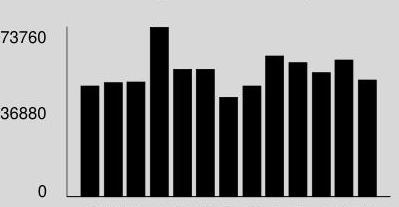

## Visit ComEd.com

Customer Service / Power Outage English
1.877.4COMED1 (1.877.426.6331)

## Español

1.800.95.LUCES (1.800.955.8237)

Hearing/Speech Impaired
1.800.572.5789 (TTY)

Your Usage Profile 13-Month Usage (Total kWh)

The image is a bar chart.

- **Chart Type**: Bar chart
- **Y-Axis Title**: Not explicitly labeled, but the values suggest it represents "kWh" (kilowatt-hours).
- **Y-Axis Units**: 0 to 73760
- **Data Points**: The chart shows monthly kWh usage with bars of varying heights, indicating different usage levels for each month.
- **Styling**: The bars are black, and the background is gray. There are no additional colors or highlights.
- **Yearly Usage Breakdown (Monthly-Based)**: The chart visually represents the monthly electric usage over a 13-month period, corresponding to the data provided in the Markdown context.

Electric Usage

| Month | kWh |
| :-- | :-- |
| Oct-17 | 440313 |
| Nov-17 | 453965 |
| Dec-17 | 454986 |
| Jan-18 | 673758 |
| Feb-18 | 507294 |
| Mar-18 | 504800 |
| Apr-18 | 396297 |
| May-18 | 440203 |
| Jun-18 | 558180 |
| Jul-18 | 532138 |
| Aug-18 | 492612 |
| Sep-18 | 542867 |
| Oct-18 | 464766 |

| Month Billed | Average Daily |  |
| :--: | :--: | :--: |
|  | kWh | Temp |
| Last Year | 16307.9 | 69 |
| Last Month | 16964.6 | 76 |
| Current Month | 16026.4 | 67 |

Page 1 of 3
Account Number 0172095028
Name
KENDALL COLLEGE
Service Location 900 N NORTHBRANCH ST CHICAGO
Phone Number 312-752-2126

## Bill Summary

Previous Balance
Total Payments
Amount Due on October 19, 2018
\$0.00
\$91,768.87

Issue Date October 4, 2018

| Meter information |  |  |  |  |  |  |  |  |
| :--: | :--: | :--: | :--: | :--: | :--: | :--: | :--: | :--: |
| Read   Dates | Meter   Number | Load   Type | Reading   Type | Previous | Meter Reading   Present | Difference | Multiplier   $X$ | Usage |
| $\begin{aligned} & 94- \\ & 10-3 \\ & 9-4 \\ & 10-3 \\ & 9-4 \\ & 10-3 \end{aligned}$ | 230253698 | General Service | Total kWh | Actual | Actual |  |  | 0 |
|  | 230253698 | General Service | On Pk kW | Actual | Actual |  |  | 0.00 |
|  | 230253983 | General Service | Total kWh | Actual | Actual |  |  | 16 |
|  | 230253983 | General Service | On Pk kW | Actual | Actual |  |  | 0.00 |
|  | 230253984 | General Service | Total kWh | Actual | Actual |  |  | 949 |
|  | 230253984 | General Service | On Pk kW | Actual | Actual |  |  | 0.40 |
|  | 230269415 | General Service | Total kWh | Actual | Actual |  |  | 270712 |
|  | 230269415 | General Service | On Pk kW | Actual | Actual |  |  | 488.26 |
|  | 230269431 | General Service | Total kWh | Actual | Actual |  |  | 42198 |
|  | 230269431 | General Service | On Pk kW | Actual | Actual |  |  | 171.24 |
|  | 230269433 | General Service | Total kWh | Actual | Actual |  |  | 150891 |
|  | 230269433 | General Service | On Pk kW | Actual | Actual |  |  | 402.00 |

Service from 9/4/2018 to 10/3/2018 - 29 Days
Commercial Hourly - 1000 kW to 10MW
Electricity Supply Services
\$25,415.75
Electricity Supply Charge
Transmission Services Charge
Capacity Charge
For Electric Supply Choices visit
pluginillinois.org

| 464,765 kWh |  |  |  | 15,479.73 |
| :--: | :--: | :--: | :--: | :--: |
| 464,766 kWh | X | 0.00503 |  | 2,337.77 |
| 1,440.27 kW | X | 6.50504 |  | 9,369.01 |

(continued on next page)

Return only this portion with your check made payable to ComEd. Please write your account number on your check.

To pay by phone call 1-800-588-9477.
A convenience fee will apply.

Account Number
0172095028

Payment Amount

Please pay this
amount by 10/19/2018
\$91,768.87
$\mathrm{d} \| \| \mathrm{d} \| \mathrm{d} \| \| \mathrm{d} \| \| \| \mathrm{d} \| \| \| \mathrm{d} \| \| \| \| \| \| \| \| \| \| \| \| \| \| \| \| \| \| \| \| \| \| \| \| \| \| \| \| \| \| \| \| \| \| \| \| \| \| \| \| \| \| \| \| \| \| \| \| \| \| \|

PO BOX 6112
CAROL STREAM, IL 60197-6112
$017209502800000000082920000005$

| Purchased Electricity Adjustment |  |  |  | $-2,323.83$ |
| :-- | --: | --: | --: | --: |
| Misc Procurement Component Chg | $464,766 \mathrm{kWh}$ | X | 0.00119 | 553.07 |

Delivery Services - ComEd
536.67

Customer Charge
Standard Metering Charge
Distribution Facilities Charge
IL Electricity Distribution Charge
Meter Lease
Nonstandard Facilities Charge
25.96

6,774.92
553.07
61.75
800.64

Taxes and Other
$6,254.39$

| Environmental Cost Recovery Adj | $464,766 \mathrm{kWh}$ | X | 0.00024 | 111.54 |
| :-- | :-- | :-- | --: | --: |
| Renewable Portfolio Standard | $464,766 \mathrm{kWh}$ | X | 0.00142 | 659.97 |
| Zero Emission Standard | $464,766 \mathrm{kWh}$ | X | 0.00190 | 883.06 |
| Energy Efficiency Programs | $464,766 \mathrm{kWh}$ | X | 0.00010 | 46.48 |
| Franchise Cost |  |  |  | 1,446.14 |
| State Tax |  |  |  | 1,394.58 |
| Municipal Tax |  |  |  | 1,712.62 |

Total Current Charges
$\$ 40,423.15$

Miscellaneous
$\$ 51,345.72$

Charges from previous bill
Current late payment charge (s) - electric
Previous late payment charge (s) - electric
49,883.84
758.81
703.07

Total Amount Due
(continued on next page)
(continued on next page)

## Visit ComEd.com

Customer Service / Power Outage English
1.877.4COMED1 (1.877.426.6331)

## Español

1.800.95.LUCES (1.800.955.8237)

Hearing/Speech Impaired
1.800.572.5789 (TTY)

Page 3 of 3
Account Number 0172095028

## Message Center

## ComEd

- YOUR COMED BILL: Need help understanding your bill line item definitions? Please visit us at ComEd.com/UnderstandBill or call us at 877-426-6331.
- ENVIRONMENTAL DISCLOSURE STATEMENT: ComEd's Environmental Disclosure Statement can now be found online at ComEd.com/EnvironmentalDisclosure.
- WAYS TO PAY: Looking for ways to pay your bill? Visit ComEd.com/PAY.
- ILLINOIS COMMERCE COMMISSION CONSUMER DIVISION: 800-524-0795: The Consumer Services Division is available to help resolve disputes with ComEd. However, customers should contact ComEd first before seeking assistance from the ICC.

