| ACCOUNT NUMBER | 01393-65773 |
| :--: | :--: |
| SERVICE | 1700 JEROME LN |
| AT | CAHOKIA, IL 62206 |

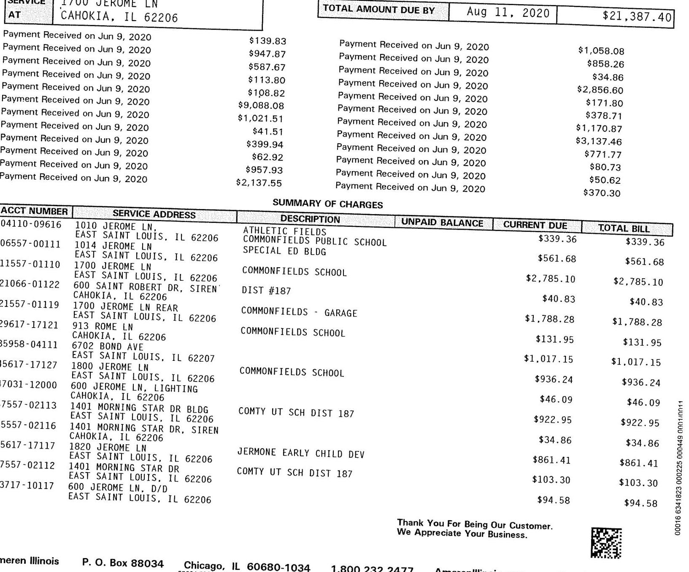

The image is a photo of a billing statement. It includes details of payments received and a summary of charges. 

- **Payments Received:**
  - June 9, 2020: $139.83, $947.87, $587.69, $113.80, $1,068.97, $9,088.08, $1,021.51, $41.51, $399.94, $62.92, $957.93, $2,137.55
  - Total Amount Due by August 11, 2020: $21,387.40

- **Summary of Charges:**
  - **Acct Number**: 04110-09616, **Service Address**: 1010 Jerome Ln., **Description**: Athletic Fields, **Unpaid Balance**: $339.36, **Current Due**: $339.36, **Total Bill**: $339.36
  - **Acct Number**: 06557-00111, **Service Address**: 1014 Jerome Ln, East Saint Louis, IL 62206, **Description**: Commonfields Public School, **Unpaid Balance**: $561.68, **Current Due**: $561.68, **Total Bill**: $561.68
  - **Acct Number**: 11557-01110, **Service Address**: 1700 Jerome Ln, East Saint Louis, IL 62206, **Description**: Commonfields School, **Unpaid Balance**: $2,785.10, **Current Due**: $2,785.10, **Total Bill**: $2,785.10
  - **Acct Number**: 21066-01112, **Service Address**: 600 Saint Robert Dr, Siren, Cahokia, IL 62206, **Description**: Dist #187, **Unpaid Balance**: $40.83, **Current Due**: $40.83, **Total Bill**: $40.83
  - **Acct Number**: 21557-01119, **Service Address**: 1700 Jerome Ln Rear, East Saint Louis, IL 62206, **Description**: Commonfields - Garage, **Unpaid Balance**: $1,788.28, **Current Due**: $1,788.28, **Total Bill**: $1,788.28
  - **Acct Number**: 29617-17112, **Service Address**: 913 Rome Ln, Cahokia, IL 62206, **Description**: Commonfields School, **Unpaid Balance**: $131.95, **Current Due**: $131.95, **Total Bill**: $131.95
  - **Acct Number**: 89598-04111, **Service Address**: 6702 Bond Ave, Cahokia, IL 62206, **Description**: Commonfields School, **Unpaid Balance**: $1,017.15, **Current Due**: $1,017.15, **Total Bill**: $1,017.15
  - **Acct Number**: 95617-17127, **Service Address**: 1800 Jerome Ln, East Saint Louis, IL 62207, **Description**: Commonfields School, **Unpaid Balance**: $936.24, **Current Due**: $936.24, **Total Bill**: $936.24
  - **Acct Number**: 7031-12000, **Service Address**: 600 Jerome Ln, Lighting, Cahokia, IL 62206, **Description**: Lighting, **Unpaid Balance**: $46.09, **Current Due**: $46.09, **Total Bill**: $46.09
  - **Acct Number**: 7557-02113, **Service Address**: 1401 Morning Star Dr Bldg, Cahokia, IL 62206, **Description**: Comty Ut Sch Dist 187, **Unpaid Balance**: $922.95, **Current Due**: $922.95, **Total Bill**: $922.95
  - **Acct Number**: 5557-02116, **Service Address**: 1401 Morning Star Dr, Siren, Cahokia, IL 62206, **Description**: Siren, **Unpaid Balance**: $34.86, **Current Due**: $34.86, **Total Bill**: $34.86
  - **Acct Number**: 5657-17117, **Service Address**: 1820 Jerome Ln, East Saint Louis, IL 62206, **Description**: Jerome Early Child Dev, **Unpaid Balance**: $861.41, **Current Due**: $861.41, **Total Bill**: $861.41
  - **Acct Number**: 7557-02112, **Service Address**: 6702 Bond Ave, Cahokia, IL 62206, **Description**: Comty Ut Sch Dist 187, **Unpaid Balance**: $103.30, **Current Due**: $103.30, **Total Bill**: $103.30
  - **Acct Number**: 3717-10117, **Service Address**: 6702 Bond Ave, East Saint Louis, IL 62206, **Description**: Comty Ut Sch Dist 187, **Unpaid Balance**: $94.58, **Current Due**: $94.58, **Total Bill**: $94.58

- **Footer Text:**
  - "Thank You For Being Our Customer. We Appreciate Your Business."

The following are definitions of common terms that may appear on your Ameren Illinois utility bill. Ameren Illinois is responsible for the delivery of your natural gas and/or electricity and is referred to below as "utility." For additional definitions, or detailed information on rates, to view your bill or learn about payment options, energy supply options, energy efficiency and more, visit AmerenIllinois.com or call the phone number listed on the front of this bill.

AMOUNT PAYABLE AFTER DUE DATE / LATE PAYMENT CHARGE - A 1.5 percent Late Payment Charge will be applied to any unpaid balance after the due date.
BILLING SEASONS - Summer months are June, July, August and September. All other months are non-summer.
CUSTOMER CHARGE - Recovers costs of providing energy service that occur even if you do not use electricity or natural gas in the billing period. Included in the charge are billing, accounting and other supplemental charges. For gas service, this also recovers basic gas metering costs.
DISTRIBUTION DELIVERY CHARGE - Recovers the costs of infrastructure, maintenance and services incurred by the utility to deliver electricity and/or natural gas to customers through the distribution system.
EDT COST RECOVERY - Allows the Company to recover the cost of an electric distribution tax imposed on the Company under the Public Utilities Revenue Act. The Company receives no profit from this charge. ELECTRIC SUPPLY - Recovers the cost of electricity that the utility has purchased from suppliers. (These charges apply only to customers who have not chosen a third-party supplier.) The utility provides electric supply under one of two rate options: Basic Generation Service (BGS) or RealTime Pricing (RTP). The utility does not profit from BGS or RTP supply charges. Regardless of your supplier, the utility remains responsible for delivering your electricity.
ENVIRONMENTAL ADJUSTMENT / FACTOR- Recovers costs incurred by the utility for environmental clean-up of former gas manufacturing sites.
GAS CHARGE (PGA) - Recovers the cost of natural gas that the utility purchases from suppliers and delivers to customers. The utility receives no profit from this charge.
ILLINDIS STATE COMMERCE COMMISSION TAX - Tax on natural gas consumption; proceeds are used to operate the Illinois Commerce Commission.
ILLINDIS STATE ELECTRICITY EXCISE TAX - Tax on electricity consumption.
ILLINDIS STATE GAS REVENUE TAX - Tax on natural gas consumption. kW (KILOWATT) - A unit of measure of the rate at which electrical energy is used. Ten, 100-watt light bulbs turned on at the same time will use electrical energy at a rate of 1,000 watts or 1 kilowatt (kW).
kWh (KILOWATT-HOUR) - A unit of measure of electricity used in one hour. Ten, 100-watt light bulbs burning for one hour would use 1,000 watts, which is equal to 1 kilowatt-hour (kWh) of electricity.
METER CHARGE - Recovers the basic costs of providing electric metering services if they are provided by the utility.
METER MULTIPLIER - Conversion factor required to determine the actual amount of energy used.
MUNICIPAL CHARGE - Tax imposed by a local municipality.
NO. DAYS - Number of days in the present billing period, which may vary monthly. When you compare bills, compare the number of days in each billing period as well as the energy used.
PURCHASED ELECTRICITY ADJUSTMENT - Allows the utility to match electric power and energy costs with electric power and energy revenue.
RD (Meter Reading) - Used to calculate the bill.

| A - Actual Reading | C - Customer Reading |
| :-- | :-- |
| E - Estimated Reading | R - Revised Reading |

SUPPLY COST ADJUSTMENT - Allows the utility to recover costs associated with the administration of electric supply service.
THERM - The basic unit for measuring your natural gas consumption.
THERM FACTOR - Converts the basic usage or volume of gas from cubic feet to therms.
TOTAL LIGHTING CHARGES - Summary of charges for optional outdoor lighting service.
TRANSMISSION SERVICE CHARGE - Recovers costs associated with electric transmission service.
USAGE - Amount of energy used, measured in kWh for electricity and therms for natural gas. This amount is derived by subtracting the previous meter reading from the present meter reading and multiplying the result by the meter multiplier.
USE PER DAY (Table) - Shows your average use of energy per day and the average temperature during the present billing period and during the comparable period a year ago.

SUMMARY OF CHARGES

| ACCT NUMBER | SERVICE ADDRESS | DESCRIPTION | UNPAID BALANCE | CURRENT DUE | TOTAL BILL |
|--------|---------------------|---------------------|---------------------|---------------------|---------------------|---------------------|
| 65617-17125 | 1826 JEROME LN    | COMMONFIELDS SCHOOL |            | $93.57 | $93.57 |
| 75617-17115 | 1827 JEROME LN    |             |            | $176.68 | $176.68 |
| 83110-09415 | 1010 JEROME LN    |             |            | $4,819.69 | $4,819.69 |
| 84956-09116 | 1010 JEROME LN, LIGHTS |             |            | $346.26 | $346.26 |
| 85557-00115 | 1010 JEROME LN REAR |             |            | $72.78 | $72.78 |
| 91066-02115 | 600 SAINT ROBERT DR | DIST #187 |            | $904.60 | $904.60 |
| 95557-00114 | 1012 JEROME LN    | SPECIAL ED FOOD SERVICE |            | $171.42 | $171.42 |
| 21324-23534 | 1900 MOUSETTE LN UNIT REAR | DIST #187 |            | $1,052.99 | $1,052.99 |
| 51983-46732 | 3429 CAMP JACKSON RD |             |            | $594.73 | $594.73 |
| 63493-28171 | 1900 MOUSETTE LN    | DIST #187 |            | $3,490.90 | $3,490.90 |
|            | CAHOKIA, IL 62206 |             |            | TOTAL | $21,387.40 |

summer season/Prorated Bill
summer rates are effective June 1 - Sept. 30. As a result, this bill is prorated. Proration occurs when part of your bill is charged on the non-summer rates and part of your bill is charged on the summer rates, dependent upon your meter reading date. For detailed information about rates and billing charges, go to AmerenIllinois.com

# Ameren 

## ILLINOIS

## SUMMARY ACCOUNT LISTING: 01393-65773 CAHOKIA PUBLIC SCHOOL

| 04110-09616 | 1010 JEROME | LN., | ATHLETIC FIELDS, | EAST SAINT LOUIS, IL 62206 |  |  | May 18, 2020 |  |
| :--: | :--: | :--: | :--: | :--: | :--: | :--: | :--: | :--: |
| TYPE OF READING | METER   NUMBER | SERVICE FROM | $\begin{array}{ll} \text { NO. } \\ \text { TO } \end{array}$ | METER READING |  | READING   DIFFERENCE | METER   MULTIPLIER | THERM   FACTOR | USAGE | R   D |
| Total kWh | 72388977 | 04/15-05/14 29 |  | 169.0000 | 187.0000 | 18.0000 | 200.0000 |  | 3600.0000 A |  |
|  | Service To |  |  | SUMMARY |  |  | Service To |  |  |  |
| Total kWh |  | 05/14/2020 |  | 3600.0000 | Non-Summer kWh |  | 05/14/2020 |  | 3600.0000 |  |

ELECTRIC SERVICE BILLING DETAIL - Rate Zone I

| Electric Delivery Service |  |  |  |  |  |  |  |
| :--: | :--: | :--: | :--: | :--: | :--: | :--: | :--: |
| DS-2 Small General Delivery Service |  |  |  | Service From | 04/15/2020 | to | 05/14/2020 |
| Meter Reassignment Provision | Smart Meter |  |  |  |  |  |  |
| Customer Charge |  |  |  | \$26.45 |  |  |  |
| Meter Charge |  |  |  | \$8.32 |  |  |  |
| Distribution Delivery Charge Non-Summer |  | 2,000.00 | kWh | @ | \$. 02415000 | \$48.30 |  |
| Distribution Delivery Charge Non-Summer |  | 1,600.00 | kWh | @ | \$. 01237000 | \$19.79 |  |
| Total Delivery Service Amount |  |  |  |  |  |  | \$102.86 |
| Electric Power Supply - Constellation NewEnergy |  |  |  |  |  |  |  |
| 844.636.3749 www.constellation.com |  |  |  |  |  |  |  |
| Refer to supply contract for details |  |  |  | Service From | 04/15/2020 | to | 05/14/2020 |
| Fixed Price Transactions |  | 3,600.00 kWh | @ | \$. 05000000 | \$180.00 |  |  |
| Market Charges |  | 1.00 | @ | $\$ .00000000$ | \$0.00 |  |  |
| Total Supplier Charge |  |  |  |  |  | \$180.00 |  |
| Taxes |  |  |  | Service From | 04/15/2020 | to | 05/14/2020 |
| Customer Generation Charge |  |  |  | \$0.09 |  |  |  |
| Clean Energy Assistance Charge |  | 3,600.00 kWh | @ | \$. 00176000 | \$6.34 |  |  |
| Renewable Energy Adjustment |  | 3,600.00 kWh | @ | \$. 00181000 | \$6.52 |  |  |
| EDT Cost Recovery |  | 3,600.00 kWh | @ | \$. 00121680 | \$4.38 |  |  |
| Electric Environmental Adjustment |  | 3,600.00 kWh | @ | \$. 00175910 | \$6.33 |  |  |
| Energy Efficiency Programs Charge |  | 3,600.00 kWh | @ | \$. 00239000 | \$8.60 |  |  |
| Cahokia Municipal Tax |  |  |  |  | \$12.54 |  |  |
| Illinois State Electricity Excise Tax |  |  |  |  | \$11.70 |  | \$56.50 |
| Total Tax Related Charges |  |  |  |  |  |  |  |

Total Electric Charges
\$339.36
The current billed amount of $\$ 339.36$ is due on Aug 11, 2020 .
The prior billed amount of $\$ 370.30$ is due on Jul 13, 2020 .
To learn more about your usage, ways to pay and billing details visit us online at AmerenIllinois.com/mybill.
Put safety first when tackling those outdoor home and yard projects! Working near electrical wires or equipment can be extremely dangerous, so never use tall ladders or long tools around power lines.

Current Total Due (Account)
$\$ 339.36$
06557-00111 1014 JEROME LN, EAST SAINT LOUIS, IL 62206
May 18, 2020

| TYPE OF | METER | SERVICE | NO. | METER READING |  | READING | METER | THERM |  |
| :--: | :--: | :--: | :--: | :--: | :--: | :--: | :--: | :--: | :--: |
| READING | NUMBER | FROM | TO | PREVIOUS | PRESENT | DIFFERENCE | MULTIPLIER | FACTOR | USAGE |
| Total kWh | 72390144 | 04/15-05/14 | 29 | 888.0000 | 930.0000 | 42.0000 | 80.0000 |  | 3360.0000 A |
| Total kWh | 72390634 | 04/15-05/14 | 29 | 935.0000 | 974.0000 | 39.0000 | 80.0000 |  | 3120.0000 A |
|  | Service To |  |  | SUMMARY |  |  | Service To |  |  |
| Total kWh |  | 05/14/2020 |  | 6480.0000 | Non-Summer kWh |  | 05/14/2020 |  | 6480.0000 |

ELECTRIC SERVICE BILLING DETAIL - Rate Zone I

| Electric Delivery Service |  |  |  |  |  |  |  |
| :--: | :--: | :--: | :--: | :--: | :--: | :--: | :--: |
| DS-2 Small General Delivery Service |  |  |  | Service From | 04/15/2020 | to | 05/14/2020 |
| Smart Meter |  |  |  |  |  |  |  |
| Customer Charge |  |  |  | \$26.45 |  |  |  |
| Meter Charge |  |  |  | \$8.32 |  |  |  |
| Distribution Delivery Charge Non-Summer |  | 2,000.00 | kWh | @ | $\$ .02415000$ | \$48.30 |  |
| Distribution Delivery Charge Non-Summer |  | 4,480.00 | kWh | @ | $\$ .01237000$ | \$55.42 |  |
| Total Delivery Service Amount |  |  |  |  |  | \$138.49 |  |

Thank You For Being Our Customer. We Appreciate Your Business.

# Ameren 

## ILLINOIS

## SUMMARY ACCOUNT LISTING: 01393-65773 CAHOKIA PUBLIC SCHOOL

Electric Power Supply - Constellation NewEnergy 844.636.3749 www. constellation.com
Refer to supply contract for details

| Fixed Price Transactions | 6,480.00 kWh | @ | $\$ .05000000$ |  | 05/14/2020 |
| :--: | :--: | :--: | :--: | :--: | :--: |
| Market Charges | 1.00 | @ | $\$ .00000000$ |  | \$0.00 |
| Total Supplier Charge |  |  |  |  | \$324.00 |
| Taxes |  |  |  | Service From | 04/15/2020 |
| Customer Generation Charge |  |  |  | \$0.09 |  |
| Clean Energy Assistance Charge | 6,480.00 kWh | @ | $\$ .00176000$ |  | \$11.40 |
| Renewable Energy Adjustment | 6,480.00 kWh | @ | $\$ .00181000$ |  | \$11.73 |
| EDT Cost Recovery | 6,480.00 kWh | @ | $\$ .00121680$ |  | \$7.88 |
| Electric Environmental Adjustment | 6,480.00 kWh | @ | $\$ .00175910$ |  | \$11.40 |
| Energy Efficiency Programs Charge | 6,480.00 kWh | @ | $\$ .00239000$ |  | \$15.49 |
| Cahokia Municipal Tax |  |  |  |  | \$20.31 |
| Illinois State Electricity Excise Tax |  |  |  |  | \$20.89 |

Total Electric Charges
\$561.68
The current billed amount of $\$ 561.68$ is due on Aug 11, 2020 .
Current Total Due (Account)
$\$ 561.68$
11557-01110 1700 JEROME LN, EAST SAINT LOUIS, IL 62206

| TYPE OF READING | METER NUMBER | SERVICE FROM TO | $\begin{aligned} & \text { NO. } \\ & \text { DAYS } \end{aligned}$ | METER READING |  | READING   DIFFERENCE | METER MULTIPLIER | THERM FACTOR | $\begin{gathered} \text { USAGE } \\ \text { D } \end{gathered}$ |
| :--: | :--: | :--: | :--: | :--: | :--: | :--: | :--: | :--: | :--: |
| Total kWh | 72790115 | 04/15-05/14 | 29 | 0.0000 | 33308.0000 | 33308.0000 | 1.0000 |  | 33308.0000 A |
| On Peak kWh | 72790115 | 04/15-05/14 | 29 | 0.0000 | 12988.0000 | 12988.0000 | 1.0000 |  | 12988.0000 A |
| Off Peak kWh | 72790115 | 04/15-05/14 | 29 | 0.0000 | 20320.0000 | 20320.0000 | 1.0000 |  | 20320.0000 A |
| Peak kW | 72790115 | 04/15-05/14 | 29 | 0.0000 | 74.6880 | 74.6880 | 1.0000 |  | 74.6880 A |
| On Peak kW | 72790115 | 04/15-05/14 | 29 | 0.0000 | 74.6880 | 74.6880 | 1.0000 |  | 74.6880 A |
| Off Peak kW | 72790115 | 04/15-05/14 | 29 | 0.0000 | 71.3280 | 71.3280 | 1.0000 |  | 71.3280 A |

| Service To |  |  |  |  | SCHMMARY |  |  | Service To |  |
| :--: | :--: | :--: | :--: | :--: | :--: | :--: | :--: | :--: | :--: |
| Total kWh |  | 05/14/2020 |  | 33308.0000 | On-Peak kWh |  | 05/14/2020 |  | 12988.0000 |
| Off-Peak kWh |  | 05/14/2020 |  | 20320.0000 | Peak kW |  | 05/14/2020 |  | 74.7000 |
| On-Peak kW |  | 05/14/2020 |  | 74.7000 | Off-Peak kW |  | 05/14/2020 |  | 71.3000 |
| 12 Month Max Demand |  | 05/14/2020 |  | 161.7000 |  |  |  |  |  |

ELECTRIC SERVICE BILLING DETAIL - Rate Zone I

Electric Delivery Service
DS-3 General Delivery Service < 400 kW
Smart Meter

| Customer Charge |  |  |  | \$45.36 |  |
| :--: | :--: | :--: | :--: | :--: | :--: |
| Meter Charge |  |  |  | \$11.39 |  |
| Distribution Delivery kW Charge |  | 74.70 kW | @ | \$7.00800000 | \$523.50 |
| Transformation Charge |  | 161.70 kW | @ | $\$ .59000000$ | \$95.40 |
| Total Delivery Service Amount |  |  |  |  | \$675.65 |
| Electric Power Supply - Constellation NewEnergy 844.636.3749 www. constellation.com |  |  |  |  |  |
| Refer to supply contract for details |  |  |  |  | Service From 04/15/2020 to 05/14/2020 |
| Fixed Price Transactions | 33,308.47 kWh |  |  | \$1,665.42 |  |
| Market Charges | 1.00 |  |  | \$0.00 |  |
| Total Supplier Charge |  |  |  |  | \$1,665.42 |
| Taxes |  |  |  | Service From | 04/15/2020 |
| Customer Generation Charge |  |  |  | \$15.25 |  |
| Clean Energy Assistance Charge | 33,308.00 kWh |  |  | \$8.00181000 |  |
| Renewable Energy Adjustment | 33,308.00 kWh |  |  | \$00181000 |  |
| EDT Cost Recovery | 33,308.00 kWh |  |  | \$00121680 |  |
| Electric Environmental Adjustment | 33,308.00 kWh |  |  | \$00098630 |  |
| Energy Efficiency Programs Charge | 33,308.00 kWh |  |  | \$37.30 |  |
| Cahokia Municipal Tax |  |  |  | \$92.72 |  |
| Illinois State Electricity Excise Tax |  |  |  | \$106.47 |  |
| Total Tax Related Charges |  |  |  |  | \$444.03 |

Total Electric Charges
\$2,785.10
The current billed amount of $\$ 2,785.10$ is due on Aug 11, 2020 .
Current Total Due (Account)
$\$ 2,785.10$

SUMMARY ACCOUNT LISTING: 01393-65773 CAHOKIA PUBLIC SCHOOL

| TYPE OF READING | METER NUMBER | SERVICE FROM TO | $\begin{gathered} \text { NO. } \\ \text { DAYS } \end{gathered}$ | METER READING |  | READING DIFFERENCE | METER MULTIPLIER | THERM FACTOR | USAGE | $\begin{gathered} \text { R } \\ \text { D } \end{gathered}$ |
| :--: | :--: | :--: | :--: | :--: | :--: | :--: | :--: | :--: | :--: | :--: |
|  |  |  |  | PREVIOUS | PRESENT |  |  |  |  |  |
| Total kWh | 72861686 | 04/13-05/12 | 29 | 1620.0000 | 1685.0000 | 65.0000 | 1.0000 |  | 65.0000 A |  |
|  | Service To |  |  | SUMMARY |  |  | Service To |  |  |  |
| Total kWh |  | 05/12/2020 |  | 65.0000 | Non-Summer kWh |  | 05/12/2020 |  | 65.0000 |  |

ELECTRIC SERVICE BILLING DETAIL - Rate Zone I
DS-2 Small General Delivery Service Service From 04/13/2020 to 05/12/2020
Smart Meter
Customer Charge $\$ 26.45$
Meter Charge $\$ 8.32$
Distribution Delivery Charge Non-Summer kWh $\quad \$$ 02415000 \$1.57
Total Delivery Service Amount
$\$ 36.34$
BGS-2 Basic Generation Service
Purchased Electric Non-Summer
Purchased Electricity Adjustment
Supply Cost Adjustment
Transmission Service Charge
Total Supply Amount
Taxes
Customer Generation Charge
Clean Energy Assistance Charge
Renewable Energy Adjustment
EDT Cost Recovery
Electric Environmental Adjustment
Energy Efficiency Programs Charge
Cahokia Municipal Tax
Illinois State Electricity Excise Tax
Total Tax Related Charges
$\$ 36.34$
$\$ 36.34$
$\$ 36.34$
$\$ 36.34$
$\$ 3.34$
$\$ 3.34$
$\$ 1.15$

Total Electric Charges
The current billed amount of $\$ 40.83$ is due on Aug 11, 2020.

| TYPE OF READING | METER NUMBER | SERVICE FROM TO | $\begin{gathered} \text { NO. } \\ \text { DAYS } \end{gathered}$ | METER READING |  | READING DIFFERENCE | METER MULTIPLIER | THERM FACTOR | USAGE | $\begin{gathered} \text { R } \\ \text { D } \end{gathered}$ |
| :--: | :--: | :--: | :--: | :--: | :--: | :--: | :--: | :--: | :--: | :--: |
|  |  |  |  | PREVIOUS | PRESENT |  |  |  |  |  |
| Total kWh | 72977649 | 04/15-05/14 | 29 | 10766.0000 | 11195.0000 | 429.0000 | 40.0000 |  | 17160.0000 A |  |
| Total kWh | 72415817 | 04/15-05/14 | 29 | 3952.0000 | 4008.0000 | 56.0000 | 80.0000 |  | 4480.0000 A |  |
|  | Service To |  |  | SUMMARY |  |  | Service To |  |  |  |
| Total kWh |  | 05/14/2020 |  | 17160.0000 | Non-Summer kWh |  | 05/14/2020 |  | 17160.0000 |  |
| Total kWh |  | 05/14/2020 |  | 4480.0000 | Non-Summer kWh |  | 05/14/2020 |  | 4480.0000 |  |

ELECTRIC SERVICE BILLING DETAIL - Rate Zone I
Electric Delivery Service
DS-2 Small General Delivery Service
$\$ 26.45$
Smart Meter
Customer Charge
Meter Charge
Distribution Delivery Charge Non-Summer 2,000.00 kWh $\quad \$$ \$26.32
Distribution Delivery Charge Non-Summer 15,160.00 kWh $\quad \$$ \$187.53
Total Delivery Service Amount
Electric Power Supply - Constellation NewEnergy
844.636.3749 www.constellation.com

Refer to supply contract for details

| Fixed Price Transactions | 17,160.00 kWh | $\begin{gathered} \text { ® } \\ \$ 05000000 \end{gathered}$ | 05/14/2020 |  | 05/14/2020 |
| :--: | :--: | :--: | :--: | :--: | :--: |
| Market Charges | 1.00 |  |  |  |  |
| Total Supplier Charge |  |  |  |  |  |  |  |  |  |

# Ameren 

## ILLINOIS

## SUMMARY ACCOUNT LISTING: 01393-65773 CAHOKIA PUBLIC SCHOOL

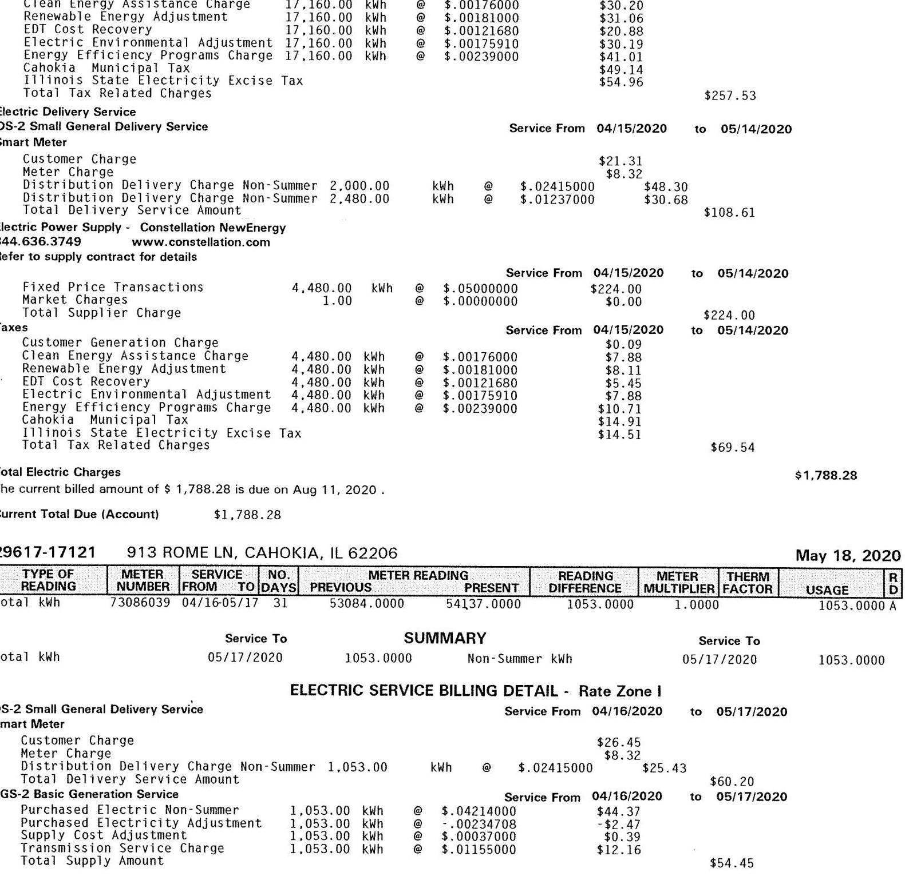

The image is a photo of a utility bill document. It contains detailed billing information for electric service, including charges, meter readings, and service dates. 

Key elements include:

- **Header Information:**
  - "Ameren"
  - "ILLINOIS"
  - "SUMMARY ACCOUNT LISTING: 01393-65773 CAHOKIA PUBLIC SCHOOL"

- **Billing Details:**
  - **Service Period:** Various dates, including "04/15/2020 to 05/14/2020" and "04/16/2020 to 05/17/2020"
  - **Customer Charge:** $21.31
  - **Distribution Delivery Charge Non-Summer:** 2,000.00 kWh @ $0.02415000 = $48.30
  - **Distribution Delivery Charge Non-Summer:** 2,480.00 kWh @ $0.01237000 = $30.68
  - **Total Delivery Service Amount:** $108.61

- **Electric Power Supply:**
  - "Constellation NewEnergy"
  - **Fixed Price Transactions:** 4,480.00 kWh @ $0.05000000 = $224.00
  - **Market Charges:** 1.00 @ $0.00000000 = $0.00
  - **Total Supplier Charge:** $224.00

- **Taxes:**
  - **Customer Generation Charge:** 4,480.00 kWh @ $0.00176000 = $0.09
  - **Clean Energy Assistance Charge:** 4,480.00 kWh @ $0.00180000 = $7.88
  - **Renewable Energy Adjustment:** 4,480.00 kWh @ $0.00116000 = $8.11
  - **EDT Cost Recovery:** 4,480.00 kWh @ $0.00121680 = $5.45
  - **Electric Environmental Adjustment:** 4,480.00 kWh @ $0.00175910 = $7.88
  - **Energy Efficiency Programs Charge:** 4,480.00 kWh @ $0.00239000 = $10.71
  - **Cahokia Municipal Tax:** $14.91
  - **Illinois State Electricity Excise Tax:** $14.51
  - **Total Tax Related Charges:** $69.54

- **Total Electric Charges:** $1,788.28
- **Current Total Due (Account):** $1,788.28
- **Due Date:** Aug 11, 2020

- **Meter Information:**
  - **Meter Reading Dates:** 04/16/05/17
  - **Previous Reading:** 53084.0000
  - **Present Reading:** 54137.0000
  - **Total kWh:** 1053.0000 Non-Summer kWh

- **Electric Service Billing Detail:**
  - **Purchased Electric Non-Summer:** 1,053.00 kWh @ $0.04214000 = $44.37
  - **Purchased Electric Non-Summer:** 1,053.00 kWh @ $0.00234708 = -$2.47
  - **Supply Cost Adjustment:** 1,053.00 kWh @ $0.00037000 = $0.39
  - **Supply Cost Adjustment:** 1,053.00 kWh @ $0.01155000 = $12.16
  - **Total Supply Amount:** $54.45

- **Address:**
  - "913 ROME LN, CAHOKIA, IL 62206"

- **Date:** May 18, 2020

The document is structured with clear sections for charges, taxes, and meter readings, providing a comprehensive breakdown of the billing details.

# Ameren 

## ILLINOIS

## SUMMARY ACCOUNT LISTING: 01393-65773 CAHOKIA PUBLIC SCHOOL

| Taxes | Service From | $04 / 16 / 2020$ | to | $05 / 17 / 2020$ |  |
| :--: | :--: | :--: | :--: | :--: | :--: |
| Customer Generation Charge | 1,053.00 | kWh |  | 11.85 |  |
| Clean Energy Assistance Charge | 1,053.00 | kWh |  | 1.91 |  |
| Renewable Energy Adjustment | 1,053.00 | kWh |  | 1.28 |  |
| EDT Cost Recovery | 1,053.00 | kWh |  | 1.85 |  |
| Electric Environmental Adjustment | 1,053.00 | kWh |  | 2.52 |  |
| Energy Efficiency Programs Charge | 1,053.00 | kWh |  | 3.47 |  |
| Cahokia Municipal Tax |  |  |  | 3.47 |  |
| Illinois State Electricity Excise Tax |  |  |  |  |  |
| Total Tax Related Charges |  |  |  |  | 17.30 |

Total Electric Charges
$\$ 131.95$
The current billed amount of $\$ 131.95$ is due on Aug 11, 2020 .
Current Total Due (Account) $\$ 131.95$
35958-04111 6702 BOND AVE, EAST SAINT LOUIS, IL 62207
May 20, 2020

| TYPE OF   READING | METER NUMBER | SERVICE   PROMP | NO.   TO | METER READING |  | READING   DIFFERENCE | METER   MULTIPLIER | THERM   FACTOR | USAGE | R |
| :--: | :--: | :--: | :--: | :--: | :--: | :--: | :--: | :--: | :--: | :--: |
| Total kWh | 72414800 | 04/19-05/18 | 29 | 1893.0000 | 1962.0000 | 69.0000 | 160.0000 |  | 11040.0000 A |  |
|  | Service To |  |  | SUMMARY |  |  | Service To |  |  |  |
| Total kWh |  | 05/18/2020 |  | 11040.0000 | Non-Summer kWh |  | 05/18/2020 |  | 11040.0000 |  |
| Lighting kWh |  | 05/18/2020 |  | 653.0000 |  |  |  |  |  |  |

ELECTRIC SERVICE BILLING DETAIL - Rate Zone I

Electric Delivery Service
DS-2 Small General Delivery Service
Service From 04/19/2020 to 05/18/2020

## Smart Meter

| Customer Charge | $\$ 26.45$ |
| :-- | --: |
| Meter Charge | $\$ 8.32$ |
| Distribution Delivery Charge Non-Summer | $2,000.00$ |
| Distribution Delivery Charge Non-Summer | $9,040.00$ |
| Total Delivery Service Amount | $\$ 111.82$ |
|  | $\$ 194.89$ |

Electric Power Supply - Constellation NewEnergy
844.636.3749 www.constellation.com

Refer to supply contract for details

|  |  |  | Service From | 04/19/2020 | to | 05/18/2020 |
| :--: | :--: | :--: | :--: | :--: | :--: | :--: |
| Fixed Price Transactions | 11,040.00 | kWh |  | 50000000 | $\$ 552.00$ |  |
| Market Charges | 1.00 |  |  | 50000000 | $\$ 0.00$ |  |
| Total Supplier Charge |  |  |  |  |  | 552.00 |
| Taxes |  |  | Service From | 04/19/2020 | to | 05/18/2020 |
| Customer Generation Charge |  |  |  | 0.09 |  |  |
| Clean Energy Assistance Charge | 11,040.00 | kWh |  | 19.43 |  |  |
| Renewable Energy Adjustment | 11,040.00 | kWh |  | 19.98 |  |  |
| EDT Cost Recovery | 11,040.00 | kWh |  | 13.43 |  |  |
| Electric Environmental Adjustment | 11,040.00 | kWh |  | 19.42 |  |  |
| Energy Efficiency Programs Charge | 11,040.00 | kWh |  | 26.39 |  |  |
| Centreville Municipal Tax |  |  |  | 34.37 |  |  |
| Illinois State Electricity Excise Tax |  |  |  | 35.44 |  |  |
| Total Tax Related Charges |  |  |  |  |  | 168.55 |

Total Electric Charges $\$ 915.44$
OPTIONAL OUTDOOR PROTECTIVE LIGHTING SERVICE BILLING DETAIL - Rate Zone I

Electric Delivery Service
DS-5 Non-Residential Lighting
Optional Lighting Charge
Total Delivery Service Amount
Electric Power Supply - Constellation NewEnergy
844.636.3749 www.constellation.com

Refer to supply contract for details

|  |  |  | Service From | 04/17/2020 | to | 05/18/2020 |
| :--: | :--: | :--: | :--: | :--: | :--: | :--: |
| Fixed Price Transactions | 653.00 | kWh |  | 50000000 | $\$ 32.65$ |  |
| Market Charges | 1.00 |  |  | 50000000 | $\$ 0.00$ |  |
| Total Supplier Charge |  |  |  |  |  | 32.65 |

# Ameren 

## ILLINOIS

## SUMMARY ACCOUNT LISTING: 01393-65773 CAHOKIA PUBLIC SCHOOL

| Taxes | Service From | 04/17/2020 | to | 05/18/2020 |
| :--: | :--: | :--: | :--: | :--: |
| Clean Energy Assistance Charge | 653.00 kWh | @ | $\$ .00176000$ | \$1.15 |
| Renewable Energy Adjustment | 653.00 kWh | @ | $\$ .00181000$ | \$1.18 |
| EDT Cost Recovery | 653.00 kWh | @ | $\$ .00121680$ | \$0.79 |
| Electric Environmental Adjustment | 653.00 kWh | @ | $\$ .00379100$ | \$2.48 |
| Energy Efficiency Programs Charge | 653.00 kWh | @ | $\$ .00239000$ | \$1.56 |
| Centreville Municipal Tax |  |  |  | \$2.83 |
| Illinois State Electricity Excise Tax |  |  |  | \$2.15 |

Total O |

Total Optional Outdoor Protective Lighting
\$101.71

| QUANTITY | DESCRIPTION | MONTHLY RATE |  | PRORATE FACTOR | AMOUNT | DATE | SERVICE TO |
| :--: | :--: | :--: | :--: | :--: | :--: | :--: | :--: |
| 1 | 50000 HPS Enclosed | 4.14 |  | 4.14 | 1.0000000 | 4.14 | May 18, 2020 |
| 2 | 400 Watt SV Direct | 4.10 |  | 4.10 | 1.0000000 | 8.20 | May 18, 2020 |
| 2 | 100 Watt SV Area | 2.91 |  | 2.91 | 1.0000000 | 5.82 | May 18, 2020 |
| 3 | Wood Pole | 6.26 |  | 1.0000000 | 18.78 | May 18, 2020 |  |
| 4 | Std Overhead Span | 1.89 |  | 1.0000000 | 7.56 | May 18, 2020 |  |
| 1 | 400 Watt SV Area LED | 4.14 |  | 4.14 | 1.0000000 | 4.14 | May 18, 2020 |
| 2 | LED 40 Area | 4.14 |  | 8.28 | May 18, 2020 |  |  |

The current billed amount of $\$ 1,017.15$ is due on Aug 11, 2020.
Current Total Due (Account) \$1,017.15
45617-17127 1800 JEROME LN, EAST SAINT LOUIS, IL 62206
May 19, 2020

| TYPE OF   READING | METER   NUMBER | SERVICE   FROM | NO.   TO | METER READING |  | READING   DIFFERENCE | METER   MULTIPLIER | THERM   FACTOR | USAGE |  |
| :--: | :--: | :--: | :--: | :--: | :--: | :--: | :--: | :--: | :--: | :--: |
| Total kWh | 72416756 | 04/16-05/15 | 29 | 0.0000 | 11332.0000 | 11332.0000 | 1.0000 |  | 11332.0000 A |  |
| Peak kW | 72416756 | 04/16-05/15 | 29 | 0.0000 | 35.5200 | 35.5200 | 1.0000 |  | 35.5200 A |  |
|  |  | Service To |  | SUMMARY |  |  | Service To |  |  |  |
| Total kWh |  | 05/15/2020 |  | 11332.0000 | Non-Summer kWh |  | 05/15/2020 |  | 11332.0000 |  |
| Peak kW |  | 05/15/2020 |  | 35.5000 |  |  |  |  |  |  |

ELECTRIC SERVICE BILLING DETAIL - Rate Zone I

## Electric Delivery Service

DS-2 Small General Delivery Service
Source From 04/16/2020 to 05/15/2020

## Smart Meter

| Customer Charge |  |  |  | \$26.45 |  |
| :--: | :--: | :--: | :--: | :--: | :--: |
| Meter Charge |  |  |  | \$8.32 |  |
| Distribution Delivery Charge Non-Summer | 2,000.00 | kWh | @ | $\$ .02415000$ | \$48.30 |
| Distribution Delivery Charge Non-Summer | 9,332.00 | kWh | @ | $\$ .01237000$ | \$115.44 |
| Total Delivery Service Amount |  |  |  |  | \$198.51 |
| Electric Power Supply - Constellation NewEnergy |  |  |  |  |  |
| 844.636.3749 | www.constellation.com |  |  |  |  |
| Refer to supply contract for details |  |  |  |  |  |
| Fixed Price Transactions | 11,332.24 | kWh | @ | $\$ .04999980$ | \$566.61 |
| Market Charges | 1.00 |  | @ | $\$ .00000000$ | \$0.00 |
| Total Supplier Charge |  |  |  |  | \$566.61 |
| Taxes |  |  |  | Service From | 04/16/2020 | to | 05/15/2020 |
| Customer Generation Charge |  |  |  | \$0.09 |  |  |  |
| Clean Energy Assistance Charge | 11,332.00 | kWh | @ | $\$ .00176000$ | \$19.94 |  |  |
| Renewable Energy Adjustment | 11,332.00 | kWh | @ | $\$ .00181000$ | \$20.51 |  |  |
| EDT Cost Recovery | 11,332.00 | kWh | @ | $\$ .00121680$ | \$13.79 |  |  |
| Electric Environmental Adjustment | 11,332.00 | kWh | @ | $\$ .00175910$ | \$19.93 |  |  |
| Energy Efficiency Programs Charge | 11,332.00 | kWh | @ | $\$ .00239000$ | \$27.08 |  |  |
| Cahokia Municipal Tax |  |  |  |  | \$33.41 |  |  |
| Illinois State Electricity Excise Tax |  |  |  |  | \$36.37 |  |  |
| Total Tax Related Charges |  |  |  |  | \$171.12 |  |  |

Total Electric Charges
\$936.24
The current billed amount of $\$ 936.24$ is due on Aug 11, 2020.
Current Total Due (Account)
\$936.24

# Ameren 

## ILLINOIS

## SUMMARY ACCOUNT LISTING: 01393-65773 CAHOKIA PUBLIC SCHOOL

47031-12000 600 JEROME LN, LIGHTING, CAHOKIA, IL 62206
May 28, 2020
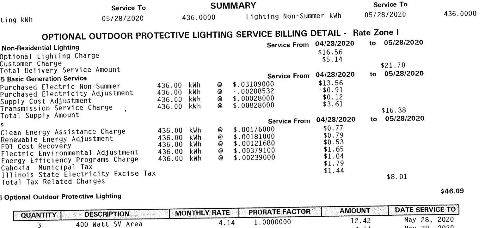

The image is a photo of a billing statement for "Optional Outdoor Protective Lighting Service Billing Detail - Rate Zone I." 

- **Service Period**: From 04/28/2020 to 05/28/2020
- **Summary**: 
  - **Lighting kWh**: 436.0000
  - **Lighting Non-Summer kWh**: 436.0000
- **Charges**:
  - **Optional Lighting Charge**: $16.56
  - **Customer Charge**: $5.14
  - **Total Delivery Service Amount**: $21.70
- **Basic Generation Service**:
  - **Purchased Electric Non-Summer**: 436.00 kWh @ $0.03109000 = $13.56
  - **Purchased Electricity Adjustment**: 436.00 kWh @ -$0.00208532 = -$0.91
  - **Supply Cost Adjustment**: 436.00 kWh @ $0.00028000 = $0.12
  - **Transmission Service Charge**: 436.00 kWh @ $0.00828000 = $3.61
  - **Total Supply Amount**: $16.38
- **Additional Charges**:
  - **Clean Energy Assistance Charge**: 436.00 kWh @ $0.00176000 = $0.77
  - **Renewable Energy Adjustment**: 436.00 kWh @ $0.00181000 = $0.79
  - **EDT Cost Recovery**: 436.00 kWh @ $0.00121680 = $0.53
  - **Electric Environmental Adjustment**: 436.00 kWh @ $0.00379100 = $1.65
  - **Energy Efficiency Programs Charge**: 436.00 kWh @ $0.00239000 = $1.04
  - **Cahokia Municipal Tax**: $1.79
  - **Illinois State Electricity Excise Tax**: $1.44
  - **Total Tax Related Charges**: $8.01
- **Total Amount**: $46.09

- **Optional Outdoor Protective Lighting**:
  - **Quantity**: 3
  - **Description**: 400 Watt SV Area
  - **Monthly Rate**: 4.14
  - **Prorate Factor**: 1.0000000
  - **Amount**: 12.42
  - **Date Service To**: May 28, 2020

Total Optional Outdoor Protective Lighting
\$46.09

| QUANTITY | DESCRIPTION | MONTHLY RATE |  | PRORATE FACTOR | AMOUNT | DATE SERVICE TO |
| :--: | :--: | :--: | :--: | :--: | :--: | :--: |
| 3 | 400 Watt SV Area | 4.14 | 1.0000000 | 12.42 | May 28, 2020 |  |
| 1 | LED 40 Area | 4.14 | 1.0000000 | 4.14 | May 28, 2020 |  |

The current billed amount of $\$ 46.09$ is due on Aug 11, 2020 .
Current Total Due (Account) $\$ 46.09$
\$46.09

| 47557-02113 | 1401 MORNING STAR DR BLDG, EAST SAINT LOUIS, IL 62206 |  |  |  |  | May 18, 2020 |  |  |
| :--: | :--: | :--: | :--: | :--: | :--: | :--: | :--: | :--: |
| TYPE OF READING | METER NUMBER | SERVICE   FROM | $\begin{gathered} \text { NO. } \\ \text { DAYS } \end{gathered}$ | METER READING PRESENT | READING DIFFERENCE | METER   MULTIPLIER | THERM FACTOR | USAGE | $\begin{gathered} \text { R } \\ \text { D } \end{gathered}$ |
| Total kWh | 25634771 | 04/15-05/14 29 | 1181.0000 | 1274.0000 | 93.0000 | 120.0000 |  | 11160.0000 A |
|  | Service To |  |  | SUMMARY |  | Service To |  |  |
| Total kWh |  | 05/14/2020 |  | 11160.0000 | Non-Summer kWh |  | 05/14/2020 | 11160.0000 |

ELECTRIC SERVICE BILLING DETAIL - Rate Zone I
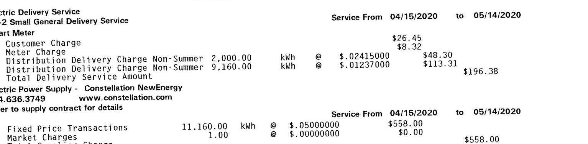

The image is a photo of a billing statement for electric delivery service. 

- **Service Period**: From 04/15/2020 to 05/14/2020
- **Charges**:
  - **Customer Charge**: $26.45
  - **Meter Charge**: $8.32
  - **Distribution Delivery Charge Non-Summer**:
    - 2,000.00 kWh @ $0.02415000 = $48.30
    - 9,160.00 kWh @ $0.01237000 = $113.31
  - **Total Delivery Service Amount**: $196.38
- **Electric Power Supply**: Constellation NewEnergy
  - **Contact**: 844.636.3749, www.constellation.com
- **Fixed Price Transactions**:
  - 11,160.00 kWh @ $0.05000000 = $558.00
- **Market Charges**:
  - 1.00 @ $0.00000000 = $0.00
- **Total Supplier Charges**: $558.00

# Ameren 

## ILLINOIS

## SUMMARY ACCOUNT LISTING: 01393-65773 CAHOKIA PUBLIC SCHOOL

| Taxes | Service From | 04/15/2020 | to | 05/14/2020 |  |
| :--: | :--: | :--: | :--: | :--: | :--: |
| Customer Generation Charge | 11,160.00 kWh |  |  |  |  |
| Clean Energy Assistance Charge | 11,160.00 kWh |  |  |  |  |
| Renewable Energy Adjustment | 11,160.00 kWh |  |  |  |  |
| EDT Cost Recovery | 11,160.00 kWh |  |  |  |  |
| Electric Environmental Adjustment | 11,160.00 kWh |  |  |  |  |
| Energy Efficiency Programs Charge | 11,160.00 kWh |  |  |  |  |
| Cahokia Municipal Tax |  |  |  |  |  |
| Illinois State Electricity Excise Tax |  |  |  |  |  |
| Total Tax Related Charges |  |  |  |  |  |

Total Electric Charges
\$922.95
The current billed amount of $\$ 922.95$ is due on Aug 11, 2020.
Current Total Due (Account) $\$ 922.95$
55557-02116 1401 MORNING STAR DR, SIREN, CAHOKIA, IL 62206

| TYPE OF   READING | METER NUMBER | SERVICE FROM TO | $\begin{gathered} \text { NO. } \\ \text { DAYS } \end{gathered}$ | METER READING |  | READING   DIFFERENCE | METER MULTIPLIER | THERM   FACTOR | USAGE | R   D |
| :--: | :--: | :--: | :--: | :--: | :--: | :--: | :--: | :--: | :--: | :--: |
| Total kWh | 73031320 | 04/15-05/14 | 29 | 0.0000 | 0.0000 | 0.0000 | 1.0000 |  | 0.0000 A |  |
|  | Service To |  |  | SUMMARY |  |  | Service To |  |  |  |
| Total kWh |  | 05/14/2020 |  | 0.0000 |  |  |  |  |  |  |

ELECTRIC SERVICE BILLING DETAIL - Rate Zone I
DS-2 Small General Delivery Service
Service From 04/15/2020 to 05/14/2020
Smart Meter
Customer Charge
Meter Charge
Total Delivery Service Amount
BGS-2 Basic Generation Service
Purchased Electricity Adjustment
Total Supply Amount
Taxes
Customer Generation Charge
Total Tax Related Charges
\$26.45
\$8.32
\$34.77
Service From 04/15/2020 to 05/14/2020
Total Tax Related Charges
\$0.00 kWh
$0.00 \quad \mathrm{kWh}$
$0.00 \quad \mathrm{kWh}$
$0.00 \quad \mathrm{kWh}$
$0.00 \quad \mathrm{kWh}$
$0.00 \quad \mathrm{kWh}$
$0.00 \quad \mathrm{kWh}$
$0.00 \quad \mathrm{kWh}$
$0.00 \quad \mathrm{kWh}$
$0.00 \quad \mathrm{kWh}$
$0.00 \quad \mathrm{kWh}$
$0.00 \quad \mathrm{kWh}$
$0.00 \quad \mathrm{kWh}$
$0.00 \quad \mathrm{kWh}$
Total Electric Charges
Current Total Due (Account)
\$34.86
$R E$
$R_{C} \ldots 17,000$
$R_{C} \ldots 17,000$
May 19, 2020
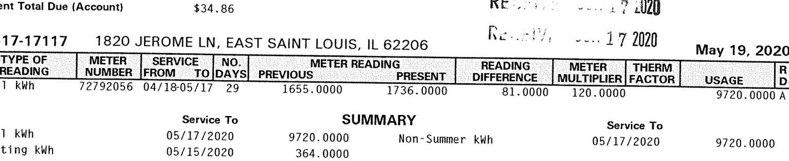

The image is a photo of a utility bill statement. It contains the following details:

- **Address**: 1820 Jerome Ln, East Saint Louis, IL 62206
- **Date**: May 19, 2020
- **Total Due**: $34.86

**Meter Information**:
- **Type of Reading**: Total kWh
- **Meter Number**: 72792056
- **Service From/To**: 04/18-05/17
- **Number of Days**: 29
- **Meter Reading Previous**: 1655.0000
- **Meter Reading Present**: 1736.0000
- **Reading Difference**: 81.0000
- **Meter Multiplier**: 120.0000
- **Therm Factor**: Not specified
- **Usage**: 9720.0000 A

**Summary**:
- **Total kWh**: 9720.0000
- **Non-Summer kWh**: 364.0000
- **Service To**: 05/17/2020

ELECTRIC SERVICE BILLING DETAIL - Rate Zone I

| Electric Delivery Service |  |  |  |  |  |  |  |  |  |
| :--: | :--: | :--: | :--: | :--: | :--: | :--: | :--: | :--: | :--: |
| DS-2 Small General Delivery Service |  |  |  | Service From | 04/18/2020 |  | to | 05/17/2020 |  |
| Smart Meter |  |  |  |  |  |  |  |  |  |
| Customer Charge |  |  |  |  | \$26.45 |  |  |  |  |
| Meter Charge |  |  |  |  |  |  |  |  |  |
| Distribution Delivery Charge Non-Summer |  |  | 2,000.00 | kWh |  | \$. 02415000 |  | \$48.30 |  |
| Distribution Delivery Charge Non-Summer |  |  | 7,720.00 | kWh |  | \$. 01237000 |  | \$95.50 |  |
| Total Delivery Service Amount |  |  |  |  |  |  |  | \$178.57 |  |
| Electric Power Supply - Constellation NewEnergy |  |  |  |  |  |  |  |  |  |
| 844.636.3749 www. constellation.com |  |  |  |  |  |  |  |  |  |
| Refer to supply contract for details |  |  |  | Service From | 04/18/2020 |  | to | 05/17/2020 |  |
| Fixed Price Transactions |  | 9,720.00 | kWh |  | \$. 05000000 |  | \$486.00 |  |  |
| Market Charges |  | 1.00 |  | \$. 00000000 |  |  | \$0.00 |  |  |
| Total Supplier Charge |  |  |  |  |  |  |  | \$486.00 |  |

SUMMARY ACCOUNT LISTING: 01393-65773 CAHOKIA PUBLIC SCHOOL

| Taxes | Service From | 04/18/2020 | to | 05/17/2020 |
| :--: | :--: | :--: | :--: | :--: |
| Customer Generation Charge | $9,720.00 \mathrm{kWh}$ | 8.00176000 | \$17.11 |  |
| Clean Energy Assistance Charge | 9,720.00 kWh | 8.00181000 | \$17.59 |  |
| Renewable Energy Adjustment | 9,720.00 kWh | 8.00121680 | \$11.83 |  |
| EDT Cost Recovery | 9,720.00 kWh | 8.00121680 | \$11.83 |  |
| Electric Environmental Adjustment | 9,720.00 kWh | 8.00175910 | \$17.10 |  |
| Energy Efficiency Programs Charge | 9,720.00 kWh | 8.00239000 | \$23.23 |  |
| Cahokia Municipal Tax |  |  | \$29.06 |  |
| Illinois State Electricity Excise Tax |  |  | \$31.23 |  |
| Total Tax Related Charges |  |  |  | \$147.24 |

# TOTAL ELECTRIC Charges 

### 5811.81

## OPTIONAL OUTDOOR PROTECTIVE LIGHTING SERVICE BILLING DETAIL - Rate Zone I

## Electric Delivery Service

DS-5 Non-Residential Lighting
Optional Lighting Charge
Total Delivery Service Amount
Electric Power Supply - Constellation NewEnergy
844.636.3749 www.constellation.com

Refer to supply contract for details

| Fixed Price Transactions | 364.00 kWh | 8.05000000 |  | 05/15/2020 |
| :--: | :--: | :--: | :--: | :--: |
| Market Charges | 1.00 | 8.00000000 |  | \$0.20 |
| Total Supplier Charge |  |  |  | \$18.20 |
| Taxes | Service From | 04/16/2020 | to | 05/15/2020 |
| Clean Energy Assistance Charge | 364.00 kWh | 8.00176000 | \$0.64 |  |
| Renewable Energy Adjustment | 364.00 kWh | 8.00181000 | \$0.66 |  |
| EDT Cost Recovery | 364.00 kWh | 8.00121680 | \$0.44 |  |
| Electric Environmental Adjustment | 364.00 kWh | 8.00379100 | \$1.38 |  |
| Energy Efficiency Programs Charge | 364.00 kWh | 8.00239000 | \$0.87 |  |
| Cahokia Municipal Tax |  |  | \$1.50 |  |
| Illinois State Electricity Excise Tax |  |  | \$1.20 |  |
| Total Tax Related Charges |  |  |  | \$6.69 |

Total Optional Outdoor Protective Lighting
\$49.60

| QUANTITY | DESCRIPTION | MONTHLY RATE | PRORATE FACTOR | AMOUNT | DATE SERVICE TO |
| :--: | :--: | :--: | :--: | :--: | :--: |
| 2 | 400 Watt SV Area | 4.14 | 1.0000000 | 8.28 | May 15, 2020 |
| 1 | Wood Pole | 6.26 | 1.0000000 | 6.26 | May 15, 2020 |
| 1 | Std Overhead Span | 1.89 | 1.0000000 | 1.89 | May 15, 2020 |
| 2 | 400 Watt SV Area LED | 4.14 | 1.0000000 | 8.28 | May 15, 2020 |

The current billed amount of $\$ 861.41$ is due on Aug 11, 2020 .
Current Total Due (Account)
\$861.41
57557-02112 1401 MORNING STAR DR, EAST SAINT LOUIS, IL 62206
May 20, 2020

|  | Service To | SUMMARY |  | Service To |
| :--: | :--: | :--: | :--: | :--: |
| Lighting kWh | 05/19/2020 | 656.0000 |  |  |
| OPTIONAL OUTDOOR PROTECTIVE LIGHTING SERVICE BILLING DETAIL - Rate Zone I |  |  |  |  |
| Electric Delivery Service |  |  |  |  |
| DS-5 Non-Residential Lighting |  | Service From | 04/20/2020 | to 05/19/2020 |
| Optional Lighting Charge |  |  | \$53.30 |  |
| Customer Charge |  |  | \$5.14 | \$58.44 |
| Total Delivery Service Amount |  |  |  |  |
| Electric Power Supply - Constellation NewEnergy |  |  |  |  |
| 844.636.3749 www.constellation.com |  |  |  |  |
| Refer to supply contract for details |  | Service From | 04/20/2020 | to 05/19/2020 |
| Fixed Price Transactions | 656.00 kWh | 8.05000000 | \$32.80 |  |
| Market Charges | 1.00 | 8.00000000 | \$0.00 |  |
| Total Supplier Charge |  |  |  | \$32.80 |

# Ameren 

## ILLINOIS

## SUMMARY ACCOUNT LISTING: 01393-65773 CAHOKIA PUBLIC SCHOOL

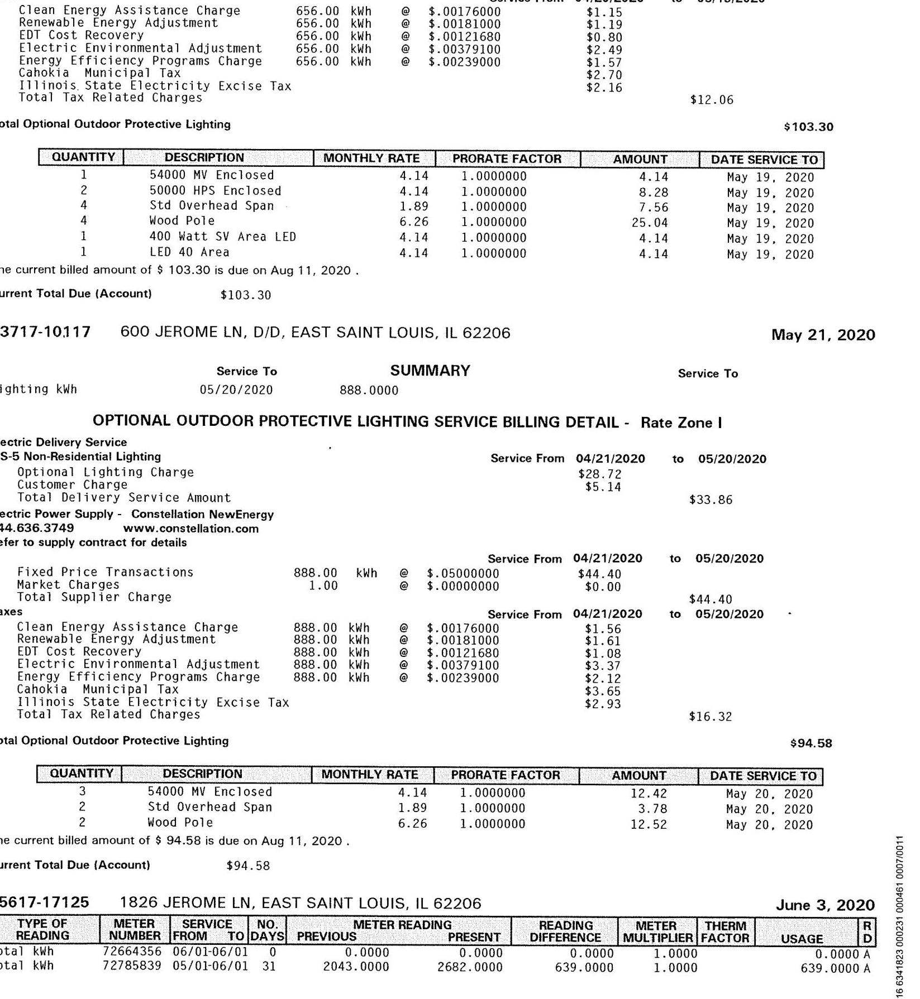

The image is a photo of a utility bill document. It contains detailed billing information for electric services, including charges, rates, and usage details.

- **Text and Structure:**
  - The document is titled "OPTIONAL OUTDOOR PROTECTIVE LIGHTING SERVICE BILLING DETAIL - Rate Zone I."
  - It includes sections for "Electric Delivery Service" and "Electric Power Supply - Constellation NewEnergy."
  - Service period is from "04/21/2020 to 05/20/2020."
  - There are tables listing "QUANTITY," "DESCRIPTION," "MONTHLY RATE," "PRORATE FACTOR," "AMOUNT," and "DATE SERVICE TO."
  - Specific descriptions include "54000 MV Enclosed," "50000 HPS Enclosed," "Std Overhead Span," "Wood Pole," and "400 Watt SV Area LED."
  - Charges include "Clean Energy Assistance Charge," "Renewable Energy Adjustment," "EDT Cost Recovery," "Electric Environmental Adjustment," "Energy Efficiency Programs Charge," "Cahokia Municipal Tax," and "Illinois State Electricity Excise Tax."
  - Total charges and amounts due are specified, with a current total due of "$94.58" and "$103.30" for different sections.

- **Spatial Relationships:**
  - The document is organized into sections with headings and tables.
  - The tables are aligned with columns for different billing details.
  - Dates and service descriptions are aligned with corresponding charges and amounts.

- **Additional Information:**
  - The document includes addresses: "600 JEROME LN, D/D, EAST SAINT LOUIS, IL 62206" and "1826 JEROME LN, EAST SAINT LOUIS, IL 62206."
  - Dates mentioned include "May 21, 2020" and "June 3, 2020."
  - The document references "Constellation NewEnergy" and provides a contact number "844.636.3749" and website "www.constellation.com."

The document is a detailed utility bill with specific charges and service details for outdoor lighting.

# Ameren   ILLINOIS 

## SUMMARY ACCOUNT LISTING: 01393-65773 CAHOKIA PUBLIC SCHOOL

|  | Service To | SUMMARY | Service To |
| :--: | :--: | :--: | :--: |
| Total kWh | 06/01/2020 | 639.0000 | Summer kWh |

## SCHOL

Non-Summer kWh
$06 / 01 / 2020$
618.0000

SCHOL - Rate Zone I

| Electric Delivery Service |  |  |  |  |
| :--: | :--: | :--: | :--: | :--: |
| DS-2 Small General Delivery Service |  | Service From | 05/01/2020 | to 06/01/2020 |
| Smart Meter |  |  |  |  |
| Customer Charge |  | \$26.67 |  |  |
| Meter Charge |  | \$0.32 |  |  |
| Distribution Delivery Charge Summer | 21.00 kWh | 0 \$. 04528000 | $\$ 0.95$ |  |
| Distribution Delivery Charge Non-Summer | 618.00 | kWh 0 \$ . 02415000 | $\$ 14.92$ |  |
| Total Delivery Service Amount |  |  |  | \$50.86 |
| Electric Power Supply - Constellation NewEnergy |  |  |  |  |
| 844.636.3749 www.constellation.com |  |  |  |  |
| Refer to supply contract for details |  | Service From | 05/01/2020 | to 06/01/2020 |
| Fixed Price Transactions | 639.00 kWh | 0 \$ . 05000000 | $\$ 31.95$ |  |
| Market Charges | 1.00 | 0 \$ . 00000000 | $\$ 0.00$ |  |
| Total Supplier Charge |  |  | \$31.95 |  |
| Taxes |  | Service From | 05/01/2020 | to 06/01/2020 |
| Customer Generation Charge |  | \$0.09 |  |  |
| Clean Energy Assistance Charge | 639.00 kWh | 0 \$ . 00179000 | $\$ 1.14$ |  |
| Renewable Energy Adjustment | 639.00 kWh | 0 \$ . 00181000 | $\$ 1.16$ |  |
| EDT Cost Recovery | 639.00 kWh | 0 \$ . 00121680 | $\$ 0.78$ |  |
| Electric Environmental Adjustment | 639.00 kWh | 0 \$ . 00206770 | $\$ 1.32$ |  |
| Energy Efficiency Programs Charge | 639.00 kWh | 0 \$ . 00239000 | $\$ 1.53$ |  |
| Cahokia Municipal Tax |  |  | \$2.63 |  |
| Illinois State Electricity Excise Tax |  |  | \$2.11 |  |
| Total Tax Related Charges |  |  |  | \$10.76 |

Total Electric Charges
\$93.57
The current billed amount of $\$ 93.57$ is due on Aug 11, 2020 .
Current Total Due (Account)
\$93.57
RECEIVED JUN 172020
May 19, 2020

| TYPE OF   READING | METER NUMBER | SERVICE   FROM | $\begin{gathered} \text { N0. } \\ \text { TO } \end{gathered}$ | METER READING |  | READING | METER | THERM |  |  |
| :--: | :--: | :--: | :--: | :--: | :--: | :--: | :--: | :--: | :--: | :--: |
|  |  |  |  | PREVIOUS | PRESENT | DIFFERENCE | MULTIPLIER | FACTOR | USAGE | D |
| Total kWh | 72022461 | 04/16-05/17 | 31 | 156.0000 | 164.0000 | 8.0000 | 1.0000 |  | 8.0000 A |  |
| Total kWh | 72306281 | 04/16-05/17 | 31 | 15737.0000 | 17296.0000 | 1559.0000 | 1.0000 |  | 1559.0000 A |  |
|  |  | Service To | SUMMARY |  |  |  | Service To |  |  |  |
| Total kWh |  | 05/17/2020 | 1567.0000 | Non-Summer kWh |  |  | 05/17/2020 |  | 1567.0000 |  |

ELECTRIC SERVICE BILLING DETAIL - Rate Zone I
Electric Delivery Service
DS-2 Small General Delivery Service
Service From 04/16/2020 to 05/17/2020
Smart Meter
Customer Charge
Meter Charge
Distribution Delivery Charge Non-Summer 1,567.00 kWh
\$26.45
\$8.32
Total Delivery Service Amount
Electric Power Supply - Constellation NewEnergy
844.636.3749 www.constellation.com

| 844.636.3749 |  |  |  |  |
| :--: | :--: | :--: | :--: | :--: |
|  |  | Service From | 04/16/2020 | to 05/17/2020 |
| Fixed Price Transactions | 1,567.00 kWh | 0 \$ . 05000000 | $\$ 78.35$ |  |
| Market Charges | 1.00 | 0 \$ . 00000000 | $\$ 0.00$ |  |
| Total Supplier Charge |  |  |  | $\$ 78.35$ |

# Ameren 

## ILLINOIS

## SUMMARY ACCOUNT LISTING: 01393-65773 CAHOKIA PUBLIC SCHOOL

| Taxes | Service From | 04/16/2020 | to | 05/17/2020 |
| :--: | :--: | :--: | :--: | :--: |
| Customer Generation Charge | $\$ 0.09$ |  |  |  |
| Clean Energy Assistance Charge | 1,567.00 kWh | @ \$. 00176000 | \$2.76 |  |
| Renewable Energy Adjustment | 1,567.00 kWh | @ \$. 00181000 | \$2.84 |  |
| EDT Cost Recovery | 1,567.00 kWh | @ \$. 00121680 | \$1.91 |  |
| Electric Environmental Adjustment | 1,567.00 kWh | @ \$. 00175910 | \$2.76 |  |
| Energy Efficiency Programs Charge | 1,567.00 kWh | @ \$. 00239000 | \$3.75 |  |
| Cahokia Municipal Tax |  |  | \$6.44 |  |
| Illinois State Electricity Excise Tax |  |  | \$5.17 |  |
| Total Tax Related Charges |  |  |  | \$25.72 |

Total Electric Charges
$\$ 176.68$
The current billed amount of $\$ 176.68$ is due on Aug 11, 2020 .

| TYPE OF   READING | METER   NUMBER | SERVICE   FROM | $\begin{gathered} \text { NO. } \\ \text { DAYS } \end{gathered}$ | METER READING |  | READING | METER | THERM |  |
| :--: | :--: | :--: | :--: | :--: | :--: | :--: | :--: | :--: | :--: |
|  |  |  |  | PREVIOUS | PRESENT | DIFFERENCE | MULTIPLIER | FACTOR |  |
| Total kWh | 72388714 | 05/08-06/09 | 32 | 0.0000 | 59149.0000 | 59149.0000 | 1.0000 |  | 59149.0000 A |
| On Peak kWh | 72388714 | 05/08-06/09 | 32 | 0.0000 | 19866.0000 | 19866.0000 | 1.0000 |  | 19866.0000 A |
| Off Peak kWh | 72388714 | 05/08-06/09 | 32 | 0.0000 | 39283.0000 | 39283.0000 | 1.0000 |  | 39283.0000 A |
| Peak kW | 72388714 | 05/08-06/09 | 32 | 0.0000 | 120.7200 | 120.7200 | 1.0000 |  | 120.7200 A |
| On Peak kW | 72388714 | 05/08-06/09 | 32 | 0.0000 | 120.7200 | 120.7200 | 1.0000 |  | 120.7200 A |
| Off Peak kW | 72388714 | 05/08-06/09 | 32 | 0.0000 | 114.0480 | 114.0480 | 1.0000 |  | 114.0480 A |
|  | Service To |  |  | SUMMARY |  |  | Service To |  |  |
| Total kWh |  | 06/09/2020 |  | 59149.0000 | On-Peak kWh |  | 06/09/2020 |  | 19866.0000 |
| Off-Peak kWh |  | 06/09/2020 |  | 39283.0000 | Peak kW |  | 06/09/2020 |  | 120.7000 |
| On-Peak kW |  | 06/09/2020 |  | 120.7000 | Off-Peak kW |  | 06/09/2020 |  | 114.0000 |
| 12 Month Max Demand |  | 06/09/2020 |  | 299.9000 |  |  |  |  |  |

ELECTRIC SERVICE BILLING DETAIL - Rate Zone I
Electric Delivery Service
DS-3 General Delivery Service < 400 kW
S
Service From 05/08/2020 to 06/09/2020

| Smart Meter |  |  |  |  |
| :--: | :--: | :--: | :--: | :--: |
| Customer Charge |  |  |  | \$45.58 |
| Meter Charge |  |  |  | \$11.39 |
| Distribution Delivery kW Charge | 120.70 kW | @ \$7.00800000 |  | \$845.87 |
| Transformation Charge | 299.90 kW | @ \$. 59000000 |  | \$176.94 |
| Total Delivery Service Amount |  |  |  | \$1,079.78 |
| Electric Power Supply - Constellation NewEnergy 044.636.3749 |  |  |  |  |
|  |  |  | Service From | 05/08/2020 |
| Fixed Price Transactions | 59,149.25 kWh | @ \$. 05000000 | \$2,957.46 |  |
| Market Charges | 1.00 | @ \$. 00000000 |  | \$0.00 |
| Total Supplier Charge |  |  |  | \$2,957.46 |
| Taxes |  |  | Service From | 05/08/2020 |
| Customer Generation Charge |  |  |  | \$15.25 |
| Clean Energy Assistance Charge | 59,149.00 kWh | @ \$. 00179000 |  | \$105.88 |
| Renewable Energy Adjustment | 59,149.00 kWh | @ \$. 00181000 |  | \$107.06 |
| EDT Cost Recovery | 59,149.00 kWh | @ \$. 00121680 |  | \$71.97 |
| Electric Environmental Adjustment | 59,149.00 kWh | @ \$. 00115960 |  | \$68.59 |
| Energy Efficiency Programs Charge | 59,149.00 kWh | @ \$. 00112000 |  | \$66.25 |
| Cahokia Municipal Tax |  |  |  | \$160.01 |
| Illinois State Electricity Excise Tax |  |  |  | \$187.44 |
| Total Tax Related Charges |  |  |  | \$782.45 |

Total Electric Charges
\$4,819.69
The current billed amount of $\$ 4,819.69$ is due on Aug 11, 2020 .

| Current Total Due (Account) | $\$ 4,819.69$ |  |  |  |
| :--: | :--: | :--: | :--: | :--: |
| 84956-09116 | 1010 JEROME LN, LIGHTS, EAST SAINT LOUIS, IL 62206 |  |  | May 18, 2020 |
|  | Service To | SUMMARY |  | Service To |
| Lighting kWh | 05/15/2020 | 3197.0000 |  |  |
|  |  |  |  |  |

# Ameren 

## ILLINOIS

## SUMMARY ACCOUNT LISTING: 01393-65773 CAHOKIA PUBLIC SCHOOL

OPTIONAL OUTDOOR PROTECTIVE LIGHTING SERVICE BILLING DETAIL - Rate Zone I
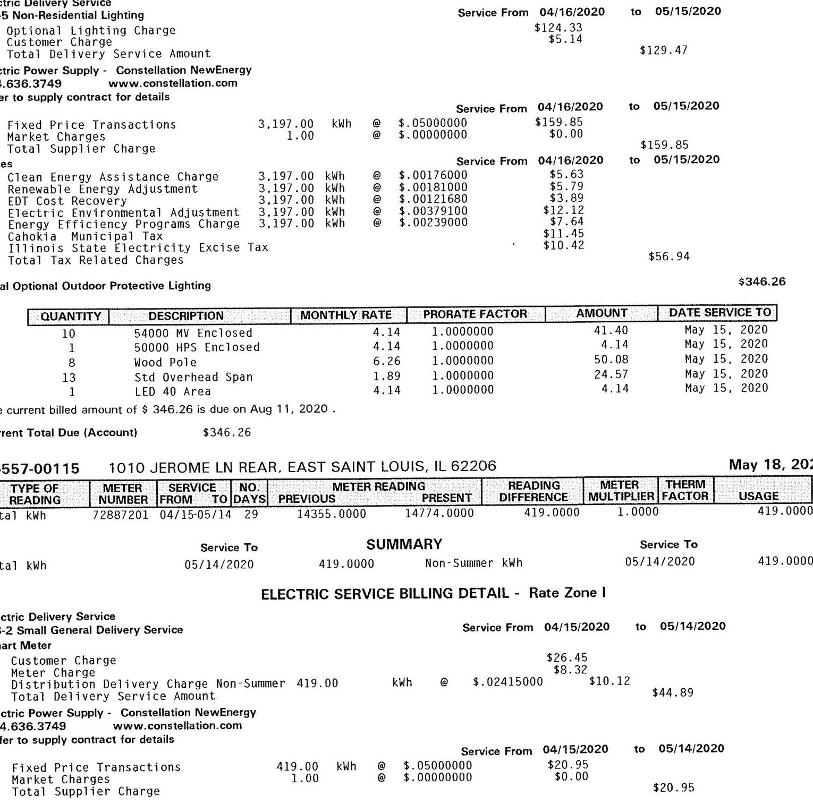

The image is a photo of a utility bill detailing electric service charges. 

- **Service Period**: 04/16/2020 to 05/15/2020
- **Total Amount Due**: $346.26
- **Supplier**: Constellation NewEnergy
- **Service Address**: 1010 Jerome Ln Rear, East Saint Louis, IL 62206
- **Date**: May 18, 2020

**Charges Breakdown**:
- **Non-Residential Lighting**:
  - Optional Lighting Charge: $124.33
  - Customer Charge: $5.14
  - Total Delivery Service Amount: $129.47

- **Electric Power Supply**:
  - Fixed Price Transactions: 3,197.00 kWh @ $0.05000000 = $159.85
  - Market Charges: 1.00 @ $0.00000000 = $0.00
  - Total Supplier Charge: $159.85

- **Taxes**:
  - Clean Energy Assistance Charge: $5.63
  - Renewable Energy Adjustment: $5.79
  - EDT Cost Recovery: $3.29
  - Electric Environmental Adjustment: $12.12
  - Energy Efficiency Programs Charge: $7.64
  - Illinois State Electricity Excise Tax: $10.42
  - Total Tax Related Charges: $56.94

**Optional Outdoor Protective Lighting**:
- **Quantity and Description**:
  - 10 x 54000 MV Enclosed: $41.40
  - 1 x 50000 HPS Enclosed: $4.14
  - 8 x Wood Pole: $50.08
  - 13 x Std Overhead Span: $24.57
  - 1 x LED 40 Area: $4.14

**Meter Reading**:
- **Meter Number**: 72882701
- **Service From**: 04/15/2014
- **Previous Reading**: 14355.0000
- **Present Reading**: 14774.0000
- **Reading Difference**: 419.0000
- **Therm Factor**: 1.0000
- **Usage**: 419.0000 Non-Summer kWh

**Electric Service Billing Detail - Rate Zone I**:
- **Service From**: 04/15/2020 to 05/14/2020
- **Customer Charge**: $26.45
- **Distribution Delivery Charge Non-Summer**: 419.00 kWh @ $0.02415000 = $10.12
- **Total Delivery Service Amount**: $44.89

**Electric Power Supply**:
- **Fixed Price Transactions**: 419.00 kWh @ $0.05000000 = $20.95
- **Market Charges**: 1.00 @ $0.00000000 = $0.00
- **Total Supplier Charge**: $20.95

# Ameren   ILLINOIS 

## SUMMARY ACCOUNT LISTING: 01393-65773 CAHOKIA PUBLIC SCHOOL

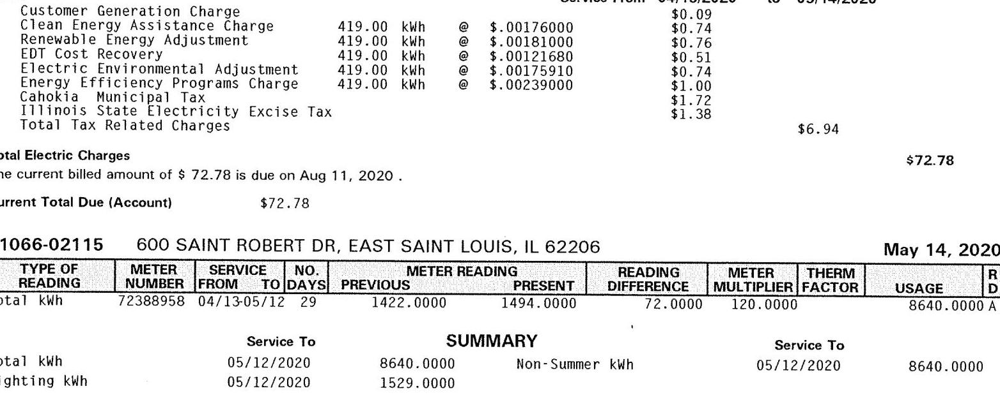

The image is a photo of a billing statement. 

Embedded text includes:

- Customer Generation Charge
- Clean Energy Assistance Charge
- Renewable Energy Adjustment
- EDT Cost Recovery
- Electric Environmental Adjustment
- Energy Efficiency Programs Charge
- Cahokia Municipal Tax
- Illinois State Electricity Excise Tax
- Total Tax Related Charges
- Total Electric Charges
- The current billed amount of $72.78 is due on Aug 11, 2020.
- Current Total Due (Account) $72.78
- 1066-02115
- 600 SAINT ROBERT DR, EAST SAINT LOUIS, IL 62206
- May 14, 2020
- TYPE OF READING
- METER NUMBER
- SERVICE FROM
- SERVICE TO
- NO. DAYS
- METER READING PREVIOUS
- METER READING PRESENT
- READING DIFFERENCE
- METER MULTIPLIER
- THERM FACTOR
- USAGE
- Total kWh
- Lighting kWh
- SUMMARY
- 72388958
- 04/13-05/12
- 29
- 1422.0000
- 1494.0000
- 72.0000
- 120.0000
- 8640.0000
- Non-Summer kWh
- 05/12/2020
- 8640.0000
- 1529.0000

## ELECTRIC SERVICE BILLING DETAIL - Rate Zone I

## Electric Delivery Service

DS-2 Small General Delivery Service
Service From 04/13/2020 to 05/12/2020
Smart Meter
Customer Charge
Meter Charge
Distribution Delivery Charge Non-Summer 2,000.00
Distribution Delivery Charge Non-Summer 6,640.00
Total Delivery Service Amount
*26.45
*2.02415000
*48.30
*82.14

Electric Power Supply - Constellation NewEnergy
844.636.3749
*165.21

## www. constellation.com

Refer to supply contract for details
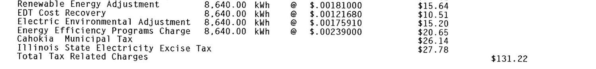

The image is a photo of a billing statement section detailing various charges. 

Embedded text includes:

- Renewable Energy Adjustment 8,640.00 kWh @ $.00181000 $15.64
- EDT Cost Recovery 8,640.00 kWh @ $.00121680 $10.51
- Electric Environmental Adjustment 8,640.00 kWh @ $.00175910 $15.20
- Energy Efficiency Programs Charge 8,640.00 kWh @ $.00239000 $20.65
- Cahokia Municipal Tax $26.14
- Illinois State Electricity Excise Tax $27.78
- Total Tax Related Charges $131.22

## TOTIONAL OUTDOOR PROTECTIVE LIGHTING SERVICE BILLING DETAIL - Rate Zone I

## Electric Delivery Service

DS-5 Non-Residential Lighting
Optional Lighting Charge
Total Delivery Service Amount
*21.62
*2.05000000
*20.09
*31.62

Electric Power Supply - Constellation NewEnergy
844.636.3749
*113.21

## www. constellation.com

Refer to supply contract for details
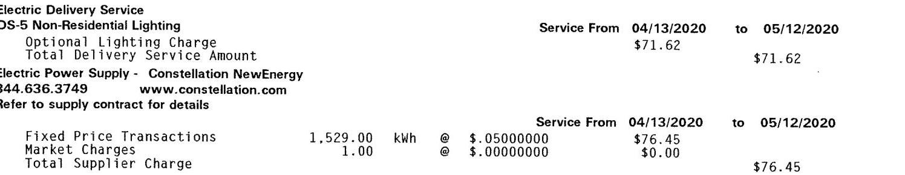

The image is a photo of a billing statement section detailing electric delivery and supply charges. 

Embedded text includes:

- **Electric Delivery Service**
- **DS-5 Non-Residential Lighting**
- Optional Lighting Charge
- Total Delivery Service Amount
- Service From 04/13/2020 to 05/12/2020
- $71.62
- $71.62

- **Electric Power Supply - Constellation NewEnergy**
- 844.636.3749
- www.constellation.com
- Refer to supply contract for details

- **Fixed Price Transactions**
- 1,529.00 kWh @ $.05000000 $76.45
- **Market Charges**
- 1.00 @ $.00000000 $0.00
- **Total Supplier Charge**
- $76.45

SUMMARY ACCOUNT LISTING: 01393-65773 CAHOKIA PUBLIC SCHOOL

| Taxes | Service From | 04/13/2020 | to | 05/12/2020 |
|----------------------------|---------|---------|---------|---------|
| Clean Energy Assistance Charge | 1,529.00 kWh | @ | $.00176000 | $2.69 |
| Renewable Energy Adjustment | 1,529.00 kWh | @ | $.00181000 | $2.77 |
| EDT Cost Recovery | 1,529.00 kWh | @ | $.00121680 | $1.86 |
| Electric Environmental Adjustment | 1,529.00 kWh | @ | $.00379100 | $5.80 |
| Energy Efficiency Programs Charge | 1,529.00 kWh | @ | $.00239000 | $3.65 |
| Cahokia Municipal Tax | $6.28 |  |  | $6.28 |
| Illinois State Electricity Excise Tax | $5.05 |  |  | $28.10 |
| Total Tax Related Charges | $28.10 |  |  | |

Total Optional Outdoor Protective Lighting $176.17

| QUANTITY | DESCRIPTION | MONTHLY RATE | PRORATE FACTOR | AMOUNT | DATE SERVICE TO |
|---------|---------|---------|---------|---------|---------|
| 4  | 54000 MV Enclosed | 4.14 | 1.0000000 | 16.56 | May 12, 2020 |
| 1  | 400 Watt SV Area | 4.14 | 1.0000000 | 4.14 | May 12, 2020 |
| 1  | 400 Watt MH Area | 4.14 | 1.0000000 | 4.14 | May 12, 2020 |
| 6  | Std Overhead Span | 1.89 | 1.0000000 | 11.34 | May 12, 2020 |
| 5  | Wood Pole | 6.26 | 1.0000000 | 31.30 | May 12, 2020 |
| 1  | LED 40 Area | 4.14 | 1.0000000 | 4.14 | May 12, 2020 |

The current billed amount of $ 904.60 is due on Aug 11, 2020.

| 95557-00114 | 1012 JEROME LN, EAST SAINT LOUIS, IL 62206 | May 18, 2020 |  |  |  |  |  |  |
|----------------------------|---------|---------|---------|---------|---------|
| 95557-00114 | 1012 JEROME LN, EAST SAINT LOUIS, IL 62206 | May 18, 2020 |  |  |  |  |  |  |
|----------------------------|---------|---------|---------|---------|---------|
| 95557-00114 | 1012 JEROME LN, EAST SAINT LOUIS, IL 62206 | May 18, 2020 |  |  |  |  |  |  |
|----------------------------|---------|---------|---------|---------|---------|
| 95557-00114 | 1012 JEROME LN, EAST SAINT LOUIS, IL 62206 | May 18, 2020 |  |  |  |  |  |  |
|----------------------------|---------|---------|---------|---------|---------|
| 95557-00114 | 1012 JEROME LN, EAST SAINT LOUIS, IL 62206 | May 18, 2020 |  |  |  |  |  |  |
|----------------------------|---------|---------|---------|---------|---------|
| 95557-00114 | 1012 JEROME LN, EAST SAINT LOUIS, IL 62206 | May 18, 2020 |  |  |  |  |  |  |
|----------------------------|---------|---------|---------|---------|---------|
| 95557-00114 | 1012 JEROME LN, EAST SAINT LOUIS, IL 62206 | May 18, 2020 |  |  |  |  |  |  |
|----------------------------|---------|---------|---------|---------|---------|
| 95557-00114 | 1012 JEROME LN, EAST SAINT LOUIS, IL 62206 | May 18, 2020 |  |  |  |  |  |  |
|----------------------------|---------|---------|---------|---------|---------|
| 95557-00114 | 1012 JEROME LN, EAST SAINT LOUIS, IL 62206 | May 18, 2020 |  |  |  |  |  |  |
|----------------------------|---------|---------|---------|---------|---------|
| 95557-00114 | 1012 JEROME LN, EAST SAINT LOUIS, IL 62206 | May 18, 2020 |  |  |  |  |  |  |
|----------------------------|---------|---------|---------|---------|---------|
| 95557-00114 | 1012 JEROME LN, EAST SAINT LOUIS, IL 62206 | May 18, 2020 |  |  |  |  |  |  |
|----------------------------|---------|---------|---------|---------|---------|
| 95557-00114 | 1012 JEROME LN, EAST SAINT LOUIS, IL 62206 | May 18, 2020 |  |  |  |  |  |  |
|----------------------------|---------|---------|---------|---------|---------|
| 95557-00114 | 1012 JEROME LN, EAST SAINT LOUIS, IL 62206 | May 18, 2020 |  |  |  |  |  |  |
|----------------------------|---------|---------|---------|---------|---------|
| 95557-00114 | 1012 JEROME LN, EAST SAINT LOUIS, IL 62206 | May 18, 2020 |  |  |  |  |  |  |
|----------------------------|---------|---------|---------|---------|---------|
| 95557-00114 | 1012 JEROME LN, EAST SAINT LOUIS, IL 62206 | May 18, 2020 |  |  |  |  |  |  |
|----------------------------|---------|---------|---------|---------|---------|
| 95557-00114 | 1012 JEROME LN, EAST SAINT LOUIS, IL 62206 | May 18, 2020 |  |  |  |  |  |  |
|----------------------------|---------|---------|---------|---------|---------|
| 95557-00114 | 1012 JEROME LN, EAST SAINT LOUIS, IL 62206 | May 18, 2020 |  |  |  |  |  |  |
|----------------------------|---------|---------|---------|---------|---------|
| 95557-00114 | 1012 JEROME LN, EAST SAINT LOUIS, IL 62206 | May 18, 2020 |  |  |  |  |  |  |
|----------------------------|---------|---------|---------|---------|---------|
| 95557-00114 | 1012 JEROME LN, EAST SAINT LOUIS, IL 62206 | May 18, 2020 |  |  |  |  |  |  |
|----------------------------|---------|---------|---------|---------|
| 95557-00114 | 1012 JEROME LN, EAST SAINT LOUIS, IL 62206 | May 18, 2020 |  |  |  |  |  |  |
|----------------------------|---------|---------|---------|---------|
| 95557-00114 | 1012 JEROME LN, EAST SAINT LOUIS, IL 62206 | May 18, 2020 |  |  |  |  |  |  |
|----------------------------|---------|---------|---------|---------|
| 95557-00114 | 1012 JEROME LN, EAST SAINT LOUIS, IL 62206 | May 18, 2020 |  |  |  |  |  |  |
|----------------------------|---------|---------|---------|---------|
| 95557-00114 | 1012 JEROME LN, EAST SAINT LOUIS, IL 62206 | May 18, 2020 |  |  |  |  |  |  |
|----------------------------|---------|---------|---------|---------|
| 95557-00114 | 1012 JEROME LN, EAST SAINT LOUIS, IL 62206 | May 18, 2020 |  |  |  |  |  |  |
|----------------------------|---------|---------|---------|---------|
| 95557-00114 | 1012 JEROME LN, EAST SAINT LOUIS, IL 62206 | May 18, 2020 |  |  |  |  |  |  |
|----------------------------|---------|---------|---------|---------|
| 95557-00114 | 1012 JEROME LN, EAST SAINT LOUIS, IL 62206 | May 18, 2020 |  |  |  |  |  |  |
|----------------------------|---------|---------|---------|---------|
| 95557-00114 | 1012 JEROME LN, EAST SAINT LOUIS, IL 62206 | May 18, 2020 |  |  |  |  |  |  |
|----------------------------|---------|---------|---------|---------|
| 95557-00114 | 1012 JEROME LN, EAST SAINT LOUIS, IL 62206 | May 18, 2020 |  |  |  |  |  |  |
|----------------------------|---------|---------|---------|---------|
| 95557-00114 | 1012 JEROME LN, EAST SAINT LOUIS, IL 62206 | May 18, 2020 |  |  |  |  |  |  |
|----------------------------|---------|---------|---------|---------|
| 95557-00114 | 1012 JEROME LN, EAST SAINT LOUIS, IL 62206 | May 18, 2020 |  |  |  |  |  |  |
|----------------------------|---------|---------|---------|---------|
| 95557-00114 | 1012 JEROME LN, EAST SAINT LOUIS, IL 62206 | May 18, 2020 |  |  |  |  |  |  |
|----------------------------|---------|---------|---------|---------|
| 95557-00114 | 1012 JEROME LN, EAST SAINT LOUIS, IL 62206 | May 18, 2020 |  |  |  |  |  |  |
|----------------------------|---------|---------|---------|---------|
| 95557-00114 | 1012 JEROME LN, EAST SAINT LOUIS, IL 62206 | May 18, 2020 |  |  |  |  |  |  |
|----------------------------|---------|---------|---------|---------|
| 95557-00114 | 1012 JEROME LN, EAST SAINT LOUIS, IL 62206 | May 18, 2020 |  |  |  |  |  |  |
|----------------------------|---------|---------|---------|---------|
| 95557-00114 | 1012 JEROME LN, EAST SAINT LOUIS, IL 62206 | May 18, 2020 |  |  |  |  |  |  |
|----------------------------|---------|---------|---------|---------|
| 95557-00114 | 1012 JEROME LN, EAST SAINT LOUIS, IL 62206 | May 18, 2020 |  |  |  |  |  |  |
|----------------------------|---------|---------|---------|---------|
| 95557-00114 | 1012 JEROME LN, EAST SAINT LOUIS, IL 62206 | May 18, 2020 |  |  |  |  |  |  |
|----------------------------|---------|---------|---------|---------|
| 95557-00114 | 1012 JEROME LN, EAST SAINT LOUIS, IL 62206 | May 18, 2020 |  |  |  |  |  |  |
|----------------------------|---------|---------|---------|---------|
| 95557-00114 | 1012 JEROME LN, EAST SAINT LOUIS, IL 62206 | May 18, 2020 |  |  |  |  |  |  |
|----------------------------|---------|---------|---------|---------|
| 95557-00114 | 1012 JEROME LN, EAST SAINT LOUIS, IL 62206 | May 18, 2020 |  |  |  |  |  |  |
|----------------------------|---------|---------|---------|---------|
| 95557-00114 | 1012 JEROME LN, EAST SAINT LOUIS, IL 62206 | May 18, 2020 |  |  |  |  |  |  |
|----------------------------|---------|---------|---------|---------|
| 95557-00114 | 1012 JEROME LN, EAST SAINT LOUIS, IL 62206 | May 18, 2020 |  |  |  |  |  |  |
|----------------------------|---------|---------|---------|---------|
| 95557-00114 | 1012 JEROME LN, EAST SAINT LOUIS, IL 62206 | May 18, 2020 |  |  |  |  |  |  |
|----------------------------|---------|---------|---------|---------|
| 95557-00114 | 1012 JEROME LN, EAST SAINT LOUIS, IL 62206 | May 18, 2020 |  |  |  |  |  |  |
|----------------------------|---------|---------|---------|---------|
| 95557-00114 | 1012 JEROME LN, EAST SAINT LOUIS, IL 62206 | May 18, 2020 |  |  |  |  |  |  |
|----------------------------|---------|---------|---------|---------|
| 95557-00114 | 1012 JEROME LN, EAST SAINT LOUIS, IL 62206 | May 18, 2020 |  |  |  |  |  |  |
|----------------------------|---------|---------|---------|---------|
| 95557-00114 | 1012 JEROME LN, EAST SAINT LOUIS, IL 62206 | May 18, 2020 |  |  |  |  |  |  |
|----------------------------|---------|---------|---------|---------|
| 95557-00114 | 1012 JEROME LN, EAST SAINT LOUIS, IL 62206 | May 18, 2020 |  |  |  |  |  |  |
|----------------------------|---------|---------|---------|---------|
| 95557-00114 | 1012 JEROME LN, EAST SAINT LOUIS, IL 62206 | May 18, 2020 |  |  |  |  |  |  |
|----------------------------|---------|---------|---------|---------|
| 95557-00114 | 1012 JEROME LN, EAST SAINT LOUIS, IL 62206 | May 18, 2020 |  |  |  |  |  |  |
|----------------------------|---------|---------|---------|---------|
| 95557-00114 | 1012 JEROME LN, EAST SAINT LOUIS, IL 62206 | May 18, 2020 |  |  |  |  |  |  |
|----------------------------|---------|---------|---------|---------|
| 95557-00114 | 1012 JEROME LN, EAST SAINT LOUIS, IL 62206 | May 18, 2020 |  |  |  |  |  |  |
|----------------------------|---------|---------|---------|---------|
| 95557-00114 | 1012 JEROME LN, EAST SAINT LOUIS, IL 62206 | May 18, 2020 |  |  |  |  |  |  |
|----------------------------|---------|---------|---------|---------|
| 95557-00114 | 1012 JEROME LN, EAST SAINT LOUIS, IL 62206 | May 18, 2020 |  |  |  |  |  |  |
|----------------------------|---------|---------|---------|---------|
| 95557-00114 | 1012 JEROME LN, EAST SAINT LOUIS, IL 62206 | May 18, 2020 |  |  |  |  |  |  |
|----------------------------|---------|---------|---------|---------|
| 95557-00114 | 1012 JEROME LN, EAST SAINT LOUIS, IL 62206 | May 18, 2020 |  |  |  |  |  |  |
|----------------------------|---------|---------|---------|---------|
| 95557-00114 | 1012 JEROME LN, EAST SAINT LOUIS, IL 62206 | May 18, 2020 |  |  |  |  |  |  |
|----------------------------|---------|---------|---------|---------|
| 95557-00114 | 1012 JEROME LN, EAST SAINT LOUIS, IL 62206 | May 18, 2020 |  |  |  |  |  |  |
|----------------------------|---------|---------|---------|---------|
| 95557-00114 | 1012 JEROME LN, EAST SAINT LOUIS, IL 62206 | May 18, 2020 |  |  |  |  |  |  |
|----------------------------|---------|---------|---------|---------|
| 95557-00114 | 1012 JEROME LN, EAST SAINT LOUIS, IL 62206 | May 18, 2020 |  |  |  |  |  |  |
|----------------------------|---------|---------|---------|---------|
| 95557-00114 | 1012 JEROME LN, EAST SAINT LOUIS, IL 62206 | May 18, 2020 |  |  |  |  |  |  |
|----------------------------|---------|---------|---------|---------|
| 95557-00114 | 1012 JEROME LN, EAST SAINT LOUIS, IL 62206 | May 18, 2020 |  |  |  |  |  |  |
|----------------------------|---------|---------|---------|---------|
| 95557-00114 | 1012 JEROME LN, EAST SAINT LOUIS, IL 62206 | May 18, 2020 |  |  |  |  |  |  |
|----------------------------|---------|---------|---------|---------|
| 95557-00114 | 1012 JEROME LN, EAST SAINT LOUIS, IL 62206 | May 18, 2020 |  |  |  |  |  |  |
|----------------------------|---------|---------|---------|---------|
| 95557-00114 | 1012 JEROME LN, EAST SAINT LOUIS, IL 62206 | May 18, 2020 |  |  |  |  |  |  |
|----------------------------|---------|---------|---------|---------|
| 95557-00114 | 1012 JEROME LN, EAST SAINT LOUIS, IL 62206 | May 18, 2020 |  |  |  |  |  |  |
|----------------------------|---------|---------|---------|---------|
| 95557-00114 | 1012 JEROME LN, EAST SAINT LOUIS, IL 62206 | May 18, 2020 |  |  |  |  |  |  |
|----------------------------|---------|---------|---------|---------|
| 95557-00114 | 1012 JEROME LN, EAST SAINT LOUIS, IL 62206 | May 18, 2020 |  |  |  |  |  |  |
|----------------------------|---------|---------|---------|---------|
| 95557-00114 | 1012 JEROME LN, EAST SAINT LOUIS, IL 62206 | May 18, 2020 |  |  |  |  |  |  |
|----------------------------|---------|---------|---------|---------|
| 95557-00114 | 1012 JEROME LN, EAST SAINT LOUIS, IL 62206 | May 18, 2020 |  |  |  |  |  |  |
|----------------------------|---------|---------|---------|---------|
| 95557-00114 | 1012 JEROME LN, EAST SAINT LOUIS, IL 62206 | May 18, 2020 |  |  |  |  |  |  |
|----------------------------|---------|---------|---------|---------|
| 95557-00114 | 1012 JEROME LN, EAST SAINT LOUIS, IL 62206 | May 18, 2020 |  |  |  |  |  |  |
|----------------------------|---------|---------|---------|---------|
| 95557-00114 | 1012 JEROME LN, EAST SAINT LOUIS, IL 62206 | May 18, 2020 |  |  |  |  |  |  |
|----------------------------|---------|---------|---------|---------|
| 95557-00114 | 1012 JEROME LN, EAST SAINT LOUIS, IL 62206 | May 18, 2020 |  |  |  |  |  |  |
|----------------------------|---------|---------|---------|---------|
| 95557-00114 | 1012 JEROME LN, EAST SAINT LOUIS, IL 62206 | May 18, 2020 |  |  |  |  |  |  |
|----------------------------|---------|---------|---------|---------|
| 95557-00114 | 1012 JEROME LN, EAST SAINT LOUIS, IL 62206 | May 18, 2020 |  |  |  |  |  |  |
|----------------------------|---------|---------|---------|---------|
| 95557-00114 | 1012 JEROME LN, EAST SAINT LOUIS, IL 62206 | May 18, 2020 |  |  |  |  |  |  |
|----------------------------|---------|---------|---------|---------|
| 95557-00114 | 1012 JEROME LN, EAST SAINT LOUIS, IL 62206 | May 18, 2020 |  |  |  |  |  |  |
|----------------------------|---------|---------|---------|---------|
| 95557-00114 | 1012 JEROME LN, EAST SAINT LOUIS, IL 62206 | May 18, 2020 |  |  |  |  |  |  |
|----------------------------|---------|---------|---------|---------|
| 95557-00114 | 1012 JEROME LN, EAST SAINT LOUIS, IL 62206 | May 18, 2020 |  |  |  |  |  |  |
|----------------------------|---------|---------|---------|---------|
| 95557-00114 | 1012 JEROME LN, EAST SAINT LOUIS, IL 62206 | May 18, 2020 |  |  |  |  |  |  |
|----------------------------|---------|---------|---------|---------|
| 95557-00114 | 1012 JEROME LN, EAST SAINT LOUIS, IL 62206 | May 18, 2020 |  |  |  |  |  |  |
|----------------------------|---------|---------|---------|---------|
| 95557-00114 | 1012 JEROME LN, EAST SAINT LOUIS, IL 62206 | May 18, 2020 |  |  |  |  |  |  |
|----------------------------|---------|---------|---------|---------|
| 95557-00114 | 1012 JEROME LN, EAST SAINT LOUIS, IL 62206 | May 18, 2020 |  |  |  |  |  |  |
|----------------------------|---------|---------|---------|---------|
| 95557-00114 | 1012 JEROME LN, EAST SAINT LOUIS, IL 62206 | May 18, 2020 |  |  |  |  |  |  |
|----------------------------|---------|---------|---------|---------|
| 95557-00114 | 1012 JEROME LN, EAST SAINT LOUIS, IL 62206 | May 18, 2020 |  |  |  |  |  |  |
|----------------------------|---------|---------|---------|---------|
| 95557-00114 | 1012 JEROME LN, EAST SAINT LOUIS, IL 62206 | May 18, 2020 |  |  |  |  |  |  |
|----------------------------|---------|---------|---------|---------|
| 95557-00114 | 1012 JEROME LN, EAST SAINT LOUIS, IL 62206 | May 18, 2020 |  |  |  |  |  |  |
|----------------------------|---------|---------|---------|---------|
| 95557-00114 | 1012 JEROME LN, EAST SAINT LOUIS, IL 62206 | May 18, 2020 |  |  |  |  |  |  |
|----------------------------|---------|---------|---------|
| 95557-00114 | 1012 JEROME LN, EAST SAINT LOUIS, IL 62206 | May 18, 2020 |  |  |  |  |  |  |
|----------------------------|---------|---------|---------|
| 95557-00114 | 1012 JEROME LN, EAST SAINT LOUIS, IL 62206 | May 18, 2020 |  |  |  |  |  |  |
|----------------------------|---------|---------|---------|
| 95557-00114 | 1012 JEROME LN, EAST SAINT LOUIS, IL 62206 | May 18, 2020 |  |  |  |  |  |  |
|----------------------------|---------|---------|---------|
| 95557-00114 | 1012 JEROME LN, EAST SAINT LOUIS, IL 62206 | May 18, 2020 |  |  |  |  |  |  |
|----------------------------|---------|---------|---------|
| 95557-00114 | 1012 JEROME LN, EAST SAINT LOUIS, IL 62206 | May 18, 2020 |  |  |  |  |  |  |
|----------------------------|---------|---------|---------|
| 95557-00114 | 1012 JEROME LN, EAST SAINT LOUIS, IL 62206 | May 18, 2020 |  |  |  |  |  |  |
|----------------------------|---------|---------|---------|
| 95557-00114 | 1012 JEROME LN, EAST SAINT LOUIS, IL 62206 | May 18, 2020 |  |  |  |  |  |  |
|----------------------------|---------|---------|---------|
| 95557-00114 | 1012 JEROME LN, EAST SAINT LOUIS, IL 62206 | May 18, 2020 |  |  |  |  |  |  |
|----------------------------|---------|---------|---------|
| 95557-00114 | 1012 JEROME LN, EAST SAINT LOUIS, IL 62206 | May 18, 2020 |  |  |  |  |  |  |
|----------------------------|---------|---------|---------|
| 95557-00114 | 1012 JEROME LN, EAST SAINT LOUIS, IL 62206 | May 18, 2020 |  |  |  |  |  |  |
|----------------------------|---------|---------|---------|
| 95557-00114 | 1012 JEROME LN, EAST SAINT LOUIS, IL 62206 | May 18, 2020 |  |  |  |  |  |  |
|----------------------------|---------|---------|---------|
| 95557-00114 | 1012 JEROME LN, EAST SAINT LOUIS, IL 62206 | May 18, 2020 |  |  |  |  |  |  |
|----------------------------|---------|---------|---------|
| 95557-00114 | 1012 JEROME LN, EAST SAINT LOUIS, IL 62206 | May 18, 2020 |  |  |  |  |  |  |
|----------------------------|---------|---------|---------|
| 95557-00114 | 1012 JEROME LN, EAST SAINT LOUIS, IL 62206 | May 18, 2020 |  |  |  |  |  |  |
|----------------------------|---------|---------|---------|
| 95557-00114 | 1012 JEROME LN, EAST SAINT LOUIS, IL 62206 | May 18, 2020 |  |  |  |  |  |  |
|----------------------------|---------|---------|---------|
| 95557-00114 | 1012 JEROME LN, EAST SAINT LOUIS, IL 62206 | May 18, 2020 |  |  |  |  |  |  |
|----------------------------|---------|---------|---------|
| 95557-00114 | 1012 JEROME LN, EAST SAINT LOUIS, IL 62206 | May 18, 2020 |  |  |  |  |  |  |
|----------------------------|---------|---------|---------|
| 95557-00114 | 1012 JEROME LN, EAST SAINT LOUIS, IL 62206 | May 18, 2020 |  |  |  |  |  |  |
|----------------------------|---------|---------|---------|
| 95557-00114 | 1012 JEROME LN, EAST SAINT LOUIS, IL 62206 | May 18, 2020 |  |  |  |  |  |  |
|----------------------------|---------|---------|---------|
| 95557-00114 | 1012 JEROME LN, EAST SAINT LOUIS, IL 62206 | May 18, 2020 |  |  |  |  |  |  |
|----------------------------|---------|---------|---------|
| 95557-00114 | 1012 JEROME LN, EAST SAINT LOUIS, IL 62206 | May 18, 2020 |  |  |  |  |  |  |
|----------------------------|---------|---------|---------|
| 95557-00114 | 1012 JEROME LN, EAST SAINT LOUIS, IL 62206 | May 18, 2020 |  |  |  |  |  |  |
|----------------------------|---------|---------|---------|
| 95557-00114 | 1012 JEROME LN, EAST SAINT LOUIS, IL 62206 | May 18, 2020 |  |  |  |  |  |  |
|----------------------------|---------|---------|---------|
| 95557-00114 | 1012 JEROME LN, EAST SAINT LOUIS, IL 62206 | May 18, 2020 |  |  |  |  |  |  |
|----------------------------|---------|---------|---------|
| 95557-00114 | 1012 JEROME LN, EAST SAINT LOUIS, IL 62206 | May 18, 2020 |  |  |  |  |  |  |
|----------------------------|---------|---------|---------|
| 95557-00114 | 1012 JEROME LN, EAST SAINT LOUIS, IL 62206 | May 18, 2020 |  |  |  |  |  |  |
|----------------------------|---------|---------|---------|
| 95557-00114 | 1012 JEROME LN, EAST SAINT LOUIS, IL 62206 | May 18, 2020 |  |  |  |  |  |  |
|----------------------------|---------|---------|---------|
| 95557-00114 | 1012 JEROME LN, EAST SAINT LOUIS, IL 62206 | May 18, 2020 |  |  |  |  |  |  |
|----------------------------|---------|---------|---------|
| 95557-00114 | 1012 JEROME LN, EAST SAINT LOUIS, IL 62206 | May 18, 2020 |  |  |  |  |  |  |
|----------------------------|---------|---------|---------|
| 95557-00114 | 1012 JEROME LN, EAST SAINT LOUIS, IL 62206 | May 18, 2020 |  |  |  |  |  |  |
|----------------------------|---------|---------|---------|
| 95557-00114 | 1012 JEROME LN, EAST SAINT LOUIS, IL 62206 | May 18, 2020 |  |  |  |  |  |  |
|----------------------------|---------|---------|---------|
| 95557-00114 | 1012 JEROME LN, EAST SAINT LOUIS, IL 62206 | May 18, 2020 |  |  |  |  |  |  |
|----------------------------|---------|---------|---------|
| 95557-00114 | 1012 JEROME LN, EAST SAINT LOUIS, IL 62206 | May 18, 2020 |  |  |  |  |  |  |
|----------------------------|---------|---------|
| 95557-00114 | 1012 JEROME LN, EAST SAINT LOUIS, IL 62206 | May 18, 2020 |  |  |  |  |  |  |
|----------------------------|---------|---------|---------|
| 95557-00114 | 1012 JEROME LN, EAST SAINT LOUIS, IL 62206 | May 18, 2020 |  |  |  |  |  |  |
|----------------------------|---------|---------|---------|
| 95557-00114 | 1012 JEROME LN, EAST SAINT LOUIS, IL 62206 | May 18, 2020 |  |  |  |  |  |  |
|----------------------------|---------|---------|---------|
| 95557-00114 | 1012 JEROME LN, EAST SAINT LOUIS, IL 62206 | May 18, 2020 |  |  |  |  |  |  |
|----------------------------|---------|---------|---------|
| 95557-00114 | 1012 JEROME LN, EAST SAINT LOUIS, IL 62206 | May 18, 2020 |  |  |  |  |  |  |
|----------------------------|---------|---------|
| 95557-00114 | 1012 JEROME LN, EAST SAINT LOUIS, IL 62206 | May 18, 2020 |  |  |  |  |  |  |
|----------------------------|---------|---------|
| 95557-00114 | 1012 JEROME LN, EAST SAINT LOUIS, IL 62206 | May 18, 2020 |  |  |  |  |  |  |  |
|----------------------------|---------|---------|
| 95557-00114 | 1012 JEROME LN, EAST SAINT LOUIS, IL 62206 | May 18, 2020 |  |  |  |  |  |  |  |
|----------------------------|---------|---------|
| 95557-00114 | 1012 JEROME LN, EAST SAINT LOUIS, IL 62206 | May 18, 2020 |  |  |  |  |  |  |  |
|----------------------------|---------|---------|
| 95557-00114 | 1012 JEROME LN, EAST SAINT LOUIS, IL 62206 | May 18, 2020 |  |  |  |  |  |  |  |
|----------------------------|---------|---------|
| 95557-00114 | 1012 JEROME LN, EAST SAINT LOUIS, IL 62206 | May 18, 2020 |  |  |  |  |  |  |  |  |
|----------------------------|---------|---------|
| 95557-00114 | 1012 JEROME LN, EAST SAINT LOUIS, IL 62206 | May 18, 2020 |  |  |  |  |  |  |  |  |
|----------------------------|---------|---------|
| 9557-00114 | 1012 JEROME LN, EAST SAINT LOUIS, IL 62206 | May 18, 2020 |  |  |  |  |  |  |  |  |
|----------------------------|---------|---------|
| 9557-0014 | 1012 JEROME LN, EAST SAINT LOUIS, IL 62206 | May 18, 2020 |  |  |  |  |  |  |  |  |
|----------------------------|---------|---------|
| 9557-00114 | 1012 JEROME LN, EAST SAINT LOUIS, IL 62206 | May 18, 2020 |  |  |  |  |  |  |  |  |
|----------------------------|---------|---------|
| 9557-00114 | 1012 JEROME LN, EAST SAINT LOUIS, IL 62206 | May 18, 2020 |  |  |  |  |  |  |  |  |  |
|----------------------------|---------|---------|
| 9557-00114 | 1012 JEROME LN, EAST SAINT LOUIS, IL 6206 | May 18, 2020 |  |  |  |  |  |  |  |  |  |  |
|----------------------------|---------|---------|
| 9557-00114 | 1012 JEROME LN, EAST SAINT LOUIS, IL 62206 | May 18, 2020 |  |  |  |  |  |  |  |  |  |  |
|----------------------------|---------|---------|
| 9557-0014 | 1012 JEROME LN, EAST SAINT LOUIS, IL 6206 | May 18, 2020 |  |  |  |  |  |  |  |  |  |  |  |  |
|----------------------------|---------|---------|
| 9557-0014 | 1012 JEROME LN, EAST SAINT LOUIS, IL 6206 | May 18, 2020 |  |  |  |  |  |  |  |  |  |  |  |  |
|----------------------------|---------|---------|
| 9557-00114 | 1012 JEROME LN, EAST SAINT LOUIS, IL 6206 | May 18, 2020 |  |  |  |  |  |  |  |  |  |  |  |  |  |
|----------------------------|---------|---------|
| 9557-00114 | 1012 JEROME LN, EAST SAINT LOUIS, IL 6206 | May 18, 2020 |  |  |  |  |  |  |  |  |  |  |  |  |  |
|----------------------------|---------|---------|
| 9557-0014 | 1012 JEROME LN, EAST SAINT LOUIS, IL 6206 | May 18, 2020 |  |  |  |  |  |  |  |  |  |  |  |  |  |  |
|----------------------------|---------|---------|
| 9557-0014 | 1012 JEROME LN, EAST SAINT LOUIS, IL 6206 | May 18, 2020 |  |  |  |  |  |  |  |  |  |  |  |  |  |  |
|----------------------------|---------|---------|
| 9557-0014 | 1012 JEROME LN, EAST SAINT LOUIS, IL 6206 | May 18, 2020 |  |  |  |  |  |  |  |  |  |  |  |  |  |  |  |
|----------------------------|---------|---------|
| 9557-0014 | 1012 JEROME LN, EAST SAINT LOUIS, IL 6206 | May 18, 2020 |  |  |  |  |  |  |  |  |  |  |  |  |  |  |  |  |
|----------------------------|---------|---------|
| 9557-0014 | 1012 JEROME LN, EAST SAINT LOUIS, IL 6206 | May 18, 2020 |  |  |  |  |  |  |  |  |  |  |  |  |  |  |  |  |
|----------------------------|---------|---------|
| 9557-0014 | 1012 JEROME LN, EAST SAINT LOUIS, IL 6206 | May 18, 2020 |  |  |  |  |  |  |  |  |  |  |  |  |  |  |  |
|----------------------------|---------|---------|
| 9557-0014 | 1012 JEROME LN, EAST SAINT LOUIS, IL 6206 | May 18, 2020 |  |  |  |  |  |  |  |  |  |  |  |  |  |  |  |
|----------------------------|---------|---------|
| 9557-0014 | 1012 JEROME LN, EAST SAINT LOUIS, IL 6206 | May 18, 2020 |  |  |  |  |  |  |  |  |  |  |  |  |  |  |  |  |
|----------------------------|---------|---------|
| 9557-0014 | 1012 JEROME LN, EAST SAINT LOUIS, IL 6206 | May 18, 2020 |  |  |  |  |  |  |  |  |  |  |  |  |  |  |  |  |
|----------------------------|---------|---------|
| 957-0014 | 1012 JEROME LN, EAST SAINT LOUIS, IL 6206 | May 18, 2020 |  |  |  |  |  |  |  |  |  |  |  |  |  |  |  |  |
|----------------------------|---------|---------|
| 957-0014 | 1012 JEROME LN, EAST SAINT LOUIS, IL 6206 | May 18, 2020 |  |  |  |  |  |  |  |  |  |  |  |  |  |  |  |  |
|----------------------------|---------|---------|
| 957-0014 | 1012 JEROME LN, EAST SAINT LOUIS, IL 6206 | May 18, 2020 |  |  |  |  |  |  |  |  |  |  |  |  |  |  |  |  |  |
|----------------------------|---------|---------|
| 957-0014 | 1012 JEROME LN, EAST SAINT LOUIS, IL 6206 | May 18, 2020 |  |  |  |  |  |  |  |  |  |  |  |  |  |  |

# Ameren 

## ILLINOIS

## SUMMARY ACCOUNT LISTING: 01393-65773 CAHOKIA PUBLIC SCHOOL

|  | Service To | SUMMARY | Service To |
| :--: | :--: | :--: | :--: |
| Total kWh | $05 / 27 / 2020$ | 13446.0000 | Non-Summer kWh |
| Peak kW | $05 / 27 / 2020$ | 34.9000 |  |

ELECTRIC SERVICE BILLING DETAIL - Rate Zone III

| Electric Delivery Service |  |  |  |  |  |  |  |  |  |
| :--: | :--: | :--: | :--: | :--: | :--: | :--: | :--: | :--: | :--: |
| DS-2 Small General Delivery Service |  |  |  | Service From | 04/25/2020 |  | to | 05/27/2020 |  |
| Smart Meter |  |  |  |  |  |  |  |  |  |
| Customer Charge |  |  |  | $\$ 26.67$ |  |  |  |  |  |
| Meter Charge |  |  |  | \$8.32 |  |  |  |  |  |
| Distribution Delivery Charge Non-Summer |  | 2,000.00 | kWh |  | \$. 02415000 |  | \$48.30 |  |  |
| Distribution Delivery Charge Non-Summer |  | 11,446.00 | kWh | @ | $\$ .01237000$ |  | \$141.59 |  |  |
| Total Delivery Service Amount |  |  |  |  |  |  |  | \$224.88 |  |
| Electric Power Supply - Constellation NewEnergy |  |  |  |  |  |  |  |  |  |
| 844.636.3749 www.constellation.com |  |  |  |  |  |  |  |  |  |
| Refer to supply contract for details |  |  |  |  |  |  |  |  |  |
| Fixed Price Transactions |  | 13,446.26 kWh | @ | $\$ .04999980$ |  | \$672.31 |  |  |  |
| Market Charges |  | 1.00 | @ | $\$ .00000000$ |  | \$0.00 |  |  |  |
| Total Supplier Charge |  |  |  |  |  |  |  | \$672.31 |  |
| Taxes |  |  |  | Service From | 04/25/2020 |  | to | 05/27/2020 |  |
| Customer Generation Charge |  |  |  | \$0.09 |  |  |  |  |  |
| Clean Energy Assistance Charge |  | 13,446.00 kWh | @ | $\$ .00179000$ |  | \$24.07 |  |  |  |
| Renewable Energy Adjustment |  | 13,446.00 kWh | @ | $\$ .00181000$ |  | \$24.34 |  |  |  |
| EDT Cost Recovery |  | 13,446.00 kWh | @ | $\$ .00121680$ |  | \$16.36 |  |  |  |
| Electric Environmental Adjustment |  | 13,446.00 kWh | @ | $\$ .00116720$ |  | \$15.69 |  |  |  |
| Energy Efficiency Programs Charge |  | 13,446.00 kWh | @ | $\$ .00239000$ |  | \$32.14 |  |  |  |
| Illinois State Electricity Excise Tax |  |  |  |  |  | \$43.11 |  |  |  |
| Total Tax Related Charges |  |  |  |  |  |  |  | \$155.80 |  |

Total Electric Charges
\$1,052.99
The current billed amount of $\$ 1,052.99$ is due on Aug 11, 2020 .
Current Total Due (Account) $\$ 1,052.99$
51983-46732 3429 CAMP JACKSON RD, CAHOKIA, IL 62206
RECEIVED JUN 172000
May 29, 2020

| TYPE OF   READING | METER   NUMBER | SERVICE   FROM | $\begin{array}{r} \text { NO. } \\ \text { TO } \end{array}$ | METER READING |  | READING |  | METER | THERM |  |
| :--: | :--: | :--: | :--: | :--: | :--: | :--: | :--: | :--: | :--: | :--: |
|  |  |  |  | PREVIOUS | PRESENT |  |  |  | FACTOR | FACTOR |
| Total kWh | 72415941 | 04/27-05/27 | 30 | 2941.0000 | 2998.0000 | 57.0000 | 120.0000 |  | 6840.0000 A |  |
|  |  | Service To |  | SUMMARY |  |  |  | Service To |  |  |
| Total kWh |  | 05/27/2020 |  | 6840.0000 |  | Non-Summer kWh |  | 05/27/2020 |  | 6840.0000 |
| Lighting kWh |  | 05/27/2020 |  | 275.0000 |  |  |  |  |  |  |

ELECTRIC SERVICE BILLING DETAIL - Rate Zone III
Electric Delivery Service
DS-2 Small General Delivery Service
Service From 04/27/2020 to 05/27/2020
Smart Meter
Customer Charge $\$ 26.67$
Meter Charge $\$ 8.32$
Distribution Delivery Charge Non-Summer 2,000.00 kWh @ \$.02415000 \$48.30
Distribution Delivery Charge Non-Summer 4,840.00 kWh @ \$.01237000 \$59.87
Total Delivery Service Amount \$143.16
Electric Power Supply - Constellation NewEnergy
844.636.3749 www.constellation.com

Refer to supply contract for details

|  | Service From | 04/27/2020 | to | 05/27/2020 |
| :--: | :--: | :--: | :--: | :--: |
| Fixed Price Transactions | 6,840.00 kWh | @ $\$ .05000000$ | $\$ 342.00$ |  |
| Market Charges | 1.00 | @ $\$ .00000000$ | $\$ 0.00$ |  |
| Total Supplier Charge |  |  |  | $\$ 342.00$ |

# Ameren   ILLINOIS 

## SUMMARY ACCOUNT LISTING: 01393-65773 CAHOKIA PUBLIC SCHOOL

| Taxes | Service From | 04/27/2020 | to | 05/27/2020 |
| :--: | :--: | :--: | :--: | :--: |
| Customer Generation Charge | \$0.09 |  |  |  |
| Clean Energy Assistance Charge | 6,840.00 kWh |  | \$12.24 |  |
| Renewable Energy Adjustment | 6,840.00 kWh |  | \$12.38 |  |
| EDT Cost Recovery | 6,840.00 kWh |  | \$8.32 |  |
| Electric Environmental Adjustment | 6,840.00 kWh |  | \$ 80116720 | \$7.98 |
| Energy Efficiency Programs Charge | 6,840.00 kWh |  | \$ 00239000 | \$16.35 |
| Illinois State Electricity Excise Tax | \$22.04 |  |  |  |
| Total Tax Related Charges |  |  |  | \$79.40 |

## Total Electric Charges

OPTIONAL OUTDOOR PROTECTIVE LIGHTING SERVICE BILLING DETAIL - Rate Zone III

## Electric Delivery Service

DS-5 Non-Residential Lighting
Optional Lighting Charge
Total Delivery Service Amount
Electric Power Supply - Constellation NewEnergy
844.636.3749 www.constellation.com

Refer to supply contract for details

| Fixed Price Transactions | 275.00 kWh |  | \$. 05000000 |  |  |
| :--: | :--: | :--: | :--: | :--: | :--: |
| Market Charges | 1.00 |  | \$ . 00000000 | \$0.00 |  |
| Total Supplier Charge |  |  |  |  | \$13.75 |
| Taxes | Service From | 04/27/2020 | to | 05/27/2020 |  |
| Clean Energy Assistance Charge | 275.00 kWh |  | \$ . 00179000 | \$0.49 |  |
| Renewable Energy Adjustment | 275.00 kWh |  | \$ . 00181000 | \$0.50 |  |
| EDT Cost Recovery | 275.00 kWh |  | \$ . 00121680 | \$0.33 |  |
| Electric Environmental Adjustment | 275.00 kWh |  | \$ . 00298560 | \$0.82 |  |
| Energy Efficiency Programs Charge | 275.00 kWh |  | \$ . 00239000 | \$0.66 |  |
| Illinois State Electricity Excise Tax |  |  |  | \$0.91 |  |
| Total Tax Related Charges |  |  |  |  | \$3.71 |

Total Optional Outdoor Protective Lighting
\$30.17

| QUANTITY | DESCRIPTION | MONTHLY RATE |  | PRORATE FACTOR | AMOUNT | DATE SERVICE TO |
| :--: | :--: | :--: | :--: | :--: | :--: | :--: |
| 1 | LED 25 Area | 3.63 | 1.0000000 | 3.63 | May 27, 2020 |  |
| 2 | 400 Watt MV Area | 3.63 | 1.0000000 | 7.26 | May 27, 2020 |  |
| 1 | Other Facilities | 1.82 | 1.0000000 | 1.82 | May 27, 2020 |  |

The current billed amount of $\$ 594.73$ is due on Aug 11, 2020 .
Current Total Due (Account)
\$594.73
63493-28171 1900 MOUSETTE LN, CAHOKIA, IL 62206

| TYPE OF READING | METER   NUMBER | SERVICE FROM TO | $\begin{gathered} \text { NO. } \\ \text { DAYS } \end{gathered}$ | METER READING |  | READING   DIFFERENCE | METER   MULTIPLIER | THERM   FACTOR | USAGE | $\begin{gathered} \hline \mathbf{R} \\ \text { D } \end{gathered}$ |
| :--: | :--: | :--: | :--: | :--: | :--: | :--: | :--: | :--: | :--: | :--: |
| Total kWh | 72414287 | 04/25-05/27 | 32 | 0.0000 | 41603.0000 | 41603.0000 | 1.0000 |  | 41603.0000 A |  |
| On Peak kWh | 72414287 | 04/25-05/27 | 32 | 0.0000 | 14982.0000 | 14982.0000 | 1.0000 |  | 14982.0000 A |  |
| Off Peak kWh | 72414287 | 04/25-05/27 | 32 | 0.0000 | 26621.0000 | 26621.0000 | 1.0000 |  | 26621.0000 A |  |
| Peak kW | 72414287 | 04/25-05/27 | 32 | 0.0000 | 105.1200 | 105.1200 | 1.0000 |  | 105.1200 A |  |
| On Peak kW | 72414287 | 04/25-05/27 | 32 | 0.0000 | 105.1200 | 105.1200 | 1.0000 |  | 105.1200 A |  |
| Off Peak kW | 72414287 | 04/25-05/27 | 32 | 0.0000 | 98.7200 | 98.7200 | 1.0000 |  | 98.7200 A |  |
| Service To |  |  |  |  |  | Service To |  |  |  |  |
| Total kWh |  | 05/27/2020 |  | 41603.0000 | On-Peak kWh |  | 05/27/2020 |  | 14982.0000 |  |
| Off-Peak kWh |  | 05/27/2020 |  | 26621.0000 | Peak kW |  | 05/27/2020 |  | 105.1000 |  |
| On-Peak kW |  | 05/27/2020 |  | 105.1000 | Off-Peak kW |  | 05/27/2020 |  | 98.7000 |  |
| 12 Month Max Demand |  | 05/27/2020 |  | 323.8000 |  |  |  |  |  |  |

ELECTRIC SERVICE BILLING DETAIL - Rate Zone III

Electric Delivery Service
DS-3 General Delivery Service < 400 kW
Service From 04/25/2020 to 05/27/2020

Smart Meter
Customer Charge
Meter Charge
Distribution Delivery kW Charge
Transformation Charge
Total Delivery Service Amount
\$45.58
\$11.39
\$7.00000000
\$984.55

# Ameren uLINOIS 

## SUMMARY ACCOUNT LISTING: 01393-65773 CAHOKIA PUBLIC SCHOOL

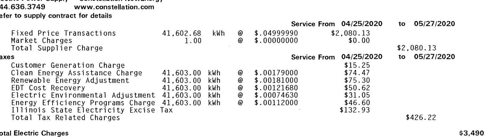

The image is a section of a billing statement. It contains detailed information about electric charges and taxes for a specific period.

- **Supplier Charges:**
  - **Fixed Price Transactions:** 41,602.68 kWh @ $0.04999990 = $2,080.13
  - **Market Charges:** 1.00 @ $0.00000000 = $0.00
  - **Total Supplier Charge:** $2,080.13

- **Taxes:**
  - **Customer Generation Charge:** 41,603.00 kWh @ $0.00179000 = $15.25
  - **Clean Energy Assistance Charge:** 41,603.00 kWh @ $0.00181000 = $74.47
  - **Renewable Energy Adjustment:** 41,603.00 kWh @ $0.00121680 = $75.30
  - **EDT Cost Recovery:** 41,603.00 kWh @ $0.00121680 = $50.62
  - **Electric Environmental Adjustment:** 41,603.00 kWh @ $0.00074630 = $31.05
  - **Energy Efficiency Programs Charge:** 41,603.00 kWh @ $0.00112000 = $46.60
  - **Illinois State Electricity Excise Tax:** $132.93
  - **Total Tax Related Charges:** $426.22

- **Total Electric Charges:** $3,490.90

The service period for these charges is from 04/25/2020 to 05/27/2020.

Total Electric Charges
The current billed amount of \$ 3,490.90 is due on Aug 11, 2020 .
Current Total Due (Account)
\$3,490.90

Current Total Due
\$21,387.40
Please Note: The Current Total Due(above) reflects only charges incurred during this billing period. Please remit the Total Amount Due on this account noted on the first page of this bill (located in the box to the right of the Total Amount Due By date).

$\cdot$
$\cdot$
$\cdot$
$\cdot$
$\cdot$

