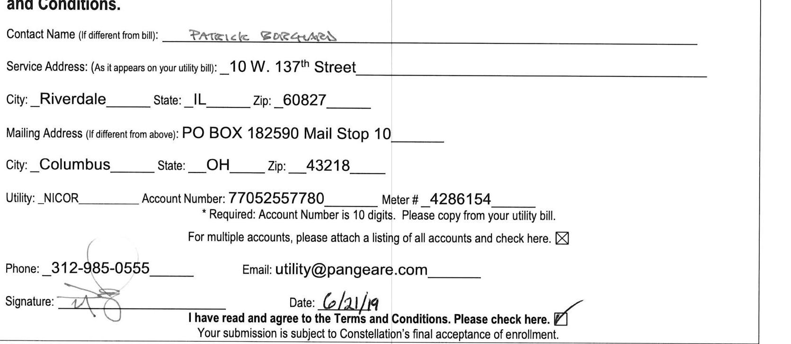

# Constellation 

«License»

## Commercial Customer Acknowledgement Form

## (Fixed Price)

I confirm that my sales representative explained that he or she is an employee of Constellation NewEnergy - Gas Division, LLC ("Constellation") and has provided me with the following information:

1. I am entering into a contract with Constellation and not with my utility. My utility will continue to deliver the gas, read my meter, send me one consolidated bill, and provide emergency services.
2. This contract covers the cost of the natural gas itself. In addition, I will continue to pay regulated delivery costs billed by the utility and any additional taxes that may be imposed.
3. Constellation will supply natural gas at the fixed price per therm indicated on the Commercial Natural Gas Supplier Enrollment Form attached hereto. This price will not change for the term of my contract.
4. I understand that my sales representative is an independent agent of Constellation and does not represent my utility.
5. I will continue to be supplied with natural gas for my business whether or not I sign this contract. If I choose to remain with my utility, the price will continue to be set subject to regulatory tariff provisions.
6. This Commercial Customer Acknowledgement Form, Commercial Natural Gas Supplier Enrollment Form and the Terms and Conditions attached hereto are my complete agreement with Constellation, and the agent has no authority to change or add to that contract.

Questions? Contact us at (855) 465-1244

I have read and agree to this Commercial Customer Acknowledgement Form.

Please Initial Here: $\qquad$

# Constellation 

«License»

## Commercial Natural Gas Supplier Enrollment Form

To: $\quad$ Constellation NewEnergy - Gas Division, LLC
I. $\qquad$ PANGEA VENTURES,LLG

Please print your name as it appears on your utility bill.
acknowledge that I am the account holder, a person legally authorized to execute a contract on behalf of the account holder. I understand that by signing this agreement, I am switching the gas supplier for this account to Constellation and authorize Constellation to initiate service and begin enrollment. I understand that gas purchased for this account by Constellation will be delivered through my utility's delivery system. Complete details on the terms of cancellation are outlined on the accompanying Terms and Conditions.

The image is a photo of a form. 

Embedded text includes:

- "Contact Name (If different from bill): PATRICK BORCHARD"
- "Service Address: (As it appears on your utility bill): 10 W. 137th Street"
- "City: Riverdale State: IL Zip: 60827"
- "Mailing Address (If different from above): PO BOX 182590 Mail Stop 10"
- "City: Columbus State: OH Zip: 43218"
- "Utility: NICOR Account Number: 77052557780 Meter # 4286154"
- "* Required: Account Number is 10 digits. Please copy from your utility bill."
- "For multiple accounts, please attach a listing of all accounts and check here. ☐"
- "Phone: 312-985-0555"
- "Email: utility@pangeare.com"
- "Signature: [signature]"
- "Date: 6/21/19"
- "I have read and agree to the Terms and Conditions. Please check here. ☑"
- "Your submission is subject to Constellation’s final acceptance of enrollment."

Spatial relationships:
- The contact name is at the top.
- Service address details are below the contact name.
- Mailing address details are below the service address.
- Utility information is below the mailing address.
- Phone and email are at the bottom left.
- Signature and date are at the bottom right.
- A checkbox for terms and conditions is at the bottom right.

## I have carefully selected the following options:

The Primary Term of my agreement shall begin on the date set by my utility after my enrollment during the month of August 2019 and shall continue for $\qquad$ 24 $\qquad$ months at a rate of $\$ \quad 0.2809$ $\qquad$ per therm. If for some reason we are unable to begin serving during the month specified, the Primary Term will start on the date set by my utility after my enrollment and shall continue for $\qquad$ 24 $\qquad$ months at a rate of $\$ 0.2809$ $\qquad$ per therm.

Constellation NewEnergy - Gas Division, LLC
By: $\qquad$

Questions? Contact us at (855) 465-1244 or home@constellation.com

# Constellation 

## «License»

## TERMS AND CONDITIONS

1. Constellation Services. I want Constellation NewEnergy - Gas Division, LLC ("Constellation") to supply all the natural gas I need to heat my business and for other related uses. Constellation may cancel this Agreement if my usage of gas changes substantially, which shall be defined as an absolute variance of twenty (20) percent or more (exclusive of any expected weather impact) from the previous twelve (12) months' usage for each respective month. I am 18 years of age or older, and I am fully authorized to enter into this Agreement. These terms and conditions, the Enrollment Form or Welcome Letter, and any Renewal Notice (if applicable) reflect my entire Agreement with Constellation ("Agreement") and supersede any oral or written agreements made in connection with this Agreement or my natural gas supply.
2. Local Utility Services. My utility will continue to deliver gas to me, read my meter, and provide emergency and other services it has provided in the past. The natural gas I buy from Constellation will be included in my utility monthly bill or in a separate bill from Constellation.
3. Term. My supply will begin on the day that my utility switches my account to Constellation and will continue for the term indicated in my Enrollment Form or Welcome Letter. This Agreement is subject to the eligibility requirements of my utility, and Constellation may choose not to accept this contract for any reason.
4. Rate. Each month I will pay my bill for my natural gas, which will be calculated by multiplying (i) the rate charged per therm of gas as indicated on my Enrollment form or Welcome Letter by (ii) the amount of gas used in the billing cycle plus (iii) any applicable fees associated with my rate plan plus (iv) applicable taxes, fees, and charges levied by the utility for distribution and other services. This rate may be higher or lower than the utility's rate in any given month. If I am receiving a separate bill from Constellation for my natural gas I will also pay a monthly customer service fee not to exceed $\$ 5.95$.
5. Administration Fee. A customer administration charge in the amount listed on my Enrollment Form or Welcome Letter will be added to the monthly bill for natural gas if applicable.
6. Renewal Notice; Notification of Changes. At least 30 days prior to the termination date, Constellation, in its discretion, may offer to renew my contract by mailing me written notification on the same or different conditions, in which case my contract shall automatically renew consistent with the conditions indicated in the notice unless I notify Constellation otherwise prior to the termination of my current Agreement with Constellation. If the renewal notice indicates that this Contract will be renewed at a Monthly Variable Price, the Monthly Variable Price will be set in Constellation's discretion and may vary from month to month based on Constellation's assessment of applicable market conditions, historic and projected supply and hedging costs, prior months pricing and balancing costs, projected average customer bill amounts and utility pricing. My Monthly Variable Price may include the following additional costs: balancing costs, transportation costs, line loss costs, storage costs, pooling charges, credit costs and a profit margin determined in Constellation's discretion that may vary from month to month.
7. Termination. My Agreement with Constellation may be cancelled as follows:

- If I am a commercial customer who consumes more than 5,000 therms annually, the cost recovery fee will be the greater of $\$ 150$ or the amount of gas I failed to consume during the remainder of my fixed term, calculated on the basis of prior usage, multiplied by the excess, if any, of my Fixed Rate over the rate at which Constellation can sell such gas at the time of my termination. The cost recovery fee is not a penalty, but compensates Constellation for the cost of buying gas in advance on my behalf.
- If the Illinois Commerce Commission ("ICC") or my utility decides to end or change the program under which I buy gas, Constellation may cancel this contract upon 30 days advance written notice.
- If I fail to pay my natural gas bill in a timely manner my utility may terminate my eligibility for the Select Program and Constellation may terminate this Agreement.
- If I move to a location outside the state of Illinois, or to a location without a transportation service program, or to a location where I do not require gas service, I may cancel this Agreement without penalty.

8. Bill Payment. Constellation may bill me directly and separately from my utility. If I do not pay my bill on time, I will be subject to a late payment fee for undisputed amounts in the amount of $1.5 \%$ per month, and collection costs incurred due to my late payment or nonpayment. If Customer, in good faith, disputes the amount of any such invoice or any part thereof, Customer will pay such amount as it concedes to be correct; provided, however, if Customer disputes the amount due, it must provide supporting documentation acceptable in industry practice to support the amount paid or disputed. In the event the Parties are unable to resolve such dispute, either Party may pursue any remedy available at law or in equity to enforce its rights pursuant to this Section 8. All returned checks will be subject to the maximum fee allowed by law. If I fail to pay my bill, Constellation may cancel our Agreement by providing me with 15 days written notice.
9. Dispute Resolution. Constellation will refer all complaints to a person who will acknowledge them promptly and work out a mutually satisfactory resolution. If I am still unhappy, I may contact a Constellation supervisor by calling (855) 465-1244, who will respond to me promptly. If my questions are not resolved after I have called Constellation, I may call the ICC toll free at (800) 524-0795 or TTY at (800) 858-9277, from 8:30 A.M. to 5:00 P.M. - weekdays, visit the ICC website at www.icc.illinois.gov or as otherwise specified by the commission. I may also call the Citizens Utility Board ("CUB") toll free at (800) 669-5556 from 8:30 A.M. to 5:30 P.M. weekdays, or visit the CUB website at www.citizensutilityboard.gov or as otherwise specified by the CUB.

## FOR INTERNAL USE ONLY

(c)2017 Constellation Energy Resources, LLC. The foregoing offering is sold and contracted by Constellation NewEnergy - Gas Division, LLC, a subsidiary of Exelon Corporation. Errors and omissions excepted.CNEG_IL_NICOR_PEOPLES_NS_Above5000therm_SMB_Fixed_10.12.17 Non-standard: legal revisions

# Constellation 

## «License»

10. Emergency. IF I SMELL GAS I SHOULD IMMEDIATELY CALL MY UTILITY AT: NICOR AT (888) 642-6748; PEOPLES AT (866) 556-6001; OR NORTH SHORE AT (866) 556-6004.
11. Limitations of Liability; Jury Trial and Class Action Waiver. CONSTELLATION WILL NOT BE RESPONSIBLE FOR ANY TYPE OF SPECIAL, CONSEQUENTIAL OR PUNITIVE DAMAGES WHATSOEVER. CONSTELLATION DOES NOT GIVE ANY TYPE OF WARRANTY, EXPRESS OR IMPLIED, AND TO THE FULL EXTENT OF THE LAW DISCLAIMS ANY WARRANTY OF MERCHANTABILITY OR FITNESS FOR A PARTICULAR PURPOSE. BOTH PARTIES WAIVE ANY RIGHT TO A TRIAL BY JURY OR TO INITIATE OR BECOME A PARTY TO ANY CLASS ACTION CLAIMS IN RESPECT OF ANY ACTION, SUIT OR PROCEEDING DIRECTLY OR INDIRECTLY ARISING OUT OF OR RELATING TO THIS AGREEMENT.
12. Force Majeure. Constellation will not be responsible for supplying natural gas to me in the event of circumstances beyond its control such as events of Force Majeure as defined by the utility or any transmitting or transportation entity, acts of terrorism or sabotage, or acts of God. If there is a change in any law, rule or pricing structure which results in Constellation's being prevented, prohibited or frustrated from carrying out the terms of our Agreement, Constellation may cancel it.
13. Insolvency. I acknowledge that this Agreement is a forward contract that you may terminate or liquidate in the event of my insolvency, bankruptcy, or reorganization for the benefit of creditors. In the case of termination or liquidation I will owe you the amount equal to the Cost of Cover as calculated above.
14. Information Release Authorization. Throughout the term, I authorize Constellation to obtain information from the Utility that includes, but is not limited to, account name, account number, billing address, service address, telephone number, standard offer service type, historical and future natural gas usage, rate classification, meter readings, characteristics of natural gas service and, when charges hereunder are included on my Utility bill, billing and payment information from the Utility. I authorize Constellation to release such information to third parties that need to know such information in connection with my natural gas service and to Constellation's affiliates and subcontractors. These authorizations shall remain in effect as long as this Agreement is in effect. I may rescind these authorizations at any time by either calling or providing written notice to Constellation. Constellation reserves the right to reject my enrollment or terminate the Agreement in the event these authorizations are rescinded, I fail to meet or maintain satisfactory credit standing as reasonably determined by Constellation, or I fail to meet minimum or maximum threshold consumption levels, which shall be defined as an absolute variance of twenty (20) percent or more (exclusive of any expected weather impact) from the previous twelve (12) months' usage for each respective month. as determined by Constellation. If I fail to remit payment in a timely fashion, Constellation may report the delinquency to a credit-reporting agency.
15. Miscellaneous. I understand that there may be delays before Constellation switches my account and that Constellation may choose not to accept this contract for any reason whatsoever. Unless otherwise stated herein, any changes to our Agreement must be made in writing. I authorize Constellation to perform a credit check on me through the utility or by using outside sources. Constellation may ask commercial customers for credit enhancements or adequate assurance of their ability to perform their obligations under this Agreement, which must be provided within 30 days of such request. Customer may not assign this Agreement without Constellation's prior written consent. Constellation may assign this contract to another supplier authorized by the utility provided that Constellation gives me 30 days written notice, and the assignee assumes all of Constellation's responsibilities and duties under this contract. Any required notice shall be deemed to have been made if mailed to the appropriate party at the last known mailing address. For purposes of accounting both parties accept the quantity, quality, and measurement determined by the utility. Except as provided by law, all taxes due and payable with respect to my obligations under this Agreement shall be paid by me.

