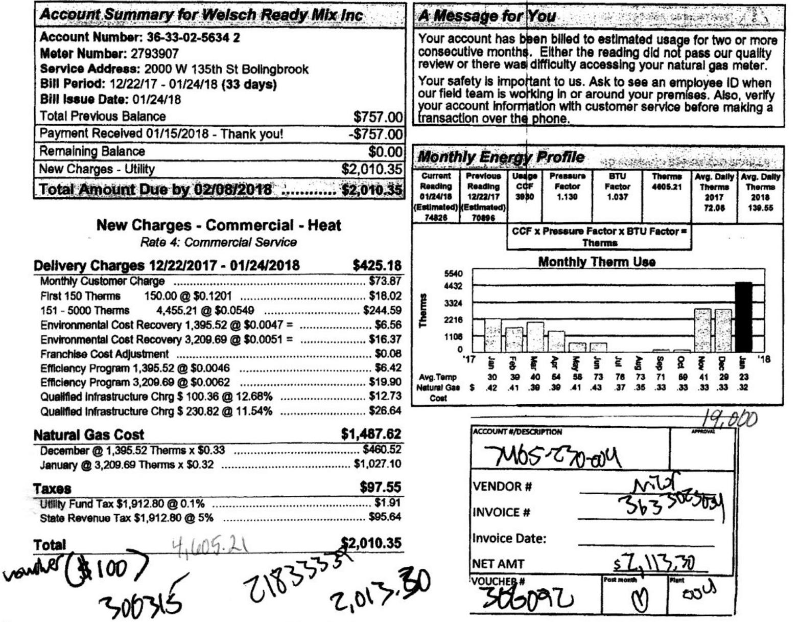
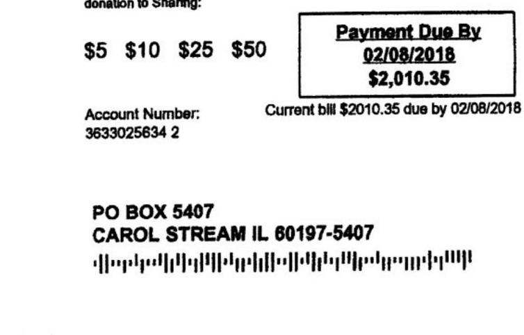

# A Nicor Gas Bolingbroek Plowit 44 nicorgas.com/myaccount 1888 Nicor4U 1888 642-6748 

The image is a photo of a utility bill for Welsch Ready Mix Inc. from Nicor Gas. It includes various sections detailing account information, charges, and a graph.

- **Account Summary for Welsch Ready Mix Inc.**
  - Account Number: 36-33-02-5634 2
  - Meter Number: 2793907
  - Service Address: 2000 W 135th St Bolingbrook
  - Bill Period: 12/22/17 - 01/24/18 (33 days)
  - Bill Issue Date: 01/24/18
  - Total Previous Balance: $757.00
  - Payment Received 01/15/2018 - Thank you! -$757.00
  - Remaining Balance: $0.00
  - New Charges - Utility: $2,010.35
  - Total Amount Due by 02/08/2018: $2,010.35

- **New Charges - Commercial - Heat**
  - Delivery Charges 12/22/2017 - 01/24/2018: $425.18
    - Monthly Customer Charge: $73.87
    - First 150 Therms: 150.00 @ $0.1201 = $18.02
    - 151 - 5000 Therms: 4,455.21 @ $0.0549 = $244.59
    - Environmental Cost Recovery: 1,395.52 @ $0.0047 = $6.56
    - Environmental Cost Recovery: 3,209.69 @ $0.0051 = $16.37
    - Franchise Cost Adjustment: $0.10
    - Efficiency Program: 1,395.52 @ $0.0046 = $6.42
    - Efficiency Program: 3,209.69 @ $0.0128 = $41.10
    - Qualified Infrastructure Chrg: 3,209.69 @ 12.68% = $406.90
    - Qualified Infrastructure Chrg: 3,209.69 @ 11.54% = $370.64

- **Natural Gas Cost**
  - December @ 1,395.52 Therms x $0.302 = $420.52
  - January @ 3,209.69 Therms x $0.32 = $1,027.06

- **Taxes**
  - Utility Fund Tax 1,912.80 @ 0.1% = $1.91
  - State Revenue Tax 1,912.80 @ 5% = $95.55

- **Total**: $2,010.35

- **A Message for You**
  - Your account has been billed to estimated usage for two or more consecutive months. Either the reading did not pass our quality review or there was difficulty accessing your natural gas meter.
  - Your safety is important to us. Ask to see an employee ID when our field team is working in or around your premises. Also, verify your account information with customer service before making a transaction over the phone.

- **Monthly Energy Profile**
  - Current Reading 01/24/18 (Estimated): 74826
  - Previous Reading 12/22/17 (Estimated): 70996
  - Used CCF: 3830
  - Pressure Factor: 1.130
  - BTU Factor: 1.037
  - Therms: 4065.21
  - Avg. Daily Therms 2018: 139.55
  - Avg. Daily Therms 2017: 72.08
  - Graph titled "Monthly Therm Use" showing therm usage from '17 to '18 with a notable increase in January '18.

- **Account/Description**
  - VENDOR #: Nicor
  - INVOICE #: 3633500504
  - Invoice Date: 
  - NET AMT: $2,113.30
  - VOUCHER #: 300092

Handwritten notes include numbers and calculations such as "19,000," "100," "2183335," "300735," and "2,013.30."

Please see the reverse side of this bill for additional billing explanations.
Please do not include written inquiries as the stub is processed by machine. Return this portion with your check made payable to Nicor Gas.

## A Nicor Gas

PO Box 2020
Aurora, IL 60507-2020

AV 01 02104184047859 A**SDGT
$\left.\||\|\||\|\|\|\|\|\|\|\|\|\|\|\|\|\|\|\|\|\|\|\|\|\|\|\|\|\|\|\|\|\|\|\|\|\|\|\|\|\|\|\|\|\|\|\|\|\|\|\|\|\|\|\|\|\|\|\|\|\|\|\|\|\|\|\|\|\|\|\|\|\|\|\|\|\||\||\|\||\||\||\||\||\||\||\||\||\||\||\||\||\||\||\||\||\||\||\||\||\||\||\||\||\||\||\||
| Welsch Ready Mix Inc 4243 166TH ST Oak Forest IL 60452-4608

The image is a photo of a section of a utility bill. It includes the following details:

- Options for donation amounts: $5, $10, $25, $50.
- "Payment Due By 02/08/2018 $2,010.35" is prominently displayed.
- "Account Number: 3633025634 2"
- "Current bill $2010.35 due by 02/08/2018"
- Address: "PO BOX 5407 CAROL STREAM IL 60197-5407"
- There is a barcode at the bottom of the image.

