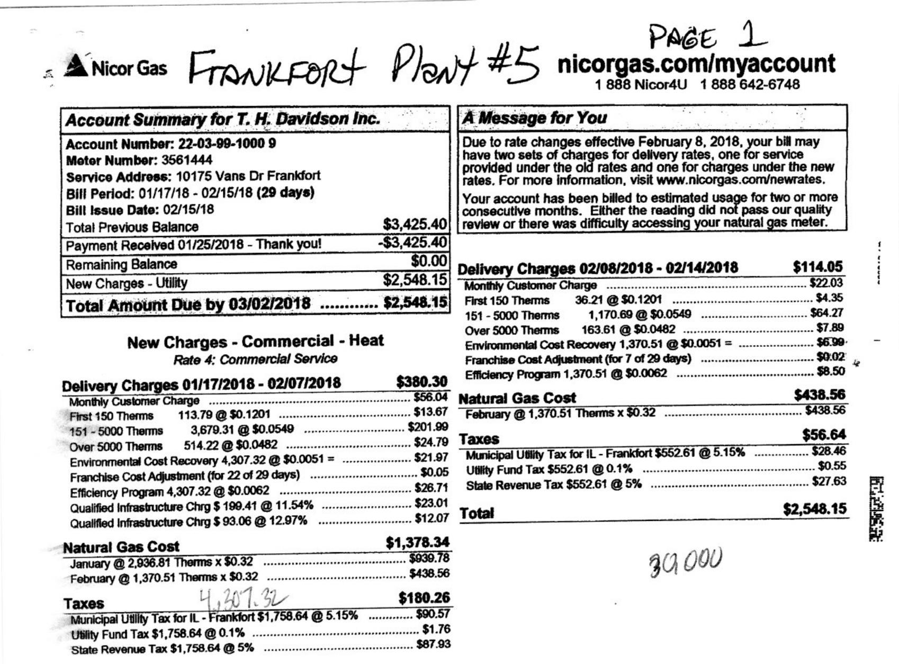

The image is a photo of a utility bill from Nicor Gas for T. H. Davidson Inc. It includes detailed billing information and charges.

- **Header Information:**
  - "Nicor Gas"
  - "FRANKFORT PLANT #5"
  - "PAGE 1"
  - "nicorgas.com/myaccount"
  - "1 888 Nicor4U"
  - "1 888 642-6748"

- **Account Summary:**
  - "Account Summary for T. H. Davidson Inc."
  - "Account Number: 22-03-99-1000 9"
  - "Meter Number: 3561444"
  - "Service Address: 10175 Vans Dr Frankfort"
  - "Bill Period: 01/17/18 - 02/15/18 (29 days)"
  - "Bill Issue Date: 02/15/18"
  - "Total Previous Balance $3,425.40"
  - "Payment Received 01/25/2018 - Thank you! -$3,425.40"
  - "Remaining Balance $0.00"
  - "New Charges - Utility $2,548.15"
  - "Total Amount Due by 03/02/2018 $2,548.15"

- **New Charges - Commercial - Heat:**
  - "Rate 4: Commercial Service"

- **Delivery Charges 01/17/2018 - 02/07/2018:**
  - "Monthly Customer Charge $56.64"
  - "First 150 Therms 113.79 @ $0.1201 $13.67"
  - "151 - 5000 Therms 3,679.31 @ $0.0549 $201.99"
  - "Over 5000 Therms 514.22 @ $0.0482 $24.82"
  - "Environmental Cost Recovery 4,307.32 @ $0.0051 $21.97"
  - "Franchise Cost Adjustment (for 22 of 29 days) $26.71"
  - "Efficiency Program 4,307.32 @ $0.0062 $26.71"
  - "Qualified Infrastructure Chrg $ 199.41 @ 11.54% $23.01"
  - "Qualified Infrastructure Chrg $ 93.06 @ 12.97% $12.07"
  - "Total $380.30"

- **Delivery Charges 02/08/2018 - 02/14/2018:**
  - "Monthly Customer Charge $22.03"
  - "First 150 Therms 36.21 @ $0.1201 $4.35"
  - "151 - 5000 Therms 1,170.69 @ $0.0549 $64.27"
  - "Over 5000 Therms 163.61 @ $0.0482 $7.89"
  - "Environmental Cost Recovery 1,370.51 @ $0.0051 $6.99"
  - "Franchise Cost Adjustment (for 7 of 29 days) $8.50"
  - "Efficiency Program 1,370.51 @ $0.0062 $8.50"
  - "Total $114.05"

- **Natural Gas Cost:**
  - "January @ 2,936.81 Therms x $0.32 $938.78"
  - "February @ 1,370.51 Therms x $0.32 $438.56"
  - "Total $1,378.34"

- **Taxes:**
  - "Municipal Utility Tax for IL - Frankfort $1,758.64 @ 5.15% $90.57"
  - "Utility Fund Tax $552.61 @ 0.1% $0.55"
  - "State Revenue Tax $1,758.64 @ 5% $87.93"
  - "Total $180.26"

- **Total Amount Due:**
  - "$2,548.15"

- **A Message for You:**
  - "Due to rate changes effective February 8, 2018, your bill may have two sets of charges for delivery rates, one for service provided under the old rates and one for charges under the new rates. For more information, visit www.nicorgas.com/newrates."
  - "Your account has been billed to estimated usage for two or more consecutive months. Either the reading did not pass our quality review or there was difficulty accessing your natural gas meter."

- **Handwritten Note:**
  - "39,000"

Please see the reverse side of this bill for additional billing explanations.
Please do not include written inquiries as the stub is processed by machine. Return this portion with your check made payable to Nicor Gas:
Please circle an amount to add a one-time charitable donation to Sharing:

## $Nicor Gas

PO Box 2020
Aurora, IL 60507-2020

AV 01 020648 96761B 59 D**SDGT
(I) $0.00000000000000000000000000000000000000000000000000000000000
T. H. Davidson Inc.

4243 166TH ST
OAK FOREST IL 60452-4608

## $5 \$ 10 \$ 25 \$ 50$

Account Number:
22039910009

## Payment Due By

$0.000
Current bill $\$ 2548.15$ due by 03/02/2018

